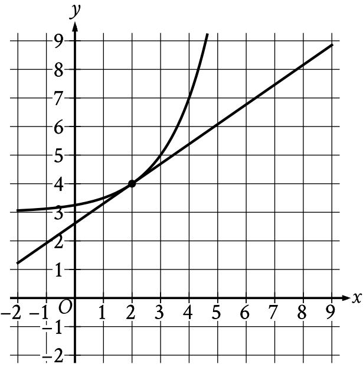

{0}------------------------------------------------

# Question ID 3c95093c

| Assessment | Test | Domain        | Skill                                                                                     | Difficulty |
|------------|------|---------------|-------------------------------------------------------------------------------------------|------------|
| SAT        | Math | Advanced Math | Nonlinear equations in one variable and systems of equations in two variables |            |

| ID: 3c95093c |
|--------------|
|--------------|

6x-9y > 12

1.1

Which of the following inequalities is equivalent to the inequality above?

A. x-y>2

B. 2x - 3y > 4

C. 3x-2y>4

D. 3y-2x > 2

#### ID: 3c95093c Answer

Correct Answer: B

Rationale

Choice B is correct. Both sides of the given inequality can be divided by 3 to yield 2x – 3y > 4.

Choices A, C, and D are incorrect because they are not equivalent to (do not have the same solution set as) the given inequality. For example, the ordered pair (0, – 1.5) is a solution to the given inequality, but it is not a solution to any of the inequalities in choices A, C, or D.

{1}------------------------------------------------

# Question ID 4ca30186

| Assessment | Test | Domain        | Skill                                                                                     | Difficulty |
|------------|------|---------------|-------------------------------------------------------------------------------------------|------------|
| SAT        | Math | Advanced Math | Nonlinear equations in one variable and systems of equations in two variables | 100        |

### ID: 4ca30186

1.2

The graph of a system of a linear equation and a nonlinear equation is shown. What is the solution (മു ഗു) to this system?

- A. (0,0)
- B. (0, 2)
- c. (2, 4)
- D. (4,0)

### ID: 4ca30186 Answer

Correct Answer: C

Rationale

Choice C is correct. The solution to the system of two equations corresponds to the point where the graphs of the equations intersect. The graphs of the linear equation and the nonlinear equation shown intersect at the point (2, 4). Thus, the solution to the system is (2, 4).

Choice A is incorrect and may result from conceptual or calculation errors.

{2}------------------------------------------------

Choice B is incorrect and may result from conceptual or calculation errors.

Choice D is incorrect and may result from conceptual or calculation errors.

{3}------------------------------------------------

# Question ID 3de7a7d7

| Assessment | Test | Domain        | Skill                                                                                     | Difficulty |
|------------|------|---------------|-------------------------------------------------------------------------------------------|------------|
| SAT        | Math | Advanced Math | Nonlinear equations in one variable and systems of equations in two variables |            |

### ID: 3de7a7d7

1.3

Which of the following is a solution to the equation 2x2-4 = x2 ?

A. 1

B. 2

C. 3

D. 4

#### ID: 3de7a7d7 Answer

Correct Answer: B

Rationale

2 from both sides of the given equation yields x = = 4 = 0. Adding 4 to both Choice B is correct. Subtracting x sides of the equation gives x = 4. Taking the square root of both sides of the equation gives x = 2 or x = −2. Therefore, x = 2 is one solution to the original equation.

Alternative approach: Subtracting x from both sides of the given equation yields x = 4 = 0. Factoring this equation gives x – 4 = (x + 2)(x – 2) = 0, such that x = 2 or x = −2. Therefore, x = 2 is one solution to the original equation.

Choices A, C, and D are incorrect and may be the result of computation errors.

{4}------------------------------------------------

## Question ID 70f98ab4

| Assessment | Test | Domain        | Skill                                                                                     | Difficulty |
|------------|------|---------------|-------------------------------------------------------------------------------------------|------------|
| SAT        | Math | Advanced Math | Nonlinear equations in one variable and systems of equations in two variables |            |

ID: 70f98ab4

1.4

#### q — 29r = s

The given equation relates the positive numbers ഗ്ല, and ട. Which equation correctly expresses g in terms of ന and s?

A. q = s - 29r B. q = s + 29r C. q = 29rs D. q =

#### ID: 70f98ab4 Answer

Correct Answer: B

Rationale

Choice B is correct. Adding 29r to each side of the given equation yields q = s + 29r. Therefore, the equation q = s + 29r correctly expresses q in terms of r and s.

Choice A is incorrect and may result from conceptual or calculation errors.

Choice C is incorrect and may result from conceptual or calculation errors.

Choice D is incorrect and may result from conceptual or calculation errors.

{5}------------------------------------------------

## Question ID 568aaf27

| Assessment | Test | Domain        | Skill                                                                                     | Difficulty |
|------------|------|---------------|-------------------------------------------------------------------------------------------|------------|
| SAT        | Math | Advanced Math | Nonlinear equations in one variable and systems of equations in two variables |            |

ID: 568aaf27 x+y=12 y = x2

1.5

If (x y) is a solution to the system of equations above, which of the following is a possible value of x?

A. O

B. 1

- C. 2
D. 3

#### ID: 568aaf27 Answer

Correct Answer: D

Rationale

Choice D is correct. Substituting X from the second equation for y in the first equation yields X + x = 12 Subtracting 12 from both sides of this equation and rewriting the equation results in X2 +x −12 = 0. Factoring the left-hand side of this equation yields (x −3)(x +4) = 0. Using the zero product property to solve for x, it follows that x - 3 = 0 and x + 4 = 0. Solving each equation for x yields x = 3 and x = = 4, respectively. Thus, two possible values of x are 3 and —4. Of the choices given, 3 is the only possible value of x.

Choices A, B, and C are incorrect. Substituting 0 for x in the first equation gives 0 + y = 12, or y = 12; then, substituting 12 for y and 0 for x in the second equation gives 12 = 02, or 12 = 0, which is false. Similarly, substituting 1 or 2 for x in the first equation yields y = 11 or y = 10, respectively; then, substituting 11 or 10 for y in the second equation yields a false statement.

{6}------------------------------------------------

## Question ID b76a2815

| Assessment   | Test | Domain        | Skill                                                                                     | Difficulty                                                                                                                                                                     |  |
|--------------|------|---------------|-------------------------------------------------------------------------------------------|--------------------------------------------------------------------------------------------------------------------------------------------------------------------------------|--|
| SAT          | Math | Advanced Math | Nonlinear equations in one variable and systems of equations in two variables | ------------------------------------------------------------------------------------------------------------------------------------------------------------------------------ |  |
| ID: b76a2815 |      |               |                                                                                           |                                                                                                                                                                                |  |

The power P produced by a machine is represented by the equation above, where W is the work performed during an amount of time t. Which of the following correctly expresses W in terms of P and t ?

$$\mathsf{A. } \mathsf{M} = \mathsf{P}t$$

$$\mathcal{W} = \frac{P}{t}$$

$$\text{c. } \mathcal{W} = \frac{t}{P}$$

D.W=P+t

#### ID: b76a2815 Answer

Correct Answer: A

Rationale

Choice A is correct. Multiplying both sides of the equation by t yields expresses W in terms of P and t. This is equivalent to W = Pt.

Choices B, C, and D are incorrect. Each of the expressions qiven in these answer choices qives W in terms of P and t but doesn't maintain the given relationship between W, P, and t. These expressions may result from performing different operations with t on each side of the equation. In choice B, W has been multiplied by t, and P has been divided by t. In choice C, W has been multiplied by t, and the quotient of P divided by t has been reciprocated. In choice D, W has been multiplied by t, and P has been added to t. However, in order to maintain the relationship between the variables in the given equation, the same operation must be performed with t on each side of the equation.

{7}------------------------------------------------

# Question ID c7789423

| Assessment | Test | Domain        | Skill                                                                                     | Difficulty |
|------------|------|---------------|-------------------------------------------------------------------------------------------|------------|
| SAT        | Math | Advanced Math | Nonlinear equations in one variable and systems of equations in two variables |            |

ID: c7789423

1.7

$$|x - 2| = 9$$

What is one possible solution to the given equation?

#### ID: c7789423 Answer

Correct Answer: 11, -7

Rationale

The correct answer is 11 or -7. By the definition of absolute value, if |x - 2| = 9, then x - 2 = 9 or x - 2 = - 9. Adding 2 to both sides of the equation x - 2 = 9 yields x = 11. Adding 2 to both sides of the equation x — 2 = - 9 yields x = — 7. Thus, the given equation, |x — 2| = 9, has two possible solutions, 11 and —7. Note that 11 and -7 are examples of ways to enter a correct answer.
{8}------------------------------------------------

### Question ID eb268057

| Assessment | Test | Domain        | Skill                                                                                     | Difficulty |
|------------|------|---------------|-------------------------------------------------------------------------------------------|------------|
| SAT        | Math | Advanced Math | Nonlinear equations in one variable and systems of equations in two variables |            |

| ID: eb268057                       |
|------------------------------------|
| x = = 64                           |
| Which of the following values of x |
| satisfies the given equation?      |

A. -8

B. 4

c. 32

D. 128

#### ID: eb268057 Answer

Correct Answer: A

Rationale

Choice A is correct. Solving for x by taking the square root of both sides of the given equation yields x = 8 or

x = - 8. Of the choices given, - 8 satisfies the given equation.

Choice B is incorrect and may result from a calculation error when solving for x. Choice C is incorrect and may result from dividing 64 by 2 instead of taking the square root. Choice D is incorrect and may result from multiplying 64 by 2 instead of taking the square root.

Question Difficulty: Easy

1.8

{9}------------------------------------------------

# Question ID 98f735f2

| Assessment | Test | Domain        | Skill                                                                                     | Difficulty |
|------------|------|---------------|-------------------------------------------------------------------------------------------|------------|
| SAT        | Math | Advanced Math | Nonlinear equations in one variable and systems of equations in two variables |            |

ID: 98f735f2

1.9

The total revenue from sales of a product can be calculated using the formula T = PQ, where T is the total revenue, P is the price of the product,

and Q is the quantity of the product sold. Which of the following equations gives the quantity of product sold in terms of P and T ?

$$\text{A. } \text{Q} = \frac{P}{T}$$

$$\text{L}$$

$$\mathbf{_{B.}} \mathbf{Q} = \frac{\iota}{P}$$

c. Q=PT

D. Q=T-P

### ID: 98f735f2 Answer

Correct Answer: B

Rationale

Choice B is correct. Solving the given equation for Q gives the quantity of the product sold in terms of P and T. Dividing both sides of the given equation by P yields P P gives the quantity of product sold in terms of P and T.

Choice A is incorrect and may result from an error when dividing both sides of the given equation by P. Choice C is incorrect and may result from multiplying, rather than dividing, both sides of the given equation by P. Choice D is incorrect and may result from subtracting P from both sides of the equation rather than dividing both sides by P.

{10}------------------------------------------------

# Question ID fcb78856

| Assessment | Test | Domain        | Skill                                                                                     | Difficulty |
|------------|------|---------------|-------------------------------------------------------------------------------------------|------------|
| SAT        | Math | Advanced Math | Nonlinear equations in one variable and systems of equations in two variables |            |

ID: fcb78856

1.10

### b = 42cf

The given equation relates the positive numbers b, c, and f . Which equation correctly expresses c in terms of b and f?

A. C = B. c : C. c = 42bf D. c = 42 -

### ID: fcb78856 Answer

Correct Answer: A

Rationale

Choice A is correct. It's given that the equation b = 42cf relates the positive numbers by correctly expresses c in terms of band f.

Choice B is incorrect. This equation can be rewritten as b = cf + 42

Choice C is incorrect. This equation can be rewritten as b = antif

Choice D is incorrect. This equation can be rewritten as b = 42 - c - f.

{11}------------------------------------------------

### Question ID 4236c5a3

| Assessment | Test | Domain        | Skill                                                                                     | Difficulty |
|------------|------|---------------|-------------------------------------------------------------------------------------------|------------|
| SAT        | Math | Advanced Math | Nonlinear equations in one variable and systems of equations in two variables |            |

### ID: 4236c5a3

1.11

If (x + 5)2 = 4, which of the following is a possible value of x ?

A. 1

B. -1

C. –2

D. -3

### ID: 4236c5a3 Answer

Correct Answer: D

Rationale

Choice D is correct. If (x + 5) = 4, then taking the square root of each side of the equation gives x +5 = 2 or x +5 = - 2. Solving these equations for x gives x = - 3 or x = —7. Of these, = 3 is the only solution given as a choice.

Choice A is incorrect and may result from solving the equation x +5 = 4 and making a sign error. Choice B is incorrect and may result from solving the equation x +5 = 4. Choice C is incorrect and may result from finding a possible value of x +5

{12}------------------------------------------------

# Question ID f11ffa93

| Assessment | Test | Domain        | Skill                                                                                     | Difficulty |
|------------|------|---------------|-------------------------------------------------------------------------------------------|------------|
| SAT        | Math | Advanced Math | Nonlinear equations in one variable and systems of equations in two variables |            |

ID: f11ffa93 vx+4 =11

1.12

What value of x satisfies the equation above?

### ID: f11ffa93 Answer

Rationale

The correct answer is 117. Squaring both sides of the given equation gives x +4 = 11°, or x +4 = 121. Subtracting 4 from both sides of this equation gives x = 117.

{13}------------------------------------------------

# Question ID 5639dd1a

| Assessment | Test | Domain        | Skill                                                                                     | Difficulty |
|------------|------|---------------|-------------------------------------------------------------------------------------------|------------|
| SAT        | Math | Advanced Math | Nonlinear equations in one variable and systems of equations in two variables |            |

### ID: 5639dd1a

1.13

x2 = (22)(22) What is the positive solution to the given equation?

### ID: 5639dd1a Answer

#### Correct Answer: 22

#### Rationale

The correct answer is 22. The given equation, x2 = 222, is equivalent to x2 = 22°. Taking the square root of each side of this equation yields x = ± 22. Thus, the positive solution to the given equation is 22.

{14}------------------------------------------------

# Question ID c1964c11

| Assessment | Test | Domain        | Skill                                                                                     | Difficulty |
|------------|------|---------------|-------------------------------------------------------------------------------------------|------------|
| SAT        | Math | Advanced Math | Nonlinear equations in one variable and systems of equations in two variables |            |

ID: c1964c11

1.14

### p + 34 = q + r

The given equation relates the variables ഇ, g, and r. Which equation correctly expresses p in terms of g and r?

A.p=q+r+34 B. p = q + r - 34 C.p=-q-r+34 D. p = - q - r - 34

### ID: c1964c11 Answer

#### Correct Answer: B

#### Rationale

Choice B is correct. Subtracting 34 from each side of the given equation yields ۾ = q + r - 34. Thus, the equation p = q + r - 34 correctly expresses p in terms of q and r.

Choice A is incorrect. This equation can be rewritten as p - 34 = q +r.

Choice C is incorrect. This equation can be rewritten as p - 34 = -q - r.

Choice D is incorrect. This equation can be rewritten as p + 34 = -q - r.