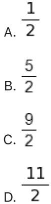
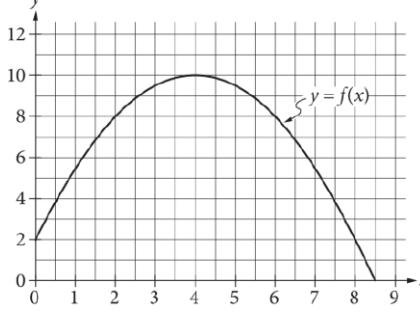

{0}------------------------------------------------

# Question ID fc3d783a

| Assessment | Test | Domain        | Skill                                                                                     | Difficulty |
|------------|------|---------------|-------------------------------------------------------------------------------------------|------------|
| SAT        | Math | Advanced Math | Nonlinear equations in one variable and systems of equations in two variables |            |

### ID: fc3d783a

3.1

In the æy-plane, a line with equation 2y = 4.5 intersects a parabola at exactly one point. If the parabola has equation y = - 4x2 + bx, where b is a positive constant, what is the value of b?

### ID: fc3d783a Answer

Correct Answer: 6

Rationale

The correct answer is 6. It's given that a line with equation 2y = 4.5 intersects a parabola with equation y = - 4x2 + bx, where b is a positive constant, at exactly one point in the xy-plane. It follows that the system of equations consisting of 2y = 4.5 and y = -4x - + bx has exactly one solution. Dividing both sides of the equation of the line by 2 yields y = 2. 25. Substituting 2.25 for y in the equation of the parabola yields 2. 25 = - 4x2 + bx. Adding 4x2 and subtracting bx from both sides of this equation yields 4x2 - bx + 2. 25 = 0. A quadratic equation in the form of ax2 + bx + c = 0, where a, b, and c are constants, has exactly one solution when the discriminant, b2 — 4ac, is equal to zero. Substituting 4 for a and 2.25 for c in the expression 62 — 4ac and setting this expression equal to 0 yields 62 — 4 (4) (2. 25) = 0, or 62 — 36 = 0. Adding 36 to each side of this equation yields b2 = 36. Taking the square root of each side of this equation yields b = ±6. It's given that b is positive, so the value of b is 6.

{1}------------------------------------------------

## Question ID 4661e2a9

| Assessment | Test | Domain        | Skill                                                                                     | Difficulty |
|------------|------|---------------|-------------------------------------------------------------------------------------------|------------|
| SAT        | Math | Advanced Math | Nonlinear equations in one variable and systems of equations in two variables |            |

ID: 4661e2a9 x-y=1 x + y = x2 - 3

3.2

Which ordered pair is a solution to the system of equations above?

- A. (1 + / 3, J3) B. (3, - V3) c. (1+15, J5)
- D. (15, -1+5)

### ID: 4661e2a9 Answer

Correct Answer: A

Rationale

Choice A is correct. The solution to the given system of equations can be found by solving the first equation for x, which gives x = y + 1, and substituting that value of x into the second equation which gives y +1 + y = (y + 1)2 - 3. Rewriting this equation by adding like terms and expanding (y + 1)2 gives 2y + 1 = y2 + 2y - 2. Subtracting 2y from both sides of this equation gives 1 = y - 2. Adding to 2 to both sides of this equation gives 3 = y2. Therefore, it follows that y = ±√3. Substituting √ 3 for y in the first equation yields x = √ 3 = 1. Adding √ 3 to both sides of this equation yields x = 1 + √ 3. Therefore, the ordered pair (1 +√ 3,√ 3) is a solution to the given system of equations.

Choice B is incorrect. Substituting √ 3 for x and −√ 3 for y in the first equation yields √ 3 −(−√ 3) = 1, or 2√3 = 1, which isn't a true statement. Choice C is incorrect. Substituting 1 +√ 5 for x and √ 5 for y in the second equation yields (1 +√5) +√5 = (1 +√5)² −3, or 1 +2√5 =2√5 +3, which isn't a true statement. Choice D is incorrect. Substituting √ 5 for x and (-1 +√ 5) for y in the second equation yields √5 +(-1 +√5) = (√5)2 = 3, or 2√5 - 1 = 2, which isn't a true statement.

{2}------------------------------------------------

# Question ID f65288e8

| Assessment | Test | Domain        | Skill                                                                                     | Difficulty |
|------------|------|---------------|-------------------------------------------------------------------------------------------|------------|
| SAT        | Math | Advanced Math | Nonlinear equations in one variable and systems of equations in two variables |            |

$$\text{ID:f65258583}$$

$$\frac{1}{\infty^2 + 10\chi + 25} = 4$$

3.3

If x is a solution to the given equation, which of the following is a possible value of x +5 ?

### ID: f65288e8 Answer

Correct Answer: A

Rationale

Choice A is correct. The given equation can be rewritten as (x +5)2 *. Multiplying both sides of this equation by (x +5) yields 1 = 4(x +5)2. Dividing both sides of this equation by 4 yields Taking -5. Therefore, a possible value of the square root of both sides of this equation yields 2 l x +5 is 2

Choices B, C, and D are incorrect and may result from computational or conceptual errors.

{3}------------------------------------------------

# Question ID f2f3fa00

| Assessment | Test | Domain        | Skill                                                                                     | Difficulty |
|------------|------|---------------|-------------------------------------------------------------------------------------------|------------|
| SAT        | Math | Advanced Math | Nonlinear equations in one variable and systems of equations in two variables |            |

ID: f2f3fa00

3.4

During a 5-second time interval, the average acceleration a, in meters per second squared, of an object with an initial velocity of 12 meters per second - 12 is defined by the equation , where vf is the final velocity of the object in meters per second. If the equation is rewritten in the form vf = xa + y, where x and y are constants, what is the value of x ?

ID: f2f3fa00 Answer

Rationale

The correct answer is 5. The given equation can be rewritten in the form y ; = xa +y, like so:

$$a = \frac{\nu_f - \text{12}}{5}$$

v; - 12=5a

$$\nu_f = 5a + 12$$

It follows that the value of x is 5 and the value of y is 12.

{4}------------------------------------------------

## Question ID 6ce95fc8

| Assessment | Test | Domain        | Skill                                                                                     | Difficulty |
|------------|------|---------------|-------------------------------------------------------------------------------------------|------------|
| SAT        | Math | Advanced Math | Nonlinear equations in one variable and systems of equations in two variables |            |

ID: 6ce95fc8 2x2-2=2x+3

Which of the following is a solution to the equation above?

A. 2

B. 1 - 11

$$\text{c. } \frac{1}{2} + \sqrt{11}$$

1 + √ 11 2 D.

### ID: 6ce95fc8 Answer

Correct Answer: D

Rationale

Choice D is correct. A quadratic equation in the form ax 2 + bx + c = 0, where a, b, and c are constants, can be -b ± v b2 - 4ac X = 2a . Subtracting 2x +3 from both sides of the given solved using the quadratic formula: equation yields 2x2 – 2x – 5 = 0. Applying the quadratic formula, where a = 2, b = – 2, yields -(-2) ±√(-2)2-4(2)(-5) x = 2+44 x = . Since v 44 = V 22(11), or 2 / 11, 2(2) 4 . This can be rewritten as the equation can be rewritten as x = 2 +2 + 11 ]
1 + - [1] = - 1 = - 1 = - 1 ] . Dividing 2 from both the numerator and denominator yields 1 + √ 11 1 - √ 11 1 + √ 11 2 2 2 . Of these two solutions, only or is present among the choices. Thus, the correct choice is D.

3.5

{5}------------------------------------------------

Choice A is incorrect and may result from a computational or conceptual error. Choice B is incorrect and may x = = b + b2 - 4 ac -b ± v b2 - 4ac x = 2a a instead of as the quadratic formula. Choice C is result from using

incorrect and may result from rewriting √44 as 4√11 instead of 2√11

{6}------------------------------------------------

## Question ID c303ad23

| Assessment | Test | Domain        | Skill                                                                                     | Difficulty |
|------------|------|---------------|-------------------------------------------------------------------------------------------|------------|
| SAT        | Math | Advanced Math | Nonlinear equations in one variable and systems of equations in two variables |            |

ID: c303ad23

3.6

## If 3x2 — 18x — 15 = 0, what is the value of x2 — 6x?

### ID: c303ad23 Answer

Correct Answer: 5

Rationale

The correct answer is 5. Dividing each side of the given equation by 3 yields x2 — 6x — 0. Adding 5 to each side of this equation yields x2 – 6x = 5. Therefore, if 3x2 – 18x – 15 = 0, the value of x2 – 6x is 5.

{7}------------------------------------------------

# Question ID 7bd10ef3

| Assessment | Test | Domain        | Skill                                                                                     | Difficulty |
|------------|------|---------------|-------------------------------------------------------------------------------------------|------------|
| SAT        | Math | Advanced Math | Nonlinear equations in one variable and systems of equations in two variables |            |

| ID: 7bd10ef3 |  |
|--------------|--|
| 2x2-4x=t     |  |

3.7

In the equation above, t is a constant. If the equation has no real solutions, which of the following could be the value of t ?

| A. - 3 |  |
|--------|--|
| B. - 1 |  |
| C. 1   |  |
| D. 3   |  |

### ID: 7bd10ef3 Answer

Correct Answer: A

Rationale

Choice A is correct. The number of solutions to any quadratic equation in the form ax2 + bx + c = 0, where a, b, and c are constants, can be found by evaluating the expression b - 4ac, which is called the discriminant. If the value of b - 4 a positive number, then there will be exactly two real solutions to the equation. If the value of be – 4ac is zero, then there will be exactly one real solution to the equation. Finally, if the value of b2 – 4 ac is negative, then there will be no real solutions to the equation.

The given equation 2x2 – 4x = t is a quadratic equation in one variable, where t is a constant. Subtracting t from both sides of the equation gives 2x2 – 4x – t = 0. In this form, a = 2, b = − 4, and c = − t. The values of t for which the equation has no real solutions are the same values of t for which the discriminant of this equation is a negative value. The discriminant is equal to (-4)2-4(2)(-1); therefore, (-4)2-4(2)(-1) < 0 Simplifying the left side of the inequality gives 16+8t < 0. Subtracting 16 from both sides of the inequality and then dividing both sides by 8 gives t < – 2. Of the values given in the options, — 3 is the only value that is less than =2. Therefore, choice A must be the correct answer.

Choices B, C, and D are incorrect and may result from a misconception about how to use the discriminant to determine the number of solutions of a quadratic equation in one variable.

{8}------------------------------------------------
{9}------------------------------------------------

# Question ID 66bce0c1

| Assessment | Test | Domain        | Skill                                                                                     | Difficulty |
|------------|------|---------------|-------------------------------------------------------------------------------------------|------------|
| SAT        | Math | Advanced Math | Nonlinear equations in one variable and systems of equations in two variables |            |

ID: 66bce0c1

√2x+6+4=x+3

What is the solution set of the equation above?

A. {-1}

B. (5)

C. {-1, 5}

D. {0, - 1, 5}

#### ID: 66bce0c1 Answer

Correct Answer: B

Rationale

Choice B is correct. Subtracting 4 from both sides of √ 2x + 6 + 4 = x + 3 isolates the radical expression on the left side of the equation as follows: √ 2x + 6 = x − 1. Squaring both sides of √ 2x + 6 = x − 1 yields 2x +6 = x2 = 2x + 1. This equation can be rewritten as a quadratic equation in standard form: x - 4x −5 = 0 One way to solve this quadratic equation is to factor the expression X--4x -5 by identifying two numbers with a sum of –4 and a product of –5. These numbers are —5 and 1. So the quadratic equation can be factored as (x −5)(x + 1) = 0. It follows that 5 and − 1 are the solutions to the quadratic equation. However, the solutions must be verified by checking whether 5 andー1 satisfy the original equation, √ 2x + 6 + 4 = x + 3 When x = = 1, the original equation gives √ 2(-1) + 6 + 4 = (-1) + 3, or 6 = 2, which is false. Therefore, = 1 does not satisfy the original equation. When x = 5, the original equation gives √ 2(5) + 6 = 5 + 3, or 8 = 8, which is true. Therefore, x = 5 is the only solution to the original equation, and so the solution set is {5}.

Choices A, C, and D are incorrect because each of these sets contains at least one value that results in a false statement when substituted into the given equation. For instance, in choice D, when 0 is substituted for x into the given equation, the result is √ 2(0) + 6 + 4 = (0) + 3, or √ 6 + 4 = 3. This is not a true statement, so 0 is not a solution to the given equation.

3.8

{10}------------------------------------------------

{11}------------------------------------------------

# Question ID 97e50fa2

| Assessment | Test | Domain        | Skill                                                                                     | Difficulty |
|------------|------|---------------|-------------------------------------------------------------------------------------------|------------|
| SAT        | Math | Advanced Math | Nonlinear equations in one variable and systems of equations in two variables |            |

ID: 97e50fa2

-(x-4)2+10 The graph of the function f, defined by f(x) = -, is shown in the xy-plane above. If the function g (not shown) is defined by

g(x)= - x + 10, what is one possible value of a such that f(a) = g(a) ?

#### ID: 97e50fa2 Answer

Rationale

The correct answer is either 2 or 8. Substituting y = a in the definitions for f and g gives

(a-4)2 + 10 and g(a) = - a+10, respectively. If f(a) = g(a), then = = (a-4)2 + 10 = - a+10 f(a) = Subtracting 10 from both sides of this equation gives – 2 (a – 4)2 = – a . Multiplying both sides by —2 gives (a-4)2 = 2a. Expanding (a-4) gives a2-8a+16=2a. Combining the like terms on one side of the equation gives a - 10a + 16 = 0. One way to solve this equation is to factor a - 10a + 16 by identifying two numbers with a sum of — 10 and a product of 16. These numbers are —2 and —8, so the quadratic equation can be factored as (a -2)(a -8) = 0. Therefore, the possible values of a are either 2 or 8. Note that 2 and 8 are examples of ways to enter a correct answer.

Alternate approach: Graphically, the condition f (d) = g(d) implies the graphs of the functions y = f(x) and y =g(x) intersect at x = a The graph y = f(x) is given, and the graph of y =g(x) may be sketched as a line with y-intercept 10 and a slope of —1 (taking care to note the different scales on each axis). These two graphs intersect at x = 2 and x = 8

Question Difficulty: Hard

3.9

{12}------------------------------------------------

# Question ID 3d12b1e0

| Assessment | lest | Domain        | Skill                                                                                     | Difficulty |
|------------|------|---------------|-------------------------------------------------------------------------------------------|------------|
| SAT        | Math | Advanced Math | Nonlinear equations in one variable and systems of equations in two variables |            |

ID: 3d12b1e0

3.10

### -16x2 - 8x + c = 0

In the given equation, c is a constant. The equation has exactly one solution. What is the value of c?

#### ID: 3d12b1e0 Answer

Correct Answer: -1

Rationale

The correct answer is – 1. A quadratic equation in the form ax – + bx + c = 0, where a, b, and c are constants, has exactly one solution when its discriminant, 62 — 4ac, is equal to 0. In the given equation, -16x2 - 8x + c = 0, a = - 16 and b = - 8. Substituting -16 for a and -8 for b in b2 - 4ac yields (-8)2 - 4(-16)(c), or 64 + 64c. Since the given equation has exactly one solution, 64 + 64c = 0. Subtracting 64 from both sides of this equation yields 64c = =64. Dividing both sides of this equation by 64 yields c = - 1. Therefore, the value of c is -1.

{13}------------------------------------------------

# Question ID 71014fb1

| Assessment | Test | Domain        | Skill                                                                                     | Difficulty |
|------------|------|---------------|-------------------------------------------------------------------------------------------|------------|
| SAT        | Math | Advanced Math | Nonlinear equations in one variable and systems of equations in two variables |            |

ID: 71014fb1

3.11

$$(x-1)^2 = -4$$

How many distinct real solutions does the given equation have?

A. Exactly one

B. Exactly two

C. Infinitely many

D. Zero

### ID: 71014fb1 Answer

Correct Answer: D

Rationale

Choice D is correct. Any quantity that is positive in value has a positive value when squared. Therefore, the left-hand side of the given equation is either positive or zero for any value of x. Since the righthand side of the given equation is negative, there is no value of x for which the given equation is true. Thus, the number of distinct real solutions for the given equation is zero.

Choices A, B, and C are incorrect and may result from conceptual errors.

{14}------------------------------------------------

# Question ID e9349667

| Assessment | Test | Domain        | Skill                                                                                     | Difficulty |
|------------|------|---------------|-------------------------------------------------------------------------------------------|------------|
| SAT        | Math | Advanced Math | Nonlinear equations in one variable and systems of equations in two variables |            |

ID: e9349667

y = x2 + 2x + 1 x+y+1=0

3.12

If (X1,Y1) and (X2,Y2) are the two solutions to the system of equations above, what is the value of y 1 + y2 ?

A. - 3

B. -2

C. - 1

D. 1

#### ID: e9349667 Answer

Correct Answer: D

Rationale

Choice D is correct. The system of equations can be solved using the substitution method. Solving the second equation for y gives y = = = = 1. Substituting the expression =x = 1 for y into the first equation gives −x − 1 = x + 2x + 1. Adding x + 1 to both sides of the equation yields x + 3x + 2 = 0. The left-hand side of the equation can be factored by finding two numbers whose sum is 3 and whose product is 2, which gives (x + 2)(x + 1) = 0. Setting each factor equal to 0 yields x + 2 = 0 and solving for x yields x = −2 or x = −1. These values of x can be substituted for x in the equation y = −x − 1 to find the corresponding y = −(−2) − 1 = 2 − 1 = 1 and y = -(-1) = 1 = 1 = 0. It follows that (-2, 1) and (-1, 0) are the solutions to the given system of equations. Therefore, (x], y]) = (-2, 1), (x2, y2) = (-1, 0), and y1 + y2 = 1 + 0 = 1.

Choice A is incorrect. The solutions to the system of equations are (x1, y1) = (-2, 1) and (x7, yo) = (-1, 0). Therefore, -3 is the sum of the x-coordinates of the solutions, not the y-coordinates of the solutions. Choices B and C are incorrect and may be the result of computation or substitution errors.

{15}------------------------------------------------

## Question ID b03adde3

| Assessment | Test | Domain        | Skill                                                                                     | Difficulty |
|------------|------|---------------|-------------------------------------------------------------------------------------------|------------|
| SAT        | Math | Advanced Math | Nonlinear equations in one variable and systems of equations in two variables |            |

3.13

### ID: b03adde3

$$\text{At } \pi - \mathfrak{Z} = \frac{6}{t - \mathfrak{Z}} \text{, what is } t$$

in terms of u ?

$$\mathbf{A} \cdot \mathbf{t} = \frac{1}{\nu}$$

$$\mathbf{B} \cdot \mathbf{t} = \frac{2\nu + 9}{\nu}$$

$$\mathbf{C} \cdot \mathbf{t} = \frac{1}{\nu - 3}$$

$$\mathbf{C}_{\text{av}}$$

$$\text{D.}\quad t = \frac{\omega\nu}{\nu - 3}$$

#### ID: b03adde3 Answer

Correct Answer: D

Rationale

Choice D is correct. Multiplying both sides of the given equation by t – 2 yields (t – 2)(u – 3) = 6. Dividing both 6 sides of this equation by u – 3 yields * – 2 = u-3 . Adding 2 to both sides of this equation yields + 2(u-3) 6 6 t = t= u − 3 . Since the fractions on the right-hand side of u-3 which can be rewritten as u-6 +2(u-3) u-3 this equation have a common denominator, adding the fractions yields . Applying the distributive property to the numerator on the right-hand side of this equation yields ↑ = _ _ _ _ _ _ _ _ _ _ _ _ _ _ _ _ _ _ _ _ _ _ _ _ _ _ _ _ _ _ _ _ _ _ _ _ _ _ _ _ _ _ , which is 2u equivalent to u-3

Choices A, B, and C are incorrect and may result from various misconceptions or miscalculations.

{16}------------------------------------------------

# Question ID 30281058

| Assessment | Test | Domain        | Skill                                                                                     | Difficulty |
|------------|------|---------------|-------------------------------------------------------------------------------------------|------------|
| SAT        | Math | Advanced Math | Nonlinear equations in one variable and systems of equations in two variables |            |

### ID: 30281058

3.14

In the xy-plane, the graph of y = x2 - 9 intersects line p at (1, a) and (5, b),

where a and b are constants. What is the slope of line p ?

A. 6

B. 2

C. - 2

- D. 6
ID: 30281058 Answer

Correct Answer: A

Rationale

Choice A is correct. It's given that the graph of y = x - 9 and line p intersect at (1,a) and (5,b). Therefore, the value of y when x = 1 is the value of a, and the value of y when x = 5 is the value of b. Substituting 1 for x in the given equation yields y = (1)2 - 9, or y = - 8. Similarly, substituting 5 for x in the given equation yields y = (5) - 9, or y = 16. Therefore, the intersection points are (1, - 8) and (5,16). The slope of line p is the ratio _ 24 16 – (– 8) of the change in y to the change in x between these two points: 5-1 4 , or 6.

Choices B, C, and D are incorrect and may result from conceptual or calculation errors in determining the values of a, b, or the slope of line p.

{17}------------------------------------------------

# Question ID 5910bfff

| Assessment | Test | Domain        | Skill                                                                                     | Difficulty |
|------------|------|---------------|-------------------------------------------------------------------------------------------|------------|
| SAT        | Math | Advanced Math | Nonlinear equations in one variable and systems of equations in two variables |            |

ID: 5910bfff

$$\mathbf{3.15}$$

$$D = \mathcal{T} - \frac{9}{25}(\mathfrak{100} - \mathcal{H})$$

The formula above can be used to approximate the dew point D, in degrees Fahrenheit, given the temperature 7, in degrees Fahrenheit, and the relative humidity of H percent, where H > 50. Which of the following expresses the

relative humidity in terms of the temperature and the dew point?

$$H = \frac{25}{9}(D - 7) + 100$$

$$H = \frac{25}{9}(D - 7) - 100$$

$$H = \frac{25}{9}(D + 7) + 100$$

$$H = \frac{25}{9}(D + 7) - 100$$

#### ID: 5910bfff Answer

Correct Answer: A

Rationale

co Choice A is correct. It's given that . Solving this formula for H expresses the relative humidity in terms of the temperature and the dew point. Subtracting T from both sides of this equation yields Subtracting 100 Multiplying both sides by 9 yields Multiplying both sides by —1 results in the formula from both sides yields

Choices B, C, and D are incorrect and may result from errors made when rewriting the given formula.
{18}------------------------------------------------

# Question ID 1697ffcf

| Assessment | Test | Domain        | Skill                                                                                     | Difficulty |
|------------|------|---------------|-------------------------------------------------------------------------------------------|------------|
| SAT        | Math | Advanced Math | Nonlinear equations in one variable and systems of equations in two variables |            |

## ID: 1697ffcf

3.16

In the xy-plane, the graph of J = 3x2 - 14x intersects the graph of y = x at the points (0, 0) and (a, a). What is the value of a ?

### ID: 1697ffcf Answer

#### Rationale

The correct answer is 5. The intersection points of the graphs of y =3x2 – 14x and y = x can be found by solving the system consisting of these two equations. To solve the system, substitute x for y in the first equation. This gives x = 3x2-14x. Subtracting x from both sides of the equation gives 0 = 3x-15x. Factoring 3x out of each term on the left-hand side of the equation gives 0 = 3x(x = 5). Therefore, the possible values for x are 0 and 5. Since y = x, the two intersection points are (0,0) and (5,5). Therefore, a = 5.

{19}------------------------------------------------

# Question ID ff2e5c76

| Assessment | Test | Domain        | Skill                                                                                     | Difficulty |
|------------|------|---------------|-------------------------------------------------------------------------------------------|------------|
| SAT        | Math | Advanced Math | Nonlinear equations in one variable and systems of equations in two variables |            |

ID: ff2e5c76

3.17

x2 — 40x — 10 = 0

What is the sum of the solutions to the given equation?

A. 0 B. 5 c. 10

D. 40

## ID: ff2e5c76 Answer

Correct Answer: D

Rationale

Choice D is correct. Adding 10 to each side of the given equation yields x2 — 40x = 10. To complete the square, adding ( 4) , or 202, to each side of this equation yields x2 - 40x + 202 = 10 + 202, or (x - 20)2 = 410. Taking the square root of each side of this equation yields x - 20 = ±√410. Adding 20 to each side of this equation yields x = 20 ± √ 410. Therefore, the solutions to the given equation are x = 20 + √ 410 and x = 20 - √ 410. The sum of these solutions is (20 + √ 410) + (20 v410 , or 40.

Choice A is incorrect and may result from conceptual or calculation errors.

Choice B is incorrect and may result from conceptual or calculation errors.

Choice C is incorrect and may result from conceptual or calculation errors.

{20}------------------------------------------------

# Question ID 2c5c22d0

| Assessment | Test | Domain        | Skill                                                                                     | Difficulty |
|------------|------|---------------|-------------------------------------------------------------------------------------------|------------|
| SAT        | Math | Advanced Math | Nonlinear equations in one variable and systems of equations in two variables |            |

## ID: 2c5c22d0

$$\begin{aligned} y &= \chi^2 + 3\chi - 7 \\ y - 5\chi + 8 &= 0 \end{aligned}$$

3.18

How many solutions are there to the system of equations above?

- A. There are exactly 4 solutions.
- B. There are exactly 2 solutions.
- C. There is exactly 1 solution.
- D. There are no solutions.

## ID: 2c5c22d0 Answer

Correct Answer: C

Rationale

Choice C is correct. The second equation of the system can be rewritten as y = 5x −8. Substituting 5x −8 for y in the first equation gives 5x -8 = x2 +3x -7. This equation can be solved as shown below:

$$\chi^2 + 3\chi - 7 - 5\chi + 8 = 0$$

- x2-2x+1=0
- (x-1)2=0

## x = 1

Substituting 1 for x in the equation y = 5x =8 gives y = - 3. Therefore, (1, - 3) is the only solution to the system of equations.

Choice A is incorrect. In the xy-plane, a parabola and a line can intersect at no more than two points. Since the graph of the first equation is a parabola and the graph of the second equation is a line, the system cannot have more than 2 solutions. Choice B is incorrect. There is a single ordered pair (X,Y) that satisfies both equations of

the system. Choice D is incorrect because the ordered pair (1, -3) satisfies both equations of the system.

{21}------------------------------------------------

{22}------------------------------------------------

## Question ID fc3dfa26

| Assessment | Test | Domain        | Skill                                                                                     | Difficulty |
|------------|------|---------------|-------------------------------------------------------------------------------------------|------------|
| SAT        | Math | Advanced Math | Nonlinear equations in one variable and systems of equations in two variables |            |

$$\frac{\text{lD:fc3df326}}{\frac{4\chi^2}{\chi^2-9} - \frac{2\chi}{\chi+3} = \frac{1}{\chi-3}}$$

3.19

What value of x satisfies the equation above?

$$\mathbf{A.} - \mathbf{3}$$

$$\mathbf{_{B.}} - \frac{\mathbf{1}}{2}$$

$$\mathbf{_{c.}} \frac{\mathbf{1}}{2}$$

D. 3

## ID: fc3dfa26 Answer

Correct Answer: C

Rationale

Choice C is correct. Each fraction in the given equation can be expressed with the e common denominator
 2x2-6x2-6x2-6x2-6x2-6x2-2x2-2 2x 1 x +3 x2-9 Multiplying x+3 by x -3 yields x2-9 ,and multiplying x-3 by x+3 yields y2 4x2 _ 2x2-6x _ x+3 Therefore, the given equation can be written as x2 – 9 the denominator results in the equation 4x2 -(2x2-6x) = x + 3, or 2x2 + 6x = x + 3. This equation can be solved by setting a quadratic expression equal to 0, then solving for x. Subtracting x + 3 from both sides of this equation yields 2x2 +5x -3 = 0. The expression 2x2 +5x -3 can be factored, resulting in the equation (2x - 1)(x +3) = 0. By the zero product property, 2x - 1 = 0 or x + 3 = 0. To solve for x in 2x - 1 = 0, 1 can be added to both sides of the equation, resulting in 2x = 1. Dividing both sides of this equation by 2 results in z . Solving for x in x +3 = 0 yields x = −3. However, this value of x would result in the second fraction of

{23}------------------------------------------------

the original equation having a denominator of 0. Therefore, χ = −3 is an extraneous solution. Thus, the only value of x that satisfies the given equation is X = = =

Choice A is incorrect and may result from solving x +3 = 0 but not realizing that this solution is extraneous because it would result in a denominator of 0 in the second fraction. Choice B is incorrect and may result from a sign error when solving 2x – 1 = 0 for x. Choice D is incorrect and may result from a calculation error.

{24}------------------------------------------------

# Question ID 58b109d4

| Assessment | Test | Domain        | Skill                                                                                     | Difficulty |
|------------|------|---------------|-------------------------------------------------------------------------------------------|------------|
| SAT        | Math | Advanced Math | Nonlinear equations in one variable and systems of equations in two variables |            |

ID: 58b109d4

3.20

## x2 + y + 7 = 7 20x + 100 - y = 0

The solution to the given system of equations is (x, y). What is the value of x?

## ID: 58b109d4 Answer

Correct Answer: -10

Rationale

The correct answer is - 10. Adding y to both sides of the second equation in the given system yields 20x + 100 = y. Substituting 20x + 100 for y in the first equation in the given system yields x + 20x + 100 + 7 = 7. Subtracting 7 from both sides of this equation yields x2 + 20x + 100 = 0. Factoring the left-hand side of this equation yields (x + 10) = 0, or (x + 10) = 0, or (x + 10) = 0. Taking the square root of both sides of this equation yields x + 10 = 0. Subtracting 10 from both sides of this equation yields x = - 10. Therefore, the value of x is -10.

{25}------------------------------------------------

# Question ID 7028c74f

| Assessment | Test | Domain        | Skill                                                                                     | Difficulty |
|------------|------|---------------|-------------------------------------------------------------------------------------------|------------|
| SAT        | Math | Advanced Math | Nonlinear equations in one variable and systems of equations in two variables |            |

### ID: 7028c74f

3.21

5(x + 7) = 15(x = 17)(x + 7) What is the sum of the solutions to the given equation?

### ID: 7028c74f Answer

Correct Answer: 10.33, 31/3

### Rationale

The correct answer is 2 . Subtracting 5x + 7 from each side of the given equation yields 0 = 15x - 7 - 5x + 7. Since 5x + 7 is a common factor of each of the terms on the right-hand side of this equation, it can be rewritten as 0 = 5x + 73x - 17 - 1. This is equivalent to 0 = 5x + 73x - 51 - 1, or 0 = 5x + 73x - 52. Dividing both sides of this equation by 5 yields 0 = x + 73x - 52. Since a product of two factors is equal to 0 if and only if at least one of the factors is 0, either x + 7 = 0 or 3x - 52 = 0. Subtracting 7 from both sides of the equation x + 7 = 0 yields x = -7. Adding 52 to both sides of the equation 3x - 52 = 0 yields 3x = 52. Dividing both sides of this equation by 3 yields x = 3. Therefore, the solutions to the given equation are -7 and 3. It follows that the sum of the given equation is -7 + 3, which is equivalent to Note that 31/3 and 10.33 are examples of ways to enter a correct answer.

{26}------------------------------------------------

## Question ID e11294f9

| Assessment | Test | Domain        | Skill                                                                                     | Difficulty |
|------------|------|---------------|-------------------------------------------------------------------------------------------|------------|
| SAT        | Math | Advanced Math | Nonlinear equations in one variable and systems of equations in two variables |            |

## ID: e11294f9

3.22

The solutions to a 2 + 6x + 7 = 0 are r and s, where m < ธ. The solutions to x = 0 are t and u, where t < น. The solutions to x2 + 14x + c = 0, where c is a constant, are m + t and s + u. What is the value of c?

## ID: e11294f9 Answer

Correct Answer: 31

#### Rationale

The correct answer is 31. Subtracting 7 from both sides of the equation x2 + 6x + 7 = 0 yields x2 + 6x = - 7. To complete the square, adding ද් , or 34, to both sides of this equation yields x2 + 6x + 3² = 2. Taking the square root of both sides of this equation yields x + 3 = ± √2 . Subtracting 3 from both sides of this equation yields x = - 3 ± √2 . Therefore, the solutions r and s to the equation x 2 + 6x + 7 = 0 are -3 - √ 2 and -3 + - (2 . Since r < s, it follows that r = - 3 - , 2 and s = - 3 + , 2 . Subtracting 8 from both sides of the equation x2 + 8x + 8 = - 8 . To complete the square, adding දී, or 42, to both sides of this equation yields x2 + 8x + 42 = - 8 + 4 , or x + 42 = 8. Taking the square root of both sides of this equation yields x + 4 = ± ~ 8 , or x + 4 = ± 2 , 2 . Subtracting 4 from both sides of this equation yields x = - 4 ± 2% Σ. Therefore, the solutions t and u to the equation x2 + 8x + 8 = 0 are -4 - 2 (2 and -4 + 2 , 2 Since t < u, it follows that t = - 4 - 2 - 2 - 2 - 2 - 2 - 2 - 2 - 2 - 2 - 14 - 1 - 1 - 1 - 1 - 1 - 1 - 1 - 1 - 1 - 1 - 1 - 1 - 1 - 1 - 0 , where c is a constant, are + + t and s + u. It follows that this equation can be written as x - r + tx - s + u = 0, which is equivalent to se - r + t + s + ux + r + ts + u = 0. Therefore, the value of c is r + ts + u. Substituting - 3 - 1 2 for t, - 3 + , 2 for t, - 3 + , 2 for s, and -4 +2 /2 for u in this equation yields -3 - (2 + -4 - 2 /2 + -4 + 2 /2 , which is equivalent to -7 - 3 /2 -7 + 3 , 2 -7 + 3 , 2 -7 + 3 , 2 -7 + 3 , 2 -7 + 3 , or -7-7 - 3-12 3-72 , which is equivalent to 49 - 18, or 31. Therefore, the value of c is 31.