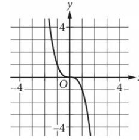

{0}------------------------------------------------

### Question ID 6abec9a8

What is the y-intercept of the graph shown?

- A. ( 1, -9)
- в. (0, —5)
- c. (0, -4)
- D. (0,0)

#### ID: 6abec9a8 Answer

Correct Answer: B

Rationale

Choice B is correct. The y-intercept of a graph in the xy-plane is the point (x, y) on the graph where x = 0. At x = 0, the corresponding value of y is =5. Therefore, the y-intercept of the graph shown is (0, -5).

Choice A is incorrect and may result from conceptual errors.

Choice C is incorrect. This is the y-intercept of a graph in the xy-plane that intersects the y-axis at y = =4, not y = -5.

Choice D is incorrect. This is the y-intercept of a graph in the xy-plane that intersects the y-axis at y = 0, not y = - 5.

{1}------------------------------------------------

{2}------------------------------------------------

### Question ID 1ee962ec

Scientists recorded data about the ocean water levels at a certain location over a period of 6 hours. The graph shown models the data, where ข = 0 represents sea level. Which table gives values of ɪ and their corresponding values of y based on the model?

|    | ష్ట | y   |
|----|-----|-----|
|    | 0   | -12 |
|    | 0   | 3   |
|    | 3   | 6   |
|    |     |     |
| B. | મુ  | y   |
|    | 0   | 0   |
|    | 3   | 12  |
|    | 0   | -6  |
|    |     |     |
|    | દ્વ | y   |
|    | 0   | 0   |
|    | 3   | 12  |

{3}------------------------------------------------

|    | 6   | 0 |
|----|-----|---|
| D. | പ്പ | y |
|    | 0   | 0 |
|    | 12  | 3 |
|    | 6   | 0 |

#### ID: 1ee962ec Answer

Correct Answer: C

Rationale

Choice C is correct. Each point (x, y) on the graph represents an elapsed time x, in hours, and the corresponding ocean water level y, in feet, at a certain location based on the model. The graph shown passes through the points (0,0), (3, —12), and (6,0). Thus, the table in choice C gives the values of x and their corresponding values of y based on the model.

Choice A is incorrect and may result from conceptual or calculation errors.

Choice B is incorrect and may result from conceptual or calculation errors.

Choice D is incorrect and may result from conceptual or calculation errors.

{4}------------------------------------------------

## Question ID 788bfd56

| Assessment   | Test | Domain        | Skill               | Difficulty |     |
|--------------|------|---------------|---------------------|------------|-----|
| SAT          | Math | Advanced Math | Nonlinear functions |            |     |
| ID: 788bfd56 |      |               |                     |            | 1.3 |

The function f is defined by f(x) = 4 + Vx. What is the value of f(144)?

|--|--|

B. 16

- C. 40
D. 76

ID: 788bfd56 Answer

Correct Answer: B

Rationale

Choice B is correct. The value of f(144) is the value of f(x) when x = 144. It's given that the function f is defined by f(x) = 4 + √ x. Substituting 144 for x in this equation yields f(144) = 4 + √ 144. Since the positive square root of 144 is 12, it follows that this equation can be rewritten as f(144) = 4 + 12, or f(144) = 16. Therefore, the value of f(144) is 16.

Choice A is incorrect and may result from conceptual or calculation errors.

Choice C is incorrect. This is the value of f(1,296), not f(144).

Choice D is incorrect. This is the value of f(5,184), not f(144).

{5}------------------------------------------------

# Question ID b39d74a0

|     | Assessment |              | Test | Domain        | Skill               | Difficulty |     |
|-----|------------|--------------|------|---------------|---------------------|------------|-----|
| SAT |            |              | Math | Advanced Math | Nonlinear functions | ■□□□□      |     |
|     |            | ID: b39d74a0 |      |               |                     |            | 1.4 |
|     | X          | y            |      |               |                     |            |     |
|     | O          | O            |      |               |                     |            |     |
|     | 1          | 1            |      |               |                     |            |     |
|     | 2          | 8            |      |               |                     |            |     |
|     | 3          | 27           |      |               |                     |            |     |

The table shown includes some values of x and their corresponding values of y. Which of the following graphs in the xy-plane could represent the relationship between x and y ?

A.

B.

{6}------------------------------------------------

#### ID: b39d74a0 Answer

Correct Answer: B

Rationale

Choice B is correct. Each pair of values shown in the table gives the ordered pair of coordinates for a point that lies on the graph that represents the relationship between x and y in the xy-plane: (0,0), (1,1), (2,8), and (3,27)

. Only the graph in choice B passes through the points listed in the table that are visible in the given choices.

Choices A, C, and D are incorrect. None of these graphs passes through the point (1,1).

{7}------------------------------------------------

# Question ID 5377d9cf

| Assessment                               | Test | Domain        | Skill               | Difficulty                                                                                                                                                                     |  |
|------------------------------------------|------|---------------|---------------------|--------------------------------------------------------------------------------------------------------------------------------------------------------------------------------|--|
| SAT                                      | Math | Advanced Math | Nonlinear functions | ■□□□□□□□□□□□□□□□□□□□□□□□□□□□□□□□□□□□□□□□□□□□□□□□□□□□□□□□□□□□□□□□□□□□□□□□□□□□□□□□□□□□□□□□□□□□□□□□□□□□□□□□□□□□□□□□□□□□□□□□□□□□□□□□□□□□□□□□□□□□□□□□□□□□□□□□□□□□□□□□□□□□□□□□□□□□□□ |  |
| ID: 5377d9cf                             |      |               |                     | 1.5                                                                                                                                                                            |  |
| x2-6x+3 x - 1 r what is f(-1) ? |      |               |                     |                                                                                                                                                                                |  |
| A. —5                                    |      |               |                     |                                                                                                                                                                                |  |
| B. –2                                    |      |               |                     |                                                                                                                                                                                |  |
| C. 2                                     |      |               |                     |                                                                                                                                                                                |  |
| D. 5                                     |      |               |                     |                                                                                                                                                                                |  |

ID: 5377d9cf Answer

Correct Answer: A

Rationale

-1)2-6(-1)+3 f(-1)= Choice A is correct. Substituting –1 for x in the equation that defines f gives 1+6+3 10 Simplifying the expressions in the numerator and denominator yields , which is equal to — 2 or — 5. -2

Choices B, C, and D are incorrect and may result from misapplying the order of operations when substituting – 1 for x.

{8}------------------------------------------------

## Question ID 75915e3c

| Assessment                                                       | Test | Domain        | Skill               | Difficulty |     |
|------------------------------------------------------------------|------|---------------|---------------------|------------|-----|
| SAT                                                              | Math | Advanced Math | Nonlinear functions | ■          |     |
| ID: 75915e3c f(x)=2(3x)                                       |      |               |                     |            | 1.6 |
| For the function f defined above, what is the value of ƒ (2)? |      |               |                     |            |     |
| A. 9                                                             |      |               |                     |            |     |
| B. 12                                                            |      |               |                     |            |     |
| C. 18                                                            |      |               |                     |            |     |

D. 36

### ID: 75915e3c Answer

Correct Answer: C

### Rationale

Choice C is correct. The value of f(2) is found by evaluating the expression 2(34) when x = 2. Substituting 2 for x in the given equation yields f(2) =2(32). Simplifying 32 in the equation results in f(2) =2(9). Evaluating the right-hand side of the equation yields f(2) = 18. Therefore, the value of ƒ(2) is 18.

Choice A is incorrect and may result from evaluating the expression as (32). Choice B is incorrect and may result from evaluating the expression as 2(3·2). Choice D is incorrect and may result from evaluating the expression as (2·3)2
{9}------------------------------------------------

# Question ID 7160cbb3

What is the y-intercept of the graph shown?

A. (0, -6)

- B. ( 6,0)
- c. (0,0)
- D. ( 5, -5)

### ID: 7160cbb3 Answer

Correct Answer: A

Rationale

Choice A is correct. The y-intercept of a graph in the xy-plane is the point (d, y) on the graph where x = 0. For the graph shown, at x = 0, the corresponding value of y is —6. Therefore, the y-intercept of the graph shown is (0, -6).

Choice B is incorrect and may result from conceptual errors.

Choice C is incorrect and may result from conceptual errors.

Choice D is incorrect and may result from conceptual errors.

{10}------------------------------------------------

{11}------------------------------------------------

## Question ID 72ae8a87

| Assessment | Test | Domain        | Skill               | Difficulty |
|------------|------|---------------|---------------------|------------|
| SAT        | Math | Advanced Math | Nonlinear functions |            |
|            |      |               |                     |            |

### ID: 72ae8a87

The function ƒ(;c) = 200,000(1.21) = gives a company's predicted annual revenue, in dollars, x years after the company started selling light bulbs online, where 0 < x ≤ 10. What is the best interpretation of the statement " f(5) is approximately equal to 518,748" in this context?

- A. 5 years after the company started selling light bulbs online, its predicted annual revenue is approximately 518,748 dollars.
- B. 5 years after the company started selling light bulbs online, its predicted annual revenue will have increased by a total of approximately 518,748 dollars.
- C. When the company's predicted annual revenue is approximately 518,748 dollars, it is 5 times the predicted annual revenue for the previous year.
- D. When the company's predicted annual revenue is approximately 518,748 dollars, it is 5% greater than the predicted annual revenue for the previous year.

#### ID: 72ae8a87 Answer

Correct Answer: A

Rationale

Choice A is correct. It's given that the function f(x) = 200,000(1.21)" gives a company's predicted annual revenue, in dollars, w years after the company started selling light bulbs online. It follows that f(x) represents the company's predicted annual revenue, in dollars, x years after the company started selling light bulbs online. Since the value of f(5) is the value of f(x) when x = 5, it follows that "f(5) is approximately equal to 518,748" means that f(x) is approximately equal to 518,748 when x = 5. Therefore, the best interpretation of the statement "f(5) is approximately equal to 518,748" in this context is 5 years after the company started selling light bulbs online, its predicted annual revenue is approximately 518,748 dollars.

Choice B is incorrect and may result from conceptual errors.

Choice C is incorrect and may result from conceptual errors.

Choice D is incorrect and may result from conceptual errors.

Question Difficulty: Easy

1.8

{12}------------------------------------------------

# Question ID 09f58996

| Assessment   | Test | Domain        | Skill               | Difficulty |
|--------------|------|---------------|---------------------|------------|
| SAT          | Math | Advanced Math | Nonlinear functions |            |
| ID: 09f58996 | 1.9  |               |                     |            |

The function f is defined by f(x) = 6 + √x. What is the value of f(36)?

### ID: 09f58996 Answer

Correct Answer: 12

Rationale

The correct answer is 12. The value of f(36) is the value of f(x) when x = 36. Substituting 36 for x in the given equation yields f(36) = 6 + √ 36, which is equivalent to f(36) = 6 + 6, or f(36) = 12. Thus, the value of f(36) is 12.

{13}------------------------------------------------

# Question ID ebe4bde0

The quadratic function graphed above models a particular measure of plant diversity as a function of the elevation in a region of Switzerland. According to the model, which of the following is closest to the elevation, in meters, at which plant diversity is greatest?

A. 13,500

B. 3,000

C. 1,250

D. 250

#### ID: ebe4bde0 Answer

#### Correct Answer: C

#### Rationale

Choice C is correct. Each point (x, y) on the graph represents the elevation x, in meters, and the corresponding

measure of plant diversity y in a region of Switzerland. Therefore, the point on the greatest ycoordinate represents the location that has the greatest measure of plant diversity in the greatest y-coordinate of any point on the graph is approximately 13,500. The x-coordinate of that point is approximately 1,250. Therefore, the closest elevation at which the plant diversity is the greatest is 1,250 meters.

Choice A is incorrect. This value is closest to the greatest y-coordinate of any point on the graph and therefore represents the greatest measure of plant diversity, not the elevation where the greatest measure of plant diversity occurs. Choice B is incorrect. At an elevation of 3,000 meters the measure of plant diversity is approximately 4,000. Because there are points on the graph with greater y-coordinates, 4,000 can't be the greatest measure of plant diversity, and 3,000 meters isn't the elevation at which the greatest measure of plant diversity occurs. Choice D is incorrect. At an elevation of 250 meters, the measure of plant diversity is approximately 11,000. Because there are points on the graph with greater y-coordinates, 11,000 can't be the

{14}------------------------------------------------

greatest measure of plant diversity and 250 meters isn't the elevation at which the greatest measure of plant diversity occurs.

{15}------------------------------------------------

# Question ID d46da42c

| Assessment   | Test | Domain        | Skill               | Difficulty |
|--------------|------|---------------|---------------------|------------|
| SAT          | Math | Advanced Math | Nonlinear functions |            |
| ID: d46da42c |      |               |                     | 1.11       |

The function f is defined as shown. Which of the following graphs in the xyplane could be the graph of y = f(x) ?

f(x)=x2+4

### ID: d46da42c Answer

Correct Answer: D

Rationale

Choice D is correct. For the quadratic function f (x) = x + 4, the vertex of the graph is (0,4), and because the x 2 term is positive, the vertex is the minimum of the function. Choice D is the only option that meets these conditions.

{16}------------------------------------------------

Choices A, B, and C are incorrect. The vertex of each of these graphs doesn't correspond to the minimum of the given function.

{17}------------------------------------------------

# Question ID 79ba511a

| Assessment   | Test | Domain        | Skill               | Difficulty |
|--------------|------|---------------|---------------------|------------|
| SAT          | Math | Advanced Math | Nonlinear functions |            |
| ID: 79ba511a |      |               |                     | 1.12       |

The function f is defined by f(x) = x3 + 15. What is the value of f(2)?

B. 21

- C. 23
D. 24

### ID: 79ba511a Answer

Correct Answer: C

Rationale

Choice C is correct. The value of f(2) is the value of f(2) when x = 2. Substituting 2 for x in the given function yields f(2) = (2) = (2) = 8 + 15, which is equivalent to f(2) = 23. Therefore, the value of f(2) is 23.

Choice A is incorrect and may result from conceptual or calculation errors.

Choice B is incorrect. This is the value of f(2) when f(x) = x(3) + 15, rather than f(x) = x 3 + 15.

Choice D is incorrect and may result from conceptual or calculation errors.
{18}------------------------------------------------

# Question ID 50418728

The graph of the polynomial function f, where y = f(x), is shown. The y-intercept of the graph is (0, y). What is the value of y?

### ID: 50418728 Answer

-12-

Correct Answer: -3

Rationale

The correct answer is -3. The y-intercept of the graph of a function in the xy-plane is the point where the graph crosses the y-axis. The polynomial function shown crosses the y-axis at the point (0, -3). It's given that the y-intercept of the graph is (0, y). Thus, the value of y is -3.

{19}------------------------------------------------

# Question ID ee05c84e

| Assessment                                                       | Test | Domain        | Skill               | Difficulty |
|------------------------------------------------------------------|------|---------------|---------------------|------------|
| SAT                                                              | Math | Advanced Math | Nonlinear functions | ■□□□□      |
| 1.14 ID: ee05c84e f(x)=(x+0.25x)(50-x)                     |      |               |                     |            |
| The function f is defined above. What is the value of f(20) ? |      |               |                     |            |
| A. 250                                                           |      |               |                     |            |
| B. 500                                                           |      |               |                     |            |

C. 750

D. 2,000

ID: ee05c84e Answer

Correct Answer: C

Rationale

Choice C is correct. Adding the like terms x and 0.25x yields the equation f(x)=(1.25x)(50 -x). Substituting 20 for x yields f(20) = (1.25(20))(50-20). The product 1.25(20) is equal to 25, and the difference 50 - 20 is equal to 30. Substituting these values in the given equation gives ƒ(20)=(25)(30), and multiplying 25 by 30 results in f(20) = 750

Choices A, B, and D are incorrect and may result from conceptual or computational errors when finding the value of f(20).

{20}------------------------------------------------

# Question ID 39652e93

#### Correct Answer: A

#### Rationale

Choice A is correct. It's given that ƒx = 4. Substituting 17 for x in this function yields ƒ17 = 4. Therefore, when x = 17, the value of fx is =

Choice B is incorrect. This is the value of the reciprocal of fx when x = 17.

Choice C is incorrect. This is the value of ƒx when x = 1. Choice D is incorrect. This is the value of x when x = 17.

{21}------------------------------------------------

# Question ID 02c67921

The graph of the exponential function fis shown, where y = f(x). The y-intercept of the graph is (0, y). What is the value of y?

### ID: 02c67921 Answer

l

#### Correct Answer: 3

#### Rationale

The correct answer is 3. It's given that the y-intercept of the graph passes through the point 0, 3. Therefore, the value of y is 3.

{22}------------------------------------------------

#### Questic D 04b985e6

| Assessment | Test | Domain        | Skill               | Difficulty |
|------------|------|---------------|---------------------|------------|
| SAT        | Math | Advanced Math | Nonlinear functions |            |

## ID: 04b985e6

The kinetic energy, in joules, of an object with mass 9 kilograms traveling at a speed of v meters per second is given by the function K, where K(v) = 3 v2. Which of the best interpretation of K(34) = 5,202 in this context?

1.17

A. The object traveling at 34 meters per second has a kinetic energy of 5,202 joules.

- B. The object traveling at 340 meters per second has a kinetic energy of 5,202 joules.
- C. The object traveling at 5,202 meters per second has a kinetic energy of 34 joules.
- D. The object traveling at 23,409 meters per second has a kinetic energy of 34 joules.

### ID: 04b985e6 Answer

### Correct Answer: A

### Rationale

Choice A is correct. It's given that the kinetic energy, in joules, of an object with a mass of 9 kilograms traveling at a speed of ు meters per second is given by the function K, where Kv = - 22. It follows that in the equation K34 = 5,202, 34 is the value of v , or the speed of the object, in meters per second, and 5,202 is the kinetic energy, in joules, of the object at that speed. Therefore, the best interpretation of K34 = 5,202 in this context is the object traveling at 34 meters per second has a kinetic energy of 5,202 joules.

Choice B is incorrect. The object traveling at 340 meters per second has a kinetic energy of 520,200 joules.

Choice C is incorrect. The object traveling at 5,202 meters per second has a kinetic energy of 121,773,618 joules.

Choice D is incorrect. The object traveling at 23,409 meters per second has a kinetic energy of 2,465,915,764.5 joules.

{23}------------------------------------------------

# Question ID 1863e3be

| Assessment           | Test | Domain        | Skill               | Difficulty |  |
|----------------------|------|---------------|---------------------|------------|--|
| SAT                  | Math | Advanced Math | Nonlinear functions | 100        |  |
| ID: 1863e3be 1.18 |      |               |                     |            |  |

The y-intercept of the graph of y = x2 + 31 in the xy-plane is (0, y). What is the value of y?

# ID: 1863e3be Answer

### Correct Answer: 31

### Rationale

The correct answer is 31. It's given that the y-intercept of the graph of y = x2 + 31 in the xy-plane is 0, y. Substituting 0 for x in the given equation yields y = 02 + 31, or y = 31. Thus, the value of y is 31.

{24}------------------------------------------------

# Question ID 2d394c28

The graph shown models the number of residents of a certain city x years after 2010. How many residents does this model estimate the city had in 2010?

A. 0

B. 2,000

c. 20,000

- D. 25,000
### ID: 2d394c28 Answer

Correct Answer: C

{25}------------------------------------------------

#### Rationale

Choice C is correct. It's given that x represents years after 2010. Therefore, 2010 is represented by x = 0. On the model shown, the point with an x-coordinate of 0 has a y-coordinate of 20,000. Thus, the model estimates that in 2010, the city had 20,000 residents.

Choice A is incorrect. This is the value of x that represents the year 2010.

Choice B is incorrect and may result from conceptual or calculation errors.

Choice D is incorrect. This is approximately the number of residents the city had in 2014, not 2010.

{26}------------------------------------------------

# Question ID 2fec8bf4

| Assessment | Test | Domain        | Skill               | Difficulty |
|------------|------|---------------|---------------------|------------|
| SAT        | Math | Advanced Math | Nonlinear functions |            |
|            |      |               |                     |            |

1.20

ID: 2fec8bf4

# P(t) = 1,800(1.02)t

The function I gives the estimated number of marine mammals in a certain area, where t is the number of years since a study began. What is the best interpretation of P(0) = 1,800 in this context?

A. The estimated number of marine mammals in the area was 102 when the study began.

- B. The estimated number of marine mammals in the area was 1,800 when the study began.
- C. The estimated number of marine mammals in the area increased by 102 each year during the study.
- D. The estimated number of marine mammals in the area increased by 1,800 each year during the study.

### ID: 2fec8bf4 Answer

### Correct Answer: B

### Rationale

Choice B is correct. The function P gives the estimated number of marine mammals in a certain area, where i is the number of years since a study beqan. Since the value of Pt when t = 0, it follows that P0 = 1,800 means that the value of Pt is 1,800 when t = 0. Since t is the number of years since the study began, it follows that t = 0 is 0 years since the study began, or when the study began. Therefore, the best interpretation of P0 = 1,800 in this context is the estimated number of marine mammals in the area was 1,800 when the study began.

Choice A is incorrect and may result from conceptual or calculation errors.

Choice C is incorrect and may result from conceptual or calculation errors.

Choice D is incorrect and may result from conceptual or calculation errors.