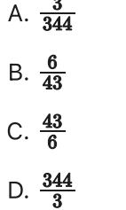
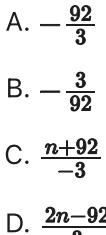

{0}------------------------------------------------

# Question ID 002dba45

| Assessment   | Test | Domain  | Skill                                | Difficulty |
|--------------|------|---------|--------------------------------------|------------|
| SAT          | Math | Algebra | Linear equations in two variables |            |
| ID: 002dba45 |      |         |                                      | 2.1        |

17 x + 5. Line j is perpendicular to line k in the xy-plane. What is the slope of line j? Line k is defined by y =

### ID: 002dba45 Answer

Correct Answer: .1764, .1765, 3/17

Rationale

The correct answer is - It's given that line j is perpendicular to line k in the xy-plane. This means that the slope of line j is the negative reciprocal of the slope of line k, y = - - - - - - - - - - - - - - - - - - - - - - - - - - - - - - - - - - - - - - - - - - - - - - - - - in slope-intercept form y = mx + b, where m is the slope of the line and b is the y-coordinate of the y intercept of the line. It follows that the slope of line k is - - - The negative reciprocal of a number is - 1 divided by the number. Therefore, the negative reciprocal of w 15 is -== , or = . Thus, the slope of line j is = Note that 3/17, .1764, .1765, and 0.176 are examples of ways to enter a correct answer.

{1}------------------------------------------------

# Question ID 9c7741c6

| Assessment | Test | Domain  | Skill                                | Difficulty |
|------------|------|---------|--------------------------------------|------------|
| SAT        | Math | Algebra | Linear equations in two variables |            |
|            |      |         |                                      |            |

#### ID: 9c7741c6

2.2

On a 210-mile trip, Cameron drove at an average speed of 60 miles per hour for the first x hours. He then completed the trip, driving at an average speed of 50 miles per hour for the remaining y hours. If x = 1, what is the value of y ?

### ID: 9c7741c6 Answer

Rationale

The correct answer is 3. It's given that Cameron drove 60 miles per hour for x hours; therefore, the distance driven at this speed can be represented by 60x. He then drove 50 miles per hour for y hours; therefore, the distance driven at this speed can be represented by 50y. Since Cameron drove 210 total miles, the equation 60x +50y = 210 represents this situation. If x = 1, substitution yields 60(1) + 50y = 210, or 60 +50y = 210. Subtracting 60 from both sides of this equation yields 50y = 150. Dividing both sides of this equation by 50 yields y = 3

{2}------------------------------------------------

## Question ID d62ad380

| Assessment | Test | Domain  | Skill                                | Difficulty |
|------------|------|---------|--------------------------------------|------------|
| SAT        | Math | Algebra | Linear equations in two variables |            |

### ID: d62ad380

An artist paints and sells square tiles. The selling price P, in dollars, of a painted tile is a linear function of

| the side length of the tile s, in inches, as shown in the table below. |       |  |
|------------------------------------------------------------------------|-------|--|
| Side length, s (inches)  Price, P (dollars)                            |       |  |
| ന                                                                      | 8.00  |  |
| റ                                                                      | 18.00 |  |
| இ                                                                      | 28.00 |  |

Which of the following could define the relationship between s and P ?

$$\mathsf{A.}\,P = \mathsf{3s} + \mathsf{10}$$

$$\sideset{_{B.}}{}{\mathop{P}}-\frac{\mathfrak{l}\mathfrak{l}}{3}\mathsf{s}+\mathfrak{s}$$

#### ID: d62ad380 Answer

Correct Answer: C

#### Rationale

Choice C is correct. The relationship between s and P can be modeled by a linear equation of the form P = ks + 10 a, where k and a are constants. The table shows that P increases by 10 when s increases by 3, so k = solve for a, substitute one of the given pairs of values for s and P: when s = 3, P = 8, so which yields a = −2. The solution is therefore

Choice A is incorrect. When s = 3, P = 8, but 3(3) + 10 = 19 + 8. Choice B is incorrect. This may result from using the first number given for P in the table as the constant term a in the linear equation P = ks + a, which is true only when s = 0. Choice D is incorrect and may result from using the reciprocal of the slope of the line.

$$\mathbf{23}$$

{3}------------------------------------------------

# Question ID 431c3038

|     | Test | Domain  | Skill                                | Difficulty |
|-----|------|---------|--------------------------------------|------------|
| SAT | Math | Algebra | Linear equations in two variables |            |

### ID: 431c3038

2.4

In an article about exercise, it is estimated that a 160-pound adult uses 200 calories for every 30 minutes of hiking and 150 calories for every 30 minutes of bicycling. An adult who weighs 160 pounds has completed 1 hour of bicycling. Based on the article, how many hours should the adult hike to use a total of 1,900 calories from bicycling and hiking?

- A. 9.5
B. 8.75

C. 6

- D. 4
## ID: 431c3038 Answer

Correct Answer: D

### Rationale

Choice D is correct. Since a 160-pound adult uses 200 calories for every 30 minutes of hiking, then the same adult uses 200h calories after hiking for h 30-minute periods. Similarly, the same adult uses 150b calories after bicycling for b 30-minute periods. Therefore, the equation 200h + 150b = 1,900 represents the situation where a 160-pound adult uses a total of 1,900 calories from hiking for h 30-minute periods and bicycling for b 30-minute periods. It's given that the adult completes 1 hour, or 2 30-minute periods, of bicycling. Substituting 2 for b in the equation 200h + 150b = 1,900 yields 200h + 150(2) = 1,900, or 200h + 300 = 1,900 Subtracting 300 from both sides of this equation yields 200h = 1,600. Dividing both sides by 200 yields h = 8. Since h represents the number of 30-minute periods spent hiking and there are 2 30-minute periods in every a hour, it follows that the adult will need to hike for 2 , or 4 hours to use a total of 1,900 calories from bicycling and hiking.

Choice A is incorrect and may result from solving the equation 200h = 1,900. This represents 0 30-minute periods bicycling instead of 2. Choice B is incorrect and may result from solving the equation 200h + 150 = 1,900. This represents 1 30-minute period of bicycling instead of 2. Choice C is incorrect. This

may result from determining that the number of 30-minute periods the adult should hike is 8, but then subtracting 2 from 8, rather than dividing 8 by 2, to find the number of hours the adult should hike.

{4}------------------------------------------------

{5}------------------------------------------------

# Question ID 265f2a53

| Assessment | Test | Domain  | Skill                                | Difficulty |
|------------|------|---------|--------------------------------------|------------|
| SAT        | Math | Algebra | Linear equations in two variables |            |
|            |      |         |                                      |            |

### ID: 265f2a53

2.5

When line m is graphed in the xy-plane, it has an x-intercept of (എ. 0) and a y-intercept of (0, %). What is the slope of line n?

## ID: 265f2a53 Answer

Correct Answer: C

Rationale

Choice C is correct. It's given that when line n is graphed in the xy-plane, it has an x-intercept of (-4, 0) and a y-intercept of (0, 00 ). The slope, m, of a line can be found using any two points on the line, (Cr, yt ) and (x2, y2), and the slope formula m = %22. Substituting the points (-4, 0) and (0, 9) for (x1, y1) and - or m = 43 . Therefore, the slope of line n is 43 (x2, y2), respectively, in the slope formula yields m

Choice A is incorrect and may result from conceptual or calculation errors.

Choice B is incorrect. This is the slope of a line that has an x-intercept of ( %, 0) and a y-intercept of (0, -4).

Choice D is incorrect and may result from conceptual or calculation errors.

{6}------------------------------------------------

## Question ID f81a0503

| Linear equations in SAT Math Algebra two variables | Assessment | Test | Domain | Skill | Difficulty |
|----------------------------------------------------------------|------------|------|--------|-------|------------|
|                                                                |            |      |        |       |            |

ID: f81a0503

2.6

In the xy-plane, line & passes through the points (0, -5) and (1, -1). Which equation defines line M

A. y = - x + = B. y = = xx - 5 C. y = -x + 4 D. y = 4x - 5

### ID: f81a0503 Answer

Correct Answer: D

Rationale

Choice D is correct. An equation defining a line in the xy-plane can be written in the form y = mx + b, where m represents the slope and (0, b) represents the y-intercept of the line. It's given that line % passes through the point (0, -5); therefore, b = -5. The slope, m, of a line can be found using any two points on the line, (x1, y1) and (x2, y2), and the slope formula m = %2. Substituting the points (0, -5) and (1, -1) for ( = 1, v = ( = = = = = = = = = = = = = == = = = = = = = = = = = = = = = = = = = = = = = = = = = = = = = = = = = = = = = = = = = = = = = = = = = = = = = = = = = = = = = = = = and -5 for b in the equation y = mx + b yields y = 4x - 5.

Choice A is incorrect and may result from conceptual or calculation errors.

Choice B is incorrect and may result from conceptual or calculation errors.

Choice C is incorrect and may result from conceptual or calculation errors.

{7}------------------------------------------------

# Question ID 28c2253f

| Assessment | Test | Domain  | Skill                                | Difficulty |
|------------|------|---------|--------------------------------------|------------|
| SAT        | Math | Algebra | Linear equations in two variables |            |

ID: 28c2253f

| Rock type | Weight per volume (lb/ft =) | Cost per pound |
|-----------|--------------------------------|-------------------|
| Basalt    | 180                            | \$0.18            |
| Granite   | 165                            | \$0.09            |
| Limestone | 120                            | \$0.03            |
| Sandstone | 135                            | \$0.22            |

Characteristics for Rock Types

A city is planning to build a rock retaining wall, a monument, and a garden in a park. The table above shows four rock types that will be considered for use in the project. Also shown for each rock type is its weight per volume, in pounds per cubic foot (Ib/ft ), and the cost per pound, in dollars. Only basalt, granite, and limestone will be used in the garden. The rocks in the garden will have a total weight of 1,000 pounds. If 330 pounds of granite is used, which of the following equations could show the relationship between the amounts, x and y, in ft , for each of the other rock types used?

A. 165x +180y = 670

B. 165x +120y = 1,000

C. 120x +180y = 670

D. 120x +180y = 1,000

### ID: 28c2253f Answer

Correct Answer: C

#### Rationale

Choice C is correct. It's given that the weight of the granite used in the gargen is 330 pounds. The weight of the limestone used in the garden is a product of its weight per volume, in lb/ft , and its volume, in ft the weight of the limestone used in the garden can be represented by 120x, where x is the volume, in ft of

the limestone used. Similarly, the weight of the basalt used in the garden can be represented by 180y, where y

2.7

{8}------------------------------------------------

is the volume, in ft , of the basalt used. It's given that the total weight of the rocks used in the garden will be 1,000 pounds. Thus, the sum of the weights of the three rock types used is 1,000 pounds, which can be represented by the equation 120x + 180y + 330 = 1,000. Subtracting 330 from both sides of this equation

### yields 120x +180y = 670

Choice A is incorrect. This equation uses the weight per volume of granite instead of limestone. Choice B is incorrect. This equation uses the weight per volume of granite instead of basalt, and doesn't take into account the 330 pounds of granite that will be used in the garden. Choice D is incorrect. This equation doesn't take into account the 330 pounds of granite that will be used in the garden.
{9}------------------------------------------------

## Question ID 2e1a7f66

| Assessment | Test | Domain  | Skill                                | Difficulty |
|------------|------|---------|--------------------------------------|------------|
| SAT        | Math | Algebra | Linear equations in two variables |            |
|            |      |         |                                      |            |

#### ID: 2e1a7f66

2.8

Figure A and figure B are both regular polygons. The sum of the perimeter of figure A and the perimeter of figure B is 63 inches. The equation 3x + 6y = 63 represents this situation, where x is the number of sides of figure A and y is the number of sides of figure B. Which statement is the best interpretation of 6 in this context?

A. Each side of figure B has a length of 6 inches.

- B. The number of sides of figure B is 6.
- C. Each side of figure A has a length of 6 inches.
- D. The number of sides of figure A is 6.

#### ID: 2e1a7f66 Answer

Correct Answer: A

Rationale

Choice A is correct. It's given that figure B (not shown) are both regular polygons and the sum of the perimeters of the two figures is 63 inches. It's also given that x is the number of sides of figure A and y is the number of sides of figure B, and that the equation 3x + 6y = 63 represents this situation. Thus, 3x and 6y represent the perimeters, in inches, of figure B, respectively. Since 6g represents the perimeter, in inches, of figure B and y is the number of sides of figure B, it follows that each side of figure B has a length of 6 inches.

Choice B is incorrect. The number of sides of figure B is y, not 6.

Choice C is incorrect. Since the perimeter, in inches, of figure A is represented by 3x, each side of figure A has a length of 3 inches, not 6 inches.

Choice D is incorrect. The number of sides of figure A is x, not 6.

{10}------------------------------------------------

## Question ID 6f6dfe3e

| Assessment | Test | Domain  | Skill                                | Difficulty |
|------------|------|---------|--------------------------------------|------------|
| SAT        | Math | Algebra | Linear equations in two variables |            |

## ID: 6f6dfe3e

| ૧૮ | y       |
|----|---------|
| 6  | n + 184 |
| 3  | n + 92  |
| 0  | ટ       |

The table shows three values of x and their corresponding values of y, where n is a constant, for the linear relationship between x and y. What is the slope of the line that represents this relationship in the xy-plane?

### ID: 6f6dfe3e Answer

Correct Answer: A

Rationale

Choice A is correct. The slope, m, of a line in the xy-plane can be found using two points on the line, ( . 31 ) and (x2, y2), and the slope formula m = 22%. Based on the given table, the line representing the X2—X1 relationship between x and y in the xy-plane passes through the points (-6, n + 184). ( -3, n + 92), and (0, n), where n is a constant. Substituting two of these points, (-3, n + 92) and (0, n), for (x1, y1) and (x) }), respectively, in the slope formula yields m = ======================================================================================================================= 92. Therefore, the slope of the line that represents this relationship in the xy-plane is —

Choice B is incorrect and may result from conceptual or calculation errors.

Choice C is incorrect and may result from conceptual or calculation errors.

Choice D is incorrect and may result from conceptual or calculation errors.

Question Difficulty: Medium

2.9

{11}------------------------------------------------

## Question ID 9ed4c1a2

| Assessment   | Test | Domain  | Skill                                | Difficulty |
|--------------|------|---------|--------------------------------------|------------|
| SAT          | Math | Algebra | Linear equations in two variables |            |
| ID: 9ed4c1a2 |      |         |                                      | 2.10       |

What is the slope of the graph of y = ¼(27x + 15) + 7x in the xy-plane?

## ID: 9ed4c1a2 Answer

Correct Answer: 13.75, 55/4

Rationale

The correct answer is 55 . In the xy-plane, the graph of an equation in the form y = max + b, where m and bare constants, has a slope of m and a y-intercept of (0, b). Applying the distributive property to the right-hand side of the given quation your we of your and the comments yelds on of the signi nia.
side of the given quation yelds y = " = " = " = = = = = = = = = = = = = = = = = = = = = answer.

{12}------------------------------------------------

## Question ID fb43b85f

| Assessment   | Test | Domain  | Skill                                | Difficulty |
|--------------|------|---------|--------------------------------------|------------|
| SAT          | Math | Algebra | Linear equations in two variables |            |
| ID: fb43b85f |      |         |                                      | 2.11       |

A line passes through the points (4, 6) and (15, 24) in the xy-plane. What is the slope of the line?

## ID: fb43b85f Answer

Correct Answer: 1.636, 18/11

Rationale

The correct answer is For a line that passes through the points ( ( 1 , 3 ) and ( 12 , y 2) in the xy-plane, the slope of the line can be calculated using the slope formula, m = the points (4,6) and (15, 24) in the xy-plane. Substituting (4, 6) for (x1, y1) and (15, 24) for (x2, yg) in the slope formula, m = and 1.636 are examples of ways to enter a correct answer.

{13}------------------------------------------------

# Question ID 400798d6

| Assessment | Test | Domain  | Skill                                | Difficulty |
|------------|------|---------|--------------------------------------|------------|
| SAT        | Math | Algebra | Linear equations in two variables |            |
|            |      |         |                                      |            |

### ID: 400798d6

2.12

## 2x + y = 37

In triangle QRS, sides QR and RS each have a length of x centimeters and side SQ has a length of y centimeters. The given equation represents this situation. Which of the best interpretation of 37 in this context?

- A. The difference, in centimeters, between the lengths of sides QR and SQ
- B. The difference, in centimeters, between the lengths of sides QR and RS
- C. The sum of the lengths, in centimeters, of the three sides of the triangle
- D. The length, in centimeters, of one of the two sides of equal length

#### ID: 400798d6 Answer

#### Correct Answer: C

#### Rationale

Choice C is correct. It's given that in triangle QRS, sides QR and RS each have a length of x centimeters. Therefore, the expression 2x represents the sum of the lengths, in centimeters, of sides QR and RS. It's also given that side SQ has a length of y centimeters. Therefore, the expression 2x + v represents the sum of the lengths, in centimeters, of sides QR, RS, and SQ. Since 2x + y is the sum of the lengths, in centimeters, of the triangle and 2x + y = 37, it follows that 37 is the sum of the lengths, in centimeters, of the three sides of the triangle.

Choice A is incorrect. The difference, in centimeters, between the lengths of sides QR and SQ is x - y, not 37.

Choice B is incorrect. The difference, in centimeters, between the lengths of sides QR and RS is x - x, or 0, not 37.

Choice D is incorrect. The length, in centimeters, of one of the two sides of equal length is x, not 37.

{14}------------------------------------------------

# Question ID ca452900

What is the slope of the graph of y = ﷺ — 23 in the xy-plane?

## ID: ca452900 Answer

Correct Answer: .3846, 5/13

### Rationale

 The correct answer is . The graph of a line in the xy-plane can be represented by the equation y = mx + b, where m is the slope of the line and b is the y-coordinate of the y-intercept. The given equation can be written as y = = x - 23. Therefore, the slope of the graph of this equation in the xy-plane is __. Note that 5/13, .3846, 0.385, and 0.384 are examples of ways to enter a correct answer.

{15}------------------------------------------------

# Question ID 62ef6f73

| Assessment   | Test | Domain | Skill                                           | Difficulty |
|--------------|------|--------|-------------------------------------------------|------------|
| SAT          | Math |        | Algebra Linear equations in two variables |            |
| ID: 62ef6f73 |      |        |                                                 | A I I      |

## 2.14

A total of 2 squares each have side length m. A total of 6 equilateral triangles each have side length t. None of these squares and triangles shares a side. The perimeters of all these squares and triangles is 210. Which equation represents this situation?

A. 6r + 24t = 210

B. 2r + 6t = 210

C. 8r + 18t = 210

D. 6r + 2t = 210

## ID: 62ef6f73 Answer

#### Correct Answer: C

#### Rationale

Choice C is correct. It's given that a total of 2 squares each have side length r. Therefore, each of the squares has perimeter 4r. Since there are a total of 2 squares, the sum of these squares is 4r + 4r, which is equivalent to 24; or 8r It's also given that a total of 6 equilateral triangles each have side length t. Therefore, each of the equilateral triangles has perimeter 3t. Since there are a total of 6 equilateral triangles, the sum of the perimeters of these triangles is 31 + 3t + 3t + 3t + 3t, which is equivalent to 63t, or 18t. Since the sum of the squares is 8r and the sum of the perimeters of the triangles is 18t, the sum of the perimeters of all these squares and triangles is 8r + 18t. It's qiven that the sum of the perimeters of all these squares and triangles is 210. Therefore, the equation 8r + 18t = 200 represents this situation.

Choice A is incorrect and may result from conceptual or calculation errors.

Choice B is incorrect and may result from conceptual or calculation errors.

Choice D is incorrect and may result from conceptual or calculation errors.

{16}------------------------------------------------

# Question ID 92aa3a94

| Assessment   | Test | Domain  | Skill                                | Difficulty |
|--------------|------|---------|--------------------------------------|------------|
| SAT          | Math | Algebra | Linear equations in two variables |            |
| ID: 92aa3a94 |      |         |                                      | o IF       |

2.15

Line & is defined by y = 7x + 1 - 1 ine j is perpendicular to line & in the xy-plane. What is the slope of line j?

| A. —8  |  |  |  |
|--------|--|--|--|
| B. — ֆ |  |  |  |
| C. 등   |  |  |  |
| D. 7   |  |  |  |
|        |  |  |  |

## ID: 92aa3a94 Answer

#### Correct Answer: B

#### Rationale

Choice B is correct. It's given that line k is defined by y = 7x + - . For an equation in slope-intercept form y = mx + b, m represents the slope of the line defined by this equation in the xy-plane and b represents the y-intercept of this line. Therefore, the slope of line k is 7. It's also given that line ¿ is perpendicular to line k in the xy-plane. Therefore, the slope of line j is the opposite reciprocal of the slope of line k. The opposite reciprocal of 7 is -- Therefore, the slope of line j is -1
is -7 -7 -

Choice A is incorrect. This is the opposite reciprocal of the y-intercept, not the slope, of line k.

Choice C is incorrect. This is the y-coordinate of the y-intercept of line k, not the j.

Choice D is incorrect. This is the slope of a line that is parallel, not perpendicular, to line k.