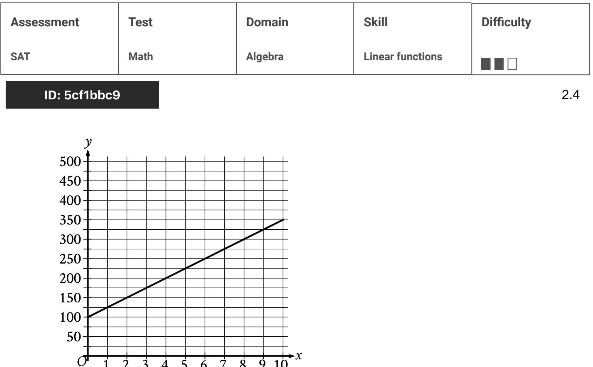
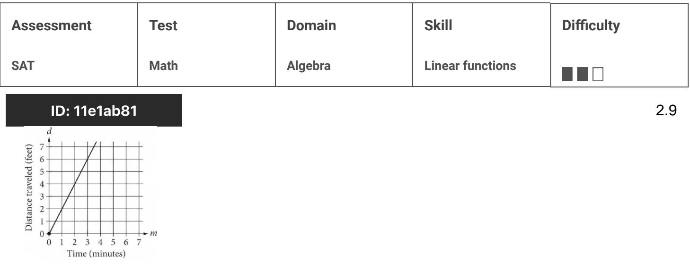
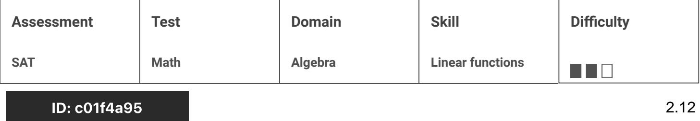
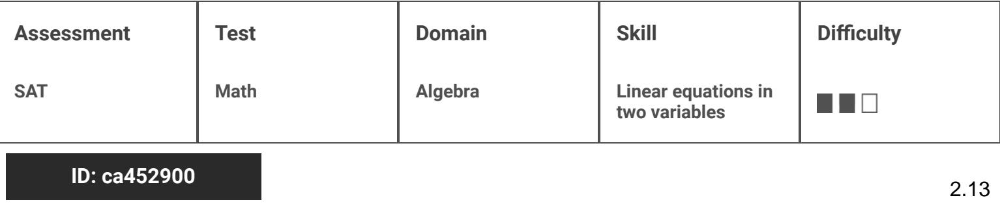
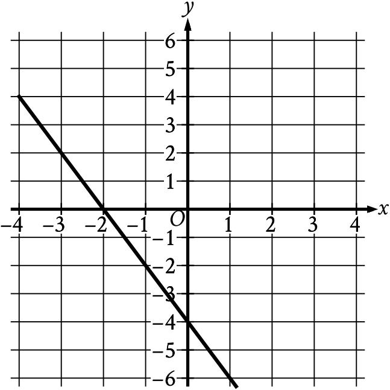

{0}------------------------------------------------

# Question ID e62cfe5f

| Assessment   | Test | Domain  | Skill            | Difficulty |
|--------------|------|---------|------------------|------------|
| SAT          | Math | Algebra | Linear functions |            |
| ID: e62cfe5f |      |         |                  | 2.1        |

According to a model, the head width, in millimeters, of a worker bumblebee can be estimated by adding 0.6 to four times the body weight of the bee, in grams. According to the model, what would be the head width, in millimeters, of a worker bumblebee that has a body weight of 0.5 grams?

#### ID: e62cfe5f Answer

Rationale

The correct answer is 2.6. According to the model, the head width, in millimeters, of a worker bumblebee can be estimated by adding 0.6 to 4 times the body weight, in grams, of the bee. Let x represent the body weight, in grams, of a worker bumblebee and let y represent the head width, in millimeters. Translating the verbal description of the model into an equation yields y = 0.6 + 4x. Substituting 0.5 grams for x in this equation yields y = 0.6 + 4(0.5), or y = 2.6. Therefore, a worker bumblebee with a body weight of 0.5 grams has an estimated head width of 2.6 millimeters. Note that 2.6 and 13/5 are examples of ways to enter a correct answer.

{1}------------------------------------------------

## Question ID 7e3f8363

| Assessment   | Test | Domain  | Skill            | Difficulty |
|--------------|------|---------|------------------|------------|
| SAT          | Math | Algebra | Linear functions |            |
| ID: 7e3f8363 |      |         |                  | 2.2        |

In the xy-plane, the graph of the linear function f contains the points (0,3) and (7, 31). Which equation defines f , where y = f(x)?

A. f(x) = 28x + 34

B. f(x) = 3x + 38

C. f(x) = 4x + 3

- D. f(x) = 7x + 3
### ID: 7e3f8363 Answer

Correct Answer: C

Rationale

Choice C is correct. In the xy-plane, an equation of the graph of a linear function can be written in the form f(x) = mx + b, where m represents the slope and (0, b) represents the y-intercept of the graph of y = f(x). It's given that the graph of the linear function f, where y = f(x), in the xy-plane contains the point (0, 3). Thus, b = 3. The slope of the graph of a line containing any two points (I2, y1) and (x2, y2) can be found using the slope formula, m = = ============================================================================================================================================== (0,3) and (7,31), it follows that the slope of the graph of the line containing these points is m = m = 4. Substituting 4 for m and 3 for b in f(x) = mx + b yields f(x) = 4x + 3

Choice A is incorrect. This function represents a graph with a slope of 28 and a y-intercept of (0, 34)

Choice B is incorrect. This function represents a graph with a slope of 3 and a y-intercept of (0, 38)

Choice D is incorrect. This function represents a graph with a slope of 7 and a y-intercept of (0, 3).

{2}------------------------------------------------

## Question ID 620fe971

| Assessment | Test | Domain  | Skill            | Difficulty |
|------------|------|---------|------------------|------------|
| SAT        | Math | Algebra | Linear functions |            |
|            |      |         |                  |            |

2.3

### ID: 620fe971

A team of workers has been moving cargo off of a ship. The equation below models the approximate number of tons of cargo, y, that remains to be moved x hours after the team started working.

### y = 120-25x

The graph of this equation in the xy-plane is a line. What is the best interpretation of the x-intercept in this context?

- A. The team will have moved all the cargo in about 4.8 hours.
- B. The team has been moving about 4.8 tons of cargo per hour.
- C. The team has been moving about 25 tons of cargo per hour.
- D. The team started with 120 tons of cargo to move.

### ID: 620fe971 Answer

Correct Answer: A

Rationale

Choice A is correct. The x-intercept of the line with equation y = 120 – 25x can be found by substituting 0 for y and finding the value of x. When y = 0, x = 4.8, so the x-intercept is at (4.8, 0). Since y represents the number of tons of cargo remaining to be moved x hours after the team started working, it follows that the x-intercept refers to the team having no cargo remaining to be moved after 4.8 hours. In other words, the team will have moved all of the cargo after about 4.8 hours.

Choice B is incorrect and may result from incorrectly interpreting the value 4.8. Choices C and D are incorrect and may result from misunderstanding the x-intercept. These statements are accurate but not directly relevant to the x-intercept.

{3}------------------------------------------------

# Question ID 5cf1bbc9

The graph of the function f, where y = f(x), gives the total cost y, in dollars, for a certain video game system and x games. What is the best interpretation of the slope of the graph in this context?

10

7 8 o

- A. Each game costs \$25.
- B. The video game system costs \$100.

2 3 4 5 6

l

- C. The video game system costs \$25.
- D. Each game costs \$100.

### ID: 5cf1bbc9 Answer

Correct Answer: A

#### Rationale

Choice A is correct. The given graph is a line slope of a line is defined as the change in the value of y for each increase in the value of x by 1. It's given that y represents the total cost, in dollars, and that x represents the number of games. Therefore, the change in the value of y for each increase in the value of æ by 1 represents the change in total cost, in dollars, for each increase in the number of games by 1. In other words, the slope represents the cost, in dollars, per game. The graph shows that when the value of x increases from 0 to 1, the value of y increases from 100 to 125. It follows that the slope is 25, or the cost per game is \$25. Thus, the best interpretation of the slope of the graph is that each game costs \$25.

{4}------------------------------------------------

Choice B is incorrect. This is an interpretation of the y-intercept of the graph rather than the slope of the graph.

Choice C is incorrect. The slope of the graph is the cost per game, not the video game system.

Choice D is incorrect. Each game costs \$25, not \$100.

{5}------------------------------------------------

## Question ID dae126d7

| Assessment   | Test | Domain  | Skill            | Difficulty |    |
|--------------|------|---------|------------------|------------|----|
| SAT          | Math | Algebra | Linear functions |            |    |
| ID: dae126d7 |      |         |                  |            | 25 |

The boiling point of water at sea level is 212 degrees Fahrenheit ( F). For

every 550 feet above sea level, the boiling point of water is lowered by about 1 °F. Which of the following equations can be used to find the boiling

point B of water, in 9F, x feet above sea level?

|  | A. B = 550 + 212 |
|--|------------------|
|  | B = 550 - 212    |
|  | c. B = 212 + 550 |
|  | D. B = 212 - 550 |

#### ID: dae126d7 Answer

Correct Answer: D

Rationale

Choice D is correct. It's given that the boiling point of water at sea level is 212°F and that for every 550 feet above sea level, the boiling point of water is lowered by about 1°F. Therefore, the change in the boiling point of 550 . Adding this expression to the boiling water x feet above sea level is represented by the expression point of water at sea level gives the equation for the boiling point B of water, in °F, x feet above sea level. 550 +212, or B = 212 -

Choices A and B are incorrect and may result from using the boiling point of water at sea level as the rate of change and the rate of change as the initial boiling point of water at sea level. Choice C is incorrect and may result from representing the change in the boiling point of water as an increase rather than a decrease.

{6}------------------------------------------------

# Question ID 271f7e3f

4

| Assessment                        | Test | Domain  | Skill            | Difficulty |
|-----------------------------------|------|---------|------------------|------------|
| SAT                               | Math | Algebra | Linear functions |            |
| ID: 271f7e3f (x +7) r (X) = |      |         |                  | 2.6        |

For the function f defined above, what is the value of f(9) -f(1) ?

| B. 2      |  |
|-----------|--|
|           |  |
| 1 C. 4 |  |
| 9 D. 4 |  |

#### ID: 271f7e3f Answer

Correct Answer: B

Rationale

Choice B is correct. The value of f(9)—f(1) can be calculated by finding the values of f(9) and f(1). The value (9+7) of ƒ(9) can be found by substituting 9 for x in the given function: ƒ(9) =
16 4 . This equation can be rewritten as f (9) = 16 4 , or 4. Then, the value of f (1) can be found by substituting 1 for x in the given function: f(1)= (1+7) oo 2 This equation can be rewritten as f(1) = 4 , or 2. Therefore, f(9) - f(1) = 4 - 2, which is ব equivalent to 2.

Choices A, C, and D are incorrect and may result from incorrectly substituting values of x in the given function or making computational errors.

{7}------------------------------------------------

# Question ID c651cc56

| Assessment |       |              | Test | Domain  | Skill            | Difficulty |     |
|------------|-------|--------------|------|---------|------------------|------------|-----|
| SAT        |       |              | Math | Algebra | Linear functions | 0000       |     |
|            |       | ID: c651cc56 |      |         |                  |            | 2.7 |
| x          | f (x) |              |      |         |                  |            |     |
| 0          | -2    |              |      |         |                  |            |     |
| 2          | বঁ    |              |      |         |                  |            |     |
| 6          | I Q   |              |      |         |                  |            |     |

Some values of the linear function f are shown in the table above. What is the value of f (3)?

A. 6

B. 7

C. 8

D. 9

### ID: c651cc56 Answer

Correct Answer: B

Rationale

Choice B is correct. A linear function has a constant rate of change, and any two rows of the table shown can be used to calculate this rate. From the first row to the value of x is increased by 2 and the value of f (x) is increased by 6 = 4 = (−2). So the values of ƒ (x) increase by 3 for every increase by 1 in the value of x. Since ƒ(2) = 4, it follows that f(2 + 1) = 4 + 3 = 7. Therefore, ƒ (3) = 7.

Choice A is incorrect. This is the third x-value in the table, not f (3). Choices C and D are incorrect and may result from errors when calculating the function's rate of change.
{8}------------------------------------------------

# Question ID c22b5f25

| Assessment   | Test                                                                                                                                                                          | Domain  | Skill            | Difficulty |
|--------------|-------------------------------------------------------------------------------------------------------------------------------------------------------------------------------|---------|------------------|------------|
| SAT          | Math                                                                                                                                                                          | Algebra | Linear functions |            |
| ID。 〜つつんに行つに | ర్లు రామం  నిర్మించిన భూమి:  నిర్మించి  నిర్మించి  నిర్మించి  నిర్మించి  నిర్మించి  నిర్మించి  నిర్మించి  నిర్మించి  నిర్మించి  నిర్మించి  నిర్మించి  నిర్మించి  నిర్మించి  న |         |                  |            |

In the xy-plane, the points (-2,3) and (4, - 5) lie on the graph of

which of the following linear functions?

$$\begin{aligned} \text{A. } f(\chi) &= \chi + 5 \\\\ \text{B. } f(\chi) &= \frac{1}{2}\chi + 4 \end{aligned}$$

$$\text{C.}\ f(\mathbf{x}) = -\frac{4}{3}\mathbf{x} + \frac{1}{3}\mathbf{x}$$

$$\text{D.}\ f(\mathbf{x}) = -\frac{3}{2}\mathbf{x} + 1$$

### ID: c22b5f25 Answer

Correct Answer: C

#### Rationale

Choice C is correct. A linear function in the form f (x) = mx + b, where m is the slope and b is the y-coordinate of the y-intercept of the line. The slope of the graph can be found using the formula У2 — У1 8 m = x 2 — X1 . Substituting the values of the given points into this formula yields M = 6 which simplifies to m = 3 . Only choice C shows an equation with this slope.

Choices A, B, and D are incorrect and may result from computation errors or misinterpreting the given information.

{9}------------------------------------------------

# Question ID 11e1ab81

The graph above shows the distance traveled d, in feet, by a product on a conveyor belt m minutes after the product is placed on the belt. Which of the following equations correctly relates d and m ?

A. d = 2m

$$\prescript{}{\mathsf{B}.}{\sigma} = \frac{1}{2}m$$

C. d = m + 2

D.d=2m+2

### ID: 11e1ab81 Answer

Correct Answer: A

#### Rationale

Choice A is correct. The line passes through the origin. Therefore, this is a relationship of the form d = km, where k is a constant representing the slope of the graph. To find the value of k, choose a point (m,d) on the graph of the line other than the origin and substitute the values of m and d into the equation. For example, if the point (2,4) is chosen, then 4 = k(2), and k = 2. Therefore, the equation of the line is d = 2m.

Choice B is incorrect and may result from calculating the slope of the line as the change in time over the change in distance traveled instead of the change in distance traveled over the change in time. Choices C and D are incorrect because each of these equations represents a line with a d-intercept of 2. However, the graph shows a line with a d-intercept of 0.

{10}------------------------------------------------

# Question ID 4fe4fd7c

| Assessment                      | Test | Domain  | Skill            | Difficulty |
|---------------------------------|------|---------|------------------|------------|
| SAT                             | Math | Algebra | Linear functions |            |
| ID: 4fe4fd7c c(x) = mx + 500 |      |         |                  | 2.10       |

A company's total cost c(x), in dollars, to produce x shirts is given by the function above, where m is a constant and X > 0. The total cost to produce 100 shirts is \$800. What is the total cost, in dollars, to produce 1000 shirts? (Disregard the \$ sign when gridding your answer.)

### ID: 4fe4fd7c Answer

#### Rationale

The correct answer is 3500. The given information includes a cost, \$800, to produce 100 shirts. Substituting c(x)=800 and x = 100 into the given equation yields 800 = m · 100 + 500. Subtracting 500 from both sides of the equation yields 300 = m · 100. Dividing both sides of this equation by 100 yields 3 = m. Substituting the value of m into the given equation yields c(x) = 3x +500. Substituting 1000 for x in this equation and solving for c(x) gives the cost of 1000 shirts: 3(1000) +500, or 3500.

{11}------------------------------------------------

# Question ID 3122fc7b

| Assessment   | Test | Domain  | Skill            | Difficulty |
|--------------|------|---------|------------------|------------|
| SAT          | Math | Algebra | Linear functions |            |
| ID: 3122fc7b |      |         |                  | 2.11       |

A linear model estimates the population of a city from 1991 to 2015. The model estimates the population was 57 thousand in 1991, 224 thousand in 2011, and thousand in 2015. To the nearest whole number, what is the value of x?

### ID: 3122fc7b Answer

Correct Answer: 257

Rationale

The correct answer is 257. It's given that a linear model estimates the population of a city from 1991 to 2015. Since the population can be estimated using a linear model, it follows that there is a constant rate of change for the model. It's also qiven that the model estimates the population was 57 thousand in 1991, 224 thousand in 2011, and x thousand in 2015. The change in the population between 2011 and 1991 is 224 - 57, or 167, thousand. The change in the number of years between 2011 – 1991, or 20, years. Dividing 167 by 20 gives 167/20, or 8.35, thousand per year. Thus, the chanqe in population per year from 1991 to 2015 estimated by the model is 8.35 thousand. The change in the number of years between 2015 and 2011 is 2015 - 2011, or 4, years. Multiplying the change in population per year by the change in number of years yields the increase in population from 2011 to 2015 estimated by the model: (8.35)(4), or 33.4, thousand. Adding the change in population from 2011 to 2015 estimated by the estimated population in 2011 yields the estimated population in 2015. Thus, the estimated population in 2015 is 33.4 + 224, or 257.4, thousand. Therefore to the nearest whole number, the value of x is 257.

{12}------------------------------------------------

# Question ID c01f4a95

j(x) = mx + 144

For the linear function j, m is a constant and j(12) = 18. What is the value of j(10)?

### ID: c01f4a95 Answer

Correct Answer: 39

Rationale

The correct answer is 39. It's given that for the linear function j, m is a constant and j(12) = 18. Substituting 12 for x and 18 for j(x) in the given equation yields 18 = m(12) + 144. Subtracting 144 from both sides of this equation yields -126 = m(12). Dividing both sides of this equation by 12 yields -10.5 = m. Substituting -10.5 for m in the given equation, j(x) = mx + 144, yields j(x) = - 10.5x + 144. Substituting 10 for x in this equation yields ¿(10) = (-10.5)(10) + 144, or j(10) = 39. Therefore, the value of ;(10) is 39.

{13}------------------------------------------------

# Question ID 868fc236

| Assessment   | Test | Domain  | Skill            | Difficulty |
|--------------|------|---------|------------------|------------|
| SAT          | Math | Algebra | Linear functions |            |
| ID: 868fc236 |      |         |                  | 2.13       |

### D: 868tc236

Energy per Gram of Typical Macronutrients

| Macronutrient | Food calories | Kilojoules |
|---------------|---------------|------------|
| Protein       | 4.0           | 16.7       |
| Fat           | 9.0           | 37.7       |
| Carbohydrate  | 4.0           | 16.7       |

The table above gives the typical amounts of energy per gram, expressed in both food calories and kilojoules, of the three macronutrients in food. If x food calories is equivalent to k kilojoules, of the following, which best represents the relationship between x and k ?

A. k = 0.24x

B. k = 4.2x

C. x = 4.2k

D. xk = 4.2

#### ID: 868fc236 Answer

Correct Answer: B

Rationale

Choice B is correct. The relationship between x food calories and k kilojoules can be modeled as a proportional relationship. Let (X1,K1) and (X2,K2) represent the values in the first two rows in the table: (4.0,16.7) and

: 4.2 (9.0,37.7) The rate of change, or (X2-X1. relationship between x and k is k = 4.2x

Choice A is incorrect and may be the result of calculating the rate of change using (k2—k1) . Choice C is incorrect because the number of kilojoules is greater than the number of food calories. Choice D is incorrect and may be the result of an error when setting up the equation.

{14}------------------------------------------------

### Question ID 042aa429

Correct Answer: C

ID: 042aa429 Answer

Rationale

Choice C is correct. The value of f(2) can be found by substituting 2 for w in the given equation f(2) = x + 7, which yields f(2) = 2 + 7, or f(2) = 9. The value of g(2) can be found by substituting 2 for x in the given equation g(x) = 7x, which yields g(2) = 7(2), or g(2) = 14. The value of the expression 4 f(2) - g(2) can be found by substituting the corresponding values into the expression, which gives 4(9) — 14. This expression is equivalent to 36 - 14, or 22.

Choice A is incorrect. This is the value of f(2) — g(2), not 4 f(2) — g(2).

Choice B is incorrect and may result from calculating 4f(2) as 4(2) + 7, rather than 4(2 + 7).

Choice D is incorrect and may result from conceptual or calculation errors.

{15}------------------------------------------------

# Question ID 113b938e

| Assessment   | Test | Domain  | Skill            | Difficulty |
|--------------|------|---------|------------------|------------|
| SAT          | Math | Algebra | Linear functions |            |
| ID: 113h938e |      |         |                  | 2 15       |

The equation above represents the speed y, in feet per second, of Sheila's bicycle x seconds after she applied the brakes at the end of a ride. If the equation is graphed in the xy-plane, which of the following is the best interpretation of the x-coordinate of the line's x-intercept in the context of the problem?

- A. The speed of Sheila's bicycle, in feet per second, before Sheila applied the brakes
- B. The number of feet per second the speed of Sheila's bicycle decreased each second after Sheila applied the brakes
- C. The number of seconds it took from the time Sheila began applying the brakes until the bicycle came to a complete stop
- D. The number of feet Sheila's bicycle traveled from the began applying the brakes until the bicycle came to a complete stop

#### ID: 113b938e Answer

Correct Answer: C

y = 18-5x

Rationale

Choice C is correct. It's given that for each point (x, y) on the graph of the given equation, the x-coordinate

represents the number of seconds after Sheila applied the brakes, and the y-coordinate represents the speed of Sheila's bicycle at that moment in time. For the graph of the y-coordinate of the x-intercept is 0. Therefore, the x-coordinate of the x-intercept of the graph of the given equation represents the number of seconds it took from the time Sheila began applying the brakes until the bicycle came to a complete stop.

Choice A is incorrect. The speed of Sheila's bicycle before she applied the brakes is represented by the ycoordinate of the y-intercept of the graph of the given equation, not the x-coordinate of the x-intercept. Choice B is incorrect. The number of feet per second the speed of Sheila's bicycle decreased each second after Sheila applied the brakes is represented by the slope of the given equation, not the x-coordinate of the xintercept. Choice D is incorrect and may result from misinterpreting x as the distance, in feet, traveled after applying the brakes, rather than the time, in seconds, after applying the brakes.
{16}------------------------------------------------

## Question ID 441558e7

| Assessment   | Test | Domain  | Skill            | Difficulty |
|--------------|------|---------|------------------|------------|
| SAT          | Math | Algebra | Linear functions |            |
| ID: 441558e7 |      |         |                  | 2 16       |

Scientists collected fallen acorns that each housed a colony of the ant species P. ohioensis and analyzed each colony's structure. For any of these colonies, if the colony has x worker ants, the equation y = 0.67m + 2.6, where 20 ≤ x ≤ 110, gives the predicted number of larvae, y, in the colony. If one of these colonies has 58 worker ants, which of the following is closest to the predicted number of larvae in the colony?

| A. 41 |  |
|-------|--|
| B. 61 |  |
| C. 83 |  |

D. 190

### ID: 441558e7 Answer

Correct Answer: A

## Rationale

Choice A is correct. It's given that the equation y = 0.67x + 2.6, where 20 < x < 110, gives the predicted number of larvae, y, in a colony of ants if the colony has x worker ants. If one of these colonies has 58 worker ants, the predicted number of larvae in that colony can be found by substituting 58 for x in the given equation. Substituting 58 for x in the given equation yields y = 0.67(58) + 2.6. or y = 41.46. Of the given choices, 41 is closest to the predicted number of larvae in the colony.

Choice B is incorrect. This is closest to the predicted number of larvae in a colony with 87 worker ants.

Choice C is incorrect. This is closest to the number of worker ants for which the predicted number of larvae in a colony is 58

Choice D is incorrect. This is closest to the predicted number of larvae in a colony with 280 worker ants.

{17}------------------------------------------------

## Question ID 8a6de407

| Assessment   | Test | Domain  | Skill            | Difficulty |
|--------------|------|---------|------------------|------------|
| SAT          | Math | Algebra | Linear functions |            |
| ID: 8a6de407 |      |         |                  | 2.17       |

The function f is defined by f (x) = mx + b, where m and b are constants. If

f(0)=18 and f(1)=20, what is the value of m ?

## ID: 8a6de407 Answer

Rationale

The correct answer is 2. The slope-intercept form of an equation for a line is y = mx + b, where m is the slope and b is the y-coordinate of the y-intercept. Two ordered pairs, (x1,y4) and (x2,y2), can be used to compute the

У2 — У1 slope using the formula m = x2 = x1 · It's given that ƒ(0) = 18 and ƒ(1) = 20; therefore, the two ordered 20-18 _ 2 pairs for this line are (0,18) and (1,20). Substituting these values for (x1,y1) and (x2,y2) gives 1 , 1-0 or 2.

{18}------------------------------------------------

## Question ID 41fdc0b8

| Assessment   | Test | Domain  | Skill            | Difficulty |
|--------------|------|---------|------------------|------------|
| SAT          | Math | Algebra | Linear functions |            |
| ID: 11fde0h8 |      |         |                  | 9 10       |

Population of Greenleaf, Idaho

| Year | Population |
|------|------------|
| 2000 | 862        |
| 2010 | 846        |

The table above shows the population of Greenleaf, Idaho, for the years 2000 and 2010. If the relationship between population and year is linear, which of the following functions P models the population of Greenleaf t years after 2000?

A. P(t) = 862-1.6t

B. P(t) = 862-16t

c. P(t) = 862 + 16(t-2,000)

D. P(t) = 862-1.6(t-2,000)

ID: 41fdc0b8 Answer

Correct Answer: A

Rationale

Choice A is correct. It is given that the relationship between population and year is linear; therefore, the function that models the population t years after 2000 is of the form P(t) = mt+b, where m is the slope and b

is the population when t = 0. In the year 2000, t = 0. Therefore, b = 862. The slope is given by

$$m = \frac{P(\text{10}) - P(\text{0})}{\text{10} - \text{0}} = \frac{\
$$46 - \$$
62}{\text{10} - \text{0}} = \frac{-\text{16}}{\text{10}} = -\text{1.6} \text{ Therefore, } P(\text{f}) = -\text{1.6} \text{ft} + \text{86}\text{Z which is equivalent to the right side of the right side}$$

equation in choice A.

Choice B is incorrect and may be the result of incorrectly calculating the slope as just the value of P. Choice C is incorrect and may be the result of the same error as in choice B, in addition to incorrectly using t to represent the year, instead of the number of years after 2000. Choice D is incorrect and may be the result of incorrectly using t to represent the year instead of the number of years after 2000.

{19}------------------------------------------------

# Question ID 1c29bfd1

| Assessment | Test | Domain  | Skill            | Difficulty |
|------------|------|---------|------------------|------------|
| SAT        | Math | Algebra | Linear functions |            |
|            |      |         |                  |            |

## ID: 1c29bfd1

2.19

The pressure exerted on a scuba diver at sea level is 14.70 pounds per square inch (psi). For each foot the scuba diver descends below sea level, the pressure exerted on the scuba diver increases by 0.44 psi. What is the total pressure in psi, exerted on the scuba diver at 105 feet below sea level?

- A. 60.90
- B. 31.50
- c. 14.70
- D. 0.44

## ID: 1c29bfd1 Answer

### Correct Answer: A

## Rationale

Choice A is correct. It's given that the pressure exerted on a scuba diver at sea level is 14.70 pounds per square inch psi. It's also given that for each foot the scuba diver descends below sea level, the pressure exerted on the scuba diver increases by 0.44 psi. The total pressure, in psi, exerted on the scuba diver at x feet below sea level can be repression 0.44x + 14.70. Substituting 105 for x in this expression yields 0.44(105) + 14.70, or 60.90. Therefore, the total pressure exerted on the scuba diver at 105 feet below sea level is 60.90 psi.

Choice B is incorrect and may result from conceptual or calculation errors.

Choice C is incorrect. This is the pressure, in psi, exerted on the scuba diver at sea level, not at 105 feet below sea level.

Choice D is incorrect. This is the rate by which the pressure, in psi, exerted on the scuba diver increases for each foot the scuba diver descends below sea level.

{20}------------------------------------------------

#### ID 53487897 Question

| Assessment           | Test | Domain  | Skill            | Difficulty |
|----------------------|------|---------|------------------|------------|
| SAT                  | Math | Algebra | Linear functions |            |
| ID: 53487897 2.20 |      |         |                  |            |

The relationship between two variables, x and g is linear. For every increase in the value of y increases by 8. When the value of x is 2, the value of y is 18. Which equation represents this relationship?

A. y = 2x + 18 B. y = 2x + 8 C. y = 8x + 2 D. y = 3x + 26

#### ID: 53487897 Answer

#### Correct Answer: C

#### Rationale

Choice C is correct. It's given that the relationship between x and y is linear. An equation representing a linear relationship can be written in the form y = mx + b, where m is the y-coordinate of the y-intercept of the graph of the relationship in the xy-plane. It's given that for every increase in the value of y increases by 8. The slope of a line can be expressed as the change in x. Thus, the slope, m, of the line representing this relationship can be expressed as , or 8. Substituting 8 for m in the equation y = mx + b yields y = 8x + b. It's also given that when the value of x is 2, the value of y is 18. Substituting 2 for x and 18 for y in the equation y = 8x + b yields 18 = 82 + b, or 18 = 16 + b. Subtracting 16 from each side of this equation yields 2 = b. Substituting 2 for b in the equation y = 8x + b yields y = 8x + 2. Therefore, the equation y = 8x + 2 represents this relationship.

Choice A is incorrect. This equation represents a relationship where for every increase in the value of y increases by 2, not 8, and when the value of x is 2, the value of y is 22, not 18.

Choice B is incorrect. This equation represents a relationship where for every increase in the value of y increases by 2, not 8, and when the value of x is 2, the value of y is 12, not 18.

Choice D is incorrect. This equation represents a relationship where for every increase in the value of y increases by 3, not 8, and when the value of x is 2, the value of y is 32, not 18.

{21}------------------------------------------------

# Question ID 295a41f0

2.21

ID: 295a41f0

The graph of y = f(x) = 11 is shown.

Which equation defines the linear function f ?

- A. f(x) = −13x − 11
- B. f(x) = -2x + 7
- C. f(x) = -13x + 7
- D. f(x) = -2x 11

## ID: 295a41f0 Answer

Correct Answer: B

{22}------------------------------------------------

#### Rationale

Choice B is correct. The graph of a line in the xy-plane can be represented by the equation y = mx + b, where m is the slope of the line and 0, b is the y-intercept. The slope of a line that passes through the points x1, y, and x2, y, can be calculated using the formula m = "_". The line shown passes through the points -1, - 2 and 0, - 4. Substituting -1, - 2 and 0, 4 for x1, y and x2, y, respectively, in the formula m = 22, which is equivalent to m = 3, or m = - 2. Since the line shown passes through the point 0, - 4, it follows that b = - 4. Substituting -2 for m and -4 for b in the equation y = mx + b yields y = - 2x - 4. It's given that the graph shown is the graph of y = f x - 11. Substituting -2x - 4 for y in the equation y = f x - 11 yields -2x - 4 = f x - 11. Adding 11 to both sides of this equation yields -2x + 7 = f x. Therefore, the equation fx = - 2x + 7 defines the linear function f.

Choice A is incorrect and may result from conceptual or calculation errors.

Choice C is incorrect and may result from conceptual or calculation errors.

Choice D is incorrect and may result from conceptual or calculation errors.

{23}------------------------------------------------

# Question ID 2f34cd1c

| Assessment           | Test | Domain  | Skill            | Difficulty |
|----------------------|------|---------|------------------|------------|
| SAT                  | Math | Algebra | Linear functions |            |
| ID: 2f34cd1c 0 00 |      |         |                  |            |

The function f(x) = 55.20 — 0.16x gives the estimated surface water temperature f(x), in degrees Celsius, of a body of water on the xth day of the year, where 220 ≤ x ≤ 360. Based on the model, what is the estimated surface water temperature, in degrees Celsius, of this body of water on the 326th day of the year?

2.22

A. 55.20

B. 3.04

C. - 0.16

D. - 52.16

## ID: 2f34cd1c Answer

#### Correct Answer: B

#### Rationale

Choice B is correct. It's given that the function ƒ ( x ) = 55.20 - 0.16x gives the estimated surface water temperature, in degrees Celsius, of a body of water on the xth day of the year. Substituting 326 for x in the given function yields f ( 326 ) = 55.20 - 0.16 ( 326 ) which is equivalent to f ( 326 ) = 5.20 - 5.04. Therefore, the estimated surface water temperature, in degrees Celsius, of this body of water on the 326th day of the year is 3.04.

Choice A is incorrect and may result from conceptual or calculation errors.

Choice C is incorrect. This is the rate of change, in degrees Celsius per day, of the estimated surface water temperature.

Choice D is incorrect. This is the change, in degrees Celsius, in the estimated surface water temperature over 326 days.