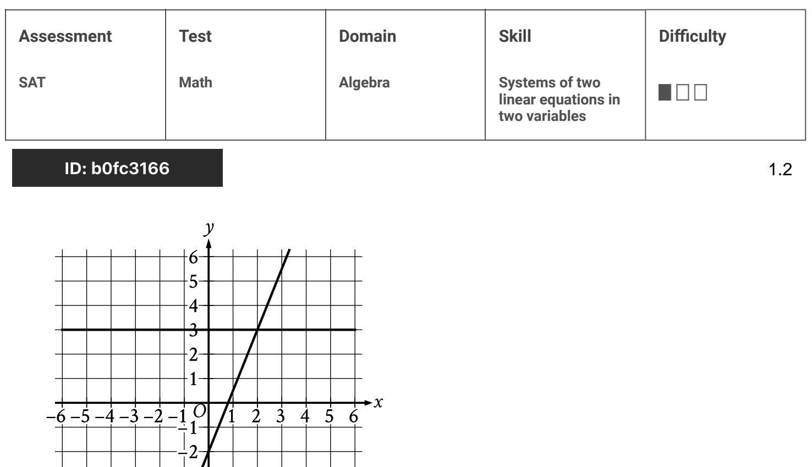

{0}------------------------------------------------

# Question ID b86123af

| Assessment | Test | Domain  | Skill                                                  | Difficulty |
|------------|------|---------|--------------------------------------------------------|------------|
| SAT        | Math | Algebra | Systems of two linear equations in two variables |            |

### ID: b86123af

Hiro and Sofia purchased shirts and pants from a store. The price of each shirt purchased was the same and the price of each pair of pants purchased was the same. Hiro purchased 4 shirts and 2 pairs of pants for \$86, and Sofia purchased 3 shirts and 5 pairs of pants for \$166. Which of the following systems of linear equations represents the situation, if x represents the price, in dollars, of each shirt and y represents the price, in dollars, of each pair of pants?

4x+2y=86 A. 3x +5y = 166 4x+3y=86 B. 2x +5y = 166 4x+2y=166 C. 3x +5y = 86 4x+3y=166 D. 2x + 5y = 86

#### ID: b86123af Answer

Correct Answer: A

#### Rationale

Choice A is correct. Hiro purchased 4 shirts and each shirt cost x dollars, so he spent a total of 4x dollars on shirts. Likewise, Hiro purchased 2 pairs of pants, and each pair of pants cost y dollars, so he spent a total of 2y dollars on pants. Therefore, the total amount that Hiro spent was 4x + 2y. Since Hiro spent \$86 in total, this can be modeled by the equation 4x + 2y = 86. Using the same reasoning, Sofia bought 3 shirts at x dollars each and 5 pairs of pants at y dollars each, so she spent a total of 3x + 5y dollars on shirts and pants. Since Sofia spent \$166 in total, this can be modeled by the equation 3x + 5y = 166.

Choice B is incorrect and may be the result of switching the number of shirts Sofia purchased with the number of pairs of pants Hiro purchased. Choice C is incorrect and may be the result of switching the total price each person paid. Choice D is incorrect and may be the result of switching the total price each person paid as well as switching the number of shirts Sofia purchased with the number of pairs of pants Hiro purchased.

Question Difficulty: Easy

1.1

{1}------------------------------------------------

# Question ID b0fc3166

The graph of a system of linear equations is shown. What is the solution (മ, ു) to the system?

A. (0, 3)

B. (1,3)

- c. (2,3)
- D. (3, 3)

## ID: b0fc3166 Answer

Correct Answer: C

Rationale

Choice C is correct. The solution to this system of linear equations is represented by the point that lies on both lines shown, or the point of intersection of the two lines. According to the graph, the point of intersection occurs when x = 2 and y = 3, or at the point (2, 3). Therefore, the solution (x, y) to the system is (2, 3).

Choice A is incorrect and may result from conceptual or calculation errors.

Choice B is incorrect and may result from conceptual or calculation errors.

Choice D is incorrect and may result from conceptual or calculation errors.

{2}------------------------------------------------

{3}------------------------------------------------

## Question ID dba8d38a

| Assessment | Test | Domain  | Skill                                                  | Difficulty |
|------------|------|---------|--------------------------------------------------------|------------|
| SAT        | Math | Algebra | Systems of two linear equations in two variables | _00C       |

### ID: dba8d38a

A petting zoo sells two types of tickets. The standard ticket, for admission only, costs \$5. The premium ticket, which includes admission and food to give to the animals, costs \$12. One Saturday, the petting zoo sold a total of 250 tickets and collected a total of \$2,300 from ticket sales. Which of the following systems of equations can be used to find the number of standard tickets, s, and premium tickets, p, sold on that Saturday?

s +p = 250 A. 5s +12p = 2,300 s +p = 250 B. 12s +5p = 2,300 5s + 12p = 250 C. s +p = 2,300 12s + 5p = 250 D. s +p = 2,300

### ID: dba8d38a Answer

Correct Answer: A

#### Rationale

Choice A is correct. It's qiven that the petting zoo sells two types of tickets, standard and that s represents the number of standard tickets sold and p represents the number of premium tickets sold. It's also given that the petting zoo sold 250 tickets on one Saturday; thus, s +p = 250. It's also given that each standard

ticket costs \$5 and each premium ticket costs \$12. Thus, the amount collected in ticket sales can be represented by 5s for standard tickets and 12p for premium tickets. On that Saturday the petting zoo collected a total of \$2,300 from ticket sales; thus, 5s + 12p = 2,300. These two equations are correctly represented in choice A.

Choice B is incorrect. The second equation in the system represents the cost per standard ticket as \$12, not \$5, and the cost per premium ticket as \$5, not \$12. Choices C and D are incorrect. The equations represent the total collected from standard and premium ticket sales as \$250, not \$2,300, and the total number of standard and premium tickets sold as \$2,300, not \$250. Additionally, the first equation in choice D represents the cost per standard ticket as \$12, not \$5, and the cost per premium ticket as \$5, not \$12.

1.3

{4}------------------------------------------------

{5}------------------------------------------------

# Question ID aff28230

| Assessment   | Test | Domain  | Skill                                                  | Difficulty |
|--------------|------|---------|--------------------------------------------------------|------------|
| SAT          | Math | Algebra | Systems of two linear equations in two variables |            |
| ID: aff28230 |      |         |                                                        |            |

x = 10 y = x + 21

The solution to the given system of equations is (x, y). What is the value of y?

| A. 2.1 |  |  |
|--------|--|--|
| B. 10  |  |  |
| C. 21  |  |  |
| D. 31  |  |  |

ID: aff28230 Answer

Correct Answer: D

Rationale

Choice D is correct. It's given by the first equation in the given system of equations that x = 10. Substituting 10 for x in the second equation in the given system yields y = 10 + 21, or y = 31. Therefore, the value of y is 31.

Choice A is incorrect and may result from conceptual or calculation errors.

Choice B is incorrect. This is the value of x, not the value of y.

Choice C is incorrect and may result from conceptual or calculation errors.

{6}------------------------------------------------

## Question ID 8abed0fb

| Assessment   | Test | Domain  | Skill                                                  | Difficulty |
|--------------|------|---------|--------------------------------------------------------|------------|
| SAT          | Math | Algebra | Systems of two linear equations in two variables | _000       |
| ID: 8abed0fb |      |         |                                                        |            |

What is the solution (x,y) to the given

system of equations?

y = 2x + 3 x = 1

A. (1,2)

B. (1,5)

c. (2,3)

D. (2,7)

### ID: 8abed0fb Answer

Correct Answer: B

Rationale

Choice B is correct. Since it's given that X = 1, substituting 1 for x in the first equation yields y = 2(1)+3. Simplifying the right-hand side of this equation yields y = 2 + 3, or y = 5. Therefore, the ordered pair (1,5) is a solution to the given system of equations.

Choice A is incorrect and may result from a calculation error when substituting 1 for x in the first equation. Choices C and D are incorrect. Because it's given that X = 1, x cannot equal 2 as stated in these ordered pairs.

{7}------------------------------------------------

## Question ID e1259a5a

| Assessment | Test | Domain  | Skill                                                  | Difficulty |
|------------|------|---------|--------------------------------------------------------|------------|
| SAT        | Math | Algebra | Systems of two linear equations in two variables |            |

### ID: e1259a5a

A system of two linear equations is graphed in the xy-plane below.

Which of the following points is the solution to the system of equations?

A. (3,9)

B. (6,15)

c. (8,10)

D. (12,18)

### ID: e1259a5a Answer

Correct Answer: A

Rationale

Choice A is correct. The solution to this system of linear equations is the point that lies on both lines graphed, or the point of intersection of the two lines. According to the graphs, the point of intersection occurs when x = 3 and y = 9, or at the point (3,9).

Choices B and D are incorrect. Each of these points lies on one line, but not on both lines in the xy-plane. Choice C is incorrect. This point doesn't lie on either of the lines graphed in the xy-plane.

Question Difficulty: Easy

1.6
{8}------------------------------------------------

# Question ID ca9bb527

| Assessment | Test | Domain  | Skill                                                  | Difficulty |
|------------|------|---------|--------------------------------------------------------|------------|
| SAT        | Math | Algebra | Systems of two linear equations in two variables |            |

ID: ca9bb527

1.7

$$y = \mathbf{n}$$

What is the solution (x, y) to the given system of equations?

A. (4, 19)

B. (7, 19)

c. (19, 4)

D. (19, 7)

ID: ca9bb527 Answer

Correct Answer: B

Rationale

Choice B is correct. It's given by the second equation in the system that y = 19. Substituting 19 for y in the first equation yields 19 = 4x - 9. Adding 9 to both sides of this equation yields 28 = 4x. Dividing both sides of this equation by 4 yields 7 = x. Therefore, since x = 7 and y = 19, the solution (x, y) to the given system of equations is (7, 19).

Choice A is incorrect and may result from conceptual or calculation errors.

Choice C is incorrect and may result from conceptual or calculation errors.

Choice D is incorrect and may result from conceptual or calculation errors.

{9}------------------------------------------------

# Question ID ece00725

| Assessment | Test | Domain  | Skill                                                  | Difficulty |
|------------|------|---------|--------------------------------------------------------|------------|
| SAT        | Math | Algebra | Systems of two linear equations in two variables |            |

ID: ece00725

1.8

Connor has c dollars and Maria has m dollars. Connor has 4 times as maria, and together they have a total of \$25.00. Which system of equations represents this situation?

A. c = 4m c + m = 25 B. m = 4c c + m = 25 C. c = 25m c + m = 4 D. m = 25c c + m = 4

#### ID: ece00725 Answer

Correct Answer: A

Rationale

Choice A is correct. It's given that Connor has c dollars, Maria has m dollars, and Connor has 4 times as many dollars as Maria. This can be represented by the equation c = 4m. It's also given that together, Connor and Maria have a total of \$25.00, which can be represented by the equation c + m = 25. Therefore, the system consisting of the equations c = 4m and c + m = 25 represents this situation.

Choice B is incorrect. The equation m = 4crepresents a situation where Maria has 4 times as many dollars as Connor, rather than the situation where Connor has 4 times as many dollars as Maria.

Choice C is incorrect. The equation c = 25m represents a situation where Connor has 25 times, rather than 4 times, as many dollars as Maria. The equation c + m = 4 represents a situation where Connor and Maria together have a total of \$4.00, rather than \$25.00.

Choice D is incorrect. The equation m = 25c represents a situation where Maria has 25 times as many dollars as Connor, rather than the situation where Connor has 4 times as many dollars as Maria. The equation c + m = 4 represents a situation where Connor and Maria together have a total of \$4.00, rather than \$25.00.

{10}------------------------------------------------

# Question ID ee031767

| Assessment | Test | Domain  | Skill                                                  | Difficulty |
|------------|------|---------|--------------------------------------------------------|------------|
| SAT        | Math | Algebra | Systems of two linear equations in two variables |            |

### ID: ee031767

A dance teacher ordered outfits for students for a dance recital. Outfits for boys cost \$26, and outfits for girls cost \$35. The dance teacher ordered a total of 28 outfits and spent \$881. If b represents the number of outfits the dance teacher ordered for boys and g represents the number of outfits the dance teacher ordered for girls, which of the following systems of equations can be solved to find b and g ?

26b +35g = 28 A. b + g = 881 26b +35g =881 B. b+g=28 26g +35b = 28 C. b+g=881 26g +35b =881 D. b+g=28

#### ID: ee031767 Answer

Correct Answer: B

#### Rationale

Choice B is correct. Outfits for boys cost \$26 each and the teacher ordered b outfits for boys, so the teacher spent 26b dollars on outfits for boys. Similarly, outfits for girls cost \$35 each and the teacher ordered q outfits for girls, so the teacher spent 35g dollars on outfits for girls. Since the teacher spent a total of \$881 on outfits for boys and girls, the equation 26b + 35g = 881 must be true. And since the teacher ordered a total of 28 outfits, the equation b + g = 28 must also be true.

Choice A is incorrect and may result from switching the constraint on the total number of outfits with the constraint on the cost of the outfits. Choice C is incorrect and may result from switching the constraint on the total number of outfits with the constraint on the cost of the outfits, as well as switching the cost of the outfits for boys with the cost of the outfits for girls. Choice D is incorrect and may result from switching the cost of the outfits for boys with the cost of the outfits for girls.

Question Difficulty: Easy

1.9

{11}------------------------------------------------

# Question ID cd33b015

| Assessment | Test | Domain  | Skill                                                  | Difficulty |
|------------|------|---------|--------------------------------------------------------|------------|
| SAT        | Math | Algebra | Systems of two linear equations in two variables |            |

### ID: cd33b015 x+y=20

2(x+y)+3y=85

1.10

If (X,y) is the solution to the given system of

equations, what is the value of y ?

A. 10

B. 15

C. 60

D. 65

### ID: cd33b015 Answer

Correct Answer: B

Rationale

Choice B is correct. Substituting 20 for x + y in the second equation in the system yields 2(20) + 3y = 85, or 40 + 3y = 85. Subtracting 40 from both sides of this equation yields 3y = 45. Dividing both sides of this equation by 3 yields y = 15.

Choice A is incorrect. If y = 10, then x = 10 since x + y = 20. However, substituting 10 for both x and y in the second equation yields 70 = 85, which is a false statement. Choice C is incorrect. If y = 60, then x = = 40 since x + y = 20. However, substituting these values for x and y in the second equation yields 220 = 85, which is a false statement. Choice D is incorrect. If y = 65, then x = = 45 since x + y = 20. However, substituting these values for x and y in the second equation yields 235 = 85, which is a false statement.

{12}------------------------------------------------

# Question ID 0d1dca87

| Assessment   | Test | Domain  | Skill                                                  | Difficulty |
|--------------|------|---------|--------------------------------------------------------|------------|
| SAT          | Math | Algebra | Systems of two linear equations in two variables | _000       |
| ID: 0d1dca87 |      |         |                                                        | 1.11       |

 If (x y) is the solution to the given system of equations, what is the value of y ?

#### ID: 0d1dca87 Answer

#### Rationale

3x + y = 29 x = 2

The correct answer is 23. Since it's given that x = 2, the value of y can be found by substituting 2 for x in the first equation and solving for y. Substituting 2 for x yields 3(2) + y = 29, or 6 + y = 29. Subtracting 6 from both sides of this equation yields y = 23

{13}------------------------------------------------

# Question ID 0df106df

| Assessment | l'est | Domain  | Skill                                                  | Difficulty |
|------------|-------|---------|--------------------------------------------------------|------------|
| SAT        | Math  | Algebra | Systems of two linear equations in two variables |            |

### ID: 0df106df

1.12

An online bookstore sells novels and magazines. Each novel sells for \$4, and each magazine sells for \$1. If Sadie purchased a total of 11 novels and magazines that have a combined selling price of \$20, how many novels did she purchase?

A. 2

B. 3

C. 4

D. 5

### ID: 0df106df Answer

Correct Answer: B

Rationale

Choice B is correct. Let n be the number of novels and m be the number of magazines that Sadie purchased. If Sadie purchased a total of 11 novels and magazines, then n+m = 11. It is given that the combined price of 11

novels and magazines is \$20. Since each novel sells for \$4 and each magazine sells for \$1, it follows that 4n + m = 20. So the system of equations below must hold.

4n+m = 20 n +m = 11

Subtracting corresponding sides of the second equation from the first equation yields 3n = 9, so n = 3. Therefore, Sadie purchased 3 novels.

Choice A is incorrect. If 2 novels were purchased, then a total of \$8 was spent on novels. That leaves \$12 to be spent on magazines, which means that 12 magazines would have been purchased. However, Sadie purchased a total of 11 novels and magazines. Choices C and D are incorrect. If 4 novels were purchased, then a total of \$16 was spent on novels. That leaves \$4 to be spent on magazines, which means that 4 magazines would have been purchased. By the same logic, if Sadie purchased 5 novels, she would have no money at all (\$0) to buy magazines. However, Sadie purchased a total of 11 novels and magazines.

{14}------------------------------------------------

# Question ID 7d89376f

| Assessment | Test | Domain  | Skill                                                  | Difficulty |
|------------|------|---------|--------------------------------------------------------|------------|
| SAT        | Math | Algebra | Systems of two linear equations in two variables |            |

### ID: 7d89376f

1.13

A discount airline sells a certain number of tickets, x, for a flight for \$90 each. It sells the number of remaining tickets, y, for \$250 each. For a particular flight, the airline sold 120 tickets and collected a total of \$27,600 from the sale of those tickets. Which system of equations represents this relationship between x and y ?

$$\begin{aligned} \text{A. } \begin{cases} \text{x} + \text{y} = \text{120} \\ \text{90x} + \text{250} \text{y} = \text{27}, \text{600} \end{cases} \\ \text{C. } \begin{cases} \text{x} + \text{y} = \text{120} \\ \text{90x} + \text{250} \text{y} = \text{120} \text{(27,600)} \end{cases} \\ \text{C. } \begin{cases} \text{x} + \text{y} = \text{27}, \text{600} \\ \text{90x} + \text{250} \text{y} = \text{120} \text{(27,600)} \end{cases} \\ \text{D. } \begin{cases} \text{90x} = \text{250} \text{y} \\ \text{120x} + \text{120y} = \text{27,600} \end{cases} \end{aligned}$$

#### ID: 7d89376f Answer

Correct Answer: A

#### Rationale

Choice A is correct. The airline sold two types of tickets for this flight: x tickets at \$90 each and the remaining tickets, y, at \$250 each. Because the airline sold a total of 120 tickets for this flight, it must be true that x + y = 120. The amount, in dollars, collected from the sale of x tickets at \$90 each is represented by 90x. The amount, in dollars, collected from the sale of the remaining y tickets at \$250 each is represented by 250y. It is given that a total of \$27,600 was collected from the sale of all tickets. Therefore, it must also be true that 90x + 250y = 27,600.

Choice B is incorrect. The total number of tickets sold is represented correctly as x + y = 120. The total amount, in dollars, collected from the sale of the x tickets at \$90 each and the remaining tickets, y, at \$250 has been correctly represented as 90x + 250y. However, according to the information given, this total should be equal to 27,600, not 120(27,600) dollars. Choice C is incorrect. The total number of tickets sold has been correctly represented as x + y. However, according to the information given, this total should be equal to 120, not 27,600, as shown in choice C. The total amount, in dollars, collected from the sale of the x tickets at \$90 each and the remaining tickets, y, at \$250 has been correctly represented as 90x +250y. However, according to the information qiven, this total should be equal to 27,600, not 120(27,600) dollars. Choice D is incorrect. The two equations given in choice D have no meaning in this context.

{15}------------------------------------------------
{16}------------------------------------------------

# Question ID 17f176ec

| Assessment | Test | Domain  | Skill                                                  | Difficulty |
|------------|------|---------|--------------------------------------------------------|------------|
| SAT        | Math | Algebra | Systems of two linear equations in two variables |            |

### ID: 17f176ec

1.14

A movie theater charges \$11 for each full-price ticket and \$8.25 for each reduced-price ticket. For one movie showing, the theater sold a total of 214 full-price and reduced-price tickets for \$2,145. Which of the following systems of equations could be used to determine the number of full-price tickets, f, and the number of reduced-price tickets, r, sold?

$$\begin{array}{c} f + r = 2, \mathsf{145} \\ \mathsf{11f} + \mathsf{825}r = 2\mathsf{14} \end{array}$$

$$\begin{array}{c} f + r = 2 \,\mathsf{14} \\ \mathsf{11}f + \mathsf{82} \mathsf{25}r = \mathsf{21} \mathsf{14} \mathsf{5} \end{array}$$

$$\begin{array}{c} f + r = 2 \,\mathsf{14} \\ \text{8.25}f + \mathsf{11} \,\mathsf{r} = 2, \mathsf{145} \end{array}$$

$$\begin{array}{c} f + r = 2, \mathsf{145} \\ \mathsf{8.25}f + \mathsf{14}r = 2 \mathsf{14} \end{array}$$

### ID: 17f176ec Answer

Correct Answer: B

#### Rationale

Choice B is correct. The movie theater sells f full-price tickets and r reduced-price tickets, so the total number of tickets sold is f + r. Since the movie theater sold a total of 214 full-price and reduced-price tickets for one movie showing, it follows that f + r = 214. The movie theater charges \$11 for each full-price ticket; thus, the sales for full-price tickets, is given by 11f. The movie theater charges \$8.25 for each reduced-price ticket; thus, the sales for reduced-price tickets, in dollars, is given by 8.25r. Therefore, the total sales, in dollars, for the movie showing is given by 11f + 8.25r. Since the total sales for all full-price and reduced-price tickets is \$2,145, it follows that 11f + 8.25r = 2,145.

Choice A is incorrect. This system of equations suggests that the movie theater sold a total of 2,145 full-price and reduced-price tickets for a total of \$214. Choice C is incorrect. This system suggests that the movie theater charges \$8.25 for each full-price ticket and \$11 for each reduced price ticket. Choice D is incorrect. This system suggests that the movie theater charges \$8.25 for each full-price ticket and \$11 for each reduced-price ticket and sold a total of 2,145 tickets for a total of \$214.

{17}------------------------------------------------

# Question ID 44d65912

| Assessment | Test | Domain  | Skill                                                  | Difficulty |
|------------|------|---------|--------------------------------------------------------|------------|
| SAT        | Math | Algebra | Systems of two linear equations in two variables |            |

### ID: 44d65912

1.15

Angela is playing a video game. In this game, players can score points only by collecting coins and stars. Each coin is worth c points, and each star is worth s points.

- · The first time she played, Angela scored 700 points. She collected 20 coins and 10 stars.
- The second time she played, Angela scored 850 points. She collected 25 coins and 12 stars.

Which system of equations can be used to correctly determine the values of c and s ?

10c+20s=700 A. 12c+25s=850 20c +10s = 700 B. 25c+12s = 850 20c+700s = 10 C. 25c +850s = 12 700c +20s = 10 D. 850c +25s = 12

#### ID: 44d65912 Answer

Correct Answer: B

#### Rationale

Choice B is correct. The number of coins collected can be multiplied by c to qive the score from the points earned from coins. Similarly, the number of stars collected can be multiplied by s to give the score from the points earned from the stars. The total score each time Angela played is 20c + 10s = 700, and the

total score the second time she played is 25c + 12s = 850.

Choices A, C, and D are incorrect and may result from misidentifying the terms of the equation. Choice A switches coins and stars, choice C switches stars and points, and choice D misidentifies coins, stars, and points.

{18}------------------------------------------------

# Question ID 4b76c7f1

| Assessment   | Test | Domain  | Skill                                                  | Difficulty |
|--------------|------|---------|--------------------------------------------------------|------------|
| SAT          | Math | Algebra | Systems of two linear equations in two variables |            |
| ID: 4b76c7f1 |      |         |                                                        | 1 16       |

$$\begin{aligned} \mathsf{Zx} + \mathsf{Ty} &= \mathsf{g} \\ \mathsf{Bx} + \mathsf{B}\mathsf{By} &= a \end{aligned}$$

In the given system of equations, a is a constant. If the system has infinitely many solutions, what is the value of a ?

| A. 4  |  |  |
|-------|--|--|
| B. 9  |  |  |
| C. 36 |  |  |
| D. 54 |  |  |

ID: 4b76c7f1 Answer

Correct Answer: C

#### Rationale

Choice C is correct. A system of two linear equations has infinitely many solutions if one equation is equivalent to the other. This means that when the two equations are written in the same form, each coefficient or constant in one equation is equal to the corresponding coefficient or constant in the other equation multiplied by the same number. The equations in the given system of equations are written in the same form, with x and y on the left-hand side of the equation and a constant on the right-hand side of the equation. The coefficients of x and y in the second equation are equal to the coefficients of x and y, respectively, in the first equation multiplied by 4: 8 = 2(4) and 28 = 7(4). Therefore, the constant in the second equation must be equal to 4 times the constant in the first equation: a = 9(4), or a = 36

Choices A, B, and D are incorrect. When a = 4, a = 9, or q = 54, the given system of equations has no solution.

{19}------------------------------------------------

# Question ID 939fc21b

| Assessment | Test | Domain  | Skill                                                  | Difficulty |
|------------|------|---------|--------------------------------------------------------|------------|
| SAT        | Math | Algebra | Systems of two linear equations in two variables |            |

## ID: 939fc21b

1.17

## s + 7r = 27 r = 3 What is the solution (r, s) to the given system of equations?

- A. (6, 3)
- B. (3,6)
- c. (3, 27)
- D. (27, 3)

### ID: 939fc21b Answer

#### Correct Answer: B

#### Rationale

Choice B is correct. The second equation in the given system is r = 3. Substituting 3 for r in the first equation in the given system yields s + 73 = 27, or s + 21 = 27. Subtracting 21 from both sides of this equation yields s = 6. Therefore, the solution r, s to the given system of equations is 3,6.

Choice A is incorrect. This is the solution s, r, not r, s, to the given system of equations.

Choice C is incorrect and may result from conceptual or calculation errors.

Choice D is incorrect and may result from conceptual or calculation errors.

{20}------------------------------------------------

# Question ID e6545fa8

## ID: e6545fa8

1.18

The graph of a system of linear equations is shown. What is the solution (ႏ, y) to the system?

- A. (2, 3)
- B. (3, 4)
- c. (4,5)
- D. (5,6)

### ID: e6545fa8 Answer

Correct Answer: B

{21}------------------------------------------------

#### Rationale

Choice B is correct. If a point x, y lies on both lines in the graph of two linear equations, the ordered pair x, y is a solution to the system. The graph of a system of two linear equations, where the two lines in the graph intersect at the point 3, 4. Therefore, the point 3, 4 lies on both lines, so the ordered pair 3, 4 is the solution to the system.

Choice A is incorrect. The point 2, 3 lies on one, not both, of the lines in the graph shown.

Choice C is incorrect. The point 4, 5 lies on one, not both, of the lines in the graph shown.

Choice D is incorrect. The point 5, 6 lies on one, not both, of the lines in the graph shown.

{22}------------------------------------------------

# Question ID f5563c26

| Assessment | Test | Domain  | Skill                                                  | Difficulty |
|------------|------|---------|--------------------------------------------------------|------------|
| SAT        | Math | Algebra | Systems of two linear equations in two variables |            |

## ID: f5563c26

1.19

y = 4 x = y + 6 The solution to the given system of equations is (x, y). What is the value of x?

| A. 10 |  |  |
|-------|--|--|
| B. 6  |  |  |
| C. 4  |  |  |
| D. 2  |  |  |

### ID: f5563c26 Answer

#### Correct Answer: A

#### Rationale

Choice A is correct. According to the first equation in the given system, y = 4. Substituting 4 for y in the second equation in the given system yields x = 4 + 6, or x = 10.

Choice B is incorrect and may result from conceptual or calculation errors. This is the value of y, not x.

Choice D is incorrect and may result from conceptual or calculation errors.