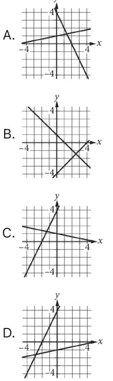
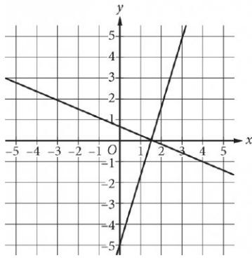

{0}------------------------------------------------

## Question ID cb8f449f

| Assessment | Test | Domain  | Skill                                                  | Difficulty |
|------------|------|---------|--------------------------------------------------------|------------|
| SAT        | Math | Algebra | Systems of two<br>linear equations in<br>two variables |            |

ID: cb8f449f

The system of equations above has solution (x,

y). What is the value of x ?

A. 3

7 B. 2

c. 4

D. 6

### ID: cb8f449f Answer

Correct Answer: D

Rationale

Choice D is correct. Adding the corresponding sides of the two equations eliminates y and yields x = 6, as shown.

$$\frac{1}{2}\mathbf{y} = 4$$

$$\lambda - \frac{1}{2}\mathbf{y} = \mathbf{2}$$

$$\frac{\mathbf{x} + \mathbf{0} = \mathbf{6}}{\mathbf{x} + \mathbf{0} = \mathbf{6}}$$

 If (x, y) is a solution to the system, then (x, y) satisfies both equations in the system and any equation derived from them. Therefore, x = 6

Choices A, B, and C are incorrect and may be the result of errors when solving the system.

2.1

{1}------------------------------------------------

{2}------------------------------------------------

## Question ID 71189542

| Assessment | Test | Domain  | Skill                                                  | Difficulty |
|------------|------|---------|--------------------------------------------------------|------------|
| SAT        | Math | Algebra | Systems of two<br>linear equations in<br>two variables |            |

### ID: 71189542

2.2

A group of 202 people went on an overnight camping trip, taking 60 tents with them. Some of the tents held 2 people each, and the rest held 4 people each. Assuming all the tents were filled to capacity and every person got to sleep in a tent, exactly how many of the tents were 2-person tents?

- A. 30
B. 20

C. 19

- D. 18
### ID: 71189542 Answer

Correct Answer: C

Rationale

Choice C is correct. Let x represent the number of 2-person tents and let y represent the number of 4-person tents. It is given that the total number of tents was 60 and the total number of people in the group was 202. This situation can be expressed as a system of two equations, x + y = 60 and 2x + 4y = 202. The first equation can be rewritten as y = - x +60. Substituting -x +60 for y in the equation 2x +4y = 202 yields 2x + 4( - x + 60) = 202. Distributing and combining like terms gives −2x + 240 = 202. Subtracting 240 from both sides of —2x +240 = 202 and then dividing both sides by —2 gives x = 19. Therefore, the number of 2person tents is 19.

Alternate approach: If each of the 60 tents held 4 people, the total number of people that could be accommodated in tents would be 240. However, the actual number of people who slept in tents was 202. The difference of 38 accounts for the 2-person tents. Since each of these tents holds 2 people fewer than a 4-person

38 = 19 tent, 2 gives the number of 2-person tents.

Choice A is incorrect. This choice may result from assuming exactly half of the tents hold 2 people. If that were true, then the total number of people who slept in tents would be 2(30) +4(30) = 180; however, the total

number of people who slept in tents was 202, not 180. Choice B is incorrect. If 20 tents were 2-person tents, then the remaining 40 tents would be 4-person tents. Since all the tents were filled to capacity, the total number of people who slept in tents would be 2(20)+4(40)=40+160 = 200; however, the total number of

people who slept in tents was 202, not 200. Choice D is incorrect. If 18 tents were 2-person tents, then the

{3}------------------------------------------------

remaining 42 tents would be 4-person tents. Since all the tents were filled to capacity, the total number of people who slept in tents would be 2(18) +4(42) = 36 + 168 = 204; however, the total number of people who

slept in tents was 202, not 204.

{4}------------------------------------------------

### Question ID 6e6a3241

| Assessment | Test | Domain  | Skill                                                  | Difficulty |
|------------|------|---------|--------------------------------------------------------|------------|
| SAT        | Math | Algebra | Systems of two<br>linear equations in<br>two variables |            |

2.3

### ID: 6e6a3241 x + 5y = 5

2x-y=-4

Which of the following graphs in the xy-plane could be used to solve the system of equations above?



#### ID: 6e6a3241 Answer

Correct Answer: C

Rationale

Choice C is correct. The graph of a system of equations is the graph that shows the lines represented by each of the equations in the system. The x-intercept of the graph of each given equation can be found by substituting 0 for y in each equation: x +5(0) = 5, or x = 5, and 2x = 0 = − 4, or x = − 2. The y-intercept of the graph of each equation can be found by substituting 0 for x in each equation: 0 + 5y = 5, or y = 1, and 2(0) - y = - 4 or y = 4. Using these x- and y- intercept values, the line that has equation x + 5y = 5 passes through the points (0,1) and (5,0), and the line that has equation 2x - y = −4 passes through the points (0,4)

{5}------------------------------------------------

and (—2,0). Only the lines in choice C pass through these points and can be used to solve the given system of equations.

Choices A, B, and D are incorrect. In choices A and B, neither line passes through (0,1) and (−2,0). In choice D, although one line passes through (0,4) and (−2,0) the other line doesn't pass through (0,1) and (5,0).

{6}------------------------------------------------

## Question ID f5929f7a

| Assessment | Test | Domain  | Skill                                                  | Difficulty |
|------------|------|---------|--------------------------------------------------------|------------|
| SAT        | Math | Algebra | Systems of two<br>linear equations in<br>two variables |            |

ID: f5929f7a

2.4

$$\begin{array}{c} y = -\frac{1}{9}x \\ y = \frac{1}{2}x \end{array}$$

The solution to the given system of equations is (x, y). What is the value of x?

A. - 9 B. -7 c. 0 D. 2

ID: f5929f7a Answer

Correct Answer: C

Rationale

Choice C is correct. It's given by the first equation in the system that y = — x x. Substituting -- ax for y in the second equation in the system yields 2 x. Multiplying the left-hand side of this equation by 3 and the ry w. Adding & x to both sides of this equation yields 0 = right-hand side by % yield Multiplying both sides of this equation by 4 yields x = 0

Choice A is incorrect and may result from conceptual or calculation errors.

Choice B is incorrect and may result from conceptual or calculation errors.

Choice D is incorrect and may result from conceptual or calculation errors.

{7}------------------------------------------------

## Question ID ed92fb68

| Assessment | Test | Domain  | Skill                                                  | Difficulty |
|------------|------|---------|--------------------------------------------------------|------------|
| SAT        | Math | Algebra | Systems of two<br>linear equations in<br>two variables |            |

### ID: ed92fb68

```
4x +5y = 100
5x + 4y = 62
```
If the system of equations above has solution (x, y),

what is the value of x+v ?

A. O

B. 9

C. 18

D. 38

### ID: ed92fb68 Answer

Correct Answer: C

Rationale

Choice C is correct. Adding the given equations yields 9x + 9y = 162. Dividing each side of the equation 9x + 9y = 162 by 9 gives x + y = 18.

Choice A is incorrect and may result from incorrectly adding the equations. Choice B is incorrect and may result from conceptual or computational errors. Choice D is incorrect. This value is equivalent to y – x.

Question Difficulty: Medium

2.5

{8}------------------------------------------------

# Question ID 19fdf387

| Assessment | Test | Domain  | Skill                                                  | Difficulty |
|------------|------|---------|--------------------------------------------------------|------------|
| SAT        | Math | Algebra | Systems of two<br>linear equations in<br>two variables |            |

### ID: 19fdf387

2.6

In the xy-plane, the graph of y = x + 3 intersects the graph of y = 2x − 6 at

the point (α,b). What is the value of a ?

A. 3

B. 6

C. 9

D. 12

### ID: 19fdf387 Answer

Correct Answer: C

#### Rationale

Choice C is correct. Since the graph of y = x + 3 intersects the graph of y = 2x = 6 at the point (a,b), the ordered pair (q.b) is the solution to the system of linear equations consisting of y = x + 3 and y = 2x −6, and the value of a is the value of x in the solution of this system. Since both x + 3and 2x - 6 are equal to y, it follows that x + 3 = 2x = 6. Subtracting x from and adding 6 to both sides of the equation yields 9 = x. Therefore, the value of a is 9.

Choices A and B are incorrect and may result from a calculation or conceptual error in solving the system of equations consisting of y = x + 3 and y = 2x = 6. Choice D is incorrect. This is the value of b, not a.

{9}------------------------------------------------

### Question ID c5082ce3

| Assessment | Test | Domain  | Skill                                                  | Difficulty |
|------------|------|---------|--------------------------------------------------------|------------|
| SAT        | Math | Algebra | Systems of two<br>linear equations in<br>two variables |            |

#### ID: c5082ce3

2.7

The score on a trivia game is obtained by subtracting the number of incorrect answers from twice the number of correct answers. If a player answered 40 questions and obtained a score of 50, how many questions did the player answer correctly?

#### ID: c5082ce3 Answer

#### Rationale

The correct answer is 30. Let x represent the number of correct answers from the player and y represent the number of incorrect answers from the player answered 40 questions in total, the equation x + y = 40 represents this situation. Also, since the score is found by subtracting the number of incorrect answers from twice the number of correct answers and the player received a score of 50, the equation 2x – y = 50 represents this situation. Adding the equations in the system of two equations together yields (x +y) +(2x -y) = 40 + 50. This can be rewritten as 3x = 90. Finally, solving for x by dividing both sides of the equation by 3 yields x = 30.
{10}------------------------------------------------

# Question ID 092ad67d

| Assessment | Test | Domain  | Skill                                                  | Difficulty |
|------------|------|---------|--------------------------------------------------------|------------|
| SAT        | Math | Algebra | Systems of two<br>linear equations in<br>two variables |            |

ID: 092ad67d

2.8

x + 2y = 6 x — 2y = 4

The solution to the given system of equations is (x, y). What is the value of x?

| A. 2.5 |  |  |
|--------|--|--|
| B. 5   |  |  |
| C. 6   |  |  |
| D. 10  |  |  |
|        |  |  |

ID: 092ad67d Answer

Correct Answer: B

Rationale

Choice B is correct. Adding the first equation to the second equation in the given system yields (x + 2y) + (x = 2y) = 6 + 4, or (x + x) + (2y = 2y) = 10. Combining like terms in this equation yields 2x = 10. Dividing both sides of this equation by 2 yields x = 5. Thus, the value of x is 5.

Choice A is incorrect and may result from conceptual or calculation errors.

Choice C is incorrect and may result from conceptual or calculation errors.

Choice D is incorrect. This is the value of 2x, not x.

{11}------------------------------------------------

### Question ID e77a76ce

| Assessment | Test | Domain  | Skill                                                  | Difficulty |
|------------|------|---------|--------------------------------------------------------|------------|
| SAT        | Math | Algebra | Systems of two<br>linear equations in<br>two variables |            |

ID: e77a76ce

2.9

Which of the following systems of linear equations has no solution?

```
A. y = 6x + 3
  y = 6x + 9
B. y = 10
  y = 10x + 10
C. y = 14x + 14
  y = 10x + 14
D. x = 3
  y = 10
```
#### ID: e77a76ce Answer

Correct Answer: A

Rationale

Choice A is correct. A system of two linear equations in two variables, w and y, has no solution if the graphs of the lines represented by the equations in the xy-plane are distinct and parallel. The graphs of two lines in the xy-plane represented by equations in slope-intercept form, y = mx + b, where m and b are constants, are parallel if their slopes, m, are the same and are distinct if their y-coordinates of the y-intercepts, b, are different. In the equations y = 6x + 3 and y = 6x + 9, the values of m are each 6, and the values of bare 3 and 9, respectively. Since the slopes of these lines are the same and the y-coordinates of the y-intercepts are different, it follows that the system of linear equations in choice A has no solution.

Choice B is incorrect. The two lines represented by these equations are a horizontal line and a line with a slope of 10 that have the same y-coordinate of the y-intercept. Therefore, this system has a solution, (0, 10), rather than no solution.

Choice C is incorrect. The two lines represented by these equations have different slopes and the same ycoordinate of the y-intercept. Therefore, this system has a solution, (0, 14), rather than no solution.

Choice D is incorrect. The two lines represented by these equations are a vertical line and a horizontal line. Therefore, this system has a solution, (3, 10), rather than no solution.

{12}------------------------------------------------

# Question ID 5e422ff9

| Assessment | Test | Domain  | Skill                                                  | Difficulty |
|------------|------|---------|--------------------------------------------------------|------------|
| SAT        | Math | Algebra | Systems of two<br>linear equations in<br>two variables |            |

2.10

ID: 5e422ff9

$$\begin{aligned} y &= 2x - 3 \\ 3y &= 5x \end{aligned}$$

In the solution to the system of equations above, what is the value of y ?

A. -15 B. - 9 C. g D. 15

#### ID: 5e422ff9 Answer

Correct Answer: D

Rationale

Choice D is correct. Multiplying both sides of y = 2x = 3 by 5 results in 5y = 10x = 15. Multiplying both sides of 3y = 5x by 2 results in 6y = 10x. Subtracting the resulting equations yields 5y = 6y = (10x = 15) = (10x), which simplifies to -y = - 15. Dividing both sides of -y = - 15 by =1 results in y = 15.

Choices A and B are incorrect and may result from incorrectly subtracting the transformed equation. Choice C is incorrect and may result from finding the value of x instead of the value of y.

{13}------------------------------------------------

# Question ID 2704399f

| Assessment   | Test | Domain  | Skill                                                  | Difficulty |
|--------------|------|---------|--------------------------------------------------------|------------|
| SAT          | Math | Algebra | Systems of two<br>linear equations in<br>two variables |            |
| ID: 2704399f |      |         |                                                        | 2.11       |



Which of the following systems of equations has the same solution as the system of equations graphed above?

y=0 A. X = = = = = = = = = = = = = = = = = = = = = = = = = = = = = = = = = = = = = = = = = = = = = = = = = = = = = = = = = = = = = = = = = = = = = = = = = = = = = = = = = = = = m ( = = = = = = = = = = = = = = = = = = = = = = = = = = = = = = = = = = = = = = = = = = = = = = = = = = = = = = = = = = = = = = = = = = = = = = = = = = = = = = = = = = = = = y =0
C. x = 1 y = 1 D. x = 0

#### ID: 2704399f Answer

Correct Answer: A

Rationale

Choice A is correct. The solution to a system of equations is the coordinates of the intersection point of the graphs of the equations in the xy-plane. Based on the graph, the solution to the given system of equations is . In the xy-plane, the graph of y = 0 is a horizontal line on which every ybest approximated as 3 3 coordinate is 0, and the graph of * = 2 is a vertical line on which every x-coordinate is 2 . These graphs

{14}------------------------------------------------

0). Therefore, the system of equations in choice A has the same solution as the given intersect at the point system.

s) Choices B, C, and D are incorrect. If graphed in the xy-plane, these choices would intersect at the points 3 (1,0), and (0,1), respectively, not

{15}------------------------------------------------

# Question ID b544a348

| Assessment | Test | Domain  | Skill                                                  | Difficulty |
|------------|------|---------|--------------------------------------------------------|------------|
| SAT        | Math | Algebra | Systems of two<br>linear equations in<br>two variables |            |

ID: b544a348 5x +3y = 38 x + 3y = 10

2.12

In the solution (x, y) to the system of equations above, what is the value of x ?

#### ID: b544a348 Answer

Rationale

The correct answer is 7. Subtracting the second equation from the first equation eliminates the variable y.

5x+3y = 38 -(x+3y = 10) 4x = 28

Dividing both sides of the resulting equation by 4 yields x = 7.

{16}------------------------------------------------

# Question ID e53688cb

| Assessment | Test | Domain  | Skill                                                  | Difficulty |
|------------|------|---------|--------------------------------------------------------|------------|
| SAT        | Math | Algebra | Systems of two<br>linear equations in<br>two variables |            |

ID: e53688cb

2.13

x + 3y = 29 3y = 11

The solution to the given system of equations is (x, y). What is the value of x?

Correct Answer: 18

Rationale

The correct answer is 18. It's given by the second equation in the system that 3y = 11. Substituting 11 for 3y in the first equation in the system, x + 3y = 29, yields x + 11 = 29. Subtracting 11 from both sides of this equation yields x = 18.

{17}------------------------------------------------

# Question ID e3bbde69

| Assessment | Test | Domain  | Skill                                                  | Difficulty |
|------------|------|---------|--------------------------------------------------------|------------|
| SAT        | Math | Algebra | Systems of two<br>linear equations in<br>two variables |            |

ID: e3bbde69

2.14

+ y = 5 y = 9x + 1 The solution to the given system of equations is (x, y). What is the value of x?

-6

B. Th

- C. 15
- 
- D. 4

### ID: e3bbde69 Answer

#### Correct Answer: B

#### Rationale

Choice B is correct. The second equation in the given system is y = 9x + 1. Substituting 9x + 1 for y in the first equation in the given system yields 8x + 9x + 1 = 5, which is equivalent to 17x + 1 = 5. Subtracting 1 from both sides of this equation yields 17x = 4. Dividing both sides of this equation by 17 yields x = _ 17

Choice A is incorrect and may result from conceptual or calculation errors.

Choice C is incorrect and may result from conceptual or calculation errors.

Choice D is incorrect and may result from conceptual or calculation errors.

{18}------------------------------------------------

# Question ID a0489274

| Assessment | Test | Domain  | Skill                                                  | Difficulty |
|------------|------|---------|--------------------------------------------------------|------------|
| SAT        | Math | Algebra | Systems of two<br>linear equations in<br>two variables |            |

### ID: a0489274

2.15

- = x The solution to the given system of equations is (x, y). What is the value of x? A. -5 B. 0
- C. 2
- D. 7

### ID: a0489274 Answer

#### Correct Answer: B

#### Rationale

Choice B is correct. It's given by the first equation in the system that y = - - - >: Substituting - - x for y in the second equation in =x, which is equivalent to x to both sides of this equation yields -x + the system, ් yields 0 = x. Therefore, the value of x is 0.
12 Multiplying both sides of this equation by 35 35

Choice A is incorrect and may result from conceptual or calculation errors.

Choice C is incorrect and may result from conceptual or calculation errors.

Choice D is incorrect and may result from conceptual or calculation errors.