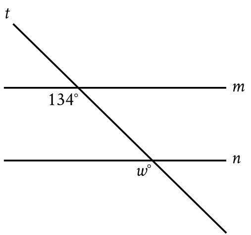
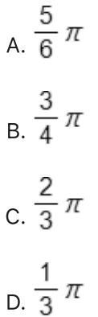

{0}------------------------------------------------

# Question ID 8e7689e0

| Assessment   | Test | Domain                       | Skill   | Difficulty |
|--------------|------|------------------------------|---------|------------|
| SAT          | Math | Geometry and Trigonometry | Circles |            |
| ID: 8e7689e0 |      |                              |         | 2.1        |

The number of radians in a 720-degree angle can be written as απ, where

a is a constant. What is the value of a ?

#### ID: 8e7689e0 Answer

Rationale

The correct answer is 4. There are π radians in a 180° angle measure of 720° is 4 times greater than an angle measure of 180°. Therefore, the number of radians in a 720° angle is 4 π.

{1}------------------------------------------------

## Question ID 74d8b897

| Assessment | Test | Domain                       | Skill   | Difficulty |
|------------|------|------------------------------|---------|------------|
| SAT        | Math | Geometry and Trigonometry | Circles |            |
|            |      |                              |         |            |

ID: 74d8b897

2.2

An angle has a measure of ​​​​​​​​​​​​​​​​​​​​​​​​​​​​​​​​​​​​​​​​​​​​​​​​​​​​​​​​​​​​​​​​​​​​​​​​​​​​​​​​​​​​​​​​​​​​​​​​​​​​​​​​​​​​​​​​​​​​​​​​​​​​​​​​​​​​​​​​​​​​​​​​​​​

### ID: 74d8b897 Answer

n radians

Correct Answer: 81

Rationale

The correct answer is 81. The measure of an angle, in degrees, can be found by multiplying its measure, in radians, by 180 degrees . Multiplying the given angle measure, 20 radians, by 100 degrees yields n radians 180 degrees , which is equivalent to 81 degrees. adians

{2}------------------------------------------------

## Question ID 856372ca

| Assessment | Test | Domain                       | Skill   | Difficulty |
|------------|------|------------------------------|---------|------------|
| SAT        | Math | Geometry and Trigonometry | Circles |            |

ID: 856372ca

2.3

In the xy-plane, a circle with radius 5 has center (−8,6). Which of the

following is an equation of the circle?

- A. (x-8)2+(y+6)2=25 B. (x+8)2+(y-6)2=25 c. (x-8)2+(y+6)2=5 D. (x +8)2 + (y - 6)2 = 5
### ID: 856372ca Answer

Correct Answer: B

Rationale

Choice B is correct. An equation of a circle is (x - h) = k)2 = 2, where the center of the circle is (h,k) and the radius is r. It's given that the center of this circle is (—8,6) and the radius is 5. Substituting these values into the equation gives (x -(-8))2 +(y -6)2 = 52, or (x +8)2 +(y -6)2 = 25

Choice A is incorrect. This is an equation of a circle that has center (8, – 6). Choice C is incorrect. This is an equation of a circle that has center (8, -6) and radius V 5. Choice D is incorrect. This is an equation of a circle that has radius √ 5

{3}------------------------------------------------

### Question ID 95ba2d09

| Assessment | Test | Domain                       | Skill   | Difficulty |
|------------|------|------------------------------|---------|------------|
| SAT        | Math | Geometry and Trigonometry | Circles |            |

2.4

ID: 95ba2d09

In the xy-plane above, points P, Q, R, and T lie on the circle with center O. The degree measures of angles POQ and ROT are each 30°. What is the

radian measure of angle QOR ?

#### ID: 95ba2d09 Answer

Correct Answer: C

Rationale

Choice C is correct. Because points T, O, and P all lie on the x-axis, they form a line. Since the angles on a line add up to 180°, and it's given that angles POQ and ROT each measure 30°, it follows that the measure of angle QOR is 180° - 30° = 30° = 120°. Since the arc of a complete circle is 360° or 2 π radians, a proportion can 360 degrees 120 degrees be set up to convert the measure of angle QOR from degrees to radians: 2 π radians , where x radians x is the radian measure of angle QOR. Multiplying each side of the proportion by 2 mx gives 360x = 240 x =

240 Solving for x gives 360

Choice A is incorrect and may result from subtracting only angle POQ from 180° to get a value of 150° and then finding the radian measure equivalent to that value. Choice B is incorrect and may result from a

{4}------------------------------------------------

calculation error. Choice D is incorrect and may result from calculating the sum of the angle measures, in radians, of angles POQ and ROT.

{5}------------------------------------------------

### Question ID 82c8325f

| SAT Math Geometry and Circles Trigonometry | Assessment | Test | Domain | Skill | Difficulty |
|--------------------------------------------------------|------------|------|--------|-------|------------|
|                                                        |            |      |        |       |            |

#### ID: 82c8325f

2.5

A circle in the xy-plane has its center at (-4, 5) and the point (-8, 8) lies on the circle. Which equation represents this circle?

$$\text{A. } (x-4)^2 + (y+5)^2 = 5$$

$$\text{B. } (x+4)^2 + (y-5)^2 = 5$$

$$\text{c. } (x-4)^2 + (y+5)^2 = 25$$

$$\text{D. } (x+4)^2 + (y-5)^2 = 25$$

#### ID: 82c8325f Answer

Correct Answer: D

Rationale

Choice D is correct. A circle in the xy-plane can be represented by an equation of the form (x - h)2 + (y - k)2 = m2, where (h, k) is the center of the circle and r is the length of a radius of the circle. It's given that the circle has its center at (—4, 5). Therefore, h = —4 and k = 5. Substituting —4 for h and 5 for k in the equation (x - h)2 + (y - k)2 = n2 yields (x - (-4))2 + (y - 5)2 = m2, or (x + 4) 2 + (y - 5)2 = r2. It's also given that the point (-8, 8) lies on the circle. Substituting -8 for x and 8 for y in the equation (z + 4)² + (y − 5)² = r² yields (−8 − 4)² − 6) − − 5)² − − 7− οι (−4)2 − − − 3,
which is equivalent to 16 − 9 = −2, οτ 25 = −². Substituting 25 for −ª (x + 4)2 + (y - 5)2 = m2 yields (x + 4) - 5) = 25. Thus, the equation (x + 4) + (y - 5)2 = 25 represents the circle.

Choice A is incorrect. The circle represented by this equation has its center at (4, -5), and the point (-8,8) doesn't lie on the circle.

Choice B is incorrect. The point (-8, 8) doesn't lie on the circle represented by this equation.

Choice C is incorrect. The circle represented by this equation has its center at (4, -5), and the point (-8,8) doesn't lie on the circle.