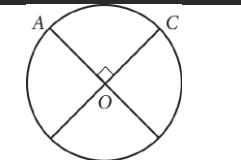
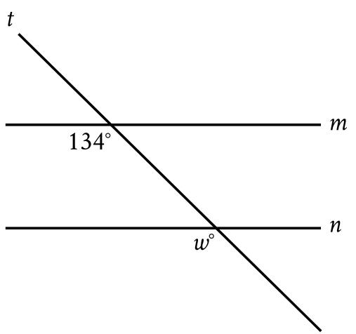

{0}------------------------------------------------

# Question ID c8d60e48

| Assessment | Test | Domain                       | Skill                           | Difficulty |
|------------|------|------------------------------|---------------------------------|------------|
| SAT        | Math | Geometry and Trigonometry | Lines, angles, and triangles |            |

1.1

ID: c8d60e48

In the given triangle, AB = AC and ∠ABC has a measure

of 67°. What is the value of x ?

A. 36

B. 46

C. 58

D. 70

#### ID: c8d60e48 Answer

Correct Answer: B

Rationale

Choice B is correct. Since AB = AC, the measures of their corresponding angles, LABC and LACB, are equal. Since ∠ABC has a measure of 67°, the measure of ∠ACB is also 67°. Since the sum of the measures of the interior angles in a triangle is 180°, it follows that 67+67+x = 180, or 134+x = 180. Subtracting by 134 on both sides of this equation yields x = 46.

Choices A, C, and D are incorrect and may result from calculation errors.

{1}------------------------------------------------

## Question ID a6dbad6b

| Assessment | Test | Domain                       | Skill                           | Difficulty |
|------------|------|------------------------------|---------------------------------|------------|
| SAT        | Math | Geometry and Trigonometry | Lines, angles, and triangles |            |

ID: a6dbad6b

Note: Figure not drawn to scale. In the figure above, lines ﻣﻊ and m are parallel, v = 20, and

z =60. What is the value of x ?

A. 120

B. 100

C. 90

D. 80

#### ID: a6dbad6b Answer

Correct Answer: B

Rationale

Choice B is correct. Let the measure of the third angle in the smaller triangle be q°. Since lines من and m are parallel and cut by transversals, it follows that the corresponding angles formed are congruent. So a ° = y ° = 20°. The sum of the interior angles of a triangle is 180°, which for the interior angles in the smaller triangle yields a+x+z = 180. Given that z =60 and a = 20, it follows that 20 + x + 60 = 180. Solving for x gives x = 180 = 60 - 20, or x = 100

Choice A is incorrect and may result from incorrectly assuming that angles x + z = 180. Choice C is incorrect and may result from incorrectly assuming that the smaller triangle, with x as the right angle. Choice D is incorrect and may result from a misunderstanding of the exterior angle theorem and incorrectly assuming that x = y + z

Question Difficulty: Easy

1.2

{2}------------------------------------------------

### Question ID cbe8ca31

| Assessment | Test | Domain                       | Skill                           | Difficulty |
|------------|------|------------------------------|---------------------------------|------------|
| SAT        | Math | Geometry and Trigonometry | Lines, angles, and triangles |            |
|            |      |                              |                                 |            |

1.3

ID: cbe8ca31

In △XYZ, the measure of ∠X is 24° and the measure of ∠Υ is 98°. What is the measure of ∠Z?

B. 74°

c. 122°

D. 212°

### ID: cbe8ca31 Answer

Correct Answer: A

Rationale

Choice A is correct. The triangle angle sum theorem states that the sum of the interior angles of a triangle is 180°. It's given that in △XYZ, the measure of ∠X is 24° and the measure of ∠Y is 98°. It follows that the measure of ∠Z is (180 — 24 — 98) °, or 58°.

Choice B is incorrect and may result from conceptual or calculation errors.

Choice C is incorrect. This is the sum of the measures of ∠X and ∠Y, not the measure of ∠乙.

Choice D is incorrect and may result from conceptual or calculation errors.

{3}------------------------------------------------

## Question ID c24e1bda

| Assessment | Test | Domain                       | Skill                           | Difficulty |
|------------|------|------------------------------|---------------------------------|------------|
| SAT        | Math | Geometry and Trigonometry | Lines, angles, and triangles |            |

1.4

### ID: c24e1bda

Note: Figure not drawn to scale. In the figure, line m is parallel to line n. What is the value of w?

A. 13

B. 34

C. 66

D. 134

### ID: c24e1bda Answer

Correct Answer: D

Rationale

Choice D is correct. It's given that lines m and n are parallel. Since line t intersects both lines m and m. it's a transversal. The angles in the figure marked as 134° and w° are on the same side of the transversal, where one is an interior angle with line m as a side, and the other is an exterior angle with line mas a side. Thus, the marked angles are corresponding angles. When two parallel lines are intersected by a transversal, corresponding angles are congruent and, therefore, have equal measure. It follows that w = 134 °. Therefore, the value of w is 134

Choice A is incorrect and may result from conceptual or calculation errors.

Choice B is incorrect and may result from conceptual or calculation errors.

Choice C is incorrect and may result from conceptual or calculation errors.

{4}------------------------------------------------

{5}------------------------------------------------

# Question ID 3563d76d

| Assessment | Test | Domain                       | Skill                           | Difficulty |
|------------|------|------------------------------|---------------------------------|------------|
| SAT        | Math | Geometry and Trigonometry | Lines, angles, and triangles |            |

### ID: 3563d76d

1.5

At a certain time and day, the Washington Monument in Washington, DC, casts a shadow that is 300 feet long. At the same time, a nearby cherry tree casts a shadow that is 16 feet long. Given that the Washington Monument is approximately 555 feet tall, which of the following is closest to the height, in feet, of the cherry tree?

A. 10

B. 20

C. 30

D. 35

### ID: 3563d76d Answer

Rationale

Choice C is correct. There is a proportional relationship between the height of an object and the length of its shadow. Let c represent the height, in feet, of the cherry tree. The given relationship can be expressed by the 555 C

16 . Multiplying both sides of this equation by 16 yields c = 29.6. This height is closest to proportion 300 the value given in choice C, 30.

Choices A, B, and D are incorrect and may result from calculation errors.

{6}------------------------------------------------

# Question ID dfc420b2

| Assessment                                                   | Test                                           | Domain                       | Skill                           | Difficulty                                                                                                                                                                     |     |
|--------------------------------------------------------------|------------------------------------------------|------------------------------|---------------------------------|--------------------------------------------------------------------------------------------------------------------------------------------------------------------------------|-----|
| SAT                                                          | Math                                           | Geometry and Trigonometry | Lines, angles, and triangles | ■□□□□□□□□□□□□□□□□□□□□□□□□□□□□□□□□□□□□□□□□□□□□□□□□□□□□□□□□□□□□□□□□□□□□□□□□□□□□□□□□□□□□□□□□□□□□□□□□□□□□□□□□□□□□□□□□□□□□□□□□□□□□□□□□□□□□□□□□□□□□□□□□□□□□□□□□□□□□□□□□□□□□□□□□□□□□□ |     |
| ID: dfc420b2 B 200 Note: Figure not drawn to scale. | D 1,0 40°                                |                              |                                 |                                                                                                                                                                                | 1.6 |
|                                                              | In the figure above, AD intersects BE at C. If |                              |                                 |                                                                                                                                                                                |     |
| x = 100, what is the value of y ?                            |                                                |                              |                                 |                                                                                                                                                                                |     |
| A. 100                                                       |                                                |                              |                                 |                                                                                                                                                                                |     |
| B. 90                                                        |                                                |                              |                                 |                                                                                                                                                                                |     |
| C. 80                                                        |                                                |                              |                                 |                                                                                                                                                                                |     |
| D. 60                                                        |                                                |                              |                                 |                                                                                                                                                                                |     |
| ID: dfo120b2 Ancwor                                          |                                                |                              |                                 |                                                                                                                                                                                |     |

Correct Answer: C

Rationale

Choice C is correct. It's given that x = 100; therefore, substituting 100 for x in triangle ABC gives two known

andle measures for this triangle. The sum of the measures of the interior angles of any triangle equals 180°. Subtracting the two known angle measures of triangle ABC from 180° gives the third angle measure: 180° - 100° - 20° = 60°. This is the measure of angle BCA. Since vertical angles are congruent, the measure

of angle DCE is also 60°. Subtracting the two known angle measures of triangle CDE from 180° gives the third angle measure: 180° -60° - 40° = 80°. Therefore, the value of y is 80.

Choice A is incorrect and may result from a calculation error. Choice B is incorrect and may result from classifying angle CDE as a right angle. Choice D is incorrect and may result from finding the measure of angle BCA or DCE instead of the measure of angle CDE.

{7}------------------------------------------------

### Question ID 410bdbe6

| Assessment                          | Test | Domain                       | Skill                           | Difficulty |  |  |
|-------------------------------------|------|------------------------------|---------------------------------|------------|--|--|
| SAT                                 | Math | Geometry and Trigonometry | Lines, angles, and triangles | ■□□□       |  |  |
| ID: 410bdbe6 1.7                 |      |                              |                                 |            |  |  |
| 31° 2b° a                     |      |                              |                                 |            |  |  |
| In the triangle above, α = 45. What |      |                              |                                 |            |  |  |
| is the value of b ?                 |      |                              |                                 |            |  |  |
| A. 52                               |      |                              |                                 |            |  |  |
| B. 59                               |      |                              |                                 |            |  |  |
| C. 76                               |      |                              |                                 |            |  |  |
| D. 104                              |      |                              |                                 |            |  |  |
|                                     |      |                              |                                 |            |  |  |

#### ID: 410bdbe6 Answer

Correct Answer: A

Rationale

Choice A is correct. The sum of the measures of the three interior angles of a triangle is 180°. Therefore, 31 + 2b + a = 180. Since it's given that a = 45, it follows that 31 +2b + 45 = 100, or 2b = 104. Dividing both sides of this equation by 2 yields b = 52

Choice B is incorrect and may result from a calculation error. Choice C is incorrect. This is the value of a + 31. Choice D is incorrect. This is the value of 2b.

{8}------------------------------------------------

# Question ID 087cdcfd

| Assessment | Test | Domain                       | Skill                           | Difficulty |
|------------|------|------------------------------|---------------------------------|------------|
| SAT        | Math | Geometry and Trigonometry | Lines, angles, and triangles |            |

ID: 087cdcfd

1.8

Note: Figure not drawn to scale

In the figure, three lines intersect at point P. If x = 65 and

y = 75, what is the value of z ?

A. 140

B. 80

- C. 40
D. 20

### ID: 087cdcfd Answer

Correct Answer: C

Rationale

Choice C is correct. The angle that is shown as lying between the y angle is a vertical angle with the x° angle. Since vertical angles are congruent and x = 65, the angle between the y° angle and the z°

angle measures 65°. Since the 65° angle, and the z° angle are adjacent and form a straight angle, it follows that the sum of the measures of these three angles is 180°, which is represented by the equation 65° + y° + z° = 180°. It's given that y = 75. Substituting 75 for y yields 65° +75° + z ° = 180°, which can be rewritten as 140° + z = 180°. Subtracting 140° from both sides of this equation yields z° = 40°. Therefore, z = 40.

Choice A is incorrect and may result from finding the value of x + y rather than z. Choices B and D are incorrect and may result from conceptual or computational errors.
{9}------------------------------------------------

## Question ID 992f4e93

| Assessment | Test | Domain                       | Skill                           | Difficulty |
|------------|------|------------------------------|---------------------------------|------------|
| SAT        | Math | Geometry and Trigonometry | Lines, angles, and triangles |            |

### ID: 992f4e93

Note: Figure not drawn to scale.

In the figure above, lines جج and k are parallel.

What is the value of a ?

A. 26

B. 64

C. 116

D. 154

#### ID: 992f4e93 Answer

Correct Answer: C

Rationale

Choice C is correct. Since lines ج and k are parallel, corresponding angles formed by the intersection of line j with lines م and k are congruent. Therefore, the angle with measure a ° must be the supplement of the angle with measure 64°. The sum of two supplementary angles is 180°, so a = 180 – 64 = 116.

Choice A is incorrect and likely results from thinking the angle with measure a ' is the complement of the angle with measure 64°. Choice B is incorrect and likely results from thinking the angle with measure a ' is congruent to the angle with measure 64°. Choice D is incorrect and likely results from a conceptual or computational error.

Question Difficulty: Easy

1.9

{10}------------------------------------------------

## Question ID 5733ce30

- A. 110
- B. 70
- C. 55
- D. 40

#### ID: 5733ce30 Answer

Correct Answer: D

Rationale

Choice D is correct. Since ∠BCA form a linear pair of angles, their measures sum to 180°. It's given that the measure of ∠BCD is 110°. Therefore, 110° + ∠BCA = 180°. Subtracting 110° from both sides of this equation gives the measure of _BCA as 70°. It's also given that the measure of _BAC is equal to the measure of ∠BCA. Thus, the measure of ∠BAC is also 70°. The measures of the interior angles of a triangle sum to 180°. Thus, 70° + 70° + x = 180°. Combining like terms on the left-hand side of this equation yields 140° + x ° = 180°. Subtracting 140° from both sides of this equation yields x ° = 40°, or x = 40.

Choice A is incorrect. This is the value of the measure of ∠BCD. Choice B is incorrect. This is the value of the measure of each of the other two interior angles, ∠BCA and ∠BAC. Choice Cis incorrect and may result from an error made when identifying the relationship between the exterior angle of a triangle and the interior angles of the triangle.

{11}------------------------------------------------

## Question ID 3828f53d

| Assessment        | Test | Domain                       | Skill                           | Difficulty |
|-------------------|------|------------------------------|---------------------------------|------------|
| SAT               | Math | Geometry and Trigonometry | Lines, angles, and triangles |            |
| ID: 3828f53d K |      |                              |                                 |            |

Note: Figure not drawn to scale.

In the figure above, lines m and n are parallel. What is the value of b ?

| A. 40 |  |
|-------|--|
| B. 50 |  |

C. 65

D. 80

#### ID: 3828f53d Answer

Correct Answer: A

Rationale

Choice A is correct. Given that lines m and n are parallel, the angle marked 130° must be supplementary to the leftmost angle marked a ' because they are same-side interior angles. Therefore, 130° + a = 180°, which yields a = 50°. Lines ¿ and m intersect at a right angle, so lines j, ¿, and m form a right triangle where the two acute

angles are a° and b°. The acute angles of a right triangle are complementary, so a° + b° = 90°, which yields 50° + b° = 90°, and b = 40.

Choice B is incorrect. This is the value of a, not b. Choice C is incorrect and may be the result of dividing 130° by 2. Choice D is incorrect and may be the result of multiplying b by 2.

{12}------------------------------------------------

## Question ID 42b4493b

| Assessment | Test | Domain                       | Skill                           | Difficulty |
|------------|------|------------------------------|---------------------------------|------------|
| SAT        | Math | Geometry and Trigonometry | Lines, angles, and triangles |            |

### ID: 42b4493b

1.12

In a right triangle, the measure of one of the acute angles is 51°. What is the measure, in degrees, of the other acute angle?

| 4 • | 0 |
|--------|---|
|        |   |

- B. 39
- C. 49
- D. 51

### ID: 42b4493b Answer

Correct Answer: B

Rationale

Choice B is correct. The sum of the interior angles of a triangle is 180 degrees. Since the triangle is a right triangle, it has one angle that measures 90 degrees. Therefore, the sum of the measures, in degrees, of the remaining two angles is 180 - 90, or 90. It's given that the measure of one of the acute angles in the triangle is 51 degrees. Therefore, the measure, in degrees, of the other acute angle is 90 — 51, or 39.

Choice A is incorrect and may result from conceptual or calculation errors.

Choice C is incorrect and may result from conceptual or calculation errors.

Choice D is incorrect. This is the measure, in degrees, of the acute angle whose measure is given.

{13}------------------------------------------------

## Question ID 36200a38

| Assessment | l'est | Domain                       | Skill                           | Difficulty |
|------------|-------|------------------------------|---------------------------------|------------|
| SAT        | Math  | Geometry and Trigonometry | Lines, angles, and triangles |            |

### ID: 36200a38

1.13

In the figure above, two sides of a triangle are extended. What is the value of x ?

A. 110

B. 120

C. 130

D. 140

## ID: 36200a38 Answer

Correct Answer: B

Rationale

Choice B is correct. The sum of the interior angles of a triangle is 180°. The measures of the two interior angles of the given triangle are shown. Therefore, the measure of the third interior angle is 180° – 70° – 60°. The angles of measures x° and 60° are supplementary, so their sum is 180°. Therefore, x = 180 – 60 = 120.

Choice A is incorrect and may be the result of misinterpreting x° as supplementary to 70°. Choice C is incorrect and may be the result of misinterpreting x° as supplementary to 50°. Choice D is incorrect and may be the result of a calculation error.

{14}------------------------------------------------

# Question ID 43236565

Note: Figure not drawn to scale.

In the figure, line m is parallel to line & intersects both lines. Which of the following statements is true?

- A. The value of x is less than 145.
- B. The value of x is greater than 145.
- C. The value of x is equal to 145.
- D. The value of x cannot be determined.

#### ID: 43236565 Answer

Correct Answer: C

{15}------------------------------------------------

#### Rationale

Choice C is correct. Vertical angles, or angles that are opposite each other when two lines intersect, are congruent. It's given that line k intersects line n. Based on the figure, the angle with measure x° and the angle with measure 145° are vertical angles. Therefore, the value of x is equal to 145.

Choice A is incorrect and may result from conceptual or calculation errors.

Choice B is incorrect and may result from conceptual or calculation errors.

Choice D is incorrect and may result from conceptual or calculation errors.

{16}------------------------------------------------

# Question ID 69f4bbdc

Note: Figure not drawn to scale.

In the right triangle shown, what is the value of a?

A. 13

B. 77

C. 90

D. 103

## ID: 69f4bbdc Answer

#### Correct Answer: B

#### Rationale

Choice B is correct. The triangle shown is a right triangle, where the interior angle shown with a right angle symbol has a measure of 90°. It's shown that the other two interior angles measure 13° and a°. The sum of the interior angles of a triangle is 180°; therefore, 90 + 13 + a = 180. Combining like terms on the left-hand side of this equation yields 103 + a = 180. Subtracting 103 from both sides of this equation yields a = 77.

Choice A is incorrect. This is the measure, in the other acute interior angle of the right triangle, not the value of a.

Choice C is incorrect. This is the measure, in degrees, of the right triangle, not the value of a.

Choice D is incorrect. This is the sum of the measures, in degrees, of the right triangle, not the value of a.

{17}------------------------------------------------