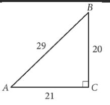
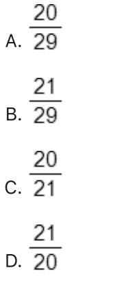
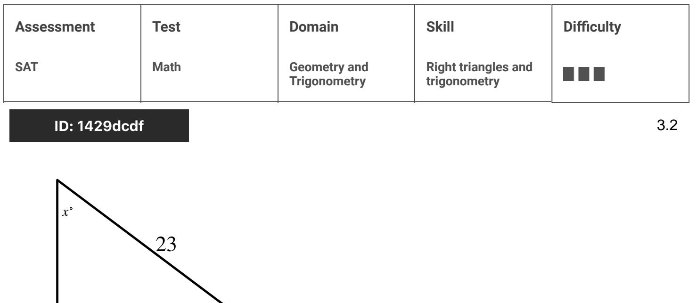
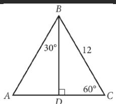
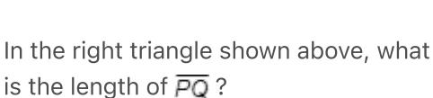

{0}------------------------------------------------

# Question ID 902dc959

| Assessment | Test | Domain                       | Skill                               | Difficulty |
|------------|------|------------------------------|-------------------------------------|------------|
| SAT        | Math | Geometry and Trigonometry | Right triangles and trigonometry |            |

2.1

ID: 902dc959

In the figure above, what is the value of tan(A)?

### ID: 902dc959 Answer

Correct Answer: C

Rationale

Choice C is correct. Angle A is an acute angle in a right triangle, so the value of tan(A) is equivalent to the ratio of the length of the side opposite angle A, 20, to the length of the nonhypotenuse side adjacent to angle A, 21.

20 tan(A) = 21 . Therefore,

Choice A is incorrect. This is the value of sin(A). Choice B is incorrect. This is the value of cos(A). Choice D is incorrect. This is the value of tan(B).

{1}------------------------------------------------

# Question ID de550be0

For the triangle shown, which expression represents the value of a?

A. V212 - 62 B. 212 - 62 c. √21 - 6 D. 21 - 6

#### ID: de550be0 Answer

Correct Answer: A

#### Rationale

Choice A is correct. For the right triangle shown, the lengths of the legs are a units and the length of the hypotenuse is 21 units. The Pythagorean theorem states that in a right triangle, the squares of the lengths of the two legs is equal to the square of the length of the hypotenuse. Therefore, a2 + 6° = 21° Subtracting 62 from both sides of this equation yields a2 = 212 = 62. Taking the square root of both sides of this equation yields a = ±√ 212 - 62. Since a is a length, a must be positive. Therefore, a = √ 21 - 62 Thus, for the triangle shown, V 212 - 62 represents the value of a

Choice B is incorrect. For the triangle shown, this expression represents the value of a , not a.

Choice C is incorrect and may result from conceptual errors.

Choice D is incorrect and may result from conceptual errors.

{2}------------------------------------------------

{3}------------------------------------------------

### Question ID 9ec76b54

| Assessment | Test | Domain                       | Skill                               | Difficulty |
|------------|------|------------------------------|-------------------------------------|------------|
| SAT        | Math | Geometry and Trigonometry | Right triangles and trigonometry |            |
|            |      |                              |                                     |            |

### ID: 9ec76b54

2.3

A right triangle has legs with lengths of 28 centimeters and 20 centimeters. What is the length of this triangle 's hypotenuse, in centimeters?

A. 8v6

B. 4 / 74

C. 48

D. 1,184

### ID: 9ec76b54 Answer

Correct Answer: B

Rationale

Choice B is correct. The Pythagorean theorem states that in a right triangle, the sum of the squares of the lengths of the two legs is equal to the square of the lypotenuse. It's given that the right triangle has legs with lengths of 28 centimeters and 20 centimeters. Let c represent the length of this triangle's hypotenuse, in centimeters. Therefore, by the Pythagorean theorem, 28° + 20° = c2, or 1,184 = c2, Taking the positive square root of both sides of this equation yields ↓ 1,184 = c or 4√74 = c Therefore, the length of this triangle's hypotenuse, in centimeters, is 4x/74.

Choice A is incorrect and may result from conceptual or calculation errors.

Choice C is incorrect and may result from conceptual or calculation errors.

Choice D is incorrect. This is the square of the length of the triangle's hypotenuse.

{4}------------------------------------------------

# Question ID bf8d843e

| Assessment   | Test | Domain                       | Skill                               | Difficulty |
|--------------|------|------------------------------|-------------------------------------|------------|
| SAT          | Math | Geometry and Trigonometry | Right triangles and trigonometry |            |
| ID: bf8d843e |      |                              |                                     |            |

In ΔABC above, what is the length of AD?

A. 4

B. 6

c. 6. 2

D. 6. 3

### ID: bf8d843e Answer

Correct Answer: B

Rationale

Choice B is correct. Triangles ADB and CDB are both 30° – 60° – 90° triangles and share BD . Therefore, triangles ADB and CDB are congruent by the angle-side-angle postulate. Using the properties of 30° - 60° - 90° triangles, the length of AD is half the length of hypotenuse AB . Since the triangles are 12 congruent, AB = BC = 12. So the length of AD is 2

Alternate approach: Since angle CBD has a measure of 30°, angle ABC must have a measure of 60°. It follows that triangle ABC is equilateral, so side AC also has length 12. It also follows that the altitude BD is also a median, and therefore the length of AD is half of the length of AC, which is 6.

Choice A is incorrect. If the length of AD were 4, then the length of AB would be 8. However, this is incorrect because AB is congruent to BC, which has a length of 12. Choices C and D are also incorrect. Following the same procedures as used to test choice A gives AB a length of 12v 2 for choice C and 12v 3 for choice D. However, these results cannot be true because AB is congruent to BC, which has a length of 12.

{5}------------------------------------------------

### Question ID a5aee181

ID: a5aee181

| Assessment | Test | Domain                       | Skill                               | Difficulty |
|------------|------|------------------------------|-------------------------------------|------------|
| SAT        | Math | Geometry and Trigonometry | Right triangles and trigonometry |            |
|            |      |                              |                                     |            |

The length of a rectangle's diagonal is 5v 17, and the length of the rectangle's shorter side is 5. What is the length of the rectangle's longer side?

A. V17

B. 20

c. 15v2

D. 400

### ID: a5aee181 Answer

Correct Answer: B

Rationale

Choice B is correct. A rectangle's diagonal divides a rectangle into two congruent right triangles, where the diagonal is the hypotenuse of both triangles. It's given that the length of the diagonal is 5v 17 and the length of the rectangle's shorter side is 5. Therefore, each of the two right triangles formed by the rectangle's diagonal has a hypotenuse with length 5v 17, and a shorter leg with length 5. To calculate the length of the longer leg of each right triangle, the Pythagorean theorem, a2 + b2 = c, can be used, where a and b are the lengths of the legs and ¢ is the length of the hypotenuse of the triangle. Substituting 5 for a and 5v 17 for c in the equation (5v17) , which is equivalent to 25 + b2 = 25(17), or 25 + b2 = 425, a2 + b2 = c2 yields 52 + b2 = Subtracting 25 from each side of this equation yields 6° = 400. Taking the positive square root of each side of this equation yields b = 20. Therefore, the length of the longer leg of each right triangle formed by the diagonal of the rectangle is 20. It follows that the length of the rectangle's longer side is 20.

Choice A is incorrect and may result from dividing the length of the rectangle's diagonal by the length of the rectangle's shorter side, rather than substituting these values into the Pythagorean theorem.

Choice C is incorrect and may result from using the length of the rectangle's diagonal as the length of a leg of the right triangle, rather than the length of the hypotenuse.

Choice D is incorrect. This is the square of the rectangle's longer side.

Question Difficulty: Medium

2.5

{6}------------------------------------------------

# Question ID 13d9a1c3

| Assessment   | Test | Domain                       | Skill                               | Difficulty |
|--------------|------|------------------------------|-------------------------------------|------------|
| SAT          | Math | Geometry and Trigonometry | Right triangles and trigonometry |            |
| ID: 12d9a1c3 |      |                              |                                     |            |

### ID: 13d9a1c3 Answer

Rationale

The correct answer is 4. Triangle PQR has given angle measures of 30° and 90°, so the third angle must be 60° because the measures of the angles of a triangle sum to 180°. For any special right triangle with angles measuring 30°, 60°, and 90°, the length of the hypotenuse (the right angle) is 2x, where x is the length of the side opposite the 30° angle. Segment PQ is opposite the 30° angle. Therefore, 2(PQ) = 8 and PQ = 4.