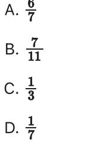

{0}------------------------------------------------

# Question ID b1b5300b

| Assessment | Test | Domain                               | Skill                                         | Difficulty |
|------------|------|--------------------------------------|-----------------------------------------------|------------|
| SAT        | Math | Problem-Solving and Data Analysis | Probability and conditional probability |            |

## ID: b1b5300b

Prices of 14 Different Cars

| Type of car | Priced at no more   Priced greater than \$25,000 | than \$25,000 | Total |
|-------------|-----------------------------------------------------|---------------|-------|
| Nonhybrid   | 5                                                   | ന             | 8     |
| Hybrid      | 2                                                   | ব             | ട     |
| Total       |                                                     |               | 14    |

The table above shows information about 14 cars listed for sale on an auto dealership's website. If one of the cars listed for sale is selected at random, what is the probability that the car selected will be a hybrid car priced at no more than \$25,000 ?

l A. 7 2 B. 7 l c. 3 4 D. 7

### ID: b1b5300b Answer

Correct Answer: A

Rationale

Choice A is correct. It's given that there are 2 hybrid cars priced at no more than \$25,000. It's also given that there are 14 cars total for sale. Therefore, the probability of selecting a hybrid priced at no more than \$25,000 when one car is chosen at random is 14 7 .

Choice B is incorrect. This is the probability of selecting a hybrid car priced greater than \$25,000 when choosing one car at random. Choice C is incorrect. This is the probability, when choosing randomly from only the hybrid cars, of selecting one priced at no more than \$25,000. Choice D is incorrect. This is the probability of selecting a hybrid car when selecting at random from only the cars priced greater than \$25,000.

2.1

{1}------------------------------------------------

{2}------------------------------------------------

# Question ID e1ad3d41

| Assessment | Test | Domain                               | Skill                                         | Difficulty |
|------------|------|--------------------------------------|-----------------------------------------------|------------|
| SAT        | Math | Problem-Solving and Data Analysis | Probability and conditional probability |            |

2.2

ID: e1ad3d41

| Coat color          | Eye color |                                 |    |  |
|---------------------|-----------|---------------------------------|----|--|
|                     |           | Deep blue   Light brown   Total |    |  |
| Cream-tortoiseshell | 16        | 16                              | 32 |  |
| Chocolate           | 12        | ব                               | 16 |  |
| Total               | 28        | 20                              | 48 |  |

The data on the coat color and eye color for 48 Himalayan kittens available for adoption were collected and summarized in the table above. What fraction of the chocolate-colored kittens has deep blue eyes?

| 12 A. 48      |
|------------------|
| 12 - B. 28 |
| 16 с. 32      |
| 12 - D. 16 |

#### ID: e1ad3d41 Answer

Correct Answer: D

Rationale

Choice D is correct. The table shows that there are a total of 16 kittens that have a chocolate-colored coat. Of the 16 with a chocolate-colored coat, 12 have deep blue eyes. The fraction of chocolate-colored

12

kittens with deep blue eyes is simply the ratio of those two numbers, or 16 .

Choice A is incorrect; this is the fraction of all chocolate-colored kittens. Choice B is incorrect; this is the fraction of kittens with deep blue eyes that have a chocolate-colored coat. Choice C is incorrect; this is the fraction of cream-tortoiseshell-colored kittens with deep blue eyes.

{3}------------------------------------------------

# Question ID 0301c5dc

| Assessment | Test | Domain                               | Skill                                         | Difficulty |
|------------|------|--------------------------------------|-----------------------------------------------|------------|
| SAT        | Math | Problem-Solving and Data Analysis | Probability and conditional probability |            |

### ID: 0301c5dc

2.3

The table below shows the number of state parks in a certain state that contain camping facilities and bicycle paths.

|                                  |     | Has bicycle paths   Does not have bicycle paths |
|----------------------------------|-----|-------------------------------------------------|
| Has camping facilities           | 20  | ﻜ                                               |
| Does not have camping facilities | ರ್ಧ |                                                 |

If one of these state parks is selected at random, what is the probability that it has camping facilities but does not have bicycle paths?

#### ID: 0301c5dc Answer

Correct Answer: A

Rationale

Choice A is correct. The total number of state parks in the state is 20+5+8+4 = 37. According to the table, 5 of these have camping facilities but not bicycle paths. Therefore, if a state park is selected at random, the 5 probability that it has camping facilities but not bicycle paths is 37

Choice B is incorrect. This is the probability that a state park selected at random from the state parks with camping facilities does not have bicycle paths. Choice C is incorrect. This is the probability that a state park selected at random from the state parks with bicycle paths does not have camping facilities. Choice D is incorrect. This is the probability that a state park selected at random from the state parks without bicycle paths does have camping facilities.

{4}------------------------------------------------

{5}------------------------------------------------

# Question ID 0ae37ff3

| Assessment | Test | Domain                               | Skill                                         | Difficulty |
|------------|------|--------------------------------------|-----------------------------------------------|------------|
| SAT        | Math | Problem-Solving and Data Analysis | Probability and conditional probability |            |

ID: 0ae37ff3

2.4

In a bag, there are 7 red, 4 white, 33 blue, and 33 yellow cubes. If one of these cubes is selected at random, what is the probability of selecting a cube that is neither blue nor yellow?

ID: 0ae37ff3 Answer

Correct Answer: D

#### Rationale

Choice D is correct. It's given that there are 7 red, 4 white, 33 blue, and 33 yellow cubes in the bag. Therefore, there are a total of 7 + 4 + 33 + 33, or 77, cubes in the bag. If the cube is neither blue nor yellow, then it must be either red or white. Therefore, the probability of selecting a cube that is neither blue nor yellow is equivalent to the probability of selecting a cube that is either red or white. If one of these cubes is selected at random, the probability of selecting a cube that is either red or white is equal to the number of red cubes and white cubes divided by the total number of cubes in the bag. There are 7 red cubes, 4 white cubes, and 77 total cubes in the bag. Therefore, the probability of selecting a red or white cube is 12, which is equivalent to ¾, or ÷. Thus, if one cube is selected at random, the probability of selecting a cube that is neither blue nor yellow is =

Choice A is incorrect. This is the probability of selecting a cube that is either blue or yellow, rather than the probability of selecting a cube that is neither blue nor yellow.

Choice B is incorrect and may result from conceptual or calculation errors.

Choice C is incorrect and may result from conceptual or calculation errors.

{6}------------------------------------------------

# Question ID 2df8f293

| Assessment | Test | Domain                               | Skill                                         | Difficulty |
|------------|------|--------------------------------------|-----------------------------------------------|------------|
| SAT        | Math | Problem-Solving and Data Analysis | Probability and conditional probability |            |

### ID: 2df8f293

2.5

Each vertex of a 14-sided polygon is labeled with one of the 14 letters A through N, with a different letter at each vertex. If one vertex is selected at random, what is the probability that the letter D will be at the selected vertex? (Express your answer as a decimal or fraction, not as a percent.)

### ID: 2df8f293 Answer

Correct Answer: .0714, 1/14

Rationale

The correct answer is - If one vertex of the polygon is selected at random, the probability that the letter D will be at the selected vertex is equal to the number of vertices labeled with the letter D divided by the total number of vertices. It's given that each vertex is labeled with one of the 14 letters A through W, with a different letter at each vertex. It follows that there is 1 vertex labeled with the letter D. It's also given that the polygon is 14-sided. It follows that there are a total of 14 vertices. Thus, the probability that the letter D will be at the selected vertex is - - Note that 1/14, .0714, and 0.071 are examples of ways to enter a correct answer.

{7}------------------------------------------------

# Question ID 912cd125

| Assessment | Test | Domain                               | Skill                                         | Difficulty |
|------------|------|--------------------------------------|-----------------------------------------------|------------|
| SAT        | Math | Problem-Solving and Data Analysis | Probability and conditional probability |            |

### ID: 912cd125

2.6

For a science project, Anka recorded whether it rained each weekend day for 12 weeks. Her results are summarized in the table below.

|                        |    | Rain   No rain | Total |
|------------------------|----|----------------|-------|
| Number of weekdays     | 12 | 48             | 60    |
| Number of weekend days | 8  | 16             | 24    |
| Total                  | 20 | 64             | 84    |

Weekday and Weekend Day Rain for 12 Weeks

If one of the days on which there was no rain is selected at random, what is the probability the day was a weekend day?

4 A. 21 l B. 4 2 c. 3 3 D. 4

#### ID: 912cd125 Answer

Correct Answer: B

Rationale

Choice B is correct. There were 64 days with no rain. It was a weekend day for 16 of those 64 days. So 16 out of 64 of the days with no rain were weekend days. Because the day is selected at random, each day has an equal 16 1

chance of being selected, so the probability is 64 4 .

Choice A is incorrect. It is the probability that a day selected at random from any one of the 12 weeks is a weekend day with no rain. Choice C is incorrect. It is the probability that a day selected at random from the weekend days has no rain. Choice D is incorrect. It is the probability that a day selected at random from the days with no rain is a weekday.

{8}------------------------------------------------

# Question ID 30db8f77

| Assessment | Test | Domain                               | Skill                                         | Difficulty |
|------------|------|--------------------------------------|-----------------------------------------------|------------|
| SAT        | Math | Problem-Solving and Data Analysis | Probability and conditional probability |            |

#### ID: 30db8f77

2.7

At a conference, there are a total of 275 attendee is assigned to either group A, group B, or group C. If one of these attendees is selected at random, the probability of selecting an attendee who is assigned to group A is 0.44 and the probability of selecting an attendee who is assigned to group B is 0.24. How many attendees are assigned to group C?

#### ID: 30db8f77 Answer

Correct Answer: 88

#### Rationale

The correct answer is 88. It's given that there are a total of 275 attendees and each attendee is assigned to either group A, group B, or group C. It's also given that if one of these attendees is selected at random, the probability of selecting an attendee who is assigned to group A is 0.44 and the probability of selecting an attendee who is assigned to group B is 0.24. It follows that there are 0.44(275), or 121, attendees who are assigned to group A and 0.24(275), or 66, attendees who are assigned to group B. The number of attendees who are assioned to group C is the number of attendees who are not assigned to group A or group B. In other words, the number of attendees who are assigned to group C is the total number of attendees minus the number of attendees who are assigned to group B. Therefore, the number of attendees who are assigned to group C is 275 - 121 - 66, or 88.
{9}------------------------------------------------

# Question ID 38a9ac45

| Assessment | Test | Domain                               | Skill                                         | Difficulty |
|------------|------|--------------------------------------|-----------------------------------------------|------------|
| SAT        | Math | Problem-Solving and Data Analysis | Probability and conditional probability |            |

## ID: 38a9ac45

2.8

If 1,200 customers register for new accounts at a social media website every day, what fraction of the first 60,000 new accounts are registered in the first 5 days?

| A. 1 |       |  |
|------|-------|--|
|      | в. 1  |  |
|      | c. 12 |  |
|      | D. 1  |  |

## ID: 38a9ac45 Answer

Correct Answer: B

Rationale

Choice B is correct. If 1,200 customers register for new accounts every day, then (1,200)(5) = 6,000 customers registered for new accounts in the first 5 days. Therefore, of the first 60,000 new accounts that were registered, 6,000 1

60,000 , or 10 , were registered in the first 5 days.

1 Choice A is incorrect. The fraction 5 represents the fraction of accounts registered in 1 of the first 5 days. Choice C is incorrect and may result from conceptual or computation errors. Choice D is incorrect. The 1 fraction 50 represents the fraction of the first 60,000 accounts that were registered in 1 day.

{10}------------------------------------------------

# Question ID b6569d0e

| Assessment | Test | Domain                               | Skill                                         | Difficulty |
|------------|------|--------------------------------------|-----------------------------------------------|------------|
| SAT        | Math | Problem-Solving and Data Analysis | Probability and conditional probability |            |

## ID: b6569d0e

United States Presidents from 1789 to 2015

| EVIV  |        |  |  |  |
|-------|--------|--|--|--|
| Ages  | Number |  |  |  |
| 40-44 | 2      |  |  |  |
| 45-49 | 7      |  |  |  |
| 50-54 | 13     |  |  |  |
| 25-59 | 11     |  |  |  |
| 60-64 | 7      |  |  |  |
| 65-69 | 3      |  |  |  |

The table above gives the number of United States presidents from 1789 to 2015 whose age at the time they first took office is within the interval listed. Of those presidents who were at least 50 years old when they first took office, what fraction were at least 60 years old?

| 10 A. 43      |
|------------------|
| 10 B. 34      |
| 10 - C. 24 |
| 25 D. 34      |

## ID: b6569d0e Answer

Correct Answer: B

#### Rationale

Choice B is correct. The sample space is restricted to the presidents who were at least 50 years old when they first took office. Therefore, the sum of the values in the final four rows of the table, 13 + 1 + 7 + 3 = 34, is the

2.9

{11}------------------------------------------------

total number of presidents in the sample space. The number of presidents who were at least 60 years old is the sum of the values in the final two rows of the table: 7 + 3 = 10. Thus, the fraction of the 34 presidents who were

10

at least 50 years old when they first took office who were at least 60 years old is 34

Choice A is incorrect. This is the fraction of all presidents in the table who were at least 60 years old when they first took office. Choice C is incorrect and may result from treating the number of presidents who were between 50 and 59 years old when they first took office, instead of the number of presidents who were at least 50 years old, as the sample space. Choice D is incorrect and may result from a calculation error.

{12}------------------------------------------------

## Question ID a3384df0

| Assessment | Test | Domain                               | Skill                                         | Difficulty |
|------------|------|--------------------------------------|-----------------------------------------------|------------|
| SAT        | Math | Problem-Solving and Data Analysis | Probability and conditional probability |            |

#### ID: a3384df0

| Penguin Exhibit |     |               |       |  |
|-----------------|-----|---------------|-------|--|
| Type of penguin |     | Male   Female | Total |  |
| Chinstrap       | 41  | 59            | 100   |  |
| Emperor         | 8   | 27            | 35    |  |
| Gentoo          | 49  | 54            | 103   |  |
| Macaroni        | 42  | 40            | 82    |  |
| Total           | 140 | 180           | 320   |  |

The number of penguins in a zoo exhibit, sorted by gender and type of penguin, is shown in the table above. Which type of penguin has a female

T

population that is the closest to being 3 of the total female penguin

population in the exhibit?

A. Chinstrap

B. Emperor

- C. Gentoo
- D. Macaroni

#### ID: a3384df0 Answer

Correct Answer: A

Rationale

Choice A is correct. It is given that there are 180 female penguins in the exhibit. Therefore, 3 of the female penguins. According to the table, there are 59 female chinstrap penguins, 27 female penguins is 3 emperor penguins, 54 female gentoo penguins, and 40 female macaroni penguins. So the female chinstrap l penguin population is the closest to 60, or 3 of the total female population in the exhibit.

l

2.10

{13}------------------------------------------------

Choices B, C, and D are incorrect and may result from reading data from the table incorrectly. Since the total l female penguin population is 180, 3 of the total female penguin population is 60. The numbers of female emperor (27), female gentoo (54), and female macaroni (40) penguins are not as close to 60 as the number of female chinstrap penguins (59).

{14}------------------------------------------------

# Question ID 46b2e169

| Assessment | Test | Domain                               | Skill                                         | Difficulty |
|------------|------|--------------------------------------|-----------------------------------------------|------------|
| SAT        | Math | Problem-Solving and Data Analysis | Probability and conditional probability |            |

## ID: 46b2e169

2.11

A box contains 13 red pens and 37 blue pens. If one of these pens is selected at random, what is the probability of selecting a red pen? (Express your answer as a decimal or fraction, not as a percent.)

## ID: 46b2e169 Answer

Correct Answer: .26, 13/50

Rationale

The correct answer is the given that a box contains 13 red pens and 37 blue pens. If one of these pens is selected at random, the probability of selecting a red pen is the number of red pens in the box divided by the number of red and blue pens in the box. The number of red and blue pens in the box is 13 + 37, or 50. Since there are 13 red pens in the box, it follows that the probability of selecting a red pen is 13/50 and .26 are examples of ways to enter a correct answer.

{15}------------------------------------------------

# Question ID f8696cd8

| Assessment | Test | Domain                               | Skill                                         | Difficulty |
|------------|------|--------------------------------------|-----------------------------------------------|------------|
| SAT        | Math | Problem-Solving and Data Analysis | Probability and conditional probability |            |

ID: f8696cd8

|                     | Human Resources   Accounting |   |
|---------------------|------------------------------|---|
| Bachelor's degree l | ব                            | ನ |
| Master's degree     |                              | ട |

The table above shows the number of people who work in the Human Resources and Accounting departments of a company and the highest level of education they have completed. A person from one of these departments is to be chosen at random. If the person chosen works in the Human Resources department, what is the probability that the highest level of education the person completed is a master's degree?

2 A. 15 l B. 3 l C. 4 8 D. 15

## ID: f8696cd8 Answer

Correct Answer: B

Rationale

Choice B is correct. In total, there are 6 people in the Human Resources department. Of those 6, 2 have a master's degree as their highest level of education. Therefore, the probability of an employee selected at T 2 random from the Human Resources department having a master's degree is 6 , which simplifies to 3 .

Choice A is incorrect; it is the probability that an employee selected at random from either department will be in the Human Resources department and have a master's degree. Choice C is incorrect; it is the probability that an employee with a master's degree selected at random will be in the Human Resources department. Choice D is incorrect; it is the probability that an employee selected at random from either department will have a master's degree.

2.12

{16}------------------------------------------------