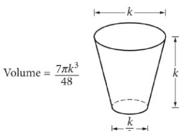

{0}------------------------------------------------

# Question ID d28c29e1

| Assessment | Test | Domain                               | Skill                                                         | Difficulty |
|------------|------|--------------------------------------|---------------------------------------------------------------|------------|
| SAT        | Math | Problem-Solving<br>and Data Analysis | Ratios, rates,<br>proportional<br>relationships, and<br>units |            |

### ID: d28c29e1

2.1

The International Space Station orbits Earth at an average speed of 4.76 miles per second. What is the space station's average speed in miles per hour?

A. 285.6

B. 571.2

C. 856.8

D. 17,136.0

### ID: d28c29e1 Answer

Correct Answer: D

Rationale

Choice D is correct. Since 1 minute = 60 seconds and 1 hour = 60 minutes, it follows that 1 hour = (60)(60), or 3,600 seconds. Using this conversion factor, the space station's average speed of 4.76 miles per second is equal 17, 136 miles 4.76 miles 3,600 seconds _ to an average speed of , or 17,136 miles per hour. second hour hour

Choice A is incorrect. This is the space station's average speed in miles per minute. Choice B is incorrect. This is double the space station's average speed in miles per minute, or the number of miles the space station travels on average in 2 minutes. Choice C is incorrect. This is triple the space station's average speed in miles per minute, or the number of miles the space station travels on average in 3 minutes.

{1}------------------------------------------------

# Question ID b4912cc5

| Assessment | Test | Domain                               | Skill                                                         | Difficulty |
|------------|------|--------------------------------------|---------------------------------------------------------------|------------|
| SAT        | Math | Problem-Solving<br>and Data Analysis | Ratios, rates,<br>proportional<br>relationships, and<br>units |            |

### ID: b4912cc5

2.2

The population density of Iceland, in people per square kilometer of land area, increased from 2.5 in 1990 to 3.3 in 2014. During this time period, the land area of Iceland was 100,250 square kilometers. By how many people did Iceland's population increase from 1990 to 2014?

A. 330,825

B. 132,330

- C. 125,312
- D. 80,200

### ID: b4912cc5 Answer

Correct Answer: D

Rationale

Choice D is correct. The increase in Iceland's population can be found by multiplying the increase in population density, in people per square kilometer, by the area, in square kilometers. It's qiven that the population density of Iceland was 2.5 people per square kilometer in 1990 and 3.3 people per square kilometer in 2014. The increase in population density can be found by subtracting 2.5 from 3.3, which yields 0.8. It's qiven that the land area of Iceland was 100,250 square kilometers. Thus, the increase in population is 0.8(100,250), or 80,200.

Alternate approach: It's given that the population density of Iceland, in people per square kilometer of land area, in 1990 was 2.5. Since the land area of Iceland was 100,250 square kilometers, it follows that the population of Iceland in 1990 was 2.5(100,250), or 250,625. Similarly, the population of Iceland in 2014 was 3.3(100,250), or 330,825. The population increase is the difference in the population from 1990 to 2014, or 330,825 – 250,625, which yields 80,200. Therefore, Iceland's population increased by 80,200 from 1990 to 2014.

Choice A is incorrect. This is the population of Iceland in 2014. Choice B is incorrect and may result from dividing 3.3 by 2.5, instead of subtracting 2.5 from 3.3. Choice C is incorrect and may result from dividing the population of Iceland in 1990 by 2.

{2}------------------------------------------------

## Question ID 8e528129

| Assessment | Test | Domain                               | Skill                                                         | Difficulty |
|------------|------|--------------------------------------|---------------------------------------------------------------|------------|
| SAT        | Math | Problem-Solving<br>and Data Analysis | Ratios, rates,<br>proportional<br>relationships, and<br>units |            |

### ID: 8e528129

2.3

Pure beeswax has a density of 0.555 ounce per cubic inch. An online company sells pure beeswax at a price of \$8.00 per ounce. What is the selling price, in dollars per cubic inch, for pure beeswax purchased from this company?

### ID: 8e528129 Answer

Rationale

```
The correct answer is 4.44. The selling price, in dollars per cubic inch, is found by multiplying the density, in
                                                               0.555 ounce
                                                                                  $8.00
ounces per cubic inch, by the unit price, in dollars per ounce: 1 cubic inch
                                                                                1 ounce / vields
```
### \$4.44

1 cubic inch . Thus, the selling price, in dollars per cubic inch, is 4.44.

{3}------------------------------------------------

# Question ID fea831fc

| Assessment | Test | Domain                               | Skill                                                         | Difficulty |
|------------|------|--------------------------------------|---------------------------------------------------------------|------------|
| SAT        | Math | Problem-Solving<br>and Data Analysis | Ratios, rates,<br>proportional<br>relationships, and<br>units |            |

### ID: fea831fc

2.4

On April 18, 1775, Paul Revere set off on his midnight ride from Charlestown to Lexington. If he had ridden straight to Lexington without stopping, he would have traveled 11 miles in 26 minutes. In such a ride, what would the average speed of his horse have been, to the nearest tenth of a mile per hour?

### ID: fea831fc Answer

#### Rationale

The correct answer is 25.4. The average speed is the total distance divided by the total time. The total distance 11 is 11 miles and the total time is 26 minutes. Thus, the average speed is 26 miles per minute. The question asks for the average speed in miles per hour, and there are 60 minutes in an hour; converting miles per minute to miles per hour gives the following:

11 miles 60 minutes Average speed = 26 minutes 1 hour 660 miles per hour 26

### ~25.38 miles per hour

Therefore, to the nearest tenth of a mile per hour, the average speed of Paul Revere's ride would have been 25.4 miles per hour. Note that 25.4 and 127/5 are examples of ways to enter a correct answer.

{4}------------------------------------------------

## Question ID 181cc4d6

| Assessment | Test | Domain                               | Skill                                                         | Difficulty |
|------------|------|--------------------------------------|---------------------------------------------------------------|------------|
| SAT        | Math | Problem-Solving<br>and Data Analysis | Ratios, rates,<br>proportional<br>relationships, and<br>units |            |

### ID: 181cc4d6

2.5

Rectangle A has length 15 and width w. Rectangle B has length 20 and the same length-to-width ratio as rectangle A. What is the width of rectangle B in terms of w ?

$$\text{A. } \frac{4}{3}w$$

$$\text{B. } w + 5$$

$$3$$

$$\text{c. } \frac{3}{4}w$$

D. w - 5

### ID: 181cc4d6 Answer

Correct Answer: A

Rationale

Choice A is correct. It's given that rectangle A has length 15 and width w. Therefore, the length-to-width ratio of rectangle A is 15 to w. It's also given that rectangle B has length 20 and the same length-to-width ratio as 15 20 rectangle A. Let x represent the width of rectangle B. The proportion w can be used to solve for x in x 15x =20 terms of w. Multiplying both sides of this equation by x yields , and then multiplying both sides of w 20w this equation by w yields 15x = 20w. Dividing both sides of this equation by 15 yields * 三 15 . Simplifying this fraction yields X =

Choices B and D are incorrect and may result from interpreting the difference in the lengths of rectangle A and rectangle B as equivalent to the difference in the widths of rectangle B. Choice C is incorrect and may result from using a length-to-width ratio of w to 15, instead of 15 to w.

{5}------------------------------------------------

## Question ID 445dd032

| Assessment | Test | Domain                               | Skill                                                         | Difficulty |
|------------|------|--------------------------------------|---------------------------------------------------------------|------------|
| SAT        | Math | Problem-Solving<br>and Data Analysis | Ratios, rates,<br>proportional<br>relationships, and<br>units |            |

### ID: 445dd032

2.6

Tanya earns \$13.50 per hour at her part-time job. When she works z hours, she earns 13.50z dollars. Which of the following expressions gives the

amount, in dollars, Tanya will earn if she works 3z hours?

A. 3(13.50z)

B. 3 + 13.50z

- C. 3z + 13.50z
- D. 13.50(z+3)

### ID: 445dd032 Answer

Correct Answer: A

Rationale

Choice A is correct. It's given that when Tanya works z hours, she earns 13.50Z dollars. Since her hourly rate is constant, if she works 3 times as many hours, or 3z hours, she will earn 3 times as many dollars, or 3(13.50z).

Choice B is incorrect. This expression represents adding 3 dollars to the 13.50z dollars Tanya will earn. Choice C is incorrect. This expression can be rewritten as 16.50z, which implies that Tanya earns \$16.50 per hour, not \$13.50. Choice D is incorrect. This expression adds 3 to the number of hours Tanya works, rather than multiplying the hours she works by 3.

{6}------------------------------------------------

## Question ID 939c46d1

| Assessment | Test | Domain                               | Skill                                                         | Difficulty |
|------------|------|--------------------------------------|---------------------------------------------------------------|------------|
| SAT        | Math | Problem-Solving<br>and Data Analysis | Ratios, rates,<br>proportional<br>relationships, and<br>units |            |

### ID: 939c46d1



The glass pictured above can hold a maximum volume of 473 cubic centimeters, which is approximately 16 fluid ounces. Jenny has a pitcher that contains 1 gallon of water. How many times could Jenny completely fill the glass with 1 gallon of water? (1 gallon = 128 fluid ounces)

A. 16

B. 8

C. 4

D. 3

### ID: 939c46d1 Answer

Correct Answer: B

#### Rationale

Choice B is correct. It is given that the volume of the glass is approximately 16 fluid ounces. If Jenny has 1 128 gallon of water, which is 128 fluid ounces, she could fill the glass 16 times.

Choice A is incorrect because Jenny would need 16 x 16 fluid ounces = 256 fluid ounces, or 2 gallons, of water to fill the glass 16 times. Choice C is incorrect because Jenny would need only 4 x 16 fluid ounces = 64 fluid ounces of water to fill the glass 4 times. Choice D is incorrect because Jenny would need only 3 x 16 fluid ounces = 48 fluid ounces to fill the glass 3 times.

Question Difficulty: Medium

2.7

{7}------------------------------------------------

## Question ID e21d10a7

| Assessment | Test | Domain                               | Skill                                                         | Difficulty |
|------------|------|--------------------------------------|---------------------------------------------------------------|------------|
| SAT        | Math | Problem-Solving<br>and Data Analysis | Ratios, rates,<br>proportional<br>relationships, and<br>units |            |

### ID: e21d10a7

2.8

One of a planet's moons orbits the planet every 252 days. A second moon orbits the planet every 287 days. How many more days does it take the second moon to orbit the planet 29 times than it takes the first moon to orbit the planet 29 times?

### ID: e21d10a7 Answer

Correct Answer: 1015

Rationale

The correct answer is 1,015. It's given that the first moon orbits the planet every 252 days. Therefore, it takes the first moon 252(29), or 7,308, days to orbit the planet 29 times. It's also given that the second moon orbits the planet every 287 days. Therefore, it takes the second moon 287 (29), or 8,323, days to orbit the planet 29 times. Since it takes the first moon 7,308 days and the second moon 8,323 days, it takes the second moon 8,323 - 7,308, or 1,015, more days than it takes the first moon to orbit the planet 29 times.
{8}------------------------------------------------

## Question ID 8917ce38

| Assessment | Test | Domain                               | Skill                                                         | Difficulty |
|------------|------|--------------------------------------|---------------------------------------------------------------|------------|
| SAT        | Math | Problem-Solving<br>and Data Analysis | Ratios, rates,<br>proportional<br>relationships, and<br>units |            |

#### ID: 8917ce38

2.9

Which of the following speeds is equivalent to 90 kilometers per hour? (1 kilometer = 1,000 meters)

- A. 25 meters per second
- B. 32 meters per second
- C. 250 meters per second
- D. 324 meters per second

#### ID: 8917ce38 Answer

Correct Answer: A

Rationale

Choice A is correct. Since 1 kilometer is equal to 1,000 meters, it follows that 90 kilometers is equal to 90(1,000) = 90,000 meters. Since 1 hour is equal to 60 minutes and 1 minute is equal to 60 seconds, it follows

90 kilometers 90,000 meters that 1 hour is equal to 60(60) = 3,600 seconds. Now is equal to 3,600 seconds , which 1 hour 25 meters

reduces to 1 second or 25 meters per second.

Choices B, C, and D are incorrect and may result from conceptual or calculation errors.

{9}------------------------------------------------

# Question ID ec787383

| Assessment | Test | Domain                               | Skill                                                         | Difficulty |
|------------|------|--------------------------------------|---------------------------------------------------------------|------------|
| SAT        | Math | Problem-Solving<br>and Data Analysis | Ratios, rates,<br>proportional<br>relationships, and<br>units |            |

#### ID: ec787383

2.10

A distance of 61 furlongs is equivalent to how many feet? (1 furlong = 220 yards and 1 yard = 3 feet)

#### ID: ec787383 Answer

Correct Answer: 40260

Rationale

The correct answer is 40,260. It's given that 1 furlong = 220 yards and 1 yard = 3 feet. It follows that a 220 yards 3 feet distance of 61 furlongs is equivalent to (61 furlongs) , or 40,260 feet. 1 furlong 1 yard

{10}------------------------------------------------

# Question ID 7e6c745f

| Assessment | Test | Domain                               | Skill                                                         | Difficulty |
|------------|------|--------------------------------------|---------------------------------------------------------------|------------|
| SAT        | Math | Problem-Solving<br>and Data Analysis | Ratios, rates,<br>proportional<br>relationships, and<br>units |            |

### ID: 7e6c745f

2.11

| Food                             | Protein | Cost   |
|----------------------------------|---------|--------|
| 1 large egg                      | 6 grams | \$0.36 |
| 1 cup of milk   8 grams   \$0.24 |         |        |

The table above shows the amount of protein in two foods and the cost of each food. Based on the table, what is the ratio of the cost per gram of protein in a large egg to the cost per gram of protein in a cup of milk?

A. 1 : 2

B. 2 : 3

C. 3 : 4

D. 2 : 1

#### ID: 7e6c745f Answer

Correct Answer: D

Rationale

Choice D is correct. The cost per gram of protein in 1 large egg is \$0.36 + 6 = \$0.06. The cost per gram of protein in 1 cup of milk is \$0.24 ÷ 8 = \$0.03. It follows that the ratio of the cost per gram of protein in a large egg to the cost per gram of protein in a cup of milk is 0.06:0.03, which can be rewritten as 2.1.

Choice A is incorrect and may result from finding the ratio of the cost per gram of protein in a cup of milk to the cost per gram of protein in a large egg (the reciprocal of the ratio specified in the question). Choices Band C are incorrect and may result from incorrectly calculating the unit rates or from errors made when simplifying the ratio.

{11}------------------------------------------------

# Question ID 873d2838

| Assessment | Test | Domain                               | Skill                                                         | Difficulty |
|------------|------|--------------------------------------|---------------------------------------------------------------|------------|
| SAT        | Math | Problem-Solving<br>and Data Analysis | Ratios, rates,<br>proportional<br>relationships, and<br>units |            |

#### ID: 873d2838

2.12

The population density of Cedar County is 230 people per square mile. The county has a population of 85,100 people. What is the area, in square miles, of Cedar County?

| ID: 873d2838 Answer |
|---------------------|
| Correct Answer: 370 |
| Rationale           |

The correct answer is 370. It's given that the population density of Cedar County is 230 people per square mile and the county has a population of 85,100 people. Based on the population density, it follows that the area of 1 square mile Cedar County is (85,100 people) , or 370 square miles. 230 people

{12}------------------------------------------------

# Question ID 73ddfdac

| Assessment | Test | Domain                               | Skill                                                         | Difficulty |
|------------|------|--------------------------------------|---------------------------------------------------------------|------------|
| SAT        | Math | Problem-Solving<br>and Data Analysis | Ratios, rates,<br>proportional<br>relationships, and<br>units |            |

ID: 73ddfdac

2.13

A distance of 112 furlongs is equivalent to how many feet? (1 furlong = 220 yards and 1 yard = 3 feet)

### ID: 73ddfdac Answer

Correct Answer: 73920

Rationale

The correct answer is 73,920. It's given that 1 furlong = 220 yards and 1 yard = 3 feet. It follows that a 220 yards 3 feet distance of 112 furlongs is equivalent to (112 furlongs) ( , or 73,920 feet. 1 furlong 1 yard

{13}------------------------------------------------

# Question ID 61b87506

| Assessment | Test | Domain                               | Skill                                                         | Difficulty |
|------------|------|--------------------------------------|---------------------------------------------------------------|------------|
| SAT        | Math | Problem-Solving<br>and Data Analysis | Ratios, rates,<br>proportional<br>relationships, and<br>units |            |

#### ID: 61b87506

2.14

For the values j and k, the ratio of j to k is 11 to 12. If j is multiplied by 17, what is k multiplied by in order to maintain the same ratio?

### ID: 61b87506 Answer

Correct Answer: 17

Rationale

The correct answer is 17. If one value is multiplied by a number, then the must be multiplied by the same number in order to maintain the same ratio. It's multiplied by 17. Therefore, in order to maintain the same ratio, k must also be multiplied by 17.

{14}------------------------------------------------

# Question ID eb672707

| Assessment | Test | Domain                               | Skill                                                         | Difficulty |
|------------|------|--------------------------------------|---------------------------------------------------------------|------------|
| SAT        | Math | Problem-Solving<br>and Data Analysis | Ratios, rates,<br>proportional<br>relationships, and<br>units |            |

ID: eb672707

2.15

How many tablespoons are equivalent to 14 teaspoons? (3 teaspoons = 1 tablespoon)

### ID: eb672707 Answer

Correct Answer: 14/3, 4.666, 4.667

Rationale

The correct answer is 4 . It's given that 3 teaspoons is equivalent to 1 tablespoon. Therefore, 14 teaspoons is 1 tablespoor equivalent to (14 teaspoons) or 44 tablespoons. Note that 14/3, 4.666, and 4.667 are examples of 3 teaspoons ways to enter a correct answer.

{15}------------------------------------------------

# Question ID cb4894f9

| Assessment | Test | Domain                               | Skill                                                         | Difficulty |
|------------|------|--------------------------------------|---------------------------------------------------------------|------------|
| SAT        | Math | Problem-Solving<br>and Data Analysis | Ratios, rates,<br>proportional<br>relationships, and<br>units |            |

#### ID: cb4894f9

2.16

A triathlon is a multisport race consisting of three different legs. A triathlon participant completed the cycling leg with an average speed of 19.700 miles per hour. What was the average speed, in yards per hour, of the participant during the cycling leg? (1 mile = 1,760 yards)

### ID: cb4894f9 Answer

Correct Answer: 34672

Rationale

The correct answer is 34,672. It's given that 1 mile = 1,760 yards. It follows that an average speed of 19.700 1,760 yards miles per hour is equivalent to ( 19.70 or 34,672 yards per hour.
{16}------------------------------------------------

# Question ID 1180401d

| Assessment | Test | Domain                               | Skill                                                         | Difficulty |
|------------|------|--------------------------------------|---------------------------------------------------------------|------------|
| SAT        | Math | Problem-Solving<br>and Data Analysis | Ratios, rates,<br>proportional<br>relationships, and<br>units |            |

## ID: 1180401d

2.17

The total area of a coastal city is 92.1 square miles, of which 11.3 square miles is water. If the city had a population of 621,000 people in the year 2010, which of the following is closest to the population density, in people per square mile of land area, of the city at that time?

A. 6,740

B. 7,690

- C. 55,000
- D. 76,000

### ID: 1180401d Answer

Correct Answer: B

Rationale

Choice B is correct. The land area of the coastal city can be found by subtracting the area of the water from the total area of the coastal city; that is, 92.1 – 11.3 = 80.8 square miles. The population density is the population

621,000 = 7,686 divided by the land area, or , which is closest to 7,690 people per square mile. 80.8

Choice A is incorrect and may be the result of dividing the population by the total area, instead of the land area. Choice C is incorrect and may be the result of dividing the population by the area of water. Choice D is incorrect and may be the result of making a computational error with the decimal place.

{17}------------------------------------------------

# Question ID f6cbb04a

| Assessment | Test | Domain                               | Skill                                                         | Difficulty |
|------------|------|--------------------------------------|---------------------------------------------------------------|------------|
| SAT        | Math | Problem-Solving<br>and Data Analysis | Ratios, rates,<br>proportional<br>relationships, and<br>units |            |

#### ID: f6cbb04a

### d = 55t

The equation above can be used to calculate the distance d, in miles, traveled by a car moving at a speed of 55 miles per hour over a period of t hours. For any positive constant k, the distance the car would have traveled after 9k hours is how many times the distance the car would have traveled

after 3k hours?

A. 3

B. 6

- C. 3k
D. 6k

### ID: f6cbb04a Answer

Correct Answer: A

Rationale

Choice A is correct. Since the distance is equal to the amount of time multiplied by a constant, the given equation d = 55f represents a proportional relationship between distance and time in this situation. Since

9k = 3 · 3 · 3 · the time when is 3 times the time when t = 3 k hours. Therefore, the distance traveled after 9k hours is 3 times the distance after 3k hours.

Choices B and D are incorrect and may result from interpreting the proportional relationship between time and distance as additive rather than multiplicative. Choice C is incorrect and may result from an arithmetic error.

{18}------------------------------------------------

# Question ID 89c39d77

| Assessment | Test | Domain                               | Skill                                                         | Difficulty |
|------------|------|--------------------------------------|---------------------------------------------------------------|------------|
| SAT        | Math | Problem-Solving<br>and Data Analysis | Ratios, rates,<br>proportional<br>relationships, and<br>units |            |

### ID: 89c39d77

2.19

A competition consisted of four different events. One participant completed the first event with an average speed of 20.300 miles per hour. What was this average speed, in yards per hour? (1 mile = 1,760 yards)

| ID: 89c39d77 Answer   |
|-----------------------|
| Correct Answer: 35728 |

Rationale

The correct answer is 35,728. It's given that 1 mile = 1,760 yards. It follows that an average speed of 20.300 miles per hour is equivalent to ( 20.300miles ) ,760 yards , or 35,728 yards per hour.

{19}------------------------------------------------

# Question ID 3310c2ab

| Assessment | Test | Domain                               | Skill                                                         | Difficulty |
|------------|------|--------------------------------------|---------------------------------------------------------------|------------|
| SAT        | Math | Problem-Solving<br>and Data Analysis | Ratios, rates,<br>proportional<br>relationships, and<br>units |            |

ID: 3310c2ab

2.20

How many fluid ounces are equivalent to 76 quarts? (8 fluid ounces = 1 cup and 4 cups = 1 quart)

### ID: 3310c2ab Answer

Correct Answer: 2432

#### Rationale

The correct answer is 2,432. It's given that 4 cups = 1 quart. It follows that 76 quarts is equivalent to 76 quarts - 201304 cups. It's also given that 8 fluid ounces = 1 cup. It follows that 304 cups is equivalent to 304 cups is nav 1 cup ounces.

{20}------------------------------------------------

# Question ID 674a4084

| Assessment | Test | Domain                               | Skill                                                         | Difficulty |
|------------|------|--------------------------------------|---------------------------------------------------------------|------------|
| SAT        | Math | Problem-Solving<br>and Data Analysis | Ratios, rates,<br>proportional<br>relationships, and<br>units |            |

## ID: 674a4084

2.21

An insect moves at a speed of your second. What is this speed, in yards per second? (3 feet = 1 yard)


### ID: 674a4084 Answer

#### Correct Answer: A

#### Rationale

feet 1 yard Choice A is correct. It's given that 3 feet = 1 yard. It follows that a speed of _ feet per second is equivalent to second 3 feet -, yards per second. , which is equivalent to

Choice B is incorrect. This is the speed, in feet per second, that's equivalent to

Choice C is incorrect. This is the speed, in yards per second, that's equivalent to 18, not feet per second.

Choice D is incorrect. This is the speed, in yards per second, that's equivalent to 60, not 2, feet per second.

{21}------------------------------------------------

# Question ID 825b7490

| Assessment | Test | Domain                               | Skill                                                         | Difficulty |
|------------|------|--------------------------------------|---------------------------------------------------------------|------------|
| SAT        | Math | Problem-Solving<br>and Data Analysis | Ratios, rates,<br>proportional<br>relationships, and<br>units |            |

### ID: 825b7490

2.22

The ratio 140 to m is equivalent to the ratio 4 to 28. What is the value of m?

### ID: 825b7490 Answer

Correct Answer: 980

### Rationale

The correct answer is 980. It's given that the ratio 140 to m is equivalent to the ratio 4 to 28. Therefore, the value of m can be found by solving the equation දී = _ _ Multiplying each side of this equation by m yields 140 = _ _ _ _ _ _ _ _ _ _ _ _ _ _ _ _ _ _ _ _ _ _ _ _ _ _ _ _ _ _ _ _ _ _ _ _ _ _ this equation by 28 yields 3,920 = 4m. Dividing each side of this equation by 4 yields 980 = m. Therefore, the value of m is 980.