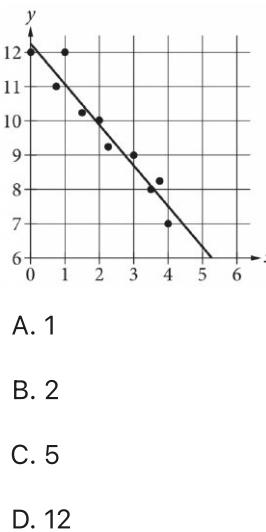
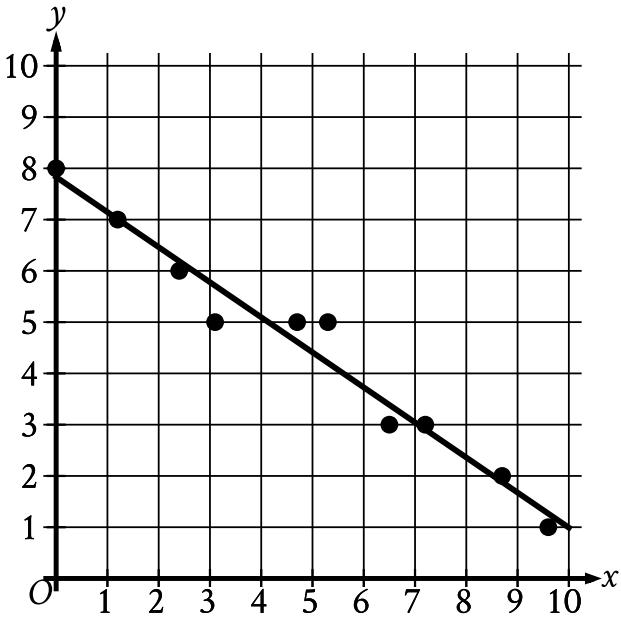
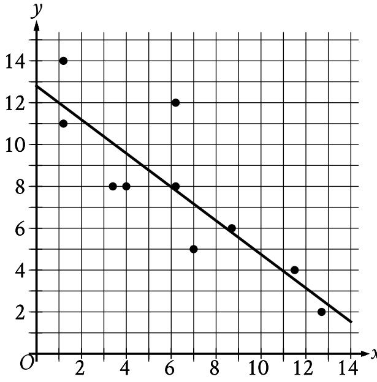
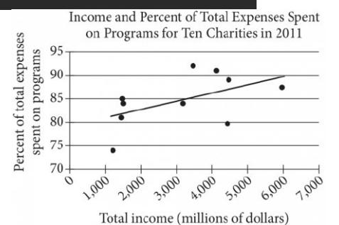
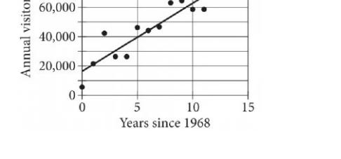
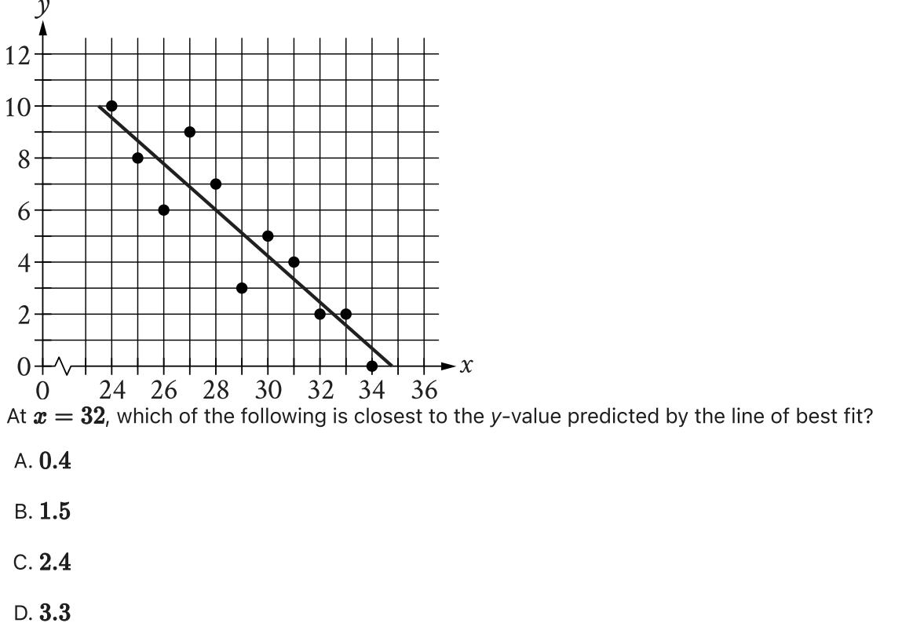
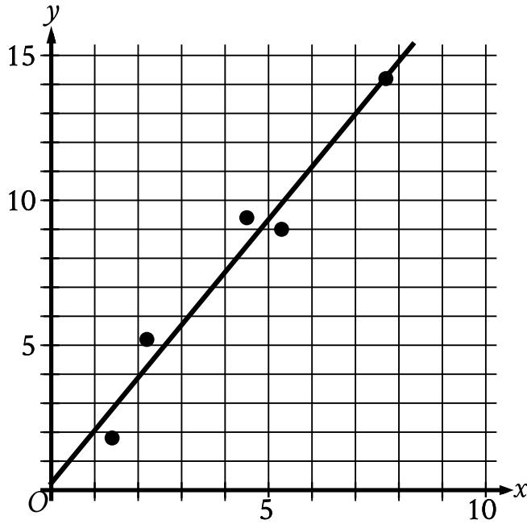
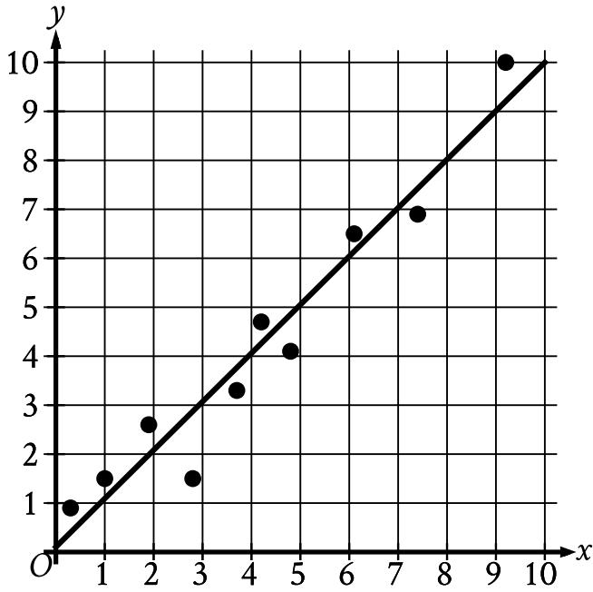

{0}------------------------------------------------

## Question ID 1adb39f0

| Assessment | Test | Domain                               | Skill                                            | Difficulty |
|------------|------|--------------------------------------|--------------------------------------------------|------------|
| SAT        | Math | Problem-Solving and Data Analysis | Two-variable data: Models and scatterplots |            |

### ID: 1adb39f0

2.1

The scatterplot shows the relationship between two variables, x and y. A line of best fit for the data is also shown. Which of the following is closest to the difference between the y-coordinate of the data point with X = 1 and

the y-value predicted by the line of best fit at X = 1 ?

#### ID: 1adb39f0 Answer

Correct Answer: A

#### Rationale

Choice A is correct. The data point with X = 1 has a y-coordinate of 12. The y-value predicted by the line of best fit at X = 1 is approximately 11. The difference between the y-coordinate of the data point and the y-value predicted by the line of best fit at x = 1 is 12 – 11, or 1.

Choices B and C are incorrect and may result from incorrectly reading the scatterplot. Choice D is incorrect. This is the y-coordinate of the data point at X = 1.

{1}------------------------------------------------

## Question ID 2e74e403

| Assessment | Test | Domain                               | Skill                                            | Difficulty |
|------------|------|--------------------------------------|--------------------------------------------------|------------|
| SAT        | Math | Problem-Solving and Data Analysis | Two-variable data: Models and scatterplots |            |

### ID: 2e74e403

2.2

In the given scatterplot, a line of best fit for the data is shown.

Which of the following is closest to the slope of this line of best fit?

A. 7

B. 0.7

C. -0.7

D. —7

### ID: 2e74e403 Answer

Correct Answer: C

Rationale

Choice C is correct. A line of best fit is shown in the scatterplot such that as the value of x increases, the value of y decreases. It follows that the slope of the line of best fit shown is negative. The slope of a line in the xyplane that passes through the points (I1, y1) and (x2, y2) can be calculated as shown passes approximately through the points (0, 8) and (10, 1). Substituting (0, 8) for (x1, y1) and (10, 1) for (x2, y2) in Therefore, of the given choices, —0.7 is the closest to the slope of this line of best fit.

{2}------------------------------------------------

Choice A is incorrect. The line of best fit shown has a negative slope, not a positive slope.

Choice B is incorrect. The line of best fit shown has a negative slope, not a positive slope.

Choice D is incorrect and may result from conceptual or calculation errors.

{3}------------------------------------------------

## Question ID 9a144a01

| Assessment | Test | Domain                               | Skill                                            | Difficulty |
|------------|------|--------------------------------------|--------------------------------------------------|------------|
| SAT        | Math | Problem-Solving and Data Analysis | Two-variable data: Models and scatterplots |            |

ID: 9a144a01

2.3

Which of the following is true about the values of 2 and

2x +2 for x > 0 ?

- A. For all x > 0, it is true that 2x < 2x +2.
B. For all x > 0, it is true that 24 > 2x +2

- C. There is a constant c such that if 0 < x < c, then 2 < 2x +2, but if x > c, then 2 * > 2x + 2.
- D. There is a constant c such that if 0 < x < c, then 2* > 2x +2, but if x > c, then 2* < 2x +2.

#### ID: 9a144a01 Answer

Correct Answer: C

Rationale

Choice C is correct. At x = 0, the value of 2* is less than the value of 2x +2: 2° < 2(0) +2, which is equivalent to 1 < 2. As the value of x increases, the value of 2* remains less than the value of 2x +2 until x = 3, which is when the two values are equal: 23 =2(3) +2, which is equivalent to 8 = 8. Then, for x > 3, the value of 24 is greater than the value of 2x + 2. So there is a constant, 3, such that when 0 < x < 3, then 2 < 2x +2, but when x > 3, then 2* > 2x + 2.

Choice A is incorrect because 2* > 2x +2 when x > 3. Choice B is incorrect because 2* < 2x +2 when 0 < x < 3. Choice D is incorrect because 2 < 2x + 2 when 0 < x < 3 and 2* > 2x +2 when x > 3.

{4}------------------------------------------------

## Question ID 03a16790

| Assessment | Test | Domain                               | Skill                                            | Difficulty |
|------------|------|--------------------------------------|--------------------------------------------------|------------|
| SAT        | Math | Problem-Solving and Data Analysis | Two-variable data: Models and scatterplots |            |

### ID: 03a16790

2.4

The scatterplot shows the relationship between two variables, x and y. A line of best fit is also shown.

Which of the following is closest to the slope of the line of best fit shown?

- A. -2.4
- B. —0.8
- C. 0.8
- D. 2.4

#### ID: 03a16790 Answer

Correct Answer: B

Rationale

Choice B is correct. A line of best fit is shown in the scatterplot such that as the value of x increases, the value of y decreases. Thus, the slope of the line of best fit shown is negative. The slope of a line passing through two points, (x1, y1) and (x2, y2), can be calculated as through the points (1, 12) and (11, 4). Substituting (1, 12) and (11, 4) for (x1, y1) and (x2, y2), respectively, end de points (2) 2) and (22) 2) Cabethalling (2) 2) 22 (419) 27 day (21) 27) 2006 (27, 2006 (27, 2006est to the slope of the line of best fit shown.

{5}------------------------------------------------

Choice A is incorrect and may result from conceptual or calculation errors.

Choice C is incorrect. The line of best fit shown has a negative slope, not a positive slope.

Choice D is incorrect. The line of best fit shown has a negative slope, not a positive slope.

{6}------------------------------------------------

# Question ID 7ac5d686

| Assessment | Test | Domain                               | Skill                                            | Difficulty |
|------------|------|--------------------------------------|--------------------------------------------------|------------|
| SAT        | Math | Problem-Solving and Data Analysis | Two-variable data: Models and scatterplots |            |

### ID: 7ac5d686

2.5

An inspector begins a day of work with a large sample of shirts that need to be checked for defects. The inspector works at a constant rate throughout the morning. What type of model is best to model the number of shirts remaining to be checked for defects at any given time throughout the morning?

- A. A linear model with a positive slope
- B. A linear model with a negative slope
- C. An exponential growth model
- D. An exponential decay model

#### ID: 7ac5d686 Answer

#### Rationale

Choice B is correct. Since the work is done at a constant rate, a linear model best models the situation. The number of shirts remaining is dependent on the length of time the inspector has worked; therefore, if the relationship were graphed, time would be the variable of the horizontal axis and the number of remaining shirts would be the variable of the vertical axis. Since the number of shirts decreases as the time worked increases, it follows that the slope of this graph is negative.

Choice A is incorrect and may result from incorrectly reasoning about the slope. Choices C and D are incorrect and may result from not identifying the constant rate of work as a characteristic of a linear model.
{7}------------------------------------------------

# Question ID 7fd284ac

| Assessment   | Test | Domain                               | Skill                                            | Difficulty |
|--------------|------|--------------------------------------|--------------------------------------------------|------------|
| SAT          | Math | Problem-Solving and Data Analysis | Two-variable data: Models and scatterplots |            |
| ID: 7fd284ac |      |                                      |                                                  | 2.6        |

The scatterplot above shows data for ten charities along with the line of best fit. For the charity with the greatest percent of total expenses spent on programs, which of the following is closest to the actual percent and the percent predicted by the line of best fit?

A. 10%

B.7%

C. 4%

D. 1 %

#### ID: 7fd284ac Answer

Correct Answer: B

#### Rationale

Choice B is correct. The charity with the greatest percent of total expenses spent on programs is represented by the highest point on the scatterplot; this is the point that has a vertical coordinate slightly less than halfway between 90 and 95 and a horizontal coordinate slightly less than halfway between 3,000 and 4,000. Thus, the charity represented by this point has a total income of about \$3,400 million and spends about 92% of its total expenses on programs. The percent predicted by the line of best fit is the vertical coordinate of the point on the line of best fit with horizontal coordinate \$3,400 million; this vertical coordinate is very slightly more than 85. Thus, the line of best fit predicts that the charity with the greatest percent of total expenses spent on programs will spend slightly more than 85% on programs. Therefore, the difference between the actual percent (92%) and the prediction (slightly more than 85%) is slightly less than 7%.

Choice A is incorrect. There is no charity represented in the scatterplot for which the difference between the actual percent of total expenses spent on programs and the percent predicted by the line of best fit is as much as 10%. Choices C and D are incorrect. These choices may result from misidentifying in the scatterplot the point that represents the charity with the greatest percent of total expenses spent on programs.

{8}------------------------------------------------

{9}------------------------------------------------

# Question ID 3d985614

Each dot in the scatterplot above represents the height x, in feet, in the high jump, and the distance y, in feet, in the long jump, made by each student in a group of twenty students. The graph of which of the following equations is a line that most closely fits the data?

A. y = 0.82x +3.30 B. y = 0.82x-0.82 C. y = 3.30x +0.82

D. y = 3.30x - 3.30

#### ID: 3d985614 Answer

Correct Answer: C

Rationale

Choice C is correct. A line that most closely fits the data is a line with an approximately balanced number of data points above and below the line. Fitting a line to the data shown results in a line with an approximate slope of 3 and a y-intercept near the point (0,1). An equation for the line can be written in slope-intercept

form, y = mx + b, where m is the slope and b is the y-coordinate of the y-intercept. The equation

y = 3.30x +0.82 in choice C fits the data most closely.

Choices A and B are incorrect because the slope of these equations is 0.82, which is a value that is too small to be the slope of the line that fits the data shown. Choice D is incorrect. The graph of this equation has a y-intercept at (0, - 3.30), not (0,0.82). This line would lie below all of the data points, and therefore would not closely fit the data.

{10}------------------------------------------------

{11}------------------------------------------------

# Question ID 3c5b19ef

| Assessment                                      | Test | Domain                               | Skill                                            | Difficulty |  |
|-------------------------------------------------|------|--------------------------------------|--------------------------------------------------|------------|--|
| SAT                                             | Math | Problem-Solving and Data Analysis | Two-variable data: Models and scatterplots |            |  |
| ID: 3c5b19ef 2.8 Railroad Museum Visitors |      |                                      |                                                  |            |  |

The scatterplot above shows the number of visitors to a railroad museum in Pennsylvania each year from 1968 to 1980, where t is the number of years since 1968 and n is the number of visitors. A line of best fit is also shown. Which of the following could be an equation of the line of best fit shown?

A. n = 16,090 + 4,680t

80.000

B. n = 4,690 + 16,090t

C. n = 16,090 +9,060t

D. n = 9,060 + 16,090t

#### ID: 3c5b19ef Answer

Correct Answer: A

Rationale

Choice A is correct. An equation of a line of best fit can be written in the form y = a+bx, where a is the yintercept of the line and b is the scatterplot shown, the line of best fit intersects the y-axis just over halfway between 10,000 and 20,000, or approximately 16,000. The line of best fit also intersects the graph y2 - y 1 at (5,40,000). Using the slope formula b = and two points that lie on the graph such as (5,40,000) X2—X1 40,000-16,000 and (0,16,000), the slope can be approximated as , or 4,800. Only choice A has a y-intercept 5-0 near the estimate of 16,000 and a slope near the estimate of 4,800. Therefore, an equation of the line of best fit could be n = 16,090 + 4,680t.

Choice B is incorrect because the values for the slope and the y-coordinate of the y-intercept are switched. Choice C is incorrect because the value for the slope is approximately double the actual slope. Choice D is incorrect because the values for the slope and the y-intercept are switched and because the slope is approximately double the actual slope.

{12}------------------------------------------------

{13}------------------------------------------------

# Question ID ab7740a8

| Assessment | Test | Domain                               | Skill                                            | Difficulty |
|------------|------|--------------------------------------|--------------------------------------------------|------------|
| SAT        | Math | Problem-Solving and Data Analysis | Two-variable data: Models and scatterplots |            |

### ID: ab7740a8

2.9

In which of the following tables is the relationship between the values of x and their corresponding y-values nonlinear?

| x | l | 2  | 3  | 4  |
|---|---|----|----|----|
| y | 8 | 11 | 14 | 17 |
|   |   |    |    |    |
| x | l | 2  | 3  | 4  |
| y | 4 | 8  | 12 | 16 |
|   |   |    |    |    |
| x | l | 2  | 3  | 4  |
| y | 8 | 13 | 18 | 23 |
|   |   |    |    |    |
| x | l | 2  | 3  | 4  |
| y | 6 | 12 | 24 | 48 |
|   |   |    |    |    |

### ID: ab7740a8 Answer

Correct Answer: D

Rationale

Choice D is correct. The relationship between the values of x and their corresponding y-values is nonlinear if the rate of change between these pairs of values isn't constant. The table for choice D gives four pairs of values: (1,6),(2,12),(3,24), and (4,48). Finding the rate of change, or slope, between (1,6) and (2,12) by using

12-6 У2—У1 the slope formula, x2-x7, yields 2-1 , or 6. Finding the rate of change between (2,12) and (3,24) yields 24-12 48-24 3 – 2 , or 12. Finding the rate of change between (3,24) and (4,48) yields = 4 – 3 , or 24. Since the rate of change isn't constant for these pairs of values, this table shows a nonlinear relationship.

Choices A, B, and C are incorrect. The rate of change between the values of x and their corresponding y-values in each of these tables is constant, being 3, 4, and 5, respectively. Therefore, each of these tables shows a linear relationship.
{14}------------------------------------------------

# Question ID 9eb896c5

| Assessment | Test | Domain                               | Skill                                            | Difficulty |
|------------|------|--------------------------------------|--------------------------------------------------|------------|
| SAT        | Math | Problem-Solving and Data Analysis | Two-variable data: Models and scatterplots |            |

## ID: 9eb896c5

Which of the following could be the equation for a line of best fit for the data shown in the scatterplot above?

A. y = 3x +0.8

- B.y =0.8x+3
- C. y = 0.8x +3

D.y = - 3x +0.8

### ID: 9eb896c5 Answer

Correct Answer: A

### Rationale

Choice A is correct. The data show a strong linear relationship between x and y. The line of best fif for a set of data is a linear equation that minimizes the distances from the data points to the line. An equation for the line of best fit can be written in slope-intercept form, y = mx + b, where m is the slope of the line and b is the y-coordinate of the y-intercept of the graph. Since, for the data shown, the y-values increase as the xvalues increase, the slope of a line of best fit must be positive. The data shown lie almost in a line, so the slope m = - Y2 - V1 x2 — X1 . The leftmost and rightmost data points can be roughly estimated using the formula for slope, have coordinates of about (1,4) and (8,26), so the slope is approximately 8-1 7 which is a little greater than 3. Extension of the line to the left would intersect the y-axis at about (0,1). Only choice A represents a line with a slope close to 3 and a y-intercept close to (0,1).

Choice B is incorrect and may result from switching the slope and y-intercept. The line with a y-intercept of (0,3) and a slope of 0.8 is farther from the data points than the line with a slope of 3 and a y-intercept of (0,0.8). Choices C and D are incorrect. They represent lines with negative slopes, not positive slopes.

2.10

{15}------------------------------------------------

{16}------------------------------------------------

# Question ID fdfc90e4

| Assessment | Test | Domain                               | Skill                                            | Difficulty |
|------------|------|--------------------------------------|--------------------------------------------------|------------|
| SAT        | Math | Problem-Solving and Data Analysis | Two-variable data: Models and scatterplots |            |

## ID: fdfc90e4

2.11

The scatterplot shows the relationship between two variables, I and y. A line of best fit for the data is also shown.

### ID: fdfc90e4 Answer

Correct Answer: C

### Rationale

Choice C is correct. At x = 32, the line of best fit has a y-value between 2 and 3. The only choice with a value between 2 and 3 is choice C.

Choice A is incorrect. This is the difference between the y-value predicted by the line of best fit and the actual y-value at x = 32 rather than the y-value predicted by the line of best fit at x = 32.

Choice B is incorrect. This is the y-value predicted by the line of best fit at x = 31 rather than at x = 32.

Choice D is incorrect. This is the y-value predicted by the line of best fit at x = 32.

{17}------------------------------------------------

# Question ID 4cc05491

| Assessment | Test | Domain                               | Skill                                            | Difficulty |
|------------|------|--------------------------------------|--------------------------------------------------|------------|
| SAT        | Math | Problem-Solving and Data Analysis | Two-variable data: Models and scatterplots |            |

## ID: 4cc05491

2.12

In the given scatterplot, a line of best fit for the data is shown.

Which of the following is closest to the slope of the line of best fit shown?

A. 0.2

B. 0.7

c. 1.8

D. 2.6

### ID: 4cc05491 Answer

Correct Answer: C

{18}------------------------------------------------

### Rationale

Choice C is correct. A line in the xy-plane that passes through points x1, y, and x2, y, has a slope of ثَّثٌــ The line of best fit shown passes approximately through the points 0, 0.2 and 5, 9.3. It follows that the slope of this line is approximately which is equivalent to 2, or 1.82. Therefore, of the given choices, 1.8 is closest to the slope of the line of best fit shown.

Choice A is incorrect. This value is closest to the y-coordinate of the line of best fit shown.

Choice B is incorrect and may result from conceptual or calculation errors.

Choice D is incorrect and may result from conceptual or calculation errors.

{19}------------------------------------------------

# Question ID e17babed

| Assessment | Test | Domain                               | Skill                                            | Difficulty |
|------------|------|--------------------------------------|--------------------------------------------------|------------|
| SAT        | Math | Problem-Solving and Data Analysis | Two-variable data: Models and scatterplots |            |

ID: e17babed

2.13

The scatterplot shows the relationship between two variables, ☞ and y. A line of best fit for the data is also shown.

For how many of the 10 data points is the actual y-value greater than the y-value predicted by the line of best fit?

- A. 3
- B. 4
- C. 6
- D. 7

## ID: e17babed Answer

Correct Answer: C

{20}------------------------------------------------

#### Rationale

Choice C is correct. Any data point that's located above the line of best fit has a y-value that's greater than the y-value predicted by the line of best fit. For the scatterplot shown, 6 of the data points are above the line of best fit. Therefore, 6 of the data points have an actual y-value that's greater than the y-value predicted by the line of best fit.

Choice A is incorrect and may result from conceptual or calculation errors.

Choice B is incorrect. This is the number of data points that have an actual y-value that's less than the y-value predicted by the line of best fit.

Choice D is incorrect and may result from conceptual or calculation errors.