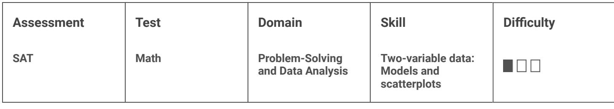

{0}------------------------------------------------

# Question ID d6af3572

| Assessment | Test | Domain                               | Skill                                            | Difficulty |
|------------|------|--------------------------------------|--------------------------------------------------|------------|
| SAT        | Math | Problem-Solving and Data Analysis | Two-variable data: Models and scatterplots |            |

### ID: d6af3572

The scatterplot above shows the federal-mandated minimum wage every 10 years between 1940 and 2010. A line of best fit is shown, and its equation is y = 0.096x – 0.488. What does the line of best fit predict about the increase in the minimum wage over the 70-year period?

A. Each year between 1940 and 2010, the average increase in minimum wage was 0.096 dollars.

B. Each year between 1940 and 2010, the average increase in minimum wage was 0.49 dollars.

C. Every 10 years between 1940 and 2010, the average increase in minimum wage was 0.096 dollars.

D. Every 10 years between 1940 and 2010, the average increase in minimum wage was 0.488 dollars.

#### ID: d6af3572 Answer

Correct Answer: A

#### Rationale

Choice A is correct. The given equation is in slope-intercept form, or y = mx + b, where m is the value of the

slope of the line of best fit. Therefore, the slope of the line of best fit is 0.096. From the definition of slope, it follows that an increase of 1 in the x-value corresponds to an increase of 0.096 in the y-value. Therefore, the line of best fit predicts that for each year between 1940 and 2010, the minimum wage will increase by 0.096 dollar per hour.

Choice B is incorrect and may result from using the y-coordinate of the y-intercept as the average increase, instead of the slope. Choice C is incorrect and may result from using the 10-year increments given on the xaxis to incorrectly interpret the slope of the line of best fit. Choice D is incorrect and may result from using the y-coordinate of the y-intercept as the average increase, instead of the slope, and from using the 10-year increments given on the x-axis to incorrectly interpret the slope of the line of best fit.

Question Difficulty: Hard

3.1

{1}------------------------------------------------

# Question ID 1e1027a7

The scatterplot above shows a company's ice cream sales d, in dollars, and the high temperature t, in degrees Celsius (°C), on 12 different days. A line of best fit for the data is also shown. Which of the following could be an equation of the line of best fit?

16 18 20 22 24 26

Temperature (°C)

A. d = 0.03t + 402

10 12 14

B. d = 10t + 402

900 800

C. d = 33t + 300

D.d=33t+84

#### ID: 1e1027a7 Answer

Correct Answer: D

Rationale

Choice D is correct. On the line of best fit, d increases from approximately 480 to 880 between t = 12 and t = 24 . The slope of the line of best fit is the difference in d-values divided by the difference in t-values, which gives 880-480 400 12 , or approximately 33. Writing the equation of the line of best fit in slope-intercept form 24-12 gives d = 33t+b, where b is the y-coordinate of the y-intercept. This equation is satisfied by all points on the line, so d = 480 when t = 12. Thus, 480 = 33(12) + b, which is equivalent to 480 = 396 + b. Subtracting 396 from both sides of this equation gives b = 84. Therefore, an equation for the line of best fit could be d = 33t+84

## Choice A is incorrect and may result from an error in calculating the slope and misidentifying the ycoordinate of the y-intercept of the graph as the value of d at t = 10 rather than the value of d at t = 0. Choice B is incorrect and may result from using the smallest value of t on the slope and misidentifying the

{2}------------------------------------------------

y-coordinate of the y-intercept of the graph as the value of d at t = 10 rather than the value of d at t = 0.

Choice C is incorrect and may result from misidentifying the y-coordinate of the y-intercept as the smallest value of d on the graph.

Question Difficulty: Hard

{3}------------------------------------------------

# Question ID 7b52985c

| Assessment | Test | Domain                               | Skill                                            | Difficulty |
|------------|------|--------------------------------------|--------------------------------------------------|------------|
| SAT        | Math | Problem-Solving and Data Analysis | Two-variable data: Models and scatterplots |            |

### ID: 7b52985c

3.3

The scatterplot shows the relationship between the length of time y, in hours, a certain bird spent in flight and the number of days after January 11, x.

What is the average rate of change, in hours per day, of the length of time the bird spent in flight on January 13 to the length of time the bird spent in flight on January 15?

### ID: 7b52985c Answer

Correct Answer: 4.5, 9/2

Rationale

The correct answer is . It's given that the scatterplot shows the relationship between the length of time y, in hours, a certain bird spent in flight and the number of days after January 11, x. Since January 13 is 2 days after January 11, it follows that January 13 corresponds to an x-value of 2 in the scatterplot. In the scatterplot, when x = 2, the corresponding value of y is 6. In other words, on January 13, the bird spent 6 hours in flight. Since January 15 is 4 days after January 11, it follows that January 15 corresponds to an x-value of 4 in the scatterplot. In the scatterplot, when x = 4, the corresponding value of y is 15. In other words, on January 15, the bird spent 15 hours in flight. Therefore, the average rate of change, in hours per day, of the length of time the bird spent in flight on January 13 to the length of time the bird spent in flight on January 15 is the difference in the length of time, in hours, the bird spent in flight divided by the difference in the number of days after January 11, or 45 , which is equivalent to correct answer.

{4}------------------------------------------------

Question Difficulty: Hard

{5}------------------------------------------------

# Question ID d0430601

Each dot in the scatterplot above represents the temperature and the number of people who visited a beach in Lagos, Nigeria, on one of eleven different days. The line of best fit for the data is also shown. The line of best fit for the data has a slope of approximately 57. According to this estimate, how many additional people per day are predicted to visit the beach for each 5°C increase in average temperature?

### ID: d0430601 Answer

#### Rationale

The correct answer is 285. The number of people predicted to visit the beach each day is represented by the yvalues of the line of best fit, and the average temperature, in degrees Celsius ( "C), is represented by the x-

values. Since the slope of the line of best fit is approximately 57, the y-value, or the number of people predicted to visit the beach each day, increases by 57 for every x-value increase of 1, or every 1 °C increase in average temperature. Therefore, an increase of 5 °C in average temperature corresponds to a y-value increase of 57(5) = 285 additional people per day predicted to visit the beach.

Question Difficulty: Hard
{6}------------------------------------------------

### Question ID e821a26d

| Assessment | Test | Domain                               | Skill                                            | Difficulty |
|------------|------|--------------------------------------|--------------------------------------------------|------------|
| SAT        | Math | Problem-Solving and Data Analysis | Two-variable data: Models and scatterplots |            |

### ID: e821a26d

3.5

The scatterplot below shows the amount of electric energy generated, in millions of megawatt-hours, by nuclear sources over a 10-year period.

Of the following equations, which best models the data in the scatterplot?

- A. y = 1.674x2 + 19.76x 745.73 B. y = - 1.674x2 - 19.76x - 745.73 c. y = 1.674x2 + 19.76x + 745.73 D. y = - 1.674x2 + 19.76x + 745.73
#### ID: e821a26d Answer

Correct Answer: D

Rationale

Choice D is correct. The data in the scatterplot roughly fall in the shape of a downward-opening parabola; therefore, the coefficient for the X term must be negative. Based on the location of the data points, the yintercept of the parabola should be somewhere between 740 and 760. Therefore, of the equations given, the best model is y = - 1.674x2 + 19.76x +745.73

Choices A and C are incorrect. The positive coefficient of the X term means that these equations each define upward-opening parabolas, whereas a parabola that fits the data in the scatterplot must open downward. Choice B is incorrect because it defines a parabola with a y-intercept that has a negative y-coordinate, whereas a parabola that fits the data in the scatterplot must have a y-intercept with a positive y-coordinate.

Question Difficulty: Hard

{7}------------------------------------------------

## Question ID 79137c1b

The scatterplot above shows the size x and the sale price y of 25 houses for sale in Town H. Which of the following could be an equation for a line of best fit for the data?

A. y = 200x + 100

150

B. y = 100x + 100

C. y = 50x + 100

D. y = 100x

#### ID: 79137c1b Answer

Size (thousands of square feet)

Correct Answer: B

Rationale

Choice B is correct. From the shape of the cluster of points, the line of best fit should pass roughly through the points (1,200) and (2.5,350). Therefore, these two points can be used to find an approximate equation for the

Y2-Y1_ 350-200 line of best fit. The slope of this line of best fit is therefore x2 —X1 2.5 – 1 line of best fit, in slope-intercept form, is y = 100x + b for some value of b. Using the point (1,200), I can be substituted for x and 200 can be substituted for y: 200 = 100(1) + b, or b = 100. Substituting this value into the slope-intercept form of the equation gives y = 100x + 100

Choice A is incorrect. The line defined by y = 200x + 100 passes through the points (1,300) and (2,500), both of which are well above the cluster of points, so it cannot be a line of best fit. Choice C is incorrect. The line

{8}------------------------------------------------

defined by y = 50x + 100 passes through the points (1,150) and (2,200), both of which lie at the bottom of the cluster of points, so it cannot be a line of best fit. Choice D is incorrect and may result from correctly calculating the slope of a line of best fit but incorrectly assuming the y-intercept is at (0,0).

Question Difficulty: Hard

{9}------------------------------------------------

## Question ID af142f8d

| Assessment | Test | Domain                               | Skill                                            | Difficulty |
|------------|------|--------------------------------------|--------------------------------------------------|------------|
| SAT        | Math | Problem-Solving and Data Analysis | Two-variable data: Models and scatterplots |            |

### ID: af142f8d

|           | Amount invested | Balance increase   |
|-----------|-----------------|--------------------|
| Account A | \$500           | 6% annual interest |
| Account B | \$1,000         | \$25 per year      |

Two investments were made as shown in the table above. The interest in Account A is compounded once per year. Which of the following is true about the investments?

A. Account A always earns more money per year than Account B.

B. Account A always earns less money per year than Account B.

C. Account A earns more money per year than Account B at first but eventually earns less money per year.

D. Account A earns less money per year than Account B at first but eventually earns more money per year.

#### ID: af142f8d Answer

Correct Answer: A

#### Rationale

Choice A is correct. Account A starts with \$500 and earns interest at 6% per year, so in the first year Account A earns (500)(0.06) = \$30, which is greater than the \$25 that Account B earns that year. Compounding interest can be modeled by an increasing exponential function, so each year Account A will earn more money than it did the previous year. Therefore, each year Account A earns at least \$30 in interest. Since Account B always earns \$25 each year, Account A always earns more money per year than Account B.

Choices B and D are incorrect. Account A earns \$30 in the first year, which is greater than the \$25 Account B earns in the first year. Therefore, neither the statement that Account A always earns less money per year than Account B nor the statement that Account A earns less money than Account B at first can be true. Choice C is incorrect. Since compounding interest can be modeled by an increasing exponential function, each year Account A will earn more money than it did the previous year. Therefore, Account A always earns at least \$30 per year, which is more than the \$25 per year that Account B earns.

Question Difficulty: Hard

3.7

{10}------------------------------------------------

# Question ID 9d95e7ad

| Assessment | Test | Domain                               | Skill                                            | Difficulty |
|------------|------|--------------------------------------|--------------------------------------------------|------------|
| SAT        | Math | Problem-Solving and Data Analysis | Two-variable data: Models and scatterplots |            |

### ID: 9d95e7ad

The scatterplot above shows the numbers of grams of both total fat for eight sandwiches on a restaurant menu. The line of best fit for the data is also shown. According to the line of best fit, which of the following is closest to the predicted increase in total fat, in grams, for every increase of 1 gram in total protein?

A. 2.5

B. 2.0

C. 1.5

D. 1.0

#### ID: 9d95e7ad Answer

Correct Answer: C

#### Rationale

Choice C is correct. The predicted increase in total fat, in grams, for every increase of 1 gram in total protein is represented by the slope of the line of best fit. Any two points on the line can be used to calculate the slope of the line as the change in total fat over the change in total protein. For instance, it can be estimated that the points (20,34) and (30,48) are on the line of best fit, and the slope of the line that passes through them is

$$\frac{48 - 34}{30 - 20} = \frac{14}{10}, \text{ or } 1.4. \text{ Of the choices given, } 1.5 \text{ is the closest to the slope of the line of best fit.}$$

Choices A, B, and D are incorrect and may be the result of incorrectly finding ordered pairs that lie on the line of best fit or of incorrectly calculating the slope.

Question Difficulty: Hard

3.8