{0}------------------------------------------------

# Question ID 22e4d633

| Assessment | Test                | Domain                   | Skill                  | Difficulty |
|------------|---------------------|--------------------------|------------------------|------------|
| SAT        | Reading and Writing | Information and ldeas | Command of Evidence |            |

### ID: 22e4d633

2.1

Although many transposons, DNA sequences that move within an organism's genome through shuffling or duplication, have become corrupted and inactive over time, those from the long interspersed nuclear elements (LINE) family appear to remain active in the genomes of some species. In humans, they are functionally important within the hippocampus, a brain structure that supports complex cognitive processes. When the results of molecular analysis of two species of octopus-an animal known for its intelligence-were announced in 2022, the confirmation of a LINE transposon in Octopus vulgaris and Octopus bimaculoides genomes prompted researchers to hypothesize that transposon family is tied to a species' capacity for advanced cognition.

Which finding, if true, would most directly support the researchers' hypothesis?

- A. The LINE transposon in O. vulgaris and O. bimaculoides genomes is active in an octopus brain structure that functions similarly to the human hippocampus.
- B. The human genome contains multiple transposons from the LINE family that are all primarily active in the hippocampus.
- C. A consistent number of copies of LINE transposons is present across the genomes of most octopus species, with few known corruptions.
- D. O. vulgaris and O. bimaculoides have smaller brains than humans do relative to body size, but their genomes contain sequences from a wider variety of transposon families.

### ID: 22e4d633 Answer

Correct Answer: A

### Rationale

Choice A is the best answer. The text says that LINE transposons are important in the human hippocampus, which supports complex cognition. If the LINE transposon found in octopuses is active in a similar part of their brain, that would suggest that LINE transposons support complex coqnition in octopuses too, which in turn supports the hypothesis that LINE transposons are linked to advanced cognition in general.

Choice B is incorrect. This choice doesn't support the hypothesis. It doesn't include anything about how LINE transposons function in species other than humans. Choice C is incorrect. This choice doesn't support the hypothesis. It doesn't include anything about how the LINE transposon in octopuses might support advanced cognition. Choice D is incorrect. This choice doesn't support the hypothesis. It doesn't include anything about how the LINE transposon in octopuses might support advanced cognition.

{1}------------------------------------------------

# Question ID d83c3d54

ID: d83c3d54

Characteristics of the Banks of the Provo River Downstream of the Jordanelle Dam

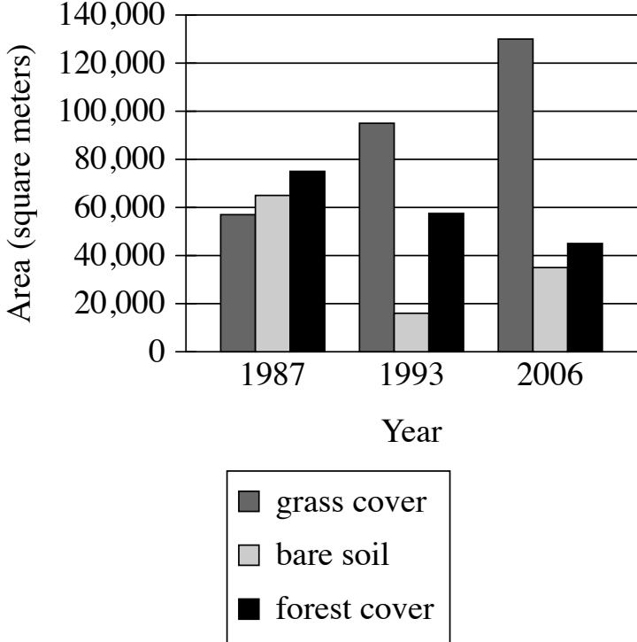

The Jordanelle Dam was built on the Provo River in Utah in 1992. Earth scientist Adriana E. Martinez and colleagues tracked changes to the environment on the river downstream of the dam, including how much grass and forest cover were present. They concluded that the dam chanqed the flow of the river in ways that benefited grass plants but didn't benefit trees.

Which choice best describes data from the graph that support Martinez and colleagues' conclusion?

- A. The lowest amount of grass cover was approximately 58,000 square meters, and the highest amount of forest cover was approximately 75,000 square meters.
- B. There was more grass cover than forest cover in 1987, and this difference increased dramatically in 1993 and aqain in 2006.
- C. There was less grass cover than bare soil in 1987 but more grass cover than bare soil in 1993 and 2006, whereas there was more forest cover than bare soil in all three years.
- D. Grass cover increased from 1987 to 1993 and from 1993 to 2006, whereas forest cover decreased in those periods.

2.2

{2}------------------------------------------------

Correct Answer: D

#### Rationale

Choice D is the best answer because it describes data from the graph that support Martinez and colleagues' conclusion that the Jordanelle Dam led to changes that benefited grass plants but not trees. The graph shows characteristics of the banks of the Provo River downstream of the Jordanelle Dam in three different years— 1987, 1993, and 2006. Specifically, the qraph shows the amount of grass cover, bare soil, and forest cover in those years. The text indicates that the Jordanelle Dam was built in 1992, meaning that the data from the graph for 1987 reflect conditions before the dam was built, whereas the data for 1993 and 2006 reflect conditions after the dam was built. The data show that grass cover increased substantially from 1987 to 1993 and again from 1993 to 2006. The data also show that forest cover those periods. Together, these data support Martinez and colleagues' conclusion that the dam was beneficial for grass plants but not for trees —qrass cover increased significantly after the dam was built, while forest cover declined.

Choice A is incorrect. Although it is true that, in the graph, the lowest value for grass cover is approximately 58,000 square meters and the highest value for forest cover is approximately 75,000 square meters, both values are from 1987, before the Jordanelle Dam was built in 1992. Therefore, this information alone cannot support Martinez and colleagues' conclusion about changes in grass and tree cover following the construction of the dam. Choice B is incorrect because it presents an inaccurate description of data from the graph shows that there was more forest cover than qrass cover in 1987, not that there was more grass cover than forest cover that year. Choice C is incorrect because, while it accurately reflects data from the graph when it compares grass cover and forest cover to bare soil, these data alone cannot support Martinez and colleagues' conclusion that the dam led to changes that benefited grass plants but not trees. An increase in grass cover relative to bare soil following the construction of the dam might indicate that the dam benefited grass plants, but the fact that there was more forest cover than bare soil in all three years doesn't indicate that the dam failed to benefit trees.

{3}------------------------------------------------

# Question ID d5b9ed0d

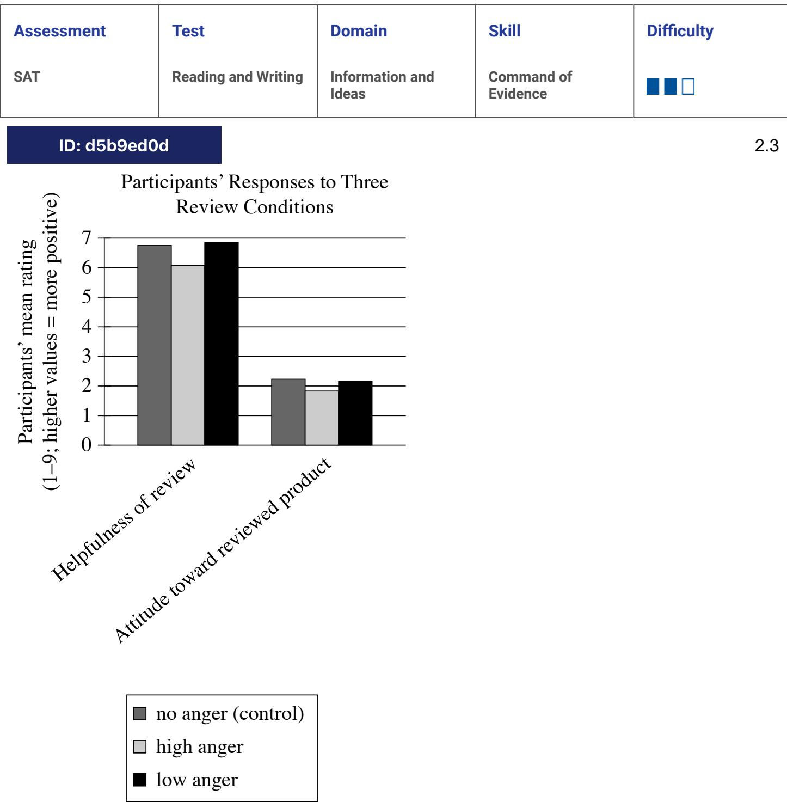

To understand how expressions of anger in reviews of products affect readers of those reviews, business scholar Dezhi Yin and colleagues measured study participants' responses to the same negative review a control review expressing no anger, a review expressing a high degree of anger, and a review expressing a low degree of anger. Reviewing the data, a student concludes that the mere presence of anger in a review may not negatively affect readers' perceptions of the review, but a high degree of anger in a review does worsen readers' perceptions of the review.

Which choice best describes data from the graph that support the students' conclusion?

- A. On average, participants' ratings of the helpfulness of the review were substantially higher than were participants' ratings of the reviewed product regardless of which type of review participants had seen.

{4}------------------------------------------------

- B. Compared with participants who saw the control review, participants who saw the low-anger review rated the review as slightly more helpful, whereas participants who saw the high-anger review as less helpful.
- C. Participants who saw the low-anger review rated the review as slightly more helpful than participants who saw the control review did, but participants' attitude toward the reviewed product was slightly worse when participants saw the low-anger review than when they saw the no-anger review.
- D. Compared with participants who saw the low-anger review, participants who saw the high-anger review rated the review as less helpful and had a less positive attitude toward the reviewed product.

### ID: d5b9ed0d Answer

Correct Answer: B

Rationale

Choice B is the best answer. The claim is that low anger does not neqatively affect readers' perceptions of the review, while high anger does negatively affect readers' perceptions of the review. This choice accurately expresses the supporting data from the "helpfulness of review" part of the graph that low-anger reviews were rated as slightly more helpful than no-anger reviews, while high-anger reviews were rated as less helpful than no-anger reviews.

Choice A is incorrect. This choice does not support the conclusion. The conclusion is only about how participants feel about the review itself—the participants' ratings of the reviewed product are not relevant. Choice C is incorrect. This choice does not support the conclusion. The conclusion is only about how participants feel about the review itself-the participants' attitude towards the reviewed product is not relevant. Choice D is incorrect. This choice does not support the conclusion is only about how participants feel about the review itself-the participants' attitude towards the reviewed product is not relevant.

{5}------------------------------------------------

# Question ID a13541c0

| Assessment | Test                | Domain                   | Skill                  | Difficulty |
|------------|---------------------|--------------------------|------------------------|------------|
| SAT        | Reading and Writing | Information and Ideas | Command of Evidence |            |

## ID: a13541c0

2.4

Sandra Cisneros's 1984 novella The House on Mango Street made a lasting impact on US literature. Its depiction of Mexican American culture inspired later authors to examine their own heritage within their fictional works. Also influential was the book's portrayal of the main character, Esperanza, during a pivotal year of her youth. This insightful depiction of a preteen girl encouraged authors who, like Cisneros herself, are Latina to use fictional works to examine experiences from their own youth.

Which statement, if true, would most strongly support the claim in the underlined sentence?

- A. In interviews, a number of Latina authors say that The House on Mango Street inspired them to write about their own adolescence in their novels.
- B. In published writings, several prominent authors who are not Latina say that reading The House on Mango Street influenced their approach to writing fiction.
- C. The House on Mango Street has sold over six million copies and is one of the most commonly read books among high school and university students in the US.
- D. Since 1984, new novels about young Latina characters by Latina authors have often been compared to The House on Mango Street.

## ID: a13541c0 Answer

Correct Answer: A

### Rationale

Choice A is the best answer because it presents a finding that, if true, would most strongly support the claim in the underlined sentence. The text begins by explaining that the portrayal of Mexican American culture in Sandra Cisneros's The House on Mango Street inspired later authors to explore their own heritage. Noting that Cisneros's novella was also influential for its depiction of a formative year in a female character's youth, the text then claims that this depiction inspired other Latina authors to use fiction to explore their own experiences of youth. Since this claim addresses how Cisneros encouraged Latina authors specifically to portray their youthful experiences, it would be directly supported by such authors stating that her novella influenced them to write about their own adolescence, or the transitional period between childhood and adulthood.

Choice B is incorrect. The text states that with its portrayal of Mexican culture, The House on Manqo Street inspired later authors to explore their own heritage, and since this statement isn't limited to only Latina authors, it can be inferred that authors who aren't Latina were also likely influenced by the novella. But because the claim in the underlined sentence concerns the novella's influence on Latina authors specifically, the finding that the book also influenced authors who weren't Latina would fail to provide support for the claim. Choice C is incorrect because the finding that The House on Mango Street has sold millions of copies and is widely read among students in the US doesn't relate directly to the text's claim that the novella has

{6}------------------------------------------------

influenced Latina authors specifically. Choice D is incorrect. While comparisons of new novels about young Latina characters by Latina authors to Cisneros's The House on Mango Street would likely be founded on similarities between those novels and Cisneros's novella, such similarities wouldn't necessarily be evidence of the novella's influence; such similarities might arise if Cisneros and younger Latina authors alike depicted certain basic cultural and historical features of their communities. Testimony from younger Latina authors about how The House on Mango Street had inspired them would be far more persuasive evidence of the novella's influence.

{7}------------------------------------------------

# Question ID 8a584241

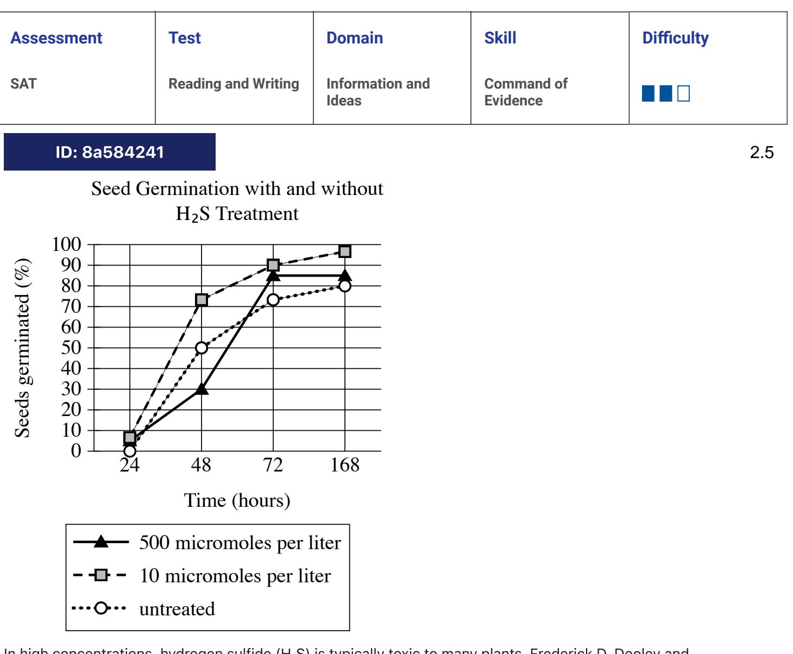

In high concentrations, hydrogen sulfide (H₂S) is typically toxic to many plants. Frederick D. Dooley and colleagues wanted to understand what effects low doses of H₂S might have on plant growth. They treated bean, corn, wheat, and pea seeds with various concentrations (measured in micromoles per liter) of H,S and tracked the germination of those seeds along with the germination of untreated seeds. Treatment with particular concentrations of H₂S was associated with accelerated germination: for example, _____________________________________________________________________________________________

Which choice most effectively uses data from the graph to complete the statement?

- A. at 24 hours, less than 10% of seeds treated with HJS at a concentration of 10 micromoles per liter had germinated, whereas more than 90% of those seeds had germinated at 168 hours.
- B. at 48 hours, more than 70% of seeds treated with H₂S at a concentration of 10 micromoles per liter had germinated, whereas only approximately 50% of untreated seeds had germinated.
- C. at 168 hours, more than 90% of seeds treated with H2S at concentrations of 10 or 500 micromoles per liter had germinated, whereas less than 70% of untreated seeds had germinated.
- D. at 48 hours, approximately 50% of seeds treated with H₂S at a concentration of 10 micromoles per liter had germinated, whereas only approximately 30% of untreated seeds had germinated.

{8}------------------------------------------------

#### ID: 8a584241 Answer

#### Correct Answer: B

#### Rationale

Choice B is the best answer. The claim is that some concentrations of H,S led to increased germination rates, and this choice accurately shows that seeds treated with 10 micromoles per liter of H,S tended to germinate faster than untreated seeds.

Choice A is incorrect. This choice doesn't justify the claim compares the germination rates of seeds exposed to certain concentrations of H,S to untreated seeds, but this choice only discusses one concentration of H, S, so it can't support any comparison between treated groups. Choice C is incorrect. This choice misreads the graph. At 168 hours, only about 85% of seeds treated with H, S at 500 micromoles per liter and well over 70% of untreated seeds had germinated (about 80%). Choice D is incorrect. This choice misreads the graph. At 48 hours, about 70% of seeds treated with H.S at 10 micromoles per liter and about 50% of untreated seeds had germinated.

{9}------------------------------------------------

# Question ID dd72993d

| Assessment | Test                | Domain                   | Skill                  | Difficulty |
|------------|---------------------|--------------------------|------------------------|------------|
| SAT        | Reading and Writing | Information and ldeas | Command of Evidence |            |

## ID: dd72993d

2.6

Rivers rich in sediment appear yellow, while increases in red algae make rivers appear red. To track things like the sediment or algae content of large US rivers, John R. Gardner and colleagues used satellite data to determine the dominant visible wavelengths of light measured for various segments of these rivers. The researchers classified wavelengths of 495 nanometers (nm) and below as red, wavelengths between 495 and 560 nm as blue, and wavelengths of 560 nm and above as yellow. The researchers concluded that for the Missouri River, segments flowing into lakes tend to carry more sediment than those flowing out of lakes.

Which finding, if true, would most directly support the researchers' conclusion?

- A. The segments of the Missouri River that had higher levels of chlorophyll-a, which contributes to the green color of photosynthetic organisms, have dominant wavelengths of light between 490 and 560 nm.
- B. In lakes through which segments of the Missouri River pass, the dominant wavelength of light tended to be above 560 nm near the lakes' shores and below 560 nm in the lakes' centers.
- C. The majority of the segments of the Missouri River were found to have dominant wavelengths of light significantly higher than 560 nm.
- D. Segments of the Missouri River flowing into lakes typically had dominant wavelengths of light above 560 nm, while segments flowing out of lakes typically had dominant wavelengths below 560 nm.

## ID: dd72993d Answer

### Correct Answer: D

### Rationale

Choice D is the best answer because it presents a finding that, if true, would support Gardner and colleagues' conclusion that segments of the Missouri River flowing into lakes tend to carry more sediment than do segments of the river flowing out of lakes. The text says that rivers appear yellow when they contain a lot of sediment and appear red when they contain a lot of algae. It goes on to explain that Gardner and colleagues measured the wavelengths of light for different seqments of rivers in the United States and classified those wavelength measurements into colors: red for wavelengths of 495 nanometers and below, blue for wavelengths between 495 and 560 nanometers, and yellow for wavelengths of 560 nanometers and above. Combined with the earlier information about river colors, this suggests that rivers rich in sediment will have wavelengths of 560 nanometers and above (since such rivers appear yellow). If researchers found that Missouri River segments flowing into lakes tend to have wavelengths above 560 nanometers and segments flowing out of lakes tend to have wavelengths below 560 nanometers, this finding would support Gardner and colleagues' conclusion, since it would suqqest that the river tends to carry more sediment when it flows into lakes than when it flows out of lakes.

Choice A is incorrect because finding that sections of the Missouri River with high chlorophyll-a levels have wavelengths between 490 and 560 nanometers would be irrelevant to the researchers' conclusion that
{10}------------------------------------------------

segments of the river flowing into lakes are richer in sediment than are segments of the river flowing out of lakes. This finding would not indicate anything about segments flowing into or out of lakes. Choice B is incorrect because finding that lakes through which the Missouri River passes have higher wavelengths near their shores than in the center would not support the researchers' conclusion that seqments of the river flowing into lakes have more sediment than segments flowing out of lakes. This finding would suggest only that there is more sediment around the edges of lakes than in their centers, which does not have any direct bearing on the researchers' conclusion about river segments flowing into and out of lakes. Choice C is incorrect because finding that most segments of the Missouri River have wavelengths significantly higher than 560 nanometers would suggest that most segments of the river are high in sediment, not that segments flowing into lakes are higher in sediment than segments flowing out of lakes. Only a comparison of river seqments flowing into lakes with segments flowing out of lakes can support the researchers' conclusion.

{11}------------------------------------------------

# Question ID 67b59a67

| Assessment | Test                | Domain                   | Skill                  | Difficulty |
|------------|---------------------|--------------------------|------------------------|------------|
| SAT        | Reading and Writing | Information and ldeas | Command of Evidence |            |

## ID: 67b59a67

2.7

Plants like potatoes, tomatoes, and soybeans are susceptible to bacterial wilt disease caused by the bacteria Ralstonia solanacearum. A multinational team of scientists led by Zhong Wei studied whether other microbes in the soil might influence the degree to which plants are affected by the disease. The team sampled soil surrounding individual tomato plants over time and compared the results of plants that became diseased with those that remained healthy. They concluded that the presence of certain microbes in the soil might explain the difference between healthy and diseased plants.

Which finding, if true, would most directly support the team's conclusion?

- A. The soil surrounding healthy plants contained significantly higher concentrations of microbes known to inhibit Ralstonia solanacearum than the soil surrounding diseased plants did.
- B. The soil surrounding the plants contained high concentrations of Ralstonia solanacearum regardless of whether the plants were affected by wilt disease.
- C. The soil surrounding healthy plants tended to have significantly higher moisture levels than the soil surrounding diseased plants did.
- D. By the end of the experiment, over half the plants had been affected by wilt disease regardless of differences in the types and concentrations of microbes in the surrounding soil.

## ID: 67b59a67 Answer

Correct Answer: A

Rationale

Choice A is the best answer. This choice provides evidence that directly links the presence of R. solanacearum-inhibiting microbes in the soil to the health of tomato plants.

Choice B is incorrect. This choice would weaken the team's conclusion. It suggests that the presence of the disease-causing bacteria had no effect on the health of the tomato plants. Choice C is incorrect. This choice doesn't support the team's conclusion. The conclusion is about microbes, not soil moisture. Choice D is incorrect. This choice would weaken the team's conclusion. It suggests that the presence of the bacteriainhibiting microbe in soil had no effect on the health of the tomato plants.

{12}------------------------------------------------

# Question ID 7edfb2c5

2.8

ID: 7edfb2c5

Estimated Temperatures to which Evron Quarry Artifacts Were Exposed

□ artifact

Flint artifacts dating to 800,000 years ago have been recovered from the Evron Quarry in Israel. Likely created by the hominin Homo erectus, the artifacts have no visual features suggesting that they were exposed to fire, leading some scholars to conclude that these hominins had not acquired control of fire. But Zane Stepka and colleagues recently used a new method to determine whether these artifacts had been exposed to temperatures above 400°C (the typical temperature campfires reach) and concluded that the hominins who inhabited the site may have had control of fire.

Which choice best describes data in the graph that support the team's conclusion?

A. Artifacts K5_106 and K3_9 were exposed to temperatures above 400°C.

B. Artifacts L5_239 and K3_18 were exposed to temperatures of approximately 550°C, respectively.

C. All of the artifacts were exposed to temperatures above 100°C.

D. Artifact K3_9 was exposed to a higher temperature than was artifact K5_106.

ID: 7edfb2c5 Answer

Correct Answer: B

Rationale

{13}------------------------------------------------

Choice B is the best answer. Campfires typically reach over 400°C, so human artifacts that were exposed to temperatures higher than this may indicate some human control over fire.

Choice A is incorrect. This choice misreads the graph. Neither artifact K3_9 nor K5_106 was exposed to temperatures above even 200°C. Choice C is incorrect. This choice doesn't support the claim. Campfires typically reach over 400°C, so exposure to temperatures of 100°C wouldn't demonstrate exposure to fire. Choice D is incorrect. This choice doesn't support the claim. Both artifacts K3_9 and K5_106 were exposed to temperatures of less than 200°C. Since campfires typically reach over 400°C, this wouldn't demonstrate exposure to fire.

{14}------------------------------------------------

# Question ID 0c622cfb

| Assessment | Test                | Domain                   | Skill                  | Difficulty |
|------------|---------------------|--------------------------|------------------------|------------|
| SAT        | Reading and Writing | Information and ldeas | Command of Evidence |            |

## ID: 0c622cfb

2.9

Although it's clear that Mars once had liquid water on its surface, astronomers have debated whether the evidence of ancient water reflects a prolonged phase of warm, wet conditions—the so-called wet and warm scenario-or a brief period of melting in an otherwise consistently frozen environment. Researchers Benjamin T. Cardenas and Michael P. Lamb recently added to this debate by using data from NASA and the Mars Orbiter Laser Altimeter to map the topography of what is now a large basin in Mars's northern hemisphere. Cardenas and Lamb concluded that the wet and warm scenario is likely correct.

Which finding about the basin, if true, would most directly support Cardenas and Lamb's conclusion?

- A. Its dimensions and shape indicate that it is unlikely to have formed as the result of an asteroid or comet impact.
- B. It has features suggesting that it once held an ocean that underwent gradual sea-level changes over an extended time.
- C. Its physical characteristics are most consistent with it having formed as a result of a massive but short-lived influx of liquid water.
- D. It is surrounded by channels that could have been formed either by running water or by flowing lava.

#### ID: 0c622cfb Answer

Correct Answer: B

#### Rationale

Choice B is the best answer. This choice provides direct support for the researchers' conclusion. If the basin once held an ocean of liquid water for "an extended time," that supports the "wet and warm scenario" on Mars, which involved a "prolonged" period of temperate conditions (and not just a "brief period of melting").

Choice A is incorrect. This choice doesn't provide support for the researchers' conclusions of the basin have little bearing on whether or not it was filled with liquid water, and for how long, and that's the evidence that would support the "wet and warm" theory. Similarly, whether or not the basin was formed by an asteroid or a comet is irrelevant to the question of whether or not there was water in the basin for a long period. Choice C is incorrect. This choice does not provide support for the researchers' conclusions, but rather the opposite. A "massive but short lived influx" of liquid water is not the same as a "prolonged phase of warm, wet conditions." It more reflects the opposing theory, a "brief period of melting." Choice D is incorrect. This choice does not support Cardenas and Lamb's conclusion. Both theories about liquid water on Mars ("wet and warm" and "brief period of melting") involve flowing water, but lava isn't mentioned at all in the text. Therefore, this choice doesn't provide exclusive support for either theory.

{15}------------------------------------------------

# Question ID 5fb6ed10

| Assessment | Test                | Domain                   | Skill                  | Difficulty |
|------------|---------------------|--------------------------|------------------------|------------|
| SAT        | Reading and Writing | Information and ldeas | Command of Evidence |            |

## ID: 5fb6ed10

2.10

The Land of Enchantment is a 1906 travel book by Lilian Whiting. In the book, which describes of traveling through the southwestern United States by train, Whiting reflects on the escape from everyday life that such a journey provides: _

Which quotation from The Land of Enchantment most effectively illustrates the claim?

- A. "The opportunities and advantages already offered and constantly increasing are greater than would at first be considered possible."
- B. "The social and the picturesque charm of the long journey is singularly enhanced by the leisurely stops made for refreshment."
- C. "The real journey begins, of course, at Chicago, and as these trains leave in the traveller fares forth in the seclusion of his berth."
- D. "One experiences a certain sense of detachment from ordinary day and daylight duties that is exhilarating."

## ID: 5fb6ed10 Answer

Correct Answer: D

Rationale

Choice D is the best answer because. This quotation specifically describes a "sense of detachment from ordinary day," which matches the claim's focus on "escape from everyday life."

Choice A is incorrect. While this quotation describes new opportunities associated with Whiting's experience, it doesn't frame these opportunities as "an escape," and it doesn't directly compare Whiting's journey with "everyday life." Choice B is incorrect. While this quotation includes a positive characterization of Whiting's journey, it doesn't specifically address the idea of an "escape from everyday life," which is the focus of the claim. Choice C is incorrect. This quotation focuses on where the journey begins, not on how it feels like an "escape from everyday life."

{16}------------------------------------------------

# Question ID c538954d

| Assessment | Test                | Domain                   | Skill                  | Difficulty |
|------------|---------------------|--------------------------|------------------------|------------|
| SAT        | Reading and Writing | Information and ldeas | Command of Evidence |            |

### ID: c538954d

2.11

Sense and Sensibility is an 1811 novel, Austen. In the novel, Austen describes Marianne Dashwood's ability to persuade others of the rightness of her artistic judgments, as is evident when Marianne visits with John Willoughby, a potential suitor: __

Which quotation from Sense and Sensibility most effectively illustrates the claim?

- A. "Above all, when she heard him declare, that of music and dancing he was passionately fond, she gave him such a look of approbation as secured the largest share of his discourse to herself for the rest of his stay."
- B. "Their taste was strikingly alike. The same passages were idolized by each—or if any difference appeared, any objection arose, it lasted no longer than till the force of her arguments and the brightness of her eyes could be displayed."
- C. "It was only necessary to mention any favourite amusement to engage her to talk. She could not be silent when such points were introduced, and she had neither shyness nor reserve in their discussion."
- D. "They speedily discovered that their enjoyment of dancing and music was mutual, and that it arose from a general conformity of judgment in all that related to either. Encouraged by this to a further examination of his opinions, she proceeded to question him on the subject of books."

#### ID: c538954d Answer

Correct Answer: B

#### Rationale

Choice B is the best answer. By showing that "any difference" in taste was quickly overcome by "the force of [Marianne's] arguments," this choice effectively demonstrates "ability to persuade others."

Choice A is incorrect. This choice doesn't effectively illustrate the claim. This choice shows that Marianne and John share an interest in music and dancing, but it doesn't provide evidence of Marianne's "ability to persuade others." Choice C is incorrect. This choice doesn't effectively illustrate the claim. This choice shows that Marianne enjoys talking about her interests, but it doesn't provide evidence of Marianne's "ability to persuade others." Choice D is incorrect. This choice doesn't effectively illustrate the claim. This choice shows that Marianne and John share many interests and generally agree on music and dancing, but it doesn't provide evidence of Marianne's "ability to persuade others."

{17}------------------------------------------------

## Question ID 8a668840

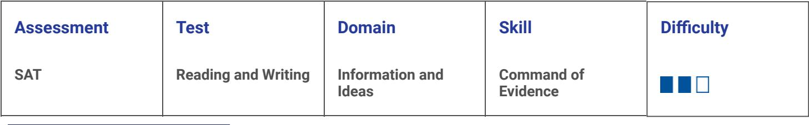

2.12

ID: 8a668840

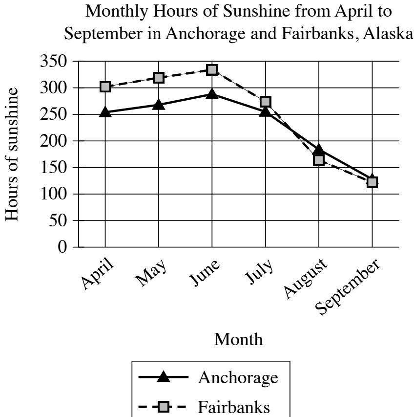

A student is researching monthly hours of sunshine in different cities in Alaska. When comparing trends in Anchorage and Fairbanks, the student concludes that the two cities show a similar pattern in the monthly hours of sunshine from April to September.

Which choice best describes data from the graph that support the student's conclusion?

- A. The monthly hours of sunshine in both Anchorage and Fairbanks hold steady in June and July before beginning to decline in August.
- B. The monthly hours of sunshine in both Anchorage and Fairbanks increase from April to June and then decrease from June to September.
- C. Anchorage and Fairbanks both have less than 200 monthly hours of sunshine from April to September.
- D. Anchorage and Fairbanks both have more than 300 monthly hours of sunshine from April to June and less than 200 hours from July to September.

ID: 8a668840 Answer

{18}------------------------------------------------

#### Correct Answer: B

#### Rationale

Choice B is the best answer because it best describes data from the graph that support the student's conclusion about weather patterns in Anchorage and Fairbanks. According to the graph, the amount of sunshine increases in both cities from April to June: in Anchorage, the number of monthly hours increases from about 250 to just under 300, and in Fairbanks the number of monthly hours increases from about 300 to just under 350. Also according to the graph, the amount of sunshine decreases in both cities from June to September: in Anchorage the number of monthly hours decreases from just under 300 to about 125, and in Fairbanks the number of monthly hours decreases from just under 350 to about 125. Thus, the monthly hours of sunshine in both cities follow a similar pattern, increasing from April to June and then decreasing from June to September.

Choice A is incorrect because, according to the graph, the monthly hours of sunshine in both Anchorage and Fairbanks decrease from June to July. They don't hold steady. In June there are slightly less than 300 hours of sunshine in Anchorage and slightly less than 350 hours in Fairbanks. Then, in July there are approximately 250 hours of sunshine in both cities. Choice C is incorrect because the graph shows that Anchorage and Fairbanks have less than 200 monthly hours of sunshine only in August and September. For the rest of the months represented in the graph, both cities have more than 200 monthly hours of sunshine. Choice D is incorrect because, according to the graph. Anchorage doesn't have more than 300 monthly hours of sunshine from April to June. In addition, both cities have more than 200 hours of sunshine in July, although the amount of sunshine does decrease to less than 200 monthly hours in August and September.

{19}------------------------------------------------

# Question ID 29cde5fa

| Assessment | Test                | Domain                   | Skill                  | Difficulty |
|------------|---------------------|--------------------------|------------------------|------------|
| SAT        | Reading and Writing | Information and ldeas | Command of Evidence |            |

### ID: 29cde5fa

2.13

"Mr. Cornelius Johnson, Office-Seeker" is a 1900 short story by Paul Laurence Dunbar. In the story, the narrator describes Mr. Cornelius Johnson's appearance as conveying his exaggerated sense of his importance: _

Which quotation from "Mr. Cornelius Johnson, Office-Seeker" most effectively illustrates the claim?

- A. "He carried himself always as if he were passing under his own triumphal arch."
- B. "The grey Prince Albert was scrupulously buttoned about his form, and a shiny top hat replaced the felt of the afternoon."
- C. "It was a beautiful day in balmy May and the sun shone pleasantly on Mr. Cornelius Johnson's very spruce Prince Albert suit of grey as he alighted from the train in Washington."
- D. "Mr. Cornelius Johnson always spoke in a large and important tone."

### ID: 29cde5fa Answer

Correct Answer: A

#### Rationale

Choice A is the best answer. This quote most effectively illustrates the claim. The claim is that the narrator describes Mr. Johnson as arrogant and self-important. This basically says that Mr. Johnson always looks like he's congratulating himself for something, which definitely supports the idea that Mr. Johnson is arrogant! .

Choice B is incorrect. This quote doesn't illustrate the claim is that the narrator describes Mr. Johnson's appearance as conveying his arrogance. This describes his appearance, but the description doesn't suggest a sense of arrogance. Choice C is incorrect. This quote doesn't illustrate the claim. The claim is that the narrator describes Mr. Johnson's appearance as conveying his arrogance. This doesn't describe Mr. Johnson's appearance very much, and it doesn't suggest a sense of arrogance. Choice D is incorrect. This quote doesn't effectively illustrate the claim. It describes Mr. Johnson's tone of voice as "large and important," but it doesn't describe his appearance as conveying a sense of self-importance.
{20}------------------------------------------------

## Question ID e1546fd6

| Assessment | Test                | Domain                   | Skill                  | Difficulty |
|------------|---------------------|--------------------------|------------------------|------------|
| SAT        | Reading and Writing | Information and ldeas | Command of Evidence |            |

## ID: e1546fd6

Average Nitrate and Phosphate Concentrations in Seawater after Volcanic Eruption

2.14

| Nutrient                               | Seawater in lava- affected area, 5- 45 meters below surface | Seawater in lava- affected area, 75–125 meters below surface | Seawater outside of lava-affected area, 5–45 meters below surface | Seawater outside of lava-affected area, 75–125 meters below surface |
|----------------------------------------|----------------------------------------------------------------------|-----------------------------------------------------------------------|----------------------------------------------------------------------------|---------------------------------------------------------------------------------|
| Nitrate (micromoles per liter)   | 3.1                                                                  | 0.4                                                                   | ≤0.03                                                                      | <0.01                                                                           |
| Phosphate (micromoles per liter) | 0.17                                                                 | 0.09                                                                  | 0.14                                                                       | 0.06                                                                            |

After a volcanic eruption spilled lava into North Pacific Ocean waters, a dramatic increase of diatoms (a kind of phytoplankton) near the surface occurred. Scientists assumed the diatoms were thriving on nutrients such as phosphate from the lava, but analysis showed these nutrients weren't present near the surface in forms diatoms can consume. However, there was an abundance of usable nitrate, a nutrient usually found in much deeper water and almost never found in lava. Microbial oceanographer Sonya Dyhrman and colleagues believe that as the lava plunged nearly 300 meters below the surface it dislodged pockets of this nutrient, releasing it to float upward, given that _______________

Which choice most effectively uses data from the table to complete the statement?

- A. at 5–45 meters below the surface, the average concentration of phosphate was about the same in the seawater in the lava-affected area as in the seawater outside of the lava-affected area.
- B. for both depth ranges measured, the average concentrations of nitrate were substantially higher in the seawater in the lava-affected area than in the seawater outside of the lava-affected area.
- C. for both depth ranges measured in the seawater in the lava-affected area, the average concentrations of nitrate were substantially higher than the average concentrations of phosphate.
- D. in the seawater outside of the lava-affected area, there was little change in the average concentration of nitrate from 75–125 meters below the surface to 5–45 meters below the surface.

#### ID: e1546fd6 Answer

Correct Answer: B

Rationale

{21}------------------------------------------------

Choice B is the best answer. The claim is that the lava freed the deep nitrate, allowing it to float upward. The table supports this by showing that there was more nitrate in the lava-affected seawater at various depths above 300 meters (the depth to which the lava plunged) than in unaffected seawater.

Choice A is incorrect. This choice doesn't complete the statement in a way that supports the claim. The claim is about nitrate, not phosphate. Choice C is incorrect. This choice doesn't complete the statement in a way that supports the claim. The claim is only about nitrate—the concentrations of phosphate aren't relevant. Choice D is incorrect. This choice doesn't complete the statement in a way that supports the claim. It doesn't say anything about the seawater inside the lava-affected area.

{22}------------------------------------------------

# Question ID a2b0fc3b

The share of the world's population living in cities has increased dramatically since 1970, but this change has not been uniform. France and Japan, for example, were already heavily urbanized in 1970, with 70% or more of the population living in cities. The main contributors to the world's urbanization since 1970 have been countries like Algeria, whose population went from __

Which choice most effectively uses data from the graph to complete the assertion?

A. around 50% urban in 1970 to around 90% urban in 2020.

B. less than 40% urban in 1970 to around 90% urban in 2020.

C. less than 20% urban in 1970 to more than 50% urban in 2020.

D. around 40% urban in 1970 to more than 70% urban in 2020.

ID: a2b0fc3b Answer

{23}------------------------------------------------

Correct Answer: D

Rationale

Choice D is the best answer. This choice effectively uses data from the graph to complete the example. The line representing the percent of Algeria's population living in cities is the black triangle line. According to the graph, it started at 40% in 1970 and reached 70% in 2020.

Choice A is incorrect. This choice misreads the graph. The line representing the percent of Algeria's population living in cities is the black triangle line. According to the graph, it started at 40% in 1970 and reached 70% in 2020. Choice B is incorrect. This choice misreads the graph. The line representing the percent of Algeria's population living in cities is the black triangle line. According to the graph, it started at 40% in 1970 and reached 70% in 2020. Choice C is incorrect. This choice misreads the graph. The line representing the percent of Algeria's population living in cities is the black triangle line. According to the graph, it started at 40% in 1970 and reached 70% in 2020.

{24}------------------------------------------------

# Question ID 2584bcfb

| Assessment | Test                | Domain                   | Skill                  | Difficulty |
|------------|---------------------|--------------------------|------------------------|------------|
| SAT        | Reading and Writing | Information and ldeas | Command of Evidence |            |

#### ID: 2584bcfb

2.16

Matthew D. Rocklage and team examined whether consumer ratings of movies can predict box office success. The team considered both numeric star ratings and written reviews in their research. To analyze the written reviews, the team measured the emotionality—the degree to which a written review expresses an emotional reaction—of user reviews on a movie rating website, assigning each review an emotionality score. After reviewing this research, a student argues that the emotionality of movie reviews is unrelated to a movie's success at the box office.

Which finding, if true, would most directly weaken the student's conclusion?

- A. Movies that had the highest average emotionality scores received the lowest average star ratings on the movie rating website.
- B. The average emotionality score of a movie's reviews was a positive predictor of that movie's box office earnings.
- C. More than half of the movies that the team examined received an average star rating of 3 out of 5 stars.
- D. The movies that were most successful at the box office tended to have high average star ratings.

#### ID: 2584bcfb Answer

Correct Answer: B

Rationale

Choice B is the best answer. This choice weakens the student's conclusion by suggesting that the emotionality of movie reviews is related to box office success: the higher the emotionality score, the better the movie performs at the box office.

Choice A is incorrect. While this choice does mention emotionality scores, it only connects them to star ratings, not to box office success. Choice C is incorrect. The fact that many movies received an average star rating doesn't tell us anything about the relationship between emotionality and box office success. Choice D is incorrect. While this choice suggests that star ratings can predict box office success it doesn't address the issue of emotionality in written reviews, which is the focus of the student's conclusion.

{25}------------------------------------------------

# Question ID 25290c8d

| Assessment | Test                | Domain                   | Skill                  | Difficulty |
|------------|---------------------|--------------------------|------------------------|------------|
| SAT        | Reading and Writing | Information and ldeas | Command of Evidence |            |

#### ID: 25290c8d

2.17

"On Virtue" is a 1766 poem by Phillis Wheatley addresses the poem directly to the quality of virtue, imploring it to assist her in reaching a future goal: _

Which quotation from "On Virtue" most effectively illustrates the claim?

- A. "Attend me, Virtue, thro' my youthful years! / O leave me not to the false joys of time! / But guide my steps to endless life and bliss."
- B. "I cease to wonder, and no more attempt / Thine height t'explore, or fathom thy profound."
- C. "O thou bright jewel in my aim I strive / To comprehend thee. Thine own words declare / Wisdom is higher than a fool can reach."
- D. "But, O my soul, sink not into despair, / Virtue is near thee, and with gentle hand / Would now embrace thee, hovers o'er thine head."

#### ID: 25290c8d Answer

Correct Answer: A

Rationale

Choice A is the best answer because it most effectively illustrates the claim that Wheatley addresses her poem "On Virtue" to the quality of virtue, imploring it to assist her in reaching a future goal. In the quotation, Wheatley begs virtue to accompany her, or "attend [her youth and to "quide [her] steps to" the future goal of "endless life and bliss."

Choice B is incorrect because this quotation suggests the difficulty of fully comprehending virtue. Rather than asking virtue for help, Wheatley presents it as a quality that is impossible to entirely understand because it is so grand and deep. Choice C is incorrect because this quotation describes Wheatley's effort to comprehend virtue despite virtue itself declaring that such wisdom is beyond her grasp, or "higher than a fool can reach." Choice D is incorrect because rather than asking virtue for help in this quotation, Wheatley urges herself to "sink not into despair" because virtue is always nearby.

{26}------------------------------------------------

## Question ID cbecb873

| Assessment | Test                | Domain                   | Skill                  | Difficulty |
|------------|---------------------|--------------------------|------------------------|------------|
| SAT        | Reading and Writing | Information and ldeas | Command of Evidence |            |

### ID: cbecb873

Body Length, Filter Time, and Lunges per Dive for Four Whale Species

| Whale species | Typical adult body length (meters) | Average time to filter all engulfed water (seconds) | Average number of lunges per dive deeper than 50 meters |
|------------------|---------------------------------------|--------------------------------------------------------|------------------------------------------------------------|
| fin              | 18–22                                 | 31.30                                                  | 3.95                                                       |
| humpback         | 11–17                                 | 17.12                                                  | 6.28                                                       |
| minke            | 7-10                                  | 8.88                                                   | 7.48                                                       |
| blue             | 24-34                                 | 60.27                                                  | 4.02                                                       |

Some whale species practice lunge feeding, in which they lunge toward prey with their mouths open at wide angles, collect the prey and the surrounding water, and then filter out the water through baleen plates in their mouths. Although the volume of water engulfed increases with whales' body length, the surface area of whales' baleen plates, which influences the rate at which water can be filtered, does not increase with body length to the same degree, which helps explain why ________________________________________________________________________________________________________________________________________

Which choice most effectively uses data from the table to complete the statement?

A. minke whales and humpback whales show similar average filter times.

B. humpback whales show an average of 6.28 lunges per dive.

C. fin whales show a longer average filter time than minke whales do.

D. blue whales show the longest average filter time and the highest average number of lunges per dive.

#### ID: cbecb873 Answer

Correct Answer: C

Rationale

Choice C is the best answer. To support the claim, we need to show that longer whales take more time to filter all the water they engulf than shorter whales do. This choice accurately reflects that a longer whale (the fin whale) takes more time to filter enquifed water (31.30 seconds on average) compared to a shorter whale (the minke whale, which only took 8.88 seconds on average).

Choice A is incorrect. The table shows that minke whales take an average of 8.88 seconds to filter engulfed water, while humpback whales take an average of 17.12 seconds to complete the same task. Choice B is incorrect. This choice doesn't reflect the claim about baleen plates. The claim why whales of differing lenqths take different amounts of time to filter enqulted water. This choice doesn't compare whales of different lengths, and it focuses on the number of lunges, which isn't shown to be relevant to filter time. Choice D is

2.18

{27}------------------------------------------------

incorrect. The table shows that blue whales average 4.02 lunges per dive, which is not the highest average among the whales in the table.

{28}------------------------------------------------

# Question ID e2829dd7

### ID: e2829dd7

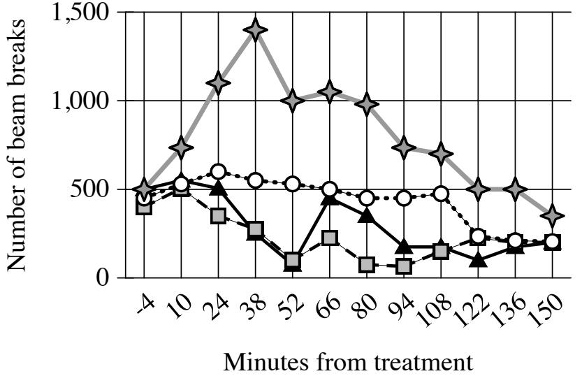

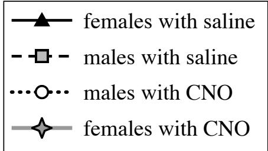

To investigate the influence of certain estrogen-responsive neurons on energy expenditure, biologist Stephanie Correa et al. treated female and male mice with either saline solution or clozapine-N4-oxide (CNO), which activates the neurons. Monitoring the activity levels of the mice by measuring how frequently the animals broke infrared beams crossing their enclosures, Correa et al. found that the mice in their study showed sex-specific differences in response to neuron activation: __

Which choice most effectively uses data from the graph to complete the assertion?

- A. the four groups of mice differed greatly in their activity levels before treatment but showed identical activity levels at the end of the monitoring period.
- B. saline-treated females showed substantially more activity at certain points in the monitoring period than saline-treated males did.
- C. CNO-treated females showed more activity relative to saline-treated females than CNO-treated males showed relative to saline-treated males.

2.19

{29}------------------------------------------------

- D. CNO-treated females showed a substantial increase and then decline in activity over the monitoring period, whereas CNO-treated males showed a substantial decline in activity followed by a steep increase.
#### ID: e2829dd7 Answer

Correct Answer: C

Rationale

Choice C is the best answer. The graph shows that the CNO-treated females were way more active than the CNO-treated males, while the saline-treated males (the control groups) had very similar activity levels. This supports the claim that there were sex-specific differences in the mice's response to neuron activation.

Choice A is incorrect. This choice misreads the graph. All four groups of mice started at nearly the same activity level before treatment (see how all four points are very close together at -4 minutes, meaning four minutes before treatment). Choice B is incorrect. This choice doesn't complete the assertion. The assertion is about the mice's response to neuron activation, so we need to include the data about the CNO-treated females and males. Choice D is incorrect. This choice misreads the graph. The line for the CNO-treated males does not show a "substantial decline" until around 122 minutes, and there is no "steep increase" afterward.
{30}------------------------------------------------

# Question ID c6b470bb

| Assessment | Test                | Domain                   | Skill                  | Difficulty |
|------------|---------------------|--------------------------|------------------------|------------|
| SAT        | Reading and Writing | Information and ldeas | Command of Evidence |            |

### ID: c6b470bb

2.20

"Odalie" is an 1899 short story by Alice Dunbar-Nelson. In the story, a young woman named Odalie attends the annual Mardi Gras carnival in New Orleans, where she lives with her guardian Tante Louise. Dunbar-Nelson portrays Odalie as eager to escape the monotony of her everyday life: .

Which quotation from "Odalie" most effectively illustrates the claim?

- A. "Mardi Gras was a tiresome day, after all, she sighed, and Tante Louise agreed with her for once."
- B. "In the old French house on Royal Street, with its quaint windows and Spanish courtyard green and cool, and made musical by the plashing of the fountain and the trill of caged birds, lived Odalie in convent-like seclusion."
- C. "When one is shut up in a great French house with a grim sleepy tante and no companions of one's own age, life becomes a dull thing, and one is ready for any new sensation."
- D. "It was Mardi Gras day at last, and early through her window Odalie could hear the jingle of folly bells on the [participants'] costumes, the tinkle of music, and the echoing strains of songs."

#### ID: c6b470bb Answer

Correct Answer: C

#### Rationale

Choice C is the best answer because it most effectively uses a quotation from "Odalie" to illustrate the claim that Odalie is eager to escape the monotony, or tedious lack of variety, of her everyday life. In the quotation, Odalie describes feeling "shut up" and complains that she has "no companions" except for her "sleepy tante." Odalie qoes on to say that, as a result, her life is "ready for any new sensation," meaning she wants a change. This suggests that Odalie wishes to get away from her monotonous everyday life.

Choice A is incorrect. Although this quotation includes the word "tiresome" which means dull, it does so to suggest Odalie's negative feelings about Mardi Gras, which is a once-a-year celebration, not her feelings about her everyday life. This quotation therefore doesn't express that Odalie's everyday life is monotonous or that she wishes to escape. Choice B is incorrect. Although this quotation ends by saying that Odalie lives in seclusion, or isolation, it doesn't express that Odalie's everyday life is monotonous or that she wishes to escape. Instead, it describes the pleasant qualities of the house Odalie lives in, saying that it has "quaint windows" and a "green and cool" courtyard that is "made musical" by the sounds of a fountain and pet birds. Choice D is incorrect because this quotation describes the lively sounds of a Mardi Gras celebration that Odalie hears through her window, not the monotony of Odalie's everyday life or her wish to escape.

{31}------------------------------------------------

## Question ID 5d6ab069

| Assessment | Test                | Domain                   | Skill                  | Difficulty |
|------------|---------------------|--------------------------|------------------------|------------|
| SAT        | Reading and Writing | Information and ldeas | Command of Evidence |            |

## ID: 5d6ab069

2.21

Jan Gimsa, Robert Sleigh, and Ulrike Gimsa have hypothesized that the sail-like structure running down the back of the dinosaur Spinosaurus aegyptiacus improved the animal's success in underwater pursuits of prey species capable of making quick, evasive movements. To evaluate their hypothesis, a second team of researchers constructed two battery-powered mechanical models of S. aegyptiacus, one with a sail and one without, and subjected the models to a series of identical tests in a water-filled tank.

Which finding from the model tests, if true, would most strongly support Gimsa and colleagues' hypothesis?

- A. The model with a sail took significantly less time to complete a sharp turn while submerged than the model without a sail did.
- B. The model with a sail displaced significantly more water while submerged than the model without a sail did.
- C. The model with a sail had significantly less battery power remaining after completing the tests than the model without a sail did.
- D. The model with a sail took significantly longer to travel a specified distance while submerged than the model without a sail did.

## ID: 5d6ab069 Answer

Correct Answer: A

Rationale

Choice A is the best answer. This finding would most strongly support the hypothesis is that the sail improved the dinosaur's ability to chase quick, evasive prey. This finding suggests that the sail helped the dinosaur make sharp turns more quickly, which supports that hypothesis.

Choice B is incorrect. This finding wouldn't necessarily support the hypothesis is that the sail improved the dinosaur's ability to chase quick, evasive prey. It's unclear how the sail displacing more water would relate to that hypothesis—it doesn't seem to be relevant. Choice C is incorrect. This finding wouldn't necessarily support the hypothesis is that the sail improved the dinosaur's ability to chase quick, evasive prey. It's unclear how the difference in battery power between the models would relate to that hypothesis—it doesn't seem to be relevant. Choice D is incorrect. This finding would actually weaken the hypothesis. The hypothesis is that the sail improved the dinosaur's ability to chase quick, evasive prey. This finding suggests that the sail slowed the dinosaur down-which would probably make it worse at catching quick, evasive prey.

{32}------------------------------------------------

## Question ID 2df730d0

ID: 2df730d0

Rotor Diameters of Newly Installed Wind Turbines in the United States, 2011-2021

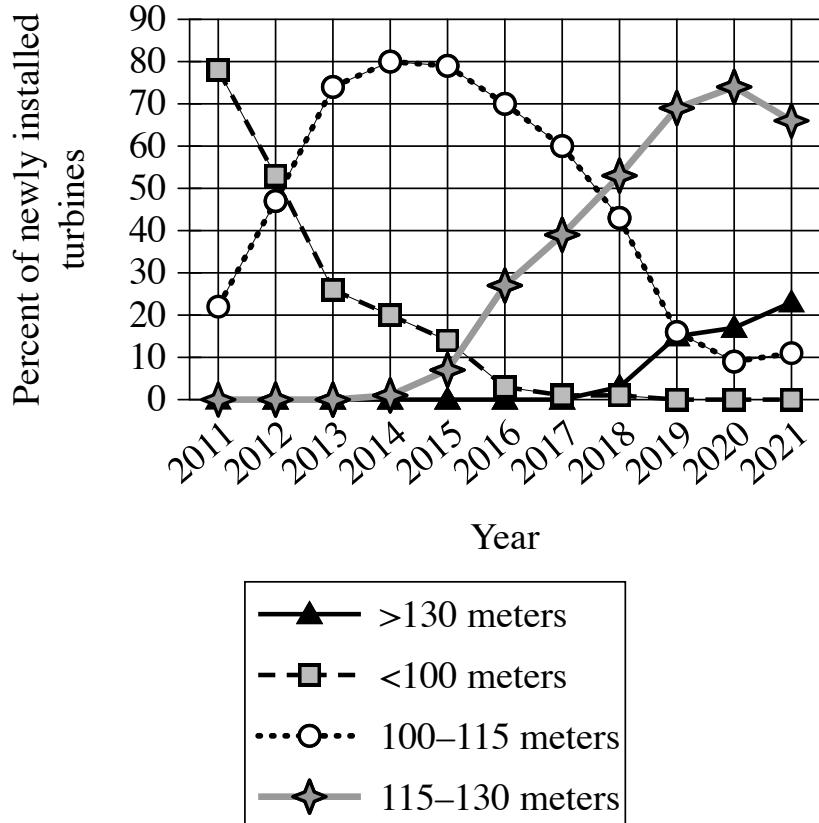

All other things being equal, the larger a wind turbine's rotor diameter of the imaginary circle swept by the turbine's rotating blades), the greater amount of energy the turbine can generate. In a research paper on wind power, a student claims that in the United States, the amount of energy generated per newly installed turbine increased substantially between 2011 and 2021.

Which choice best describes data in the graph that support the student's claim?

- A. The percentage of newly installed turbines with rotor diameters greater than 130 meters increased every year between 2011 and 2021.
- B. In 2011, nearly 80% of turbines installed had rotor diameters of less than 100 meters, whereas only a little more than 20% of turbines installed that year had rotor diameters of 100–115 meters.
- C. No turbines installed in 2011 had rotor diameters greater than 115 meters, whereas the majority of turbines installed in 2021 had rotor diameters greater than 130 meters.
- D. Most turbines installed in 2011 had rotor diameters of less than 100 meters, whereas most turbines installed in 2021 had rotor diameters of at least 115 meters.

2.22

{33}------------------------------------------------

#### ID: 2df730d0 Answer

#### Correct Answer: D

#### Rationale

Choice D is the best answer. The text tells us that turbines with larger rotor diameters produce more energy, so if rotor diameters have generally gotten larger between 2011 and 2021, then turbines created in 2021 should produce more energy than those created in 2011.

Choice A is incorrect. This choice misreads the graph. The percentage of newly installed turbines with rotor diameters greater than 130 meters didn't show any visible increase until 2018. Choice B is incorrect. This choice doesn't justify the claim is about increasing energy output from 2011 to 2021, but this choice only discusses 2011, so it can't show evidence of change over time. Choice C is incorrect. This choice misreads the graph. In 2021, only about 25% of turbines installed in 2021 had rotor diameters greater than 130 meters.

{34}------------------------------------------------

# Question ID 1d08c7ee

| Assessment | Test                | Domain                   | Skill                  | Difficulty |
|------------|---------------------|--------------------------|------------------------|------------|
| SAT        | Reading and Writing | Information and ldeas | Command of Evidence |            |

### ID: 1d08c7ee

2.23

Pulitzer Prize-winning writer Héctor Tobar has built a multifaceted career as both a journalist and an author of short stories and novels. In an essay about Tobar's work, a student claims that Tobar blends his areas of expertise by applying journalism techniques to his creation of works of fiction.

Which quotation from a literary critic best supports the student's claim?

- A. "For one novel, an imagined account of a real person's global travels, Tobar approached his subject like a reporter, interviewing people the man had met along the way and researching the man's own writings."
- B. "Tobar got his start as a volunteer for El Tecolote, a community newspaper in San Francisco, and wrote for newspapers for years before earning a degree in creative writing and starting to publish works of fiction."
- C. "Many of Tobar's notable nonfiction articles are marked by the writer's use of techniques usually associated with fiction, such as complex narrative structures and the incorporation of symbolism."
- D. "The protagonist of Tobar's third novel is a man who wants to be a novelist and keeps notes about interesting people he encounters so he can use them when developing characters for his stories."

### ID: 1d08c7ee Answer

Correct Answer: A

Rationale

Choice A is the best answer. The example of Tobar approaching his subject "like a reporter" including conducting "interviews" and "research," shows Tobar applying journalism techniques to his fiction-writing.

Choice B is incorrect. This choice doesn't support the claim. It tells us about Tobar's initial career as a journalist, but it doesn't say anything about him "applying journalism techniques" to his fiction-writing. Choice C is incorrect. This choice doesn't support the claim. It tells us that Tobar applied fiction techniques to his nonfiction writing, but we're looking for evidence of the other way around: that Tobar applied journalism techniques to his fiction-writing. Choice D is incorrect. This choice doesn't support the claim. It tells us that a character in one of Tobar's novels applied a journalism technique to his fiction-writing, but it doesn't tell us that Tobar did that himself.

{35}------------------------------------------------

# Question ID dd349efc

| Assessment | Test                | Domain                   | Skill                  | Difficulty |
|------------|---------------------|--------------------------|------------------------|------------|
| SAT        | Reading and Writing | Information and Ideas | Command of Evidence |            |

## ID: dd349efc

Participants' Evaluation of the Likelihood That Robots Can Work Effectively in Different Occupations

| Occupation                | Somewhat or very unlikely (%) | Neutral (%) | Somewhat or very likely (%) |
|---------------------------|----------------------------------|----------------|--------------------------------|
| television news anchor | 24                               | இ              | 67                             |
| teacher                   | 37                               | 16             | 47                             |
| firefighter               | 62                               | இ              | 30                             |
| surgeon                   | 74                               | ு              | 16                             |
| tour guide                | 10                               | 8              | 82                             |

Rows in table may not add up to 100 due to rounding.

Georgia Tech roboticists De'Aira Bryant and Ayanna Howard, along with ethicist Jason Borenstein, were interested in people's perceptions of robots' competence. They recruited participants and asked them how likely think it is that a robot could do the work required in various occupations. Participants' evaluations varied widely depending on which occupation was being considered; for example, __

Which choice most effectively uses data from the table to complete the example?

- A. 47% of participants believe that it is somewhat or very likely that a robot could work effectively as a teacher, but 37% of respondents believe that it is somewhat or very unlikely that a robot could do so.
- B. 9% of participants were neutral about whether a robot could work effectively as a television news anchor, which is the same percent of participants who were neutral when asked about a robot working as a surgeon.
- C. 82% of participants believe that it is somewhat or very likely that a robot could work effectively as a tour guide, but only 16% believe that it is somewhat or very likely that a robot could work as a surgeon.
- D. 62% of participants believe that it is somewhat or very unlikely that a robot could work effectively as a firefighter.

## ID: dd349efc Answer

Correct Answer: C

Rationale

Choice C is the best answer because it effectively uses data from the table to complete the example of variations in participants' evaluations. The table shows participants' evaluations of the likelihood that robots could work effectively in different occupations. The text asserts that participants' evaluations varied widely depending on the occupation being considered and introduces an example supporting that assertion. The data

2.24

{36}------------------------------------------------

from the table showing that 82% of participants believe that it is somewhat or very likely that a robot could work effectively as a tour quide but only 16% of participants believe that it is somewhat or very likely that a robot could work effectively as a surgeon illustrate this assertion: those data show participants' views changing substantially with the occupation being considered.

Choice A is incorrect because it does not describe data that illustrate the assertion that participants' evaluations varied widely depending on which occupation was being considered. Although this choice accurately describes data in the table, data about participants' responses when considering a single occupation-teaching-could not be an example of people's views chanqing substantially depending on the occupation being considered. Choice B is incorrect because it identifies a similarity in participants' responses when considering two different occupations, but the assertion that the example is intended to illustrate is that participants' evaluations varied widely depending on the occupation being considered. Although this choice accurately describes data in the table, those data do not illustrate the assertion in the text. Choice D is incorrect because it does not describe data that illustrate the assertion that participants' evaluations varied widely depending on which occupation was being considered. Although this choice accurately describes data in the table, data showing participants' evaluation of just one occupation could not be an example of participants' evaluations changing depending on the occupation under evaluation.

{37}------------------------------------------------

# Question ID 1db1a9a6

To test the effects of a nitrogen fertilizer on cantaloupe production, researchers grew cantaloupe plants and harvested their fuit over three years. In each year, half the plants were grown using a nitrogen fertilizer, and the other half were grown using a control fertilizer that contained no nitrogen. The researchers concluded that the nitrogen fertilizer increases cantaloupe yield.

2019

Which choice best describes data in the graph that support the researchers' conclusion?

- A. In every year of the experiment, plants treated with the nitrogen fertilizer had a yield of at least 30 pounds per acre.
- B. In every year of the experiment, plants treated with the nitrogen fertilizer had a greater yield than did plants treated with the control fertilizer.
- C. The 2018 yield for plants treated with the control fertilizer was greater than was the 2019 yield for plants treated with the nitrogen fertilizer.
- D. The yield for plants treated with the nitrogen fertilizer increased from 2017 to 2018.

### ID: 1db1a9a6 Answer

2017

2018

Year

□ control ■ nitrogen fertilizer

Correct Answer: B

Rationale

Choice B is the best answer because it describes data from the graph that support the researchers' conclusion that using nitrogen fertilizer increases cantaloupe production. The bar graph shows the cantaloupe yield for

{38}------------------------------------------------

plants grown with nitrogen fertilizer and for those grown with a control fertilizer (without nitrogen) for three consecutive years (2017-2019). For each year in the graph, the nitrogen group is greater than the yield for the control group. In pounds per acre, the value in 2017 for the nitrogen-group yield is greater than 30 while the control-qroup yield is less than 25; in 2018 the nitrogen-group yield is greater than 40 while the control-group yield is less than 35; and in 2019 the nitrogen-group yield is greater than 25 while the controlgroup yield is less than 20. Thus, these data from the graph strongly support the conclusion that using nitrogen fertilizer increases cantaloupe yield.

Choice A is incorrect because the bar graph shows that in 2019 the nitrogen group had a yield below 30 pounds per acre. Choice C is incorrect. Although this choice accurately describes data in the bar graph-in 2018, the control-group yield is greater than 30 pounds per acre, and in 2019 the nitrogen-group yield is less than 30 pounds per acre-a claim that the control-group yield exceeds that of the nitrogen group strongly conflicts with the researchers' conclusion that nitrogen fertilizer produces larger yields. Choice D is incorrect. Although it is true that the bar graph shows a higher yield for the nitrogen group in 2018 than in 2017, without the control to compare against, it is impossible to know whether the increase is due to the fertilizer and not, for example, more favorable weather in 2018 than in 2017.

{39}------------------------------------------------

## Question ID 16a4a83b

| Assessment | Test                | Domain                   | Skill                  | Difficulty |
|------------|---------------------|--------------------------|------------------------|------------|
| SAT        | Reading and Writing | Information and Ideas | Command of Evidence |            |

### ID: 16a4a83b

2.26

An Ideal Husband is an 1895 play by Oscar Wilde. In the play, which is a satire, Wilde suggests that a character named Lady Gertrude Chiltern is perceived as both extremely virtuous and unforgiving, as is evident when another character says _

Which quotation from An Ideal Husband most effectively illustrates the claim?

- A. "Lady Chiltern is a woman of the very highest principles, I am a little too old now, myself, to trouble about setting a good example, but I always admire people who do."
- B. "Do you know, [Lady Chiltern], I don't mind your talking morality is simply the attitude we adopt towards people whom we personally dislike."
- C. "[Lady Chiltern] does not know what weakness or temptation is. I am of clay like other men. She stands apart as good women do-pitiless in her perfection-cold and stern and without mercy."
- D. "Lady Chiltern, you are a sensible woman, the most sensible woman in London, the most sensible woman I know."

#### ID: 16a4a83b Answer

Correct Answer: C

#### Rationale

Choice C is the best answer because it most effectively uses a quotation to illustrate the claim that Lady Gertrude Chiltern is perceived as "both extremely virtuous and unforgiving." In the quotation, a man describes Lady Chiltern as someone who "does not know what weakness or temptation is." In other words, the man regards her as someone who is strong and adheres to a strict definition of moral perfection. However, he ironically suggests that this definition excludes mercy and forgiveness—qualities that are also thought of as virtues; according to him, Lady Chiltern is "pitiless in her perfection—cold and stern and without mercy." This description supports the idea that Lady Chiltern is perceived by others as virtuous as well as unforqiving.

Choice A is incorrect. The quotation supports the claim that Lady Chiltern is perceived as virtuous, in that it describes her as "a woman of the very highes" principles." However, it doesn't characterize her as unforgiving or being perceived as such. Choice B is incorrect. The quotation suggests that Lady Chiltern is concerned with morality, but it suggests that her interest in discussing it is fundamentally hypocritical and functions as a means by which to judge others. However, the quotation doesn't address the question of whether Lady Chiltern is unmerciful to those who seek forgiveness for harm they have caused. Choice D is incorrect because it doesn't address either Lady Chiltern's perceived virtuousness or her perceived lack of forgiveness, instead, it expresses the belief that she is sensible.
{40}------------------------------------------------

# Question ID 84136d69

| Assessment | Test                | Domain                   | Skill                  | Difficulty |
|------------|---------------------|--------------------------|------------------------|------------|
| SAT        | Reading and Writing | Information and ldeas | Command of Evidence |            |

ID: 84136d69

Five of the Responses to Survey about Actions to Conserve Energy

Action Percentage of respondents selecting Action action (%) category Use efficient cars/hybrids efficiency 2.8 Change thermostat setting 6.3 curtailment Use bike or public transportation curtailment 12.9 instead of car Use efficient light bulbs efficiency 3.6 Turn off lights 19.6 curtailment

In a survey of public perceptions of energy use, researcher Shahzeen Attari and her team asked respondents to name the most effective action ordinary people can take to conserve energy. The team categorized each action as either an efficiency or a curtailment and found that respondents tended to name curtailments more often than they did efficiencies. For example, 19.6% of respondents stated that the most effective way to conserve energy is to turn off the lights, while only _

Which choice most effectively uses data from the table to complete the text?

- A. 6.3% of respondents said it was most effective to use efficient cars or hybrids.
- B. 2.8% of respondents said it was most effective to change the thermostat setting.
- C. 12.9% of respondents said it was most effective to use a bike or public transportation.
- D. 3.6% of respondents said it was most effective to use efficient light bulbs.

### ID: 84136d69 Answer

Correct Answer: D

#### Rationale

Choice D is the best answer because it most effectively uses data from the table to complete the text's discussion of Attari and her team's survey results. The text states that the team asked respondents to identify the most effective action people can take to save energy, with the team classifying each action as either an efficiency or a curtailment. According to the text, respondents named curtailments more often than they did efficiencies. The text then offers an example that begins by citing a curtailment, turning off the lights, that was selected by a relatively high percentage of respondents (19.6%). Given that the example is presented in support of the idea that more respondents selected curtailments than efficiencies, the most effective way to complete

2.27

{41}------------------------------------------------

the example is by citing an efficienty, using efficient light bulbs, that was selected by a relatively low percentage of respondents (only 3.6%).

Choice A is incorrect because it inaccurately describes data in the table. The data indicate that 6.3% of respondents said the most effective action was to change the thermostat setting, not to use efficient cars or hybrids. Choice B is incorrect because it inaccurately describes data in the table. The data indicate that 2.8% of respondents said the most effective action was to use efficient cars/hybrids, not to change the thermostat setting. Choice C is incorrect because it mentions a curtailment (using a bike or public transportation) and not an efficiency. The text states that a research team asked respondents to identify the most effective action people can take to save energy, with the team classifying each action as either an efficiency or a curtailment. According to the text, respondents named curtailments more often than they did efficiencies. The text then offers an example that begins by citing a curtailment, turning off the lights, that was selected by a relatively high percentage of respondents (19.6%). Given that the example is presented in support of the idea that more people selected curtailments than efficiencies, the most effective way to complete the example is not by referring to another curtailment but rather by referring to an efficiency that was selected by a relatively low percentage of respondents.

{42}------------------------------------------------

# Question ID 23e2421a

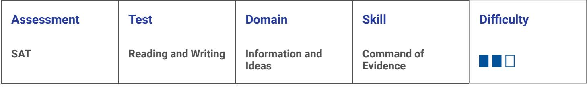

2.28

ID: 23e2421a

## Suggestions for Improving a University

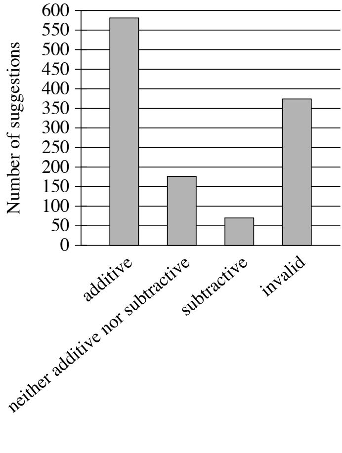

□ suggestion type

Gabrielle Adams and colleagues reviewed suggestions for improving a university that had been submitted to the university's president. They coded each suggestion as additive (the idea suggested adding something new to the university), subtractive (the idea suggested removing something from the university), neither additive nor subtractive, or invalid (the idea was not comprehensible). The data illustrated people's tendency to overlook the possibility of removing things to achieve improvements: _____________________________________________________________________________________________________________________

Which choice most effectively uses data in the graph to complete the statement?

- A. around 175 suggestions were coded as neither additive nor subtractive, whereas around 575 suggestions were coded as additive.
- B. more than 350 suggestions were coded as invalid, whereas fewer than 100 suggestions were coded as subtractive.

{43}------------------------------------------------

- C. fewer than 100 suggestions were coded as subtractive, whereas more than 550 suggestions were coded as additive.
- D. around 575 suggestions were coded as additive, whereas around 175 suggestions were coded as subtractive.

#### ID: 23e2421a Answer

Correct Answer: C

Rationale

Choice C is the best answer. This choice shows that people suggested removing things to achieve improvements a lot less often than they suggested adding things, which supports the claim that people tend not to think of removing things as a likely way to improve the university.

Choice A is incorrect. This choice doesn't support the claim. We are looking to prove that people suggested subtractive means of achieving improvements less often than other means, but this choice doesn't address how often people made subtractive suggestions. Choice B is incorrect. This choice doesn't support the claim. Invalid responses were incomprehensible, so we can't compare what they were suggesting to what was being suggested in subtractive responses. Choice D is incorrect. This choice misreads the graph. Fewer than 100 suggestions were coded as subtractive. 175 is the approximate number of suggestions coded as "neither additive or subtractive."

{44}------------------------------------------------

# Question ID b4cda84d

| Assessment | Test                | Domain                   | Skill                  | Difficulty |
|------------|---------------------|--------------------------|------------------------|------------|
| SAT        | Reading and Writing | Information and ldeas | Command of Evidence |            |

### ID: b4cda84d

2.29

In 1967 the US Congress created the Corporation for Public Broadcasting, which in turn created National Public Radio (NPR). NPR began producing and distributing high-quality news and cultural programming to affiliate stations across the United States in 1971. In a research paper, a student claims that the Corporation for Public Broadcasting and NPR were inspired by the British Broadcasting System (BBC), which had been established in the 1920s.

Which quotation from a work by a historian would be the most effective evidence for the student to include in support of this claim?

- A. "Although the BBC had begun as a private corporation, politicians successfully argued to make it a public company because they believed a public broadcaster could help build national unity in the aftermath of World War I."
- B. "For many decades, the BBC had no competition since it held Britain's only broadcasting license, whereas in the United States, the Corporation for Public Broadcasting launched NPR in a broadcasting market already filled with competitors."
- C. "Congress's embrace of publicly funded broadcasting reflected a common belief among US politicians that the role of government was not only to ensure people's safety and liberty but also to enrich people's lives in other ways."
- D. "The goal of the BBC was to support British democracy by promoting an informed citizenry, and US legislators believed that ensuring access to high-quality programming could do the same for democracy in the United States."

### ID: b4cda84d Answer

Correct Answer: D

Rationale

Choice D is the best answer because this quotation would be the most effective evidence to include in support of the claim that the Corporation for Public Broadcasting and NPR were inspired by the British Broadcasting System (BBC). The quotation states that the goal of the BBC was to support British democracy and that US legislators believed high-quality programming could accomplish the same goal for democracy in the United States. In other words, US legislators looked to the BBC as a model, taking direct inspiration from it when they created the Corporation for Public Broadcasting, which in turn created NPR.

Choice A is incorrect because this quotation provides historical information about the BBC, not information about the inspiration for the creation of the Corporation for Public Broadcasting and NPR. This quotation, therefore, is irrelevant to the student's claim that the BBC inspired the creation of the Corporation for Public Broadcasting, which in turn created NPR. Choice B is incorrect because this quotation contrasts the lack of competition faced by the BBC with the substantial competition faced by NPR, which has no bearing on the

{45}------------------------------------------------

student's claim that the Corporation for Public Broadcasting and NPR were inspired by the BBC. Choice C is incorrect because this quotation focuses on a common belief among US politicians that inspired Congress's embrace of publicly funded broadcasting. The quotation doesn't say anything about the BBC and therefore doesn't support the claim that the BBC inspired Congress to create the Corporation for Public Broadcasting, which in turn created NPR.

{46}------------------------------------------------

# Question ID 73d457b6

| Assessment | Test                | Domain                   | Skill                  | Difficulty |
|------------|---------------------|--------------------------|------------------------|------------|
| SAT        | Reading and Writing | Information and ldeas | Command of Evidence |            |

### ID: 73d457b6

2.30

In the 1970s, a roughly 60,000-year-old piece of hyena bone marked with nine notches was discovered at a site in western France once inhabited by Neanderthals. Although many believe that only modern humans developed systems for notating numbers, one archaeologist asserts that this artifact may be a sign that Neanderthals also recorded numerical information. The bone are unevenly spaced but approximately parallel, and microscopic analysis reveals that they were made with a single stone tool; according to the archaeologist, this suggests that the notches were all made at one time by one individual as a means of counting something.

Which finding, if true, would most directly weaken the underlined claim?

- A. Parallel lines are a common feature in modern humans' early systems for recording numerical information.
- B. More than nine approximately parallel notches made with a different stone tool are present on another artifact found at a site in western France.
- C. It would have taken careful effort to make evenly spaced lines on bone with the stone tools typically used by Neanderthals.
- D. Decorative art discovered at another Neanderthal site in western France primarily features of unevenly spaced parallel lines.

#### ID: 73d457b6 Answer

Correct Answer: D

Rationale

Choice D is the best answer. The archeologist bases their claim on the fact that the hyena bone features unevenly spaced parallel notches. But if unevenly spaced parallel lines were found on "decorative art" at another Neanderthal site, it would suggest that the hyena bone is probably decorative art as well—not a counting tool.

Choice A is incorrect. This choice doesn't weaken the underlined claim. If anything, it might actually strengthen the claim: assuming we can make an inference about Neanderthals using a fact about early humans, it provides more support for the idea that the person who made the notches was counting something. Choice B is incorrect. This choice doesn't weaken the underlined claim. The fact that another artifact had parallel notches made with a different stone tool doesn't tell us anything about the use of either artifact. For all we know, they could both have been used for counting. Choice C is incorrect. This choice doesn't weaken the underlined claim. The fact that it took effort to make the lines doesn't tell us anything about what the lines were for.

{47}------------------------------------------------

# Question ID 87023f34

| Assessment | Test                | Domain                   | Skill                  | Difficulty |
|------------|---------------------|--------------------------|------------------------|------------|
| SAT        | Reading and Writing | Information and ldeas | Command of Evidence |            |
|            |                     |                          |                        |            |

#### ID: 87023f34

2.31

"Ghosts of the Old Year" is an early 1900s poem by James Weldon Johnson. In the poem, the speaker describes experiencing an ongoing cycle of anticipation followed by regretful reflection: __

Which quotation from "Ghosts of the Old Year" most effectively illustrates the claim?

- A. "What does this brazen tongue declare, / That falling on the midnight air / Brings to my heart a sense of care | Akin to fright?"
- B. "The snow has ceased its fluttering flight, / The wind sunk to a whisper light, / An ominous stills the night, / A pause-a hush."
- C. "It tells of many a squandered day, / Of slighted gems and treasured clay, / Of precious stores not laid away, / Of fields unreaped."
- D. "And so the years go swiftly by, / Each, coming, brings ambitions high, / And each, departing, leaves a sigh / Linked to the past."

#### ID: 87023f34 Answer

Correct Answer: D

#### Rationale

Choice D is the best answer because it presents the quotation that most effectively illustrates the claim that the speaker of the poem describes experiencing an ongoing cycle of anticipation followed by regretful reflection. In this quotation, the speaker notes that as years go by, "Each, coming"—that is, each new year as it comes-"brings ambitions high." In other words, the speaker begins each new year with large goals. But the speaker goes on to say that as each year ends ("each, departing"), it "leaves a sigh / Linked to the past." A sigh is an expression of longing or regret, so in the context of the whole quotation, this portion suggests that at the end of each year, the speaker regretfully reflects on not having achieved the ambitions formed at the beginning of the year. The phrases "the years go swiftly by" "Each, coming" and "each, departing" indicate that this experience happens over and over aqain: the speaker experiences a cycle of anticipation followed by regretful reflection.

Choice A is incorrect because this quotation does not describe an ongoing cycle of anticipation followed by regretful reflection. Instead, the speaker describes experiencing a sensation similar to fright as a result of something that has occurred at midnight. Specifically, the speaker has heard a "brazen tongue," a figurative way of saying that the speaker has heard the clang of a bronze bell being rung. Choice B is incorrect because although this quotation does convey a sense of anticipation through its reference to "ominous stillness" there is no suggestion of regretful reflection or any indication that the speaker is describing an ongoing cycle of anticipation followed by such reflection. Instead, the speaker is describing a particular moment when a winter storm appears to have momentarily calmed. Choice C is incorrect because although this quotation does

{48}------------------------------------------------

convey a sense of regret ("many a squandered day"), nothing in the quotation suggests an ongoing cycle of anticipation followed by regret. Instead, the speaker is simply lamenting wasted time and opportunities.

{49}------------------------------------------------

# Question ID b074cc05

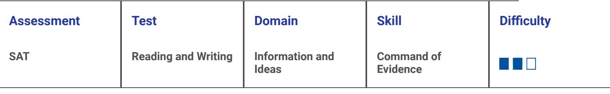

2.32

ID: b074cc05

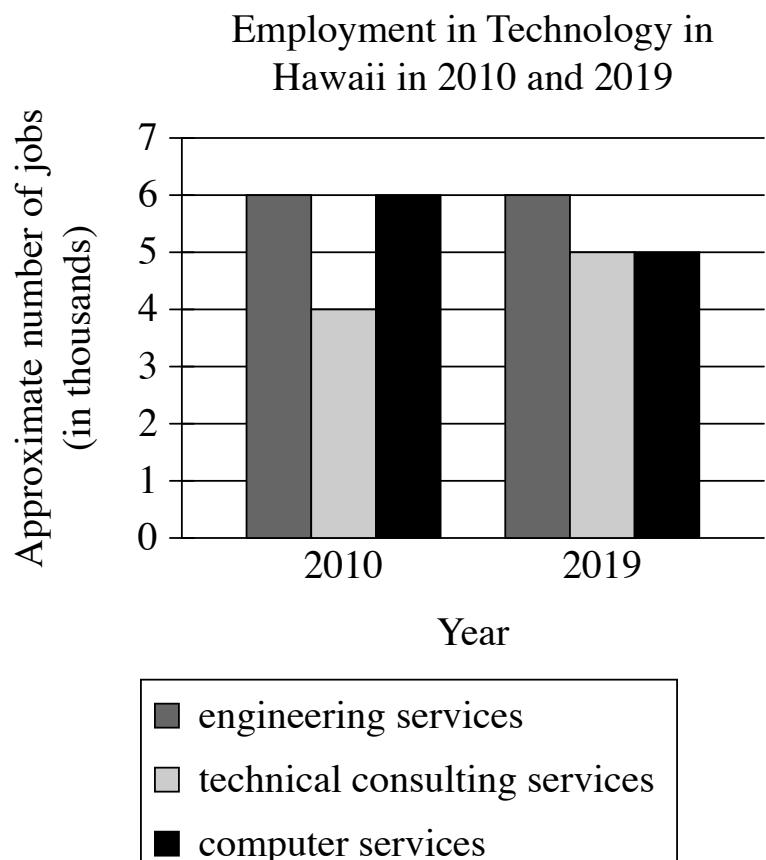

A student in Hawaii is interested in pursuing a career in technology and decides to do some research on local trends. The student notices that the number of jobs in computer services in 2010 was _

Which choice most effectively uses data from the graph to complete the statement?

higher than the number of jobs in technical consulting services, and in 2019 was about the same as the number of jobs A. in engineering services.

about the same as the number of jobs in engineering services, and in 2019 was about the same as the number of jobs in B. technical consulting services.

lower than the number of jobs in engineering services, but in 2019 was higher than the number of jobs in engineering C. services.

about the same as the number of jobs in technical consulting services, but in 2019 was lower than the number of jobs in D. technical consulting services.

## ID: b074cc05 Answer
{50}------------------------------------------------

#### Correct Answer: B

### Rationale

Choice B is the best answer because it uses data from the graph to effectively complete the statement regarding what the student notices about the number of jobs in computer services in 2010. The graph shows that in 2010, the number of computer services jobs was approximately 6,000, which is the same approximate number of jobs in engineering services. Additionally, the graph shows that in 2019, the number of jobs in technical consulting services and the number of jobs in computer services were about the same, at approximately 5,000.

Choice A is incorrect. While the graph shows that in 2010 the number of computer services jobs (about 6,000) was higher than the number of technical consulting services jobs (about 4,000), in 2019 the number of computer services jobs (about 5,000) was not about the same as the number of engineering services jobs (about 6,000). Choice C is incorrect because according to the graph, the number of jobs in computer services was lower than the number of jobs in engineering services in 2019, not 2010. Additionally, the graph shows that in 2019, the number of computer services jobs (about 5,000) was not higher than the number of jobs in engineering services (about 6,000). Choice D is incorrect because the graph shows that the number of computer services jobs was about the same as the number of technical consulting services jobs in 2019, not 2010. This also means the number of computer services jobs could not have been lower than the technical consulting services jobs in 2019 if they were about the same.

### Question Difficulty: Medium

{51}------------------------------------------------

# Question ID a9390104

| Assessment | Test                | Domain                   | Skill                  | Difficulty |
|------------|---------------------|--------------------------|------------------------|------------|
| SAT        | Reading and Writing | Information and Ideas | Command of Evidence |            |

## ID: a9390104

2.33

East Australian humpback whales migrate up to 10,000 kilometers each their breeding grounds. Researchers long believed that migrating whales live only on the extra energy they stored up during the feeding season. But marine biologist Vanessa Pirotta and her team aren't so sure. They analyzed 20 years of observations of the migrating whales made by citizen scientists (members of the public who help collect data for scientific research). The team claims that the whales may not live only on their stored energy during migration.

Which finding, if true, would most directly support the team's claim?

A. Citizen scientists have observed many different types of marine animals feeding alongside the whales.

- B. Citizen scientists have made many observations of the whales feeding as they migrate to their breeding grounds.
Citizen scientists have made more observations of the whales migrating to their breeding grounds than of the whales C. returning to their feeding grounds.

- D. Citizen scientists have recently begun to observe the whales migrating to their breeding grounds earlier in the year.
## ID: a9390104 Answer

### Correct Answer: B

### Rationale

Choice B is the best answer because it presents a finding that, if true, would most directly support Pirotta and her team's claim that East Australian humpback whales may not live only on stored energy during migration. The text explains that it has long been thought that East Australian humback whales store extra energy during the feeding season and then use that energy to survive while traveling grounds. If it were true that citizen scientists have often seen the whales feeding as they migrate to the breeding grounds, that the whales sometimes feed and take in additional energy during the journey, meaning that they may not rely only on energy they stored before migrating.

Choice A is incorrect because finding that citizen scientists have observed many different types of marine animals feeding alongside the whales would have no bearing on the team's claim; the behavior of other animals is irrelevant, and without indicating the timing of the observed feeding, the finding wouldn't reveal whether the whales rely only on previously stored energy or ever take in additional energy during migration. Choice C is incorrect because finding that citizen scientists have more often observed whales on the way to their breeding grounds than returning to their feeding grounds would have no bearing on the team's claim. Since it would provide information about the timing of observations but not about the whales' observed activities, the finding wouldn't reveal whether the whales rely only on previously stored energy or ever take in additional energy during migration. Choice D is incorrect because finding that citizen scientists have recently started seeing the whales migrate to their breeding grounds earlier in the year would have no bearing on the team's claim. Since it would provide information about a change in the timing of migration but not about the whales' observed activities while migrating, the finding wouldn't reveal whether the whales rely only on previously stored energy or ever take in additional energy during migration.

{52}------------------------------------------------

Question Difficulty: Medium

{53}------------------------------------------------

# Question ID 15873d14

## ID: 15873d14

Percentage of Maize Exported by Three Countries for Marketing Years 2009/2010-2013/2014

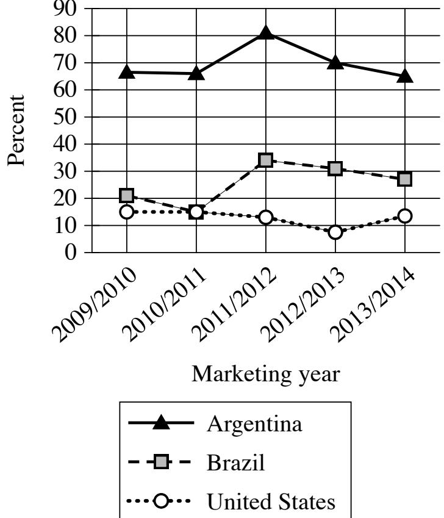

Argentina, Brazil, and the United States are among the world's leading producers of maize (corn), and each country exports a certain percentage of maize each marketing year, which runs from March to February in Argentina and Brazil and from September to August in the United States. A student is researching those percentages and finds that for the marketing year 2012/2013, the percentage of maize exported by _____

Which choice most effectively uses data from the graph to complete the text?

- A. Brazil increased from the previous marketing year but remained lower than the percentage exported by the United States.
- B. Brazil exceeded the percentage exported by Argentina for the first time.
- C. Argentina decreased from the previous marketing year but remained the highest among the three countries.
- D. the United States reached its highest point during the five marketing years.

2.34

{54}------------------------------------------------

#### Correct Answer: C

#### Rationale

Choice C is the best answer because it most effectively uses data from the graph to complete the text's discussion of the percentages of maize exported in the marketing year 2012/2013. The graph presents percentages of maize exported by Argentina, Brazil, and the United States in marketing years 2009/2014 and indicates that for the marketing year 2012/2013, the percentage of maize exported by Argentina decreased to about 70 percent in the previous marketing year. The graph also shows that the percentage of maize exported by Argentina remained highest among the three countries in the marketing year 2012/2013, surpassing the percentage exported by Brazil (about 31 percent) and by the United States (about 8 percent).

Choice A is incorrect because for the marketing year 2012/2013, the graph indicates that the percentage of maize exported by Brazil didn't increase from the previous year; rather, it decreased from about 34 percent. Moreover, the graph shows that the percentage of maize exported by Brazil remained higher, not lower, than the percentage exported by the United States in the marketing year 2012/2013. Choice B is incorrect because the graph indicates that the percentage of maize exported by Brazil never exceeded the percentage exported by Argentina for any of the marketing years represented. Choice D is incorrect because the graph indicates that the percentage of maize exported by the United States reached its lowest point, not its highest, during the five marketing years in 2012/2013, with the United States exporting only about 8 percent of its maize in that marketing year.

Question Difficulty: Medium