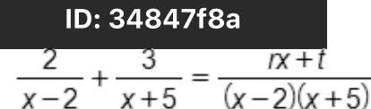

{0}------------------------------------------------

# Question ID 371cbf6b

| Assessment | Test | Domain        | Skill                     | Difficulty |
|------------|------|---------------|---------------------------|------------|
| SAT        | Math | Advanced Math | Equivalent expressions |            |
|            |      |               |                           |            |

ID: 371cbf6b (ax +3)(5x2-bx +4) = 20x3 -9x2-2x +12

3.1

The equation above is true for all x, where a and b are constants. What is the value of ab ?

A. 18 B. 20

C. 24

D. 40

### ID: 371cbf6b Answer

Correct Answer: C

Rationale

Choice C is correct. If the equation is true for all x, then the expressions on both sides of the equation will be equivalent. Multiplying the polynomials on the left-hand side of the equation gives 5ax3 - abx2 + 4ax + 15x2 - 3bx + 12 on the right-hand side of the equation, the only x -term is -9x . Since the expressions on both sides of the equation are equivalent, it follows that — dbx2 + 15x2 = — 9x2, which can be rewritten as (-ab +15)x2 = −9x2. Therefore, −ab +15 = −9, which gives ab =24.

Choice A is incorrect. If ab = 18, then the coefficient of X on the left-hand side of the equation would be – 18 + 15 = – 3, which doesn't equal the coefficient of X , – 9, on the right-hand side. Choice B is incorrect. If ab = 20, then the coefficient of X on the left-hand side of the equation would be —20 + 15 = — 5, which doesn't equal the coefficient of X, -9, on the right-hand side. Choice D is incorrect. If ab = 40, then the coefficient of X on the left-hand side of the equation would be —40 + 15 = — 25, which doesn't equal the coefficient of X2, –9, on the right-hand side.

{1}------------------------------------------------

# Question ID 40c09d66

| Assessment | Test | Domain        | Skill                     | Difficulty |
|------------|------|---------------|---------------------------|------------|
| SAT        | Math | Advanced Math | Equivalent expressions |            |

### ID: 40c09d66

$$\begin{aligned} \text{s} & \quad \frac{\sqrt{\text{x}^5}}{\sqrt[3]{\text{x}^4}} = \text{x}^{\frac{\text{g}}{\text{b}}}\\ \text{what is the value of } & \quad \frac{\text{g}}{\text{b}} \text{?} \end{aligned}$$

#### ID: 40c09d66 Answer

Rationale

7 Q The correct answer is 6 . The value of 5

equ ex]

Note that 7/6, 1.166, and 1.167 are examples of ways to enter a correct answer.

Question Difficulty: Hard

3.2

{2}------------------------------------------------

# Question ID 34847f8a

| Assessment | Test | Domain        | Skill                     | Difficulty |
|------------|------|---------------|---------------------------|------------|
| SAT        | Math | Advanced Math | Equivalent expressions |            |
|            |      |               |                           |            |

3.3

The equation above is true for all x > 2, where r and t are positive

constants. What is the value of rt ?

| A. - 20 |  |  |
|---------|--|--|
| в. 15   |  |  |
| c. 20   |  |  |
| D. 60   |  |  |
|         |  |  |

#### ID: 34847f8a Answer

Correct Answer: C

Rationale

Choice C is correct. To express the sum of the two rational expressions on the left-hand side of the equation as the single rational expression on the right-hand side of the equation, the expressions on the left-hand side 2(x +5) x +5 must have the same denominator. Multiplying the first expression by x -5 results in (x -2)(x +5), and 3(x-2) x - 2 multiplying the second expression by x -2 results in (x-2)(x+5), so the given equation can be rewritten 2(x +5) rx + t 2x + 10 3x-6 rx + t + (x -2)(x +5) (x-2)(x+5), or (x-2)(x+5) as (x-2)(x+5) (x-2)(x+5) (x-2)(x+5) . Since the two rational expressions on the left-hand side of the equation have the same denominator as the rational expression on the right-hand side of the equation, it follows that (2x +10) +(3x -6) = rx + t. Combining like terms on the left-hand side yields 5x +4 = rx + t, so it follows that r = 5 and t = 4. Therefore, the value of rt is (5)(4) = 20.

Choice A is incorrect and may result from an error when determining the sign of either r or t. Choice B is incorrect and may result from not distributing the 2 and 3 to their respective terms in

2(x +5) 3(x-2) IX + I (x-2)(x+5) (x -2)(x +5) . Choice D is incorrect and may result from a calculation error.

{3}------------------------------------------------

# Question ID 137cc6fd

| Assessment   | Test | Domain        | Skill                     | Difficulty |
|--------------|------|---------------|---------------------------|------------|
| SAT          | Math | Advanced Math | Equivalent expressions |            |
| ID: 137cc6fd |      |               |                           |            |

3.4

 - 70n \$/70n

For what value of x is the given expression equivalent to (70%) 300 , where n > 1?

#### ID: 137cc6fd Answer

Correct Answer: .0177, .0178, 4/225

Rationale

The correct answer is An expression of the form Va, where k is an integer greater than 1 and a ≥ 0, is equivalent to a #. Therefore, the given expression, where n > 1, is equivalent to (70n) \$ (70m.) . Applying properties of exponents, this expression can be rewritten as (70%) 2 (70%) 2 (70%) 3 (70%) 3 (70%) 3 , which can be rewritten as (70%) = + 3, or (70%) = . It's given that the expression √ 70% ( √70% is equivalent to (70n)30x where n > 1. It follows that (70%) is equivalent to (70%) 30%. Therefore, 유 = 30x. Dividing both sides of this equation by 30 yields to enter a correct answer.

{4}------------------------------------------------

# Question ID ea6d05bb

| Assessment | Test | Domain        | Skill                     | Difficulty |
|------------|------|---------------|---------------------------|------------|
| SAT        | Math | Advanced Math | Equivalent expressions |            |

#### ID: ea6d05bb

3.5

The expression (3x - 23)(19x + 6) is equivalent to the expression ax + bx + c, where a, b, and care constants. What is the value of b?

#### ID: ea6d05bb Answer

Correct Answer: -419

Rationale

The correct answer is -419. It's given that the expression (3x - 23)(19x + 6) is equivalent to the expression ax + + c, where a, b, and care constants. Applying the distributive property to the given expression, (3x - 23)(19x + 6), yields (3x)(19x) + (3x)(6) - (23)(6), which can be rewritten as 57x2 + 18x - 437x - 138. Combining like terms yields 57x2 - 419x - 138. Since this expression is equivalent to ax2 + bx + c, it follows that the value of b is -419.

{5}------------------------------------------------

# Question ID d8789a4c

| Assessment   | Test | Domain        | Skill                     | Difficulty |
|--------------|------|---------------|---------------------------|------------|
| SAT          | Math | Advanced Math | Equivalent expressions |            |
| ID: d8789a4c |      |               |                           |            |

3.6

x-b

In the expression above, b and c are positive integers. If the expression is equivalent to x + b and x ≠ b, which of the following could be the value of c ?

A. 4

B. 6

C. 8

D. 10

ID: d8789a4c Answer

Correct Answer: A

Rationale

x2-c
=====x+b Choice A is correct. If the given expression is equivalent to x + b, then x = b Multiplying both sides of this equation by x – b yields x – c = (x +b)(x – b). Since the right-hand side of this equation is in factored form for the difference of squares, the value of c must be a perfect square. Only choice A gives a perfect square for the value of c.

Choices B, C, and D are incorrect. None of these values of c produces a difference of squares. For example, x2-6

when 6 is substituted for c in the given expression, the result is X — b . The expression x — 0 can't be

### x2-6

factored with integer values, and therefore x - b isn't equivalent to x + b.

{6}------------------------------------------------

# Question ID 5355c0ef

| Assessment   | Test | Domain        | Skill                     | Difficulty |
|--------------|------|---------------|---------------------------|------------|
| SAT          | Math | Advanced Math | Equivalent expressions |            |
| ID: 5355c0ef |      |               |                           |            |

3.7

0.36x2 + 0.63x + 1.17

The given expression can be rewritten as a(42° + 7x + 13), where a is a constant. What is the value of a?

#### ID: 5355c0ef Answer

Correct Answer: .09, 9/100

Rationale

The correct answer is .09. It's given that the expression 0.36x2 + 0.63x + 1.17 can be rewritten as a (4x2 + 7x + 13). Applying the distributive property to the expression a (4x2 + 7x + 13) yields 4ax2 + 7ax + 13a. Therefore, 0.36x2 + 0.63x + 1.17 can be rewritten as 4ax2 + 7ax + 13a. It follows that in the expressions 0.36x2 + 0.63x + 1.17 and 4xx2 + 7ax + 13a, the coefficients of x2 are equivalent, the coefficients of x are equivalent, and the constant terms are equivalent. Therefore, 0.36 = 7a, and 1.17 = 13a. Solving any of these equations for a yields the value of a. Dividing both sides of the equation 0.36 = 4a by 4 yields 0.09 = a. Therefore, the value of a is 0.09. Note that .09 and 9/100 are examples of ways to enter a correct answer.

{7}------------------------------------------------

# Question ID c81b6c57

| Assessment | Test | Domain        | Skill                     | Difficulty |
|------------|------|---------------|---------------------------|------------|
| SAT        | Math | Advanced Math | Equivalent expressions |            |
|            |      |               |                           |            |

#### ID: c81b6c57

3.8

In the expression 3(2x2 +px +8) - 16x(p +4) , p is a constant. This expression is equivalent to the expression 6x2 — 155x +24. What is the value of p ?

A. - 3

B. 7

C. 13

D. 155

#### ID: c81b6c57 Answer

Correct Answer: B

Rationale

Choice B is correct. Using the distributive property, the first given expression can be rewritten as 6x + 3px + 24 – 16px – 64x + 24, and then rewritten as 6x + (3p – 16p – 64)x + 24. Since the expression 6x + (3p - 16p -" - 155x + 24, the coefficients of the x terms from each expression are equivalent 64)x + 24 is equivalent to 6x to each other; thus 3p – 16p – 64 = –155. Combining like terms gives –13p – 64 = –155. Adding 64 to both sides of the equation gives –13p = –71. Dividing both sides of the equation by –13 yields p = 7.

Choice A is incorrect. If p = −3, then the first expression would be equivalent to 6x - 25x + 24. Choice C is incorrect. If p = 13, then the first expression would be equivalent to 6x 155, then the first expression would be equivalent to 6x - 2,079x + 24.

{8}------------------------------------------------

### Question ID 2c88af4d

| Assessment | Test | Domain        | Skill                     | Difficulty |
|------------|------|---------------|---------------------------|------------|
| SAT        | Math | Advanced Math | Equivalent expressions |            |

#### ID: 2c88af4d

3.9

$$\frac{\text{x}^{-2}\text{y}^{\frac{1}{2}}}{\text{esisson }\text{x}^{\frac{1}{3}}\text{y}^{-1}\text{.}\text{.}\text{.}\text{.}$$

x 3 y = 1 , where x > 1 and y > 1, is The expre

equivalent to which of the following?

$$\text{A. } \sqrt[3]{x^2}$$

$$\text{B. } \frac{\sqrt[3]{x}}{\sqrt[3]{x^2}}$$

$$\text{с.} \frac{y\sqrt{y}}{x\sqrt{X}}$$

$$\text{Do: } \frac{\sqrt[N]{y}}{\sqrt{2}\sqrt[N]{x}}$$

#### ID: 2c88af4d Answer

Correct Answer: D

Rationale

y 2 us X are equivalent to 3 x and V y , respectively. Also, X 2 and Choice D is correct. For X > 1 and y > 1, 1 y - are equivalent to - 2 and y , respectively. Therefore, the given expression can be rewritten as x 2 3 x Choices A, B, and C are incorrect because these choices are not equivalent to the given expression for x > 1 and y > 1.

5 6 For example, for x = 2 and y = 2, the value of the given expression is ; the

$$\text{values of the choices, however,}$$

$$\begin{array}{rcl} \mathbf{2} & \xrightarrow{-\frac{1}{3}} & \mathbf{2} \\ \text{are} & \text{, } & \text{, and 1, respectively.} \end{array}$$

{9}------------------------------------------------

# Question ID 22fd3e1f

| Assessment                               | Test | Domain        | Skill                     | Difficulty |
|------------------------------------------|------|---------------|---------------------------|------------|
|                                          |      |               |                           |            |
| SAT                                      | Math | Advanced Math | Equivalent expressions |            |
| ID: 22fd3e1f                             |      |               |                           |            |
| f(x)=x3-9x                               |      |               |                           | 3.10       |
| g(x)=x2-2x-3                             |      |               |                           |            |
| Which of the following expressions is    |      |               |                           |            |
| f(x) equivalent to g(x) , for x > 3 ? |      |               |                           |            |
| 1                                        |      |               |                           |            |
| A. x+1                                   |      |               |                           |            |
| x +3 B. x+1                           |      |               |                           |            |
| x(x-3)                                   |      |               |                           |            |
| C. x+1                                   |      |               |                           |            |
| x(x +3)                                  |      |               |                           |            |
| D. x+1                                   |      |               |                           |            |
|                                          |      |               |                           |            |
| ID: 22fd3e1f Answer Correct Answer: D |      |               |                           |            |
| Rationale                                |      |               |                           |            |
|                                          |      |               |                           |            |

f (x) Choice D is correct. Since x3-9x =x(x +3)(x =3) and x2-2x =3 = (x + 1)(x = 3), the fraction g(x) can be x(x+3)(x-3) written as (x+1)(x –3) . It is given that x > 3, so the common factor x — 3 is not equal to 0. Therefore, the x(x +3) fraction can be further simplified to X + 1 f (x) 1 1

Choice A is incorrect. The expression x+1 is not equivalent to g(x) because at x =0, x+1 as a value of 1 f (x) and g(x) has a value of 0.

Choice B is incorrect and results from omitting the factor x in the factorization of ƒ(x). Choice C is incorrect and may result from incorrectly factoring g(x) as (x +1)(x +3) instead of (x +1)(x -3)
{10}------------------------------------------------

{11}------------------------------------------------

### Question ID a0b4103e

| Assessment                                  | Test                   | Domain        | Skill                     | Difficulty |
|---------------------------------------------|------------------------|---------------|---------------------------|------------|
| SAT                                         | Math                   | Advanced Math | Equivalent expressions |            |
| ID: a0b4103e                                |                        |               |                           | 3.11       |
| The expression  3                           | can be rewritten as  3 | where k is a  |                           |            |
| positive constant. What is the value of k ? |                        |               |                           |            |
| A. 2                                        |                        |               |                           |            |
| B. 6                                        |                        |               |                           |            |
| c. V2                                       |                        |               |                           |            |
| D. V6                                       |                        |               |                           |            |
| ID: a0b4103e Answer                         |                        |               |                           |            |
| Correct Answer: D                           |                        |               |                           |            |

Rationale

l Choice D is correct. Factoring out the coefficient 3 , the given expression can be rewritten as 3 The expression x2-6 can be approached as a difference of squares and rewritten as (x — √ б) x + √ б). Therefore, k must be √ 6

Choice A is incorrect. If k were 2, then the expression given would be rewritten as 3
1 - 1 - - 1 - - 1 - - - 4 - - - - 1 - --2)(x +2), which is equivalent to 3 3 , not

Choice B is incorrect. This may result from incorrectly factoring the expression and finding (x -6) (x +6) as l the factored form of the expression. Choice C is incorrect. This may result from incorrectly distributing the 3 and rewriting the expression as 3

{12}------------------------------------------------

## Question ID ad038c19

| Assessment | Test | Domain        | Skill                     | Difficulty |
|------------|------|---------------|---------------------------|------------|
| SAT        | Math | Advanced Math | Equivalent expressions |            |

### ID: ad038c19

3.12

| Which of the following is |
|---------------------------|
| equivalent to             |
| 2 A.                   |
|                           |

$$\sideset{_{B.}}{}{}{\mathop{a}}{}{\mathop{a}}^{2} + \frac{\nu}{4} \quad \text{.} $$

b2 ab af 2 2 C b2 G 4 D.

### ID: ad038c19 Answer

Correct Answer: D

Rationale

$$\begin{aligned} \text{Choice D is correct.} & \text{The expression } \left(a + \frac{b}{2}\right)^2 \text{ can be rewritten as } \left(a + \frac{b}{2}\right)\left(a + \frac{b}{2}\right) \text{. Using the distributive formula } \left(a + \frac{b}{2}\right)\left(a + \frac{b}{2}\right) &= \frac{ab}{2} + ab + \frac{ab}{2} + \frac{b^2}{2} \\ \text{property, the expression yields} & \left(a + \frac{b}{2}\right)\left(a + \frac{b}{2}\right) = a^2 + \frac{ab}{2} + \frac{ab}{2} + \frac{b^2}{4} \text{.Combining like terms gives} \\ &a^2 + ab + \frac{b^2}{4} \end{aligned}$$

Choices A, B, and C are incorrect and may result from errors using the distributive property on the given expression or combining like terms.

{13}------------------------------------------------

## Question ID 12e7faf8

| Assessment                                | Test     | Domain                                | Skill                     | Difficulty |
|-------------------------------------------|----------|---------------------------------------|---------------------------|------------|
|                                           |          |                                       |                           |            |
| SAT                                       | Math     | Advanced Math                         | Equivalent expressions |            |
|                                           |          |                                       |                           |            |
| ID: 12e7faf8                              |          |                                       |                           | 3.13       |
| x2+6x-7                                   | = ax + d |                                       |                           |            |
| x +7 The equation                      |          | is true for all x ≠ −7, where a and d |                           |            |
| are integers. What is the value of a +d ? |          |                                       |                           |            |
| A. -6                                     |          |                                       |                           |            |
| B. -1                                     |          |                                       |                           |            |
| c. 0                                      |          |                                       |                           |            |
| D. 1                                      |          |                                       |                           |            |
|                                           |          |                                       |                           |            |

#### ID: 12e7faf8 Answer

Correct Answer: C

Rationale

Choice C is correct. Since the expression x2+6x – 7 can be factored as (x+7)(x – 1), the given equation can (x+7)(x=1) = ax + d x +7 . Since x ≠ −7, x +7 is also not equal to 0, so both the numerator and be rewritten as (x +7)(x - 1)

 can be divided by x +7. This gives x − 1 = αχ + d. Equating the coefficient of x denominator of x +7 on each side of the equation gives n = 1. Equating the constant terms gives d = = 1. The sum is 1 +(-1) = 0.

Choice A is incorrect and may result from incorrectly simplifying the equation. Choices B and D are incorrect. They are the values of d and a, respectively, not a + d.

{14}------------------------------------------------

### Question ID 89fc23af

| Assessment | Test | Domain        | Skill                     | Difficulty |
|------------|------|---------------|---------------------------|------------|
| SAT        | Math | Advanced Math | Equivalent expressions |            |

#### ID: 89fc23af

3.14

| Which of the following expressions is |             |  |
|---------------------------------------|-------------|--|
|                                       | x2-2x-5     |  |
| equivalent to                         | x - 3       |  |
| A. X - 5 -                         | 20 x - 3 |  |

$$\frac{1}{5-\chi} - 5 - \frac{10}{\chi - 3}$$

$$\text{c.} \begin{array}{c} \text{x} + \text{1} \ - \frac{\text{8}}{\text{x} - \text{3}} \end{array}$$

$$\frac{2}{\infty} \times +1 - \frac{2}{\infty - 3}$$

#### ID: 89fc23af Answer

Correct Answer: D

Rationale

Choice D is correct. The numerator of the given expression can be rewritten in terms of the denominator, x — 3 , as follows: x2-2x-5=x2-3x+x-3-2, which is equivalent to x(x-3)+(x-3)-2. So the given 2 x x expression is equivalent to x −3 . Since the given expression is -3 x - 3 x - 3 2 defined for x ≠ 3, the expression can be rewritten as × + 1 x -3

Long division can also be used as an alternate approach. Choices A, B, and C are incorrect and may result from errors made when dividing the two polynomials or making use of structure.

{15}------------------------------------------------

## Question ID 911c415b

| Advanced Math Equivalent SAT Math expressions | Assessment | Test | Domain | Skill | Difficulty |
|-----------------------------------------------------------|------------|------|--------|-------|------------|
|                                                           |            |      |        |       |            |

ID: 911c415b

(7532 + 100y2) + 10(10y2 - 110)

3.15

The expression above can be written in the form ay 2 + b , where a and b are constants. What is the value of a + b ?

#### ID: 911c415b Answer

Rationale

The correct answer is 6632. Applying the distributive property to the expression yields (7532 + 100y2) + (100y2 - 1100). Then adding together 7532 + 100y2 and 100y2 - 1100 and collecting like terms results in 200y2+6432. This is written in the form ay2+b, where a =200 and b =6432. Therefore a+b=200+6432=6632

{16}------------------------------------------------

### Question ID f89e1d6f

| Assessment | Test | Domain        | Skill                     | Difficulty |
|------------|------|---------------|---------------------------|------------|
| SAT        | Math | Advanced Math | Equivalent expressions |            |

#### ID: f89e1d6f

3.16

If α = c + d, which of the following is equivalent to the expression x2 - c2 - 2cd - d2 ? B. (x -C. (x + a)(x - a) D. x2 - ax - a2

#### ID: f89e1d6f Answer

Correct Answer: C

Rationale

Choice C is correct. Factoring -1 from the second, third, and fourth terms gives x + 2cd + d is the expanded form Therefore, x = = (c + 2cd + d = x = = (c + d) = . Since a
a = is the difference of squares, it can be expanded as x Finally, because x (x + a)(x - a)

Choices A and B are incorrect and may be the result of making an error in factoring the difference of squares x Choice D is incorrect and may be the result of incorrectly combining terms.

{17}------------------------------------------------

### Question ID e117d3b8

| Assessment | Test | Domain        | Skill                     | Difficulty |
|------------|------|---------------|---------------------------|------------|
| SAT        | Math | Advanced Math | Equivalent expressions |            |

#### ID: e117d3b8

3.17

If a and c are positive numbers, which of the following is equivalent to V (a+c)3 . √α+C ?

A. a+c

B. a2 + c2

$$\text{c. } a^2 + 2ac + c^2$$

$$\text{Ọ.}\,a^2c^2$$

#### ID: e117d3b8 Answer

Correct Answer: C

Rationale

Choice C is correct. Using the property that v X √ J = - X y for positive numbers x and y, with x = ( + + ) 3
= a + c, it follows that √ (d +c)³ · J a + = = √ (a+ + ((a+ + (

Choice A is incorrect and may be the result of V (a +c) - + ((a+c) choice B is incorrect and may be the 
result of incorrectly rewriting (a + c) applying properties of exponents.

{18}------------------------------------------------

# Question ID c6e85cd7

| Assessment | Test | Domain        | Skill                     | Difficulty |
|------------|------|---------------|---------------------------|------------|
| SAT        | Math | Advanced Math | Equivalent expressions |            |
|            |      |               |                           |            |

#### ID: c6e85cd7

3.18

If 48c = 347, what is the value of c?

#### ID: c6e85cd7 Answer

Correct Answer: .2916, .2917, 7/24

#### Rationale

 The correct answer is } , An expression of the form ; @™ , where m and n are integers greater than 1 and a ≥ 0, is equivalent to α "" . Therefore, the expression on the right-hand side of the given equation, { } } , is equivalent to 43. Thus, 4 ° = 43. It follows that 8c = ? . Dividing both sides of this equation by 8 yields c = 2. Note that 7/24, 2916, 2917, 0.219, and 0.292 are examples of ways to enter a correct answer.