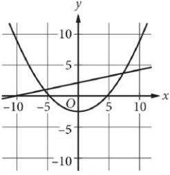
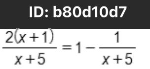

{0}------------------------------------------------

# Question ID a5663025

| Assessment | Test | Domain        | Skill                                                                                     | Difficulty |
|------------|------|---------------|-------------------------------------------------------------------------------------------|------------|
| SAT        | Math | Advanced Math | Nonlinear equations in one variable and systems of equations in two variables |            |

### ID: a5663025

A system of equations consists of a quadratic equation and a linear equation. The equations in this system are graphed in the xy-plane above. How many solutions does this system have?

- A. O
- B. 1
- C. 2
- D. 3

#### ID: a5663025 Answer

Correct Answer: C

Rationale

Choice C is correct. The solutions to a system of two equations correspond to points where the graphs of the equations intersect. The given graphs intersect at 2 points; therefore, the system has 2 solutions.

Choice A is incorrect because the graphs intersect. Choice B is incorrect because the graphs intersect more than once. Choice D is incorrect. It's not possible for the graph of a quadratic equation and the graph of a linear equation to intersect more than twice.

Question Difficulty: Medium

{1}------------------------------------------------

## Question ID d0a7871e

| Assessment | Test | Domain        | Skill                                                                                     | Difficulty |
|------------|------|---------------|-------------------------------------------------------------------------------------------|------------|
| SAT        | Math | Advanced Math | Nonlinear equations in one variable and systems of equations in two variables |            |

ID: d0a7871e y =x+1 y = x2 + x

2.2

If (x ,y) is a solution to the system of equations above, which of the

following could be the value of x ?

A. -1

B. 0

- C. 2
- D. 3

ID: d0a7871e Answer

Correct Answer: A

Rationale

Choice A is correct. It is given that y = x + 1 and y = x + x. Setting the values for y equal to each other yields x + 1 = x + x. Subtracting x from each side of this equation yields x = 1. Therefore, x can equal 1 or −1. Of these, only −1 is given as a choice.

Choice B is incorrect. If x = 0, then x + 1 = 1, but > x = 0 = 0 = 0 = 0 = 0 = 0 = 0 = 0 = 0 = 0 = 1 = 0 = 0 = 1 = 1 = 0 = 1 = 1 = 0 = 1 = 4 = 1 = = 1 = = 12 + 4.

{2}------------------------------------------------

## Question ID 7f81d0c3

| Assessment | Test | Domain        | Skill                                                                                     | Difficulty |
|------------|------|---------------|-------------------------------------------------------------------------------------------|------------|
| SAT        | Math | Advanced Math | Nonlinear equations in one variable and systems of equations in two variables |            |

$$\frac{\text{ID: } \mathsf{NFG1el0c3}}{-\times -\uparrow = 0}$$

$$\mathsf{What \text{\textquotedblleft}values\textquotedblright{}}\mathsf{the}\mathsf{equation\textquotedblright{}}\mathsf{the}$$

A. x = 1 and x = 2

x

$$\begin{aligned} \text{B. } \chi &= -\frac{1}{2} \text{ and } \chi = \frac{3}{2} \\\\ \text{C. } \chi &= \frac{1 + \sqrt{5}}{2} \text{ and } \chi = \frac{1 - \sqrt{5}}{2} \\\\ \chi &= \frac{-1 + \sqrt{5}}{2} \text{ and } \chi = \frac{-1 - \sqrt{5}}{2} \end{aligned}$$

#### ID: 7f81d0c3 Answer

Correct Answer: C

Rationale

Choice C is correct. Using the quadratic formula to solve the given expression yields

$$\chi = \frac{-(-1) \pm \sqrt{(-1)^2 - (4)(1)(-1)}}{(2)(1)} = \frac{1 \pm \sqrt{5}}{2} \quad \text{Therefore,} \quad \chi = \frac{1 + \sqrt{5}}{2} \quad \text{and} \quad \chi = \frac{1 - \sqrt{5}}{2} \quad \text{satisfy the given } \chi$$

equation.

Choices A and B are incorrect and may result from incorrectly factoring or incorrectly applying the quadratic formula. Choice D is incorrect and may result from a sign error.

Question Difficulty: Medium

{3}------------------------------------------------

## Question ID 911383f2

| Assessment | Test | Domain        | Skill                                                                                     | Difficulty |
|------------|------|---------------|-------------------------------------------------------------------------------------------|------------|
| SAT        | Math | Advanced Math | Nonlinear equations in one variable and systems of equations in two variables |            |

ID: 911383f2 (x-4)(x+2)(x-1)=0

2.4

What is the product of the solutions to the given equation?

A. 8 B. 3

c. -3

D. - 8

### ID: 911383f2 Answer

Correct Answer: D

Rationale

Choice D is correct. By the zero-product property, if (x −4)(x − 1) = 0, then x −4 = 0, x +2 = 0, or x −1 = 0. Solving each of these equations for χ yields χ = 4, x = − 2, οτ κ = 1. The product of these solutions is (4)(-2)(1) = - 8.

Choice A is incorrect and may result from sign errors made when solving the given equation. Choice B is incorrect and may result from finding the sum, not the product, of the solutions. Choice C is incorrect and may result from finding the sum, not the product, of the solutions in addition to making sign errors when solving the given equation.

{4}------------------------------------------------

# Question ID b80d10d7

| Assessment | Test | Domain        | Skill                                                                                     | Difficulty |
|------------|------|---------------|-------------------------------------------------------------------------------------------|------------|
| SAT        | Math | Advanced Math | Nonlinear equations in one variable and systems of equations in two variables |            |

2.5

What is the solution to the equation above?

A. O

B. 2

C. 3

D. 5

### ID: b80d10d7 Answer

Correct Answer: B

Rationale

x +5

Choice B is correct. Since x + 5 is equivalent to 1, the right-hand side of the given equation can be rewritten x +5 2(x+1) x + 4 1 x +4 x +5 , or x +5 . Since the left- and right-hand sides of the equation x +5 have the x +5 as x +5 same denominator, it follows that 2(x + 1) = x +4. Applying the distributive property of multiplication to the expression 2(x +1) yields 2(x) +2(1), or 2x + 2. Therefore, 2x +2 = x + 4. Subtracting x and 2 from both sides of this equation yields X = 2.

$$\text{Choices A, C, and D are incorrect. If } \mathbf{x} = \mathbf{0} \text{, then } \frac{\mathbf{2(0+1)}}{\mathbf{0+5}} = \mathbf{1} - \frac{\mathbf{1}}{\mathbf{0} + \mathbf{5}}. \text{ This can be rewritten as } \frac{\mathbf{2}}{\mathbf{5}} = \frac{\mathbf{4}}{\mathbf{5}} \text{, which is a false statement. Therefore, } \mathbf{0} \text{ is not } \frac{\mathbf{1}}{\mathbf{1}} \text{, which is a false statement.}$$
   
 
$$\text{This is a false statement. Therefore, } 0 \text{ isn't a solution to the given equation. Substituting 3 and 5 into the given equation yields similarly false statements.  
$$

{5}------------------------------------------------

# Question ID fcdf87b7

| SAT Advanced Math Nonlinear equations Math in one variable and systems of | Assessment | Test | Domain | Skill            | Difficulty |
|------------------------------------------------------------------------------------------|------------|------|--------|------------------|------------|
| variables                                                                                |            |      |        | equations in two |            |

ID: fcdf87b7 y = x - - 4x + 4 y = 4 - x

2.6

If the ordered pair (x, y) satisfies the system of equations above,

what is one possible value of x ?

### ID: fcdf87b7 Answer

#### Rationale

The correct answer is either 0 or 3. For an ordered pair to satisfy a system of equations, both the x- and yvalues of the ordered pair must satisfy each equation in the system. Both expressions on the right-hand side of the given equations are equal to y, therefore it follows that both expressions on the right-hand side of the equations are equal to each other: x2-4x +4 = 4-x. This equation can be rewritten as x2 — 3x =0, and then through factoring, the equation becomes X(x −3) = 0. Because the product of the two factors is equal to 0, it can be concluded that either x = 0 or x = 3 = 0, or rather, x = 0 or x = 3. Note that 0 and 3 are examples of ways to enter a correct answer.

{6}------------------------------------------------

# Question ID 652054da

| Assessment | Test | Domain        | Skill                                                                                     | Difficulty |
|------------|------|---------------|-------------------------------------------------------------------------------------------|------------|
| SAT        | Math | Advanced Math | Nonlinear equations in one variable and systems of equations in two variables |            |

#### ID: 652054da

An oceanographer uses the equation \$ = 2 to model the speed s, in knots, of an ocean wave, where p represents the period of the wave, in

seconds. Which of the following represents the period of the wave in terms of the speed of the wave?

$$\text{A. } D = \frac{2}{3}\text{s}$$

$$\text{B. } D = \frac{3}{2}\text{s}$$

$$\text{C. } D = \frac{2}{3}\text{ + s}$$

$$\text{D. } D = \frac{3}{2}\text{ + s}$$

ID: 652054da Answer

Correct Answer: A

Rationale

Choice A is correct. It's given that p represents the period of the ocean wave, so the equation can be solved for p to represent the period of the wave in terms of the wave. Multiplying both sides of the 3 s = p equation by the reciprocal of 2 will isolate p. This yields 3 3 which simplifies to 3 Therefore,

Choices B, C, and D are incorrect and may result from errors made when rearranging the equation to solve for p.

Question Difficulty: Medium

{7}------------------------------------------------

## Question ID 6e02cd78

| Assessment | Test | Domain        | Skill                                                                                     | Difficulty |
|------------|------|---------------|-------------------------------------------------------------------------------------------|------------|
| SAT        | Math | Advanced Math | Nonlinear equations in one variable and systems of equations in two variables |            |

#### ID: 6e02cd78

2.8

In the xy-plane, what is the y-coordinate of the point of intersection of the graphs of y = (x - 1)2 and y = 2x - 3 ?

#### ID: 6e02cd78 Answer

Rationale

The correct answer is 1. The point of intersection of the given equations is the solution to the system of the two equations. Since V = (x = 1) = and y = 2x = 3, it follows that (x = 1) = 2x = 3, or (x – 1)(x – 1) = 2x – 3. Applying the distributive property to the left-hand side of this equation yields x - 2x +1 = 2x - 3. Subtracting 2x from and adding 3 to both sides of this equation yields x - 4x + 4 = 0 Factoring the left-hand side of this equation yields (x—2)= 0. By the zero product property, if (x −2)(x −2) = 0, it follows that x −2 = 0. Adding 2 to both sides of x −2 = 0 yields x = 2. Substituting 2 for x in either of the given equations yields y = 1. For example, substituting 2 for x in the second given equation yields y = 2(2) = 3, or y = 1. Therefore, the point of intersection of the graphs of the given equations is (2, 1). The y-coordinate of this point is 1.

{8}------------------------------------------------

## Question ID 802549ac

| Assessment | Test | Domain        | Skill                                                                                     | Difficulty |
|------------|------|---------------|-------------------------------------------------------------------------------------------|------------|
| SAT        | Math | Advanced Math | Nonlinear equations in one variable and systems of equations in two variables |            |

ID: 802549ac (x +2)(x +3) = (x −2)(x − 3) + 10

Which of the following is a solution to the given equation?

A. 1 B. 0 c. -2 D. - 5

#### ID: 802549ac Answer

Correct Answer: A

Rationale

Choice A is correct. Applying the distributive property on the left- and right-hand sides of the given equation yields x2 +2x +3x +6 = x2 + 3x +6 + 10, or x2 + 5x +6 = x2 = 5x + 16. Subtracting ~ from and adding 5x to both sides of this equation yields 10x +6 = 16. Subtracting 6 from both sides of this equation and then dividing both sides by 10 yields X = 1.

Choices B, C, and D are incorrect. Substituting 0, — 2, or — 5 for x in the given equation will result in a false statement. If x = 0, the given equation becomes 6 = 16; if x = = 2, the given equation becomes 0 = 30; and if x = = 5, the given equation becomes 6 = 66. Therefore, the values 0, —2, and —5 aren't solutions to the given equation.

Question Difficulty: Medium
{9}------------------------------------------------

# Question ID a4f61d75

| SAT Math | Advanced Math | Nonlinear equations in one variable and systems of equations in two variables |  |
|-------------|---------------|-------------------------------------------------------------------------------------------|--|

ID: a4f61d75 x2 - ax + 12 = 0

2.10

In the equation above, a is a constant and a > (). If the equation has two integer solutions, what is a possible value of a ?

#### ID: a4f61d75 Answer

Rationale

The correct answer is either 7, 8, or 13. Since the given equation has two integer solutions, the expression on the left-hand side of this equation can be factored as (x + c)(x + d), where c and d are also integers. The

product of c and d must equal the constant term of the original quadratic expression, which is 12. Additionally, the sum of c and d must be a negative number since it's given that @ > (), but the sign preceding a in the given equation is negative. The possible pairs of values for c and d that satisfy both of these conditions are —4 and — 3, —6 and — 2, and — 1. Since the value of _ a is the sum of c and d, the possible values of _ a re –4 +(−3) = −7, −6 + (−2) = −8, and −12 + (−1) = −13. It follows that the possible values of a are 7, 8, and 13. Note that 7, 8, and 13 are examples of ways to enter a correct answer.

{10}------------------------------------------------

## Question ID 630897df

| Assessment | Test | Domain        | Skill                                                                                     | Difficulty |
|------------|------|---------------|-------------------------------------------------------------------------------------------|------------|
| SAT        | Math | Advanced Math | Nonlinear equations in one variable and systems of equations in two variables |            |

ID: 630897df

2.11

The speed of sound in dry air, v, can be modeled by the formula

v = 331.3 + 0.606T, where T is the temperature in degrees Celsius and v is

measured in meters per second. Which of the following correctly expresses T in terms of v ?

$$
\tau = \frac{\nu + 0.606}{331.3}
$$

$$
\text{B. } \tau = \frac{\nu - 0.606}{331.3}
$$

$$
\text{C. } \tau = \frac{\nu + 331.3}{0.606}
$$

$$
\text{y} = 231.3
$$

$$\frac{c \cdot cc - \sqrt{c^2 - \sqrt{\dotsb}}}{509.0} = \tau \quad \text{or} \quad \frac{\tau}{\sqrt{\dotsb}}$$

#### ID: 630897df Answer

Correct Answer: D

Rationale

Choice D is correct. To express T in terms of v, subtract 331.3 from both sides of the equation, which gives v – v-331.3 331.3 = 0.606T. Dividing both sides of the equation by 0.606 gives 0.606

Choices A, B, and C are incorrect and are the result of incorrect steps while solving for T.

{11}------------------------------------------------

### Question ID c77ef2fb

| Assessment | Test | Domain        | Skill                                                                                     | Difficulty |
|------------|------|---------------|-------------------------------------------------------------------------------------------|------------|
| SAT        | Math | Advanced Math | Nonlinear equations in one variable and systems of equations in two variables |            |

ID: c77ef2fb

2.12

Blood volume, Vg, in a human can be determined using the equation

V g = 1 -H , where Vp is the plasma volume and H is the hematocrit (the

fraction of blood volume that is red blood cells). Which of the following correctly expresses the hematocrit in terms of the blood volume and the plasma volume?

H = 1 A.

$$\prescript{}{\mathsf{B}}{}{\mathsf{H}} = \frac{\mathsf{V}_{\mathsf{B}}}{\mathsf{V}_{\mathsf{P}}}$$

$$\text{C.}\,\,\,\,\text{H}=\uparrow+\frac{V_B}{V_P}$$

D. H = V в – V р

#### ID: c77ef2fb Answer

Correct Answer: A

Rationale

Choice A is correct. The hematocrit can be expressed in terms of the blood volume and the plasma volume by VP V B = solving the given equation 1 - H for H. Multiplying both sides of this equation by (1 - H) yields VP Vg(1 – H) = Vp. Dividing both sides by Vg yields 1 – H = - - Vg. Subtracting 1 from both sides yields VP -H = Vg . Dividing both sides by -1 yields V в

Choices B, C, and D are incorrect and may result from errors made when manipulating the equation. Question Difficulty: Medium

{12}------------------------------------------------

## Question ID 364a2d25

| Assessment | Test | Domain        | Skill                                                                                     | Difficulty |
|------------|------|---------------|-------------------------------------------------------------------------------------------|------------|
| SAT        | Math | Advanced Math | Nonlinear equations in one variable and systems of equations in two variables |            |

ID: 364a2d25 x+y=11 xy =72

2.13

If one solution to the system of equations above is (X,y), what is one possible value of x ?

#### ID: 364a2d25 Answer

#### Rationale

The correct answer is either 8 or 9. The first equation can be rewritten as y = 17 - x. Substituting 17 - x for y in the second equation gives x(17 – x) = 72. By applying the distributive property, this can be rewritten as 17x - x2 = 72. Subtracting 72 from both sides of the equation yields x - 17x +72 = 0. Factoring the left-hand side of this equation yields (x – 8)(x – 9) = 0. Applying the Zero Product Property, it follows that x – 8 = 0 and x =9 = 0. Solving each equation for x yields x = 8 and x = 9 respectively. Note that 8 and 9 are examples of ways to enter a correct answer.

{13}------------------------------------------------

## Question ID 0980fcdd

| Assessment | Test | Domain        | Skill                                                                                     | Difficulty |
|------------|------|---------------|-------------------------------------------------------------------------------------------|------------|
| SAT        | Math | Advanced Math | Nonlinear equations in one variable and systems of equations in two variables |            |

ID: 0980fcdd

$$\begin{aligned} \chi^{\omega} &= 6\chi + \chi \\ \chi &= -6\chi + 36 \end{aligned}$$

2.14

A solution to the given system of equations is (x,y). Which of the

following is a possible value of xy ?

A. O

B. 6

- C. 12
D. 36

### ID: 0980fcdd Answer

Correct Answer: A

Rationale

Choice A is correct. Solutions to the qiven system of equations are ordered pairs (x y) that satisfy both equations in the system. Adding the left-hand and right-hand sides of the equations in the system yields x2 +y = 6x + −6x + y + 36, or x2 +y = y + 36. Subtracting y from both sides of this equation yields × = 36. Taking the square root of both sides of this equation yields x = 6 and x = − 6. Therefore, there are two solutions to this system of equations, one with an x-coordinate of 6 and the other with an x-coordinate of – 6. Substituting 6 for x in the second equation yields y = - 6(6) + 36, or y = 0; therefore, one solution is (6,0). Similarly, substituting -6 for x in the second equation yields y = -6(-6) +36, or y = 72; therefore, the other solution is (−6,72). It follows then that if (x,y) is a solution to the system, then possible values of xy are (6)(0) = 0 and (−6)(72) = −432. Only 0 is among the given choices.

Choice B is incorrect. This is the x-coordinate of one of the solutions, (6,0). Choice C is incorrect and may result from conceptual or computational errors. Choice D is incorrect. This is the square of the x-coordinate of one of the solutions, (6,0).

{14}------------------------------------------------

# Question ID 87a3de81

| Assessment | Test | Domain        | Skill                                                                                     | Difficulty |
|------------|------|---------------|-------------------------------------------------------------------------------------------|------------|
| SAT        | Math | Advanced Math | Nonlinear equations in one variable and systems of equations in two variables |            |

$$\textbf{ID: 87a 8d əsələ}$$

$$\chi^{\omega} + \chi - \mathfrak{t}\mathfrak{L} = 0$$

2.15

If a is a solution of the equation above and α > 0 , what is the value of a ?

#### ID: 87a3de81 Answer

Rationale

The correct answer is 3. The solution to the given equation can be found by factoring the quadratic expression. The factors can be determined by finding two numbers with a sum of 1 and a product of – 12. The two numbers that meet these constraints are 4 and = 3. Therefore, the given equation can be rewritten as (x +4)(x −3) = 0 It follows that the solutions to the equation are x = −4 or x = 3. Since it is given that & > 0, a must equal 3.

{15}------------------------------------------------

## Question ID 2683b5db

| Assessment | Test | Domain        | Skill                                                                                     | Difficulty |
|------------|------|---------------|-------------------------------------------------------------------------------------------|------------|
| SAT        | Math | Advanced Math | Nonlinear equations in one variable and systems of equations in two variables |            |

|  |  | ID: 2683b5db    |  |
|--|--|-----------------|--|
|  |  | =0.01(P-40.000) |  |

2.16

In a city, the property tax T, in dollars, is calculated using the formula above, where P is the value of the property, in dollars. Which of the following expresses the value of the property in terms of the property tax?

A. P = 1007-400

T

B. P = 100T + 400

C. P = 100T-40,000

D. P = 100T + 40,000

### ID: 2683b5db Answer

Correct Answer: D

Rationale

Choice D is correct. To express the value of the property in terms of the given equation must be solved for P. Multiplying both sides of the equation by 100 gives 1007 = P = 40,000. Adding 40,000 to both sides of the equation gives 100T +40,000 = P. Therefore, P = 1007 + 40,000.

Choice A is incorrect and may result from multiplying 40,000 by 0.01, then subtracting 400 from, instead of adding 400 to, the left-hand side of the equation. Choice B is incorrect and may result from multiplying 40,000 by 0.01. Choice C is incorrect and may result from subtracting instead of adding 40,000 from the left-hand side of the equation.

{16}------------------------------------------------

### Question ID 2f958af9

| Assessment | Test | Domain        | Skill                                                                                     | Difficulty |
|------------|------|---------------|-------------------------------------------------------------------------------------------|------------|
| SAT        | Math | Advanced Math | Nonlinear equations in one variable and systems of equations in two variables |            |

ID: 2f958af9

$$V^2 = \frac{L\overline{I}}{m}$$

The formula above expresses the square of the speed v of a wave moving along a string in terms of tension T, mass m, and length L of the string. What is T in terms of m, v, and L ?

$$
\tau = \frac{m\nu^2}{L}
$$

$$
\text{B. } \tau = \frac{m}{\nu^2 L}
$$

$$
\text{C. } \tau = \frac{mL}{\nu^2}
$$

$$
\text{D. } \tau = \frac{L}{m\nu^2}
$$

#### ID: 2f958af9 Answer

Correct Answer: A

Rationale

Choice A is correct. To write the formula as T in terms of m, v, and L means to isolate T on one side of the mL I mv2 = 2 m , which simplifies to mv equation. First, multiply both sides of the equation by m, which gives LT mv2 mvk L L , which simplifies to LT. Next, divide both sides of the equation by L, which gives

Choices B, C, and D are incorrect and may be the result of incorrectly applying operations to each side of the equation.

Question Difficulty: Medium

2.17

{17}------------------------------------------------

## Question ID 876a731c

| Assessment | Test | Domain        | Skill                                                                                     | Difficulty |
|------------|------|---------------|-------------------------------------------------------------------------------------------|------------|
| SAT        | Math | Advanced Math | Nonlinear equations in one variable and systems of equations in two variables |            |

| ID: 876a731c |  |
|--------------|--|
| y = x2       |  |
| 2y+6=2(x+3)  |  |

2.18

If (x, y) is a solution of the system of equations above and x > 0, what is the value of xy ?

A. 1

B. 2

- C. 3
- D. 9

ID: 876a731c Answer

Correct Answer: A

Rationale

Choice A is correct. Substituting × for y in the second equation gives 2(x2) +6 =2(x +3). This equation can be solved as follows:

| 2x2+6=2x+6 | Apply the distributive property.                                           |  |  |
|------------|----------------------------------------------------------------------------|--|--|
|            | 2x2 +6 = 2x = 6 = 0   Subtract 2x and 6 from both sides of the equation. I |  |  |
| 2x2-2x=0   | Combine like terms.                                                        |  |  |
| 2x(x-1)=0  | Factor both terms on the left side of the equation by 2x.               |  |  |

Thus, X = O and x = 1 are the solutions to the system. Since X > 0, only X = 1 needs to be considered. The value of y when x = 1 is y = x 2 = 1 . Therefore, the value of xy is (1)(1) = 1

Choices B, C, and D are incorrect and likely result from a computational or conceptual error when solving this system of equations.
{18}------------------------------------------------

{19}------------------------------------------------

## Question ID 928498f3

| Assessment | Test | Domain        | Skill                                                                                     | Difficulty |
|------------|------|---------------|-------------------------------------------------------------------------------------------|------------|
| SAT        | Math | Advanced Math | Nonlinear equations in one variable and systems of equations in two variables |            |

$$\frac{\text{lb} \cdot \text{92548556}}{6x^2 + 5x - 7 = 0}$$

2.19

$$\mathsf{What are the solutions to the}\\
\mathsf{giv\eun\ equation?}$$

$$\begin{array}{c} \frac{-5 \pm \sqrt{25 + 168}}{12} \\\\ \frac{-6 \pm \sqrt{25 + 168}}{12} \\\\ \cfrac{-5 \pm \sqrt{36 - 168}}{12} \\\\ \frac{-6 \pm \sqrt{36 - 168}}{12} \end{array}$$

#### ID: 928498f3 Answer

Correct Answer: A

Rationale

$$\chi = \frac{-b \pm \sqrt{b^2 - 4ac}}{2a}$$

Choice A is correct. The quadratic formula,

$$\text{I, can be used to find the solutions to an}$$

equation in the form ax 2 + bx + c = 0 . n the given equation, q = 6, b = 5, and c = = 7. Substituting these

$$\left(\frac{-5\pm\sqrt{5^2-4(6)(-7)}}{2(6)}\right)_{\text{or}} \frac{-5\pm\sqrt{25+168}}{12}$$

values into the quadratic formula gives

$$\frac{-a \pm \sqrt{b^2 - 4ac}}{2a}$$

Choice B is incorrect and may result from using

$$\left[\frac{-b \pm \sqrt{a^2 + 4ac}}{2a}\right]$$

incorrect and may result from using

as the quadratic formula. Choice D is incorrect and may

as the quadratic formula. Choice C is

{20}------------------------------------------------

$$\frac{-a \pm \sqrt{a^2 + 4ac}}{2a}$$

result from using

as the quadratic formula.

{21}------------------------------------------------

## Question ID 2d2ab76b

| Assessment | Test | Domain        | Skill                                                                                     | Difficulty |
|------------|------|---------------|-------------------------------------------------------------------------------------------|------------|
| SAT        | Math | Advanced Math | Nonlinear equations in one variable and systems of equations in two variables |            |

$$\begin{array}{c} \text{lD:} \ 2 \text{k} 2 \text{ab} \text{b} \text{76b} \\ \hline y = \text{x}^2 - 1 \\ y = 3 \end{array} \tag{2.20}$$

When the equations above are graphed in the xy-plane, what are the coordinates (x, y) of the points of intersection of the two graphs?

A. (2,3) and (-2,3) B. (2,4) and (-2,4) c. (3.8) and (-3,8) D. (72,3) and (-√2,3)

### ID: 2d2ab76b Answer

Correct Answer: A

### Rationale

Choice A is correct. The two equations form a system of equations to the system correspond to the points of intersection of the graphs. The system can be fgund by substitution. Since the second equation gives y = 3, substituting 3 for y in the first equation gives 3 = x = 1. Adding 1 to both sides of the equation gives 4 = x = Solving by taking the square root of both sides of the equation gives x = ±2. Since y = 3 for all values of x for the second equation, the solutions are (2, 3) and (−2, 3). Therefore, the points of intersection of the two graphs are (2, 3) and (-2, 3).

Choices B, C, and D are incorrect and may be the result of calculation errors.

{22}------------------------------------------------

## Question ID 3b4b8831

| Assessment | Test | Domain        | Skill                                                                                     | Difficulty |
|------------|------|---------------|-------------------------------------------------------------------------------------------|------------|
| SAT        | Math | Advanced Math | Nonlinear equations in one variable and systems of equations in two variables |            |

ID: 3b4b8831

2.21

38x2 = 38(9)

What is the negative solution to the given equation?

### ID: 3b4b8831 Answer

Correct Answer: -3

Rationale

The correct answer is -3. Dividing both sides of the given equation by 38 yields x2 = 9. Taking the square root of both sides of this equation yields the solutions x = 3 and x = = 3. Therefore, the negative solution to the given equation is -3.

{23}------------------------------------------------

## Question ID f5247e52

| Assessment | Test | Domain        | Skill                                                                                     | Difficulty |
|------------|------|---------------|-------------------------------------------------------------------------------------------|------------|
| SAT        | Math | Advanced Math | Nonlinear equations in one variable and systems of equations in two variables |            |

| ID: f5247e52 |  |
|--------------|--|
| y = ax2 - c  |  |

2.22

In the equation above, a and c are positive constants. How many times does the graph of the equation above intersect the graph of the equation y = α+c in the xy-plane?

A. Zero

B. One

- C. Two
- D. More than two

#### ID: f5247e52 Answer

Correct Answer: C

Rationale

Choice C is correct. It is given that the constants a and c are both positive; therefore, the given quadratic equation is a parabola that opens up with a vertex on the y-axis at a point below the x-axis. The graph of the second equation provided is a horizontal line that lies above the x-axis. A horizontal line above the x-axis will intersect a parabola that opens up and has a vertex below the x-axis in exactly two points.

Choices A, B, and D are incorrect and are the result of not understanding the relationships of the two equations given. Choice A is incorrect because the two graphs intersect. Choice B is incorrect because in order for there to be only one intersection point, the horizontal line would have to intersect the parabola at the vertex, but the vertex is below the x-axis and the line is above the x-axis. Choice D is incorrect because a line cannot intersect a parabola in more than two points.

{24}------------------------------------------------

# Question ID f76c1858

| Assessment | Test | Domain        | Skill                                                                                     | Difficulty |
|------------|------|---------------|-------------------------------------------------------------------------------------------|------------|
| SAT        | Math | Advanced Math | Nonlinear equations in one variable and systems of equations in two variables |            |

### ID: f76c1858

2.23

7x2 - 20x - 32 = 0 What is the positive solution to the given equation?

#### ID: f76c1858 Answer

#### Correct Answer: 4

#### Rationale

The correct answer is 4. The left-hand side of the given equation can be factored as 7x + 8x - 4. Therefore, the given equation, 7x2 - 20x - 32 = 0, can be written as 7x + 8x - 4 = 0. Applying the zero product property to this equation yields 7x + 8 = 0 and x - 4 = 0. Subtracting 8 from both sides of the equation 7x = - 8. Dividing both sides of this equation by 7 yields x = - - - - - Adding 4 to both sides of the equation x - 4 = 0 yields x = 4. Therefore, the two solutions to the given equation, 7x2 - 20x - 32 = 0, are -- and 4. It follows that 4 is the positive solution to the given equation.

{25}------------------------------------------------

## Question ID 4e18fc5d

| Assessment | Test | Domain        | Skill                                                                                     | Difficulty |
|------------|------|---------------|-------------------------------------------------------------------------------------------|------------|
| SAT        | Math | Advanced Math | Nonlinear equations in one variable and systems of equations in two variables |            |

### ID: 4e18fc5d

2.24

## 150x

The given equation relates the distinct positive numbers ഗ, w, and x. Which equation correctly expresses w in terms of v and IC ?

- A. w = 150vx

$$_{\mathbf{B}.}w = -\frac{150x}{\mathbf{\bullet}}$$

- C. w =
- D. w = v + 150x

### ID: 4e18fc5d Answer

Correct Answer: A

#### Rationale

Choice A is correct. It's given that x is positive. Therefore, multiplying each side of the given equation by -150x yields -150xv = w, which is equivalent to w = -150vx. Thus, the equation w = -150vx correctly expresses w in terms of v and x.

Choice B is incorrect. This equation is equivalent to v = -----------------------------------------------------------------------------------------------------------------x 150w 150

Choice D is incorrect. This equation is equivalent to v = w - 150x.