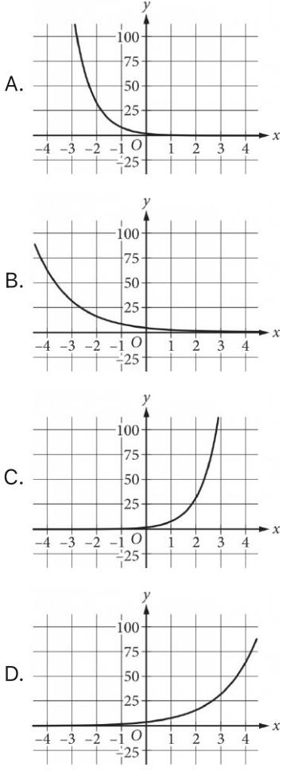
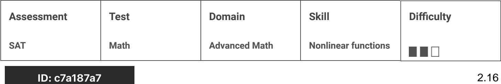
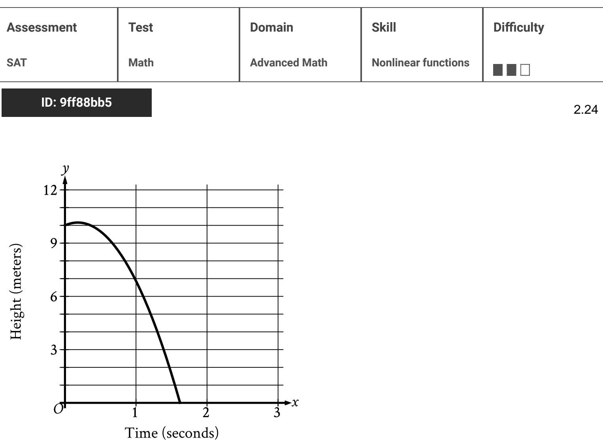
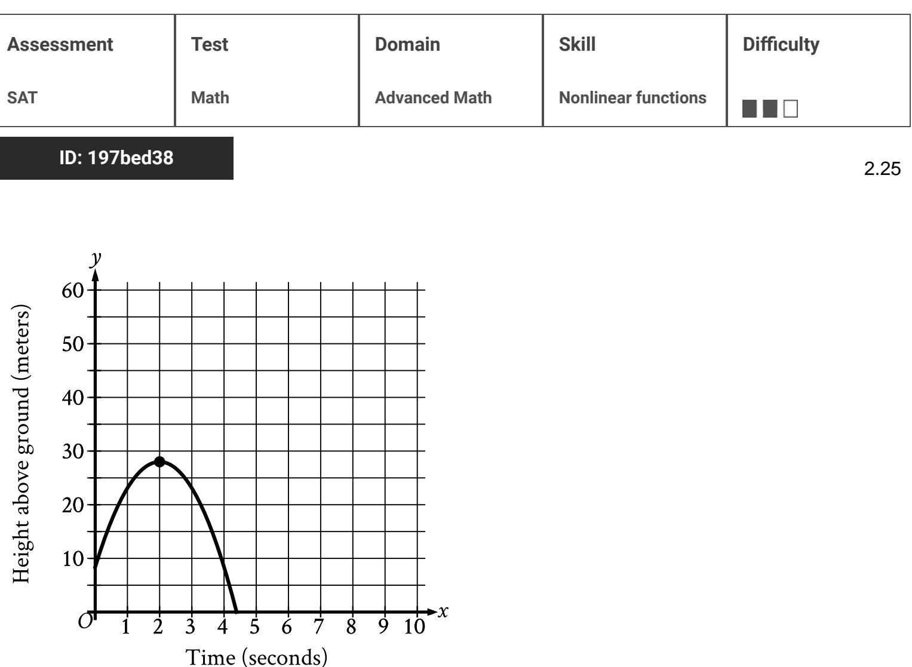

{0}------------------------------------------------

# Question ID f89af023

| Assessment   | Test | Domain        | Skill               | Difficulty |
|--------------|------|---------------|---------------------|------------|
| SAT          | Math | Advanced Math | Nonlinear functions |            |
| ID: f89af023 |      |               |                     | 2.1        |

A rectangular volleyball court has an area of 162 square meters. If the length of the court is twice the width, what is the width of the court, in meters?

| • |
|---|
|---|

B. 18

C. 27

D. 54

## ID: f89af023 Answer

Correct Answer: A

#### Rationale

Choice A is correct. It's given that the volleyball court is rectangular and has an area of 162 square meters. The formula for the area of a rectangle is A = e w, where A is the length, and w is the width of the rectangle. It's also given that the length of the volleyball court is twice the width, thus f = 2w. Substituting the given value into the formula for the area of a rectangle and using the relationship between length and width for this rectangle yields 162 =(2w)(w). This equation can be rewritten as 162 = 2wd. Dividing both sides of this equation by 2 yields 81 = W. Taking the square root of both sides of this equation yields +9 = w. Since the width of a rectangle is a positive number, the width of the volleyball court is 9 meters.

Choice B is incorrect because this is the length of the rectangle. Choice C is incorrect because this is the result of using 162 as the perimeter rather than the area. Choice D is incorrect because this is the result of calculating w in the equation 162 = 2w + w instead of 162 = (2w)(w)

{1}------------------------------------------------

## Question ID e53add44

| Assessment   | Test | Domain        | Skill               | Difficulty |     |
|--------------|------|---------------|---------------------|------------|-----|
| SAT          | Math | Advanced Math | Nonlinear functions |            |     |
| ID: e53add44 |      |               |                     |            | 2.2 |

The function S above models the annual salary, in dollars, of an employee n years after starting a job, where a is a constant. If the employee's salary increases by 4% each year, what is the value of a ?

A. 0.04

S(n) = 38,000a"

B. 0.4

C. 1.04

D. 1.4

## ID: e53add44 Answer

Correct Answer: C

#### Rationale

Choice C is correct. A model for a quantity S that increases by a certain percentage per time period n is an , where I is the initial value at time η = 0 for r% annual 100 ) exponential function in the form increase. It's given that the annual increase in an employee's salary is 4%, so r = 4. The initial value can be found by substituting 0 for n in the given function, which yields S(0) = 38,000. Therefore, J = 38,000.

Substituting these values for r and I into the form of the exponential function vields

S(n) = 38,000 , or S(n) = 38,000(1.04)". Therefore, the value of a in the given function is 1.04. 100

Choices A, B, and D are incorrect and may result from incorrectly representing the annual increase in the exponential function.

{2}------------------------------------------------

# Question ID 926c246b

| Assessment   | Test | Domain        | Skill               | Difficulty |  |
|--------------|------|---------------|---------------------|------------|--|
| SAT          | Math | Advanced Math | Nonlinear functions |            |  |
| ID: 926c246b | 2.3  |               |                     |            |  |

D = 5,640(1.9)

The equation above estimates the global data traffic D, in terabytes, for the year that is t years after 2010. What is the best interpretation of the number 5,640 in this context?

A. The estimated amount of increase of data traffic, in terabytes, each year

B. The estimated percent increase in the data traffic, in terabytes, each year

C. The estimated data traffic, in terabytes, for the year that is t years after 2010

D. The estimated data traffic, in terabytes, in 2010

### ID: 926c246b Answer

Correct Answer: D

Rationale

Choice D is correct. Since t represents the number of years after 2010, the estimated data traffic, in terabytes, in 2010 can be calculated using the given equation when t = 0. Substituting 0 for t in the given equation yields D = 5,640(1.9)º, or 5,640(1) = 5,640. Thus, 5,640 represents the estimated data traffic, in terabytes, in 2010.

Choice A is incorrect. Since the equation is exponential, the amount of increase of data traffic each year isn't constant. Choice B is incorrect. According to the equation, the percent increase in data traffic each year is 90%. Choice C is incorrect. The estimated data traffic, in terabytes, for the year that is t years after 2010 is represented by D, not the number 5,640.

{3}------------------------------------------------

# Question ID 50e40f08

| Assessment    | Test | Domain        | Skill               | Difficulty |
|---------------|------|---------------|---------------------|------------|
| SAT           | Math | Advanced Math | Nonlinear functions |            |
| ID: 500/10f08 |      |               |                     | 0 4        |

$$f(x) = (x+6)(x-4)$$

If the given function f is graphed in the xy-plane, where y = f(x), what is the x-coordinate of an x-intercept of the graph?

### ID: 50e40f08 Answer

Correct Answer: -6, 4

Rationale

The correct answer is either -6 or 4. The x-intercepts of a graph in the xy-plane are the points where y = 0. Thus, for an x-intercept of the graph of y = f(x), 0 = f(x). Substituting 0 for f(x) in the equation f (x) = (x + 6)(x - 4) yields 0 = (x + 6)(x - 4). By the zero product property, x + 6 = 0 and x - 4 = 0. Subtracting 6 from both sides of the equation x + 6 = 0 yields x = - 6. Adding 4 to both sides of the equation x - 4 = 0 yields x = 4. Therefore, the x-coordinates of the graph of y = f(x) are -6 and 4 . Note that -6 and 4 are examples of ways to enter a correct answer.

{4}------------------------------------------------

# Question ID be0c419e

| Assessment   | Test | Domain        | Skill               | Difficulty |
|--------------|------|---------------|---------------------|------------|
| SAT          | Math | Advanced Math | Nonlinear functions |            |
| ID: be0c419e |      |               |                     | 2.5        |

#### ID: be0c419e

Immanuel purchased a certain rare coin on January 1. The function f(x) = 65(1.03)", where 0 ≤ x ≤ 10, gives the predicted value, in dollars, of the rare coin x years after Immanuel purchased it. What is the best interpretation of the statement "ƒ(8) is approximately equal to 82" in this context?

- A. When the rare coin's predicted value is approximately 82 dollars, it is 8% greater than the predicted value, in dollars, on January 1 of the previous year.
- B. When the rare coin's predicted value is approximately 82 dollars, it is 8 times the predicted value, in dollars, on January 1 of the previous year.
- C. From the day Immanuel purchased the rare coin to 8 years after Immanuel purchased the coin, its predicted value increased by a total of approximately 82 dollars.
- D. 8 years after Immanuel purchased the rare coin, its predicted value is approximately 82 dollars.

#### ID: be0c419e Answer

Correct Answer: D

Rationale

Choice D is correct. It's given that the function f(x) = 65(1.03)" gives the predicted value, in dollars, of a certain rare coin x years after Immanuel purchased it. It follows that f(x) represents the predicted value, in dollars, of the coin x years after Immanuel purchased it. Since the value of ƒ(ß) is the value of ƒ(2) when x = 8, it follows that " f(8) is approximately equal to 82" means that f(x) is approximately equal to 82 when x = 8. Therefore, the best interpretation of the statement "f(8) is approximately equal to 80" in this context is 8 years after Immanuel purchased the rare coin, its predicted value is approximately 82 dollars.

Choice A is incorrect and may result from conceptual errors.

Choice B is incorrect and may result from conceptual errors.

Choice C is incorrect and may result from conceptual errors.

{5}------------------------------------------------

# Question ID a31417d1

| Assessment   | Test | Domain        | Skill               | Difficulty |
|--------------|------|---------------|---------------------|------------|
| SAT          | Math | Advanced Math | Nonlinear functions |            |
| ID. 29141741 |      |               |                     | റ പ്ര      |

From 2005 through 2014, the number of music CDs sold in the United States declined each year by approximately 15% of the number sold the preceding year. In 2005, approximately 600 million CDs were sold in the United States. Of the following, which best models C, the number of millions of CDs sold in the United States, t years after 2005?

A. C = 600(0.15)f

B. C = 600(0.85){

c. C =600(1.15)f

D. C = 600(1.85){

#### ID: a31417d1 Answer

Correct Answer: B

Rationale

Choice B is correct. A model for a quantity C that decreases by a certain percentage per time period t is an exponential equation in the form 100 , where I is the initial value at time t = 0 for r% annual decline. It's given that C is the number of millions of CDs sold in the United States and that t is the number of years after 2005. It's also given that 600 million CDs were sold at time t = 0, so / = 600. This number declines

100 by 15% per year, so r = 15. Substituting these values into the equation produces , or C = 600(0.85){

Choice A is incorrect and may result from errors made when representing the percent decline. Choices C and D are incorrect. These equations model exponential increases in CD sales, not exponential decreases.

{6}------------------------------------------------

## Question ID c4cd5bcc

| Assessment   | Test | Domain        | Skill               | Difficulty |
|--------------|------|---------------|---------------------|------------|
| SAT          | Math | Advanced Math | Nonlinear functions |            |
| ID: c4cd5bcc |      |               |                     | 2.7        |

In the xy-plane, the y-coordinate of the y-intercept of the graph of the function f is c. Which of the following must be equal to c ?

A. f (0)

B. f(1)

c. f(2)

D. f(3)

### ID: c4cd5bcc Answer

Correct Answer: A

Rationale

Choice A is correct. A y-intercept is the point in the xy-plane where the graph of the function crosses the yaxis, which is where x = 0. It's given that the y-coordinate of the y-intercept of the graph of function f is c. It follows that the coordinate pair representing the y-intercept must be (0,c). Therefore, c must equal f (0).

Choices B, C, and D are incorrect because f(1), f(2), and f(3)would represent the y-value of the coordinate where x = 1, x = 2, and x = 3, respectively.

{7}------------------------------------------------

# Question ID 78d5f91a

| Assessment   | Test | Domain        | Skill               | Difficulty |
|--------------|------|---------------|---------------------|------------|
| SAT          | Math | Advanced Math | Nonlinear functions |            |
| ID: 78d5f91a |      |               |                     | 2.8        |

For the function f defined above, what is the value of f(-1)?

f(x)=x3+3x2-6x-1

A. -11

B. -7

c. 7

D. 11

#### ID: 78d5f91a Answer

Correct Answer: C

Rationale

Choice C is correct. Substituting =1 for x in the given function f gives f(-1)=(-1)=6(-1)-1, which simplifies to f(-1) = −1 + 3(1)−6(−1)−1. This further simplifies to f(−1) = −1 + 3 +6−−1, or f(-1)=7

Choice A is incorrect and may result from correctly substituting = 1 for x in the function but incorrectly simplifying the resulting expression to f(-1) = - 1 - 3 - 6 - 1, or - 1 1. Choice B is incorrect and may result from arithmetic errors. Choice D is incorrect and may result from correctly substituting — I for x in the function but incorrectly simplifying the expression to f(-1)= 1+3+6+1, or 11.
{8}------------------------------------------------

# Question ID d675744f

y = 4(2x)

| Assessment   | Test | Domain        | Skill               | Difficulty |
|--------------|------|---------------|---------------------|------------|
| SAT          | Math | Advanced Math | Nonlinear functions |            |
| ID: d675744f |      |               |                     | 2.9        |

Which of the following is the graph in the xyplane of the given equation?

## ID: d675744f Answer

Correct Answer: D

### Rationale

Choice D is correct. The y-intercept of the graph of an equation is the point (0,b), where b is the value of y when x = 0. For the given equation, y = 4 when x = 0. It follows that the y-intercept of the given equation is (0,4). Additionally, for the given equation, the value of y doubles for each increase of 1 in the value of x. Therefore, the graph contains the points (1,8), (2,16), (3,32), and (4,64). Only the graph shown in choice D passes through these points.

{9}------------------------------------------------

Choices A and B are incorrect because these are graphs of decreasing, exponential functions. Choice C is incorrect because the value of y increases by a growth factor greater than 2 for each increase of 1 in the value of x.

{10}------------------------------------------------

## Question ID f44a29a8

| Assessment    | Test | Domain        | Skill               | Difficulty |
|---------------|------|---------------|---------------------|------------|
| SAT           | Math | Advanced Math | Nonlinear functions |            |
| ID. f/10-20-0 |      |               |                     | 9 10       |

An object's kinetic energy, in joules, is equal to the product of one-half the object's mass, in kilograms, and the square of the object's speed, in meters per second. What is the speed, in meters per second, of an object with a mass of 4 kilograms and kinetic energy of 18 joules?

| A. 3  |  |  |
|-------|--|--|
| B. 6  |  |  |
| c. 9  |  |  |
| D. 36 |  |  |
|       |  |  |

ID: f44a29a8 Answer

Correct Answer: A

Rationale

Choice A is correct. It's given that an object's kinetic energy, in joules, is equal to the product of one-half the object's mass, in kilograms, and the square of the object's speed, in meters per second. This relationship can be represented by the equation 2 , where K is the kinetic energy, m is the mass, and v is the speed. Substituting a mass of 4 kilograms for m and a kinetic energy of 18 joules for K results in the equation , or 18 = 2v2. Dividing both sides of this equation by 2 yields 9 = V. Taking the square root of both sides yields y = - 3 and y = 3. Since speed can't be expressed as a negative number, the speed of the object is 3 meters per second.

Choice B is incorrect and may result from computation errors. Choice C is incorrect. This is the value of V rather than v. Choice D is incorrect. This is the value of 4V rather than v.

{11}------------------------------------------------

## Question ID d71f6dbf

| Assessment | Test | Domain        | Skill               | Difficulty |
|------------|------|---------------|---------------------|------------|
| SAT        | Math | Advanced Math | Nonlinear functions |            |
|            |      |               |                     |            |

## ID: d71f6dbf

2.11

The height, in feet, of an object x seconds after it is thrown straight up in the air can be modeled by the function h(x) = −16x2 +20x +5. Based on

the model, which of the following statements best interprets the equation h(1.4) = 1.64 ?

- A. The height of the object 1.4 seconds after being thrown straight up in the air is 1.64 feet.
- B. The height of the object 1.64 seconds after being thrown straight up in the air is 1.4 feet.
- C. The height of the object 1.64 seconds after being thrown straight up in the air is approximately 1.4 times as great as its initial height.
- D. The speed of the object 1.4 seconds after being thrown straight up in the air is approximately 1.64 feet per second.

### ID: d71f6dbf Answer

Correct Answer: A

Rationale

Choice A is correct. The value of x, which represents the number of seconds after the object was thrown straight up in the air. When the function h is evaluated for x = 1.4, the function has a value of 1.64, which is the height, in feet, of the object.

Choices B and C are incorrect and may result from misidentifying seconds as feet and feet as seconds. Additionally, choice C may result from incorrectly including the initial height of the input x. Choice D is incorrect and may result from misidentifying height as speed.

{12}------------------------------------------------

# Question ID 6676f055

f(0) = - 0.28(0-27)2 +880

| Assessment   | Test | Domain        | Skill               | Difficulty |      |
|--------------|------|---------------|---------------------|------------|------|
| SAT          | Math | Advanced Math | Nonlinear functions |            |      |
| ID: 6676f055 |      |               |                     |            | 2.12 |

An engineer wanted to identify the best angle for a cooling fan in an engine in order to get the greatest airflow. The engineer discovered that the function above models the airflow f (0), in cubic feet per minute, as a

function of the angle of the fan 0, in degrees. According to the model, what

angle, in degrees, gives the greatest airflow?

| A 0.2 - | 28 |
|---------------|----|
|---------------|----|

B. 0.28

- C. 27
- D. 880

#### ID: 6676f055 Answer

Correct Answer: C

Rationale

Choice C is correct. The function f is quadratic, so it will have either a maximum or a minimum at the vertex of the graph. Since the coefficient of the quadratic term (-0.28) is negative, the vertex will be at a maximum. The equation f(0) = =0.28(0 = 27) + 880 is given in vertex form, so the vertex is at 0 = 27. Therefore, an angle of 27 degrees gives the greatest airflow.

Choices A and B are incorrect and may be the result of misidentifying which value in a quadratic equation in vertex form represents the vertex. Choice D is incorrect. This choice identifies the maximum value of t(0)

rather than the value of 0 for which f(0) is maximized.

{13}------------------------------------------------

## Question ID dd8ac009

| Assessment    | Test | Domain        | Skill               | Difficulty |
|---------------|------|---------------|---------------------|------------|
| SAT           | Math | Advanced Math | Nonlinear functions |            |
| 10. J-10--000 |      |               |                     | 9 10       |

D: dd&ac009

| Time (years) | Total amount (dollars) |
|--------------|------------------------|
| 0            | 670.00                 |
|              | 674.02                 |
| 2            | 678.06                 |

Sara opened a savings account at a bank. The table shows the exponential relationship between the time t, in years, since Sara opened the account and the total amount d, in dollars, in the account. If Sara made no additional deposits or withdrawals, which of the following equations best represents the relationship between t and d?

$$\mathbb{A}. \mathbf{d} = 0.006(1 + 670)^t$$

B. d = 670 (1 + 0.006) 4

C. d = 0.006(670t)

D. d = 670(0.006 + t)

### ID: dd8ac009 Answer

Correct Answer: B

Rationale

Choice B is correct. It's given that the relationship between t and d is exponential. The table shows that the value of d increases as the value of t increases. Therefore, the relationship between t and d can be represented by an increasing exponential equation of the form d = a(1 + b), where a and b are positive constants. The table shows that when t = 0, d = 670. Substituting 0 for t and 670 for d in the equation d = a(1 + b) 'yields 670 = a(1 + b) , which is equivalent to 670 = a(1), or 670 = a. Substituting 670 for a in the equation d = a(1 + b) 'yields d = 670(1 + b) . The table also shows that when t = 1, d = 674.02. Substituting 1 for t and 674.02 for d in the equation d = 670(1 + b)* yields 674.02 = 670(1 + b)*, or 674.02 = 670(1 + b). Dividing both sides of this equation by 670 yields 1.006 = 1 + b. Subtracting 1 from both sides of this equation yields b = 0.006. Substituting 0.006 for b in the equation d = 670(1 + b)* yields d = 670(1 + 0.006) . Therefore, of the choices, choice B best represents the relationship between t and d.

Choice A is incorrect and may result from conceptual or calculation errors.

Choice C is incorrect and may result from conceptual or calculation errors.

Choice D is incorrect and may result from conceptual or calculation errors.

{14}------------------------------------------------

## Question ID 281a4f3b

| Assessment   | Test | Domain        | Skill               | Difficulty |
|--------------|------|---------------|---------------------|------------|
| SAT          | Math | Advanced Math | Nonlinear functions |            |
| In. 901-1f2h |      |               |                     | 9 11       |

A certain college had 3,000 students enrolled in 2015. The college predicts that after 2015, the number of students enrolled each year will be 2% less than the number of students enrolled the year before. Which of the following functions models the relationship between the number of students enrolled, f (x), and the number of years after 2015, x ?

A. f(x)=0.02(3,000)*

B. f(x)=0.98(3,000)*

c. f(x) = 3,000(0.02)*

D. f(x) = 3,000(0.98)x

## ID: 281a4f3b Answer

Correct Answer: D

Rationale

Choice D is correct. Because the change in the number of students decreases by the same percentage each year, the relationship between the number of students and the number of years can be modeled with a decreasing exponential function in the form f(x) = a(1 -r)*, where /(x) is the number of students, a is the

number of students in 2015, r is the rate of decrease each year, and x is the number of years since 2015. It's given that 3,000 students were enrolled in 2015 and that the rate of decrease is predicted to be 2%, or 0.02. Substituting these values into the decreasing exponential function yields f(x)=3,000(1-0.02), which is equivalent to f(x)=3,000(0.98)*

Choices A, B, and C are incorrect and may result from conceptual errors when translating the given information into a decreasing exponential function.

{15}------------------------------------------------

# Question ID 100030d9

| Assessment  | Test | Domain        | Skill               | Difficulty |
|-------------|------|---------------|---------------------|------------|
| SAT         | Math | Advanced Math | Nonlinear functions |            |
| IB 4AAAAA A |      |               |                     | o ir       |

### ID: 100030d9

2.15

A rubber ball bounces upward one-half the height that it falls each time it hits the ground. If the ball was originally dropped from a distance of 20.0 feet above the ground, what was its maximum height above the ground, in feet, between the third and fourth time it hit the ground?

## ID: 100030d9 Answer

Rationale

The correct answer is 2.5. After hitting the ground once, the ball bounces to 20.0 ÷2 = 10.0 feet. After hitting the ground a second time, the ball bounces to 10.0 + 2 = 5.0 feet. After hitting the ground for the third time, the ball bounces to 5.0 ÷2 = 2.5 feet. Note that 2.5 and 5/2 are examples of ways to enter a correct answer.
{16}------------------------------------------------

## Question ID c7a187a7

### f(x) = x2 - 18x - 360

If the given function ƒ is graphed in the xy-plane, where y = ƒ(x), what is an x-intercept of the graph?

- A. ( 12,0)
- B. ( 30, 0)
- C. ( 360, 0)
- D. (12, 0)

#### ID: c7a187a7 Answer

Correct Answer: A

Rationale

Choice A is correct. It's given that y = f(x). The x-intercepts of a graph in the xy-plane are the points where y = 0. Thus, for an x-intercept of the graph of function f, 0 = f(x). Substituting 0 for f(x) in the equation f(x) = x2 = 18x - 360 yields 0 = x2 - 18x - 360. Factoring the right-hand side of this equation yields 0 = (x + 12)(x - 30). By the zero product property, x + 12 = 0 and x - 30 = 0. Subtracting 12 from both sides of the equation x + 12 = 0 yields x = −12. Adding 30 to both sides of the equation x − 30 = 0 yields x = 30. Therefore, the x-intercepts of the graph of y = f(x) are (-12, 0) and (30, 0). Of these two xintercepts, only (-12, 0) is given as a choice.

Choice B is incorrect and may result from conceptual or calculation errors.

Choice C is incorrect and may result from conceptual or calculation errors.

Choice D is incorrect and may result from conceptual or calculation errors.

{17}------------------------------------------------

## Question ID e1391dd6

| Assessment   | Test | Domain        | Skill               | Difficulty |
|--------------|------|---------------|---------------------|------------|
| SAT          | Math | Advanced Math | Nonlinear functions |            |
| ID: e1391dd6 |      |               |                     | 2.17       |

#### D: e1391dd6

According to Moore's law, the number of transistors included on microprocessors doubles every 2 years. In 1985, a microprocessor was introduced that had 275,000 transistors. Based on this information, in which of the following years does Moore's law estimate the number of transistors to reach 1.1 million?

A. 1987

B. 1989

C. 1991

D. 1994

#### ID: e1391dd6 Answer

Rationale

Choice B is correct. Let x be the number of years after 1985. It follows that 7 represents the number of 2-year periods that will occur within an x-year period. According to Moore's law, every 2 years, the number of transistors included on microprocessors is estimated to double. Therefore, x years after 1985, the number of X transistors will double 7 times. Since the number of transistors included on a microprocessor was 275,000, or .275 million, in 1985, the estimated number of transistors, in millions, included x years after 1985 can be 0.275 · 2 2 . The year in which the number of transistors is estimated to be 1.1 million is modeled as 1.1 = 0.275.2 2 represented by the value of x when . Dividing both sides of this equation by .275 yields 4 = 2 2 , which can be rewritten as . Since the exponential equation has equal bases on each side, it follows that the exponents must also be equal: 2 = 2. Multiplying both sides of the equation 2 by 2 yields x = 4. Therefore, according to Moore's law, 4 years after 1985, or in 1989, the number of transistors included on microprocessors is estimated to reach 1.1 million.

X

Alternate approach: According to Moore's law, 2 years after 1985 (in 1987), the number of transistors included on a microprocessor is estimated to be 2-275.000, or 550,000, and 2 years after 1987 (in 1989), the number of

{18}------------------------------------------------

transistors included on microprocessors is estimated to be 2 · 550,000, or 1,100,000. Therefore, the year that

Moore's law estimates the number of transistors on microprocessors to reach 1.1 million is 1989.

Choices A, C, and D are incorrect. According to Moore's law, the number of transistors included on microprocessors is estimated to reach 550,000 in 1987, 2.2 million in 1991, and about 6.2 million in 1994.

{19}------------------------------------------------

# Question ID 5bf0f84a

| Assessment   | Test | Domain        | Skill               | Difficulty |
|--------------|------|---------------|---------------------|------------|
| SAT          | Math | Advanced Math | Nonlinear functions |            |
| ID: 5bf0f84a |      |               |                     | 2.18       |

ID: 5bf0f84a

h(t) = - 16t2 + 110t + 72

The function above models the height h, in feet, of an object above ground t seconds after being launched straight up in the air. What does the number 72 represent in the function?

- A. The initial height, in feet, of the object
- B. The maximum height, in feet, of the object
- C. The initial speed, in feet per second, of the object
- D. The maximum speed, in feet per second, of the object

#### ID: 5bf0f84a Answer

Correct Answer: A

Rationale

Choice A is correct. The variable t represents the seconds after the object is launched. Since h(0) = 72 this means that the height, in feet, at 0 seconds, or the initial height, is 72 feet.

Choices B, C, and D are incorrect and may be the result of misinterpreting the function in context.

{20}------------------------------------------------

## Question ID 70ebd3d0

| Assessment   | Test | Domain        | Skill               | Difficulty |
|--------------|------|---------------|---------------------|------------|
| SAT          | Math | Advanced Math | Nonlinear functions |            |
| ID: 70ebd3d0 |      |               |                     | 2.19       |

N(d) = 115(0.90)a

The function N defined above can be used to model the number of species of brachiopods at various ocean depths d, where d is in hundreds of meters. Which of the following does the model predict?

A. For every increase in depth by 1 meter, the number of brachiopod species decreases by 115.

B. For every increase in depth by 1 meter, the number of brachiopod species decreases by 10%.

C. For every increase in depth by 100 meters, the number of brachiopod species decreases by 115.

D. For every increase in depth by 100 meters, the number of brachiopod species decreases by 10%.

#### ID: 70ebd3d0 Answer

Correct Answer: D

Rationale

Choice D is correct. The function N is exponential, so it follows that N((d) changes by a fixed percentage for

each increase in d by 1. Since d is measured in hundreds of meters, it also follows that the number of brachiopod species changes by a fixed percentage for each increase in ocean depth by 100 meters. Since the base of the exponent in the model is 0.90, which is less than 1, the number of brachiopod species decreases as the ocean depth increases. Specifically, the number of brachiopod species at a depth of d + 100 meters is 90%

of the number of brachiopod species at a depth of d meters. This means that for each increase in ocean depth by 100 meters, the number of brachiopod species decreases by 10%.

Choices A and C are incorrect. These describe situations where the number of brachiopod species are decreasing linearly rather than exponentially. Choice B is incorrect and results from interpreting the decrease in the number of brachiopod species as 10% for every 1-meter increase in ocean depth rather than for every 100-meter increase in ocean depth.

{21}------------------------------------------------

## Question ID 97158b3a

| Assessment   | Test | Domain        | Skill               | Difficulty |
|--------------|------|---------------|---------------------|------------|
| SAT          | Math | Advanced Math | Nonlinear functions |            |
| In. 07152429 |      |               |                     | 0 20       |

The area A, in square centimeters, of a rectangular painting can be repression w(w + 29), where w is the width, in centimeters, of the painting. Which expresents the length, in centimeters, of the painting?

A. w

B. 29

c. (w + 29)

D. w(w+29)

### ID: 97158b3a Answer

Correct Answer: C

Rationale

Choice C is correct. It's given that the expression w(w + 29) represents the area, in square centimeters, of a rectanqular painting, where w is the width, in centimeters, of the area of a rectangle can be calculated by multiplying its length by its width. It follows that the length, in centimeters, of the painting is represented by the expression (w + 29).

Choice A is incorrect. This expression represents the width, in centimeters, of the painting, not its length, in centimeters.

Choice B is incorrect. This is the difference between the length, in centimeters, and the width, in centimeters, of the painting, not its length, in centimeters.

Choice D is incorrect. This expression represents the area, in square centimeters, of the painting, not its length, in centimeters.

{22}------------------------------------------------

## Question ID dba7432e

|     | Assessment |              | Test | Domain        | Skill               | Difficulty |
|-----|------------|--------------|------|---------------|---------------------|------------|
| SAT |            |              | Math | Advanced Math | Nonlinear functions | ■■□        |
|     |            | ID: dba7432e |      |               |                     | 2.21       |
|     | X          | f (x)        |      |               |                     |            |
|     | O          | 5            |      |               |                     |            |
|     | 1          | న లా         |      |               |                     |            |
|     | 2          | 5 4          |      |               |                     |            |
|     | ന          | 5 8          |      |               |                     |            |

The table above gives the values of the function f for some values of x. Which of the following equations could define f ?

$$\begin{aligned} \mathsf{A}. \ f(\mathsf{x}) &= \mathsf{5} \langle \mathsf{Z}^{\mathsf{x}} + \mathsf{1} \rangle \\\\ \mathsf{B}. \ f(\mathsf{x}) &= \mathsf{5} \langle \mathsf{Z}^{\mathsf{x}} \rangle \\\\ \mathsf{C}. \ f(\mathsf{x}) &= \mathsf{5} \langle \mathsf{Z}^{-\langle \mathsf{x} + \mathsf{1} \rangle} \rangle \\\\ \mathsf{D}. \ f(\mathsf{x}) &= \mathsf{5} \langle \mathsf{Z}^{-\mathsf{x}} \rangle \end{aligned}$$

#### ID: dba7432e Answer

Correct Answer: D

Rationale

Choice D is correct. Each choice has a function with coefficient 5 and base 2, so the exponents must be analyzed. When the input value of x increases, the output value of f(x) decreases, so t e exponent must be

negative. An exponent of -x yields the values in the table: 5 = 5(2-0)

$$\frac{5}{8} = 5(2^{-3})$$

Choices A and B are incorrect and may result from choosing equations that yield an increasing, rather than decreasing, output value of f(x) when the input value of x increases. Choice C is incorrect and may result from choosing an equation that doesn't yield the values in the table.

{23}------------------------------------------------

## Question ID f5e8ccf1

| Assessment                            | Test | Domain        | Skill               | Difficulty |
|---------------------------------------|------|---------------|---------------------|------------|
| SAT                                   | Math | Advanced Math | Nonlinear functions |            |
| ID: f5e8ccf1 f(x)=(x+4)(x-1)(2x-3) |      |               |                     |            |

The function f is defined above. Which of the following is NOT an xintercept of the graph of the function in the xy-plane?

A. (-4, 0) c. (1,0) n | A D.

#### ID: f5e8ccf1 Answer

Correct Answer: B

Rationale

Choice B is correct. The graph of the function f in the xy-plane has x-intercepts at the points (X,V, where y = f(x) = 0. Substituting 0 for f(x) in the given equation yields 0 = (x + 4)(x - 1)(2x - 3). By the zero product property, if 0 = (x + 4)(x − 1)(2x − 3), then x + 4 = 0, x − 1 = 0, or 2x − 3 = 0. Solving each of these linear equations for x, it follows that x = −4, x = 1, and ` >
= = = = = = = = = = = = 1, x = 1, and ` = − 1, and ` = 2 , respectively. This means that the graph of the function f in the xy-plane has three x-intercepts: (-4,0), (1,0), and (2 Therefore, intercept of the graph of the function f.

Alternate approach: Substitution may be used. Since by definition an x-intercept of any graph is a point in the form (K,O) where k is a constant, and since all points in the options are in this form, it need only be checked

3 for x and 0 for f (x) in whether the points in the options lie on the graph of the function f. Substituting or 0 = 650 27 . Therefore, the point the given equation yields doesn't lie on the graph of the function f and can't be an x-intercept of the graph.

Choices A, C, and D are incorrect because each of these points is an x-intercept of the function f in the xy-plane. By definition, an x-intercept is a point on the graph of the form (k,0), where k is a constant. Substituting -4 for x and 0 for f(x) in the given equation yields 0 = (-4 + 4)(-4 - 1)(2(-4) - 3), or 0 = 0.
{24}------------------------------------------------

Since this is a true statement, the point (−4,0) lies on the graph of the function f and is an x-intercept of the graph. Performing similar substitution using the points (1,0) and (2 ) also yields the true statement 0 =0, illustrating that these points also lie on the graph of the function f and are x-intercepts of the graph. Question Difficulty: Medium

{25}------------------------------------------------

## Question ID 5c00c2c1

| Assessment   | Test | Domain        | Skill               | Difficulty |
|--------------|------|---------------|---------------------|------------|
| SAT          | Math | Advanced Math | Nonlinear functions |            |
| ID: 5c00c2c1 |      |               |                     | 2.23       |

There were no jackrabbits in Australia before 1788 when 24 jackrabbits were introduced. By 1920 the population of jackrabbits had reached 10 billion. If the population had grown exponentially, this would correspond to a 16.2% increase, on average, in the population each year. Which of the following functions best models the population p(t) of jackrabbits t years

after 1788?

A. p(t) = 1.162(24){

B. p(t) = 24(2) 1.162t

c.p(t) = 24(1.162){

D. p(t) = (24 , · , 1.162){

#### ID: 5c00c2c1 Answer

Correct Answer: C

Rationale

Choice C is correct. This exponential growth model can be written in the form P(t) = A(1 + r) , where p(t) is

the population t years after 1788, A is the initial population, and r is the yearly growth rate, expressed as a decimal. Since there were 24 jackrabbits in Australia in 1788, A =24. Since the number of jackrabbits increased by an average of 16.2% each year, r = 0.162. Therefore, the equation that best models this situation is p(t) = 24(1.162){

Choices A, B, and D are incorrect and may result from misinterpreting the form of an exponential growth model.

{26}------------------------------------------------

# Question ID 9ff88bb5

A competitive dives from a platform into the water. The graph shown gives the height above the water y, in meters, of the diver x seconds after diving from the platform. What is the best interpretation of the graph?

- A. The diver reaches a maximum height above the water at 1.6 seconds.
- B. The diver hits the water at 1.6 seconds.
- C. The diver reaches a maximum height above the water at 0.2 seconds.
- D. The diver hits the water at 0.2 seconds.

## ID: 9ff88bb5 Answer

Correct Answer: B

{27}------------------------------------------------

#### Rationale

Choice B is correct. It's given that the height above the water ; in meters, of a diver x seconds after diving from a platform. The x-intercept of a graph is the graph intersects the x-axis, or when the value of y is 0. The graph shown intersects the x-axis between x = 1 and x = 2. In other is 0 meters above the water, or hits the water, between 1 and 2 seconds after diving from the platform. Of the given choices, only choice B includes an interpretation where the diver hits the water between 1 and 2 seconds. Therefore, the x-intercept of the graph is the diver hits the water at 1.6 seconds.

Choice A is incorrect and may result from conceptual errors.

Choice C is incorrect. This is the best interpretation of the maximum value, not the x-intercept, of the graph.

Choice D is incorrect and may result from conceptual errors.

{28}------------------------------------------------

## Question ID 197bed38

 An object was launched upward from a platform. The graph shown models the height above ground, y, in meters, of the object a seconds after it was launched. For which of the following intervals of time was the height of the object increasing for the entire interval?

- A. From x = 0 to x = 2
- B. From x = 0 to x = 4
- C. From x = 2 to x = 3
- D. From x = 3 to x = 4

## ID: 197bed38 Answer

Correct Answer: A

{29}------------------------------------------------

#### Rationale

Choice A is correct. It's given that the variable y represents the height, in meters, of the object above the graph shows that the height of the object was increasing from x = 0 to x = 2, and decreasing from x = 2 to x = 4. Therefore, the height of the object was increasing for the entire interval of time from x = 0 to x = 2.

Choice B is incorrect. The height of the object wasn't increasing for this entire interval of time, as it was decreasing from x = 2 to x = 4.

Choice C is incorrect. The height of the object was decreasing, for this entire interval of time.

Choice D is incorrect. The height of the object was decreasing, for this entire interval of time.

{30}------------------------------------------------

#### Question ID 15c364bf

| Assessment | Test | Domain        | Skill               | Difficulty |
|------------|------|---------------|---------------------|------------|
| SAT        | Math | Advanced Math | Nonlinear functions |            |

## ID: 15c364bf

2.26

A sample of a certain isotope takes 29 years to decay to half its original mass. The function s(t) — 184(0.5) » gives the approximate mass of this isotope, in grams, that remains tyears after a 184-gram sample starts to decay. Which statement is the best interpretation of s(87) = 23 in this context?

A. Approximately 23 grams of the sample remains 87 years after the sample starts to decay.

- B. The mass of the sample has decreased by approximately 23 grams 87 years after the sample starts to decay.
- C. The mass of the sample has decreased by approximately 87 grams after the sample starts to decay.
- D. Approximately 87 grams of the sample remains 23 years after the sample starts to decay.

## ID: 15c364bf Answer

#### Correct Answer: A

### Rationale

Choice A is correct. In the given function, st represents the approximate mass, in grams, of the sample that remains t years after the sample starts to decay. It follows that the best interpretation of s87 = 23 is that approximately 23 grams of the sample remains 87 years after the sample starts to decay.

Choice B is incorrect. The mass of the sample has decreased by approximately 184 - 23, or 161, grams, 87 years after the sample starts to decay.

Choice C is incorrect. The mass of the sample has decreased by approximately 78 grams, 23 years after the sample starts to decay.

Choice D is incorrect. This would be the best interpretation of s23 = 87, not s87 = 23.

{31}------------------------------------------------

## Question ID 39714777

| Assessment           | Test | Domain        | Skill               | Difficulty |  |  |
|----------------------|------|---------------|---------------------|------------|--|--|
| SAT                  | Math | Advanced Math | Nonlinear functions |            |  |  |
| ID: 39714777 2.27 |      |               |                     |            |  |  |

## p(x) + 57 = x2

The given equation relates the value of x and its corresponding value of ກູໃຫ້ function ຫຼ. What is the minimum value of the function p?

A. - 3,249

B. -57

c. 57

D. 3,249

ID: 39714777 Answer

## Correct Answer: B

## Rationale

Choice B is correct. For a quadratic function defined by an equation of the form px = αx - ½ + k, where a, ½, and k are constants and a > 0, the minimum value of the function is k. Subtracting 57 from both sides of the given equation yields px = x2 - 57. This function is in the form px = ax - h2 = 0, and k = - 57. Therefore, the minimum value of the function p is -57.

Choice A is incorrect and may result from conceptual or calculation errors.

Choice C is incorrect and may result from conceptual or calculation errors.

Choice D is incorrect and may result from conceptual or calculation errors.