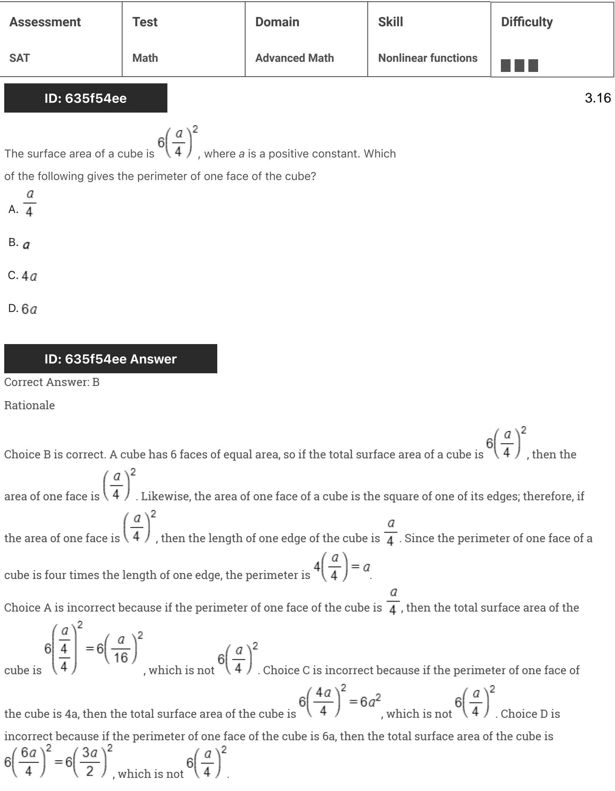
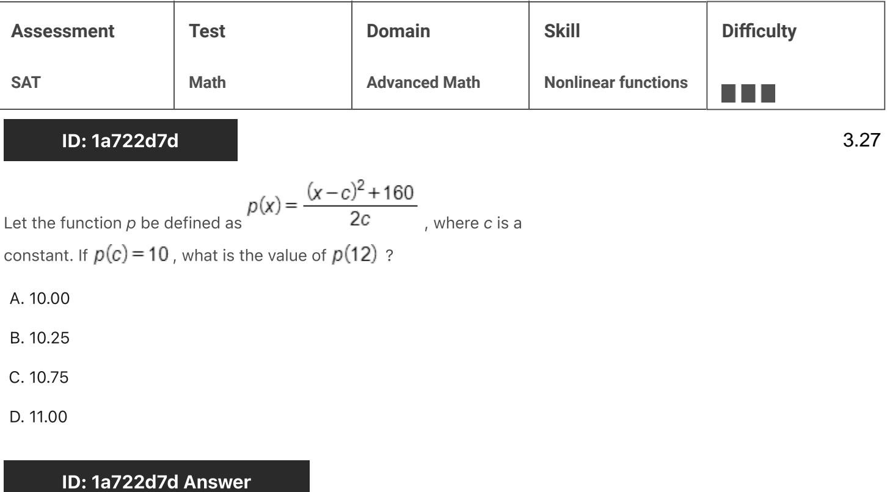
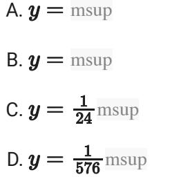
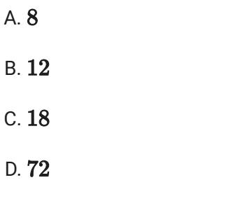

{0}------------------------------------------------

# Question ID 91e7ea5e

| Assessment   | Test | Domain        | Skill               | Difficulty |
|--------------|------|---------------|---------------------|------------|
| SAT          | Math | Advanced Math | Nonlinear functions |            |
| ID: 91e7ea5e |      |               |                     | 3.1        |

The quadratic function h is defined as shown. In the xy-plane, the graph of y = h(x) intersects the x-axis at the points (0,0)and (t,0), where t is a

constant. What is the value of t ?

h(x)=2(x-4)2-32

A. 1 B. 2 C. 4 D. 8

### ID: 91e7ea5e Answer

Correct Answer: D

Rationale

Choice D is correct. It's given that the graph of y = h(x) intersects the x-axis at (0,0) and (t,0), where t is a constant. Since this graph intersects the x-axis when y = 0 or when h(x) = 0, it follows that h(0) = 0 and h(t)=0. If h(t)=0, then 0 = 2(t-4)2-32. Adding 32 to both sides of this equation yields 32 = 2(t-4)2 Dividing both sides of this equation by 2 yields 16 = (t = 4) . Taking the square root of both sides of this equation yields 4 = t = 4. Adding 4 to both sides of this equation yields 8 = f. Therefore, the value of t is 8.

Choices A, B, and C are incorrect and may result from calculation errors.

{1}------------------------------------------------

# Question ID a9084ca4

| Assessment   | Test | Domain        | Skill               | Difficulty |
|--------------|------|---------------|---------------------|------------|
| SAT          | Math | Advanced Math | Nonlinear functions |            |
| ID: a9084ca4 |      |               |                     | 3.2        |

### f(x) = 9,000(0.66)"

The given function f models the number of advertisements a company sent to its clients each year, where w represents the number of years since 1997, and 0 ≤ x ≤ 5. If y = f(x) is graphed in the xy-plane, which of the following is the best interpretation of the y-intercept of the graph in this context?

- A. The minimum estimated number of advertisements the company sent to its clients during the 5 years was 1,708.
- B. The minimum estimated number of advertisements the company sent to its clients during the 5 years was 9,000.
- C. The estimated number of advertisements the company sent to its clients in 1997 was 1,708.
- D. The estimated number of advertisements the company sent to its clients in 1997 was 9,000.

### ID: a9084ca4 Answer

Correct Answer: D

Rationale

Choice D is correct. The y-intercept of a graph in the xy-plane is the point where x = 0. For the given function f, the y-intercept of the graph of y = f(x) in the xy-plane can be found by substituting 0 for x in the equation y = 9,000(0.66)", which gives y = 9,000(0.66)". This is equivalent to y = 9,000(1), or y = 9,000. Therefore, the y-intercept of the graph of y = f(x) is (0, 9,000). It's given that the function f models the number of advertisements a company sent to its clients each year. Therefore, f(x) represents the estimated number of advertisements the company sent to its clients each year. It's also qiven that x represents the number of years since 1997. Therefore, x = 0 represents 0 years since 1997, or 1997. Thus, the best interpretation of the yintercept of the graph of y = f(x) is that the estimated number of advertisements the company sent to its clients in 1997 was 9,000.

Choice A is incorrect and may result from conceptual or calculation errors.

Choice B is incorrect and may result from conceptual or calculation errors.

Choice C is incorrect and may result from conceptual or calculation errors.

{2}------------------------------------------------

# Question ID b8f13a3a

| Assessment   | Test | Domain        | Skill               | Difficulty |
|--------------|------|---------------|---------------------|------------|
| SAT          | Math | Advanced Math | Nonlinear functions |            |
| ID: b8f13a3a |      |               |                     | 3.3        |

Function f is defined by f(x) = -a " + b, where a and b are constants. In the xy-plane, the graph of y = f(x) — 12 has a y-intercept at (0, — 3). The product of a and b is 300. What is the value of a?

### ID: b8f13a3a Answer

Correct Answer: 20

Rationale

The correct answer is 20. It's given that f(x) = —a" + b. Substituting —a" + b for f(x) in the equation y = f(x) = 12 yields y = -a = + b = 12. It's given that the y-intercept of the graph of y = f(x) = 12 is (0 — 7) . Substituting 0 for z and — 7 for yout the equation y = — " + b — 12, vields — 2° — 22, ч.е. 12, ч. 12, ч.е. 12, ч.е. 12, ч.е. 12, ч.е. 12, как.
19 — b. Казания с м (a)(4) = 20 = 20 . Dividing both sides of this equation by 49 yields a = 20.

{3}------------------------------------------------

## Question ID 7902bed0

| Assessment   | Test | Domain        | Skill               | Difficulty |
|--------------|------|---------------|---------------------|------------|
| SAT          | Math | Advanced Math | Nonlinear functions |            |
| ID: 7902bed0 |      |               |                     | 34         |

A machine launches a softball from ground level. The softball reaches a maximum height of 51.84 meters above the ground at 1.8 seconds and hits the ground at 3.6 seconds. Which equation represents the height above ground h, in meters, of the softball t seconds after it is launched?

A. h = - t2 + 3.6 B. h = -t2 + 51.84 C. h = - 16(t + 51.84)2 - 3.6 D. h = - 16(t- 1.8)2 + 51.84

### ID: 7902bed0 Answer

Correct Answer: D

Rationale

Choice D is correct. An equation representing the height above ground h, in meters, of a softball t seconds after it is launched by a machine from ground level can be written in the form h = -a(t - b) + c, where a, b, and c are positive constants. In this equation, b represents the time, in seconds, at which the softball reaches its maximum height of c meters above the ground. It's given that this softball reaches a maximum height of 51.84 meters above the ground at 1.8 seconds; therefore, b = 1.8 and c = 51.84. Substituting 1.8 for b and 51.84 for c in the equation h = -a(t - b) - c yields h = -a(t - 1.8) - +51.84. It's also given that this softball hits the ground at 3.6 seconds; therefore, h = 0 when t = 3.6. Substituting 0 for h and 3.6 for t in the equation h = -a(t - 1.8)2 + 51.84 yields 0 = -a(3.6 - 1.8)2 + 51.84, which is equivalent to 0 = -a(1.8)2 + 51.84, or 0 = - 3.24a + 51.84. Adding 3.24a to both sides of this equation yields 3.24a = 51.84. Dividing both sides of this equation by 3.24 yields a = 16. Substituting 16 for a in the equation h = -a(t - 1.8)" + 51.84 yields h = = 16(t = 1.8)2 + 51.84. Therefore, h = - 16(t = 1.8) - + 51.84 represents the height above ground b, in meters, of this softball t seconds after it is launched.

Choice A is incorrect. This equation represents a situation where the maximum height is 3,6 meters above the ground at 0 seconds, not 51.84 meters above the ground at 1.8 seconds.

Choice B is incorrect. This equation represents a situation where the maximum height is 51.84 meters above the ground at 0 seconds, not 1.8 seconds.

Choice C is incorrect and may result from conceptual or calculation errors.

{4}------------------------------------------------

# Question ID 4a0d0399

| Assessment   | Test | Domain        | Skill               | Difficulty |  |
|--------------|------|---------------|---------------------|------------|--|
| SAT          | Math | Advanced Math | Nonlinear functions |            |  |
| ID: 4a0d0399 | 3.5  |               |                     |            |  |

The function f is defined by f(x) = a = + b, where a and b are constants. In the wy-plane, the graph of y = f(x) has an x-intercept at (2,0) and a y-intercept at (0, -323). What is the value of b?

### ID: 4a0d0399 Answer

Correct Answer: -324

Rationale

The correct answer is -324. It's given that the function f is defined by f(x) = a " + b, where a and bare constants. It's also given that the graph of y = f(x) has a y-intercept at (0, -323). It follows that f(0) = - 323. Substituting 0 for x and -323 for f(x) in f(x) = a" + b yields -323 = a0 + b, or —323 = 1 + b. Subtracting 1 from each side of this equation yields —324 = b. Therefore, the value of b is —324.

{5}------------------------------------------------

# Question ID 9654add7

| Assessment   | Test | Domain        | Skill               | Difficulty |
|--------------|------|---------------|---------------------|------------|
| SAT          | Math | Advanced Math | Nonlinear functions |            |
| ID: 9654add7 |      |               |                     | 3.6        |

f(x)=-500x2+25,000x

The revenue ƒ(x), in dollars, that a company receives from sales of a

product is given by the function f above, where x is the unit price, in dollars, of the product. The graph of y = f (x) in the xy-plane intersects the x-axis

at 0 and a. What does a represent?

A. The revenue, in dollars, when the unit price of the product is \$0

B. The unit price, in dollars, of the product that will result in maximum revenue

C. The unit price, in dollars, of the product that will result in a revenue of \$0

D. The maximum revenue, in dollars, that the company can make

#### ID: 9654add7 Answer

Correct Answer: C

Rationale

Choice C is correct. By definition, the y-value when a function intersects the x-axis is 0. It's given that the graph of the function intersects the x-axis at 0 and a, that x is the unit price, in dollars, of a product, and that f (x), where y = /(x), is the revenue, in dollars, that a company receives from the sales of the product. Since the value of a occurs when y = 0, a is the unit price, in dollars, of the product that will result in a revenue of \$0.

Choice A is incorrect. The revenue, in dollars, when the unit price of the product is \$0 is represented by /(X), when x = 0. Choice B is incorrect. The unit price, in dollars, of the product that will result in maximum revenue is represented by the x-coordinate of the maximum of f. Choice D is incorrect. The maximum revenue, in dollars, that the company can make is represented by the y-coordinate of the maximum of f.

{6}------------------------------------------------

# Question ID 263f9937

| Assessment |                                                           |              | Test                            | Domain              | Skill | Difficulty |     |
|------------|-----------------------------------------------------------|--------------|---------------------------------|---------------------|-------|------------|-----|
| SAT        |                                                           | Math         | Advanced Math                   | Nonlinear functions |       |            |     |
|            |                                                           | ID: 263f9937 |                                 |                     |       |            | 3.7 |
|            |                                                           |              | Growth of a Culture of Bacteria |                     |       |            |     |
|            | Number of bacteria per Day milliliter at end of day |              |                                 |                     |       |            |     |
|            | 1                                                         | 2.5×105      |                                 |                     |       |            |     |
|            | 2                                                         |              | 5.0×105                         |                     |       |            |     |
|            | 3                                                         |              | 1.0×106                         |                     |       |            |     |

A culture of bacteria is growing at an exponential rate, as shown in the table above. At this rate, on which day would the number of bacteria per milliliter reach 5.12 x 108?

A. Day 5

B. Day 9

C. Day 11

D. Day 12

#### ID: 263f9937 Answer

Correct Answer: D

#### Rationale

Choice D is correct. The number of bacteria per milliliter is doubling each day. For example, from day 1 to day 2, the number of bacteria increased from 2.5 × 10 to 5.0 × 10 . At the end of day 3 there are 10 bacteria per milliliter. At the end of day 4, there will be 10 × 2 bacteria per milliliter. At the end of day 5, there will be ") bacteria per milliliter, and so on. At the end of day d, the number of bacteria will be 10 ). If the number of bacteria per milliliter will reach 5.12 × 10 ° at the end of day d, then the equation 10°×(2d -3) = 5.12×10° must hold. Since 5.12 × 10° can be rewritten as 512 × 10° the equation is equivalent to 2d -3 = 512. Rewriting 512 as 2 gives d – 3 = 9, so d = 12. The number of bacteria per milliliter would reach 5.12 × 100 at the end of day 12.

Choices A, B, and C are incorrect. Given the growth rate of the bacteria, the number of bacteria will not reach per milliliter by the end of any of these days. 5.12 × 10

{7}------------------------------------------------

## Question ID 18e35375

$$f(x) = (x - 14)(x + 19)$$

The function f is defined by the given equation. For what value of x does f(x) reach its minimum?

A. - 266 B. - 19 C. — 35

D. — 5

ID: 18e35375 Answer

Correct Answer: D

Rationale

Choice D is correct. It's given that f(x) = (x - 14)(x + 19), which can be rewritten as f(x) = x2 + 5x - 266. Since the coefficient of the x2-term is positive, the graph of y = f(x) in the xy-plane opens upward and reaches its minimum value at its vertex. The vertex is the value of x such that f(x) reaches its minimum. For an equation in the form f(x) = ax2 + bx + c, where a, b, and care constants, the x-coordinate of the vertex is -- For the equation f(x) = x2 + 5x - 266, a = 1, b = 5, and c = = 266. It follows that the x-coordinate of the vertex is = = }, , or = \$. Therefore, f(x) reaches its minimum when the value of x is -

Alternate approach: The value of x for the vertex of a parabola is the x-value of the midpoint between the two x-intercepts of the parabola. Since it's given that f(x) = (x = 14)(x + 19), it follows that the two x-intercepts of the graph of y = f(x) in the xy-plane occur when x = 14 and x = - 19, or at the points (14, 0) and (—19,0). The midpoint between two points, (x1, y1) and (x2, y2), is (22, 22, 2222). Therefore, the midpoint (14+(-19), or (-- 5,0). It follows that f(x) reaches its minimum when between (14,0) and (-19,0) is the value of x is — 뉴

Choice A is incorrect. This is the y-coordinate of the y-intercept of the graph of y = f(x) in the xy-plane.

Choice B is incorrect. This is one of the x-coordinates of the x-intercepts of the graph of y = f(x) in the xyplane.

Choice C is incorrect and may result from conceptual or calculation errors.

{8}------------------------------------------------

# Question ID 9afe2370

| Assessment   | Test | Domain        | Skill               | Difficulty |     |
|--------------|------|---------------|---------------------|------------|-----|
| SAT          | Math | Advanced Math | Nonlinear functions |            |     |
| ID: 9afe2370 |      |               |                     |            | 3.9 |

### ID: 9afe2370

The population Pof a certain city y years after the last census is modeled by the equation below, where r is a constant and p is the population when y = 0

$$\mathcal{P} = \mathcal{P}_0 (\mathfrak{1} + r)^{\mathcal{Y}}$$

If during this time the population of the city decreases by a fixed percent each year, which of the following must be true?

A.r < - 1

B. - 1 < r < 0

C. 0 < r < 1

D. r > 1

### ID: 9afe2370 Answer

Correct Answer: B

Rationale

Choice B is correct. The term (1 + r) represents a percent change. Since the population is decreasing, the percent change must be between 0% and 100%. When the percent change is expressed as a decimal rather than as a percent, the percentage change must be between 0 and 1. Because (1 + r) represents percent change, this can be expressed as 0 < 1 + r < 1. Subtracting 1 from all three terms of this compound inequality results in -1 < r < 0.

Choice A is incorrect. If r < - 1, then after 1 year, the population P would be a negative value, which is not possible. Choices C and D are incorrect. For any value of r > 0, 1 + r > 1, and the exponential function models growth for positive values of the exponent. This contradicts the given information that the population is decreasing.

{9}------------------------------------------------

# Question ID 0121a235

|     | Assessment |              | Test          | Domain              | Skill | Difficulty |
|-----|------------|--------------|---------------|---------------------|-------|------------|
| SAT |            | Math         | Advanced Math | Nonlinear functions | ■■■   |            |
|     |            | ID: 0121a235 |               |                     |       | 3.10       |
|     | ×          | p(x)         |               |                     |       |            |
|     | -2         | 5            |               |                     |       |            |
|     | —1         | 0            |               |                     |       |            |
|     | 0          | -3           |               |                     |       |            |
|     | 1          | -1           |               |                     |       |            |
|     | 2          | 0            |               |                     |       |            |

The table above gives selected values of a polynomial function p. Based on the values in the table, which of the following must be a factor of p ?

A. (x-3) B. (x +3) c. (x-1)(x+2)

D. (x + 1)(x - 2)

### ID: 0121a235 Answer

Correct Answer: D

#### Rationale

Choice D is correct. According to the table, when x is = 1 or 2, p(x) = 0. Therefore, two x-intercepts of the graph of p are (-1,0) and (2,0). Since (-1,0) and (2,0) are x-intercepts, it follows that (x +1) and (x -2) are factors of the polynomial equation. This is because when x = - 1, the value of x + 1 is 0. Similarly, when x = 2, the value of x = 2 is 0. Therefore, the product (x + 1)(x =2) is a factor of the polynomial function p.

Choice A is incorrect. The factor x = 3 corresponds to an x-intercept of (3,0), which isn't present in the table. Choice B is incorrect. The factor x +3 corresponds to an x-intercept of ( - 3,0), which isn't present in the table. Choice C is incorrect. The factors x - 1 and x +2 correspond to x-intercepts (1,0) and ( - 2,0) respectively, which aren't present in the table.
{10}------------------------------------------------

# Question ID 70753f99

| Assessment   | Test | Domain        | Skill               | Difficulty |
|--------------|------|---------------|---------------------|------------|
| SAT          | Math | Advanced Math | Nonlinear functions |            |
| ID: 70753f99 |      |               |                     | 3.11       |

The function f is defined by f (x) = (x + 3)(x + 1) . The graph of f in the xy-

plane is a parabola. Which of the following intervals contains the xcoordinate of the vertex of the graph of f ?

A. - 4 < x < - 3

- B. 3 < x < 1
- C. 1 < x < 3
- D. 3 < x < 4

### ID: 70753f99 Answer

Correct Answer: B

Rationale

Choice B is correct. The graph of a quadratic function in the xy-plane is a parabola. The axis of symmetry of the parabola passes through the vertex of the parabola. Therefore, the vertex of the parabola and the midpoint of the segment between the two x-intercepts of the graph have the same x-coordinate. Since

-3)+(-1) -2 f(-3)= f(-1)=0, the x-coordinate of the vertex is 2 . Of the shown intervals, only the

interval in choice B contains –2. Choices A, C, and D are incorrect and may result from either calculation errors or misidentification of the graph's x-intercepts.

{11}------------------------------------------------

# Question ID 58dcc59f

| Assessment   | Test | Domain        | Skill               | Difficulty |
|--------------|------|---------------|---------------------|------------|
| SAT          | Math | Advanced Math | Nonlinear functions |            |
| ID: 58dec59f |      |               |                     | 3 17       |

A landscaper is designing a rectangular garden. The length of the garden is to be 5 feet longer than the width. If the area of the garden will be 104 square feet, what will be the length, in feet, of the garden?

### ID: 58dcc59f Answer

Rationale

The correct answer is 13. Let w represent the width of the rectangular garden, in feet. Since the length of the garden will be 5 feet longer than the width of the garden, the length of the garden will be w +5 feet. Thus the area of the garden will be w(w+5). It is also given that the area of the garden will be 104 square feet. Therefore, w(w +5) = 104, which is equivalent to w2 +5w = 104 = 0. Factoring this equation results in (w + 13)(w +8) = 0. Therefore, w = 8 and w = − 13. Because width cannot be negative, the width of the garden must be 8 feet. This means the length of the garden must be 8 + 5 = 13 feet.

{12}------------------------------------------------

# Question ID 84dd43f8

| Assessment   | Test | Domain        | Skill               | Difficulty |
|--------------|------|---------------|---------------------|------------|
| SAT          | Math | Advanced Math | Nonlinear functions |            |
| ID: 84dd43f8 |      |               |                     | 3.13       |

For the function f, f(0) = 86, and for each increase in x by 1, the value of f(x) decreases by 80%. What is the value of f(2)?

#### ID: 84dd43f8 Answer

Correct Answer: 3.44, 86/25

Rationale

The correct answer is 3.44. It's given that f(0) = 86 and that for each increase in x by 1, the value of f(x) decreases by 80%. Because the output of the function decreases by a constant percentage for each 1-unit increase in the value of x, this relationship can be represented by an exponential function of the form f (x) = a(b) *, where a represents the initial value of the function and brepresents the rate of decay, expressed as a decimal. Because f(0) = 86, the value of a must be 86. Because the value of f(x) decreases by 80% for each 1-unit increase in 2, the value of b must be (1 - 0. 80), or 0.2. Therefore, the function f can be defined by f(x) = 86(0.2)". Substituting 2 for x in this function yields f(2) = 86(0. 2)", which is equivalent to f(2) = 86(0.04), or f(2) = 3.44. Either 3.44 or 86/25 may be entered as the correct answer.

Alternate approach: It's given that f(0) = 86 and that for each increase in x by 1, the value of f(x) decreases by 80%. Therefore, when x = 1, the value of f(x) is (100 - 80)%, or 20%, of 86, which can be expressed as (0. 20)(86). Since (0. 20)(86) = 17. 2, the value of f(1) is 17.2. Similarly, when x = 2, the value of f(2) is 20% of 17.2, which can be expressed as (0.20)(17.2). Since (0. 20)(17. 2) = 3. 44, the value of f(2) is 3.44 Either 3.44 or 86/25 may be entered as the correct answer.

{13}------------------------------------------------

# Question ID 59d1f4b5

| Assessment   | Test | Domain        | Skill               | Difficulty |
|--------------|------|---------------|---------------------|------------|
| SAT          | Math | Advanced Math | Nonlinear functions |            |
| ID: 59d1f4b5 |      |               |                     | 3.14       |

The equation above models the number of members, M, of a gym t years after the gym opens. Of the following, which equation models the number of members of the gym q quarter years after the gym opens?

M = 1,800(1.02) 4 A.

M = 1,800(1.02){

B. M = 1,800(1.02)49

c. M = 1,800(1.005)49

D. M = 1,800(1.082)9

#### ID: 59d1f4b5 Answer

Correct Answer: A

Rationale

Choice A is correct. In 1 year, there are 4 quarter years, so the number of quarter years, q, is 4 times the number of years, t ; that is, q = 4. This is equivalent to = = = and substituting this into the expression for M in terms M = 1,800(1.02) 4

of t gives

Choices B and D are incorrect and may be the result of incorrectly using t = 4q instead of q = 4t. (Choices B and D are nearly the same since 1.0249 is equivalent to (1.024) , which is approximately 1.0829.) Choice C is incorrect and may be the result of incorrectly using t = 4q and unnecessarily dividing 0.02 by 4.

{14}------------------------------------------------

## Question ID 01668cd6

| Assessment   | Test | Domain        | Skill               | Difficulty |
|--------------|------|---------------|---------------------|------------|
| SAT          | Math | Advanced Math | Nonlinear functions |            |
| ID: 01668cd6 |      |               |                     | 3.15       |

The functions f and g are defined by the given equations, where x ≥ 0. Which of the following equations displays, as a constant or coefficient, the maximum value of the function it defines, where x > 0?

$$\begin{aligned} \text{l. } f(x) &= 33(0.4)^{x+3} \\ \text{l. } g(x) &= 33(0.16)(0.4)^{x-2} \end{aligned}$$

A. I only

B. Il only

C. I and II

D. Neither I nor II

### ID: 01668cd6 Answer

Correct Answer: B

Rationale

Choice B is correct. Functions f and gare both exponential functions with a base of 0.40. Since 0.40 is less than 1, functions f and g are both decreasing exponential functions. This means that f(x) and g(x) decrease as x increases. Since f(x) and g(x) decrease as x increases, the maximum value of each function occurs at the least value of x for which the function is defined. It's qiven that functions f and g are defined for x > 0. Therefore, the maximum value of each function occurs at x = 0. Substituting 0 for x in the equation defining f yields f(0) = 33(0.4) ++3, which is equivalent to f(0) = 33(0.4)3, or f(0) = 2.112. Therefore, the maximum value of f is 2.112. Since the equation f(x) = 33(0.4)*+3 doesn't display the value 2.112, the equation defining f doesn't display the maximum value of f. Substituting 0 for x in the equation defining g yields g(0) = 33(0.16)(0.4)0-2, which can be rewritten as g(0) = 33(0.16) 042 ), or g(0) = 33(0.16) which is equivalent to g(0) = 33. Therefore, the maximum value of g is 33. Since the equation g(x) = 33(0.16)(0.4)"=2 displays the value 33, the equation defining g displays the maximum value of g. Thus, only equation II displays, as a constant or coefficient, the maximum value of the function it defines.

Choice A is incorrect and may result from conceptual or calculation errors.

Choice C is incorrect and may result from conceptual or calculation errors.

Choice D is incorrect and may result from conceptual or calculation errors.

{15}------------------------------------------------

# Question ID 635f54ee

{16}------------------------------------------------

{17}------------------------------------------------

# Question ID de39858a

| Assessment   | Test | Domain        | Skill               | Difficulty |
|--------------|------|---------------|---------------------|------------|
| SAT          | Math | Advanced Math | Nonlinear functions |            |
| ID: de39858a |      |               |                     | 3.17       |

The function h is defined by ኬ (x) = a* + b, where a and b are positive constants. The graph of y = ½ (z) in the ry-plane passes through the points (0, 10) and (-2, 200). What is the value of ab?

A. 1 B. 1 c. 54 D. 60

ID: de39858a Answer

Correct Answer: C

Rationale

Choice C is correct. It's given that the function h is defined by h(a) = a° + b and that the graph of y = h(x) in the xy-plane passes through the points (0, 10) and (-2, 3%). Substituting 0 for x and 10 for h(x) in the equation h(x) = a ° + b yields 10 = a ° + b, or 10 = 1 + b. Subtracting 1 from both sides of this equation yields 9 = b Substituting —2 for x and ¾ * for h(x) in the equation h(x) = a * + 9 yelds ¾ = a ~ + 9.
Subtracting 9 from both sides of this equation yields ½ = a ~ 2, whi square root of both sides of this equation yields a = 6 and a = -6, but because it's given that a is a positive constant, a must equal 6. Because the value of a is 6 and the value of b is 9, the value of ab is (6)(9), or 54

Choice A is incorrect and may result from finding the value of a 26 rather than the value of ab.

Choice B is incorrect and may result from conceptual or calculation errors.

Choice D is incorrect and may result finding the value of a s 6, but multiplying it by the y-value in the first ordered pair rather than by the value of b.

{18}------------------------------------------------

# Question ID 1178f2df

| Assessment   | Test | Domain        | Skill               | Difficulty |
|--------------|------|---------------|---------------------|------------|
| SAT          | Math | Advanced Math | Nonlinear functions |            |
| ID: 1178f2df |      |               |                     | 3.18       |
|              |      |               |                     |            |

| 2  | y |
|----|---|
| 21 | 8 |
| 23 | 8 |
| 25 | 8 |

The table shows three values of x and their corresponding values of y, where y = f(x) + 4 and f is a quadratic function. What is the y-coordinate of the y-intercept of the graph of y = f(x) in the xy-plane?

### ID: 1178f2df Answer

Correct Answer: -2112

Rationale

The correct answer is —2,112. It's given that f is a quadratic function. It follows that f can be defined by an equation of the form f(x) = a(x - h) + k, where a, h, and k are constants. It's also given that the table shows three values of x and their corresponding values of y, where y = f(x) + 4. Substituting a(x = h) + k for f(x) in this equation yields y = a(x - h) 2 + k + 4. This equation represents a quadratic relationship between x and y, where k + 4 is either the maximum value of y, which occurs when x = h. For quadratic relationships between x and y, the maximum or minimum value of y occurs at the value of x halfway between any two values of x that have the same corresponding value of y. The table shows that xvalues of 21 and 25 correspond to the same y-value, -8. Since 23 is halfway between 21 and 25, the maximum or minimum value of yoccurs at an x-value of 23. The table shows that when x = 23, y = 8. It follows that h = 23 and k + 4 = 8. Subtracting 4 from both sides of the equation k + 4 = 8 yields k = 4. Substituting 23 for h and 4 for k in the equation y = a(x - h) = + k + 4 yields y = a(x - 23) 2 + 4 + 4, or y = a(x - 23)" + 8. The value of a can be found by substituting any x-value and its corresponding y value for x and y, respectively, in this equation. Substituting 25 for x and -8 for y in this equation yields -8 = a(25 - 23)2 + 8, or -8 = a(2)2 + 8. Subtracting 8 from both sides of this equation yields -16 = a(2)2, or -16 = 4a. Dividing both sides of this equation by 4 yields -4 = a. Substituting -4 for a, 23 for h, and 4 for k in the equation f(x) = a(x - h) - + k yields f(x) = -4(x - 23) + 4. The y-intercept of the graph of y = f(x) in the xy-plane is the point on the graph where x = 0. Substituting 0 for a in the equation f(x) = -4(x - 23) - 4 yields f(0) = -4(0 - 23) - + 4, or f(0) = - 4(-23) - + 4. This is equivalent to f(0) = - 2,112, so the y-intercept of the graph of y = f(x) in the xy-plane is (0, -2,112). Thus, the y-coordinate of the y-intercept of the graph of y = f(x) in the xy-plane is -2,112.

{19}------------------------------------------------

### Question ID 84e8cc72

| Assessment   | Test | Domain        | Skill               | Difficulty |
|--------------|------|---------------|---------------------|------------|
| SAT          | Math | Advanced Math | Nonlinear functions |            |
| ID: 84e8cc72 |      |               |                     | 3.19       |

A quadratic function models the height, in feet, of an object above the ground in terms of the time, in seconds, after the object is launched off an elevated surface. The model indicates the object has an initial height of 10 feet above the ground and reaches its maximum height of 1,034 feet above the ground 8 seconds after being launched. Based on the model, what is the height, in feet, of the object above the ground 10 seconds after being launched?

A. 234

B. 778

c. 970

D. 1,014

### ID: 84e8cc72 Answer

Correct Answer: C

Rationale

Choice C is correct. It's given that a quadratic function models the height, in feet, of an object above the ground in terms of the time, in seconds, after the object is launched off an elevated surface. This quadratic function can be defined by an equation of the form f(x) = a(x - h) + k, where f(x) is the height of the object x seconds after it was launched, and a, h, and k are constants such that the function reaches its maximum value, k, when x = h. Since the model indicates the object reaches its maximum height of 1,034 feet above the ground 8 seconds after being launched, f(x) reaches its maximum value, 1,034, when x = 8. Therefore, k = 1,034 and h = 8. Substituting 8 for h and 1,034 for k in the function f(x) = a(x - h)+ + k yields f (x) = a(x = 8) + 1,034. Since the model indicates the object has an initial height of 10 feet above the ground, the value of f(x) is 10 when x = 0. Substituting 0 for x and 10 for f(x) in the equation f(x) = a(x = 8)2 + 1,034 yields 10 = a(0 = 8)2 + 1,034, or 10 = 64a + 1,034. Subtracting 1,034 from both sides of this equation yields 64a = -1,024. Dividing both sides of this equation by 64 yields a = - 16. Therefore, the model can be represented by the equation f(x) = - 16(x = 8) + 1,034. Substituting 10 for x in this equation yields f(10) = =16(10 = 8)2 + 1,034, or f(10) = 970. Therefore, based on the model, 10 seconds after being launched, the height of the object above the ground is 970 feet.

Choice A is incorrect and may result from conceptual or calculation errors.

Choice B is incorrect and may result from conceptual or calculation errors.

Choice D is incorrect and may result from conceptual or calculation errors.
{20}------------------------------------------------

## Question ID 4b642eef

| Assessment   | Test | Domain        | Skill               | Difficulty |
|--------------|------|---------------|---------------------|------------|
| SAT          | Math | Advanced Math | Nonlinear functions |            |
| ID: 4b642eef |      |               |                     | 3.20       |

#### ID: 4b642eef

The total distance d, in meters, traveled by an object moving in a straight line can be modeled by a quadratic function that is defined in terms of t, where t is the time in seconds. At a time of 10.0 seconds, the total distance traveled by the object is 50.0 meters, and at a time of 20.0 seconds, the total distance traveled by the object is 200.0 meters. If the object was at a distance of 0 meters when t = 0, then what is the total distance traveled, in meters, by the object after 30.0 seconds?

#### ID: 4b642eef Answer

#### Rationale

The correct answer is 450. The quadratic equation that models this situation can be written in the form d = at++ bt+C, where a, b, and c are constants. It's given that the distance, d, the object traveled was 0 meters when t = 0 seconds. These values can be substituted into the equation to solve for a, b, and c: 0 = a(0) + b(0) + c. Therefore, c = 0, and it follows that d = at + bt. Since it's also given that d is 50 when t is 10 and d is 200 when t is 20, these values for d and t can be substituted to create a system of two linear equations: 50 = a(10)2 + b(10) and 200 = a(20)2 + b(20), or 10 a + b = 5 and 20 a + b = 10. Subtracting the 1 first equation from the second equation yields 10α = 5, οι α − ဥ. Substituting 2 for a in the first equation t". Evaluating and solving for b yields b = 0. Therefore, the equation that represents this situation is d = this function when t = 30 seconds yields d = = (30)2 = 450, or d = 450 meters.

{21}------------------------------------------------

## Question ID 9f2ecade

| Assessment                       | Test | Domain        | Skill               | Difficulty |
|----------------------------------|------|---------------|---------------------|------------|
| SAT                              | Math | Advanced Math | Nonlinear functions |            |
| ID: 9f2ecade h(x)=x3+ax2+bx+c |      |               |                     | 3.21       |

The function h is defined above, where a, b, and c are integer constants. If the zeros of the function are —5, 6, and 7, what is the value of c ?

### ID: 9f2ecade Answer

Rationale

The correct answer is 210. Since =5, 6, and 7 are zeros of the function, the function can be rewritten as h(x)=(x+5)(x−6)(x−6)(x−7). Expanding the function yields h(x)=x3−8x−23x+210. Thus, α = −8, b = −23, and c = 210. Therefore, the value of c is 210.

{22}------------------------------------------------

# Question ID 6f5540a5

| Assessment   | Test | Domain        | Skill               | Difficulty |
|--------------|------|---------------|---------------------|------------|
| SAT          | Math | Advanced Math | Nonlinear functions |            |
| ID: 6f5540a5 |      |               |                     | 3.22       |

#### ID: 6f5540a5

Kao measured the temperature of a cup of hot chocolate placed in a room with a constant temperature of 70 degrees Fahrenheit (°F). The temperature of the hot chocolate was 185°F at 6:00 p.m. when it started cooling. The temperature of the hot chocolate was 156°F at 6:05 p.m. and 135°F at 6:10 p.m. The hot chocolate's temperature continued to decrease. Of the following functions, which best models the temperature T(m), in

degrees Fahrenheit, of Kao's hot chocolate m minutes after it started cooling?

$$\mathsf{A. } \mathsf{T}(m) = \mathsf{1} \mathsf{85} (\mathsf{1} \mathsf{25})^m$$

$$\mathbf{B}.\ \mathsf{T}(m) = \mathsf{185}(0.\mathtt{85})^m$$

$$\begin{array}{c} \mathsf{T}(m) = (\mathsf{185} - \mathsf{70})(\mathsf{0.75})^{\frac{m}{5}} \\ \mathsf{C.} \end{array}$$

$$
\mathbb{T}(m) = 70 + 115(0.75)^{\frac{m}{5}}
$$

### ID: 6f5540a5 Answer

Correct Answer: D

#### Rationale

Choice D is correct. The hot chocolate cools from 185°F over time, never going lower than the room temperature, 70°F. Since the base of the exponent in this function, 0.75, is less than 1, 7 (m) decreases as time increases. Using the function, the temperature, in °F, at 6:00 p.m. can be estimated as T(0) and is equal to

T(10) and is equal to

, which is approximately 135°F. Since these three given values of m

{23}------------------------------------------------

T(m)=70+115(0.75) 5 and their corresponding values for T(m) can be verified using the function , this is the best function out of the given choices to model the temperature of Kao's hot chocolate after m minutes. Choice A is incorrect because the base of the exponent,1,25, results in the value of 7(m) increasing over time rather than decreasing. Choice B is incorrect because when m is large enough, T(m) becomes less than 70. Choice C is incorrect because the maximum value of 7(m) at 6:00 p.m. is 115°F, not 185°F.

m

{24}------------------------------------------------

## Question ID b73ee6cf

| Assessment   | Test | Domain        | Skill               | Difficulty |
|--------------|------|---------------|---------------------|------------|
| SAT          | Math | Advanced Math | Nonlinear functions |            |
| ID: b73ee6cf |      |               |                     | 3.23       |

The population of a town is currently 50,000, and the population is estimated to increase each year by 3% from the previous year. Which of the following equations can be used to estimate the number of years, t, it will take for the population of the town to reach 60,000 ?

A. 50,000 = 60,000(0.03)4

- B. 50,000 = 60,000(3)t
- c. 60,000 = 50,000(0.03)4
- D. 60,000 = 50,000(1.03)\$

### ID: b73ee6cf Answer

Correct Answer: D

Rationale

Choice D is correct. Stating that the population will increase each year by 3% from the previous year is equivalent to saying that the population each year will be 103% of the population the year before. Since the initial population is 50,000, the population after t years is given by 50,000(1.03) . It follows that the equation 60,000 = 50,000(1.03) can be used to estimate the number of years it will take for the population to reach 60,000.

Choice A is incorrect. This equation models how long it will take the population to decrease from 60,000 to 50,000, which is impossible given the growth factor. Choice B is incorrect and may result from misinterpreting a 3% growth as growth by a factor of 3. Additionally, this equation attempts to model how long it will take the population to decrease from 60,000 to 50,000. Choice C is incorrect and may result from misunderstanding how to model percent growth by multiplying the initial amount by a factor greater than 1.

{25}------------------------------------------------

## Question ID 7eed640d

| Assessment   | Test | Domain        | Skill               | Difficulty |      |
|--------------|------|---------------|---------------------|------------|------|
| SAT          | Math | Advanced Math | Nonlinear functions |            |      |
| ID: 7eed640d |      |               |                     |            | 3.24 |

ID: 7eed640d

h(x)==16x2+100x+10

The quadratic function above models the height above the ground h, in feet, of a projectile x seconds after it had been launched vertically. If y = h(x) is graphed in the xy-plane, which of the following represents the

real-life meaning of the positive x-intercept of the graph?

- A. The initial height of the projectile
- B. The maximum height of the projectile
- C. The time at which the projectile reaches its maximum height
- D. The time at which the projectile hits the ground

#### ID: 7eed640d Answer

Correct Answer: D

Rationale

Choice D is correct. The positive x-intercept of the graph of y = h(x) is a point (x,y) for which y = 0. Since

y = h(x) models the height above the ground, in feet, of the projectile, a y-value of 0 must correspond to the

height of the projectile when it is 0 feet above ground or, in other words, when the pround. Since x represents the time since the projectile was launched, it follows that the positive x-intercept, (x,0),

represents the time at which the projectile hits the ground.

Choice A is incorrect and may result from misidentifying the y-intercept as a positive x-intercept. Choice B is incorrect and may result from misidentifying the y-value of the graph of the function as an xintercept. Choice C is incorrect and may result from misidentifying the x-value of the graph of the function as an x-intercept.

{26}------------------------------------------------

## Question ID 43926bd9

|     | Assessment |              | Test | Domain        | Skill               | Difficulty |
|-----|------------|--------------|------|---------------|---------------------|------------|
| SAT |            |              | Math | Advanced Math | Nonlinear functions | ���        |
|     |            | ID: 43926bd9 |      |               |                     | 3.25       |
|     | X          | f(x)         |      |               |                     |            |
|     | 1          | Q            |      |               |                     |            |
|     | 2          | a5           |      |               |                     |            |
|     | 3          | a9           |      |               |                     |            |

For the exponential function f, the table above shows several values of x and their corresponding values of ƒ(x), where a is a constant greater than 1. If k is a constant and ƒ(k) = a2 9, what is the value of k ?

#### ID: 43926bd9 Answer

Rationale

The correct answer is 8. The values of ƒ(x) for the exponential function f shown in the table increase by a factor of a for each increase of 1 in x. This relationship can be represented by the equation f (x) = d** b where b is a constant. It's given that when x = 2, f(x) = a . Substituting 2 for x and a for f(x) into ƒ (x) = a * * b yields a 5 = a 4(2) + b = 5, it follows that b = − 3. Thus, an equation that defines the function f is f(x) = a * - 3. It follows that the value of k such that f(k) = a - can be found by solving the equation 4k – 3 = 29, which yields k = 8

{27}------------------------------------------------

# Question ID a7711fe8

| Assessment   | Test | Domain        | Skill               | Difficulty |
|--------------|------|---------------|---------------------|------------|
| SAT          | Math | Advanced Math | Nonlinear functions |            |
| ID. 27714640 |      |               |                     | 2          |

What is the minimum value of the function f defined by f(x) = (x -2)2 - 4 ?

- A. -4
- B. 2
- c. 2
- D. 4

### ID: a7711fe8 Answer

Correct Answer: A

### Rationale

Choice A is correct. The given quadratic function f is in vertex form, f (x) = (x - h)2 + k, where (h,k) is the vertex of the graph of y = f(x) in the xy-plane. Therefore, the vertex of the graph of y = f(x) is (2, = 4). In addition, the y-coordinate of the vertex represents either the minimum or maximum value of a quadratic function, depending on whether the graph of the function opens upward or downward. Since the leading coefficient of f (the coefficient of the term (x = 2) is 1, which is positive, the graph of y = f(x) opens upward. It follows that at x = 2, the minimum value of the function f is - 4.

Choice B is incorrect and may result from making a sign error and from using the x-coordinate of the vertex. Choice C is incorrect and may result from using the x-coordinate of the vertex. Choice D is incorrect and may result from making a sign error.

{28}------------------------------------------------

## Question ID 1a722d7d

Correct Answer: D

#### Rationale

Choice D is correct. The value of p(12) depends on the value of the constant c, so the value of c must first be determined. It is given that p(c) = 10. Based on the definition of p, it follows that:

$$\begin{aligned} \rho(\mathbf{c}) &= \frac{(\mathbf{c} - \mathbf{c})^2 + \mathbf{160}}{2\mathbf{c}} = \mathbf{10} \\\\ \frac{\mathbf{160}}{2\mathbf{c}} &= \mathbf{10} \end{aligned}$$

2c = 16

$$c = \mathfrak{B}$$

-8)2 + 160 p(x) = 16 for all values of x. Therefore: This means that

$$\begin{aligned} \rho(\mathsf{1}\mathsf{2}) &= \frac{(\mathsf{1}\mathsf{2} - \mathsf{8})^2 + \mathsf{1}60}{\mathsf{16}} \\\\ &= \frac{\mathsf{16} + \mathsf{160}}{\mathsf{16}} \end{aligned}$$

{29}------------------------------------------------

Choice A is incorrect. It is the value of p(8), not p(12). Choices B and C are incorrect. If one of these values were correct, then x = 12 and the selected value of p(12) could be substituted into the equation to solve for c. However, the values of c that result from choices B and C each result in p(c) < 10.
{30}------------------------------------------------

# Question ID 70fb357b

| Assessment           | Test | Domain        | Skill               | Difficulty |  |
|----------------------|------|---------------|---------------------|------------|--|
| SAT                  | Math | Advanced Math | Nonlinear functions |            |  |
| ID: 70fb357b 3.28 |      |               |                     |            |  |

## y = 576(2x+2)

The graph of the given equation in the xy-plane has a y-intercept of (r, s). Which of the following equivalent equations displays the value of s as a constant, a coefficient, or the base?

### ID: 70fb357b Answer

#### Correct Answer: A

#### Rationale

Choice A is correct. The y-intercept of a graph in the xy-plane is the point where x = 0. Substituting 0 for x in the given equation, y = 57627 ², yields y = 5762 * 2, which is equivalent to y = 576°, or y = 331,776. Therefore, the given equation in the xy-plane has a y-intercept of 0,331,776. It follows that r = 0 and s = 331,776. Thus, the equivalent equation y = 331,776* + 1 displays the value of s as the base.

Choice B is incorrect and may result from conceptual or calculation errors.

Choice C is incorrect and may result from conceptual or calculation errors.

Choice D is incorrect and may result from conceptual or calculation errors.

{31}------------------------------------------------

# Question ID 1073d70c

| Assessment           | Test | Domain        | Skill               | Difficulty |  |
|----------------------|------|---------------|---------------------|------------|--|
| SAT                  | Math | Advanced Math | Nonlinear functions |            |  |
| ID: 1073d70c 0 00 |      |               |                     |            |  |

At the time that an article was first featured on the home website, there were 40 comments on the article. An exponential model estimates that at the end of each hour after the article was first featured on the nomber of comments on the article had increased by 190% of the number of comments on the article at the previous hour. Which of the following equations best represents this model, where of is the estimated number of comments on the article t hours after the article was first featured on the home page and t ≤ 4 ?

3.29

A. C = 40msup

B. C = 40msup

C. C = 40msup

D. C = 40msup

### ID: 1073d70c Answer

Correct Answer: D

{32}------------------------------------------------

#### Rationale

Choice D is correct. It's qiven that an exponential model estimates that the number of comments on an article increased by a fixed percentage at the end of each hour. The model can be represented by an exponential equation of the form C = Ka', where C is the estimated number of comments on the article was first featured on the home page and K and a are constants. It's also given that when the article was first featured on the home page of the news website, there were 40 comments on the article. This means that when t = 0, C = 40. Substituting 0 for t and 40 for C in the equation C = Kd' vields 40 = Kd', or 40 = K. It's also given that the number of comments on the article at the end of an hour had increased by 190% of the number of comments on the end of the previous hour. Multiplying the percent increase by the number of comments on the end of the previous hour vields the number of estimated additional comments the article has on its home page: 40-2, or 76 comments. Thus, the estimated number of comments for the following hour is the sum of the comments from the end of the previous hour and the number of additional comments, which is 40 + 76, or 116. This means that when t = 1, C = 116. Substituting 1 for t, 116 for C, and 40 for K in the equation C = Ka' yields 116 = 40a', or 116 = 40a. Dividing both sides of this equation by 40 yields 2.9 = a. Substituting 40 for K and 2.9 for a in the equation C = Ka' yields C = 402.9'. Thus, the equation that best represents this model is C = 40(2.9 y .

Choice A is incorrect. This model represents a situation where the number of comments at the end of each hour increased by 19% of the number of comments at the end of the previous hour, rather than 190%.

Choice B is incorrect. This model represents a situation where the number of comments at the end of each hour increased by 90% of the number of comments at the end of the previous hour, rather than 190%.

Choice C is incorrect. This model represents a situation where the number of comments at the end of each hour was 19 times the number of comments at the end of the previous hour, rather than increasing by 190% of the number of comments at the end of the previous hour.

{33}------------------------------------------------

# Question ID 7a6d06bf

| Assessment | Test | Domain        | Skill               | Difficulty |
|------------|------|---------------|---------------------|------------|
| SAT        | Math | Advanced Math | Nonlinear functions |            |
|            |      |               |                     |            |

### ID: 7a6d06bf

3.30

A rectangle has an area of 155 square inches. The length of the rectangle is 4 inches less than 7 times the width of the rectangle. What is the width of the rectangle, in inches?

### ID: 7a6d06bf Answer

#### Correct Answer: 5

#### Rationale

The correct answer is 5. Let x represent the width, in inches, of the rectangle. It's given that the length of the rectangle is 4 inches less than 7 times its width, or 7x - 4 inches. The area of a rectangle is equal to its width multiplied by its length. Multiplying the width, x inches, by the length, 7x - 4 inches, yields x7x - 4 square inches. It's given that the rectangle has an area of 155 square inches, so it follows that x7x - 4 = 155, Subtracting 155 from both sides of this equation yields 7x2 - 4x - 155 = 0. Factoring the left-hand side of this equation yields 7x + 31x - 5 = 0. Applying the zero product property to this equation yields two solutions: x = - - and x = 5. Since x is the rectangle's width, in inches, which must be positive, the value of x is 5. Therefore, the width of the rectangle, in inches, is 5.

{34}------------------------------------------------

# Question ID 270cf326

| Assessment          | Test | Domain        | Skill               | Difficulty |  |
|---------------------|------|---------------|---------------------|------------|--|
| SAT                 | Math | Advanced Math | Nonlinear functions |            |  |
| ID: 270cf326 Col |      |               |                     |            |  |

3.31

Which of the following functions has(have) a minimum value at -3?

$$f(x) = -6(3)^x - 3 \ g(x) = -3(6)^x$$

A. I only

B. Il only

C. I and II

D. Neither I nor II

### ID: 270cf326 Answer

#### Correct Answer: D

#### Rationale

Choice D is correct. A function of the form f x = ab + c, where α < 0 and b > 1, is a decreasing function. Both of the given functions are of this form; therefore, both are decreasing function f is decreasing as the value of x increases, the corresponding value of f x decreases; the function doesn't have a minimum value. Thus, neither of the given functions has a minimum value.

Choice A is incorrect and may result from conceptual or calculation errors.

Choice B is incorrect and may result from conceptual or calculation errors.

Choice C is incorrect and may result from conceptual or calculation errors.

{35}------------------------------------------------

# Question ID ce508fb0

| Assessment           | Test | Domain        | Skill               | Difficulty |  |
|----------------------|------|---------------|---------------------|------------|--|
| SAT                  | Math | Advanced Math | Nonlinear functions |            |  |
| ID: ce508fb0 0 00 |      |               |                     |            |  |

3.32

The functions f and g are defined by the given equations. f(x) = 3 + | - 2x — x2| g(w) = | ஓ If f(-4) = c, where c is a constant, what is the value of g(c)?

#### ID: ce508fb0 Answer

Correct Answer: -4.9, -49/10

#### Rationale

The correct answer is -4.9. The value of f -4 is the value of f x when x = - 4. Substituting -4 for x in the equation f x = 3 + -2x - x2 yields f -4 = 3 + -2-4 - -4 , or f-4 = 3 + -8, which is equivalent to f -4 = 3 + 8, or f -4 = 11. Since it's given that f -4 = c, it follows that c = 11 and the value of g11. Substituting 11 for w in the equation gu = -- - - w + 5 yields g11 = 11 + 5, or g11 = -1.1 - 6, which is equivalent to g11 = 1.1 - 6, or g11 = - 4.9. Note that -4.9 and -49/10 are 11 - 1 examples of ways to enter a correct answer.

{36}------------------------------------------------

# Question ID 2992ac30

| Assessment           | Test | Domain        | Skill               | Difficulty |  |
|----------------------|------|---------------|---------------------|------------|--|
| SAT                  | Math | Advanced Math | Nonlinear functions |            |  |
| ID: 2992ac30 3.33 |      |               |                     |            |  |

## P(t) = 260(1.04)(4)t

The function I P models the population, in thousands, of a certain city t years after 2003. According to the model, the population is predicted to increase by 4% every n months. What is the value of n?

ID: 2992ac30 Answer

#### Correct Answer: A

### Rationale

Choice A is correct. It's given that the population, in thousands, of a certain city t years after 2003. The value of the base of the given exponential function, 1.04, corresponds to an increase of 4% for every increase of 1 in the exponent, - If the exponent is equal to 0, then - t = 0. Multiplying both sides of this equation by - yields t = 0. If the exponent 2. Therefore, the population is is equal to 1, then 't = 1. Multiplying both sides of this equation by - yields t = 2 of a year. It's given that the population is predicted to increase by 4% every n months. predicted to increase by 4% every Since there are 12 months in a year, 2 of a year is equivalent to -----------------------------------------------------------------------------------------------------------

Choice B is incorrect. This is the number of months in which the population is predicted to increase by 4% according to the model Pt = 2601.04 , not Pt = 2601.04 *

Choice C is incorrect. This is the number of months in which the population is predicted to increase by 4% according to the model Pt = 2601.04 € , not Pt = 2601.04 -

Choice D is incorrect. This is the number of months in which the population is predicted to increase by 4% according to the model Pt = 2601.046 , not Pt = 2601.0444

{37}------------------------------------------------

## Question ID 40491607

| Assessment          | Test | Domain        | Skill               | Difficulty |  |
|---------------------|------|---------------|---------------------|------------|--|
| SAT                 | Math | Advanced Math | Nonlinear functions |            |  |
| ID: 40491607 221 |      |               |                     |            |  |

### f(x) = (x - 1)(x + 3)(x - 2)

In the xy-plane, when the graph of the function f, where y = f(x), is shifted up 6 units, the resulting graph is defined by the function g. If the graph of y = g(x) crosses through the point (4, b), where b is a constant, what is the value of b?

#### ID: 40491607 Answer

Correct Answer: 48

#### Rationale

The correct answer is 48. It's given that in the graph of the function f, where y = f ;; is shifted up 6 units, the resulting graph is defined by the function g can be defined by the equation gx = f x + 6. It's given that f x = x - 1x + 3x - 2. Substituting x - 1x + 3x - 2 for f x in the equation gx = f x + 6 yields gx = x - 1 x + 3x - 2 + 6. For the point 4, b, the value of x is 4. Substituting 4 for x in the equation gx = x - 1x + 3x - 2 + 6 yields g4 = 4 - 14 + 34 - 2 + 6, or g4 = 48. It follows that the graph of y = gx crosses through the point 4, 48. Therefore, the value of b is 48.