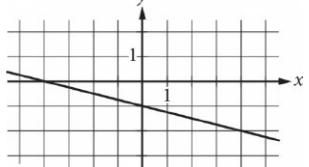
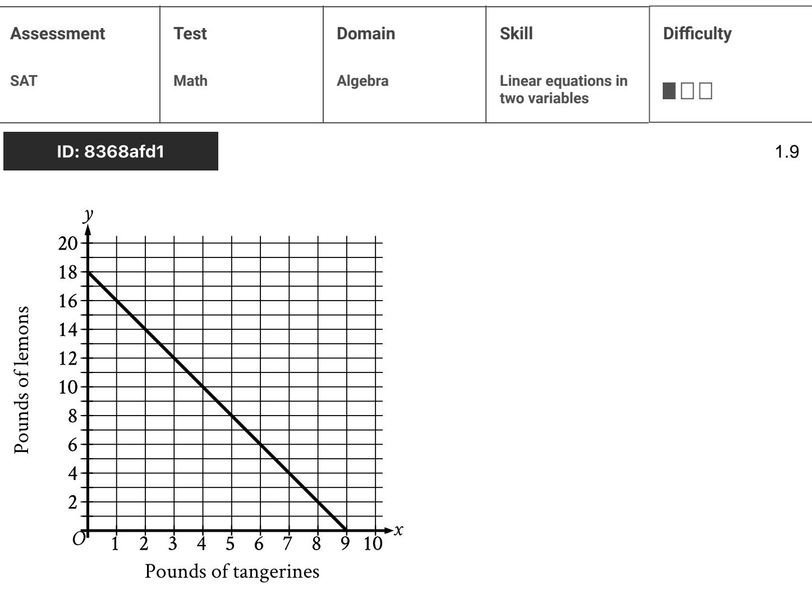
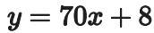
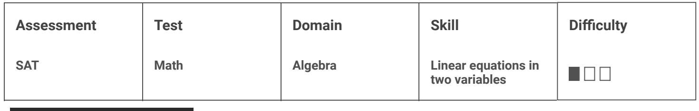
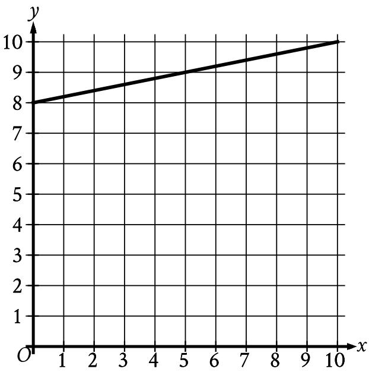
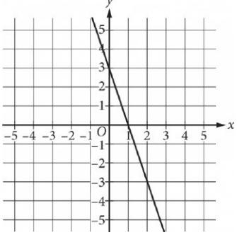

{0}------------------------------------------------

# Question ID ee846db7

| Assessment | Test | Domain  | Skill                                | Difficulty |
|------------|------|---------|--------------------------------------|------------|
| SAT        | Math | Algebra | Linear equations in two variables |            |
|            |      |         |                                      |            |

1.1

## ID: ee846db7

A store sells two different-sized containers of a certain Greek yogurt. The store's sales of this Greek yogurt totaled 1,277.94 dollars last month. The equation 5,48x + 7,30y = 1,277.94 represents this situation, where a is the number of smaller containers sold and y is the number of larger containers sold. According to the equation, which of the following represents the price, in dollars, of each smaller container?

A. 5.48

B. 7.30y

c. 7.30

D. 5.48x

#### ID: ee846db7 Answer

Correct Answer: A

Rationale

Choice A is correct. It's given that the store's sales of a certain Greek yogurt totaled 1,277.94 dollars last month. It's also given that the equation 5.48x + 7.30y = 1.277.94 represents this situation, where x is the number of smaller containers sold and y is the number of larger containers sold. Since & represents the number of smaller containers of yogurt sold, the expression 5.48x represents the total sales, in dollars, from smaller containers of yogurt. This means that x smaller containers of yourt were sold at a price of 5,48 dollars each. Therefore, according to the equation, 5.48 represents the price, in dollars, of each smaller container.

Choice B is incorrect. This expression represents the total sales, in dollars, from selling y larger containers of yogurt.

Choice C is incorrect. This value represents the price, in dollars, of each larger container of yogurt.

Choice D is incorrect. This expression represents the total sales, in dollars, from selling of smaller containers of yoqurt.

{1}------------------------------------------------

## Question ID 5b8a8475

| Assessment | Test | Domain  | Skill                                | Difficulty |
|------------|------|---------|--------------------------------------|------------|
| SAT        | Math | Algebra | Linear equations in two variables |            |
|            |      |         |                                      |            |

ID: 5b8a8475

1.2

Line k is defined by y = 3x + 15. Line j is perpendicular to line k in the xy-plane. What is the slope of line ỷ?

## ID: 5b8a8475 Answer

Correct Answer: A

Rationale

Choice A is correct. It's given that line ; is perpendicular to line & in the xy-plane. It follows that the slope of line j is the opposite reciprocal of the k. The equation for line k is written in slope-intercept form y = mx + b, where m is the slope of the line and b is the y-intercept of the line. It follows that the slope of line k is 3. The opposite reciprocal of a number is —1 divided by the number. Thus, the opposite reciprocal of 3 is - 3 . Therefore, the slope of line j is - 1

Choice B is incorrect and may result from conceptual or calculation errors.

Choice C is incorrect and may result from conceptual or calculation errors.

Choice D is incorrect and may result from conceptual or calculation errors.

{2}------------------------------------------------

# Question ID b23bba4c

| SAT Algebra Linear equations in Math two variables | Assessment | Test | Domain | Skill | Difficulty |
|----------------------------------------------------------------|------------|------|--------|-------|------------|
|                                                                |            |      |        |       |            |

#### ID: b23bba4c

3a+4b=25

A shipping company charged a customer \$25 to ship some small boxes and some large boxes. The equation above represents the relationship between a, the number of small boxes, and b, the number of large boxes, the customer had shipped. If the customer had 3 small boxes shipped, how many large boxes were shipped?

| A. 3 |  |
|------|--|
| B. 4 |  |
| C. 5 |  |
| D. 6 |  |

#### ID: b23bba4c Answer

Correct Answer: B

Rationale

Choice B is correct. It's given that a represents the number of small boxes and b represents the number of large boxes the customer had shipped. If the customer had 3 small boxes shipped, then n = 3. Substituting 3 for a in the equation 3a +4b =25 yields 3(3) +4b =25 or 9 + 4b = 25. Subtracting 9 from both sides of the equation yields 4b = 16. Dividing both sides of this equation by 4 yields b = 4. Therefore, the customer had 4 large boxes shipped.

Choices A, C, and D are incorrect. If the number of large boxes shipped is 3, then b = 3. Substituting 3 for b in the given equation yields 3a+4(3) = 25 or 3a+12 = 25. Subtracting 12 from both sides of the equation and 13 13 then dividing by 3 yields a = = 3 . However, it's given that the number of small boxes shipped, a, is 3, not 3 so b cannot equal 3. Similarly, if b = 5 or b = 6, then ( = = 3 or a = 3 , respectively, which is also not true.

Question Difficulty: Easy

1.3

{3}------------------------------------------------

# Question ID 87322577

| Assessment  | Test | Domain  | Skill                                | Difficulty |
|-------------|------|---------|--------------------------------------|------------|
| SAT Math |      | Algebra | Linear equations in two variables | 101        |

1.4

#### ID: 87322577

x+y=75

The equation above relates the number of minutes, x, Maria spends running each day and the number of minutes, y, she spends biking each day. In the equation, what does the number 75 represent?

- A. The number of minutes spent running each day
- B. The number of minutes spent biking each day
- C. The total number of minutes spent running and biking each day
- D. The number of minutes spent biking for each minute spent running

#### ID: 87322577 Answer

Correct Answer: C

Rationale

Choice C is correct. Maria spends x minutes running each day and y minutes biking each day. Therefore, x + v represents the total number of minutes Maria spent running and biking each day. Because x + y = 75, it follows that 75 is the total number of minutes that Maria spent running and biking each day.

Choices A and B are incorrect. The number of minutes Maria spent running each day is represented by x and need not be 75. Similarly, the number of minutes that Maria spends biking each day is represented by y and need not be 75. The number of minutes Maria spends running each day and biking each day may vary; however, the total number of minutes she spends each day on these activities is constant and equal to 75. Choice D is incorrect. The number of minutes Maria spent biking for each minute spent running cannot be determined from the information provided.

{4}------------------------------------------------

# Question ID c6b151d4

| Math Algebra Linear equations in SAT two variables | Assessment | Test | Domain | Skill | Difficulty |
|----------------------------------------------------------------|------------|------|--------|-------|------------|
|                                                                |            |      |        |       |            |

1.5

## ID: c6b151d4

A total of 364 paper straws of equal length were used to construct two types of polygons: triangles and rectangles. The triangles and rectangles were constructed so that no two polygons had a common side. The equation 3x + 4y = 364 represents this situation, where x is the number of triangles constructed and y is the number of rectangles constructed. What is the best interpretation of (x, y) = (24, 73) in this context?

A. If 24 triangles were constructed, then 73 rectangles were constructed.

- B. If 24 triangles were constructed, then 73 paper straws were used.
- C. If 73 triangles were constructed, then 24 rectangles were constructed.
- D. If 73 triangles were constructed, then 24 paper straws were used.

#### ID: c6b151d4 Answer

Correct Answer: A

Rationale

Choice A is correct. It's given that 364 paper straws of equal length were used to construct triangles and rectangles, where no two polygons had a common side. It's also given that the equation 3x + 4y = 364 represents this situation, where x is the number of triangles constructed and y is the number of rectangles constructed. The equation (x, y) = (24, 73) means that if x = 24, then y = 73. Substituting 24 for x and 73 for y in 3x + 4y = 364 yields 3(24) + 4(73) = 364, or 364 = 364, which is true. Therefore, in this context, the equation (x, y) = (24, 73) means that if 24 triangles were constructed, then 73 rectangles were constructed.

Choice B is incorrect and may result from conceptual errors.

Choice C is incorrect and may result from conceptual errors.

Choice D is incorrect and may result from conceptual errors.

{5}------------------------------------------------

# Question ID 8c98c834

| Assessment | Test | Domain  | Skill                                | Difficulty                                                                                                                                                                     |
|------------|------|---------|--------------------------------------|--------------------------------------------------------------------------------------------------------------------------------------------------------------------------------|
| SAT        | Math | Algebra | Linear equations in two variables | ------------------------------------------------------------------------------------------------------------------------------------------------------------------------------ |

## ID: 8c98c834

1.6

The equation y = 0.1x models the relationship between the number of

different pieces of music a certain pianist practices, y, during an x-minute practice session. How many pieces did the pianist practice if the session lasted 30 minutes?

A. 1

B. 3

C. 10

D. 30

## ID: 8c98c834 Answer

Correct Answer: B

Rationale

Choice B is correct. It's given that the equation y = 0.1 x models the relationship between the number of

different pieces of music a certain pianist practices, y, and the number of minutes in a practice session, x. Since it's given that the session lasted 30 minutes, the number of pieces the pianist practiced can be found by substituting 30 for x in the given equation, which yields y = 0.1(30), or y = 3.

Choices A and C are incorrect and may result from misinterpreting the values in the equation. Choice D is incorrect. This is the given value of x, not the value of y.

{6}------------------------------------------------

## Question ID b2845d88

| Assessment | Test | Domain  | Skill                                | Difficulty |
|------------|------|---------|--------------------------------------|------------|
| SAT        | Math | Algebra | Linear equations in two variables |            |

ID: b2845d88

Which of the following is an equation of the graph shown in the xy-plane above?

$$\text{A. } \chi = -\frac{1}{4}\chi - \mathbb{1}$$

B.y = - x - 4

$$\text{C. } \chi = -\chi - \frac{1}{4}$$

D.y = - 4x - 1

## ID: b2845d88 Answer

Correct Answer: A

Rationale

Choice A is correct. The slope of the line can be found by choosing any two points on the line, such as (4, –2) and (0, -1). Subtracting the y-values results in -2 - (-1) = -1, the change in y. Subtracting the x-values results in 4 – 0 = 4, the change in x. Dividing the change in y by the change in x yields 4 , the slope. The line intersects the y-axis at (0, –1), so –1 is the y-coordinate of the y-intercept. This information can be expressed in slope-intercept form as the equation -

Choice B is incorrect and may result from incorrectly calculating the slope and then misidentifying the slope as the y-intercept. Choice C is incorrect and may result from misidentifying the slope as the y-intercept. Choice D is incorrect and may result from incorrectly calculating the slope.

Question Difficulty: Easy

1.7

{7}------------------------------------------------

# Question ID b450ab03

| Assessment | Test | Domain  | Skill                                | Difficulty |
|------------|------|---------|--------------------------------------|------------|
| SAT        | Math | Algebra | Linear equations in two variables |            |
|            |      |         |                                      |            |

#### ID: b450ab03

1.8

An employee at a restaurant prepares sandwiches and salads. It takes the employee 1,5 minutes to prepare a sandwich and 1.9 minutes to prepare a salad. The employee spends a total of 46.1 minutes preparing x sandwiches and y salads. Which equation represents this situation?

A. 1.9x + 1.5y = 46.1

B. 1.5x + 1.9y = 46.1

C. x + y = 46.1

D. 30.7x + 24.3y = 46.1

#### ID: b450ab03 Answer

Correct Answer: B

#### Rationale

Choice B is correct. It's given that the employee takes 1.5 minutes to prepare a sandwich. Multiplying 1.5 by the number of sandwiches, x, yields 1.5c, the amount of time the employee spends preparing & sandwiches. It's also given that the employee takes 1.9 minutes to prepare a salad. Multiplying 1.9 by the number of salads, y, yields 1.9g, the amount of time the employee spends preparing y salads. It follows that the total amount of time, in minutes, the employee spends preparing x sandwiches and y salads is 1.5m + 1.9g. It's given that the employee spends a total of 46.1 minutes preparing x sandwiches and y salads. Thus, the equation 1.5x + 1.9y = 46.1 represents this situation.

Choice A is incorrect. This equation represents a situation where it takes the employee 1.9 minutes, rather than 1.5 minutes, to prepare a sandwich and 1.5 minutes, rather than 1.9 minutes, to prepare a salad.

Choice C is incorrect. This equation represents a situation where it takes the employee 1 minute, rather than 1.5 minutes, to prepare a sandwich and 1 minute, rather than 1.9 minutes, to prepare a salad.

Choice D is incorrect. This equation represents a situation where it takes the employee 30.7 minutes, rather than 1.5 minutes, to prepare a sandwich and 24.3 minutes, rather than 1.9 minutes, to prepare a salad.

{8}------------------------------------------------

# Question ID 8368afd1

The graph shows the possible combinations of the number of tangerines and lemons that could be purchased for \$18 at a certain store. If Melvin purchased lemons and 4 pounds of tangerines for a total of \$18, how many pounds of lemons did he purchase?

A. 7

- B. 10
- C. 14
- D. 16

## ID: 8368afd1 Answer

Correct Answer: B

## Rationale

Choice B is correct. It's given that the graph shows the possible combinations of the number of pounds of tangerines, x, and the number of pounds of lemons, y, that could be purchased for \$18 at a certain store. If Melvin purchased lemons and 4 pounds of tangerines for a total of \$18, the number of pounds of lemons he purchased is represented by the y-coordinate of the point on the graph where x = 4. For the graph shown, when x = 4, y = 10. Therefore, if Melvin purchased lemons and 4 pounds of tangerines for a total of \$18, then he purchased 10 pounds of lemons.
{9}------------------------------------------------

Choice A is incorrect. This is the number of pounds of tangerines Melvin purchased if he purchased tangerines and 4 pounds of lemons for a total of \$18.

Choice C is incorrect. This is the number of pounds of lemons Melvin purchased lemons and 2 pounds of tangerines for a total of \$18.

Choice D is incorrect. This is the number of pounds of lemons Melvin purchased lemons and 1 pound of tangerines for a total of \$18.

{10}------------------------------------------------

# Question ID 8adf1335

| Assessment | Test | Domain  | Skill                                | Difficulty |
|------------|------|---------|--------------------------------------|------------|
| SAT        | Math | Algebra | Linear equations in two variables |            |
|            |      |         |                                      |            |

#### ID: 8adf1335

1.10

A city's total expense budget for one year was x million dollars. The city budgeted y million dollars for departmental expenses and 201 million dollars for all other expenses. Which of the following represents the relationship between x and y in this context?

A. x+y=201

B.x-y=201

C. 2x-y = 201

D.y-x=201

#### ID: 8adf1335 Answer

Correct Answer: B

Rationale

Choice B is correct. Of the city's total expense budget for one year, the city budgeted y million dollars for departmental expenses and 201 million dollars for all other expenses. This means that the expression y + 201

represents the total expense budget, in millions of dollars, for one year. It's given that the total expense budget for one year is x million dollars. It follows then that the expression y + 201 is equivalent to x, or y + 201 = x. Subtracting y from both sides of this equation yields 201 = x −y. By the symmetric property of equality, this is the same as x - y = 201

Choices A and C are incorrect. Because it's given that the total expense budget for one year, x million dollars, is comprised of the departmental expenses, y million dollars, and all other expenses, 201 million dollars, the expressions x + y and 2x - y both must be equivalent to a value greater than 201 million dollars. Therefore, the equations x + y = 201and 2x -y = 201aren't true. Choice D is incorrect. The value of x must be greater than the value of y. Therefore, y - x = 201 can't represent this relationship.

{11}------------------------------------------------

# Question ID dd797fe2

| Assessment | Test | Domain  | Skill                                | Difficulty |
|------------|------|---------|--------------------------------------|------------|
| SAT        | Math | Algebra | Linear equations in two variables |            |

1.11

#### ID: dd797fe2

4x+3y=24

Mario purchased 4 binders that cost x dollars each and 3 notebooks that cost y dollars each. If the given equation represents this situation, which of the following is the best interpretation of 24 in this context?

A. The total cost, in dollars, for all binders purchased

- B. The total cost, in dollars, for all notebooks purchased
- C. The total cost, in dollars, for all binders and notebooks purchased

D. The difference in the total cost, in dollars, between the number of binders and notebooks purchased

#### ID: dd797fe2 Answer

Correct Answer: C

#### Rationale

Choice C is correct. Since Mario purchased 4 binders that cost x dollars each, the expression 4x represents the total cost, in dollars, of the 4 binders he purchased 3 notebooks that cost y dollars each, the expression 3y represents the total cost, in dollars, of the 3 notebooks he purchased. Therefore, the expression 4x +3y represents the total cost, in dollars, for all binders and notebooks he purchased. In the given equation, the expression 4x + 3y is equal to 24. Therefore, it follows that 24 is the total cost, in dollars, for all binders and notebooks purchased.

Choice A is incorrect. This is represented by the expression 4x in the given equation. Choice B is incorrect. This is represented by the expression 3y in the given equation. Choice D is incorrect. This is represented by the expression | 4x - 3y

{12}------------------------------------------------

# Question ID 789975b7

| Algebra SAT Math Linear equations in | Domain Skill | Difficulty |  | Test | Assessment |
|-----------------------------------------------|-----------------|------------|--|------|------------|
|                                               | two variables   |            |  |      |            |

### ID: 789975b7

1.12

A gardener buys two kinds of fertilizer. Fertilizer A contains 60% filler materials by weight and Fertilizer B contains 40% filler materials by weight. Together, the fertilizers bought by the gardener contain a total of 240 pounds of filler materials. Which equation models this relationship, where x is the number of pounds of Fertilizer A and y is the number of pounds of Fertilizer B?

A. 0.4x +0.6y =240

B. 0.6x +0.4y =240

C. 40x +60y = 240

D. 60x + 40y = 240

#### ID: 789975b7 Answer

Correct Answer: B

Rationale

Choice B is correct. Since Fertilizer A contains 60% filler materials by weight, it follows that x pounds of Fertilizer A consists of 0.6x pounds of filler materials. Similarly, y pounds of Fertilizer B consists of 0.4y pounds of filler materials. When x pounds of Fertilizer A and y pounds of Fertilizer B are combined, the result is 240 pounds of filler materials. Therefore, the total amount, in pounds, of filler materials in a mixture of x pounds of Fertilizer A and y pounds of Fertilizer B can be expressed as 0.6x +0.4y = 240.

Choice A is incorrect. This choice transposes the percentages of filler materials for Fertilizer B. Fertilizer A consists of 0.6x pounds of filler materials and Fertilizer B consists of 0.4y pounds of filler materials. Therefore, 0,6x +0,4y is equal to 240, not 0,4x +0,6y. Choice C is incorrect. This choice transposes the percentages of filler materials for Fertilizer B and incorrectly represents how to take the percentage of a value mathematically. Choice D is incorrect. This choice incorrectly represents how to take the percentage of a value mathematically. Fertilizer A consists of 0.6x pounds of filler materials, not 60x pounds of filler materials, and Fertilizer B consists of 0.4y pounds of filler materials, not 40y pounds of filler materials.

{13}------------------------------------------------

## Question ID 2554b413

| Assessment | Test | Domain  | Skill                                | Difficulty |
|------------|------|---------|--------------------------------------|------------|
| SAT        | Math | Algebra | Linear equations in two variables |            |

#### ID: 2554b413

1.13

In the xy-plane, a line has a slope of 6 and passes through the point (0,8).

Which of the following is an equation of this line?

A. y = 6x + 8

B.y =6x+48

C. y = 8x + 6

D. y = 8x + 48

#### ID: 2554b413 Answer

Correct Answer: A

Rationale

Choice A is correct. The slope-intercept form of an equation for a line is y = mx + b, where m is the slope of the line and b is the y-coordinate of the y-intercept of the line. It's given that the slope is 6, so m = 6. I's also given that the line passes through the point (0,8) on the y-axis, so b = 8. Substituting m = 6 and h = 8 into the equation y = mx + b gives y = 6x + 8

Choices B, C, and D are incorrect and may result from misinterpreting the slope-intercept form of an equation of a line.

{14}------------------------------------------------

## Question ID 52a8ef85

| SAT Math Algebra Linear equations in two variables | Assessment | Test | Domain | Skill | Difficulty |
|----------------------------------------------------------------|------------|------|--------|-------|------------|
|                                                                |            |      |        |       |            |

### ID: 52a8ef85

1.14

The equation 40ന + 20y = 160 represents the number of sweaters, x, and number of shirts, y, that Yesenia purchased for \$160. If Yesenia purchased 2 sweaters, how many shirts did she purchase?

| A. 3  |  |  |
|-------|--|--|
| B. 4  |  |  |
| C. 8  |  |  |
| D. 40 |  |  |
|       |  |  |

ID: 52a8ef85 Answer

Correct Answer: B

Rationale

Choice B is correct. It's given that the equation 40x + 20y = 160 represents the number of sweaters, a, and the number of shirts, y, that Yesenia purchased for \$160. If Yesenia purchased 2 sweaters, the number of shirts she purchased can be calculated by substituting 2 for x in the given equation, which yields 40(2) + 20y = 160, or 80 + 20y = 160. Subtracting 80 from both sides of this equation yields 20y = 80. Dividing both sides of this equation by 20 yields y = 4. Therefore, if Yesenia purchased 2 sweaters, she purchased 4 shirts.

Choice A is incorrect and may result from conceptual or calculation errors.

Choice C is incorrect. This is the number of shirts Yesenia purchased if she purchased 0 sweaters.

Choice D is incorrect. This is the price, in dollars, for each sweater, not the number of shirts Yesenia purchased.

{15}------------------------------------------------

# Question ID dfa45424

| SAT Math Algebra Linear equations in two variables | Assessment | Test | Domain | Skill | Difficulty |
|----------------------------------------------------------------|------------|------|--------|-------|------------|
|                                                                |            |      |        |       |            |

### ID: dfa45424

1.15

Tony spends \$80 per month on public transportation. A 10-ride pass costs \$12.50, and a single-ride pass costs \$1.50. If g represents the number of 10-ride passes Tony buys in a month and t represents the number of singleride passes Tony buys in a month, which of the following equations best represents the relationship between g and t ?

A.g+t=80

B. g + t = 1.50 + 12.50

C. 1.50g + 12.50t = 80

D. 12.50g +1.50t = 80

#### ID: dfa45424 Answer

Correct Answer: D

Rationale

Choice D is correct. Since a 10-ride pass costs \$12.50 and g is the number of 10-ride passes Tony buys in a month, the expression 12.50q represents the amount Tony spends on 10-ride passes in a month. Since a

single-ride pass costs \$1.50 and t is the number of single-ride passes Tony buys in a month, the expression 1.50f represents the amount Tony spends on single-ride passes in a month. Therefore, the sum

12.50g + 1.50t represents the amount he spends on the two types of passes in a month. Since Tony spends a

total of \$80 on passes in a month, this expression can be set equal to 80, producing 12.50g + 1.50t = 80.

Choices A and B are incorrect. The expression q + f represents the total number of the two types of passes Tony buys in a month, not the amount Tony spends, which is equal to 80, nor the cost of one of each pass, which is equal to 1.50 + 12.50. Choice C is incorrect and may result from reversing the cost for each type of pass Tony buys in a month.

{16}------------------------------------------------

## Question ID 520e6f5b

| Assessment | Test | Domain  | Skill                                | Difficulty |
|------------|------|---------|--------------------------------------|------------|
| SAT        | Math | Algebra | Linear equations in two variables |            |

ID: 520e6f5b

| Rock type | Weight per volume (lb/ft =) | Cost per pound |
|-----------|--------------------------------|-------------------|
| Basalt    | 180                            | \$0.18            |
| Granite   | 165                            | \$0.09            |
| Limestone | 120                            | \$0.03            |
| Sandstone | 135                            | \$0.22            |

Characteristics for Rock Types

A city is planning to build a rock retaining wall, a monument, and a garden in a park. The table above shows four rock types that will be considered for use in the project. Also shown for each rock type is its weight per volume, in pounds per cubic foot (Ib/ft ), and the cost per pound, in dollars. The equation 0.03(120w)+0.18(180z)+3,385.80 = 7,576.20 gives the total

cost, in dollars, of the rocks used in the project in terms of the number of ff 3 of limestone, w, and the number of ft of basalt, z. All four rock types are used in the project. Which of the following is the best interpretation of 3,385.80 in this context?

- A. The cost of the granite and sandstone needed for the project
- B. The cost of the basalt and limestone needed for the project
- C. The cost of the basalt needed for the project
- D. The cost of the sandstone needed for the project

### ID: 520e6f5b Answer

Correct Answer: A

#### Rationale

Choice A is correct. The table shows the cost of limestone is \$0.03/lb, and the weight per volume for limestone is 120 lb/ft . Therefore, the term 0.03(120W) represents the cost, in dollars, of w ft of limestone. Similarly, the term 0.18(180z) represents the cost, in dollars, of z ft of basalt. The given equation shows that the total cost of all the rocks used in the project is \$7,576.20. Since it's given that all four rock types are used in the

1.16

{17}------------------------------------------------

project, the remaining term, 3,385.80, represents the cost, in dollars, of the granite and sandstone needed for the project.

Choice B is incorrect. The cost of basalt and limestone needed for the project can be represented by 0.18(180z)+0.03(120w). Choice C is incorrect. The cost of the basalt needed for the project can be

represented by the expression 0.18(1802). Choice D is incorrect and may result from neglecting to include granite in the rock types used for the project.
{18}------------------------------------------------

# Question ID b2de69bd

| Assessment           | Test | Domain  | Skill                                | Difficulty |
|----------------------|------|---------|--------------------------------------|------------|
| SAT                  | Math | Algebra | Linear equations in two variables |            |
| ID: h2de69hd 1 17 |      |         |                                      |            |

| X | y  |
|---|----|
| 1 | 5  |
| 2 | 7  |
| 3 | 9  |
| 4 | 11 |

The table above shows some pairs of x values and y values. Which of the following equations could represent the relationship between x and y ?

A. y = 2x + 3

B. y = 3x-2

C. y = 4x - 1

D. y = 5x

### ID: b2de69bd Answer

Correct Answer: A

#### Rationale

Choice A is correct. Each of the choices is a linear equation in the form y = mx + b, where m and b are constants. In this equation, m represents the change in x by 1. From the table, it can be determined that the value of y increases by 2 for each increase in x by 1. In other words, for the pairs of x and y in the given table, m = 2. The value of b can be found by substituting the values of x and y from any row of the table and substituting the value of m into the equation y = mx + b and then solving for b. For example, using x = 1, y = 5, and m = 2 yields 5 = 2(1) + b. Solving for b yields b = 3. Therefore, the equation y = 2x + 3 could represent the relationship between x and y in the given table.

Alternatively, if an equation represents the relationship between x and y, then when each pair of x and y from the table is substituted into the equation, the result will be a true statement. Of the equations given, the equation y = 2x + 3 in choice A is the only equation that results in a true statement when each of the pairs of x and y are substituted into the equation.

Choices B, C, and D are incorrect because when at least one pair of x and y from the table is substituted into the equations given in these choices, the result is a false statement. For example, when the pair x = 4 and y = 11 is substituted into the equation in choice B, the result is 11 = 3(4) - 2, or 11 = 10, which is false.

{19}------------------------------------------------

{20}------------------------------------------------

# Question ID c5479c1a

| Assessment | Test | Domain  | Skill                                | Difficulty |
|------------|------|---------|--------------------------------------|------------|
| SAT        | Math | Algebra | Linear equations in two variables |            |
|            |      |         |                                      |            |

#### ID: c5479c1a

1.18

A shipment consists of 5-pound boxes and 10-pound boxes with a total weight of 220 pounds. There are 13 10pound boxes in the shipment. How many 5-pound boxes are in the shipment?

| A. 5  |  |  |
|-------|--|--|
| B. 10 |  |  |
| C. 13 |  |  |
| D. 18 |  |  |
|       |  |  |

ID: c5479c1a Answer

Correct Answer: D

Rationale

Choice D is correct. It's given that the shipment consists of 5-pound boxes with a total weight of 220 pounds. Let x represent the number of 5-pound boxes and y represent the number of 10-pound boxes in the shipment. Therefore, the equation 5x + 10y = 220 represents this situation. It's given that there are 13 10-pound boxes in the shipment. Substituting 13 for y in the equation 5x + 10y = 220 yields 5x + 10(13) = 220, or 5x + 130 = 220. Subtracting 130 from both sides of this equation yields 5x = 90. Dividing both sides of this equation by 5 yields 18. Thus, there are 18 5-pound boxes in the shipment.

Choice A is incorrect and may result from conceptual or calculation errors.

Choice B is incorrect and may result from conceptual or calculation errors.

Choice C is incorrect. This is the number of 10-pound boxes in the shipment.

{21}------------------------------------------------

# Question ID 1efd8202

ID: 1efd8202

| Assessment | Test | Domain  | Skill                                | Difficulty |
|------------|------|---------|--------------------------------------|------------|
| SAT        | Math | Algebra | Linear equations in two variables |            |
|            |      |         |                                      |            |

1.19

Which table gives three values of x and their corresponding values of y for the given equation?

|    | દ   | y   |
|----|-----|-----|
|    | 0   | 8   |
|    | 2   | 148 |
|    | 4   | 288 |
| B. | L   | y   |
|    | 0   | 70  |
|    | 2   | 78  |
|    | 4   | 86  |
| C. | ప్ర | y   |
|    | 0   | 70  |
|    | 2   | 140 |
|    | 4   | 280 |
| D. | ప్ర | y   |
|    | 0   | 8   |
|    | 2   | 132 |
|    | 4   | 272 |

### ID: 1efd8202 Answer

Correct Answer: A

Rationale

Choice A is correct. Each of the given choices gives three values of x: 0, 2, and 4. Substituting 0 for a in the given equation yields y = 70(0) + 8, or y = 8. Therefore, when x = 0, the corresponding value of y for the given equation is 8. Substituting 2 for x in the given equation yields y = 70(2) + 8, or y = 148. Therefore, when x = 2, the corresponding value of y for the given equation is 148. Substituting 4 for x in the given

{22}------------------------------------------------

equation yields y = 70(4) + 8, or y = 288. Therefore, when x = 4, the corresponding value of y for the given equation is 288. Thus, if the three values of x are 0, 2, and 4, then their corresponding values of y are 8, 148, and 288, respectively, for the given equation.

Choice B is incorrect. This table gives three values of x and their corresponding values of y for the equation y = 4x + 70.

Choice C is incorrect and may result from conceptual or calculation errors.

Choice D is incorrect and may result from conceptual or calculation errors.

{23}------------------------------------------------

# Question ID b9839f9e

|             | Domain  | Skill                                | Difficulty |
|-------------|---------|--------------------------------------|------------|
| Math SAT | Algebra | Linear equations in two variables |            |

### ID: b9839f9e

F=2.50x+7.00y

In the equation above, F represents the total amount of money, in dollars, a food truck charges for x drinks and y salads. The price, in dollars, of each drink is the same, and the price, in dollars, of each salad is the same. Which of the following is the best interpretation for the number 7.00 in this context?

A. The price, in dollars, of one drink

- B. The price, in dollars, of one salad
- C. The number of drinks bought during the day
- D. The number of salads bought during the day

#### ID: b9839f9e Answer

Correct Answer: B

Rationale

Choice B is correct. It's given that 2.50x + 7.00y is equal to the total amount of money, in dollars, a food truck charges for x drinks and y salads. Since each salad has the same price, it follows that the total charge for y

salads is 7.00y dollars. When y = 1, the value of the expression 7.00 x 1, or 7.00 x 1, or 7.00. Therefore, the price for one salad is 7.00 dollars.

Choice A is incorrect. Since each drink has the same price, it follows that the total charge for x drinks is 2,50x

dollars. Therefore, the price, in dollars, for one drink is 2.50, not 7.00. Choices C and D are incorrect. In the given equation, F represents the total charge, in dollars, when x drinks and y salads are bought at the food truck. No information is provided about the number of drinks or the number of salads that are bought during the day. Therefore, 7.00 doesn't represent either of these quantities.

Question Difficulty: Easy

1.20

{24}------------------------------------------------

# Question ID f40552a9

1.21

## ID: f40552a9

What is the y-intercept of the line graphed?

A. (0, -8)

- B. (0, 1)
- c. (0,0)
- D. (0,8)

### ID: f40552a9 Answer

Correct Answer: D

Rationale

Choice D is correct. The y-intercept of a line graphed in the xy-plane is the line intersects the y-axis. The line graphed intersects the y-axis at the point (0, 8). Therefore, the y-intercept of the line graphed is (0,8).

Choice A is incorrect and may result from conceptual errors.

Choice B is incorrect and may result from conceptual errors.

Choice C is incorrect and may result from conceptual errors.

{25}------------------------------------------------

{26}------------------------------------------------

# Question ID 12ae3452

| Assessment   | Test | Domain  | Skill                                | Difficulty |
|--------------|------|---------|--------------------------------------|------------|
| SAT          | Math | Algebra | Linear equations in two variables |            |
| ID: 12ae3452 |      |         |                                      | 1.22       |

The equation 46 = 2a + 2b gives the relationship between the side lengths @ and b of a certain parallelogram. If α = 9, what is the value of b?

#### ID: 12ae3452 Answer

Correct Answer: 14

Rationale

The correct answer is 14. It's given that the equation 46 = 2a + 26 gives the relationship between the side lengths a and b of a certain parallelogram. Substituting 9 for a in the given equation yields 46 = 2(9) + 20, or 46 = 18 + 26. Subtracting 18 from both sides of this equation yields 28 = 26. Dividing both sides of this equation by 2 yields 14 = b. Therefore, if a = 9, the value of b is 14.
{27}------------------------------------------------

# Question ID 8b2a2a63

| Assessment   | Test | Domain  | Skill                                | Difficulty |
|--------------|------|---------|--------------------------------------|------------|
| SAT          | Math | Algebra | Linear equations in two variables |            |
| ID: 8b2a2a63 |      |         |                                      | 1.23       |

The y-intercept of the graph of y = −6x − 32 in the xy-plane is (0, y). What is the value of ു?

## ID: 8b2a2a63 Answer

Correct Answer: -32

Rationale

The correct answer is –32. It's given that the y-intercept of the graph of y = –6x – 32 is (0, y). Substituting 0 for x in this equation yields y = - 6(0) - 32, or y = - 32. Therefore, the value of y that corresponds to the yintercept of the graph of y = - 6x - 32 in the xy-plane is -32.

{28}------------------------------------------------

# Question ID 8a1544f1

| Assessment | Test | Domain  | Skill                                | Difficulty |
|------------|------|---------|--------------------------------------|------------|
| SAT        | Math | Algebra | Linear equations in two variables |            |

## ID: 8a1544f1

What is the equation of the line shown in the xy-plane above?

A.y =3x-3

B.y = - 3x + 3

$$\text{C. } \lambda = \frac{3}{1}\lambda - 3$$

$$\mathbf{p} \cdot \mathbf{\hat{n}} = -\frac{1}{3}\mathbf{\hat{x}} + \mathbf{\hat{z}}$$

#### ID: 8a1544f1 Answer

Correct Answer: B

#### Rationale

Choice B is correct. Any line in the xy-plane can be defined by an equation in the form y = mx + b, where m is the slope of the line and b is the y-coordinate of the y-intercept of the line. From the graph, the y-intercept of the line is (0,3). Therefore, b = 3. The slope of the change in the value of y divided by the change in the value of x for any two points on the line. The line shown passes through (0, 3) and (1, 0), so 1 , or m = - 3. Therefore, the equation of the line is y = - 3x + 3.

Choices A and C are incorrect because the equations qiven in these choices represent a line with a positive slope. However, the line shown has a negative slope. Choice D is incorrect because the equation given in this 3 . However, the line shown has a slope of −3. choice represents a line with slope of

Question Difficulty: Easy

1.24

{29}------------------------------------------------

# Question ID 535fa6e6

| Assessment | Test | Domain  | Skill                                | Difficulty |
|------------|------|---------|--------------------------------------|------------|
| SAT        | Math | Algebra | Linear equations in two variables |            |
|            |      |         |                                      |            |

#### ID: 535fa6e6

1.25

Davio bought some potatoes and celery. The potatoes cost \$0.69 per pound, and the celery cost \$0.99 per pound. If Davio spent \$5.34 in total and bought twice as many pounds of celery as pounds of potatoes, how many pounds of celery did Davio buy?

| 1 1 1 |
|-------------|
|-------------|

B. 2.5

C. 2.67

D. 4

### ID: 535fa6e6 Answer

Correct Answer: D

### Rationale

Choice D is correct. Let prepresent the number of pounds of potatoes and let c represent the number of pounds of celery that Davio bought. It's qiven that potatoes cost \$0.69 per pound and celery costs \$0.99 per pound. If Davio spent \$5.34 in total, then the equation 0.69p + 0.99c = 5.34 represents this situation. It's also given that Davio bought twice as many pounds of celery as pounds of potatoes; therefore, c = 2p. Substituting 2p for c in the equation 0.69p + 0.99c = 5.34 yields 0.69p + 0.99(2p) = 5.34, which is equivalent to 0.69p + 1.98p = 5.34, or 2.67p = 5.34. Dividing both sides of this equation by 2.67 yields p = 2. Substituting 2 for p in the equation c = 2p yields c = 2(2), or c = 4. Therefore, Davio bought 4 pounds of celery.

Choice A is incorrect. This is the number of pounds of potatoes, not the number of pounds of celery, Davio bought.

Choice B is incorrect and may result from conceptual or calculation errors.

Choice C is incorrect and may result from conceptual or calculation errors.

{30}------------------------------------------------

# Question ID 39571c77

| Assessment  | Test | Domain  | Skill                                | Difficulty |  |
|-------------|------|---------|--------------------------------------|------------|--|
| SAT         | Math | Algebra | Linear equations in two variables |            |  |
| IA AAEH4 EW |      |         |                                      |            |  |

### ID: 39571c77

1.26

Naomi bought both rabbit snails for a total of \$52. Each rabbit snail costs \$8 and each nerite snail costs \$6 . If Naomi bought 2 nerite snails, how many rabbit snails did she buy?

- A. 5
- B. 12
- C. 14
- D. 50

## ID: 39571c77 Answer

#### Correct Answer: A

#### Rationale

Choice A is correct. Let x represent the number of rabbit snails that Naomi bought. It's given that each rabbit snail costs \$ 8. Therefore, the total cost, in dollars, of the rabbit snails that Naomi bought can be repression 8x. It's also given that each nerite snail costs \$ 6, and that Naomi bought 2 nerite snails. Therefore, the total cost, in dollars, of the nerite snails that Naomi bought is 62, or 12. Since Naomi bought both the nerite snails for a total of \$ 52, the equation 8x + 12 = 52 can be used to represent the situation. Subtracting 12 from both sides of this equation yields 8x = 40. Dividing both sides of this equation by 8 yields x = 5. Therefore, Naomi bought 5 rabbit snails.

Choice B is incorrect. This is the total cost, in dollars, of the nerite snails that Naomi bought, not the number of rabbit snails.

Choice C is incorrect. This is the cost, in dollars, of one rabbit snail, not the number of rabbit snails that Naomi bought.

Choice D is incorrect and may result from conceptual or calculation errors.

{31}------------------------------------------------

# Question ID 1fe778dc

| Assessment   | Test | Domain  | Skill                                | Difficulty |
|--------------|------|---------|--------------------------------------|------------|
| SAT          | Math | Algebra | Linear equations in two variables |            |
| ID: 1fe778dc |      |         |                                      |            |

1.27

A line in the xy-plane has a slope of — 2 and passes through the point (0, 3). Which equation represents this line?

A. y = B. y C. U D. y =

## ID: 1fe778dc Answer

#### Correct Answer: B

#### Rationale

Choice B is correct. A line in the xy-plane with a slope of m and a y-intercept of 0, b can be represented by the equation y = mx + b. It's given that the line has a slope of -- Therefore, m = - - . It's also given that the line passes through the point 0, 3. Therefore, b = 3. Substituting -- for m and 3 for b in the equation y = mx + b yields y = =x + 3. Therefore, the equation + 3 represents this line.

Choice A is incorrect. This equation represents a line in the xy-plane that passes through the point 0, - 3, not 0, 3.

Choice C is incorrect. This equation represents a line in the xy-plane that has a slope of -, not -- and passes through the point 0, - 3, not 0, 3.

-1-Choice D is incorrect. This equation represents a line in the xy-plane that has a slope of -, not

{32}------------------------------------------------

# Question ID 6a12efbb

| Assessment | Test | Domain  | Skill                                | Difficulty |
|------------|------|---------|--------------------------------------|------------|
| SAT        | Math | Algebra | Linear equations in two variables | 0000       |
|            |      |         |                                      |            |

## ID: 6a12efbb

1.28

The equation 46 = 2x + 2y gives the perimeter of a rectangular rug that has length x, in feet. The width of the rug is 8 feet. What is the length, in feet, of the rug?

### ID: 6a12efbb Answer

Correct Answer: 15

#### Rationale

The correct answer is 15. It's given that the equation 46 = 2x + 2y gives the perimeter of a rectangular rug that has length x, in feet, and width y, in feet. It's also given that the width of the rug is 8 feet. Substituting 8 for y in the equation 46 = 2x + 2y yields 46 = 2x + 28, or 46 = 2x + 16. Subtracting 16 from both sides of this equation yields 30 = 2x. Dividing both sides of this equation by 2 yields 15 = x. Since x represents the length, in feet, of the rug, it follows that the length of the rug is 15 feet.

{33}------------------------------------------------

# Question ID d1042cf8

| Math Algebra Linear equations in SAT two variables | Assessment | Test | Domain | Skill | Difficulty |
|----------------------------------------------------------------|------------|------|--------|-------|------------|
|                                                                |            |      |        |       |            |

### ID: d1042cf8

1.29

A food truck buys forks for \$0.04 each and plates for \$0.48 each. The total cost of £7 forks and y plates is \$661.76. Which equation represents this situation?

- A. 0.48x 0.04y = 661.76
- B. 0.04x 0.48y = 661.76
- C. 0.48x + 0.04y = 661.76
- D. 0.04x + 0.48y = 661.76

### ID: d1042cf8 Answer

#### Correct Answer: D

#### Rationale

Choice D is correct. It's given that the food truck buys forks for \$ 0.04 each. Therefore, the cost, in dollars, of x forks can be represented by the expression 0.04x. It's also given that the food truck buys plates for \$ 0.48 each. Therefore, the cost, in dollars, of y plates can be represented by the expression 0.48y. Since the total cost of x forks and y plates is \$ 661.76, the equation 0.04x + 0.48y = 661.76 represents this situation.

Choice A is incorrect and may result from conceptual or calculation errors.

Choice B is incorrect and may result from conceptual or calculation errors.

Choice C is incorrect. This equation represents a situation in which the food truck buys forks for \$ 0.48 each and plates for \$ 0.04 each.