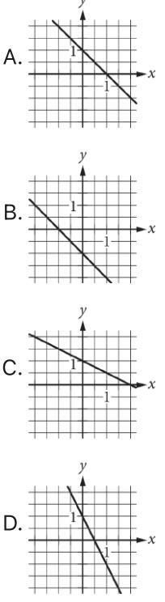
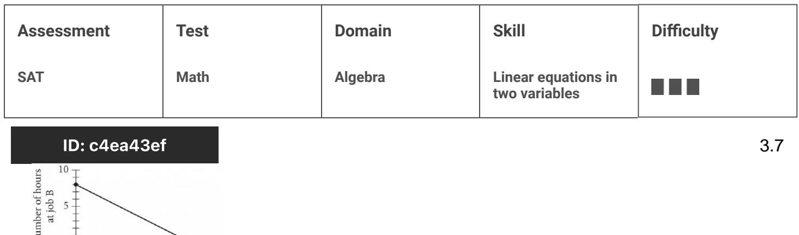
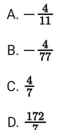
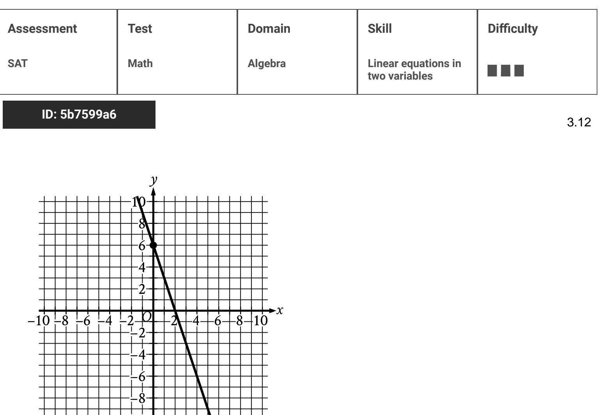
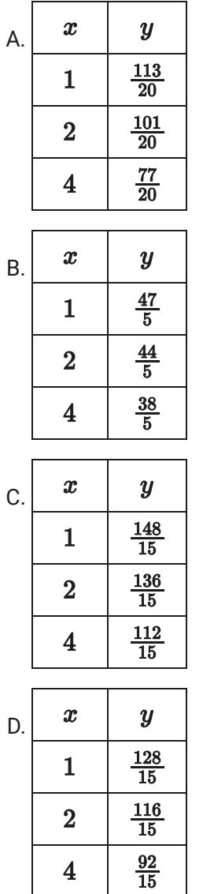

{0}------------------------------------------------

# Question ID 3cdbf026

|             |         |                                      | Difficulty |
|-------------|---------|--------------------------------------|------------|
| SAT Math | Algebra | Linear equations in two variables |            |

### ID: 3cdbf026

3.1

The graph of the equation ax + ky = 6 is a line in the xy-plane, where a and k are constants. If the line contains the points (-2,-6)and (0,-3), what is the value of k ?

- A. 2
- B. -1
- c. 2
- D. 3

ID: 3cdbf026 Answer

Correct Answer: A

Rationale

Choice A is correct. The value of k can be found using the slope-intercept form of a linear equation, y = mx + b, where m is the slope and b is the y-coordinate of the y-intercept. The equation ax + ky = 6 can be ax 6 rewritten in the form k . One of the given points, (0, - 3), is the y-intercept. Thus, the yk 6 coordinate of the y-intercept = 3 must be equal to k . Multiplying both sides by k gives – 3k = 6. Dividing both sides by —3 gives k = – 2

Choices B, C, and D are incorrect and may result from errors made rewriting the given equation.

{1}------------------------------------------------

## Question ID fdee0fbf

| Assessment   | Test | Domain  | Skill                                | Difficulty |
|--------------|------|---------|--------------------------------------|------------|
| SAT          | Math | Algebra | Linear equations in two variables |            |
| ID: fdeeOfbf |      |         |                                      | 3.2        |

In the xy-plane, line k intersects the y-axis at the point (0, 一6) and passes through the point (2, 2). If the point (20, w) lies on line k, what is the value

#### ID: fdeeOfbf Answer

#### Rationale

of w ?

The correct answer is 74. The y-intercept of a line in the xy-plane is the ordered pair (X,y) of the point of intersection of the line with the y-axis. Since line k intersects the y-axis at the point (0, —6), it follows that (0, - 6) is the y-intercept of this line. An equation of any line in the xy-plane can be written in the form y = mx + b, where m is the slope of the line and b is the y-coordinate of the y-intercept. Therefore, the equation of line k can be written as y = mx + ( − 6), or y = mx − 6. The value of m can be found by substituting the x- and y-coordinates from a point on the line, such as (2,2), for x and y, respectively. This results in 2 = 2m - 6. Solving this equation for m gives m = 4. Therefore, an equation of line k is y = 4x - 6. The value of w can be found by substituting the x-coordinate, 20, for x in the equation of line k and solving this equation for y. This gives y = 4(20) - 6, or y = 74. Since w is the y-coordinate of this point, w = 74.

{2}------------------------------------------------

## Question ID 0b46bad5

| Assessment   | Test | Domain  | Skill                                | Difficulty |
|--------------|------|---------|--------------------------------------|------------|
| SAT          | Math | Algebra | Linear equations in two variables |            |
| ID: 0b46bad5 |      |         |                                      | 3.3        |

ax + by = b

In the equation above, a and b are constants and () ≤ α < ή. Which of the

following could represent the graph of the equation in the xy-plane?

### ID: 0b46bad5 Answer

Correct Answer: C

Rationale

Choice C is correct. The given equation ax + by = b can be rewritten in slope-intercept form, y = mx + k where m represents the slope of the line represented by the equation, and k represents the y-coordinate of the y-intercept of the line. Subtracting ax from both sides of the equation yields by = — αχ + ή, and dividing both -x++
To x + b , or y = sides of this equation by b yields y = x + 1. with the equation now in slope-intercept b form, it shows that k = 1, which means the y-coordinate of the y-intercept is 1. It's given that a and b are both a greater than 0 (positive) and that a ≤ b. Since m = = b , the slope of the line must be a value between —1 and 

{3}------------------------------------------------

0. Choice C is the only graph of a line that has a y-value of the y-intercept that is 1 and a slope that is between -1 and 0.

Choices A, B, and D are incorrect because the slopes of the lines in these graphs aren't between — 1 and 0.

{4}------------------------------------------------

# Question ID c362c210

numbers of wallflowers and cornflowers that someone can buy at the Garden Store in order to spend exactly \$24.00 total on the two types of flowers. The price of each wallflower is the same and the price of each cornflower is the same. What is the price, in dollars, of 1 cornflower?

### ID: c362c210 Answer

#### Rationale

The correct answer is 1.5. The point (16,0) corresponds to the situation where 16 cornflowers and 0 wallflowers

are purchased. Since the total spent on the two types of flowers is \$24.00, it follows that the price of 16 cornflowers is \$24.00, and the price of one cornflower is \$1.50. Note that 1.5 and 3/2 are examples of ways to enter a correct answer.

{5}------------------------------------------------

## Question ID 98d3393a

| Assessment | Test | Domain  | Skill                                | Difficulty |
|------------|------|---------|--------------------------------------|------------|
| SAT        | Math | Algebra | Linear equations in two variables |            |

#### ID: 98d3393a

3.5

Line محمد in the xy-plane is perpendicular to the line with equation

x = 2. What is the slope of line £?

A. O

- 1 l B. — 2
C. - 2

D. The slope of line ج is undefined.

### ID: 98d3393a Answer

Correct Answer: A

Rationale

Choice A is correct. It is given that line & is perpendicular to a line whose equation is x = 2. A line whose equation is a constant value of x is vertical, so y must therefore be horizontal. Horizontal lines have a slope of 0, so & has a slope of 0.

1 Choice B is incorrect. A line with slope 2 is perpendicular to a line with slope 2. However, the line with equation x = 2 is vertical and has undefined slope of 2). Choice C is incorrect. A line with slope =2 is T perpendicular to a line with slope 2 . However, the line with equation x = 2 has undefined slope (not slope of l 2 ). Choice D is incorrect; this is the slope of the line x = 2 itself, not the slope of a line perpendicular to it.

{6}------------------------------------------------

# Question ID 0366d965

| Assessment | Test | Domain  | Skill                                | Difficulty |
|------------|------|---------|--------------------------------------|------------|
| SAT        | Math | Algebra | Linear equations in two variables |            |

#### ID: 0366d965

| X  | y  |  |
|----|----|--|
| 3  | 7  |  |
| k  | 11 |  |
| 12 | n  |  |

The table above shows the coordinates of three points on a line in the xyplane, where k and n are constants. If the slope of the line is 2, what is the value of k +n ?

### ID: 0366d965 Answer

Rationale

y2—y1 The correct answer is 30. The slope of a line can be found by using the slope formula, x2 — x7 . It's given that Y2_Y1_ = 2 According to the table, the points (3,7) and (k,11) lie on the
x2 = X1 the slope of the line is 2; therefore, X2-X1 11 - 7 =2. Multiplying both sides of line. Substituting the coordinates of these points into the equation gives k – 3 this equation by k -3 gives 11 - 7 = 2(k - 3), or 11 - 7 = 2k - 6. Solving for k gives k = 5. According to the table, the points (3,7) and (12,n) also lie on the line. Substituting the coordinates of these points into Y2_Y1 =2 gives 12-3
X2-X1 =2. Solving for n gives n =25. Therefore, k+n =5+25, or 30.

Question Difficulty: Hard

3.6

{7}------------------------------------------------

## Question ID c4ea43ef

To earn money for college, Avery works two part-time jobs: A and B. She earns \$10 per hour working at job A and \$20 per hour working at job B. In one week, Avery earned a total of s dollars for working at the two part-time jobs. The graph above represents all possible combinations of numbers of hours Avery could have worked at the two jobs to earn s dollars. What is the value of s ?

- A. 128
- B. 160
- C. 200
- D. 320

#### ID: c4ea43ef Answer

Number of hours at job A

Correct Answer: B

#### Rationale

Choice B is correct. Avery earns \$10 per hour working at job A. Therefore, if she works a hours at job A, she will earn 10a dollars. Avery earns \$20 per hour working at job B. Therefore, if she works b hours at job B, she will earn 20b dollars. The graph shown represents all possible combinations of the number of hours Avery could have worked at the two jobs to earn s dollars. Therefore, if she worked a hours at job B, and earned s dollars from both jobs, the following equation represents the graph: 10a + 20b = s, where s is a constant. Identifying any point (a,b) from the graph and substituting the values of the coordinates for a and b, respectively, in this equation yield the value of s. For example, the point (16,0), where α = 16 and b = 0, lies on the graph. Substituting 16 for a and 0 for b in the equation 10 a + 20b = s yields 10(16) + 20(0) = s, or 160 = s. Similarly, the point (0,8), where a = 0 and b = 8, lies on the graph. Substituting 0 for a and 8 for b in the equation 10a+20b = s yields 10(0)+20(8) = s, or 160 = s.

Choices A, C, and D are incorrect. If the value of s is 128, 200, or 320, then no points (@.b) on the graph will satisfy this equation. For example, if the value of s is 128 (choice A), then the equation 10a + 20b = s becomes 

{8}------------------------------------------------

10a + 20b = 128. The point (16,0), where a = 16 and b = 0, lies on the graph. However, substituting 16 for a and 0 for b in 10 a + 20b = s yields 10(16) + 20(0) = 128, or 160 = 128, which is false. Therefore, (16,0) doesn't satisfy the equation, and so the value of s can't be 128. Similarly, if s = 200 (choice C) or s = 320 (choice D), then substituting 16 for a and 0 for b yields 160 = 200 and 160 = 320, respectively, which are both false.
{9}------------------------------------------------

## Question ID cb58833c

| Assessment | Test | Domain  | Skill                                | Difficulty |
|------------|------|---------|--------------------------------------|------------|
| SAT        | Math | Algebra | Linear equations in two variables |            |

ID: cb58833c

3.8

4 4 is graphed in the xy-plane. What is the x-coordinate of the x-intercept of the line?

## ID: cb58833c Answer

Rationale

The correct answer is 1.25. The y-coordinate of the x-intercept is 0, so 0 can be substituted for y, giving + x +
+ + + . Multiplying both sides of 5 This simplifies to 5 x = 5 sides of 4x = 5 by 4 gives 4 , which is equivalent to 1.25. Note that 1.25 and 5/4 are examples of ways to enter a correct answer.

{10}------------------------------------------------

## Question ID a7a14e87

| Assessment | Test | Domain  | Skill                                | Difficulty |
|------------|------|---------|--------------------------------------|------------|
| SAT        | Math | Algebra | Linear equations in two variables |            |
|            |      |         |                                      |            |

### ID: a7a14e87

3.9

In the xy-plane, line k is defined by x + y = 0. Line j is perpendicular to line k, and the y-intercept of line j is (0,3). Which of the following is an equation

of line j ?

A. x + y = 3

B. x+y = - 3

C. x-y=3

D. x-y = - 3

### ID: a7a14e87 Answer

Correct Answer: D

Rationale

Choice D is correct. It's given that line j is perpendicular to line k is defined by the equation x + y = 0. This equation can be rewritten in slope-intercept form, y = mx + b, where m represents the slope of the line and b represents the y-coordinate of the line, by subtracting x from both sides of the equation, which yields y = _ x. Thus, the slope of line k is = 1. Since line j and line k are perpendicular, their slopes are opposite reciprocals of each other. Thus, the slope of line j is 1. It's given that the y-intercept of line j is (0,3). Therefore, the equation for line j in slope-intercept form is y = x + 3, which can be rewritten as

x-y=-3

Choices A, B, and C are incorrect and may result from conceptual or calculation errors.

{11}------------------------------------------------

## Question ID a1fd2304

| Assessment   | Test | Domain  | Skill                                | Difficulty |
|--------------|------|---------|--------------------------------------|------------|
| SAT          | Math | Algebra | Linear equations in two variables |            |
| ID: a1fd2304 |      |         |                                      | 3.10       |

How many liters of a 25% saline solution must be added to 3 liters of a 10% saline solution to obtain a 15% saline solution?

## ID: a1fd2304 Answer

Rationale

The correct answer is 1.5. The total amount, in liters, of a saline solution can be expressed as the liters of each type of saline solution multiplied by the percent concentration of the saline solution. This gives 3(0.10), x (0.25), and (x + 3)(0.15), where x is the amount, in liters, of 25% saline solution and 10%, 15%, and 25% are represented as 0.10, 0.15, and 0.25, respectively. Thus, the equation 3(0.10) +0.25x = 0.15(x +3) must be true. Multiplying 3 by 0.10 and distributing 0.15 to (x + 3) yields 0.30 +0.25x = 0.15x +0.45. Subtracting 0.15x and 0.30 from each side of the equation gives 0.10x = 0.15. Dividing each side of the equation by 0.10 yields x = 1.5. Note that 1.5 and 3/2 are examples of ways to enter a correct answer.

{12}------------------------------------------------

## Question ID 49800634

| Assessment | Test | Domain  | Skill                                | Difficulty |
|------------|------|---------|--------------------------------------|------------|
| SAT        | Math | Algebra | Linear equations in two variables |            |

### ID: 49800634

| ನ 1 | 1 | A - |
|--------|---|--------|
|        |   |        |
|        |   |        |

| ૧૮ | y  |
|----|----|
| 18 | 48 |
| 7  | 52 |

The table shows two values of x and their corresponding values of y. In the xy-plane, the graph of the linear equation representing this relationship passes through the point ( = , a). What is the value of a?

### ID: 49800634 Answer

#### Correct Answer: D

#### Rationale

Choice D is correct. The linear relationship between x and y can be represented by the equation y = mx + b, where m is the slope of the graph of this equation in the xy-plane and b is the y-intercept. The slope of a line between any two points x1, y, and x2, y, on the line can be calculated using the slope formula m = 2. Based on the table, the graph X2 - X1 contains the points -18, - 48 and 7, 52. Substituting -18, -48 and 7, 52 for ﺩﺭ ﺭﻭ, and 25, y, respectively, in the slope formula yields m = 3-30, which is equivalent to m = 20, or m = 4. Substituting 4 for m, -18 for x, and -48 for y in the equation y = mx + b yields -48 = 4-18 + b, or -48 = - 72 + b. Adding 72 to both sides of this equation yields 24 = b. Therefore, m = 4 and b = 24. Substituting 4 for m and 24 for b in the equation y = mx + 24. Thus, the equation y = 4x + 24 represents the linear relationship between x and y. It's also given that the graph of the linear equation representing this relationship in the xy-plane passes through the point - , a. Substituting - for x and a for y in the equation y = 4.x + 24 yields - 24, which is equivalent to a =

Choice A is incorrect and may result from conceptual or calculation errors.

Choice B is incorrect and may result from conceptual or calculation errors.

Choice C is incorrect and may result from conceptual or calculation errors.

{13}------------------------------------------------

# Question ID 5b7599a6

The graph shows a linear relationship between a and g. Which equation represents this relationship, where II is a positive constant?

- A. Rx + 18y = 36
- B. Rx 18y = 36
- c. 18x + Ry = 36
- D. 18x Ry = 36

## ID: 5b7599a6 Answer

Correct Answer: C

{14}------------------------------------------------

#### Rationale

Choice C is correct. The equation representing the linear relationship shown can be written in slope-intercept form y = mx + b, where m is the slope and 0, b is the y-intercept of the line. The line shown passes through the points 0, 6 and 2,0. Given two points on a line, x, y, and xy, y, the slope of the line can be calculated using the equation m = = 1. Substituting 0,6 and 2,0 for x1, y and x2, y , respectively, in this equation yields m = - , or m = - , or m = - , Since 0, 6 is the y-intercept, it follows that b = 6. Substituting -3 for m and 6 for b in the equation y = mx + b yields y = -3x + 6. Adding 3x to both sides of this equation yields 3x + y = 6. Multiplying this equation by 6 yields 18x + 6y = 36. It follows that the equation 18x + Ry = 36, where R is a positive constant, represents this relationship.

Choice A is incorrect. The graph of this relationship passes through the point 0, 2, not 0, 6.

Choice B is incorrect. The graph of this relationship passes through the point 0, 2, not 0, 6.

Choice D is incorrect. The graph of this relationship passes through the point -2, 0, not 2, 0.

{15}------------------------------------------------

## Question ID 184ce5aa

| Assessment | Test | Domain  | Skill                                | Difficulty |
|------------|------|---------|--------------------------------------|------------|
| SAT        | Math | Algebra | Linear equations in two variables |            |
|            |      |         |                                      |            |

## ID: 184ce5aa

3.13

Line ½ is defined by 글 x + 승y − 70 = 0. Line j is perpendicular to line ½ in the xy-plane. What is the slope of line ½ ?

D.

## ID: 184ce5aa Answer

#### Correct Answer: D

### Rationale

Choice D is correct. It's given that line k is defined by - x + - y - 70 = 0. This equation can be written in slope-intercept form y = mx + b, where m is the slope of line y-coordinate of the y-intercept of line h. Adding 70 to both sides of = 70. Subtracting 2x from both sides of this equation yields -y - 70 = 0 yields -x + + 70. Multiplying both 2x + 490. Therefore, the slope of line ½ is -2. It's given that line j is perpendicular to sides of this equation by 7 yields y line in the xy-plane. Two lines are perpendicular if their slopes are negative reciprocals, meaning that the slope of the first line is equal to -1 divided by the slope of the second line. Therefore, the slope of line j is the negative reciprocal of the slope of line ½. The negative reciprocal of -2 is =, or =. Therefore, the slope of line j is =

Choice A is incorrect. This is the slope of a line in the xy-plane that is parallel, not perpendicular, to line ½.

Choice B is incorrect. This is the reciprocal, not the negative reciprocal, of

Choice C is incorrect. This is the negative, not the negative reciprocal, of

{16}------------------------------------------------

# Question ID d0e614a6

| Assessment | Test | Domain  | Skill                                | Difficulty |
|------------|------|---------|--------------------------------------|------------|
| SAT        | Math | Algebra | Linear equations in two variables |            |

## ID: d0e614a6

3.14

ಳೆ x ½ ½ = 7 Which table gives three values of x and their corresponding values of y for the given equation?

## ID: d0e614a6 Answer

Correct Answer: D

{17}------------------------------------------------

#### Rationale

Choice D is correct. Each of the tables qives the same three values of x: 1, 2, and 4. Substituting 1 for x in the given equation y = 3 Subtracting ද from both sides of this equation yields yields -1 + Therefore, when x = 1, the corresponding value of y for the given equation is =2. Substituting 2 equation by - y = 7, or = + - y = ്ട്. Subtracting - from both sides of this equation yields for x in the given equation yields -2 + Multiplying both sides of this equation by 1 yields y = 15 . Therefore, when x = 2, the corresponding value of y for the given equation is 16. 35 12 from both sides of 34 + . Substituting 4 for x in the given equation yields 7. or Subtracting 23
 Multiplying both sides of this equation by - yields y = this equation yields Therefore, when x = 4, the %. The table in choice D gives x-values of 1, 2, and 4 and corresponding ycorresponding value of y for the given equation is , values of 128, 116 of y for the given equation.

-x + Choice A is incorrect. This table gives three values of x and their corresponding values of y for the equation + v = 7.

Choice B is incorrect. This table gives three values of x and their corresponding values of y for the equation - x + y = 10.

Choice C is incorrect. This table gives three values of x and their corresponding values of y for the equation - - - - - 8.