{0}------------------------------------------------

## Question ID 84664a7c

| Assessment   | Test | Domain  | Skill            | Difficulty |
|--------------|------|---------|------------------|------------|
| SAT          | Math | Algebra | Linear functions |            |
| ID: 8466437c |      |         |                  | 1 1        |

The front of a roller-coaster car is at the bottom of a hill and is 15 feet above the ground. If the front of the roller-coaster car rises at a constant rate of 8 feet per second, which of the following equations gives the height h, in feet, of the front of the roller-coaster car s seconds after it starts up the hill?

A.h =8s+15

$$\mathbf{b} = \mathbf{15s} + \frac{\mathbf{335}}{\mathbf{6}}$$

$$\mathbf{b} = \mathbf{0} \cdot \mathbf{1}$$

$$\mathbf{c}_{\cdots} \quad \cdots \quad \mathbf{15}$$

D. h = 15s +8

### ID: 84664a7c Answer

Correct Answer: A

Rationale

Choice A is correct. It's given that the front of the roller-coaster car starts rising when it's 15 feet above the ground. This initial height of 15 feet can be represented by a constant term, 15, in an equation. Each second, the front of the roller-coaster car rises 8 feet, which can be represented by 8s. Thus, the equation h = 8s + 15 gives

the height, in feet, of the front of the roller-coaster car s seconds after it starts up the hill.

Choices B and C are incorrect and may result from conceptual errors in creating a linear equation. Choice D is incorrect and may result from switching the rate at which the roller-coaster car rises with its initial height.

{1}------------------------------------------------

# Question ID 06fc1726

| Assessment                                                                     | Test                | Domain  | Skill            | Difficulty |  |  |
|--------------------------------------------------------------------------------|---------------------|---------|------------------|------------|--|--|
| SAT                                                                            | Math                | Algebra | Linear functions | ■          |  |  |
|                                                                                | 1.2<br>ID: 06fc1726 |         |                  |            |  |  |
| If f is the function defined by<br>what is the value of ƒ(5) ?<br>a. 3<br>в. Т | 2x-1<br>3<br>1      |         |                  |            |  |  |
| C. 3                                                                           |                     |         |                  |            |  |  |
| D. 9                                                                           |                     |         |                  |            |  |  |
| ID: 06fc1726 Answer                                                            |                     |         |                  |            |  |  |

Correct Answer: C

Rationale

$$\text{Choice C is correct. If } f(\chi) = \frac{2\chi - 1}{3}, \text{ then } f(5) = \frac{2(5) - 1}{3} = \frac{10 - 1}{3} = \frac{9}{3} = 3\frac{1}{3}$$

Choice A is incorrect and may result from not multiplying x by 2 in the numerator. Choice B is incorrect and may result from dividing 2x by 3 and then subtracting 1. Choice D is incorrect and may result from evaluating only the numerator 2x – 1.

{2}------------------------------------------------

## Question ID 6863c7ce

| Assessment   | Test | Domain  | Skill            | Difficulty |
|--------------|------|---------|------------------|------------|
| SAT          | Math | Algebra | Linear functions |            |
| ID: 6863c7ce |      |         |                  | 1.3        |

### d = 16t

The given equation represents the distance d, in inches, where t represents the number of seconds since an object started moving. Which of the following is the best interpretation of 16 in this context?

A. The object moved a total of 16 inches.

B. The object moved a total of 16t inches.

C. The object is moving at a rate of 16 inches per second.

D. The object is moving at a rate of to inches per second.

### ID: 6863c7ce Answer

Correct Answer: C

Rationale

Choice C is correct. It's given that in the equation d = 16t, d represents the distance, in inches, and t represents the number of seconds since an object started moving. In this equation, t is being multiplied by 16. This means that the object's distance increases by 16 inches each second. Therefore, the best interpretation of 16 in this context is that the object is moving at a rate of 16 inches per second.

Choice A is incorrect and may result from conceptual errors.

Choice B is incorrect. This is the best interpretation of 16t, rather than 16, in this context.

Choice D is incorrect and may result from conceptual errors.

{3}------------------------------------------------

# Question ID bf36c815

| Assessment                                  | Test | Domain  | Skill            | Difficulty |  |
|---------------------------------------------|------|---------|------------------|------------|--|
| SAT                                         | Math | Algebra | Linear functions |            |  |
| ID: bf36c815<br>1.4                         |      |         |                  |            |  |
| The function g is defined by g(x) = - x +8. |      |         |                  |            |  |

8

What is the value of g(0)?

ID: bf36c815 Answer

Correct Answer: D

Rationale

A. -8

0

4

B.

C.

D.

Choice D is correct. The value of g(0) is found by substituting 0 for x in the function g. This yields g(0) = -0 +8, which can be rewritten as g(0) = 8.

Choice A is incorrect and may result from misinterpreting the equation as g(x) = x + (−8) instead of g(x) = −x +8. Choice B is incorrect. This is the value of x, not g(x). Choice C is incorrect and may result from calculation errors.

{4}------------------------------------------------

## Question ID 3f5375d9

| Assessment | Test | Domain  | Skill            | Difficulty |
|------------|------|---------|------------------|------------|
| SAT        | Math | Algebra | Linear functions |            |
|            |      |         |                  |            |

1.5

### ID: 3f5375d9

The line graphed in the xy-plane below models the total cost, in dollars, for a cab ride, y, in a certain city during nonpeak hours based on the number of miles traveled, x.

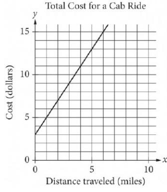

According to the graph, what is the cost for each additional mile traveled, in dollars, of a cab ride?

A. \$2.00

B. \$2.60

C. \$3.00

D. \$5.00

### ID: 3f5375d9 Answer

Correct Answer: A

Rationale

Choice A is correct. The cost of each additional mile traveled is represented by the siven line. The slope of the line can be calculated by identifying two points on the line and then calculating the ratio of the change in y to the change in x between the two points. Using the points (1,5) and (2,7), the slope is equal to

```
7-5
```
2 – 1 , or 2. Therefore, the cost for each additional mile traveled of the cab ride is \$2.00.

Choice B is incorrect and may result from calculating the slope of the line that passes through the points (5,13) and (0,0). However, (0,0) does not lie on the line shown. Choice C is incorrect. This is the y-coordinate

of the y-intercept of the graph and represents the flat fee for a cab ride before the charge for any miles traveled is added. Choice D is incorrect. This value represents the total cost of a 1-mile cab ride.

{5}------------------------------------------------

## Question ID 13294295

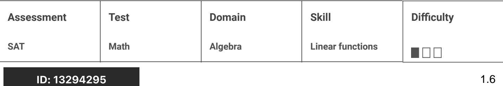

The graph shown models the number of candy bars a certain machine wraps with a label in II seconds.

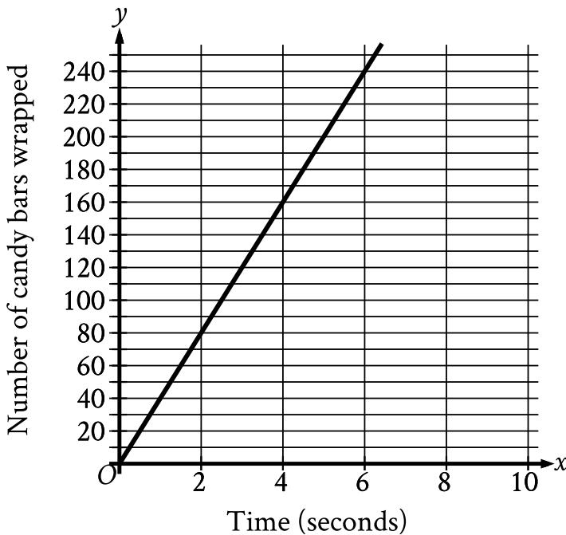

According to the graph, what is the estimated number of candy bars the machine wraps with a label per second?

- A. 2
- B. 40
- c. 78
- D. 80

#### ID: 13294295 Answer

Correct Answer: B

Rationale

Choice B is correct. For the graph shown, the x-axis represents time, in seconds, and the y-axis represents the number of candy bars wrapped. The slope of a line in the xy-plane is the change in y for each 1-unit increase in x. It follows that the slope of the graph shown represents the estimated number of candy bars the machine wraps with a label per second. The slope, m, of a line in the xy-plane can be found using any two points, (v1, y1) and (x2, y2), on the line and the slope formula m = ================================================================================================================ points (0,0) and (2,80). Substituting these points for (2,1,91) and (22,32), respectively, in the slope formula

{6}------------------------------------------------

yields m = the machine wraps with a label per second is 40.

Choice A is incorrect and may result from conceptual or calculation errors.

Choice C is incorrect and may result from conceptual or calculation errors.

Choice D is incorrect and may result from conceptual or calculation errors.

{7}------------------------------------------------

## Question ID 12983c1e

| Assessment   | Test | Domain  | Skill            | Difficulty |
|--------------|------|---------|------------------|------------|
| SAT          | Math | Algebra | Linear functions | 000        |
| ID: 12983c1e |      |         |                  | 1.7        |
| f(x)<br>x    |      |         |                  |            |
| 5            |      |         |                  |            |
| 3<br>13      |      |         |                  |            |

Some values of the linear function f are shown in the table above. Which of the following defines f ?

A. f(x)=2x+3

21

5

B.f(x)=3x+2

C. f(x)=4x+1

D. f(x) = 5x

### ID: 12983c1e Answer

Correct Answer: C

Rationale

Choice C is correct. Because f is a linear function of x, the equation f (x) = mx +b, where m and b are constants, can be used to define the relationship between x and f (x). In this equation, m represents the increase in the value of f (x) for every increase in the value of x by 1. From the table, it can be determined that the value of f (x) increases by 8 for every increase in the value of x by 2. In other words, for the function f the R value of m is 2 , or 4. The value of b can be found by substituting the values of x and f (x) from any row of the table and the value of m into the equation ƒ(x) = mx+b and solving for b. For example, using x = 1, f(x) = 5, and m = 4 yields 5 = 4(1) + b. Solving for b yields b = 1. Therefore, the equation defining the function f can be written in the form f(x) = 4x + 1.

Choices A, B, and D are incorrect. Any equation defining the linear function f must give values of f (x) for corresponding values of x, as shown in each row of the table. According to the table, if x = 3, f(x) = 13. However, substituting x = 3 into the equation given in choice A gives f(3) = 2(3) + 3, or f(3) = 9, not 13. Similarly, substituting x = 3 into the equation given in choice B gives f (3) = 3(3) +2, or f (3) = 11, not 13.

Lastly, substituting x = 3 into the equation given in choice D gives f (3) = 5(3) = 15, not 13. Therefore, the equations in choices A, B, and D cannot define f.

{8}------------------------------------------------

{9}------------------------------------------------

## Question ID f79fffba

| Assessment   | Test | Domain  | Skill            | Difficulty                                                                                                                                                                     |
|--------------|------|---------|------------------|--------------------------------------------------------------------------------------------------------------------------------------------------------------------------------|
| SAT          | Math | Algebra | Linear functions | ------------------------------------------------------------------------------------------------------------------------------------------------------------------------------ |
| ID: f79fffba |      |         |                  | 1.8                                                                                                                                                                            |

The function h is defined by h(x) = 3x - 7. What is the value of h(-2)?

A. -13

B. —10

C. 10

D. 13

### ID: f79fffba Answer

Correct Answer: A

Rationale

Choice A is correct. The value of h(—2) can be found by substituting —2 for a in the equation defining h.
Substituting — 3 for x in h(α) = 3 « — 7 yields h(—2) = 7, or h(—2) h(-2) is -13.

Choice B is incorrect. This is the value of h(-1), not h(-2).

Choice C is incorrect and may result from conceptual or calculation errors.

Choice D is incorrect and may result from conceptual or calculation errors.
{10}------------------------------------------------

## Question ID 3462d850

| Assessment | Test | Domain  | Skill            | Difficulty |
|------------|------|---------|------------------|------------|
| SAT        | Math | Algebra | Linear functions |            |

### ID: 3462d850

Marisol drove 3 hours from City A to City B. The equation below estimates the distance d, in miles, Marisol traveled after driving for t hours.

d = 45t

Which of the following does 45 represent in the equation?

- A. Marisol took 45 trips from City A to City B.
- B. The distance between City A and City B is 45 miles.
- C. Marisol drove at an average speed of about 45 miles per hour.
- D. It took Marisol 45 hours to drive from City A to City B.

#### ID: 3462d850 Answer

Correct Answer: C

Rationale

Choice C is correct. It's given that d is the distance, in miles, Marisol traveled after driving for t hours. Therefore, 45 represents the distance in miles traveled per hour, which is the speed she drove in miles per hour.

Choice A is incorrect and may result from misidentifying speed as the number of trips. Choice B is incorrect and may result from misidentifying speed as the total distance. Choice D is incorrect and may result from misidentifying the speed as the time, in hours.

Question Difficulty: Easy

1.9

{11}------------------------------------------------

# Question ID 255996a6

| Assessment   | Test | Domain  | Skill            | Difficulty |
|--------------|------|---------|------------------|------------|
| SAT          | Math | Algebra | Linear functions |            |
| ID: 255996a6 |      |         |                  | 1.10       |

### ID: 255996a6

$$
\tau = \uparrow, \mathbf{O}\mathbf{O}\mathbf{O} + \mathbf{1}\mathbf{8}\hbar
$$

In the equation above, T represents Brittany's total take-home pay, in dollars, for her first week of work, where h represents the number of hours she worked that week and 1,000 represents a sign-on bonus. If Brittany's total take-home pay was \$1,576, for how many hours was Brittany paid for her first week of work?

| এ. | 16 |
|----|----|
|    |    |

B. 32

- C. 55
- D. 88

#### ID: 255996a6 Answer

Correct Answer: B

Rationale

Choice B is correct. Since Brittany's total take-home pay was \$1,576, the value 1,576 can be substituted for T in the given equation T = 1,000 + 18h to give 1,576 = 1,000 + 18h. Subtracting 1,000 from both sides of this equation gives 576 = 18h. Dividing both sides of this equation by 18 gives 32 = h. Therefore, Brittany was paid for 32 hours for her first week of work.

Choice A is incorrect. This is half the number of hours Brittany was paid for. Choice C is incorrect and may result from dividing 1,000 by 18. Choice D is incorrect and may result from dividing 1,576 by 18.

{12}------------------------------------------------

# Question ID a1696f3e

| Assessment           | Test                                                                                                         | Domain  | Skill            | Difficulty |  |  |
|----------------------|--------------------------------------------------------------------------------------------------------------|---------|------------------|------------|--|--|
| SAT                  | Math                                                                                                         | Algebra | Linear functions | ■□□□□      |  |  |
| ID: a1696f3e<br>1.11 |                                                                                                              |         |                  |            |  |  |
|                      | The function o is defined as g(x) = 5x + a, where a is a constant. If<br>g(4) = 31, what is the value of a ? |         |                  |            |  |  |
| A. 30                |                                                                                                              |         |                  |            |  |  |
| B. 22                |                                                                                                              |         |                  |            |  |  |
| C. 11                |                                                                                                              |         |                  |            |  |  |

D. -23

ID: a1696f3e Answer

Correct Answer: C

Rationale

Choice C is correct. Substituting 4 for x in g(x) = 5x + a gives g(4) = 5(4) + a. Since g(4) = 31, the equation g(4) = 5(4) + a simplifies to 31 = 20 + a. It follows that a = 11.

Choices A, B, and D are incorrect and may result from arithmetic errors.

{13}------------------------------------------------

# Question ID 13909d78

| Assessment   | Test | Domain  | Skill            | Difficulty |
|--------------|------|---------|------------------|------------|
| SAT          | Math | Algebra | Linear functions |            |
| ID: 13909d78 |      |         |                  | 1.12       |

The function f is defined by the equation f(x) = 100x + 2. What is the value of f(x) when x = 9?

- A. 111
- B. 118
- c. 900
- D. 902

### ID: 13909d78 Answer

Correct Answer: D

Rationale

Choice D is correct. Substituting 9 for x in the given equation yields f(9) = 100(9) + 2, or f(9) = 902. Therefore, the value of f(x) when x = 9 is 902.

Choice A is incorrect. This is the value of f(x) when x = 1.09.

Choice B is incorrect. This is the value of f(x) when x = 1.16.

Choice C is incorrect. This is the value of f(x) when x = 8.98.

{14}------------------------------------------------

## Question ID de6fe450

| Assessment   | Test | Domain  | Skill            | Difficulty |
|--------------|------|---------|------------------|------------|
| SAT          | Math | Algebra | Linear functions |            |
| ID: de6fe450 |      |         |                  | 1.13       |

On January 1, 2015, a city's minimum hourly wage was \$9.25. It will increase by \$0.50 on the first day of the year for the next 5 years. Which of the following functions best models the minimum hourly wage, in dollars, x years after January 1, 2015, where x = 1, 2, 3, 4, 5 ?

- A. f (x) = 9.25-0.50x
- B.f(x)=9.25x-0.50
- c. f(x)=9.25+0.50x

D. f(x) = 9.25x +0.50

#### ID: de6fe450 Answer

Correct Answer: C

Rationale

Choice C is correct. It's given that the city's minimum hourly wage will increase by \$0.50 on the first day of the year for the 5 years after January 1, 2015. Therefore, the total increase, in dollars, in the minimum hourly wage x years after January 1, 2015, is represented by 0.50x. Since the minimum hourly wage on January 1, 2015, was

\$9.25, it follows that the minimum hourly wage, in dollars, x years after January 1, 2015, is represented by 9.25 + 0.50x. Therefore, the function f (x) = 9.25 +0.50x best models this situation.

Choices A, B, and D are incorrect. In choice A, the function where the minimum hourly wage is \$9.25 on January 1, 2015, but decreases by \$0.50 on the first day of the year for the next 5 years. The functions in choices B and D both model a situation where the minimum hourly wage is increasing by \$9.25 on the first day of the year for the 5 years after January 1, 2015.

{15}------------------------------------------------

## Question ID cee5b352

| Assessment   | Test | Domain  | Skill            | Difficulty |
|--------------|------|---------|------------------|------------|
| SAT          | Math | Algebra | Linear functions |            |
| ID: cee5b352 |      |         |                  | 1.14       |

The length, y, of a white whale was 162 centimeters (cm) when it was born and increased an average of 4.8 cm per month for the first 12 months after it was born. Which equation best represents this situation, where x is the number of months after the whale was born and y is the length, in cm, of the whale?

A. y = 162x

B. y = 162x + 162

C. y = 4.8x + 4.8

D. y = 4.8x + 162

### ID: cee5b352 Answer

Correct Answer: D

Rationale

Choice D is correct. It's given that the length of the whale was 162 cm when it was born and that its length increased an average of 4.8 cm per month for the first 12 months after it was born. Since a represents the number of months after the whale was born, the total increase in the whale's length, in cm, is 4.8 times 2, or 4.8x. The length of the whale y, in cm, can be found by adding the whale's length at birth, 162 cm, to the total increase in length, 4.8x cm. Therefore, the equation that best represents this situation is y = 4.8x + 162.

Choice A is incorrect and may result from conceptual errors.

Choice B is incorrect and may result from conceptual errors.

Choice C is incorrect and may result from conceptual errors.

{16}------------------------------------------------

# Question ID 81390d6c

| Assessment   | Test | Domain  | Skill            | Difficulty |
|--------------|------|---------|------------------|------------|
| SAT          | Math | Algebra | Linear functions |            |
| ID: 21200dGo |      |         |                  | 1 15       |

The function h is defined by h(x) = x + 200. What is the value of h(50)?

- A. 200
- B. 250
- c. 10,000
- D. 50,200

#### ID: 81390d6c Answer

Correct Answer: B

Rationale

Choice B is correct. Substituting 50 for x in the given function yields h(50) = 50 + 200, or h(50) = 250. Therefore, the value of h(50) is 250.

Choice A is incorrect. This is the value of h(0).

Choice C is incorrect. This is the value of h(9,800).

Choice D is incorrect. This is the value of h(50,000).

{17}------------------------------------------------

### Question ID 2eef7e61

| Assessment           | Test | Domain  | Skill            | Difficulty |
|----------------------|------|---------|------------------|------------|
| SAT                  | Math | Algebra | Linear functions |            |
| ID: 2eef7e61<br>1.16 |      |         |                  |            |

3

The graph of the function f is a line in the xy-plane. If the line has slope 4 and f(0) = 3, which of the following defines f?

$$\begin{aligned} \text{A. } f(\chi) &= \frac{3}{4}\chi - 3 \\\\ \text{B. } f(\chi) &= \frac{3}{4}\chi + 3 \\\\ \text{C. } f(\chi) &= 4\chi - 3 \\\\ \text{D. } f(\chi) &= 4\chi + 3 \end{aligned}$$

#### ID: 2eef7e61 Answer

Correct Answer: B

Rationale

Choice B is correct. The equation for the function f in the xy-plane can be represented by f (x) = mx + b, where 3 m is the slope and b is the y-coordinate of the y-intercept. Since it's given that the line has a slope of 4 , it

4 in f(x) = mx + b, which yields y = x + b. It's given that f(0) = 3. This implies that the follows that m = graph of the function f in the xy-plane passes through the point (0,3). Thus, the y-coordinate of the y-intercept x + b, which yields f(x) = x + 3. Therefore, the equation of the graph is 3, so b = 3 in

defines the function f.

Choice A is incorrect and may result from a sign error for the y-intercept. Choice C is incorrect and may result from using the denominator of the given slope as m in f(x) = mx + b, in addition to a sign error for the yintercept. Choice D is incorrect and may result from using the denominator of the given slope as m in f (x) = mx + b.

{18}------------------------------------------------

## Question ID 0ea7ef01

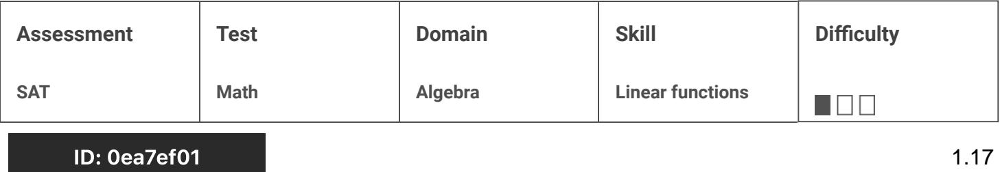

Oxygen gas is placed inside a tank with a constant volume. The estimated temperature y, in kelvins, of the oxygen gas when its pressure is x atmospheres.

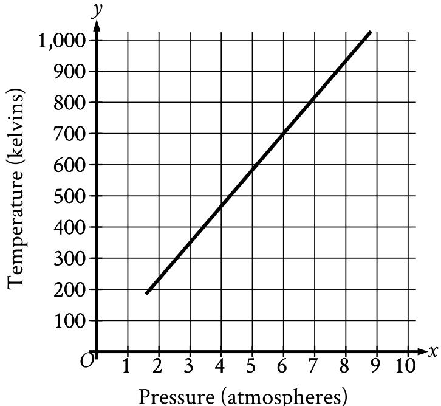

What is the estimated temperature, in kelvins, of the oxygen gas when its pressure is 6 atmospheres?

- A. 6
- B. 60
- c. 700
- D. 760

#### ID: 0ea7ef01 Answer

Correct Answer: C

#### Rationale

Choice C is correct. For the graph shown, the x-axis represents pressure, in atmospheres, and the y-axis represents temperature, in kelvins. Therefore, the estimated temperature, in kelvins, of the oxygen gas when its pressure is 6 atmospheres is represented by the y-coordinate of the point on the graph that has an xcoordinate of 6. The point on the graph with an x-coordinate of 6 has a y-coordinately 700 . Therefore, the estimated temperature, in kelvins, of the oxygen gas when its pressure is 6 atmospheres is 700. 

{19}------------------------------------------------

Choice A is incorrect. This is the pressure, in atmospheres, not the estimated temperature, in kelvins, of the oxygen gas when its pressure is 6 atmospheres.

Choice B is incorrect and may result from conceptual or calculation errors.

Choice D is incorrect and may result from conceptual or calculation errors.
{20}------------------------------------------------

# Question ID 1ecaa9c0

| Assessment           | Test | Domain  | Skill            | Difficulty |
|----------------------|------|---------|------------------|------------|
| SAT                  | Math | Algebra | Linear functions |            |
| ID: 1ecaa9c0<br>1.18 |      |         |                  |            |

Robert rented a truck to transport materials he purchased from a hardware store. He was charged an initial fee of \$20.00 plus an additional \$0.70 per mile driven. If the truck was driven 38 miles, what was the total amount Robert was charged?

- A. \$46.60
- B. \$52.90
- C. \$66.90
- D. \$86.50

## ID: 1ecaa9c0 Answer

Correct Answer: A

#### Rationale

Choice A is correct. It's given that Robert was charged an initial fee of \$20.00 to rent the truck plus an additional \$0.70 per mile driven. Let m represent the number of miles the truck was driven. Since the rental charge is \$0.70 per mile driven, 0.70m represents the amount Robert was charged for m miles driven. Let c equal the total amount, in dollars, Robert was charged to rent the truck. The total amount can be represented by the equation c = 20.00 + 0.70m. It's given that the truck was driven 38 miles, thus m = 38. Substituting 38 into the equation gives c = 20.00 + 0.70(38). Multiplying 0.70(38) gives c = 20.00 + 26.60. Adding these values gives c = 46.60, so the total amount Robert was charged is \$46.60.

Choices B, C, and D are incorrect and may result from setting up the equation incorrectly or from making calculation errors.

{21}------------------------------------------------

# Question ID 8643d906

| Assessment     | Test | Domain  | Skill            | Difficulty |
|----------------|------|---------|------------------|------------|
| SAT            | Math | Algebra | Linear functions |            |
| ID: 86/12/1006 |      |         |                  | 1 10       |

P(t) = 250 + 10t

The population of snow leopards in a certain area can be modeled by the function P defined above, where P(t) is the population t years after 1990.

Of the following, which is the best interpretation of the equation P(30) = 550 ?

A. The snow leopard population in this area is predicted to be 30 in the year 2020.

B. The snow leopard population in this area is predicted to be 30 in the year 2030.

C. The snow leopard population in this area is predicted to be 550 in the year 2020.

D. The snow leopard population in this area is predicted to be 550 in the year 2030.

#### ID: 8643d906 Answer

Correct Answer: C

Rationale

Choice C is correct. It's given that P(t) represents the population of snow leopards t years after 1990.

P(30) = 550 corresponds to t = 30 and P(t) = 550. It follows that t = 30 corresponds to 30 years after 1990, or 2020. Thus, the best interpretation of P(30)=550 is that the snow leopard population in this area is predicted to be 550 in the year 2020.

Choices A and B are incorrect and may result from reversing the interpretations of t and P(t). Choice D is incorrect and may result from determining that 30 years after 1990 is 2030, not 2020.

{22}------------------------------------------------

# Question ID a8e6bd75

| Assessment   | Test | Domain  | Skill            | Difficulty |
|--------------|------|---------|------------------|------------|
| SAT          | Math | Algebra | Linear functions |            |
| ID: a8e6bd75 |      |         |                  | 1.20       |

Which of the following is the graph of the equation y = 2x − 5 in the xy-plane?

A.

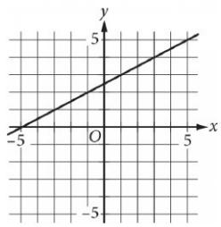

B.

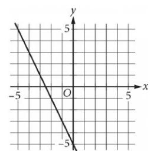

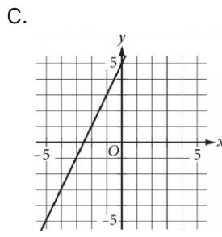

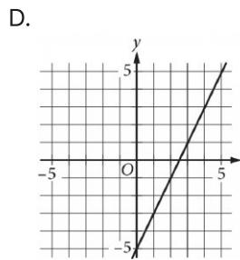

{23}------------------------------------------------

Correct Answer: D

### Rationale

Choice D is correct. In the xy-plane, the graph of the equation y = mx + b, where m and b are constants, is a line with slope m and y-intercept (0,b). Therefore, the graph of y =2x =5 in the xy-plane is a line with slope 2 and a y-intercept (0, – 5). Having a slope of 2 means that for each increase in x by 1, the value of y increases by 2. Only the graph in choice D has a slope of 2 and crosses the y-axis at (0, –5). Therefore, the graph shown in choice D must be the correct answer.

Choices A, B, and C are incorrect. The graph of y = 2x = 5 in the xy-plane is a line with slope 2 and a yintercept at (0, -5). The graph in choice A crosses the y-axis at the point (0,2.5), not (0, - 5), and it has a slope l of 2 , not 2. The graph in choice B crosses the y-axis at (0, –5); however, the slope of this line is –2, not 2.

The graph in choice C has a slope of 2; however, the graph crosses the y-axis at (0,5), not (0, - 5).

{24}------------------------------------------------

# Question ID fe6f9678

| Assessment   | Test | Domain  | Skill            | Difficulty |
|--------------|------|---------|------------------|------------|
| SAT          | Math | Algebra | Linear functions |            |
| ID: fe6f9678 |      |         |                  | 1 71       |

For the linear function f, f(0) = 17 and f(1) = 17. Which equation defines f?

A. f(x) = = B. f(x) = 1 c. f(x) = 17 D. f(x) = 34

## ID: fe6f9678 Answer

#### Correct Answer: C

#### Rationale

Choice C is correct. An equation defining the linear function f can be written in the form fx = mx + b, where m is the slope and 0, b is the y-intercept of the graph of y = f x in the xy-plane. The graph of y = f x can be found using the formula m = 32, where x1, y and x22, y are any two points that the graph passes through. If f0 = 17, it follows that the graph of y = f x passes through the point 0, 17. If f 1 = 17, it follows that the graph of y = f x passes through the point 1, 17. Substituting 0, 17 and 1, 17 for x, y, and x22, y, respectively, in the formula m = 22, yields m = 42, yields m = 42, yields m = 42, yields m = 42, yields m = 42, yields m m = 2, or m = 0. Since the graph of y = f x passes through 0, 17, it follows that b = 17. Substituting 0 for m and 17 for b in the equation fx = mx + b yields fx = 0x + 17, or fx = 17. Thus, the equation that defines f is = 17.

Choice A is incorrect and may result from conceptual or calculation errors.

Choice B is incorrect and may result from conceptual or calculation errors.

Choice D is incorrect and may result from conceptual or calculation errors.

{25}------------------------------------------------

# Question ID 930c2990

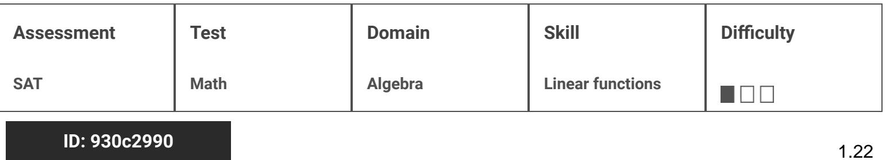

Hydrogen is placed inside a container and kept at a constant pressure. The graph shows the estimated volume y, in liters, of the hydrogen when its temperature is x kelvins.

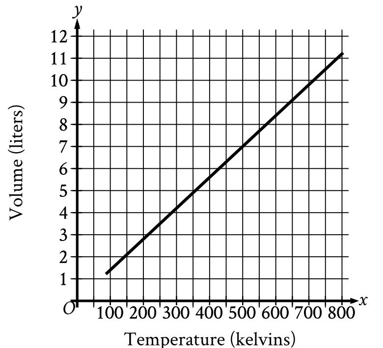

What is the estimated volume, in liters, of the hydrogen when its temperature is 500 kelvins?

A. 0

- 
- B.
- C. 7
- D. 500

# ID: 930c2990 Answer

Correct Answer: C

{26}------------------------------------------------

#### Rationale

Choice C is correct. For the graph shown, the x-axis represents temperature, in kelvins, and the y-axis represents volume, in liters. Therefore, the estimated volume, in liters, of the hydrogen when its temperature is 500 kelvins is represented by the ycoordinate of the point on the graph that has an x-coordinate of 500. The point on the graph with an x-coordinate of 500 has a y-coordinate of 7. Therefore, the estimated volume, in liters, of the hydrogen when its temperature is 7.

Choice A is incorrect and may result from conceptual errors. Choice B is incorrect and may result from conceptual errors.

Choice D is incorrect and may result from conceptual errors.

{27}------------------------------------------------

# Question ID d11910d6

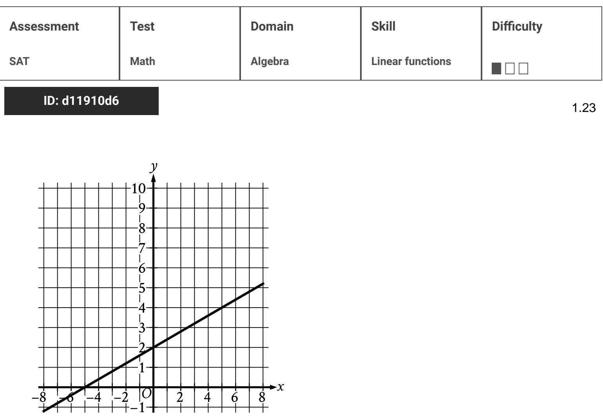

The graph of the linear function f is shown. What is the y-intercept of the graph of y = f(x)?

A. ( - 5,0)

B. (2,0)

c. (0, 2)

D. (0, -5)

# ID: d11910d6 Answer

### Correct Answer: C

# Rationale

Choice C is correct. The y-intercept of a graph is the graph intersects the y-axis. The graph of y = f(x) shown intersects the y-axis at the point (0,2). Therefore, the y-intercept of the graph of y = f (x) is (0,2).

Choice A is incorrect. This is the x-intercept, not the y-intercept, of the graph of y = f ( x ).

Choice B is incorrect and may result from conceptual or calculation errors.

Choice D is incorrect and may result from conceptual or calculation errors.

{28}------------------------------------------------

{29}------------------------------------------------

# Question ID 5907e072

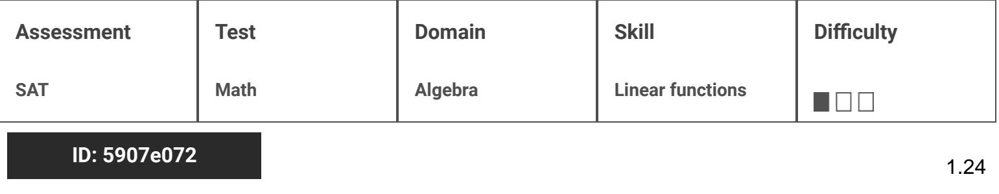

- f (x) = x + b For the linear function f, b is a constant. When x = 0, f(x) = 30. What is the value of b?
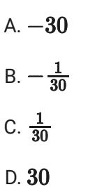

# ID: 5907e072 Answer

### Correct Answer: D

### Rationale

Choice D is correct. It's given that when x = 0, fx = 30. Substituting 0 for x and 30 for f x in the given function yields 30 = 0 + b, or 30 = b. Therefore, the value of b is 30.

Choice A is incorrect and may result from conceptual or calculation errors.

Choice B is incorrect and may result from conceptual or calculation errors.

Choice C is incorrect and may result from conceptual or calculation errors.
{30}------------------------------------------------

# Question ID fe287f7e

| Assessment   | Test | Domain  | Skill            | Difficulty |
|--------------|------|---------|------------------|------------|
| SAT          | Math | Algebra | Linear functions | 1000       |
| 10 fa207f7 מ |      |         |                  |            |

To repair a refrigerator, a technician charges \$60 per hour for labor plus \$120 for parts. Which function f represents the total amount, in dollars, the technician will charge for this job if it takes x hours?

1.25

A. f(x) = x + 120

- B. f(x) = 60x
C. f(x) = 60x + 120

D. f(x) = 60x - 120

## ID: fe287f7e Answer

### Correct Answer: C

### Rationale

Choice C is correct. It's given that the technician charges \$ 60 per hour for labor. Therefore, if the job takes x hours, the technician will charge - \$ 60 x hours, or \$ 60x, for labor. It's also given that the technician charges \$ 120 for parts. Therefore, 1 hour f x = 60x + 120 represents the total amount, in dollars, the technician will charge for this job if it takes x hours.

Choice A is incorrect and may result from conceptual or calculation errors.

Choice B is incorrect. This function represents the total amount, in dollars, the technician charges for labor only, not the total amount charged for labor and parts.

Choice D is incorrect. This function represents the total amount, in dollars, the technician would charge for parts were subtracted from, rather than added to, the charge for labor.

{31}------------------------------------------------

# Question ID d0cb49e8

| Assessment           | Test | Domain  | Skill            | Difficulty |  |
|----------------------|------|---------|------------------|------------|--|
| SAT                  | Math | Algebra | Linear functions | 100L       |  |
| ID: d0cb49e8<br>1.26 |      |         |                  |            |  |

Argon is placed inside a container with a constant volume. The graph shows the estimated pressure y, in pounds per square inch (psi), of the argon when its temperature is x kelvins.

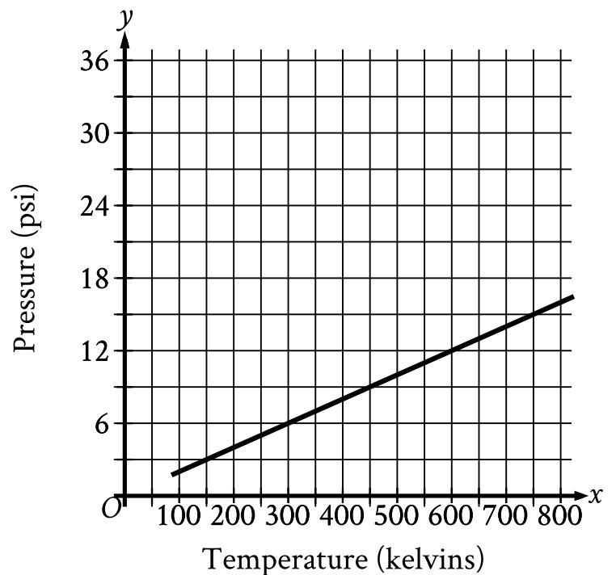

What is the estimated pressure of the argon, in psi, when the temperature is 600 kelvins?

A. 6

- B. 12
- c. 300
- D. 600

## ID: d0cb49e8 Answer

Correct Answer: B

{32}------------------------------------------------

#### Rationale

Choice B is correct. For the graph shown, the x-axis represents temperature, in kelvins, and the y-axis represents the estimated pressure, in pounds per square inch psi. The estimated pressure of the argon when the temperature is 600 kelvins can be found by locating the graph where the value of x is equal to 600. The graph passes through the point 600, 12. This means that when the temperature is 600 kelvins, the estimated pressure is 12 psi.

Choice A is incorrect. This is the estimated pressure, in psi, of the argon when the temperature is 300 kelvins.

Choice C is incorrect and may result from conceptual or calculation errors.

Choice D is incorrect. This is the temperature, in kelvins, of the argon.

{33}------------------------------------------------

# Question ID 3174f07d

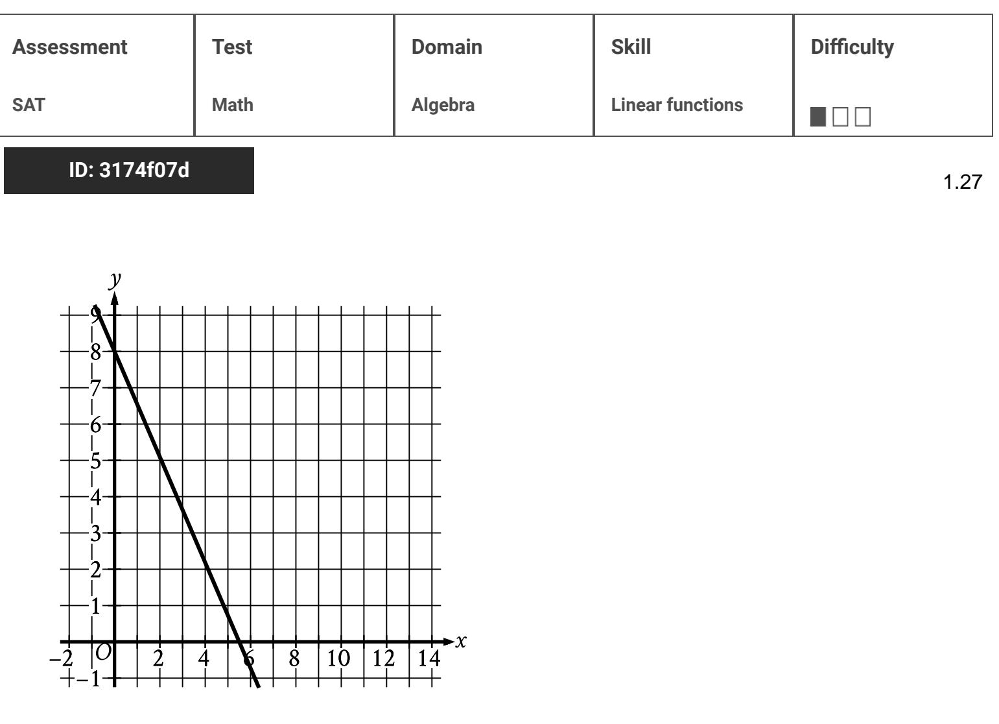

The graph of the linear function f is shown, where y = f(x). What is the y-intercept of the graph of f ?

- A. (0,0)
- B. (0, ll=
- c. (0, -8)
- D. (0,8)

## ID: 3174f07d Answer

## Correct Answer: D

## Rationale

Choice D is correct. The y-intercept of a graph intersects the y-axis. The y-axis. The graph of function f shown intersects the y-axis at the point 0, 8. Therefore, the y-intercept of the graph of f is ( 0, 8 ).

Choice A is incorrect. This is the point where the x-axis, not the graph of f, intersects the y-axis.

Choice B is incorrect and may result from conceptual or calculation errors.

Choice C is incorrect and may result from conceptual or calculation errors.

{34}------------------------------------------------

{35}------------------------------------------------

## Question ID 4702da8f

| Assessment                                                              | Test | Domain  | Skill            | Difficulty |  |
|-------------------------------------------------------------------------|------|---------|------------------|------------|--|
| SAT                                                                     | Math | Algebra | Linear functions | ■□□□□      |  |
| ID: 4702da8f<br>1.28                                                    |      |         |                  |            |  |
| The function f is defined by f(x) = 80 - 6x. What is the value of f(7)? |      |         |                  |            |  |
| A. 13                                                                   |      |         |                  |            |  |
| B. 38                                                                   |      |         |                  |            |  |
| C. 74                                                                   |      |         |                  |            |  |

D. 81

## ID: 4702da8f Answer

#### Correct Answer: B

### Rationale

Choice B is correct. It's given that function f is defined by f x = 80 - 6x. The value of f7 can be found by substituting 7 for x in the given function, which yields f7 = 80 - 67, or f7 = 80 - 42, which is equivalent to f7 = 38. Therefore, the value of f7 is 38.

Choice A is incorrect. This is the value of 80 - 67. Choice C is incorrect. This is the value of 80 - 61, not 80 - 67.

Choice D is incorrect. This is the value of 80 - 6 + 7, not 80 - 67.

{36}------------------------------------------------

# Question ID b51c173d

| Assessment           | Test | Domain  | Skill            | Difficulty |  |
|----------------------|------|---------|------------------|------------|--|
| SAT                  | Math | Algebra | Linear functions |            |  |
| ID: b51c173d<br>1.29 |      |         |                  |            |  |

For the linear function f the graph of y = f(x) in the xy-plane has a y-intercept at (0, -5). Which equation defines f?

- c. f -2x - 5 D. f(x) = 2x .
## ID: b51c173d Answer

### Correct Answer: D

### Rationale

Choice D is correct. An equation defining the linear function f can be written in the form fx = mx + b, where m is the slope and 0, b is the y-intercept of the graph of y = f x in the xy-plane. It's given that the graph of y = f x has a slope of 2. Therefore, m = 2. It's also given that the graph of y = f x has a y-intercept at 0, - 5. Substituting 2 for m and - 5 for b in the equation fx = mx + b yields fx = 2x - 5. Thus, the equation that defines f is fx = 2x - 5.

Choice A is incorrect. For this function, the graph of y = f x in the xy-plane has a slope of -, not 2.

Choice B is incorrect. For this function, the graph of y = f x in the xy-plane has a slope of --, not 2.

Choice C is incorrect. For this function, the graph of y = f x in the xy-plane has a slope of -2, not 2.

{37}------------------------------------------------

# Question ID 27198699

| Assessment | Test | Domain  | Skill            | Difficulty |
|------------|------|---------|------------------|------------|
| SAT        | Math | Algebra | Linear functions |            |
|            |      |         |                  |            |

## ID: 27198699

1.30

As part of a science project on evaporation, Amaya measured the height of a liquid in a container over a period of time. The function f(x) = 33 = 0.18x gives the estimated height, in centimeters (cm), of the liquid in the container & days after the start of the project. Which of the following is the best interpretation of 33 in this context?

- A. The estimated height, in cm, of the liquid at the start of the project
- B. The estimated height, in cm, of the liquid at the end of the project
- C. The estimated change in the height, in cm, of the liquid each day
- D. The estimated number of days for all of the liquid to evaporate

## ID: 27198699 Answer

### Correct Answer: A

### Rationale

Choice A is correct. It's given that the function f x = 33 - 0.18x qives the estimated height, in centimeters (cm), of the liquid in the container x days after the start of the project. For a linear function in the form f x = a + bx; where a and b are constants, a represents the value of f0 and b represents the function. It follows that in the given function, 33 represents the value of f 0. Therefore, the best interpretation of 33 in this context is the estimated height, in cm, of the liquid at the start of the project.

Choice B is incorrect and may result from conceptual or calculation errors.

Choice C is incorrect. The estimated change in the height, in cm, of the liquid each day is 0.18, not 33.

Choice D is incorrect and may result from conceptual or calculation errors.

{38}------------------------------------------------

## Question ID 0d6ab461

| Assessment           | Test | Domain  | Skill            | Difficulty |
|----------------------|------|---------|------------------|------------|
| SAT                  | Math | Algebra | Linear functions |            |
| ID: 0d6ab461<br>1 01 |      |         |                  |            |

Gabriella deposits \$35 in a savings account at the end of each week. At the beginning of the 1st week of a year there was \$600 in that savings account. How much money, in dollars, will be in the end of the 4th week of that year?

1.31

- A. 460
- B. 635
- c. 639
- D. 740

## ID: 0d6ab461 Answer

#### Correct Answer: D

#### Rationale

Choice D is correct. It's given that at the beginning of the 1st week of the year there was \$ 600 in a savings account and Gabriella deposits \$ 35 in that savings account at the end of each week. Therefore, the amount of money, in dollars, in the savings account at the end of the 4th week of that year is 600 + 435, or 740.

Choice A is incorrect. This is the amount of money, in dollars, that will be in the account at the end of the 4th week if Gabriella withdraws, rather than deposits, \$ 35 at the end of each week.

Choice B is incorrect. This is the amount of money, in dollars, that will be in the account at the end of the 1st week, not the 4th week.

Choice C is incorrect and may result from conceptual or calculation errors.