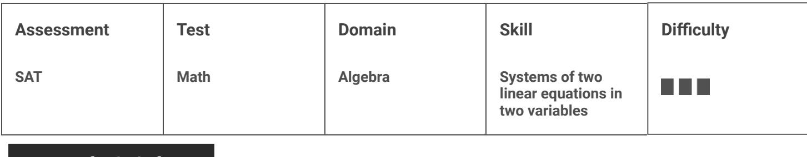

{0}------------------------------------------------

# Question ID d1b66ae6

| Assessment | Test | Domain  | Skill                                                  | Difficulty |
|------------|------|---------|--------------------------------------------------------|------------|
| SAT        | Math | Algebra | Systems of two linear equations in two variables |            |

3.1

### ID: d1b66ae6 -x+y=-3.5

$$\mathbf{x} + \mathbf{3}\mathbf{y} = \mathbf{9.5}$$

If (x, y) satisfies the system of equations above, what is the value of y ?

#### ID: d1b66ae6 Answer

Rationale

3

The correct answer is 2 . One method for solving the system of equations for y is to add corresponding sides of the two equations. Adding the left-hand sides gives (−x +y) +(x + 3y), or 4y. Adding the right-hand sides

3 6 yields —3.5+9.5 =6. It follows that 4y =6. Finally, dividing both sides of 4y =6 by 4 yields ~ = 4 or 2 Note that 3/2 and 1.5 are examples of ways to enter a correct answer.

{1}------------------------------------------------

## Question ID 70feb725

| Assessment | Test | Domain  | Skill                                                  | Difficulty |
|------------|------|---------|--------------------------------------------------------|------------|
| SAT        | Math | Algebra | Systems of two linear equations in two variables |            |

### ID: 70feb725

3.2

During a month, Morgan ran r miles at 5 miles per hour and biked b miles at 10 miles per hour. She ran and biked a total of 200 miles that month, and she biked for twice as many hours as she ran. What is the total number of miles that Morgan biked during the month?

A. 80

B. 100

C. 120

D. 160

### ID: 70feb725 Answer

Correct Answer: D

Rationale

Choice D is correct. The number of hours Morgan spent running or biking can be calculated by dividing the distance she traveled during that activity by her speed, in miles per hour, for that activity. So the number of hours she ran can be represented by the expression & , and the number of hours she biked can be represented by the expression 10 . It's given that she biked for twice as many hours as she ran, so this can be represented by the equation 10 , which can be rewritten as 'n = 4r. It's also given that she ran r miles and biked b miles, and that she ran and biked a total of 200 miles. This can be represented by the equation r+b = 200 Substituting 4r for b in this equation yields r+4r = 200, or 5r = 200. Solving for r yields r = 40. Determining the number of miles she biked, b, can be found by substituting 40 for r in r+b = 200, which yields 40 + b = 200. Solving for b yields b = 160.

Choices A, B, and C are incorrect because they don't satisfy that Morgan biked for twice as many hours as she ran. In choice A, if she biked 80 miles, then she ran 120 miles, which means she biked for 8 hours and ran for 24 hours. In choice B, if she biked 100 miles, then she ran 100 miles, which means she biked for 10 hours and ran for 20 hours. In choice C, if she biked 120 miles, then she ran for 80 miles, which means she biked for 12 hours and ran for 16 hours.

{2}------------------------------------------------

{3}------------------------------------------------

## Question ID e1248a5c

| Assessment | Test | Domain  | Skill                                                  | Difficulty |
|------------|------|---------|--------------------------------------------------------|------------|
| SAT        | Math | Algebra | Systems of two linear equations in two variables |            |

### ID: e1248a5c

In the system of equations below, a and c are constants.

1 6 ax + y = c

If the system of equations has an infinite number of solutions (x,y), what is the value of a ?

$$\frac{1}{\mathbb{A}} - \frac{1}{\mathbb{Z}}$$

B. 0

- l c. 2
3 D. 2

#### ID: e1248a5c Answer

Correct Answer: D

#### Rationale

Choice D is correct. A system of two linear equations has infinitely many solutions if one equation is equivalent to the other. This means that when the two equations are written in the same form, each coefficient or constant in one equation is equal to the corresponding coefficient or constant in the other equation multiplied by the same number. The equations in the given system of equations are written in the same form, with x and y on the left-hand side and a constant on the right-hand side of the equation. The coefficient of y in the second equation is equal to the coefficient of y in the first equation multiplied by 3. Therefore, a, the coefficient of x in the second equation, must be equal to 3 times the coefficient of x in the first equation:

$$a = (\frac{1}{2})(3)_{,\text{or}}\text{ or }a = \frac{3}{2}\text{ .} $$

Choices A, B, and C are incorrect. When 2 , the given system of equations has one solution.

Question Difficulty: Hard

3.3

{4}------------------------------------------------

## Question ID 52cb8ea4

| Assessment | Test | Domain  | Skill                                                  | Difficulty |
|------------|------|---------|--------------------------------------------------------|------------|
| SAT        | Math | Algebra | Systems of two linear equations in two variables |            |

### ID: 52cb8ea4 7x-5y=4 4x-8y=9

If (x,y) is the solution to the system of equations above,

what is the value of 3x +3y ?

A. -13

B. - 5

c. 5

D. 13

#### ID: 52cb8ea4 Answer

Correct Answer: B

Rationale

Choice B is correct. Subtracting the second equation, 4x −8y = 9, from the first equation, 7x −5y = 4, results in (7x – 5y) – (4x – 8y) = 4 – 9, or 7x – 5y – 4x + 8y = 5. Combining like terms on the left-hand side of this equation yields 3x +3y = - 5.

Choice A is incorrect and may result from miscalculating 4 - 9 as - 1 3. Choice C is incorrect and may result from miscalculating 4 – 9 as 5. Choice D is incorrect and may result from adding 9 to 4 instead of subtracting 9 from 4.

Question Difficulty: Hard

3.4

{5}------------------------------------------------

## Question ID d7bf55e1

| Assessment | Test | Domain  | Skill                                                  | Difficulty |
|------------|------|---------|--------------------------------------------------------|------------|
| SAT        | Math | Algebra | Systems of two linear equations in two variables |            |

### ID: d7bf55e1

3.5

A movie theater sells two types of tickets, adult tickets for \$12 and child tickets for \$8. If the theater sold 30 tickets for a total of \$300, how much, in dollars, was spent on adult tickets? (Disregard the \$ sign when gridding your answer.)

### ID: d7bf55e1 Answer

#### Rationale

The correct answer is 180. Let a be the number of adult tickets sold and c be the number of child tickets sold. Since the theater sold a total of 30 tickets, a + c = 30. The price per adult ticket is \$12, and the price per child ticket is \$8. Since the theater received a total of \$300 for the 30 tickets sold, it follows that 12a + 8c = 300. To eliminate c, the first equation can be multiplied by 8 and then subtracted from the second equation:

$$\begin{array}{c} \mathsf{12}\,a + \mathsf{8c} = \mathsf{300} \\ -\mathsf{8}\,a - \mathsf{8c} = -\mathsf{240} \\ \hline 4\,a + \mathsf{0c} = \mathsf{60} \end{array}$$

Because the question asks for the amount spent on adult tickets, which is 12a dollars, the resulting equation can be multiplied by 3 to give 3(4a) = 3(60) = 180. Therefore, \$180 was spent on adult tickets.

Alternate approach: If all the 30 tickets sold were child tickets, their total price would be 30(\$8) = \$240. Since the actual total price of the 30 tickets was \$300, the extra \$60 indicates that a certain number of adult tickets, a, were sold. Since the price of each adult ticket is \$4 more than each child ticket, 4a = 60, and it follows that 12a = 180.

{6}------------------------------------------------

## Question ID f718c9cf

ID: f718c9cf

3.6

$$\begin{array}{l} \textbf{5} \textbf{z} + \textbf{14} \textbf{y} = \textbf{45} \\ \textbf{10} \textbf{x} + \textbf{7} \textbf{y} = \textbf{27} \end{array}$$

The solution to the given system of equations is (x, y). What is the value of xy?

### ID: f718c9cf Answer

Correct Answer: 1.8, 9/5

Rationale

The correct answer is }. Multiplying the first equation in the given system by 2 yields 10x + 28y = 90. Subtracting the second equation in the given system, 10x + 7y = 27, from 10x + 28y = 90 yields (10x + 28y) - (10x + 7y) = 90 - 27, which is equivalent to 10x + 28g - 10x - 7y = 63, or 21y = 63. Dividing both sides of this equation by 21 yields y = 3. The value of x can be found by substituting 3 for y in either of the two given equations. Substituting 3 for y in the equation 10x + 7y = 27 yields 10x + 7(3) = 27, or 10x + 21 = 27. Subtracting 21 from both sides of this equation yields 10x = 6. Dividing both sides of this equation by 10 yields x = S. or x = }. Therefore, the value of xy is ( } ) (3), or examples of ways to enter a correct answer.

{7}------------------------------------------------

## Question ID 466b87e3

| Assessment | Test | Domain  | Skill                                                  | Difficulty |
|------------|------|---------|--------------------------------------------------------|------------|
| SAT        | Math | Algebra | Systems of two linear equations in two variables |            |

3.7

ID: 466b87e3 x +8 y = cx + 10

In the system of equations above, c is a constant. If the system has no solution, what is the value of c ?

#### ID: 466b87e3 Answer

Rationale

l The correct answer is 2 . A system of two linear equations has no solution when the graphs of the equations have the same slope and different y-intercepts. Each of the qiven linear equations is written in the slopeintercept form, y = mx + b, where m is the slope and b is the y-coordinate of the y-intercept of the graph of the equation. For these two linear equations, the y-intercepts are (0,8) and (0,10). Thus, if the system of equations has no solution, the slopes of the two linear equations must be the same. The slope of the graph of the first linear equation is 2 . Therefore, for the system of equations to have no solution, the l value of c must be 2 . Note that 1/2 and .5 are examples of ways to enter a correct answer.
{8}------------------------------------------------

### Question ID e2e3942f

| Assessment | Test | Domain  | Skill                                                  | Difficulty |
|------------|------|---------|--------------------------------------------------------|------------|
| SAT        | Math | Algebra | Systems of two linear equations in two variables |            |

| ID: e2e3942f |
|--------------|
| y = 2x +1    |
| y = ax - 8   |

3.8

In the system of equations above, a is a constant. If the system of equations has no solution, what is the value of a ?

| ___ 2 A. |  |
|----------------|--|
| B. O           |  |
| c. 1           |  |
| D. 2           |  |

### ID: e2e3942f Answer

Correct Answer: D

Rationale

Choice D is correct. A system of two linear equations has no solution when the graphs of the equations have the same slope and different y-coordinates of the y-intercepts. Each of the given equations is written in the slope-intercept form of a linear equation, y = mx + b, where m is the slope and b is the y-coordinate of the y-

intercept of the graph of the equation. For these two linear equations, the y-coordinates of the y-intercepts are different: 1 and =8. Thus, if the system of equations has no solution, the slopes of the two linear equations

must be the same. The slope of the first linear equation is 2. Therefore, for the system of equations to have no solution, the value of a must be 2.

Choices A, B, and C are incorrect and may result from conceptual and computational errors.

{9}------------------------------------------------

### Question ID 1e11190a

| Assessment | Test | Domain  | Skill                                                  | Difficulty |
|------------|------|---------|--------------------------------------------------------|------------|
| SAT        | Math | Algebra | Systems of two linear equations in two variables |            |

### ID: 1e11190a

3.9

Store A sells raspberries for \$5.50 per pint and blackberries for \$3.00 per pint. Store B sells raspberries for \$6.50 per pint and blackberries for \$8.00 per pint. A certain purchase of raspberries and blackberries would cost \$37.00 at Store A or \$66.00 at Store B. How many pints of blackberries are in this purchase?

| A. 4  |  |  |  |
|-------|--|--|--|
| B. 5  |  |  |  |
| C. 8  |  |  |  |
| D. 12 |  |  |  |
|       |  |  |  |

### ID: 1e11190a Answer

Correct Answer: B

### Rationale

Choice C is correct. It's given that store A sells raspberries for \$5. 50 per pint and blackberries for \$3. 00 per pint, and a certain purchase of raspberries and blackberries at store A would cost \$37. 00. It's also given that store B sells raspberries for \$6.50 per pint and blackberries for \$8.00 per pint, and this purchase of raspberries and blackberries at store B would cost \$66. 00. Let m represent the number of pints of raspberries and brepresent the number of pints of blackberries in this purchase. The equation 5.50r + 3.000 = 37. 00 represents this purchase of raspberries and blackberries from store A and the equation

6. 50m + 8.00b = 66.00 represents this purchase of raspberries and blackberries from store B. Solving the system of equations by elimination gives the value of r and the value of b that make the system of equations true. Multiplying both sides of the equation for store A by 6.5 yields

(5.50m)(6.5) + (3.00b)(6.5) = (37.00)(6.5), or 35.75r + 19.5b = 240. 5. Multiplying both sides of the equation for store B by 5.5 yields (6.50m)(5.5) = (66.00)(5.5) = (66.00)(5. 5), or 35.75r + 44b = 363. Subtracting both sides of the equation for store A, 35. 75r + 19. 5b = 240. 5, from the corresponding sides of the equation for store B, 35. 75r + 446 = 363, yields (35. 75r - 35. 75r) + (446 - 19. 5b) = (363 - 240. 5), or 24. 5b = 122. 5. Dividing both sides of this equationby 24.5 yields b = 5. Thus, 5 pints of blackberries are in this purchase.

Choices A and B are incorrect and may result from conceptual or calculation errors. Choice D is incorrect. This is the number of pints of raspberries, not blackberries, in the purchase.

{10}------------------------------------------------

### Question ID 567ac7ab

| Assessment | Test | Domain  | Skill                                                  | Difficulty |
|------------|------|---------|--------------------------------------------------------|------------|
| SAT        | Math | Algebra | Systems of two linear equations in two variables |            |

### ID: 567ac7ab

3.10

One of the two equations in a linear system is 2x +6y = 10. The system

has no solution. Which of the following could be the other equation in the system?

A. x +3y = 5

B. x +3y = - 20

C. 6x-2y = 0

D. 6x +2y = 10

### ID: 567ac7ab Answer

Correct Answer: B

#### Rationale

Choice B is correct. A system of two linear equations written in standard form has no solution when the equations are distinct and the ratio of the x-coefficient to the y-coefficient for one equation is equivalent to the ratio of the x-coefficient to the y-coefficient for the other equation. This ratio for the given equation is 2 to 6, or 1 to 3. Only choice B is an equation that isn't equivalent to the given equation and whose ratio of the xcoefficient to the y-coefficient is 1 to 3.

Choice A is incorrect. Multiplying each of the terms in this equation by 2 yields an equation that is equivalent to the given equation. This system would have infinitely many solutions. Choices C and D are incorrect. The ratio of the x-coefficient to the y-coefficient in 6x – 2y = 0 (choice C) is –6 to 2, or = 3 to 1. This ratio in

6x +2y = 10 (choice D) is 6 to 2, or 3 to 1. Since neither of these ratios is equivalent to that for the given equation, these systems would have exactly one solution.

{11}------------------------------------------------

# Question ID 73b3b7d8

| Assessment | Test | Domain  | Skill                                                  | Difficulty |
|------------|------|---------|--------------------------------------------------------|------------|
| SAT        | Math | Algebra | Systems of two linear equations in two variables |            |

ID: 73b3b7d8

3.11

=5y = 5x - 21 The solution to the given system of equations is (x, y). What is the value of 30x? 5y = 10x + 11

### ID: 73b3b7d8 Answer

Correct Answer: 20

### Rationale

The correct answer is 20. Adding the first equation to the second equation in the given system yields

5y - 5y = 10x + 5x + 11 - 21, or 0 = 15x - 10. Adding 10 to both sides of this equation yields 10 = 15x. Multiplying both sides of this equation by 2 yields 20 = 30x. Therefore, the value of 30x is 20.

{12}------------------------------------------------

## Question ID a71b1bc1

| Algebra Systems of two SAT Math linear equations in two variables | Assessment | Test | Domain | Skill | Difficulty |
|----------------------------------------------------------------------------------|------------|------|--------|-------|------------|
|                                                                                  |            |      |        |       |            |

### ID: a71b1bc1

3.12

A piece of wire with a length of 32 inches is cut into two parts. One part has a length of x inches, and the other part has a length of y inches. The value of x is 4 more than 3 times the value of y. What is the value of x ? ? ? ? ? ? ? ? ? ? ? ? ? ? ? ? ? ? ? ?

### ID: a71b1bc1 Answer

Correct Answer: 25

#### Rationale

The correct answer is 25. It's given that a piece of wire has a length of 32 inches and is cut into two parts. It's also given that one part has a length of x inches and the other part has a length of y inches. It follows that the equation x + y = 32 represents this situation. It's also given that the value of x is 4 more than 3 times the value of y, or x = 3y + 4. Substituting

3y + 4 for x in the equation x + y = 32 yields 3y + 4 + y = 32. Combining like terms on the left-hand side of this equation yields 4y + 4 = 32. Subtracting 4 from both sides of this equation yields 4y = 28. Dividing both sides of this equation by 4 yields y = 7. Substituting 7 for y in the equation x = 3y + 4 yields x = 3( 7 ) + 4, or x = 25. Therefore, the value of x is 25.

{13}------------------------------------------------

### Question ID 59352689

| Math Algebra Systems of two SAT linear equations in | Assessment | Test | Domain | Skill         | Difficulty |
|-----------------------------------------------------------------|------------|------|--------|---------------|------------|
|                                                                 |            |      |        | two variables |            |

### ID: 59352689

3.13

In the given system of equations, p is a constant. If the system has no solution, what is the value of p?

#### ID: 59352689 Answer

Correct Answer: 3.5, 7/2

#### Rationale

The correct answer is - A system of two linear equations in two variables, x and y, has no solution if the lines represented by the equations in the xy-plane are distinct and parallel. Two lines represented by equations in standard form A.x + By = C, where A, B, and C are constants, are parallel if the coefficients for x and y in one equation are proportional to the y, can be written in corresponding coefficients in the other equation. The first equation in the given system, standard form by adding 2y to both sides of the equation, which yields 2 Multiplying each term in 32 | 15 this equation by -8 yields 5x - 14y = The second equation in the given system, = py + can be written in ို. Multiplying each term in this standard form by subtracting - and py from both sides of the equation, which yields x - DV = 32 equation by 4 yields 5x - 4py = 8. The coefficient of x in the first equation, 5x - 14y = is equal to the coefficient of x in the second equation, 5x - 4py = 8. For the lines to be parallel, and for the coefficients for x and y in one equation to be proportional to the corresponding coefficients in the coefficient of y in the second equation must also be -14 equal to the coefficient of y in the first equation. Therefore, -14 = - 4p. Dividing both sides of this equation by -4 yields = p 7. Therefore, if the given system of equations has no solution, the value of p is -. Note that 7/2 and 3.5 are examples of ways to enter a correct answer.

{14}------------------------------------------------

# Question ID b5f62071

| Assessment | Test | Domain  | Skill                                                  | Difficulty |
|------------|------|---------|--------------------------------------------------------|------------|
| SAT        | Math | Algebra | Systems of two linear equations in two variables |            |

ID: b5f62071

3.14

#### 48x - 64y = 48y + 24 ry = ø||--------------------------------------------------------------------------------------------------------------------------------------------------------------------------

In the given system of equations, m is a constant. If the system has no solution, what is the value of r?

### ID: b5f62071 Answer

Correct Answer: -28

#### Rationale

The correct answer is -28. A system of two linear equations in two variables, x and y, has no solution if the lines represented by the equations in the xy-plane are distinct and parallel. The graphs of the xy-plane represented by equations in the form Ax + By = C, where A, B, and C are constants, are parallel if the coefficients for x and y in one equation are proportional to the corresponding coefficients for x and y in the other equation in the given system, 48x - 64y = 48y + 24, can be written in the form Ax + By = C by subtracting 48y from both sides of the equation to yield 48x - 112y = 24. The second equation in the given system, ry = - 12x, can be written in the form Ax + By = C by adding 12x to both sides of the equation to yield 12x + ry = - The coefficient of x in the second equation is = times the coefficient of x in the first equation. That is, 48- = 12. For the lines to be parallel, the coefficient of y in the second equation must also be = times the coefficient of y in the first equation. Therefore, -112 - = r, or -28 = r. Thus, if the given system has no solution, the value of r is -28.

{15}------------------------------------------------

### Question ID 1b1deebe

| Assessment | Test | Domain  | Skill                                                  | Difficulty |
|------------|------|---------|--------------------------------------------------------|------------|
| SAT        | Math | Algebra | Systems of two linear equations in two variables |            |

ID: 1b1deebe

3.15

### ax + by = 72 6x + 2by = 56

In the given system of equations, a and b are constants. The graphs of the xy-plane intersect at the point (4, y). What is the value of a?

- A. 3
- B. 4
- C. 6
- D. 14

### ID: 1b1deebe Answer

### Correct Answer: D

### Rationale

Choice D is correct. It's given that the graphs of the given system of equations intersect at the point 4, y. Therefore, 4, y is the solution to the given system. Multiplying the first equation in the given system by -2 yields -2ax - 2by = -144. Adding this equation to the second equation in the system yields -2a + 6x + -2b + 2by = -144 + 56, or -2a + 6x = - 88. Since 4, y is the solution to the system, the value of a can be found by substituting 4 for x in this equation, which yields -2α + 64 = - 88. Dividing both sides of this equation by 4 yields -2a + 6 = -22. Subtracting 6 from both sides -2a = -28. Dividing both sides of this equation by -2 yields a = 14.

Choice A is incorrect and may result from conceptual or calculation errors.

Choice B is incorrect and may result from conceptual or calculation errors.

Choice C is incorrect and may result from conceptual or calculation errors.