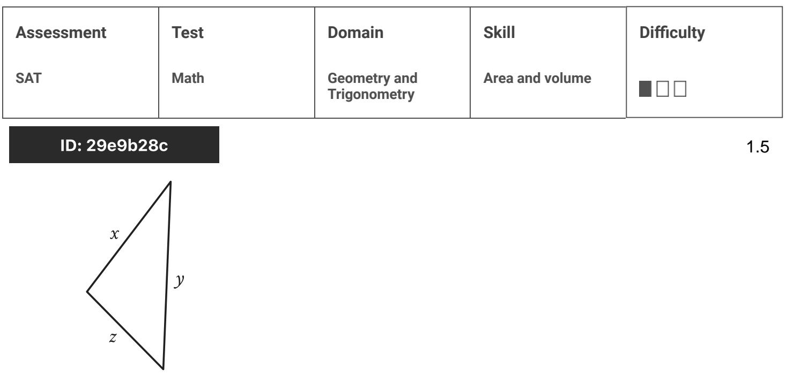
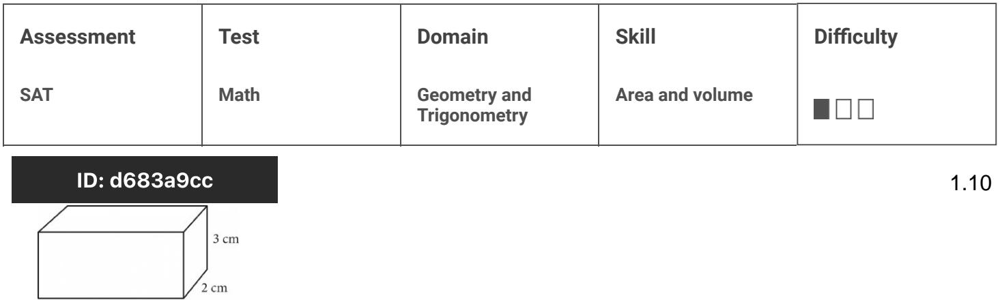

{0}------------------------------------------------

## Question ID 5252e606

| Assessment | Test | Domain                       | Skill           | Difficulty |
|------------|------|------------------------------|-----------------|------------|
| SAT        | Math | Geometry and Trigonometry | Area and volume |            |
|            |      |                              |                 |            |

ID: 5252e606

1.1

The side length of a square is 55 centimeters (cm). What is the area, in cm2, of the square?

- A. 110
- B. 220
- C. 3,025
- D. 12,100

### ID: 5252e606 Answer

Correct Answer: C

Rationale

Choice C is correct. The area A, in square centimeters (cm2), of a square with side length s, in cm, is given by the formula A = s . It's given that the square has a side length of 55 cm. Substituting 55 for s in the formula A = 32 yields A = 552, or A = 3,025. Therefore, the area, in cm2, of the square is 3,025.

Choice A is incorrect and may result from conceptual or calculation errors.

Choice B is incorrect. This is the perimeter, in cm, of the square, not its area, in cm2.

Choice D is incorrect and may result from conceptual or calculation errors.

{1}------------------------------------------------

## Question ID 59cb654c

| Area and volume Geometry and SAT Math Trigonometry | Assessment | Test | Domain | Skill | Difficulty |
|----------------------------------------------------------------|------------|------|--------|-------|------------|
|                                                                |            |      |        |       |            |

### ID: 59cb654c

1.2

The area of a square is 64 square inches. What is the side length, in inches, of this square?

| A. 8  |        |
|-------|--------|
|       | B. 16  |
| C. 64 |        |
|       | D. 128 |

### ID: 59cb654c Answer

Correct Answer: A

Rationale

Choice A is correct. It's given that the area of a square inches. The area A, in square inches, of a square is given by the formula A = s2, where & is the side length, in inches, of the square. Substituting 64 for A in this formula yields 64 = 34. Taking the positive square root of both sides of this equation yields 8 = s. Thus, the side length, in inches, of this square is 8.

Choice B is incorrect and may result from conceptual or calculation errors.

Choice C is incorrect. This is the area, in square inches, of the side length, in inches, of the square.

Choice D is incorrect and may result from conceptual or calculation errors.

{2}------------------------------------------------

# Question ID 0837c3b9

| Area and volume SAT Geometry and Math Trigonometry | Assessment | Test | Domain | Skill | Difficulty |
|----------------------------------------------------------------|------------|------|--------|-------|------------|
|                                                                |            |      |        |       |            |

#### ID: 0837c3b9

1.3

| Triangle ABC and triangle DEF are similar triangles, where AB and DE are  |
|---------------------------------------------------------------------------|
| corresponding sides. If DE = 2AB and the perimeter of triangle ABC is 20, |
| what is the perimeter of triangle DEF ?                                   |

A. 10

B. 40

C. 80

D. 120

### ID: 0837c3b9 Answer

Correct Answer: B

Rationale

Choice B is correct. Since triangles ABC and DEF are similar and DE = 248, the length of each side of triangle DEF is two times the length of its corresponding side in triangle ABC. Therefore, the perimeter of triangle DEF is two times the perimeter of triangle ABC. Since the perimeter of triangle ABC is 20, the perimeter of triangle

DEF is 40.

Choice A is incorrect. This is half, not two times, the perimeter of triangle ABC. Choice C is incorrect. This is two times the perimeter of triangle DEF rather than two times the perimeter of triangle ABC. Choice D is incorrect. This is six times, not two times, the perimeter of triangle ABC.

{3}------------------------------------------------

# Question ID c88183f7

| SAT Math Geometry and | Assessment | Test | Domain       | Skill           | Difficulty |
|-----------------------------|------------|------|--------------|-----------------|------------|
|                             |            |      | Trigonometry | Area and volume |            |

### ID: c88183f7

1.4

A rectangle has a length of 13 and a width of 6. What is the perimeter of the rectangle?

| A. 12 |  |
|-------|--|
| B. 26 |  |
| C. 38 |  |
| D. 52 |  |
|       |  |

### ID: c88183f7 Answer

Correct Answer: C

Rationale

Choice C is correct. The perimeter of a quadrilateral is the sum of the four sides. It's given that the rectangle has a length of 13 and a width of 6. It follows that the rectangle has two sides with length 13 and two sides with length 6. Therefore, the perimeter of the rectangle is 13 + 13 + 6 + 6, or 38.

Choice A is incorrect. This is the sum of the two sides with length 6, not the sum of the lengths of all four sides of the rectangle.

Choice B is incorrect. This is the sum of the two sides with length 13, not the sum of the lengths of all four sides of the rectangle.

Choice D is incorrect. This is the perimeter of a rectangle that has four sides with length 13, not two sides with length 13 and two sides with length 6.

{4}------------------------------------------------

## Question ID 29e9b28c

Note: Figure not drawn to scale.

The triangle shown has a perimeter of 22 units. If x = 9 units, what is the value of & in units?

A. 6

B. 7

C. 9

D. 16

#### ID: 29e9b28c Answer

Correct Answer: A

Rationale

Choice A is correct. The perimeter of a triangle is the sum of the three sides. The triangle shown has side lengths x, y, and x. It's given that the triangle has a perimeter of 22 units. Therefore, x + y + z = 22. If x = 9 units and y = 7 units, the value of z, in units, can be found by substituting 9 for x and 7 for y in the equation x + y + z = 22. which yields 9 + 7 + z = 22. Subtracting 16 from both sides of this equation yields z = 6. Therefore, if x = 9 units and y = 7 units, the value of z, in units, is 6.

Choice B is incorrect. This is the value of y, in units, not the value of z, in units.

Choice C is incorrect. This is the value of x, in units, not the value of z, in units.

Choice D is incorrect. This is the value of x + y, in units, not the value of z, in units.

{5}------------------------------------------------

# Question ID 3453aafc

| Assessment | Test | Domain                       | Skill           | Difficulty |
|------------|------|------------------------------|-----------------|------------|
| SAT        | Math | Geometry and Trigonometry | Area and volume |            |
|            |      |                              |                 |            |

### ID: 3453aafc

1.6

What is the area, in square centimeters, of a rectangle with a length of 36 centimeters and a width of 34 centimeters?

A. 70

B. 140

C. 1,156

D. 1,224

ID: 3453aafc Answer

Correct Answer: D

Rationale

Choice D is correct. The area A, in square centimeters, of a rectangle can be found using the formula A = ใบ, where / is the length, in centimeters, of the rectangle and w is its width, in centimeters. It's given that the rectangle has a length of 36 centimeters and a width of 34 centimeters. Substituting 36 for w in the formula A = {w yields A = 36(34), or A = 1,224. Therefore, the area, in square centimeters, of this rectangle is 1,224.

Choice A is incorrect and may result from conceptual or calculation errors.

Choice B is incorrect. This is the perimeters, not the area, in square centimeters, of the rectangle.

Choice C is incorrect and may result from conceptual or calculation errors.
{6}------------------------------------------------

# Question ID f60bb551

| Area and volume Geometry and SAT Math Trigonometry | Assessment | Test | Domain | Skill | Difficulty |
|----------------------------------------------------------------|------------|------|--------|-------|------------|
|                                                                |            |      |        |       |            |

### ID: f60bb551

1.7

The area of a rectangle is 630 square inches. The length of the rectangle is 70 inches. What is the width, in inches, of this rectangle?

B. 70

C. 315

D. 560

### ID: f60bb551 Answer

Correct Answer: A

Rationale

Choice A is correct. The area A, in square inches, of a rectangle is the product of its length 1, in inches, and its width w, in inches; thus, A = ?w. It's given that the area of a rectangle is 630 square inches and the length of the rectangle is 70 inches. Substituting 630 for A and 70 for f in the equation A = I'w yields 630 = 70w. Dividing both sides of this equation by 70 yields 9 = w. Therefore, the width, in inches, of this rectangle is 9.

Choice B is incorrect. This is the length, not the width, in inches, of the rectangle.

Choice C is incorrect. This is half the area, in square inches, not the width, in inches, of the rectangle.

Choice D is incorrect. This is the difference between the area, in square inches, and the length, in inches, of the rectangle, not the width, in inches, of the rectangle.

{7}------------------------------------------------

## Question ID 4420e500

| Assessment | Test | Domain                       | Skill           | Difficulty |
|------------|------|------------------------------|-----------------|------------|
| SAT        | Math | Geometry and Trigonometry | Area and volume |            |

### ID: 4420e500

1.8

What is the area of a rectangle with a length of 4 centimeters (cm) and a width of 2 cm?

A. 6 cm2

- B. 8 cm2
- C. 12 cm2

D. 36 cm2

ID: 4420e500 Answer

Correct Answer: B

Rationale

Choice B is correct. The area of a rectangle with length ? and width w can be found using the formula A = ½u. It's given that the rectangle has a length of 4 cm and a width of 2 cm. Therefore, the area of this rectangle is (4 cm)(2 cm), or 8 cm2.

Choice A is incorrect. This is the sum, im cm, of the length and width of the rectangle, not the area, in cm2.

Choice C is incorrect. This is the perimeter, in cm, of the rectangle, not the area, in cm2.

Choice D is incorrect. This is the sum of the length and width of the rectangle squared, not the area.

{8}------------------------------------------------

## Question ID 165c30c4

| Assessment   | Test | Domain                       | Skill           | Difficulty |
|--------------|------|------------------------------|-----------------|------------|
| SAT          | Math | Geometry and Trigonometry | Area and volume |            |
| ID: 165c30c4 |      |                              |                 | 1.9        |

A rectangle has a length of 64 inches and a width of 32 inches. What is the area, in square inches, of the rectangle?

### ID: 165c30c4 Answer

Correct Answer: 2048

Rationale

The correct answer is 2,048. The area A, in square inches, of a rectangle is equal to the product of its length , , in inches, and its width w, in inches, or A = %. It's given that the rectangle has a length of 64 inches and a width of 32 inches. Substituting 64 for f and 32 for w in the equation A = fw yields A = (64)(32), or A = 2,048. Therefore, the area, in square inches, of the rectangle is 2,048.

Question Difficulty: Easy

1.9

{9}------------------------------------------------

# Question ID d683a9cc

The figure shows the lengths, in centimeters (cm), of the edges of a right rectangular prism. The volume V of a right rectangular prism is ℓ wh,

where f is the length of the prism, w is the width of the prism, and h is the

height of the prism. What is the volume, in cubic centimeters, of the prism?

A. 36

B. 24

- C. 12
D. 11

### ID: d683a9cc Answer

Correct Answer: A

6 cm

Rationale

Choice A is correct. It's given that the volume of a right rectangular prism is &wh. The prism shown has a length of 6 cm, a width of 2 cm, and a height of 3 cm. Thus, ewh = (6)(2)(3), or 36 cubic centimeters.

Choice B is incorrect. This is the volume of a rectangular prism with edge lengths of 6, 2, and 2. Choice C is incorrect and may result from only finding the product of the length and width of the base of the prism. Choice D is incorrect and may result from finding the sum, not the product, of the edge lengths of the prism.

{10}------------------------------------------------

# Question ID f39f88b7

| Assessment | Test | Domain                       | Skill           | Difficulty |
|------------|------|------------------------------|-----------------|------------|
| SAT        | Math | Geometry and Trigonometry | Area and volume |            |

## ID: f39f88b7

1.11

A triangle has a base length of 40 centimeters and a height of 90 centimeters. What is the area, in square centimeters, of the triangle?

### ID: f39f88b7 Answer

Correct Answer: 1800

#### Rationale

The correct answer is 1,800. The area, A, of a triangle can be found using the formula A = = b/, where b is the base length of the triangle and /i is the height of the triangle has a base length of 40 centimeters and a height of 90 centimeters. Substituting 40 for b and 90 for in the formula A = -- 4090, or A = 1,800. Therefore, the area, in square centimeters, of the triangle is 1,800.

{11}------------------------------------------------

# Question ID 93f48423

| Assessment | Test | Domain                       | Skill           | Difficulty |
|------------|------|------------------------------|-----------------|------------|
| SAT        | Math | Geometry and Trigonometry | Area and volume |            |
|            |      |                              |                 |            |

### ID: 93f48423

1.12

What is the area, in square inches, of a rectangle with a length of 7 inches and a width of 6 inches?

B. 20

- 
C. 42

D. 84

## ID: 93f48423 Answer

#### Correct Answer: C

### Rationale

Choice C is correct. The area, A, of a rectangle is given by the formula A = lw, where I represents the length of the rectangle and w represents its width. It's given that the rectangle has a length of 6 inches. Substituting 7 for I and 6 for w in the formula A = 76, or A = 42. Thus, the area, in square inches, of the rectangle is 42.

Choice A is incorrect. This is the sum, not the product, of the length and width of the rectangle.

Choice B is incorrect and may result from conceptual or calculation errors.

Choice D is incorrect. This is twice the area, in square inches, of the rectangle.