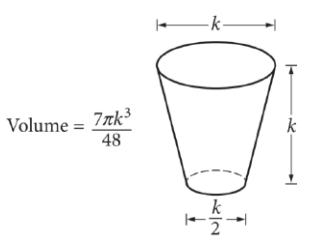
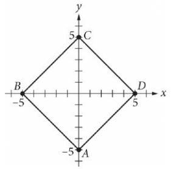

{0}------------------------------------------------

# Question ID f67e4efc

| Assessment | Test | Domain                       | Skill           | Difficulty |
|------------|------|------------------------------|-----------------|------------|
| SAT        | Math | Geometry and Trigonometry | Area and volume |            |
|            |      |                              |                 |            |

ID: f67e4efc

2.1

A right circular cylinder has a volume of 45 m. If the height of the cylinder

is 5, what is the radius of the cylinder?

A. 3 B. 4.5 C. 9 D. 40

### ID: f67e4efc Answer

Correct Answer: A

Rationale

Choice A is correct. The volume of a right circular cylinder with a radius of r is the area of the base, TT, and the height, h. The volume of the right circular cylinder described is 4577 and its height is 5. If the radius is r, it follows that 45 n = π(r)-(5). Dividing both sides of this equation by 5 π yields 9 = 12. Taking the square root of both sides yields r = 3 or r = − 3. Since r represents the radius, the value must be positive. Therefore, the radius is 3.

Choice B is incorrect and may result from finding that the square of the radius is 9, but then from dividing 9 by 2, rather than taking the square root of 9. Choice C is incorrect. This represents the square of the radius. Choice D is incorrect and may result from solving the equation 45 π = π(7) (5) for 2, not r, by dividing by π on both sides and then by subtracting, not dividing, 5 from both sides.

{1}------------------------------------------------

## Question ID 5afbdc8e

| Area and volume SAT Math Geometry and | Assessment | Test | Domain       | Skill | Difficulty |
|------------------------------------------------|------------|------|--------------|-------|------------|
|                                                |            |      | Trigonometry |       |            |

#### ID: 5afbdc8e

2.2

What is the length of one side of a square that has the same area as a circle with radius 2 ?

A. 2

- в. 2 л
c. 2√ π

D. 2 π

### ID: 5afbdc8e Answer

Correct Answer: C

Rationale

Choice C is correct. The area A of a circle with radius r is given by the formula A = m - . Thus, a circle with radius 2 has area 722), which can be rewritten as 4 n. The area of a square with side length s is given by the formula A = S. Thus, if a square has the same area as a circle with radius 2, then \$ = 4 T. Since the side length of a square must be a positive number, taking the square root of both sides of 8 = 4 π gives S = √ 4 π Using the properties of square roots, √ A π can be rewritten as √ 4 J W 77, which is equivalent to 2 √ π Therefore, § = 2√ π

Choice A is incorrect. The side length of the square isn't equal to the radius of the circle. Choices B and D are incorrect and may result from incorrectly simplifying the expression √ 4 π

{2}------------------------------------------------

# Question ID ec5d4823

| SAT Math Area and volume Geometry and Trigonometry | Assessment | Test | Domain | Skill | Difficulty |
|----------------------------------------------------------------|------------|------|--------|-------|------------|
|                                                                |            |      |        |       |            |

ID: ec5d4823

2.3

What is the volume, in cubic centimeters, of a right rectangular prism that has a length of 4 centimeters, a width of 9 centimeters, and a height of 10 centimeters?

## ID: ec5d4823 Answer

Rationale

The correct answer is 360. The volume of a right rectangular prism is calculated by multiplying its dimensions: length, width, and height. Multiplying the values given for these dimensions yields a volume of (4)(9)(10) = 360 cubic centimeters.

{3}------------------------------------------------

## Question ID 151eda3c

| Assessment | Test | Domain                       | Skill           | Difficulty |
|------------|------|------------------------------|-----------------|------------|
| SAT        | Math | Geometry and Trigonometry | Area and volume |            |
|            |      |                              |                 |            |

#### ID: 151eda3c

2.4

A manufacturing company produces two sizes of cylindrical containers that each have a height of 50 centimeters. The radius of container A is 16 centimeters, and the radius of container B is 25% longer than the radius of container A. What is the volume, in cubic centimeters, of container B?

A. 16,000 π

B. 20,000 π

C. 25,000 π

D. 31,250 π

### ID: 151eda3c Answer

Correct Answer: B

Rationale

Choice B is correct. If the radius of container A is 16 centimeters and the radius of container B is 25% longer than the radius of container A, then the radius of container B is 16 + (0.25)(16) = 20 centimeters. The volume of a cylinder is m-h, where r is the radius of the cylinder and h is its height. Substituting r = 20 and h = 50 into m2 h yields that the volume of cylinder B is π(20)2(50) = 20,000 π cubic centimeters.

Choice A is incorrect and may result from multiplying the radius of cylinder B by the radius of cylinder A rather than squaring the radius of cylinder B. Choice C is incorrect and may result from multiplying the radius of cylinder B by 25 rather than squaring it. Choice D is incorrect and may result from taking the radius of cylinder B to be 25 centimeters rather than 20 centimeters.

{4}------------------------------------------------

## Question ID 38517165

| Assessment   | Test | Domain                       | Skill           | Difficulty |
|--------------|------|------------------------------|-----------------|------------|
| SAT          | Math | Geometry and Trigonometry | Area and volume |            |
| ID: 38517165 |      |                              |                 | 2.5        |

A circle has a circumference of 31m centimeters. What is the diameter, in centimeters, of the circle?

#### ID: 38517165 Answer

Correct Answer: 31

Rationale

The correct answer is 31. The circumference of a circle is equal to 2mr centimeters, where r represents the radius, in centimeters, of the circle, and the diameter of the circle is equal to 2r centimeters. It's given that a circle has a circumference of 31m centimeters. Therefore, 31m = 2mm Dividing both sides of this equation by π yields 31 = 2r. Since the diameter of the circle is equal to 2r centimeters, it follows that the diameter, in centimeters, of the circle is 31.

{5}------------------------------------------------

# Question ID 08b7a3f5

| Assessment   | Test | Domain                       | Skill           | Difficulty |
|--------------|------|------------------------------|-----------------|------------|
| SAT          | Math | Geometry and Trigonometry | Area and volume |            |
| ID: 08b7a3f5 |      |                              |                 | 2.6        |

A triangular prism has a height of 8 centimeters (cm) and a volume of 216 cm³. What is the area, in cm², of the base of the prism? (The volume of a triangular prism is equal to Bh, where B is the area of the base and ½ is the height of the prism.)

#### ID: 08b7a3f5 Answer

Correct Answer: 27

Rationale

The correct answer is 27. It's given that a triangular prism has a volume of 216 cubic centimeters (cm³) and the volume of a triangular prism is equal to Bh, where B is the area of the base and 1 is the height of the prism. Therefore, 216 = Bh. It's also given that the triangular prism has a height of 8 cm. Therefore, h = 8. Substituting 8 for h in the equation 216 = Bh yields 216 = B(8). Dividing both sides of this equation by 8 yields 27 = B. Therefore, the area, in cm2, of the base of the prism is 27.

{6}------------------------------------------------

## Question ID a2e76b60

| Assessment | Test | Domain                       | Skill           | Difficulty |
|------------|------|------------------------------|-----------------|------------|
| SAT        | Math | Geometry and Trigonometry | Area and volume |            |

### ID: a2e76b60

2.7

A cylindrical can containing pieces of fruit is filled to the top with syrup before being sealed. The base of the can has an area of 75 cm², and the

height of the can is 10 cm. If 110 cm3 of syrup is needed to fill the can to

the top, which of the following is closest to the total volume of the pieces of fruit in the can?

A. 7.5 cm3

B. 185 cm3

c. 640 cm3

D. 750 cm3

#### ID: a2e76b60 Answer

Correct Answer: C

Rationale

Choice C is correct. The total volume of the cylindrical can is found by multiplying the area of the can, 75 cm², by the height of the can, 10 cm, which yields 750 cm³. If the syrup needed to fill the can has a volume of 110 cm3, then the remaining volume for the pieces of fruit is 750-110 =640 cm3

Choice A is incorrect because if the fruit had a volume of 7.5 cm3, there would be 750 – 7.5 = 742.5 cm3 of syrup needed to fill the can to the top. Choice B is incorrect because if the fruit had a volume of 185 cm³, there would be 750–185 = 565 cm³ of syrup needed to fill the can to the top. Choice D is incorrect because it is the total volume of the can, not just of the pieces of fruit.
{7}------------------------------------------------

## Question ID 37dde49f

| Assessment | Test | Domain                       | Skill           | Difficulty |
|------------|------|------------------------------|-----------------|------------|
| SAT        | Math | Geometry and Trigonometry | Area and volume |            |

### ID: 37dde49f

The glass pictured above can hold a maximum volume of 473 cubic centimeters, which is approximately 16 fluid ounces. What is the value of k, in centimeters?

A. 2.52

- B. 7.67
- C. 7.79

D. 10.11

#### ID: 37dde49f Answer

Correct Answer: D

Rationale

$$=\frac{7\pi k^3}{}$$

V 48 Choice D is correct. Using the volume formula and the given information that the volume of the

glass is 473 cubic centimeters, the value of k can be found as follows:

$$473 = \frac{7\,\text{\pi k}^3}{48}$$

$$
\kappa^3 = \frac{473(48)}{7\,\pi}
$$

$$\kappa = \sqrt[3]{\frac{473(48)}{7\,\pi}} \approx 10.10690$$

Therefore, the value of k is approximately 10.11 centimeters.

Choices A, B, and C are incorrect. Substituting the values of k from these choices in the formula results in volumes of approximately 7 cubic centimeters, 207 cubic centimeters, and 217 cubic centimeters, respectively, all of which contradict the given information that the volume of the glass is 473 cubic centimeters.

2.8

{8}------------------------------------------------

{9}------------------------------------------------

## Question ID cf53cb56

| Assessment | Test | Domain                       | Skill           | Difficulty |
|------------|------|------------------------------|-----------------|------------|
| SAT        | Math | Geometry and Trigonometry | Area and volume |            |

2.9

### ID: cf53cb56

In the xy-plane shown, square ABCD has its diagonals on the x- and y-axes. What is the area, in square units, of the square?

A. 20

B. 25

- C. 50
D. 100

### ID: cf53cb56 Answer

Correct Answer: C

Rationale

Choice C is correct. The two diagonals of square ABCD divide the square into 4 conqruent right triangles, where each triangle has a vertex at the origin of the graph shown. The area of a triangle is l bh , where b is the base length of the triangle and h is the triangle. Each of the 4 congruent right triangles has a height of 5 units and a base length of 5 units. Therefore, the area of each triangle is T or 12.5 square units. Since the 4 right triangles are congruent, the area of each is 4 of the area of square ABCD. It follows that the area of the square ABCD is equal to 4 x 12,5, or 50 square units.

Choices A and D are incorrect and may result from using 5 or 25, respectively, as the area of one of the 4 congruent right triangles formed by diagonals of square ABCD. However, the area of these triangles is 12.5. Choice B is incorrect and may result from using 5 as the length of one side of square ABCD. However, the length of a side of square ABCD is 5√2

{10}------------------------------------------------

# Question ID d621cffb

| Assessment          | Test | Domain                                                                              | Skill           | Difficulty |
|---------------------|------|-------------------------------------------------------------------------------------|-----------------|------------|
| SAT                 | Math | Geometry and Trigonometry                                                        | Area and volume |            |
| ID: d621cffb        |      |                                                                                     |                 | 2.10       |
|                     |      | A sphere has a radius of 47 feet. What is the volume, in cubic feet, of the sphere? |                 |            |
| A.                  |      |                                                                                     |                 |            |
| இந் B.           |      |                                                                                     |                 |            |
| ്ലീം  റോ C.      |      |                                                                                     |                 |            |
| D. 19,6527 375   |      |                                                                                     |                 |            |
| ID: d621cffb Answer |      |                                                                                     |                 |            |

#### Correct Answer: D

#### Rationale

Choice D is correct. The volume, V, of a sphere can be found using the formula V = - - - where r is the radius of the sphere. It's given that the sphere has a radius of ' feet. Substituting 12 for r in the formula V = 2773 yields I , which is . Therefore, the volume, in cubic feet, of the sphere is 19,52 4,913
 19,652π equivalent to V = 375

Choice A is incorrect and may result from conceptual or calculation errors.

Choice B is incorrect. This is the volume, in cubic feet, of a sphere with a radius of ു 17 feet.

Choice C is incorrect and may result from conceptual or calculation errors.

{11}------------------------------------------------

# Question ID 3b931fb0

| Assessment | Test | Domain                       | Skill           | Difficulty |
|------------|------|------------------------------|-----------------|------------|
| SAT        | Math | Geometry and Trigonometry | Area and volume |            |
|            |      |                              |                 |            |

### ID: 3b931fb0

2.11

A right circular cylinder has a volume of 377 cubic centimeters. The area of the cylinder is 13 square centimeters. What is the height, in centimeters, of the cylinder?

### ID: 3b931fb0 Answer

Correct Answer: 29

#### Rationale

The correct answer is 29. The volume, V, of a right circular cylinder is given by the formula V = π %, where r is the radius of the base of the cylinder and h is the height of the base of the cylinder is a circle with radius r, the area of the base of the cylinder is 772. It's given that a right circular cylinder has a volume of 377 cubic centimeters; therefore, V = 377. It's also given that the area of the cylinder is 13 square centimeters; therefore, m2 = 13. Substituting 377 for V and 13 for zr² in the formula V = π-% yields 377 = 13h. Dividing both sides of this equation by 13 yields 29 = ½. Therefore, the height of the cylinder, in centimeters, is 29.

{12}------------------------------------------------

# Question ID cecbdeba

| Area and volume Math Geometry and SAT | Assessment | Test | Domain       | Skill | Difficulty |
|------------------------------------------------|------------|------|--------------|-------|------------|
|                                                |            |      | Trigonometry |       |            |

### ID: cecbdeba

2.12

A right circular cylinder has a volume of 432 cubic centimeters. The area of the cylinder is 24 square centimeters. What is the height, in centimeters, of the cylinder?

- A. 18
- B. 24
- c. 216

D. 10,368

### ID: cecbdeba Answer

#### Correct Answer: A

#### Rationale

Choice A is correct. The volume, V, of a right circular cylinder is given by the formula V = π º is the area of the base of the cylinder and h is the height . It's qiven that a right circular cylinder has a volume of 432 cubic centimeters and the area of the base is 24 square centimeters. Substituting 432 for 77-2 in the formula V = π-2 vields 432 = 24h. Dividing both sides of this equation by 24 yields 18 = ½. Therefore, the height of the cylinder, in centimeters, is 18.

Choice B is incorrect. This is the area of the base, in square centimeters, not the height, in centimeters, of the cylinder.

Choice C is incorrect. This is the height, in centimeters, of a cylinder if its volume is 432 cubic centimeters and the area of its base is 2, not 24, cubic centimeters.

Choice D is incorrect. This is the height, in centimeters, of a cylinder if its volume is 432 cubic centimeters and the area of its base is 2, not 24, cubic centimeters.

{13}------------------------------------------------

# Question ID e0874bc2

| Assessment | Test | Domain                       | Skill           | Difficulty |
|------------|------|------------------------------|-----------------|------------|
| SAT        | Math | Geometry and Trigonometry | Area and volume |            |
|            |      |                              |                 |            |

2.13

The table gives the perimeters of similar triangles TUV and XY Z, where TU corresponds to XY. The length of TU is 18.

|               | Perimeter |
|---------------|-----------|
| Triangle TUV  | 37        |
| Triangle XY Z | 333       |

What is the length of XY?

ID: e0874bc2

A. 2

B. 18

C. 55

D. 162

### ID: e0874bc2 Answer

#### Correct Answer: D

#### Rationale

Choice D is correct. It's given that triangle XYZ is similar to triangle TVV. Therefore, each side of triangle XYZ is k times its corresponding side of triangle TUV, where k is a constant. It follows that the perimeter of triangle XYZ is k times the perimeter of triangle TUV. It's also given that TU corresponds to XY and the length of TU is 18. Let x represent the length of XY. It follows that x = 18k. The table shows that the perimeters of triangles TUV and XYZ are 37 and 333, respectively. It follows that 333 = 37k, or 9 = k. Substituting 9 for k in the equation x = 18%, or x = 162. Therefore, the length of XY is 162.

Choice A is incorrect and may result from conceptual or calculation errors.

Choice B is incorrect. This is the length of TU, not the length of XY.

Choice C is incorrect and may result from conceptual or calculation errors.