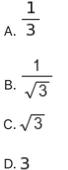
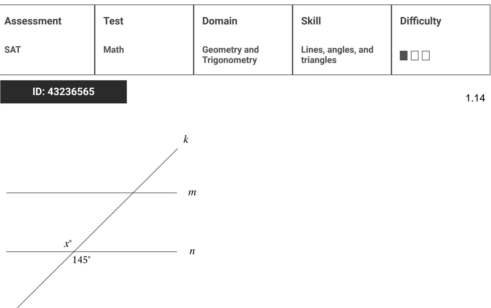

{0}------------------------------------------------

# Question ID a07ed090

| Assessment | Test | Domain                       | Skill           | Difficulty |
|------------|------|------------------------------|-----------------|------------|
| SAT        | Math | Geometry and Trigonometry | Area and volume |            |
|            |      |                              |                 |            |

## ID: a07ed090

The figure shown is a right circular with a radius of r and height of b. A second right circular cylinder (not shown) has a volume that is 392 times as large as the volume of the cylinder shown. Which of the following could represent the radius R, in terms of m, and the height II, in terms of h, of the second cylinder?

- A. R = 8r and H = 7h
- B. R = 8r and H = 49h
- C. R = 7r and H = 8h
- D. R = 49r and H = 8h

### ID: a07ed090 Answer

Correct Answer: C

#### Rationale

Choice C is correct. The volume of a right circular cylinder is equal to πα4ο, where a is the radius of a base of the cylinder and b is the height of the cylinder. It's given that the cylinder shown has a radius of r and a height of h. It follows that the volume of the cylinder shown is equal to m2%. It's given that the second right circular cylinder has a radius of R and a height of H. It follows that the volume of the second cylinder is equal to n R2 H. Choice C gives R = 7r and H = 8h. Substituting 7r for R and 8h for H in the expression that represents the volume of the second cylinder yields π(7η)2(8h), οι π(49m²)(8h), which is equivalent to n (392r2 h), or 392 (7m²h). This expression is equal to 392 times the volume of the cylinder shown, πο 7. Therefore, R = 7 and H = 8h could represent the radius R, in terms of m, and the height H, in terms of h, of the second cylinder.

Choice A is incorrect. Substituting 8r for Rand 7h for H in the expression that represents the volume of the second cylinder yields π(8r)2(7h), οι π (64m²)(7½), which is equivalent to π (448m²), οι 448(π°27). This expression is equal to 448, not 392, times the volume of the cylinder shown.

Choice B is incorrect. Substituting &r for Rand 49% for H in the expression that represents the volume of the second cylinder yields π(8r)2(49h), οι π (64r²)(49h), which is equivalent το π (3,136(7m²h), This expression is equal to 3,136, not 392, times the volume of the cylinder shown.

3.1

{1}------------------------------------------------

Choice D is incorrect. Substituting 49r for R and 8h for H in the expression that represents the volume of the second cylinder yields π(49m)2(8h), or π(2,401m2)(8h), which is equivalent to π(19,208r27), or 19,208 (774). This expression is equal to 19,208, not 392, times the volume of the cylinder shown.

{2}------------------------------------------------

# Question ID 899c6042

ID: 899c6042

| Assessment | Test | Domain                       | Skill           | Difficulty |
|------------|------|------------------------------|-----------------|------------|
| SAT        | Math | Geometry and Trigonometry | Area and volume |            |
|            |      |                              |                 |            |

A right circular cone has a height of 22 centimeters (cm) and a base with a diameter of 6 cm. The volume of this cone is nn cm3. What is the value of n?

#### ID: 899c6042 Answer

Correct Answer: 66

Rationale

The correct answer is 66. It's given that the right circular cone has a height of 22 centimeters (cm) and a base with a diameter of 6 cm. Since the diameter of the base of the cone is 6 cm, the radius of the base is 3 cm. The volume V, in cm³, of a right circular cone can be found using the formula V = 3 m²b, where h is the height, in cm, and r is the radius, in cm, of the base of the cone. Substituting 22 for h and 3 for r in this formula yields V = cone is nn cm3. Therefore, the value of n is 66.

Question Difficulty: Hard

3.2

{3}------------------------------------------------

# Question ID b0dc920d

| Assessment | Test | Domain                       | Skill           | Difficulty |
|------------|------|------------------------------|-----------------|------------|
| SAT        | Math | Geometry and Trigonometry | Area and volume |            |

## ID: b0dc920d

3.3

A manufacturer determined that right cylindrical containers with a height that is 4 inches longer than the radius offer the optimal number of containers to be displayed on a shelf. Which of the following expresses the volume, V, in cubic inches, of such containers, where r is the radius, in inches?

A. V = 4 m3

B. V = π(2r)3

- c. V = π2 + 4 πι
- D. V = m3 + 4 m2

### ID: b0dc920d Answer

Correct Answer: D

#### Rationale

Choice D is correct. The volume, V, of a right cylinder is given by the formula V = m-h, where r represents the radius of the base of the cylinder and h represents the height is 4 inches longer than the radius, the expression r+4 represents the height of each cylindrical container. It follows that the volume of each container is represented by the equation V = π -(r+4). Distributing the expression π into each term in the parentheses yields V = πη3 +4 π2

Choice A is incorrect and may result from representing the height as 4r instead of r+4. Choice B is incorrect and may result from representing the height as 2r instead of r+4. Choice C is incorrect and may result from representing the volume of a right cylinder as V = πή instead of V = π -h

{4}------------------------------------------------

# Question ID 5b2b8866

| Assessment   | Test | Domain                       | Skill           | Difficulty |
|--------------|------|------------------------------|-----------------|------------|
| SAT          | Math | Geometry and Trigonometry | Area and volume |            |
| ID: 5b2b8866 |      |                              |                 | 3.4        |

A rectangular poster has an area of 360 square inches. A copy of the poster is made in which the length and width of the original poster are each increased by 20%. What is the area of the copy, in square inches?

#### ID: 5b2b8866 Answer

Correct Answer: 2592/5, 518.4

Rationale

The correct answer is 518.4. It's given that the area of the original poster is 360 square inches. Let ? represent the length, in inches, of the original poster, and let w represent the width, in inches, of the original poster. Since the area of a rectangle is equal to its length times its width, it follows that 360 = %. It's also given that a copy of the poster is made in which the length and width of the original poster are each increased by 20%. It follows that the length of the copy is the length of the original poster plus 20% of the original poster, which is equivalent to t + - inches. This length can be rewritten as ? + 0.22 inches. Similarly, the width of the copy is the width of the original poster plus 20% of the width of the original poster, which is equivalent to w + 20 inches. This width can be rewritten as w + 0.2w inches. Since the area of a rectangle is equal to its length times its width, it follows that the area, in square inches, of the copy is equal to (1.2/)(1.2w), which can be rewritten as (1.2)(1.2)(1.2)(1.2)(1.2)(1.2)(1.2. area, in square inches, of the copy can be found by substituting 360 for tw in the expression (1.2)(1.2)(1.2)(1.2)(1.2) yields (1.2)(1.2)(360), or 518.4. Therefore, the area of the copy, in square inches, is 518.4.

{5}------------------------------------------------

# Question ID 9f934297

| Assessment   | Test | Domain                       | Skill           | Difficulty |
|--------------|------|------------------------------|-----------------|------------|
| SAT          | Math | Geometry and Trigonometry | Area and volume |            |
| ID: 9f934297 |      |                              |                 | 3.5        |

A right rectangular prism has a length of 28 centimeters (cm), a width of 15 cm, and a height of 16 cm. What is the surface area, in cm2, of the right rectangular prism?

### ID: 9f934297 Answer

Correct Answer: 2216

Rationale

The correct answer is 2,216. The surface area of a prism is the areas of all its faces. A right rectangular prism consists of six rectangular faces, where opposite faces are congruent. It's given that this prism has a length of 28 cm, a width of 15 cm, and a height of 16 cm. Thus, for this prism, there are two faces with area (28)(15) cm², two faces with area (28)(16) cm², and two faces with area (15)(16) cm². Therefore, the surface area, in cm2, of the right rectangular prism is 2(28)(16) + 2(15)(16) + 2(15)(16), or 2,216.

{6}------------------------------------------------

# Question ID dc71597b

| Assessment | Test | Domain                       | Skill           | Difficulty |
|------------|------|------------------------------|-----------------|------------|
| SAT        | Math | Geometry and Trigonometry | Area and volume |            |

#### ID: dc71597b

3.6

A right circular cone has a volume of cubic feet and a height of 9 feet. 3

What is the radius, in feet, of the base of the cone?

ID: dc71597b Answer

Correct Answer: A

Rationale

It's qiven that the Choice A is correct. The equation for the volume of a right circular cone is IT cubic feet and the height is 9 feet. Substituting these values for V and volume of the right circular cone is 3 Dividing both sides of the equation by 3 h, respectively, gives both sides of the equation by 9 gives 9 Taking the square root of both sides results in two possible g . Since the radius can't have a negative value, that leaves values for the radius, I as Q the only possibility. Applying the quotient property of square roots, W b

Choices B and C are incorrect and may result from incorrectly evaluating \ g . Choice D is incorrect and may result from solving r2 = 9 instead of g

{7}------------------------------------------------

# Question ID 93de3f84

| SAT Math |                              |                 |  |
|-------------|------------------------------|-----------------|--|
|             | Geometry and Trigonometry | Area and volume |  |

## ID: 93de3f84

3.7

The volume of right circular cylinder A is 22 cubic centimeters. What is the volume, in cubic centimeters, of a right circular cylinder with twice the radius and half the height of cylinder A?

| A. 11 |  |  |
|-------|--|--|
| B. 22 |  |  |
| C. 44 |  |  |
| D. 66 |  |  |
|       |  |  |

## ID: 93de3f84 Answer

Correct Answer: C

Rationale

Choice C is correct. The volume of right circular cylinder A is given by the expression 7027, where r is the radius of its circular base and h is its height. The volume of a cylinder with twice the radius and half the height of cylinder A is given by . Therefore, the which is equivalent to volume is twice the volume of cylinder A, or 2×22 = 44

Choice A is incorrect and likely results from not multiplying the radius of cylinder A by 2. Choice B is incorrect and likely results from not squaring the 2 in 2r when applying the volume formula. Choice D is incorrect and likely results from a conceptual error.
{8}------------------------------------------------

# Question ID eb70d2d0

What is the area, in square units, of the triangle formed by connecting the three points shown?

#### ID: eb70d2d0 Answer

Correct Answer: 24.5, 49/2

Rationale

The correct answer is 24.5. It's given that a triangle is formed by connecting the three points shown, which are (-3, 4), (5, 3), and (4, -3). Let this triangle be triangle A. The area of triangle A can be found by calculating the area of the rectangle that circumscribes it and subtracting the areas of the three triangles that are inside the rectangle but outside triangle A. The rectangle formed by the points (—3, 4), (5, —3), and (-3, -3) circumscribes triangle A. The width, in units, of this rectangle can be found by calculating the distance between the points (5, 4) and (5, -3). This distance is 4 - (-3), or 7. The length, in units, of this rectangle can be found by calculating the distance between the points (5, 4) and (-3, 4). This distance is 5 — (—3), or 8. It follows that the area, in square units, of the rectangle is (7)(8), or 56. One of the triangles that lies inside the rectangle but outside triangle A is formed by the points (-3, 4), (5, 4), and (5, 3). The length, in units, of a base of this triangle can be found by calculating the distance between the points (5, 4) and (5, 3). This distance is 4 - 3, or 1. The corresponding height, in units, of this triangle can be found by calculating the distance between the points (5, 4) and (-3, 4). This distance is 5 - (-3), or 8. It follows that the area, in square units, of this triangle is ½(8)(1), or 4. A second triangle that lies inside the rectangle but outside triangle A is formed by the points (4, -3), (5, 3), and (5, -3). The length, in units, of a base of this triangle can be found by calculating the distance between the points (5, 3) and (5, -3). This distance is

{9}------------------------------------------------

3 — (—3) , or 6. The corresponding height, in units, of this triangle can be found by calculating the distance between the points (5, -3) and (4, -3). This distance is 5 - 4, or 1. It follows that the area, in square units, of this triangle is ½(1)(6), or 3. The third triangle that lies inside the rectangle but outside triangle A is formed by the points (-3, 4), (-3, -3), and (4, -3). The length, in units, of a base of this triangle can be found by calculating the distance between the points (4, -3) and (-3, -3). This distance is 4 - (-3), or 7. The corresponding height, in units, of this triangle can be found by calculating the distance between the points (-3, 4) and (-3, -3). This distance is 4 - (-3), or 7. It follows that the area, in square units, of this triangle is 7 (7) (7), or 24.5. Thus, the area, in square units, of the triangle formed by connecting the three points shown is 56 – 4 – 3 – 24.5, or 24.5. Note that 24.5 and 49/2 are examples of ways to enter a correct answer.

{10}------------------------------------------------

# Question ID f7e626b2

| Area and volume Geometry and SAT Math Trigonometry | Assessment | Test | Domain | Skill | Difficulty |
|----------------------------------------------------------------|------------|------|--------|-------|------------|
|                                                                |            |      |        |       |            |

## ID: f7e626b2

3.9

The dimensions of a right rectangular prism are 4 inches by 5 inches by 6 inches. What is the surface area, in square inches, of the prism?

B. 74

C. 120

D. 148

### ID: f7e626b2 Answer

Rationale

Choice D is correct. The surface area is found by summing the area of each face. A right rectangular prism consists of three pairs of congruent rectangles, so the surface area is found by multiplying the areas of three adjacent rectangles by 2 and adding these products. For this prism, the surface area is equal to 2(4 · 5) + 2(5 · 6) + 2(4 · 6), or 2(20) + 2(30) + 2(24), which is equal to 148.

Choice A is incorrect. This is the area of one of the faces of the prism. Choice B is incorrect and may result from adding the areas of three adjacent rectangles without multiplying by 2. Choice C is incorrect. This is the volume, in cubic inches, of the prism.

{11}------------------------------------------------

# Question ID 459dd6c5

| Assessment           | Test | Domain                       | Skill           | Difficulty |
|----------------------|------|------------------------------|-----------------|------------|
| SAT                  | Math | Geometry and Trigonometry | Area and volume |            |
| 0 10 IB. AECASCAE |      |                              |                 |            |

Triangles ABC and DEF are similar. Each side length of triangle ABC is 4 times the corresponding side length of triangle DEF. The area of triangle ABC is 270 square inches. What is the area, in square inches, of triangle DIFF?

### ID: 459dd6c5 Answer

Correct Answer: 135/8, 16.87, 16.88

Rationale

The correct answer is 436. It's given that triangles ABC and DEF are similar and each side length of triangle ABC is 4 times the corresponding side length of triangle DEF. For two similar triangles, if each side length of the first triangle is h times the corresponding side length of the second triangle, then the area of the first trianqle is 14 times the area of the second triangle. Therefore, the area of triangle ABC is 44 , or 16, times the area of triangle DEF. It's given that the area of triangle ABC is 270 square inches. Let a represent the area, in square inches, of triangle DEF: It follows that 270 is 16 times a, or 270 = 16a. Dividing both sides of this equation by 16 yields 200 = a, which is equivalent to 430 = a. Thus, the area, in square inches, of triangle DEF is 1355. Note that 135/8, 16.87, and 16.88 are examples of ways to enter a correct answer.

{12}------------------------------------------------

## Question ID 310c87fe

| Assessment | Test | Domain                       | Skill           | Difficulty |
|------------|------|------------------------------|-----------------|------------|
| SAT        | Math | Geometry and Trigonometry | Area and volume |            |

#### ID: 310c87fe

3.11

A cube has a surface area of 54 square meters. What is the volume, in cubic meters, of the cube?

| A. 18 |       |
|-------|-------|
|       | B. 27 |
|       | C. 36 |

D. 81

#### ID: 310c87fe Answer

Correct Answer: B

Rationale

Choice B is correct. The surface area of a cube with side length s is equal to ၆s - Since the surface area is given as 54 square meters, the equation 54 = 6s² can be used to solve for s. Dividing both sides of the equation by 6 yields 9 = s2. Taking the square root of both sides of this equation yields 3 = s and – 3 = s. Since the side length of a cube must be a positive value, s = - 3 can be discarded as a possible solution, leaving g = 3. The volume of a cube with side length s is equal to 8. Therefore, the volume of this cube, in cubic meters, is 3, or 27.

Choices A, C, and D are incorrect and may result from calculation errors.

{13}------------------------------------------------

# Question ID 983412ea

| Assessment | Test | Domain                       | Skill           | Difficulty |
|------------|------|------------------------------|-----------------|------------|
| SAT        | Math | Geometry and Trigonometry | Area and volume |            |
|            |      |                              |                 |            |

#### ID: 983412ea

3.12

A right square prism has a height of 14 units. The volume of the prism is 2,016 cubic units. What is the length, in units, of an edge of the base?

#### ID: 983412ea Answer

Correct Answer: 12

#### Rationale

The correct answer is 12. The volume, V, of a right square prism can be calculated using the formula V = 3%, where s represents the length of an edge of the base and It represents the height of the prism. It's given that the prism is 2,016 cubic units and the height is 14 units. Substituting 2,016 for V and 14 for h in the formula V = s°h yields 2,016 = s-14. Dividing both sides of this equation by 14 yields 144 = s-. Taking the square root of both sides of this equation yields two solutions: -12 = s and 12 = s. The length can't be negative, so 12 = s. Therefore, the length, in units, of an edge of the base is 12.

{14}------------------------------------------------

# Question ID 099526fc

The line segment shown in the xy-plane represents one of the legs of a right triangle. The area of this triangle is 36v / 3 square units. What is the length, in units, of the other leg of this triangle?

A. 12

B. 24

c. 3</13

- D. 18/13
## ID: 099526fc Answer

Correct Answer: B

{15}------------------------------------------------

# Question ID 8c1aa743

| Assessment | Test | Domain                       | Skill           | Difficulty |
|------------|------|------------------------------|-----------------|------------|
| SAT        | Math | Geometry and Trigonometry | Area and volume |            |
|            |      |                              |                 |            |

## ID: 8c1aa743

3.14

Rectangles ABCD and EFGH are similar. The length of EFGH is 6 times the length of the corresponding side of ABCD. The area of ABCD is 54 square units. What is the area, in square units, of EFGH?

- A. 9
B. 36

c. 324

D. 1,944

### ID: 8c1aa743 Answer

#### Correct Answer: D

#### Rationale

Choice D is correct. The area of a rectangle is given by bly, where b is the base of the rectangle and his its height. Let x represent the length, in units, of the base of rectangle ABCD, and let y represent its height, in units. Substituting x for b and y for h in the formula bh yields xy. Therefore, the area, in square units, of ABCD can be represented by the expression xy. It's given that the length of each side of EFGH is 6 times the length of the of ABCD. Therefore, the length, in units, of the base of EFGH can be repression 6x, and its height, in units, can be represented by the expression 6v. Substituting 6x for b and 6y for h in the formula bly vields 6x6y. Therefore, the area, in square units, of EFGH can be repression 36xy. It's given that the area of ABCD is 54 square units. Since xy represents the area, in square units, of ABCD, substituting 54 for xy in the expression 36xy vields 3654, or 1,944. Therefore, the area, in square units, of EFGH is 1,944.

- , not 6, times the Choice A is incorrect. This is the area of a rectangle where the length of each side of the rectangle is length of the corresponding side of ABCD.

Choice B is incorrect. This is the area of a rectangle where the length of each side of the rectangle is , not 6, times the length of the corresponding side of ABCD.

Choice C is incorrect. This is the area of a rectangle where the length of each side of the rectangle is , 76 , not 6, times the length of the corresponding side of ABCD.