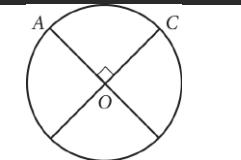

{0}------------------------------------------------

## Question ID 23c5fcce

| Assessment  | Test | Domain                       | Skill   | Difficulty |
|-------------|------|------------------------------|---------|------------|
| SAT Math |      | Geometry and Trigonometry | Circles |            |

1.1

ID: 23c5fcce

The circle above with center O has a circumference of 36. What is the length of minor arc AC?

A. 9

B. 12

C. 18

D. 36

ID: 23c5fcce Answer

Correct Answer: A

Rationale

Choice A is correct. A circle has 360 degrees of arc. In the circle shown, O is the center of the circle and ZAOC is a central angle of the circle. From the figure, the two diameters that meet to form ∠AOC are 90 perpendicular, so the measure of ∠AOCis 90°. Therefore, the length of minor arc é is 360 of the circumference of the circle. Since the circumference of the circle is 36, the length of minor are AG is 90 x36=9 360 Choices B, C, and D are incorrect. The perpendicular diameters divide the circumference of the circle into four T equal arcs; therefore, minor arc AC is 4 of the circumference. However, the lengths in choices B and C are,

l respectively, 3 and 2 the circumference of the circle, and the length in choice D is the length of the entire l circumference. None of these lengths is 4 the circumference.