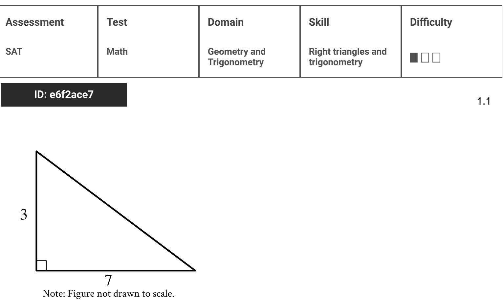
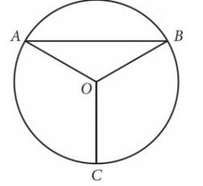

{0}------------------------------------------------

# Question ID c8345903

#### ID: c8345903 Answer

Correct Answer: B

Rationale

Choice B is correct. The ratio of the lengths of two arcs of a circle is equal to the measures of the central angles that subtend the arcs. It's given that arc ADC is subtended by a central angle with measure 100°. Since the sum of the measures of the angles about a point is 360°, it follows that arc ABC is subtended by a central angle with measure 360°—100° =260°. If s is the length of arc ÅBC; then s must satisfy the ratio S 260 260 13 S 13 100 . Reducing the fraction 100 to its simplest form gives 5 . Therefore, 5 n 5 . Multiplying 5 π 13 S both sides of 5 π by 5 π yields § = 13 π 5

Choice A is incorrect. This is the length of an arc consisting of exactly half of the circle, but arc ABC is greater than half of the circle. Choice C is incorrect. This is the total circumference of the circle. Choice D is incorrect. This is half the length of arc ABC, not its full length.

{1}------------------------------------------------

# Question ID 2266984b

ID: 2266984b

x2 +20x + y2 + 16y = - 20

| Assessment | Test | Domain                       | Skill   | Difficulty |
|------------|------|------------------------------|---------|------------|
| SAT        | Math | Geometry and Trigonometry | Circles |            |
|            |      |                              |         |            |

3.2

The equation above defines a circle in the xy-plane. What are the coordinates of the center of the circle?

A. (-20,-16) B. (-10,-8) c. (10,8)

D. (20,16)

### ID: 2266984b Answer

Correct Answer: B

Rationale

Choice B is correct. The standard equation of a circle in the xy-plane is of the form (x – h)2 = (y – k) = r2 where (h, k) are the coordinates of the center of the circle and r is the radius. The given equation can be rewritten in standard form by completing the squares. So the sum of the first two terms, x ~ + 20x, needs a 100 to complete the square, and the sum of the second two terms, Y + 10y, needs a 64 to complete the square. Adding 100 and 64 to both sides of the given equation yields (x2+20x +100)+(y2+16y +64) = −20+100 +64, which is equivalent to (x+10)2 +(y +8)² = 144 Therefore, the coordinates of the center of the circle are (-10, -8).

Choices A, C, and D are incorrect and may result from computational errors made when attempting to complete the squares or when identifying the coordinates of the center.

{2}------------------------------------------------

# Question ID 69b0d79d

| Assessment | Test | Domain                       | Skill   | Difficulty |
|------------|------|------------------------------|---------|------------|
| SAT        | Math | Geometry and Trigonometry | Circles |            |

l

3.3

### ID: 69b0d79d

Point O is the center of the circle above, and the measure of __OAB is 30°

|  | If the length of OC is 18, what is the length of arc AB? |  |  |  |
|--|----------------------------------------------------------|--|--|--|

A. 9 π

B. 12 π

C. 15 π

D. 18 π

### ID: 69b0d79d Answer

Correct Answer: B

Rationale

Choice B is correct. Because segments OA and OB are radii of the circle centered at point O, these segments have equal lengths. Therefore, triangle AOB is an isosceles triangle, where angles OAB and OBA are congruent base angles of the triangle. It's given that angle OAB measures 30°. Therefore, angle OBA also measures 30°. Let X ° represent the measure of angle AOB. Since the sum of the three angles of any triangle is 180°, it follows that 30° + 30° + x ° = 180°, or 60° + x ° = 180°. Subtracting 60° from both sides of this 2 π equation yields x = 120°, or 3 radians. Therefore, the measure of angle AOB, and thus the measure of arc 2 π 3 radians. Since OC is a radius of the given circle and its length is 18, the length of the radius of the AB. is circle is 18. Therefore, the length of arc AB can be calculated as Choices A, C, and D are incorrect and may result from conceptual or computational errors.

{3}------------------------------------------------

# Question ID ab176ad6

| Assessment | Test | Domain                       | Skill   | Difficulty |
|------------|------|------------------------------|---------|------------|
| SAT        | Math | Geometry and Trigonometry | Circles |            |

### ID: ab176ad6

3.4

The equation (x+6)2+(y+3)2 = 121 defines a circle in the

xy-plane. What is the radius of the circle?

### ID: ab176ad6 Answer

Rationale

The correct answer is 11. A circle with equation (x – a)2 +(y – b)2 = r2, where a, b, and r are constants, has center (a,b) and radius r. Therefore, the radius of the given circle is √ 121, or 11.

{4}------------------------------------------------

# Question ID 3e577e4a

| Assessment   | Test | Domain                       | Skill   | Difficulty |
|--------------|------|------------------------------|---------|------------|
| SAT          | Math | Geometry and Trigonometry | Circles |            |
| ID: 3e577e4a |      |                              |         | 3.5        |

A circle in the xy-plane has its center at (—4, —6). Line k is tangent to this circle at the point (—7, —7). What is the slope of line k?

A. -3 B. — 3 C. D. 3

ID: 3e577e4a Answer

Correct Answer: A

Rationale

Choice A is correct. A line that's tangent to a circle is perpendicular to the circle at the point of tangency. It's given that the circle has its center at (-4, -6) and line k is tangent to the circle at the point (-7, -7). The slope of a radius defined by the points (q, r) and (s, t) can be calculated as == . The points (—7, —7) and (—4, —6) define the radius of the circle at the point of tangency. Therefore, the slope of this (−6)−(−7) or radius can be calculated as --be the negative reciprocal of the slope of the radius. The negative reciprocal of ​​​​​​​​​​​​​​​​​​​​​​​​​​​​​​​​​​​​​​​​​​​​​​​​​​​​​​​​​​​​​​​​​​​​​​​​​​​​​​​​​​​​​​​​​​​ k is -3.

Choice B is incorrect and may result from conceptual or calculation errors.

Choice C is incorrect. This is the slope of the circle at the point of tangency, not the slope of line k

Choice D is incorrect and may result from conceptual or calculation errors.

{5}------------------------------------------------

### Question ID 9e44284b

| Assessment | Test | Domain                       | Skill   | Difficulty |
|------------|------|------------------------------|---------|------------|
| SAT        | Math | Geometry and Trigonometry | Circles |            |

#### ID: 9e44284b

3.6

In the xy-plane, the graph of 2x2-6x +2y2 +2y = 45 is a

circle. What is the radius of the circle?

A. 5 B. 6.5

c. V 40

D. V 50

#### ID: 9e44284b Answer

Correct Answer: A

Rationale

Choice A is correct. One way to find the radius of the circle is to rewrite the given equation in standard form, (x – h)2 +(y – k)2 = r2, where (h,k) is the center of the circle and the radius of the circle is r. To do this, divide the original equation, 2x2 – 6x +2y2 +2y = 45, by 2 to make the leading coefficients of X and Y each equal to 1: x2-3x + y2 + y =22.5. Then complete the square to put the equation in standard form. To do so, first rewrite x2-3x+y2+y=22.5 as (x2-3x+2.25)-2.25+(y2+y+0.25)-0.25=22.5. Second, add 2.25 and 0.25 to both sides of the equation: (x2 – 3x +2.25) + (y2 + y +0.25) = 25, Since × - 3x + 2.25 = (x − 1.5) ; y2 +y +0.25 = (y +0.5)2 and 25 = 52, it follows that (x - 1.5)2 +(y + 0.5)2 = 52. Therefore, the radius of the circle is 5.

Choices B, C, and D are incorrect and may be the result of errors in manipulating the equation or of a misconception about the standard form of the equation of a circle in the xy-plane.

{6}------------------------------------------------

# Question ID ca2235f6

| Assessment | Test | Domain                       | Skill   | Difficulty |
|------------|------|------------------------------|---------|------------|
| SAT        | Math | Geometry and Trigonometry | Circles |            |
|            |      |                              |         |            |

ID: ca2235f6

3.7

A circle has center 0, and points A and Blie on the circle. The measure of arc AB is 46° and the length of arc AB is 3 inches. What is the circumference, in inches, of the circle?

A. 3

B. 6

C. 9

D. 24

ID: ca2235f6 Answer

Correct Answer: D

Rationale

Choice D is correct. It's given that the measure of arc AB is 45° and the length of arc AB is 3 inches. The arc measure of the full circle is 360°. If x represents the circumference, in inches, of the circle, it follows that 45 = 3.judes This equation is equivalent to 8x yields 1(x) = 3(8), or x = 24. Therefore, the circumference of the circle is 24 inches.

Choice A is incorrect. This is the length of arc AB.

Choice B is incorrect and may result from multiplying the length of arc AB by 2.

Choice C is incorrect and may result from squaring the length of arc AB.
{7}------------------------------------------------

# Question ID 981275d2

| Assessment   | Test | Domain                       | Skill   | Difficulty |
|--------------|------|------------------------------|---------|------------|
| SAT          | Math | Geometry and Trigonometry | Circles |            |
| ID: 981275d2 |      |                              |         |            |

In the xy-plane, the graph of the equation above is a circle. Point P is on the circle and has coordinates (10, -5). If PQ is a diameter of the circle, what

are the coordinates of point Q ?

(x-6)2+(y+5)2=16

- A. (2,-5)
- B. (6, 1)
- c. (6, 5)
- D. (6, 9)

ID: 981275d2 Answer

Correct Answer: A

Rationale

Choice A is correct. The standard form for the equation of a circle is (x - h)2 + (y - k)2 = 2, where (h,k) are the coordinates of the center and r is the length of the radius. According to the given equation, the center of the circle is (6, - 5). Let (x1,y1) represent the coordinates of point Q. Since point P (10, - 5) and point Q (x 1,V1) are the endpoints of a diameter of the circle, the center (6, –5) lies on the diameter, halfway between P and Q.

x1+10
= = = = 6 and = = 6 and = = 2 and = = 2 = = = = = = = = = = = = = = = = = = = = = = = = = = = = = = = = = = = = = = = = = = = = = = = = = = = = = = = = = = = = = = = = y1+(-5) = - 5 __ = = = 5
 Therefore, the following relationships hold: and y , respectively, yields x = 2 and y = = 5. Therefore, the coordinates of point Q are (2, =5)

Alternate approach: Since point P (10, – 5) on the circle and the center of the circle (6, –5) have the same ycoordinate, it follows that the radius of the circle is 10−6 = 4. In addition, the opposite end of the diameter PQ must have the same y-coordinate as P and be 4 units away from the center. Hence, the coordinates of point Q must be (2,-5),

Choices B and D are incorrect because the points given in these choices lie on a diameter that is perpendicular to the diameter ~Q. If either of these points were point Q, then ~Q would not be the diameter of the circle. Choice C is incorrect because (6, – 5) is the center of the circle and does not lie on the circle.

{8}------------------------------------------------

{9}------------------------------------------------

### Question ID 89661424

| Assessment   | Test | Domain                       | Skill   | Difficulty |
|--------------|------|------------------------------|---------|------------|
| SAT          | Math | Geometry and Trigonometry | Circles |            |
| ID: 89661424 | 3.9  |                              |         |            |

A circle in the xy-plane has its center at (-5,2) and has a radius of 9. An equation of this circle is x + y 2 + ax + by + c = 0, where a, b, and c are constants. What is the value of c?

#### ID: 89661424 Answer

Correct Answer: -52

Rationale

The correct answer is -52. The equation of a circle in the xy-plane with its center at (h, k) and a radius of m can be written in the form (x - h)2 + (y - k)2 = m2. It's given that a circle in the xy-plane has its center at (—5, 2) and has a radius of 9. Substituting —5 for h, 2 for k, and 9 for r in the equation (x - h)2 + (y - k)2 = m2 yields (x - (-5))2 + (y - 2)2 = 92 , or (x + 5)2 + (y - 2)2 = 81. It's also given that an equation of this circle is x2 + y2 + ax + by + c = 0, where a, b, and c are constants. Therefore, (x + 5) + (y - 2)2 = 81 can be rewritten in the form x2 + y2 + ax + by + c = 0. The equation (x + 5)2 + (y - 2)2 = 81, or (x + 5)(x + 5) + (y - 2)(y - 2) = 81, can be rewritten as x 4 5x + 5x + 25 + y2 - 2y + 4 = 81. Combining like terms on the left-hand side of this equation yields x2 + y2 + 10x - 4y + 29 = 81. Subtracting 81 from both sides of this equation yields x 4 y2 + 10x - 4y - 52 = 0, which is equivalent to x2 + y2 + 10x + (-4)y + (-52) = 0. This equation is in the form x2 + y2 + ax + by + c = 0. Therefore, the value of c is -52.

{10}------------------------------------------------

# Question ID fb58c0db

| Assessment   | Test | Domain                       | Skill   | Difficulty |
|--------------|------|------------------------------|---------|------------|
| SAT          | Math | Geometry and Trigonometry | Circles |            |
| ID: fb58c0db |      |                              |         | 3.10       |

Points A and B lie on a circle with radius 1, and arc AB has length T What fraction of the circumference of the circle is the length of arc AB ?

#### ID: fb58c0db Answer

Rationale

l The correct answer is 6 . The circumference, C, of a circle is C =2 m, where r is the length of the radius of the circle. For the given circle with a radius of 1, the circumference is C = 2(π)(1), or C = 2 π. To find what fraction of the circumference the length of arc AB is, divide the arc by the circumference, which

n T ÷2π. This division can be represented by 3 gives 2 π 6 . Note that 1/6, .1666, .1667, 0.166, and 0.167 are examples of ways to enter a correct answer.

{11}------------------------------------------------

## Question ID acd30391

| Assessment | Test | Domain                       | Skill   | Difficulty |
|------------|------|------------------------------|---------|------------|
| SAT        | Math | Geometry and Trigonometry | Circles |            |

#### ID: acd30391

3.11

A circle in the xy-plane has equation (x +3)2 +(y −1)2 = 25. Which of the

following points does NOT lie in the interior of the circle?

- A. (-7, 3)
- B. (-3, 1)
- C. (0, 0)

D. (3, 2)

#### ID: acd30391 Answer

Correct Answer: D

Rationale

Choice D is correct. The circle with equation (x +3)² + (y − 1)2 = 25 has center (−3,1) and radius 5. For a point to be inside of the circle, the distance from that point to the center must be less than the radus, 5. The
distance between (3,2) and (−3,1) is √ (−3−3)²+(1−2)² = √ (−1)² = Therefore, (3,2) does NOT lie in the interior of the circle.

Choice A is incorrect. The distance between (-7,3) and (-3,1) is √ (-7 +3)² +(3 −1)² =√ (-4)² +(2)² =√20, which is less than 5, and therefore (−7,3) lies in the interior of the circle. Choice B is incorrect because it is the center of the circle. Choice C is incorrect because the clistance

between (0,0) and (−3,1) is V (0 +3) + (0 − 1)² = √ (3 in the interior of the circle.

{12}------------------------------------------------

# Question ID 858fd1cf

| Assessment | Test | Domain                       | Skill   | Difficulty |
|------------|------|------------------------------|---------|------------|
| SAT        | Math | Geometry and Trigonometry | Circles |            |

### ID: 858fd1cf

3.12

A circle in the xy-plane has its center at (-1). Line t is tangent to this circle at the point (5, -4). Which of the following points also lies on line t?

- A. (0, =
- B. (4, 7)
- c. (10, 2)
- D. (11, 1)

### ID: 858fd1cf Answer

#### Correct Answer: C

#### Rationale

Choice C is correct. It's given that the circle has its center at -1, 1 and that line t is tangent to this circle at the point 5, - 4. Therefore, the points -1, 1 and 5, - 4 are the endius of the circle at the point of tangency. The slope of a line or line segment that contains the points a, b and c, d can be calculated as . Substituting -1, 1 for a, b and 5, - 4 for c, d in the expression ª _ yields , or --. Thus, the slope of this radius is --. A line that's tangent to a circle is perpendicular to the radius of the circle at the point of tangency. It follows that line t is perpendicular to the point 5, - 4, so the slope of line t is the negative reciprocal of this radius. The negative reciprocal of -- is - Therefore, the slope of line i is ် Since the slope of line ; is the same between any two points on line ; a point lies on line ; if the slope of the line segment connecting the point and 5, -4 is -. Substituting choice C, 10, 2, for a, b and 5, - 4 for c, d in the expressio Therefore, the point 10, 2 lies on line t.

Choice A is incorrect. The slope of the line segment connecting 0, 2 and 5, - 4 is

Choice B is incorrect. The slope of the line segment connecting 4, 7 and 5, - 4 is or -11, not -

Choice D is incorrect. The slope of the line segment connecting 11, 1 and 5, - 4 is = 1 5. not 6