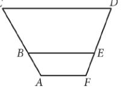
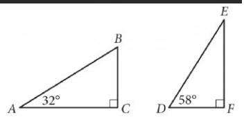
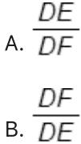
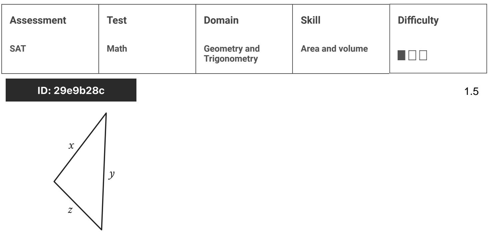
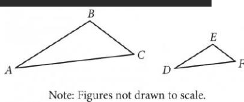

{0}------------------------------------------------

# Question ID 81b664bc

| Assessment | Test | Domain                       | Skill                           | Difficulty |
|------------|------|------------------------------|---------------------------------|------------|
| SAT        | Math | Geometry and Trigonometry | Lines, angles, and triangles |            |

ID: 81b664bc

2.1

In the figure above, AF, BE, and CD are parallel. Points B and E lie on AC and FD, respectively. If AB = 9, BC = 18.5 , and FE = 8.5 , what is the length of ED , to the nearest tenth?

A. 16.8

B. 17.5

C. 18.4

D. 19.6

#### ID: 81b664bc Answer

Correct Answer: B

Rationale

Choice B is correct. Since AF, BE, and CD are parallel, quadrilaterals AFEB and BEDC are similar. Let x represent the length of ED. With similar figures, the ratios of the lengths of corresponding sides are equal. It _ 8.5 9 follows that 18.5 x . Multiplying both sides of this equation by 18.5 and by x yields 9x = (18.5)(8.5), or 9x = 157.25. Dividing both sides of this equation by 9 yields x = 17.47, which to the nearest tenth is 17.5.

Choices A, C, and D are incorrect and may result from errors made when setting up the proportion.

{1}------------------------------------------------

# Question ID 94364a79

| Lines, angles, and SAT Math Geometry and Trigonometry triangles | Assessment | Test | Domain | Skill | Difficulty |
|--------------------------------------------------------------------------------|------------|------|--------|-------|------------|
|                                                                                |            |      |        |       |            |

#### ID: 94364a79

2.2

Two nearby trees are perpendicular to the ground, which is flat. One of these trees is 10 feet tall and has a shadow that is 5 feet long. At the same time, the shadow of the other tree is 2 feet long. How tall, in feet, is the other tree?

| A. 3  |  |  |
|-------|--|--|
| B. 4  |  |  |
| C. 8  |  |  |
| D. 27 |  |  |
|       |  |  |

### ID: 94364a79 Answer

Correct Answer: B

### Rationale

Choice B is correct. Each tree and its shadow can be modeled using a right triangle, where the height of the tree and the length of its shadow are the legs of the triangle. At a qiven point in time, the right triangles formed by two nearby trees and their respective shadows will be similar. Therefore, if the height of the is g, in feet, the value of x can be calculated by solving the proportional relationship 10 feet ta , or 2 = % . Multiplying each side of the equation 2 = % by 2 yie equation is equivalent to 10 Therefore, the other tree is 4 feet tall

Choice A is incorrect and may result from calculating the difference between the lengths of the shadows, rather than the height of the other tree.

Choice C is incorrect and may result from calculating the difference between the height of the 10-foot-tall tree and the length of the shadow of the other tree, rather than calculating the height of the other tree.

Choice D is incorrect and may result from a conceptual or calculation error.

{2}------------------------------------------------

## Question ID 933fee1a

| Assessment | Test | Domain                       | Skill                           | Difficulty |
|------------|------|------------------------------|---------------------------------|------------|
| SAT        | Math | Geometry and Trigonometry | Lines, angles, and triangles |            |

### ID: 933fee1a

Triangles ABC and DEF are shown above. Which of the BC following is equal to the ratio AB ?

- DF C. EF
- EF D. DE

### ID: 933fee1a Answer

Correct Answer: B

### Rationale

Choice B is correct. In right triangle ABC, the measure of angle B must be 58° because the sum of the measure of angle A, which is 32°, and the measure of angle D in the right triangle DEF has measure 58°. Hence, triangles ABC and DEF are similar (by angle-angle similarity). Since BC is the side opposite to the

BC DF angle with measure 32° and AB is the hypotenuse in right triangle ABC, the ratio

Alternate approach: The trigonometric ratios can be used to answer this question. In right triangle ABC, the BC. = sin(32°) The angle E in triangle DEF has measure 32° because M(∠D)+ M(∠E)=90°. In ratio AB DF DF BC triangle DEF, the ratio DE = sin(32°) Therefore, DE AB .

2.3

{3}------------------------------------------------

DE BC Choice A is incorrect because DF is the reciprocal of the ratio AB . Choice C is incorrect because _ BC DF EF

{4}------------------------------------------------

## Question ID a4c05a1b

Note: Figure not drawn to scale.

In the figure shown, lines mand s are parallel, and line m intersects both lines. If y < 65, which of the following must be true?

A. x < 115

B. x > 115

C. x + y < 180

D. x + y > 180

#### ID: a4c05a1b Answer

Correct Answer: B

Rationale

Choice B is correct. In the figure shown, the angle measuring yo is congruent to its vertical angle formed by lines g and m, so the measure of the vertical angle is also y . The vertical angle forms a same-side interior angle pair with the angle measuring x °. It's given that lines mandlel. Therefore, same-side interior angles in the figure are supplementary, which means the sum of the vertical angle and the measure of the angle measuring x ° is 180°, or x + y = 180. Subtracting x from both sides of this equation yields y = 180 - x Substituting 180 - x for y in the inequality y < 65 yields 180 - x < 65. Adding x to both sides of this inequality yields 180 < 65 + x. Subtracting 65 from both sides of this inequality yields 115 < ෆැ or x > 115. Thus, if y < 65, it must be true that x > 115.

Choice A is incorrect and may result from conceptual or calculation errors.

Choice C is incorrect. x + y must be equal to, not less than, 180.

{5}------------------------------------------------

Choice D is incorrect. x + y must be equal to, not greater than, 180.
{6}------------------------------------------------

# Question ID d3fe472f

| Assessment   | Test | Domain                       | Skill                           | Difficulty |
|--------------|------|------------------------------|---------------------------------|------------|
| SAT          | Math | Geometry and Trigonometry | Lines, angles, and triangles |            |
| ID: d3fe472f |      |                              |                                 | 2.5        |

ID: d3fe472f

Triangle ABC is similar to triangle XVZ, such that A, B, and C correspond to X, Y, and Z respectively. The length of each side of triangle XV 2 is 2 times the length of its corresponding side in triangle ABC. The measure of side AB is 16. What is the measure of side XY ?

| A. 14 |
|-------|
| B. 16 |

c. 18

D. 32

ID: d3fe472f Answer

Correct Answer: D

Rationale

Choice D is correct. It's given that triangle ABC is similar to triangle XY Z, such that A, B, and C correspond to X, Y, and Z, respectively. Therefore, side AB corresponds to side XY. Since the length of each side of triangle XY Z is 2 times the length of its corresponding side in triangle ABC, it follows that the measure of side XY is 2 times the measure of side AB. Thus, since the measure of side AB is 16, then the measure of side XY is 2(16), or 32.

Choice A is incorrect and may result from conceptual or calculation errors.

Choice B is incorrect. This is the measure of side AB, not side XY

Choice C is incorrect and may result from conceptual or calculation errors.

{7}------------------------------------------------

## Question ID fd8745fc

| Assessment   | Test | Domain                       | Skill                           | Difficulty |
|--------------|------|------------------------------|---------------------------------|------------|
| SAT          | Math | Geometry and Trigonometry | Lines, angles, and triangles |            |
| ID: fd8745fc |      |                              |                                 |            |

In triangle JKL, the measures of ∠K and ∠Z are each 48˚. What is the measure of ∠J, in degrees? (Disregard the degree symbol when entering your answer.)

#### ID: fd8745fc Answer

Correct Answer: 84

Rationale

The correct answer is 84. The sum of the measures of the interior angles of a triangle is 180°. It's given that in triangle JKL, the measures of _Kand _L are each 48°. Adding the measures, in degrees, of _K and _L gives 48 + 48, or 96. Therefore, the measure of _J, in degrees, is 180 - 96, or 84.

{8}------------------------------------------------

### Question ID 901e3285

| Assessment | Test | Domain                       | Skill                           | Difficulty |
|------------|------|------------------------------|---------------------------------|------------|
| SAT        | Math | Geometry and Trigonometry | Lines, angles, and triangles |            |

#### ID: 901e3285

2.7

In triangle ABC, the measure of angle A is 50°. If triangle ABC is isosceles,

which of the following is NOT a possible measure of angle B ?

A. 50°

B. 65°

c. 80°

D. 100°

#### ID: 901e3285 Answer

Correct Answer: D

Rationale

Choice D is correct. The sum of the three interior angles in a triangle is 180°. It's given that angle A measures 50°. If angle B measured 100°, the measure of angle C would be 180° -- (50° + 100°) = 30°. Thus, the measures of the angles in the triangle would be 50°, 100°, and 30°. However, an isosceles triangle has two angles of equal measure. Therefore, angle B can't measure 100°

Choice A is incorrect. If angle B has measure 50°, then angle C would measure 180° -(50° +50°) = 80°, and 50°, 50°, and 80° could be the angle measures of an isosceles triangle. Choice B is incorrect. If angle B has measure 65°, then angle C would measure 180°—(65° +50°) = 65°, and 50°, 65°, and 65° could be the angle measures of an isosceles triangle. Choice C is incorrect. If angle B has measure 80°, then angle C would measure 180° – (80° + 50°) = 50°, and 50° could be the angle measures of an isosceles triangle.

{9}------------------------------------------------

## Question ID 1c3d613c

| Assessment           | Test | Domain                       | Skill                           | Difficulty |
|----------------------|------|------------------------------|---------------------------------|------------|
| SAT                  | Math | Geometry and Trigonometry | Lines, angles, and triangles |            |
| In. 1-9 Jenne C C |      |                              |                                 |            |

2.8

Triangle ABC and triangle DEF are shown. The relationship between the side

AB lengths of the two triangles is such that If the

measure of angle BAC is 20°, what is the measure, in degrees, of angle EDF ? (Disregard the degree symbol when gridding your answer.)

### ID: 1c3d613c Answer

#### Rationale

The correct answer is 20. By the equality given, the three pairs of corresponding sides of the two triangles are in the same proportion. By the side-side (SSS) similarity theorem, triangle ABC is similar to triangle DEF. In similar triangles, the measures of corresponding angles are congruent. Since angle BAC corresponds to angle EDF, these two angles are congruent and their measures are equal. It's given that the measure of angle BAC is 20°, so the measure of angle EDF is also 20°.

{10}------------------------------------------------

## Question ID 6dd463ca

| Assessment   | Test | Domain                       | Skill                           | Difficulty |
|--------------|------|------------------------------|---------------------------------|------------|
| SAT          | Math | Geometry and Trigonometry | Lines, angles, and triangles |            |
| ID: 6dd463ca |      |                              |                                 |            |
| C            |      |                              |                                 |            |

Note: Figure not drawn to scale.

In the figure above, segments AE and BD are parallel. If angle BDC measures 58° and angle ACE measures 62°, what is the measure of angle CAE ?

A. 58°

- B. 60°
- C. 62°
- D. 120°

#### ID: 6dd463ca Answer

Correct Answer: B

Rationale

Choice B is correct. It's given that angle ACE measures 62°. Since segments AE and BD are parallel, angles BDC and CEA are congruent. Therefore, angle CEA measures 58°. The sum of the measures of angles ACE, CEA, and CAE is 180° since the sum of the interior angles of triangle ACE is equal to 180°. Let the measure of angle CAE be × . Therefore, 62 + 58 + x = 180, which simplifies to x = 60. Thus, the measure of angle CAE is 60 °.

Choice A is incorrect. This is the measure of angle AEC, not that of angle CAE. Choice C is incorrect. This is the measure of angle ACE, not that of CAE. Choice D is incorrect. This is the sum of the measures of angles ACE and CEA.