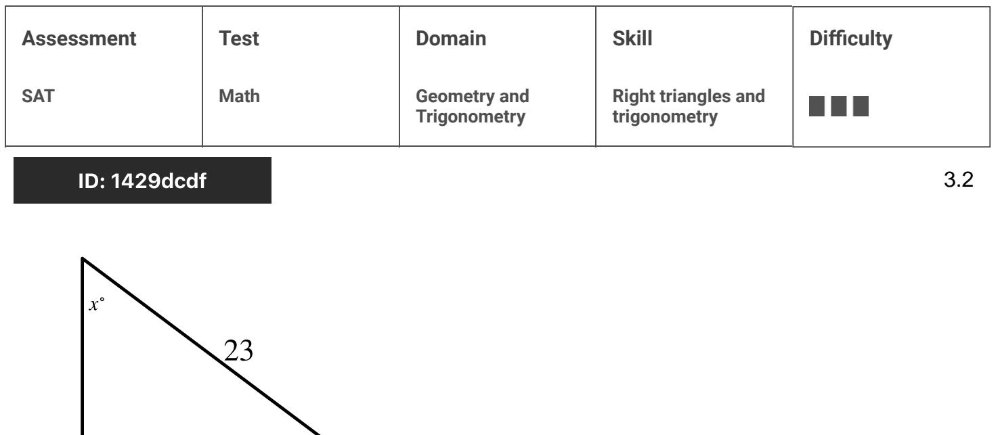
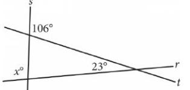
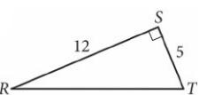
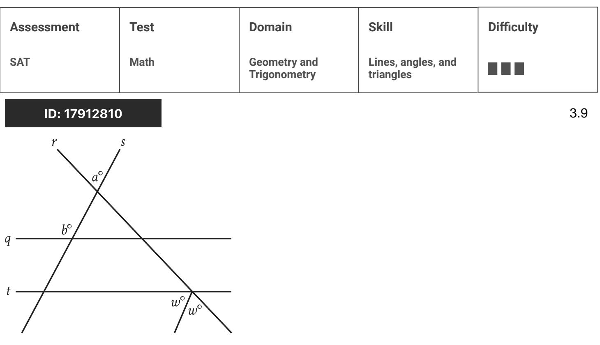
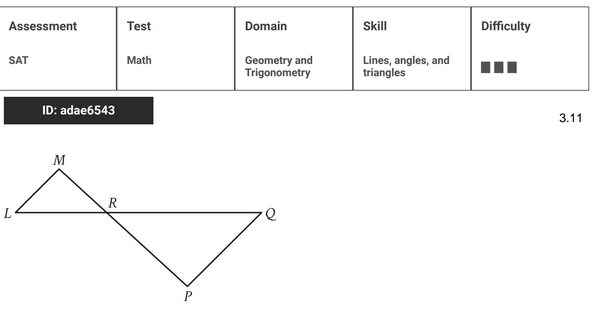
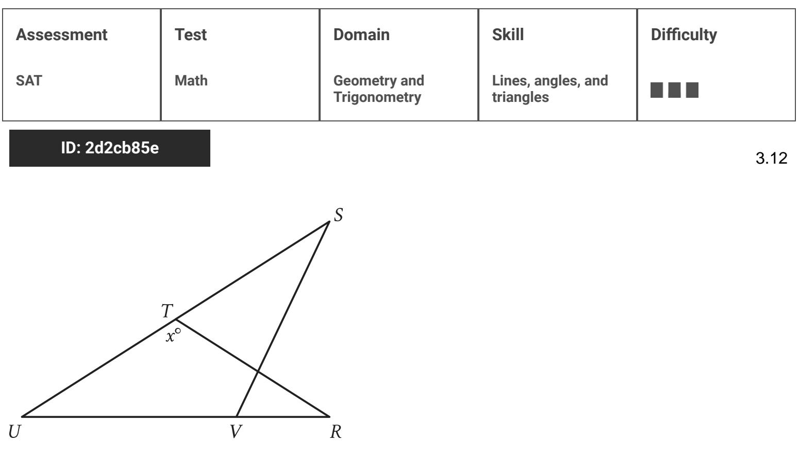

{0}------------------------------------------------

# Question ID 6d99b141

Note: Figure not drawn to scale.

In the figure, AC = CD. The measure of angle EBC is 45°, and the measure of angle ACD is 104°. What is the value of x?

### ID: 6d99b141 Answer

Correct Answer: 83

#### Rationale

The correct answer is 83. It's given that in the figure, AC = CD. Thus, triangle ACD is an isosceles triangle and the measure of angle CDA is equal to the measure of angle CAD. The sum of the measures of the interior angles of a triangle is 180 °. Thus, the sum of the interior angles of triangle ACD is 180 °. It's given that the measure of angle ACD is 104°. It follows that the sum of the measures of angles CDA and CAD is (180 - 104) , or 76 . Since the measure of angle CDA is equal to the measure of angle CAD, the measure of angle CDA is half of 76°, or 38°. The sum of the interior angles of triangle BDE is 180°. It's given that the measure of angle EBC is 45°. Since the measure of angle BDE, which is the same angle as angle CDA, is 38° it follows that the measure of angle DEB is (180 - 45 - 38) ° or 97°. Since angle DEB and andle AEB form a straight line, the sum of the measures of these angles is 180 °. It's qiven in the figure that the measure of angle AEB is x °. It follows that 97 + x = 180. Subtracting 97 from both sides of this equation yields x = 83,

{1}------------------------------------------------

# Question ID e10d8313

Note: Figure not drawn to scale.

In the figure shown, points Q, R, S, and T lie on line segment RV intersects line segment SX at point W. The measure of _SQX is 48°, the measure of _SXQ is 86°, the measure of _SWU is 85° and the measure of ∠VTU is 162°. What is the measure, in degrees, of ∠TUR?

ID: e10d8313 Answer

Correct Answer: 123

Rationale

The correct answer is 123. The triangle angle sum theorem states that the sum of the interior angles of a triangle is 180 degrees. It's qiven that the measure of _50 x is 48 and the measure of _5 X Q is 86°. Since points S, Q, and X form a triangle, it follows from the triangle angle sum theorem that the measure, in degrees, of ∠QSX is 180 - 48 - 86, or 46. It's also given that the measure of ∠SWU is 85 °. Since ∠SWU and ∠SW R are supplementary angles, the sum of their measures is 180 degrees. It follows that the measure, in degrees, of _SW R is 180 - 85, or 95. Since points R, S, and W form a triangle, and LRSW is the same angle as 2018, it follows from the triangle angle sum theorem that the measure, in degrees, of ZW is is 180 - 46 - 95, or 39. It's given that the measure of _VTU is 162 °. Since _VTU and _STU are supplementary andles, the sum of their measures is 180 degrees. It follows that the measure, in deqrees, of ZSTU is 180 - 162, or 18. Since points R, T, and U form a triangle, and ZURT is the same angle as ZW RS, it follows from the triangle angle sum theorem that the measure, in degrees, of ZTVR is 180 - 39 - 18, or 123.

{2}------------------------------------------------

## Question ID f88f27e5

| Assessment | Test | Domain                       | Skill                           | Difficulty |
|------------|------|------------------------------|---------------------------------|------------|
| SAT        | Math | Geometry and Trigonometry | Lines, angles, and triangles |            |

### ID: f88f27e5

Intersecting lines r, s, and tare shown below.

What is the value of x ?

#### ID: f88f27e5 Answer

#### Rationale

The correct answer is 97. The intersecting lines form a triangle, and the angle with measure of X `is an exterior angle of this triangle. The measure of an exterior angle is equal to the sum of the measures of the two nonadjacent interior angles of the triangle. One of these angles has measure of 23° and the other, which is supplementary to the angle with measure of 106°, has measure of 180° = 106° = 74° Therefore, the value of x is 23 + 74 = 97

{3}------------------------------------------------

## Question ID 947a3cde

| Assessment   | Test | Domain                       | Skill                           | Difficulty |
|--------------|------|------------------------------|---------------------------------|------------|
| SAT          | Math | Geometry and Trigonometry | Lines, angles, and triangles |            |
| ID: 947a3cde |      |                              |                                 |            |

In the figure above, MQ and NR intersect at point P, NP = QP, and MP = PR. What is the measure, in degrees, of _ QMR ? (Disregard the degree symbol when gridding your answer.)

#### ID: 947a3cde Answer

R

#### Rationale

N

The correct answer is 30. It is given that the measure of _ QPR is 60°. Angle MPR and _ QPR are collinear and therefore are supplementary angles. This means that the sum of the two angle measures is 180°, and so the measure of ∠MPR is 120°. The sum of the angles in a triangle is 180°. Subtracting the measure of ∠MPR from 180° yields the sum of the other angles in the triangle MPR. Since 180-120 = 60, the sum of the measures of ∠QMR and ∠NRM is 60°. It is given that MP = PR, so it follows that triangle MPR is isosceles. Therefore _ QMR and _ NRM must be congruent. Since the sum of the measure of these two angles is 60°, it follows that the measure of each angle is 30°

An alternate approach would be to use the exterior angle theorem, noting that the measure of ∠QPR is equal to the sum of the measures of __QMR and __NRM. Since both angles are equal, each of them has a measure of 30°

{4}------------------------------------------------

## Question ID 740bf79f

| Assessment                                         | Test | Domain                       | Skill                           | Difficulty |     |
|----------------------------------------------------|------|------------------------------|---------------------------------|------------|-----|
| SAT                                                | Math | Geometry and Trigonometry | Lines, angles, and triangles | ■■■■       |     |
| ID: 740bf79f                                       |      |                              |                                 |            | 3.5 |
| N 3 र्वे D M Q                      | P    |                              |                                 |            |     |
| In the figure above, what is the length of NQ ? |      |                              |                                 |            |     |
| A. 2.2                                             |      |                              |                                 |            |     |
| B. 2.3                                             |      |                              |                                 |            |     |
| C. 2.4                                             |      |                              |                                 |            |     |
| D. 2.5                                             |      |                              |                                 |            |     |
|                                                    |      |                              |                                 |            |     |

#### ID: 740bf79f Answer

Correct Answer: C

Rationale

Choice C is correct. First, MP is the hypotenuse of right △MNP, whose legs have lengths 3 and 4. Therefore, (MP)2 = 32 + 42, so (MP)2 = 25 and MP = 5. Second, because ∠MNP corresponds to ∠NQP and because ∠MPN corresponds to ∠NPQ, △MNP is similar to △NQP. The ratio of corresponding sides of similar NQ NP NQ 4 l 5 . triangles is constant, so MN MP . Since MP = 5 and it's given that MN = 3 and NP = 4, 3 12 Solving for NQ results in NQ = 5 , or 2.4.

Choices A, B, and D are incorrect and may result from setting up incorrect ratios.

{5}------------------------------------------------

# Question ID bd7f6e30

| Assessment | Test | Domain                       | Skill                           | Difficulty |
|------------|------|------------------------------|---------------------------------|------------|
| SAT        | Math | Geometry and Trigonometry | Lines, angles, and triangles |            |

### ID: bd7f6e30

3.6

In the figure above, RT = TU.

What is the value of x ?

A. 72

B. 66

C. 64

D. 58

### ID: bd7f6e30 Answer

Correct Answer: C

Rationale

Choice C is correct. Since RT = TU, it follows that △RTU is an isosceles triangle with base RU. Therefore, ∠ TRU and ∠TUR are the base angles of an isosceles triangle and are congruent. Let the measures of both ∠ TRU and ∠TUR be t゜. According to the triangle sum theorem, the sum of the measures of the three angles of a triangle is 180°. Therefore, 114° +2t° = 180°, so t = 33.

Note that _ TUR is the same angle as _ SUV. Thus, the measure of _ SUV is 33°. According to the triangle exterior angle theorem, an external angle of a triangle is equal to the sum of the opposite interior angles. Therefore, X is equal to the sum of the measures of _VSU and _ SUV; that is, 31 ° + 33° = 64° Thus, the value of x is 64.

Choice B is incorrect. This is the measure of _STR, but _STR is not congruent to _ SVR. Choices A and D are incorrect and may result from a calculation error.

{6}------------------------------------------------

### Question ID eeb4143c

| Assessment   | Test | Domain                       | Skill                           | Difficulty |
|--------------|------|------------------------------|---------------------------------|------------|
| SAT          | Math | Geometry and Trigonometry | Lines, angles, and triangles |            |
| ID: ech1112c |      |                              |                                 |            |

Note: Figure not drawn to scale

The area of triangle ABC above is at least 48 but no more than 60. If y is an integer, what is one possible value of x ?

#### ID: eeb4143c Answer

Rationale

10 15 25 , or 6 . The area of triangle ABC can be expressed as 2 The correct answer is either 3 , 4 It's given that the area of triangle ABC is at least 48 but no more than 60. It follows that 48 ≤ 6y ≤ 60. Dividing by 6 to isolate y in this compound inequality yields 8 ≤ y ≤ 10. Since y is an integer, y = 8, 9, or 10. In the given figure, the two right triangles shown are similar because they have two pairs of congruent angles: their respective right angles and angle A. Therefore, the following proportion is true: v 12 . Substituting 8 for y 10 in the proportion results in 8 12 . Cross multiplying and solving for x yields 3 . Substituting 9 for y in 15 the proportion results in 9 12 . Cross multiplying and solving for x yields 4 . Substituting 10 for y in the 5 25 12 . Cross multiplying and solving for x yields 6 . Note that 10/3, 15/4, 25/6, proportion results in 10 3.333, 3.75, 4.166, and 4.167 are examples of ways to enter a correct answer.
{7}------------------------------------------------

## Question ID 5b4757df

| Assessment   | Test | Domain                       | Skill                           | Difficulty |  |  |
|--------------|------|------------------------------|---------------------------------|------------|--|--|
| SAT          | Math | Geometry and Trigonometry | Lines, angles, and triangles |            |  |  |
| ID: 5b4757df |      |                              |                                 |            |  |  |

In triangle R.ST, angle T is a right angle, point & lies on ST, and LK is parallel to RT. If the length of RT is 72 units, the length of LK is 24 units, and the area of triangle RST is 792 square units, what is the length of KT, in units?

#### ID: 5b4757df Answer

Correct Answer: 14.66, 14.67, 44/3

Rationale

The correct answer is 4. It's given that in triangle RST, angle. The area of a right triangle can be found using the formula A = = 1122, where A represents the area of the right triangle, if represents the length of one leg of the triangle, and 12 represents the length of the other leg of the triangle. In triangle RST, the two legs are RT and ST. Therefore, if the length of RT is 72 and the area of triangle RST is 792, then 792 = = (72)(ST), or 792 = (36)(57). Dividing both sides of this equation by 36 yields 22 = ST. Therefore, the length of ST is 22. It's also given that point L lies on ST, and LK is parallel to RT. It follows that angle LKS is a right angles RST and LSK share angle S and have right angles T and K, respectively, triangles RST and LSK are similar triangles. The ratio of the length of RT to the length of LK is equal to the ratio of the length of ST to the length of SK. If the length of RT is 72 and the length of LK is 24, it follows that the ratio of the length of RT to the length of ZK is , or 3, so the ratio of the length of ST to the length of SK is 3. Therefore, 30 = 3. Multiplying both sides of this equation by SK yields 22 = (3)(SK). Dividing both sides of this equation by 3 yields 22 = SK. Since the length of ST, 22, is the sum of the length of SK, 22, and the length of KT, it follows that the length of KT is 22 - 2, or 4. Note that 44/3, 14.66, and 14.67 are examples of ways to enter a correct answer.

{8}------------------------------------------------

# Question ID 17912810

Note: Figure not drawn to scale.

In the figure, parallel lines q and t are intersected by lines or and 8. If a = 43 and b = 122, what is the value of w?

#### ID: 17912810 Answer

Correct Answer: 101/2, 50.5

#### Rationale

The correct answer is 100 . In the figure, lines q, m, and \$ form a triangle. One interior angle is vertical to the angle marked a ; therefor angle also has measure a . It's given that a = 43. Therefore, the interior angle of the triangle has measure 43°. A second interior angle of the triangle forms a straight line, q, with the angle marked b . Therefore, the sum of the measures of these two angles is 180 ° It's given that b = 122. Therefore, the angle marked b ° has measure 122° and the second interior angle of the triangle has measure (180 - 122) , or 58 . The sum of the interior angles of a triangle is 180 . Therefore, the measure of the third interior angle of the triangle is (180 – 43 – 58) °, or 79°. It's given that parallel lines q and t are intersected by line ۳. It follows that the triangle's interior angle with measure 79° is congruent to the same side interior angle between lines q and f formed by lines t and r. Since this angle is supplementary to the two angles marked w, the sum of 79°, w , and w `is 180°. It follows that 79 + w + w = 180, or 79 + 2w = 180. Subtracting 79 from both sides of this equation yields 2w = 101. Dividing both sides of this equation by 2 yields w = 12-. Note that 101/2 and 50.5 are examples of ways to enter a correct answer.

{9}------------------------------------------------

# Question ID 6a3fbec3

| Assessment                              | Test | Domain                       | Skill                           | Difficulty |  |  |  |  |
|-----------------------------------------|------|------------------------------|---------------------------------|------------|--|--|--|--|
| SAT                                     | Math | Geometry and Trigonometry | Lines, angles, and triangles |            |  |  |  |  |
| 3.10 ID: 6a3fbec3                    |      |                              |                                 |            |  |  |  |  |
| B D                                  |      |                              |                                 |            |  |  |  |  |
| Note: Figure not drawn to scale.        |      |                              |                                 |            |  |  |  |  |
| In the figure above, BD = 6 and AD = 8. |      |                              |                                 |            |  |  |  |  |
| What is the length of DC ?              |      |                              |                                 |            |  |  |  |  |
| ID: 6a3fbec3 Answer                     |      |                              |                                 |            |  |  |  |  |
| Rationale                               |      |                              |                                 |            |  |  |  |  |

The correct answer is 4.5. According to the properties of right triangles, BD divides triangle ABC into two similar triangles, ABD and BCD. The corresponding sides of ABD and BCD are proportional, so the ratio of BD to 6 DC AD is the same as the ratio of DC to BD. Expressing this information as a proportion gives 8 6 . Solving the proportion for DC results in DC = 4.5. Note that 4.5 and 9/2 are examples of ways to enter a correct answer.

{10}------------------------------------------------

# Question ID adae6543

Note: Figure not drawn to scale.

In the figure, LQ intersects MP at point R, and LM is parallel to PQ. The lengths of MR, LR, and RP are 6, 7, and 11, respectively. What is the length of LQ?

A. 111

- B. 77
- C. 113

Di 110

ID: adae6543 Answer

Correct Answer: D

{11}------------------------------------------------

# Question ID 2d2cb85e

Note: Figure not drawn to scale.

In the figure, RI = TU, the measure of angle VST is 20 °, and the measure of angle RV S is 41 °. What is the value of a?

## ID: 2d2cb85e Answer

Correct Answer: 156

#### Rationale

The correct answer is 156. In the figure shown, the measures of angle UVS and angle RVS is 180°. It's given that the measure of angle RVS is 41°. Therefore, the measure of angle UVS is 180 - 41°, or 139°. The sum of the measures of the interior angles of a triangle is 180°. In triangle UVS is 139° and it's given that the measure of angle VST is 29°. Thus, the measure of angle VUS is 180 - 139 - 29°, or 12°. It's given that RT = TU. Therefore, triangle TUR is an isosceles triangle and the measure of VUS is equal to the measure of angle TVR, the measure of angle VUS is 12° and the measure of angle TRU is 12°. Thus, the measure of angle UTR is 180 - 12 - 12°, or 156°. The figure shows that the measure of angle UTR is xº, so the value of x is 156.

{12}------------------------------------------------

# Question ID b1e1c2f5

| Assessment | Test | Domain                       | Skill                           | Difficulty |
|------------|------|------------------------------|---------------------------------|------------|
| SAT        | Math | Geometry and Trigonometry | Lines, angles, and triangles |            |
|            |      |                              |                                 |            |

## ID: b1e1c2f5

3.13

In right triangle ABC, angle C is the right ande and BC = 162. Point D on side AB is connected by a line segment with point E on side AC such that line segment DB is parallel to side BC and CE = 2AB. What is the length of line segment DE?

## ID: b1e1c2f5 Answer

#### Correct Answer: 54

#### Rationale

The correct answer is 54. It's given that in triangle ABC, point D on side AB is connected by a line segment with point B on side AC such that line segment DE is parallel to side BC. It follows that parallel segments DE and BC are intersected by sides AB and AC. If two parallel segments are intersected by a third segment, corresponding angles are congruent. Thus, corresponding angles C and AED are conquent and corresponding angles B and ADE are congruent. Since triangle ADE has two angles that are each congruent to an angle in triangle ADE is similar to triangle ABC by the angle-angle similarity postulate, where side DE corresponds to side AE corresponds to side AC. Since the lengths of corresponding sides in similar triangles are proportional, it follows that දූ = _ _ _ _ _ _ _ _ _ _ _ _ _ _ _ _ _ _ _ _ _ _ _ _ _ _ _ _ _ _ _ _ _ _ _ _ _ _ _ _ _ _ _ _ _ _ It's given that CE = 2.4E. Substituting 2.4E for CE in the equation AE + CE = AC yields AE + 2.4E = AC, or 3.AE = AC. It's given AE yields
Ac that BC = 162. Substituting 162 for BC and 3AE for AC in the equation 開 = 음 DE AE = 2. Multiplying both DE or 162 BC sides of this equation by 162 yields DE = 54. Thus, the length of line segment DE is 54.