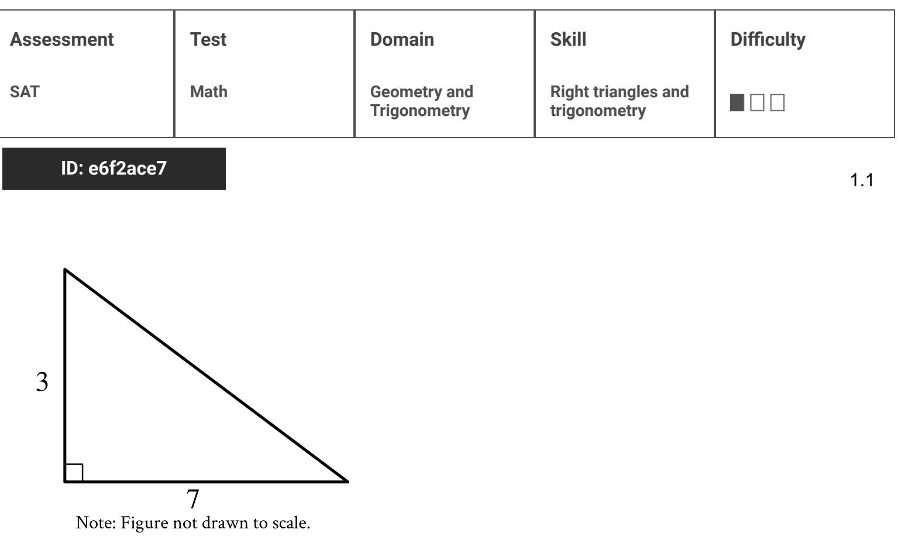
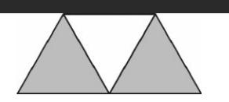
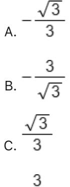
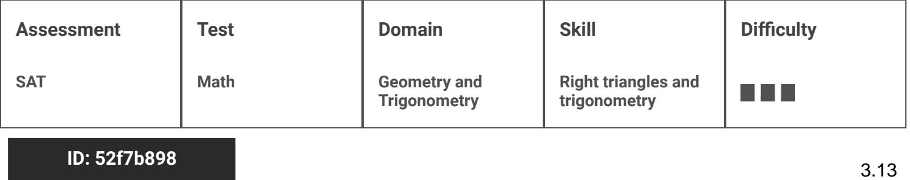
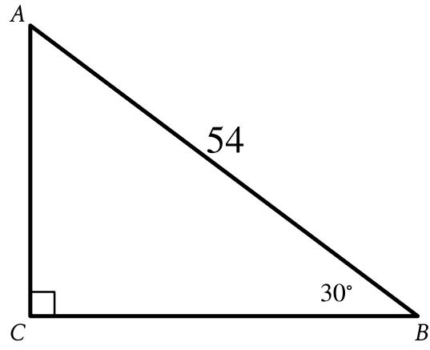

{0}------------------------------------------------

# Question ID bd87bc09

#### ID: bd87bc09 Answer

Rationale

The correct answer is 24. The sine of an acute angle in a right triangle is equal to the length of the side opposite the angle to the length of the hypotenuse. In the triangle shown, the sine of angle B, or Sin(B), is equal to the ratio of the length of side 4C to the length of side AB. It's given that the length of side AB is 26
5 5 AB 5 13 . Therefore, 13 26 . Multiplying both sides of this equation by 26 yields AC = 10. and that

By the Pythagorean Theorem, the relationship between the lengths of triangle ABC is as follows:
26° = 10° +BC² or 676 = 100 +BC². Subtracting 100 from both sides of b76 = 10 Taking the square root of both sides of 576 = BC2 yields 24 = BC.

{1}------------------------------------------------

# Question ID 1429dcdf

16 Note: Figure not drawn to scale.

រា the triangle shown, what is the value of នាំ​​ ​​​​​​​​​​​​​​​​​​​​​​​​​​​​​​​​​​​​​​​​​​​​​​​​​​​​​​​​​​​​​​​​​​​​​​​​​​​​​​​​​​​​​​​​​​​​​​​​​​​​​​​​​​​​​​​​​​​​​​​​​​

### ID: 1429dcdf Answer

Correct Answer: .6956, .6957, 16/23

Rationale

The correct answer is . In a right triangle, the sine of an acute angle is defined as the ratio of the length of the side opposite the angle to the length of the hypotenuse. In the triangle shown, the length of the side opposite the angle with measure x is 16 units and the length of the hypotenuse is 23 units. Therefore, the value of sin x is answer.

{2}------------------------------------------------

## Question ID 4c95c7d4

| Assessment   | Test | Domain                       | Skill                               | Difficulty |
|--------------|------|------------------------------|-------------------------------------|------------|
| SAT          | Math | Geometry and Trigonometry | Right triangles and trigonometry |            |
| ID: 4c95c7d4 |      |                              |                                     |            |

A graphic designer is creating a logo for a company. The logo is shown in the figure above. The logo is in the shape of a trapezoid and consists of three congruent equilateral triangles. If the perimeter of the logo is 20 centimeters, what is the combined area of the shaded regions, in square centimeters, of the logo?

A. 2. 3

в. 4 / 3

c. 8./3

D. 16

### ID: 4c95c7d4 Answer

Correct Answer: C

Rationale

Choice C is correct. It's given that the logo is in the shape of a trapezoid that consists of three congruent equilateral triangles, and that the perimeter of the trapezoid is 20 centimeters (cm). Since the perimeter of the trapezoid is the sum of the lengths of 5 of the sides of the length of each side of an equilateral 20 Dividing up one equilateral triangle into two right triangles yields a pair of congruent triangle is 5 30°-60°-90° triangles. The shorter leg of each right triangle is half the length of the side of an equilateral triangle, or 2 cm. Using the Pythagorean Theorem, a2 + b2 = c2, the height of the equilateral triangle can be found. Substituting a = 2 and c = 4 and solving for b yields v 42 – 22 = √ 72 = 2√ 3 cm. The area of one , where b = 2 and h =2 / 3. Therefore, the area of one equilateral triangle is equilateral triangle is 2 . The shaded area consists of two such triangles, so its area is (2)(4)√3 = 8√ 3 cm²

where bi Alternate approach: The area of a trapezoid can be found by evaluating the expression 2 is the length of one base, b2 is the length of the other base, and h is the height of the trapezoid. Substituting

{3}------------------------------------------------

b += 8, b2 = 4, and h = 2√ 3 yields the expression 2 (8 + 4)(2√3)
12- (3 cm² for the transmid, cince two thirds of the transacid is al ', which gives an area of , or 12-73 cm² for the trapezoid. Since two-thirds of the trapezoid is shaded, the area of the shaded region is
 o = x 12 / 3 = 8 / 3

Choice A is incorrect. This is the height of the trapezoid. Choice B is incorrect. This is the area of one of the equilateral triangles, not two. Choice D is incorrect and may result from using a height of 4 for each triangle rather than the height of 2v 3

{4}------------------------------------------------

## Question ID 55bb437a

| Assessment   | Test | Domain                       | Skill                               | Difficulty |
|--------------|------|------------------------------|-------------------------------------|------------|
| SAT          | Math | Geometry and Trigonometry | Right triangles and trigonometry |            |
| ID: 55bb437a |      |                              |                                     |            |

In the figure above, tan B = 4 . If BC = 15 and DA = 4, what is the length of DE ?

#### ID: 55bb437a Answer

Rationale

D

The correct answer is 6. Since tan B = 3
The correct answer is 6. Since tan B = 4 , △ABC and △ DBE are both similar to 3-4-5 triangles. This means that they are both similar to the right triangle with sides of lengths 3, 4, and 5. Since BC = 15, which is 3 times as long as the hypotenuse of the 3-4-5 triangle, the similarity ratio of △ABC to the 3-4-5 triangle is 3:1. Therefore, the length of AC (the side opposite to ∠B) is 3×3=9, and the length of AB (the side adjacent to ∠Β) is 4 x 3 = 12. It is also given that DA = 4. Since AB = DA + DB and AB = 12. it follows that DB = 8 which means that the similarity ratio of △DBE to the 3-4-5 triangle is 2:1 (DB is the side adjacent to ∠B). Therefore, the length of DE, which is the side opposite to ∠B, is 3×2 = 6-

{5}------------------------------------------------

# Question ID 6933b3d9

| Assessment | Test | Domain                       | Skill                               | Difficulty |
|------------|------|------------------------------|-------------------------------------|------------|
| SAT        | Math | Geometry and Trigonometry | Right triangles and trigonometry |            |

3.5

ID: 6933b3d9

In triangle RST above, point W (not shown) lies on RT. What is the value of cos(ZRSW) - sin(∠WST) ?

### ID: 6933b3d9 Answer

Rationale

The correct answer is 0. Note that no matter where point W is on RT, the sum of the measures of ∠RSW and

∠WST is equal to the measure of ∠RST, which is 90°. Thus, ∠RSW and ∠WST are complementary

angles. Since the cosine of an angle is equal to the sine of its complementary angle, cos(∠RSW) = sin(∠WST). Therefore, Cos(∠RSW) - sin(∠WST) = 0

{6}------------------------------------------------

## Question ID 6ab30ce3

| Assessment | Test | Domain                       | Skill                               | Difficulty |
|------------|------|------------------------------|-------------------------------------|------------|
| SAT        | Math | Geometry and Trigonometry | Right triangles and trigonometry |            |
|            |      |                              |                                     |            |

ID: 6ab30ce3

3.6

Triangle ABC is similar to triangle DEF, where A corresponds to P and C corresponds to F. Angles Cand F are right angles. If tam(A) = √3 and DF' = 125, what is the length of DE?

- A. 125 3
- B. 125 %3
- C. 125v3

D. 250

### ID: 6ab30ce3 Answer

Correct Answer: D

Rationale

Choice D is correct. Corresponding andes in similar triangles have equal measures. It's qiven that triangle ABC is similar to triangle DEF, where A corresponds to D, so the measure of angle A is equal to the measure of angle D. Therefore, if tan(A) = √ 3, then tan(D) = √ 3. It's given that angles C and F are right angles, so triangles ABC and DEF are right triangles. The adjacent side of an acute angle in a right triangle is the side closest to the angle that is not the hypotenuse. It follows that the adjacent side of angle D is side DF. The opposite side of an acute angle in a right triangle is the side across from the acute angle. It follows that the opposite side of angle Dis side EF. The tangent of an acute angle in a right triangle is the ratio of the length of the opposite side to the length of the adjacent side. Therefore, tam(D) = 음 . If DF = 125, the length of side EF can be found by substituting + 3 for tan( D) and 125 for DF in the equation tan( D) = 48 which yields √3 = 5%. Multiplying both sides of this equation by 125 yields 125x73 = EF. Since the length of side EF is y 3 times the length of side DF, it follows that triangle DEF is a special right triangle with angle measures 30°, 60°, and 90°. Therefore, the length of the hypotenuse, DE, is 2 times the length of side DF, or DE = 2(DF). Substituting 125 for DF in this equation yields DE = 2(125), or DE = 250. Thus, if tan(A) = √3 and DF = 125, the length of DE is 250

Choice A is incorrect and may result from conceptual or calculation errors.

Choice B is incorrect and may result from conceptual or calculation errors.

Choice C is incorrect. This is the length of EF, not DE

{7}------------------------------------------------

## Question ID 7c25b0dc

| Assessment   | Test | Domain                       | Skill                               | Difficulty |
|--------------|------|------------------------------|-------------------------------------|------------|
| SAT          | Math | Geometry and Trigonometry | Right triangles and trigonometry |            |
| ID: 7c25b0dc |      |                              |                                     |            |

The length of a rectangle's diagonal is 3v 17, and the length of the rectangle's shorter side is 3. What is the length of the rectangle's longer side?

#### ID: 7c25b0dc Answer

Correct Answer: 12

Rationale

The correct answer is 12. The diagonal of a rectangle forms a right triangle, where the shorter side and the longer side of the rectangle are the legs of the triangle and the diagonal of the hypotenuse of the triangle. It's given that the length of the rectangle's diagonal is 3y 17 and the length of the rectangle's shorter side is 3. Thus, the length of the hypotenuse of the right triangle formed by the diagonal is 3v 17 and the length of one of the legs is 3. By the Pythagorean theorem, if a right triangle has a hypotenuse with length c and legs with lengths a and b, then a2 + b2 = c2. Substituting 3v17 for cand 3 for b in this equation yields (3v17) , or a2 + 9 = 153. Subtracting 9 from both sides of this equation yields a2 = 144. a2 + (3)2 = Taking the square root of both sides of this equation yields a = ±√ 144, or a = ±12. Since a represents a length, which must be positive, the value of a is 12. Thus, the length of the rectangle's longer side is 12.
{8}------------------------------------------------

### Question ID c6dff223

| Assessment   | Test | Domain                       | Skill                               | Difficulty |
|--------------|------|------------------------------|-------------------------------------|------------|
| SAT          | Math | Geometry and Trigonometry | Right triangles and trigonometry |            |
| ID: cGdff993 |      |                              |                                     |            |

Triangle ABC is similar to triangle DEF, where angle A corresponds to angle D and angles C and F are right angles. The length of AB is 2.9 times the length of DE. If tan A = 3, what is the value of sin D?

#### ID: c6dff223 Answer

Correct Answer: .7241, 21/29

Rationale

The correct answer is 3 . It's given that triangle ABC is similar to triangle DEF, where angle A corresponds to angle D and angles C and F are right angles. In similar triangles, the tangents of corresponding angles are equal. Therefore, if tan A = %, then tan D = %. In a right triangle, the tangent of an acute angle is the ratio of the length of the leg opposite the angle to the leg adjacent to the angle. Therefore, in triangle DEF, if tan D = % the ratio of the length of EF to the length of DF is ... If the lengths of EF and DF are 21 and 20, respectively, then the ratio of the length of EF to the length of DF is . In a right triangle, the sine of an acute angle is the ratio of the leg opposite the angle to the length of the hypotenuse. Therefore, the value of sin D is the ratio of the length of DE The length of DE . The length of DE can be calculated using the Pythagorean theorem, which states that if the legs of a right triangle are a and band the length of the hypotenuse is & then a2 + b2 = c2. Therefore, if the lengths of EF and DF are 21 and 20, respectively, then (21)2 + (20)2 = (DE)2, or 841 = (DE)2. Taking the positive square root of both sides of this equation yields 29 = DE. Therefore, if the lengths of EF and DF are 21 and 20, respectively, then the length of DE is 29 and the ratio of the length of EF to the length of DE is the value of sin D is %. Note that 21/29, .7241, and 0.724 are examples of ways to enter a correct answer.

{9}------------------------------------------------

### Question ID 92eb236a

| Assessment | l est | Domain                       | Skill                               | Difficulty |
|------------|-------|------------------------------|-------------------------------------|------------|
| SAT        | Math  | Geometry and Trigonometry | Right triangles and trigonometry |            |
|            |       |                              |                                     |            |

√3

ID: 92eb236a

3.9

/3

In a right triangle, the tangent of one of the two acute angles is 3 . What

is the tangent of the other acute angle?

D. √3

ID: 92eb236a Answer

Correct Answer: D

Rationale

Choice D is correct. The tangent of a nonright angle is defined as the ratio of the length of the leg opposite the angle to the leg adjacent to the angle. Using that definition for tangent, in a

a right triangle with legs that have lengths a and b, the tangent of one acute angle is

b other acute angle is

3 each other. Therefore, the tangent of the other acute angle in the qiven triangle is the reciprocal of or

3 √3

Choice A is incorrect and may result from assuming that the tangent of the other acute angle is the negative of the tangent of the angle described. Choice B is incorrect and may result from assuming that the tangent of the other acute angle is the negative of the reciprocal of the angle described. Choice C is incorrect and may result from interpreting the tangent of the other acute angle as equal to the angle described.

{10}------------------------------------------------

### Question ID 2be01bd9

| Assessment   | Test | Domain                       | Skill                               | Difficulty |
|--------------|------|------------------------------|-------------------------------------|------------|
| SAT          | Math | Geometry and Trigonometry | Right triangles and trigonometry |            |
| ID: 2be01bd9 |      |                              |                                     | 3.10       |

Triangle ABC is similar to triangle DEP, where angle A corresponds to angle O corresponds to angle F. Angles C and F are right angles. If tan(A) = \$, what is the value of tam(E)?

#### ID: 2be01bd9 Answer

Correct Answer: .14, 7/50

Rationale

The correct answer is for It's given that triangle ABC is similar to triangle DEF, where angle A corresponds to angle D and angle C corresponds to angle F. In similar triangles, the tangents of corresponding angles are equal. Since angle A and angle D are corresponding angles, if tan(A) = %, then tan(D) = %. It's also given that angles Cand F are right angles. It follows that triangle DEF is a right triangle with acute angles Dand E. The tangent of one acute angle in a right triangle is the tangent of the other acute angle in the triangle. Therefore, tan(E) = =========================================================================================================================================== so, or y . Thus, if tan(A) = 9, the value of tan(E) is m. Note that 7/50 and .14 are examples of ways to tan(E) = enter a correct answer.

{11}------------------------------------------------

## Question ID dba6a25a

| Assessment                | Test | Domain                       | Skill                               | Difficulty |  |
|---------------------------|------|------------------------------|-------------------------------------|------------|--|
| SAT                       | Math | Geometry and Trigonometry | Right triangles and trigonometry |            |  |
| ID: dba6a25a 3.11 E |      |                              |                                     |            |  |

In the figure above, BD is parallel to AE What is the length of CE ?

18

#### ID: dba6a25a Answer

#### Rationale

8

The correct answer is 30. In the figure given, since BD is parallel to AE and both segments are intersected by CE, then angle BDC and angle AEC are corresponding angles and therefore congruent. Angle BCD and angle ACE are also congruent because they are the same angle. Triangle ACE are similar because if two angles of one triangle are congruent to two angles of another triangles are similar. Since triangle BCD and triangle ACE are similar, their corresponding sides are proportional. So in triangle BCD and BD AE triangle ACE, BD corresponds to AE and CD corresponds to CE. Therefore, CD CE . Since triangle BCD is a right triangle, the Pythagorean theorem can be used to give the value of CD: 62 +82 = CD². Taking the BD AE CE yields square root of each side gives උD = 10 Substituting the values in the proportion CD 18 10 6 CE . Multiplying each side by CE, and then multiplying by 6 vields CE = 30. Therefore, the length 10 of CE is 30.

{12}------------------------------------------------

## Question ID 25da87f8

| Assessment   | Test | Domain                       | Skill                               | Difficulty |
|--------------|------|------------------------------|-------------------------------------|------------|
| SAT          | Math | Geometry and Trigonometry | Right triangles and trigonometry |            |
| ID: 25da87f8 |      |                              |                                     |            |

A triangle with angle measures 30°, 60°, and 90° has a perimeter of 18+6√3. What is the length of the longest side of the triangle?

#### ID: 25da87f8 Answer

Rationale

The correct answer is 12. It is given that the triangle has angle measures of 30°, 60°, and so the triangle is a special right triangle. The side measures of this type of special triangle are in the ratio 2:1.V 3. If x is the measure of the shortest leg, then the measure of the other leg is √ 3x and the measure of the hypotenuse is 2x. The perimeter of the triangle is given to be 18 +6 / 3, and so the equation for the perimeter can be written as 2x + x + √ 3 x = 18 + 6 √ 3 . Combining like terms and factoring out a common factor of x on the left-hand side of the equation gives (3+√3)x = 18+6√3. Rewriting the right-hand side of the equation by factoring out 6 gives (3+√3)x =6(3+√3). Dividing both sides of the equation by the common factor (3+√3) gives x = 6. The longest side of the right triangle, the hypotenuse, has a length of 2x, or 2(6), which is 12.

{13}------------------------------------------------

# Question ID 52f7b898

Note: Figure not drawn to scale.

Right triangle ABC is shown. What is the value of tan A?

A. 193 B. 13

c. √3

D. 27 / 3

### ID: 52f7b898 Answer

Correct Answer: C

{14}------------------------------------------------

#### Rationale

Choice C is correct. In the triangle shown, the measure of angle C is a right angle, which means that it has a measure of 90°. Since the sum of the angle is equal to 180°, the measure of angle A is equal to 180° - 30 + 90°, or 60°. In a right triangle whose acute angles 30° and 60°, the legs can be represented by the expressions x, x, J3 , and 2x, where x is the leg opposite the angle with measure 30°, x, J3 is the length of the leg opposite the angle with measure 60°, and 2x is the length of the triangle shown, the hypotenuse has a length of 54. It follows that 2x = 54, or x = 27. Therefore, the leg opposite angle B is 27 and the length of the leg opposite angle A is 27 /3 . The tangent of an acute angle in a right triangle is defined as the ratio of the leg opposite the angle to the length of the leg adjacent to the leg opposite angle A is 27 , 3 and the length of the leg adjacent to angle A is 27. Therefore, the value of tanA is 22

Choice A is incorrect and may result from conceptual or calculation errors.

Choice B is incorrect. This is the value of _ , not the value of tanA.

Choice D is incorrect. This is the length of the leg opposite angle A, not the value of tan4.