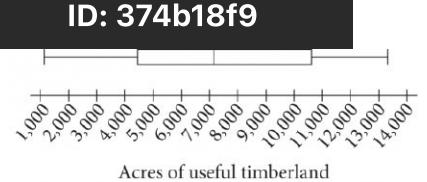
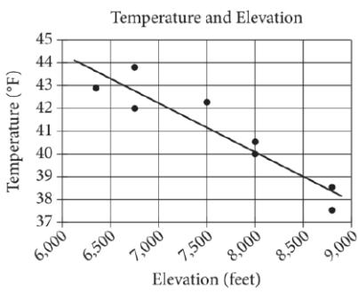
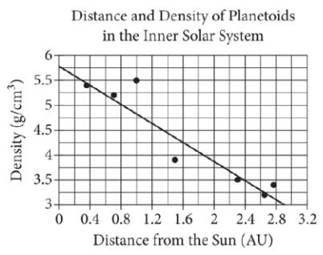
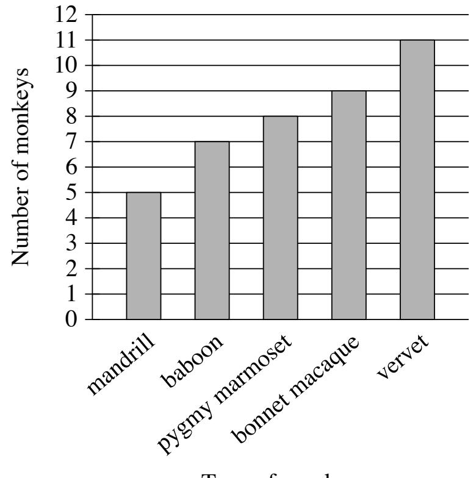
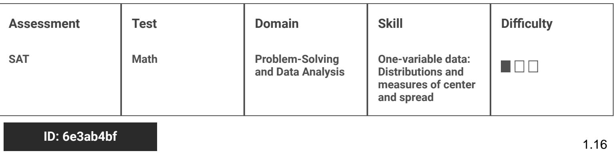
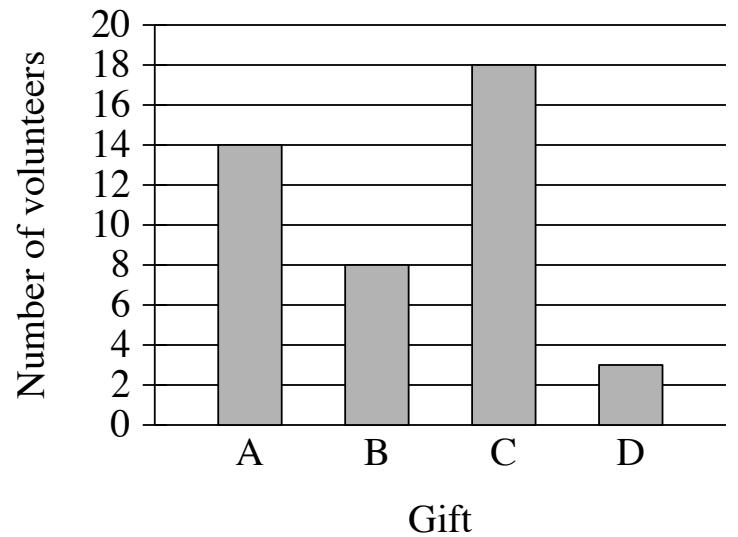

{0}------------------------------------------------

# Question ID f890dc20

| Assessment | Test | Domain                               | Skill                                                                       | Difficulty |
|------------|------|--------------------------------------|-----------------------------------------------------------------------------|------------|
| SAT        | Math | Problem-Solving and Data Analysis | One-variable data: Distributions and measures of center and spread |            |

## ID: f890dc20

## 2, 2, 2, 3, 4, 4, 11

What is the median of the seven data values shown?

A. 2 B. 3 C. 4

D. 9

## ID: f890dc20 Answer

Correct Answer: B

Rationale

Choice B is correct. When a data set has an odd number of values, the median can be found by ordering the values from least to greatest and determining the value in the middle. Since the values are already presented in order from least to greatest and there are 7 values, the fourth value in the list. Therefore, the median is 3.

Choice A is incorrect. This is the mode. Choice C is incorrect. This is the mean. Choice D is incorrect. This is the range.

Question Difficulty: Easy

1.1

{1}------------------------------------------------

# Question ID 8736334b

| Assessment | Test | Domain                               | Skill                                                                       | Difficulty |
|------------|------|--------------------------------------|-----------------------------------------------------------------------------|------------|
| SAT        | Math | Problem-Solving and Data Analysis | One-variable data: Distributions and measures of center and spread |            |

ID: 8736334b

Data set A: 72, 13, 73, 73, 76, 76 Data set B: 61, 64, 74, 85, x

Data set A and data set B each contain 5 numbers. If the mean of data set A is equal to the mean of data set B, what is the value of x ?

A. 77

B. 85

C. 86

- D. 95
#### ID: 8736334b Answer

Correct Answer: C

Rationale

Choice C is correct. The mean of a data set is found by dividing the sum of the values in the data set by the 72+73+73+76+76 number of values in the data set. Therefore, the mean of data set A is 5 , which simplifies 61 +64 +74 +85 + x 284 + x to 74. The mean of data set B is represented by the equation . It's qiven that 5 , or 5 284 + x the mean of data set A is equal to the mean of data set B. Therefore, the equation 1 can be used to 5 solve for x. Multiplying both sides of this equation by 5 yields 370 = 284 +x. Subtracting 284 from both sides of this equation yields 86 = x.

Choices A, B, and D are incorrect and may result from calculation errors.

Question Difficulty: Easy

1.2

{2}------------------------------------------------

# Question ID c88e0663

| Assessment | Test | Domain                               | Skill                                                                       | Difficulty |
|------------|------|--------------------------------------|-----------------------------------------------------------------------------|------------|
| SAT        | Math | Problem-Solving and Data Analysis | One-variable data: Distributions and measures of center and spread |            |

### ID: c88e0663

1.3

For a school fund-raiser, 10 students sold a total of 90 boxes of cookies. Which of the following can be calculated from this information?

- A. The average number of boxes sold per student
- B. The median number of boxes sold per student
- C. The greatest number of boxes sold by one student
- D. The least number of boxes sold by one student

### ID: c88e0663 Answer

Correct Answer: A

Rationale

Choice A is correct. The average can be found by dividing the total number of boxes sold by the number of 90 = g students, which is 10

Choices B, C, and D are incorrect. Each results from choosing measures that require the results of individual students, which are not given.

{3}------------------------------------------------

## Question ID 12dae628

| Assessment | Test | Domain                               | Skill                                                                       | Difficulty |
|------------|------|--------------------------------------|-----------------------------------------------------------------------------|------------|
| SAT        | Math | Problem-Solving and Data Analysis | One-variable data: Distributions and measures of center and spread |            |

### ID: 12dae628

1.4

### 2, 9, 14, 23, 32

What is the mean of the data shown?

A. 14

B. 16

c. 17

D. 32

### ID: 12dae628 Answer

Correct Answer: B

#### Rationale

Choice B is correct. The mean of a set of data values is the sum of all the data values divided by the number of data values in the set. The sum of the data values shown is 2 + 9 + 14 + 23 + 32, or 80. Since there are 5 data values in the set, the mean of the data shown is \$ , or 16.

Choice A is incorrect. This is the median, not the mean, of the data shown.

Choice C is incorrect and may result from conceptual or calculation errors.

Choice D is incorrect. This is the maximum, not the mean, of the data shown.

{4}------------------------------------------------

# Question ID fa7a0164

| Assessment | Test | Domain                               | Skill                                                                       | Difficulty |
|------------|------|--------------------------------------|-----------------------------------------------------------------------------|------------|
| SAT        | Math | Problem-Solving and Data Analysis | One-variable data: Distributions and measures of center and spread |            |

## ID: fa7a0164

1.5

The table below shows the high and low temperatures in Houston, Texas, during a five-day period. Temperatures in Houston, Texas (degrees Fahrenheit)

|                  | Monday | Tuesday | Wednesday | Thursday | Friday |
|------------------|--------|---------|-----------|----------|--------|
| High temperature | 73     | 56      | 62        | 75       | 81     |
| Low temperature  | 49     | 37      | 41        | 54       | 63     |

What was the mean low temperature, in degrees Fahrenheit, during the five-day period?

A. 48.8

- B. 49
- C. 59
- D. 59.1

#### ID: fa7a0164 Answer

Correct Answer: A

Rationale

Choice A is correct. The mean low temperature can be calculated by finding the sum of the low temperatures for all the days shown in the table, 49 + 37 + 41 + 54 + 63 = 244, and then dividing the sum by the number of days the temperature was recorded, 244 ÷ 5 = 48.8

Choice B is incorrect. This may be the result of choosing the median rather than calculating the mean. Choices C and D are incorrect and may be the result of calculation errors.

{5}------------------------------------------------

# Question ID 708590d7

| Assessment | Test | Domain                               | Skill                                                                       | Difficulty |
|------------|------|--------------------------------------|-----------------------------------------------------------------------------|------------|
| SAT        | Math | Problem-Solving and Data Analysis | One-variable data: Distributions and measures of center and spread |            |

#### ID: 708590d7

Data set A: 1, 2, 3, 4, 5, 6, 7 Data set B: 1, 1, 2, 2, 3, 3, 4

Which of the following statements correctly compares the means of data set A and data set B?

A. The mean of each data set is 2.

B. The mean of each data set is 4.

C. The mean of data set A is less than the mean of data set B.

D. The mean of data set A is greater than the mean of data set B.

#### ID: 708590d7 Answer

Correct Answer: D

Rationale

Choice D is correct. The mean of a data set is found by dividing the sum of the values in the data set by the 1+2+3+4+5+6+7 number of values in the data set. Therefore, the mean of data set A is f , or 4. The 1+1+2+2+3+3+4 16 mean of data set B is 7 , or approximately 2.2857. Therefore, the mean of data set

A is greater than the mean of data set B.

Alternate approach: Data set B are both ordered from least to greatest value. Besides the first value in each data set, which is 1, each value in ordered data set B is less than the respective value in ordered data set A. Therefore, conceptually, the mean of data set A must be greater than the mean of data set B.

Choices A, B, and C are incorrect and may result from various misconceptions or miscalculations.

Question Difficulty: Easy

1.6

{6}------------------------------------------------

# Question ID 374b18f9

| Problem-Solving One-variable data: SAT Math Distributions and and Data Analysis measures of center and spread | Assessment | Test | Domain | Skill | Difficulty |
|------------------------------------------------------------------------------------------------------------------------------------|------------|------|--------|-------|------------|
|                                                                                                                                    |            |      |        |       |            |

1.7

The number of acres of useful timberland in 13 counties in California is summarized in the box plot above. Which of the following is closest to the median number of acres?

A. 4,399

B. 7,067

- C. 8,831
- D. 10,595

#### ID: 374b18f9 Answer

Correct Answer: B

Rationale

Choice B is correct. The median of the data summarized by a box plot is the value associated with the vertical line segment within the box. According to the box plot shown, this value is slightly greater than 7,000. Therefore, the closest value for the median number of acres is 7,067.

Choice A is incorrect. This is the value associated with the vertical line seqment forming the of the box. Choice C is incorrect. This value is greater than the value associated with the vertical line segment within the box. Choice D is incorrect. This is the value associated with the vertical line segment forming the right-hand side of the box.

{7}------------------------------------------------

## Question ID c54b92a2

| Assessment | Test | Domain                               | Skill                                                                       | Difficulty |
|------------|------|--------------------------------------|-----------------------------------------------------------------------------|------------|
| SAT        | Math | Problem-Solving and Data Analysis | One-variable data: Distributions and measures of center and spread |            |

## ID: c54b92a2

1.8

A study was conducted on the production rates for a company that produces tractor wheels. The table below shows the number of wheels made during 11 consecutive one-hour production periods.

| One- hour period | Number of wheels made |
|------------------------|--------------------------------|
| A                      | 24                             |
| B                      | 24                             |
| C                      | 21                             |
| D                      | 21                             |
| E                      | 21                             |
| F                      | 19                             |
| G                      | 24                             |
| H                      | 24                             |
| l                      | 19                             |
| J                      | 22                             |
| K                      | 23                             |

What is the range of the number of wheels made for the 11 one-hour periods?

A. 5.5

B. 5.0

C. 4.5

D. 4.0

ID: c54b92a2 Answer

Correct Answer: B
{8}------------------------------------------------

#### Rationale

Choice B is correct. Range is defined as the difference between the greatest and least values from a set of data. The greatest number of wheels made during a one-hour period was 24 wheels. The least number of wheels was 19. Hence, the range is 24 – 19 = 5, or 5.0.

Choices A, C, and D are incorrect and may be the result of arithmetic errors or incorrectly identifying the greatest or least number of wheels made during a one-hour period.

{9}------------------------------------------------

# Question ID d1db8def

| Assessment | Test | Domain                               | Skill                                                                       | Difficulty |
|------------|------|--------------------------------------|-----------------------------------------------------------------------------|------------|
| SAT        | Math | Problem-Solving and Data Analysis | One-variable data: Distributions and measures of center and spread |            |

## ID: d1db8def

| Response                   | Frequency |
|----------------------------|-----------|
| Once a week or more        | 3         |
| Two or three times a month | 16        |
| About once a month         | 26        |
| A few times a year         | 73        |
| Almost never               | 53        |
| Never                      | 29        |
| Total                      | 200       |

The table gives the results of a survey of 200 people who were asked how often they see a movie in a theater. How many people responded either "never" or "almost never"?

#### A. 24

B. 53

C. 82

D. 118

#### ID: d1db8def Answer

Correct Answer: C

Rationale

Choice C is correct. The table gives the results of 200 people who were asked how often they see a movie in a theater. The table shows that 29 people responded "never" and 53 people responded "almost never." Therefore, 29 + 53, or 82, people responded either "never" or "almost never."

Choice A is incorrect. This is the difference between the number of people who responded "almost never" and the number of people who responded "never."

Choice B is incorrect. This is the number of people who responded "almost never" but doesn't include those who responded "never."

1.9

{10}------------------------------------------------

Choice D is incorrect. This is the number of people who responded something other than "never" or "almost never," rather than the number of people who responded either "never" or "almost never"

{11}------------------------------------------------

# Question ID 4bb25495

| Assessment | Test | Domain                               | Skill                                                                       | Difficulty |  |
|------------|------|--------------------------------------|-----------------------------------------------------------------------------|------------|--|
| SAT        | Math | Problem-Solving and Data Analysis | One-variable data: Distributions and measures of center and spread |            |  |

## ID: 4bb25495

#### Five Smallest Countries in 2016

| Country      | Land area (square kilometers) |
|--------------|----------------------------------|
| Monaco       | 2.0                              |
| Nauru        | 21                               |
| San Marino   | 61                               |
| Tuvalu       | 26                               |
| Vatican City | 0.44                             |

The table above shows the land area, in square kilometers, of the five smallest countries of the world in 2016. Based on the table, what is the mean land area of the 5 smallest countries in 2016, to the nearest square kilometer?

A. 20

B. 22

C. 61

D. 110

### ID: 4bb25495 Answer

Correct Answer: B

Rationale

Choice B is correct. The mean land area of these 5 countries is equal to the land areas of these countries, or 2.0 + 21 + 61 + 26 + 0.44, divided by the number of countries in the table, 5, or 2.0+21+61+26+0.44 110.44 5 . Combining like terms in the numerator yields 5 square kilometers. This value, when rounded to the nearest square kilometer, is 22.

Choice A is incorrect and may result from a calculation error. Choice C is incorrect. This is the greatest land area of the 5 countries in the table. Choice D is incorrect. This is the sum of the land areas of the 5 countries in the table, rounded to the nearest square kilometer.

1.10

{12}------------------------------------------------

{13}------------------------------------------------

# Question ID 79340403

| Assessment | Test | Skill Domain                      |                                                                             | Difficulty |  |
|------------|------|--------------------------------------|-----------------------------------------------------------------------------|------------|--|
| SAT        | Math | Problem-Solving and Data Analysis | One-variable data: Distributions and measures of center and spread |            |  |

## ID: 79340403

1.11

The bar graph shows the distribution of 414 books collected by 10 different groups for a book drive. How many books were collected by group 1?

## ID: 79340403 Answer

Correct Answer: 30

Rationale

The correct answer is 30. The height of each bar in the bar graph shown represents the number of books collected by the group specified at the bottom of the bar. The bar for group 1 reaches a height of 30. Therefore, group 1 collected 30 books.

{14}------------------------------------------------

# Question ID a9647302

| Assessment | Test | Domain                               | Skill                                                                       | Difficulty |
|------------|------|--------------------------------------|-----------------------------------------------------------------------------|------------|
| SAT        | Math | Problem-Solving and Data Analysis | One-variable data: Distributions and measures of center and spread |            |

### ID: a9647302

For quality control, a company that manufactures lightbulbs conducted five different trials. In each trial, 500 different lightbulbs were tested. The bar graph above shows the number of defective lightbulbs found in each trial. What is the mean number of defective lightbulbs for the five trials?

A. 4.0

B. 4.2

C. 4.6

D. 5.0

#### ID: a9647302 Answer

Correct Answer: B

Rationale

Choice B is correct. The numbers of defective lightbulbs found for the five trials are 4, 7, 1, 3, and 6, respectively. 4 +7 + 1 + 3 + 6 4.2 The mean is therefore 5

Choice A is incorrect. This is the median number of defective lightbulbs for the five trials. Choice C is incorrect and may result from an arithmetic error. Choice D is incorrect and may result from mistaking the number of trials for the number of defective lightbulbs.

Question Difficulty: Easy

1.12

{15}------------------------------------------------

# Question ID 869a32f1

| Assessment | Test | Domain                               | Skill                                                                       | Difficulty |
|------------|------|--------------------------------------|-----------------------------------------------------------------------------|------------|
| SAT        | Math | Problem-Solving and Data Analysis | One-variable data: Distributions and measures of center and spread |            |

## ID: 869a32f1

1.13

The high temperature, in degrees Fahrenheit (°F), in a certain city was recorded for each of 5 days. The data are shown below.

| Dav                   |    | 2  |    | Д  | 5  |
|-----------------------|----|----|----|----|----|
| High temperature (°F) | 81 | 80 | 81 | 81 | 82 |

Over this 5-day period, which of the following is NOT equal to 81°F?

A. Median of the high temperatures

B. Mean of the high temperatures

C. Mode of the high temperatures

D. Range of the high temperatures

ID: 869a32f1 Answer

Correct Answer: D

Rationale

Choice D is correct. The range of a data set is the difference between the maximum values in the set. The maximum value among the high temperatures in the table is 82°F and the minimum value is 80°F. Therefore, the range is 82°F - 80°F = 2°F.

Choice A is incorrect. The median of a data set is the middle values in the set are ordered from least to greatest. Ordering the high temperatures this way gives the list 80, 81, 81, 82. Therefore, the median high temperature is 81°F. Choice B is incorrect. The mean high temperature is

81 +80 +81 +81 +82 405 =81 . Choice C is incorrect. The mode is the value that occurs the greatest 5 5 number of times. For the set of high temperatures shown, 81 is the value that occurs 3 times, and therefore,

81°F is the mode of the high temperatures.
{16}------------------------------------------------

## Question ID 6670e407

| Assessment | Test | Domain                               | Skill                                                                       | Difficulty |
|------------|------|--------------------------------------|-----------------------------------------------------------------------------|------------|
| SAT        | Math | Problem-Solving and Data Analysis | One-variable data: Distributions and measures of center and spread |            |

1.14

ID: 6670e407

Number of High School Students Who Completed Summer Internships

| High school | Year |             |      |      |      |  |
|----------------|------|-------------|------|------|------|--|
|                |      | 2008   2009 | 2010 | 2011 | 2012 |  |
| Foothill       | 87   | 80          | 75   | 76   | 70   |  |
| Valley         | 44   | 54          | 65   | 76   | 82   |  |
| Total          | 131  | 134         | 140  | 152  | 152  |  |

The table above shows the number of students from two different high schools who completed summer internships in each of five years. No student attended both schools. Which of the following statements are true about the number of students who completed summer internships for the 5 years shown?

- 1. The mean number from Foothill High School is greater than the mean number from Valley High School.
- 2. The median number from Foothill High School is greater than the median number from Valley High School.

A. I only

- B. Il only
- C. I and II
- D. Neither I nor II

### ID: 6670e407 Answer

Correct Answer: C

Rationale

Choice C is correct. The mean of a data set is found by dividing the sum of the number of values. Therefore, the mean number of students who completed summer internships from Foothill High School is 87 +80 +75 +76 +70 388

5

5 , or 77.6. Similarly, the mean number from Valley High School is

{17}------------------------------------------------

44 +54 +65 + 76 + 82 321 , or 64.2. Thus, the mean number from Foothill High School is greater than the 5

mean number from Valley High School. When a data set has an odd number of elements, the median can be found by ordering the values from least to greatest and determining the value in the middle. Since there are five values in each data set, the third value in each ordered list is the median. Therefore, the median number from Foothill High School is 76 and the median number from Valley High School is 65. Thus, the median number from Foothill High School is greater than the median number from Valley High School.

Choices A, B, and D are incorrect and may result from various misconceptions or miscalculations.

Question Difficulty: Easy

{18}------------------------------------------------

# Question ID 57481175

| Assessment | Test | Domain                               | Skill                                                                       | Difficulty |
|------------|------|--------------------------------------|-----------------------------------------------------------------------------|------------|
| SAT        | Math | Problem-Solving and Data Analysis | One-variable data: Distributions and measures of center and spread |            |

## ID: 57481175

1.15

The bar graph shows the number of each type of monkey in a sanctuary.

Type of monkey

How many more vervets are in this sanctuary than mandrills?

- A. 11
- B. 6
- C. 5
- D. 3

ID: 57481175 Answer

Correct Answer: B

{19}------------------------------------------------

#### Rationale

Choice B is correct. It's given that the bar graph shows the number of each type of monkey in a sanctuary. The bar representing the number of mandrills has a height of 5; therefore, there are 5 mandrills in the sanctuary. The bar representing vervets has a height of 11; therefore, there are 11 vervets in the sanctuary. There are 11 - 5, or 6, more vervets in this sanctuary than mandrills.

Choice A is incorrect. This is the number of vervets in the sanctuary.

Choice C is incorrect. This is the number of mandrills in the sanctuary.

Choice D is incorrect and may result from conceptual or calculation errors.

### Question Difficulty: Easy

{20}------------------------------------------------

# Question ID 6e3ab4bf

In April, there were 43 volunteers in a cleanup project. Each volunteer was asked to choose a small gift labeled A, B, or D. The bar graph shows the number of volunteers who chose each gift. How many volunteers chose gift C?

A. 3

- B. 8
- c. 14
- D. 18

### ID: 6e3ab4bf Answer

Correct Answer: D

{21}------------------------------------------------

#### Rationale

Choice D is correct. The height of each bar in the graph shown represents the number of volunteers who chose the gift labeled with the letter specified at the bottom of the bar for gift C has a height of 18. Therefore, 18 volunteers chose gift C.

Choice A is incorrect. This is the number of volunteers who chose gift D, not gift C.

Choice B is incorrect. This is the number of volunteers who chose gift B, not gift C.

Choice C is incorrect. This is the number of volunteers who chose gift A, not gift C.

Question Difficulty: Easy