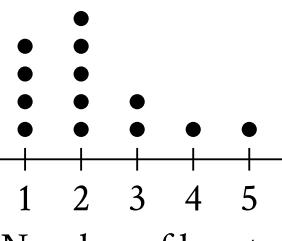

{0}------------------------------------------------

# Question ID 457d2f2c

| Assessment | Test | Domain                               | Skill                                                                       | Difficulty |
|------------|------|--------------------------------------|-----------------------------------------------------------------------------|------------|
| SAT        | Math | Problem-Solving and Data Analysis | One-variable data: Distributions and measures of center and spread |            |

### ID: 457d2f2c

3.1

A data set of 27 different numbers has a mean of 33 and a median of 33. A new data set is created by adding 7 to each number in the original data set that is greater than the median and subtracting 7 from each number in the original data set that is less than the median. Which of the following measures does NOT have the same value in both the original and new data sets?

A. Median

- B. Mean
- C. Sum of the numbers
- D. Standard deviation

#### ID: 457d2f2c Answer

Correct Answer: D

Rationale

Choice D is correct. When a data set has an odd number of elements, the median can be found by ordering the values from least to qreatest and determining the middle value. Out of the 27 different numbers in this data set, 13 numbers are below the median, one number is exactly 33, and 13 numbers are above the median. When 7 is subtracted from each number below the median and added to each number above the median, the data spread out from the median. Since the median of this data set, 33, is equivalent to the mean of the data set, the data also spread out from the mean. Since standard deviation is a measure of how spread out the data are from the mean, a greater spread from the mean indicates an increased standard deviation.

Choice A is incorrect. All the numbers less than the median decrease and all the numbers greater than the median increase, but the median itself doesn't change. Choices B and C are incorrect. The mean of a data set is found by dividing the sum of the number of values. The net change from subtracting 7 from 13 numbers and adding 7 to 13 numbers is zero. Therefore, neither the mean nor the numbers changes.

{1}------------------------------------------------

## Question ID 1142af44

| Assessment | Test | Domain                               | Skill                                                                       | Difficulty |
|------------|------|--------------------------------------|-----------------------------------------------------------------------------|------------|
| SAT        | Math | Problem-Solving and Data Analysis | One-variable data: Distributions and measures of center and spread |            |

### ID: 1142af44

| Value | Frequency |
|-------|-----------|
| 1     | ਰੇ        |
| 2     | 2a        |
| 3     | За        |
| 4     | 2a        |
| 5     | ਰੇ        |

The frequency distribution above summarizes a set of data, where a is a positive integer. How much greater is the mean of the set of data than the median?

A. O

B. 1

C. 2

D. 3

#### ID: 1142af44 Answer

Correct Answer: A

Rationale

Choice A is correct. Since the frequencies of values less than the middle value, 3, are the same as the frequencies of the values greater than 3, the set of data has a symmetric distribution. When a set of data has a symmetric distribution, the mean and median values are equal. Therefore, the mean is 0 greater than the median.

Choices B, C, and D are incorrect and may result from misinterpreting the set of data.

Question Difficulty: Hard

3.2

{2}------------------------------------------------

## Question ID 651d83bb

| Assessment | Test | Domain                               | Skill                                                                       | Difficulty |
|------------|------|--------------------------------------|-----------------------------------------------------------------------------|------------|
| SAT        | Math | Problem-Solving and Data Analysis | One-variable data: Distributions and measures of center and spread |            |

### ID: 651d83bb

3.3

Two different teams consisting of 10 members each ran in a race. Each member's completion time of the race was recorded. The mean of the completion times for each team was calculated and is shown below. Team A: 3.41 minutes Team B: 3.79 minutes

#### Which of the following MUST be true?

- 1. Every member of team A completed the race in less time than any member of team B.
- 2. The median time it took the members of team B to complete the race is greater than the it took the members of team A to complete the race.
- 3. There is at least one member of team B who took more time to complete the race than some member of team A.
- A. III only
- B. I and III only
- C. II and III only
- D. I, II, and III

#### ID: 651d83bb Answer

Correct Answer: A

#### Rationale

Choice A is correct. Since the average time for the 10 members of team A is 3.41 minutes, the sum of the 10 times for team A is equal to (10)(3.41) = 34.1 minutes. Since the average time for the 10 members of team B is

3.79 minutes, the sum of the 10 times for team B is equal to (10)(3.79) = 37.9 minutes. Since the 10

times for team B is greater than the sum of the 10 times for team A, it must be true that at least one of the times for team B must be qreater than one of the times for team A. Thus, statement III is true. However, it's possible that at least some of the times for team A were greater than some of the times for team B. For example, all of team A's times could be 3.41 minutes, and team B could have 1 time of 3.34 minutes and 9 times of 3.84 minutes. Thus, statement I need not be true. It's also possible that the median of the times for team B is less than the median of the times for team A. For example, all of team A's times could be 3.41 minutes, and team B could have 6 times of 3.37 minutes and 4 times of 4.42 minutes; then the median of team B's times would be 3.37 minutes and the median of team A's times would be 3.41 minutes. Thus, statement II need not be true.

Choices B, C, and D are incorrect because neither statement I nor statement II must be true.

{3}------------------------------------------------

{4}------------------------------------------------

## Question ID 1e8ccffd

| Assessment | Test | Domain                               | Skill                                                                       | Difficulty |
|------------|------|--------------------------------------|-----------------------------------------------------------------------------|------------|
| SAT        | Math | Problem-Solving and Data Analysis | One-variable data: Distributions and measures of center and spread |            |

### ID: 1e8ccffd

3.4

The mean score of 8 players in a basketball game was 14.5 points. If the highest individual score is removed, the mean score of the remaining 7 players becomes 12 points. What was the highest score?

A. 20

B. 24

C. 32

D. 36

### ID: 1e8ccffd Answer

Correct Answer: C

Rationale

Choice C is correct. If the mean score of 8 players is 14.5, then the total of all 8 scores is 14.5 x 8 = 116. If the mean of 7 scores is 12, then the total of all 7 scores is 12 x 7 = 84. Since the set of 7 scores was made by removing the highest score of the set of 8 scores, then the difference between the total of all 8 scores and the total of all 7 scores is equal to the removed score: 116 -84 = 32

Choice A is incorrect because if 20 is removed from the group of 8 scores, then the mean score of the (14.5×8)-20 7 remaining 7 players is is approximately 13.71, not 12. Choice B is incorrect because if 24 is (14.5×8)-24 removed from the group of 8 scores, then the mean score of the remaining 7 players is 7 is approximately 13.14, not 12. Choice D is incorrect because if 36 is removed from the group of 8 scores, then the (14.5×8)-36 7 mean score of the remaining 7 players is or approximately 11.43, not 12.

{5}------------------------------------------------

## Question ID bf47ad54

| Assessment | Test | Domain                               | Skill                                                                       | Difficulty |
|------------|------|--------------------------------------|-----------------------------------------------------------------------------|------------|
| SAT        | Math | Problem-Solving and Data Analysis | One-variable data: Distributions and measures of center and spread |            |

### ID: bf47ad54

3.5

Each of the following frequency tables represents a data set. Which data set has the greatest mean?

|    | Value | Frequency |
|----|-------|-----------|
|    | 70    | 4         |
|    | 80    | 5         |
|    | 90    | 6         |
|    | 100   | 7         |
| B. | Value | Frequency |
|    | 70    | 6         |
|    | 80    | 6         |
|    | 90    | 6         |
|    | 100   | 6         |
|    |       |           |
|    | Value | Frequency |
|    | 70    | 7         |
|    | 80    | 6         |
|    | 90    | 6         |
|    | 100   | 7         |
| D. | Value | Frequency |
|    | 70    | 8         |
|    | 80    | 5         |
|    | 90    | 5         |

ID: bf47ad54 Answer

{6}------------------------------------------------

Correct Answer: A

#### Rationale

Choice A is correct. The tables in choices B, C, and D each represent a data set where the values 80 and 90 have the same frequency and the values 70 and 100 have the same frequency. It follows that each of these data sets is symmetric around the value halfway between 80 and 90, or 85. When a data set is symmetric around a value, that value is the mean of the data set. Therefore, the data sets represented by the tables in choices B, C, and D each have a mean of 85. The table in choice A represents a data set where the value 90 has a greater frequency than the value 80 and the value 100 has a greater frequency than the value 70. It follows that this data set has a mean greater than 85. Therefore, of the given choices, choice A represents the data set with the greatest mean.

Choice B is incorrect and may result from conceptual or calculation errors.

Choice C is incorrect and may result from conceptual or calculation errors.

Choice D is incorrect and may result from conceptual or calculation errors.

{7}------------------------------------------------

## Question ID 4ff597db

| Assessment | Test | Domain                               | Skill                                                                       | Difficulty |
|------------|------|--------------------------------------|-----------------------------------------------------------------------------|------------|
| SAT        | Math | Problem-Solving and Data Analysis | One-variable data: Distributions and measures of center and spread |            |

### ID: 4ff597db

3.6

The mean amount of time that the 20 employees of a construction company have worked for the company is 6.7 years. After one of the employees leaves the company, the mean amount of time that the remaining employees have worked for the company is reduced to 6.25 years. How many years did the employee who left the company work for the company?

A. 0.45

B. 2.30

- C. 9.00
- D. 15.25

#### ID: 4ff597db Answer

Correct Answer: D

Rationale

Choice D is correct. The mean amount of time that the 20 employees worked for the company is 6.7 years. This means that the total number of years all 20 employees worked for the company is (6.7)(20) = 134 years. After the employee left, the mean amount of time that the remaining 19 employees worked for the company is 6.25 years. Therefore, the total number of years all 19 employees worked for the company is (6.25)(19) = 118.75 years. It follows that the number of years that the employee who left had worked for the company is 134 – 118.75 = 15.25 years.

Choice A is incorrect; this is the change in the mean, which isn't the same as the amount of time worked by the employee who left. Choice B is incorrect and likely results from making the assumption that there were still 20 employees, rather than 19, at the company after the employee left and then subtracting the original mean of 6.7 from that result. Choice C is incorrect and likely results from making the assumption that there were still 20 employees, rather than 19, at the company after the employee left.

{8}------------------------------------------------

## Question ID 391ae4b2

| Assessment | Test | Domain                               | Skill                                                                       | Difficulty |
|------------|------|--------------------------------------|-----------------------------------------------------------------------------|------------|
| SAT        | Math | Problem-Solving and Data Analysis | One-variable data: Distributions and measures of center and spread |            |

#### ID: 391ae4b2

3.7

Data set F consists of 55 integers between 170 and 290. Data set G consists of all the integers in data set F as well as the integer 10. Which of the following must be less for data set G?

- I. The mean
- II. The median

A. I only

B. Il only

C. I and II

- D. Neither I nor II
#### ID: 391ae4b2 Answer

Correct Answer: D

Rationale

Choice D is correct. It's given that data set F consists of 55 integers between 170 and 290 and data set G consists of all the integers in data set F as well as the integer 10 is less than all the integers in data set F, the mean of data set G must be less than the mean of data set F. Thus, the mean of data set F isn't less than the mean of data set G. When a data set is in ascending order, the median is between the two middle values when there is an even number of values and the middle value when there is an odd number of values. It follows that the median of data set F is either greater than or equal to the median of data set G. Therefore, the median of data set F isn't less than the median of data set G. Thus, neither the mean nor the median must be less for data set F than for data set G.

Choice A is incorrect and may result from conceptual or calculation errors.

Choice B is incorrect and may result from conceptual or calculation errors.

Choice C is incorrect and may result from conceptual or calculation errors.
{9}------------------------------------------------

# Question ID 9d935bd8

| Assessment | Test | Domain                               | Skill                                                                       | Difficulty |
|------------|------|--------------------------------------|-----------------------------------------------------------------------------|------------|
| SAT        | Math | Problem-Solving and Data Analysis | One-variable data: Distributions and measures of center and spread |            |

## ID: 9d935bd8

Percent of Residents Who Earned a Bachelor's Degree or Higher

| State   | Percent of residents |
|---------|----------------------|
| State A | 21.9%                |
| State B | 27.9%                |
| State C | 25.9%                |
| State D | 19.5%                |
| State E | 30.1%                |
| State F | 36.4%                |
| State G | 35.5%                |

A survey was given to residents of all 50 states asking if they had earned a bachelor's degree or higher. The results from 7 of the states are given in the table above. The median percent of residents who earned a bachelor's degree or higher for all 50 states was 26.95%. What is the difference between the median percent of residents who earned a bachelor's degree or higher for these 7 states and the median for all 50 states?

A. 0.05%

B. 0.95%

C. 1.22%

D. 7.45%

### ID: 9d935bd8 Answer

Correct Answer: B

Rationale

Choice B is correct. The median of a set of numbers is the middle value of the set values when ordered from least to greatest. If the percents in the table are ordered from least to greatest, the middle value is 27.9%. The difference between 27.9% and 26.95% is 0.95%.

Choice A is incorrect and may be the result of calculation errors or not finding the median of the data in the table correctly. Choice C is incorrect and may be the result of finding the mean instead of the median. Choice D is incorrect and may be the result of using the middle value of the unordered list.

Question Difficulty: Hard

3.8

{10}------------------------------------------------

# Question ID 54d93874

| Assessment | Test | Domain                               | Skill                                                                       | Difficulty |
|------------|------|--------------------------------------|-----------------------------------------------------------------------------|------------|
| SAT        | Math | Problem-Solving and Data Analysis | One-variable data: Distributions and measures of center and spread |            |

ID: 54d93874

|        | Masses (kilograms) |     |     |     |     |     |
|--------|--------------------|-----|-----|-----|-----|-----|
| Andrew | 2.4                | 2.5 | 3.6 | 3.1 | 2.5 | 2.7 |
| Maria  | X                  | 3.1 | 2.7 | 2.9 | 3.3 | 2.8 |

Andrew and Maria each collected six rocks, and the masses of the rocks are shown in the table above. The mean of the masses of the rocks Maria collected is 0.1 kilogram greater than the mean of the masses of the rocks Andrew collected. What is the value of x ?

### ID: 54d93874 Answer

Rationale

The correct answer is 2.6. Since the mean of a set of numbers can be found by adding the numbers together and dividing by how many numbers there are in the set, the mean mass, in kilograms, of the rocks Andrew 2.4+2.5+3.6+3.1+2.5+2.7 16.8

collected is 6 , or 2.8. Since the mean mass of the rocks Maria 6

collected is 0.1 kilogram greater than the mean mass of rocks Andrew collected, the mean mass of the rocks Maria collected is 2,8 +0,1 =2,9 kilograms. The value of x can be found by writing an equation for finding the

x +3.1 +2.7 +2.9 +3.3 +2.8 =2.9 mean: 6 . Solving this equation gives x = 2.6. Note that 2.6 and 13/5 are

examples of ways to enter a correct answer.

Question Difficulty: Hard

3.9

{11}------------------------------------------------

# Question ID 94237701

| Assessment | Test | Domain                               | Skill                                                                       | Difficulty |
|------------|------|--------------------------------------|-----------------------------------------------------------------------------|------------|
| SAT        | Math | Problem-Solving and Data Analysis | One-variable data: Distributions and measures of center and spread |            |

## ID: 94237701

3.10

For a certain computer game, individuals receive an integer score that ranges from 2 through 10. The table below shows the frequency distribution of the scores of the 9 players in group A and the 11 players in group B.

|       | Score Frequencies |            |  |
|-------|----------------------|------------|--|
| Score | Group A           | Group B |  |
| 2     | 1                    | 0          |  |
| 3     | 1                    | 0          |  |
| 4     | 2                    | 0          |  |
| 5     | 1                    | 4          |  |
| 6     | 3                    | 2          |  |
| 7     | 0                    | 0          |  |
| 8     | 0                    | 2          |  |
| 9     | 1                    | 1          |  |
| 10    | 0                    | 2          |  |
| Total | 9                    | 11         |  |

The median of the scores for group B is how much greater than the median of the scores for group A?

## ID: 94237701 Answer

Rationale

The correct answer is 1. When there are an odd number of values in a data set, the median of the data set is the middle number when the data values are ordered from least to greatest. The scores for group A, ordered from least to greatest, are 2, 3, 4, 4, 5, 6, 6, and 9. The median of the scores for group A is therefore 5. The scores for group B, ordered from least to greatest, are 5, 5, 5, 6, 6, 8, 9, 10, and 10. The median of the scores for group B is therefore 6. The median score for group B is 6 – 5 = 1 more than the median score for group A.

{12}------------------------------------------------

Question Difficulty: Hard

{13}------------------------------------------------

# Question ID e7d48c8a

| Assessment | Test | Domain                               | Skill                                                                       | Difficulty |
|------------|------|--------------------------------------|-----------------------------------------------------------------------------|------------|
| SAT        | Math | Problem-Solving and Data Analysis | One-variable data: Distributions and measures of center and spread |            |

# ID: e7d48c8a

3.11

# Number of bursts

The dot plot represents a data set of the number of bursts for 13 eruptions of a steam vent. If an additional eruption with 11 bursts is added to this data set to create a new data set of 14 eruptions, which of the following measures will be greater for the new data set than for the original data set?

The median number of bursts The mean number of bursts

A. I and II

B. I only

C. Il only

D. Neither I nor II

## ID: e7d48c8a Answer

Correct Answer: C

{14}------------------------------------------------

#### Rationale

Choice C is correct. It's given that the dot plot represents a data set of the number of bursts for 13 eruptions of a steam vent. The median of a data set with an odd number of element when the elements are in numerical order. For 13 elements in numerical order, this is the 7th element. For this data set, the first 4 elements have a value of 1, and the next 5 elements have a value of 2. Thus, the 7th element in the ordered data set is 2 and the median number of bursts for the original data set is 2. If an additional eruption with 11 bursts is added to this data set of 14 eruptions, the median of the new data set will be betweents in the ordered set, which will also be 2. Therefore, the median number of bursts for the new data set will be the same as the median number of bursts for the original data set. The mean number of bursts for the original data set is found by adding the values of all 13 elements and dividing that sum by the number of elements, 13. Since the data is shown in a dot plot, the sum of the elements can be found by multiplying each element's value by its frequency: 14 + 25 + 32 + 41 + 51, or 29. Therefore, the mean number of bursts for the original data set is 2. If an additional eruption with 11 bursts is added to this data set to create a new data set of 14 bursts, 40. Since the mean number of bursts for the new data set is 22, or 40 ², the mean number of bursts for the new data set 14 is greater than the mean number of bursts for the original data set. Therefore, of the median number of bursts and the mean number of bursts, only the mean number of bursts is greater for the new data set.

Choice A is incorrect and may result from conceptual or calculation errors.

Choice B is incorrect and may result from conceptual or calculation errors.

Choice D is incorrect and may result from conceptual or calculation errors.

#### Question Difficulty: Hard

{15}------------------------------------------------

# Question ID ecbdbe84

| Assessment | Test | Domain                               | Skill                                                                       | Difficulty |
|------------|------|--------------------------------------|-----------------------------------------------------------------------------|------------|
| SAT        | Math | Problem-Solving and Data Analysis | One-variable data: Distributions and measures of center and spread |            |

# ID: ecbdbe84

3.12

The table shown summarizes the number of employees at each of the 17 restaurants in a town.

| Number of employees | Number of restaurants |
|---------------------|-----------------------|
| 2 to 7              | 2                     |
| 8 to 13             | 4                     |
| 14 to 19            | 2                     |
| 20 to 25            | 7                     |
| 26 to 31            | 2                     |

Which of the following could be the median number of employees for the restaurants in this town?

A. 2

B. 9

C. 15

D. 21

## ID: ecbdbe84 Answer

Correct Answer: D

{16}------------------------------------------------

#### Rationale

Choice D is correct. If a data set contains an odd number of data values, the median is represented by the middle data value in the list when the data values are listed in ascending order. Since the numbers of employees are given as ranqes of values rather than specific values, it's only possible to determine the range in which the median falls, rather than the exact median. Since there are 17 restaurants included in the data set and the numbers of employees are listed in ascending order, it follows that the median number of employees will be represented by the ninth restaurant in the list. Since the first 2 restaurants each have 2 to 7 employees in the 2 to 7 range would be represented by the first and second restaurants in the list. The next 4 restaurants each have 8 to 13 employees. Therefore, numbers of employees in the 8 to 13 range will be represented by the third through sixth restaurants in the list. The next 2 restaurants each have 14 to 19 employees. Therefore, numbers of employees in the 14 to 19 range will be represented by the seventh and eighth restaurants in the list. Since the next 7 restaurants each have 20 to 25 employees, numbers of employees in the 20 to 25 range will be represented by the ninth through fifteenth restaurants in the list. This means that the ninth restaurant in the list, which has the median number of employees for the restaurants in this town, has a number of employees in the 20 to 25 range. Of the given choices, the only number of employees in the 20 to 25 range is 21.

Choice A is incorrect and may result from conceptual or calculation errors.

Choice B is incorrect. This is the position of the median in the list, not the value of the median.

Choice C is incorrect and may result from conceptual or calculation errors.

#### Question Difficulty: Hard