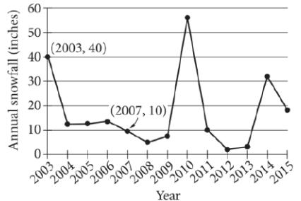

{0}------------------------------------------------

## Question ID 954943a4

| Assessment | Test | Domain                               | Skill       | Difficulty |
|------------|------|--------------------------------------|-------------|------------|
| SAT        | Math | Problem-Solving and Data Analysis | Percentages |            |
|            |      |                                      |             |            |

ID: 954943a4

3.1

Jennifer bought a box of Crunchy Grain cereal. The nutrition facts on the

n

box state that a serving size of the cereal is 4 cup and provides 210

calories, 50 of which are calories from fat. In addition, each serving of the cereal provides 180 milligrams of potassium, which is 5% of the daily allowance for adults. If p percent of an adult's daily allowance of potassium is provided by x servings of Crunchy Grain cereal per day, which of the following expresses p in terms of x ?

A. p = 0.5x

B. p = 5x

$$\mathbf{C}. \rho = (\mathbf{O}. \mathbf{O}\mathbf{5})^{\times}$$

D. p = (1.05)*

### ID: 954943a4 Answer

Correct Answer: B

### Rationale

Choice B is correct. It's given that each serving of Crunchy Grain cereal provides 5% of an adult's daily allowance of potassium, so x servings would provide x times 5%. The percentage of an adult's daily allowance of potassium, p, is 5 times the number of servings, x. Therefore, the percentage of an adult's daily allowance of potassium can be expressed as n = 5x

Choices A. C. and D are incorrect and may result from incorrectly converting 5% to its decimal equivalent, which isn't necessary since p is expressed as a percentage. Additionally, choices C and D are incorrect because the context should be represented by a linear relationship, not by an exponential relationship.

{1}------------------------------------------------

## Question ID 65c49824

| Assessment | Test | Domain                               | Skill       | Difficulty |
|------------|------|--------------------------------------|-------------|------------|
| SAT        | Math | Problem-Solving and Data Analysis | Percentages |            |

### ID: 65c49824

A school district is forming a committee to discuss plans for the construction of a new high school. Of those invited to join the committee, 15% are parents of students, 45% are teachers from the current high school, 25% are school and district administrators, and the remaining 6 individuals are students. How many more teachers were invited to join the committee than school and district administrators?

### ID: 65c49824 Answer

Rationale

The correct answer is 8. The 6 students represent (100–15–45–25)% = 15% of those invited to join the 6 = 40 people committee. If x people were invited to join the committee, then 0.15x = 6. Thus, there were 0.15 invited to join the committee. It follows that there were 0.45(40) = 18 teachers and 0.25(40) = 10 school and district administrators invited to join the committee. There were 8 more teachers than school and district administrators invited to join the committee.

Question Difficulty: Hard

3.2

{2}------------------------------------------------

### Question ID 0ea56bb2

Subscriptions

sold

5,600

5,880

Year

2012

2013

| Assessment   | Test | Domain                               | Skill       | Difficulty |
|--------------|------|--------------------------------------|-------------|------------|
| SAT          | Math | Problem-Solving and Data Analysis | Percentages |            |
| ID: 0ea56bb2 |      |                                      |             |            |

The manager of an online news service received the report above on the number of subscriptions sold by the service. The manager estimated that the percent increase from 2012 to 2013 would be double the percent increase from 2013 to 2014. How many subscriptions did the manager expect would be sold in 2014?

A. 6,020

B. 6,027

C. 6,440

D. 6,468

ID: 0ea56bb2 Answer

Correct Answer: B

Rationale

|                                                                 | 5,880-5,600 |                                                                                                                                                                                |
|-----------------------------------------------------------------|-------------|--------------------------------------------------------------------------------------------------------------------------------------------------------------------------------|
| Choice B is correct. The percent increase from 2012 to 2013 was | 5.600       | ------------------------------------------------------------------------------------------------------------------------------------------------------------------------------ |

percent increase from 2012 to 2013 was estimated to be double the percent increase from 2013 to 2014, the percent increase from 2013 to 2014 was expected to be 2.5%.

Therefore, the number of subscriptions sold in 2014 is expected to be the number of subscriptions sold in 2013 multiplied by (1 +0.025), or 5,880(1.025) = 6,027.

Choice A is incorrect and is the result of adding half of the value of the increase from 2012 to 2013 to the 2013 result. Choice C is incorrect and is the result adding twice the value of the increase from 2012 to 2013 to the 2013 result. Choice D is incorrect and is the result of interpreting the percent increase from 2013 to 2014 as double the percent increase from 2012 to 2013.

{3}------------------------------------------------

# Question ID 0231050d

| Assessment | Test | Domain                               | Skill       | Difficulty |
|------------|------|--------------------------------------|-------------|------------|
| SAT        | Math | Problem-Solving and Data Analysis | Percentages |            |

3.4

### ID: 0231050d

The line graph shows the total amount of snow, in inches, recorded each year in Washington, DC, from 2003 to 2015. If p % is the percent decrease in the annual snowfall from 2003 to 2007, what is the value of p ?

#### ID: 0231050d Answer

Rationale

The correct answer is 75. The percent decrease between two values is found by dividing the difference between the two values by the original value and multiplying by 100. The line graph shows that the annual snowfall in 2003 was 40 inches, and the annual snowfall in 2007 was 10 inches. Therefore, the percent

40-10 (100) decrease in the annual snowfall from 2003 to 2007 is 40 or 75. It's given that this is equivalent to p %, so the value of p is 75.

{4}------------------------------------------------

## Question ID 67c0200a

| Assessment   | Test | Domain                               | Skill       | Difficulty |
|--------------|------|--------------------------------------|-------------|------------|
| SAT          | Math | Problem-Solving and Data Analysis | Percentages |            |
| ID: 67c0200a |      |                                      |             |            |

The number a is 70% less than the positive number c is 80% greater than a. The number c is how many times b?

### ID: 67c0200a Answer

Correct Answer: .54, 27/50

Rationale

The correct answer is .54. It's given that the number a is 70% less than the positive number b. Therefore, a = (1 = greater than a. Therefore, c = (1 + - - - ) a, which is equivalent to c = (1 + 0.80)a, or c = 1.80a. Since a = 0.30b, substituting 0.30b for a in the equation c = 1.80(0.306), or c = 0.54b. Thus, c is 0.54 times b. Note that .54 and 27/50 are examples of ways to enter a correct answer.

{5}------------------------------------------------

## Question ID 55818046

| Assessment | Test | Domain                               | Skill       | Difficulty |
|------------|------|--------------------------------------|-------------|------------|
| SAT        | Math | Problem-Solving and Data Analysis | Percentages |            |

### ID: 55818046

3.6

According to the 2010 Census, the adult population aged 18 years or greater of the United States in 2010 was 234,564,071. In 2010, a survey was conducted among a randomly chosen sample of adults aged 18 years or greater in the United States about their preference to live in a warm climate or a cool climate. The table below displays a summary of the survey results.

|                                 | Warm | Cool | No preference | Total |
|---------------------------------|------|------|------------------|-------|
| 18-35 years old              | 295  | 168  | 45               | 508   |
| 36-50 years old              | 246  | 123  | 41               | 410   |
| 51-65 years old              | 238  | 117  | 48               | 403   |
| Greater than 65 years old | 137  | 78   | 64               | 279   |
| Total                           | 916  | 486  | 198              | 1,600 |

Which of the following is closest to the difference between the percentage of adults aged 18–50 years who responded "warm" and the percentage of adults aged 51 years or greater who responded "warm"?

A. 4%

B. 5%

C. 10%

D. 18%

### ID: 55818046 Answer

Correct Answer: A

Rationale

{6}------------------------------------------------

295+246 541 Choice A is correct. The percentage of adults aged 18–50 who responded "warm" is 508 + 410 918 , or 375 238+137 about 58.9%. The percentage of adults aged 51 years or greater who responded "warm" is 403 + 279 682 , or about 55.0%. The difference between 58.9% and 55.0% is 3.9%. Of the answer choices, 4% is closest to this number.

Choices B, C, and D are incorrect and may result from calculation errors.

{7}------------------------------------------------

### Question ID 20845d36

| Assessment   | Test | Domain                               | Skill       | Difficulty |  |
|--------------|------|--------------------------------------|-------------|------------|--|
| SAT          | Math | Problem-Solving and Data Analysis | Percentages |            |  |
| ID: 20845d36 |      |                                      |             |            |  |

The number a is 70% less than the positive number c is 60% greater than a. The number c is how many times b?

#### ID: 20845d36 Answer

Correct Answer: .48, 12/25

Rationale

The correct answer is .48. It's given that the number a is 70% less than the positive number b. Therefore, a = (1 = greater than a. Therefore, c = (1 + - %) a, which is equivalent to c = (1 + 0.60)a, or c = 1.60a. Since a = 0.30b, substituting 0.30b for a in the equation c = 1.60(0.306), or c = 0.486. Thus, c is 0.48 times b. Note that .48 and 12/25 are examples of ways to enter a correct answer.

{8}------------------------------------------------

## Question ID 8c5dbd3e

| Assessment   | Test | Domain                               | Skill       | Difficulty |  |
|--------------|------|--------------------------------------|-------------|------------|--|
| SAT          | Math | Problem-Solving and Data Analysis | Percentages |            |  |
| ID: 8c5dbd3e |      |                                      |             |            |  |

The number w is 110% greater than the number z is 55% less than 50. What is the value of w?

### ID: 8c5dbd3e Answer

Correct Answer: 189/4, 47.25

Rationale

The correct answer is 47.25. It's given that the number w is 110% greater than the number z. It follows that w = (1 + - 30 ) x, or w = 2.1x It's also given that the number z is 55% less than 50. It follows that
z = (1 = yields w = 2.1(22.5), which is equivalent to w = 47.25. Therefore, the value of w is 47.25 and 189/4 are examples of ways to enter a correct answer.
{9}------------------------------------------------

## Question ID 8213b1b3

| SAT        | Math | Problem-Solving and Data Analysis | Percentages |            |
|------------|------|--------------------------------------|-------------|------------|
| Assessment | Test | Domain                               | Skill       | Difficulty |

## ID: 8213b1b3

3.9

According to a set of standards, a certain type of substance can contain a maximum of 0.001% phosphorus by mass. If a sample of this substance has a mass of 140 grams, what is the maximum mass, in grams, of phosphorus the sample can contain to meet these standards?

## ID: 8213b1b3 Answer

Correct Answer: .0014

Rationale

The correct answer is .0014. It's given that a certain type of substance can contain a maximum of 0.001% phosphorus by mass to meet a set of standards. If a sample of the substance has a mass of 140 grams, it follows that the maximum mass, in grams, of phosphorus the sample can contain to meet the standards is 0.001% of 140, or 400-1140), which is equivalent to (0.00001)(140), or 0.0014. Note that .0014 and 0.001 are examples of ways to enter a correct answer.

{10}------------------------------------------------

## Question ID 34f8cd89

| Assessment | Test | Domain                               | Skill       | Difficulty |
|------------|------|--------------------------------------|-------------|------------|
| SAT        | Math | Problem-Solving and Data Analysis | Percentages |            |
|            |      |                                      |             |            |

## ID: 34f8cd89

3.10

37% of the items in a box are green. Of those, 37% are also rectangular. Of the green rectangular items, 42% are also metal. Which of the following is closest to the percentage of the items in the box that are not rectangular green metal items?

- A. 1.16%
- B. 57.50%
- C. 94.25%
- D. 98.84%

## ID: 34f8cd89 Answer

Correct Answer: C

Rationale

Choice C is correct. It's given that 37% of the items in a box are green. Let x represent the total number of items in the box. It follows that 35 x, or 0.37;; items in the box are green. It's also given that of those, 37% are also rectangular. Therefore, 33 (0.37%), or 0.1369x, items in the box are green rectangular items. It's also given that of the green rectangular items, 42% are also metal. Therefore, % (0.1369x), or 0.057498m, items in the box are rectangular green metal items. The items in the box that are not rectangular green metal items is the total number of items in the box minus the number of rectangular green metal items in the box. Therefore, the number of the box that are not rectangular green metal items is m = 0,057498; or 0.942502x. The percentage of items in the box that are not rectangular green metal items is the percentage that 0.942502x is of x . If p% represents this percentage, the value of p is 100 ( 1.4426022 ), or 94.2502. Of the given choices, 94.25% is closest to the percentage of items in the box that are not rectangular green metal items.

Choice A is incorrect and may result from conceptual or calculation errors.

Choice B is incorrect and may result from conceptual or calculation errors.

Choice D is incorrect and may result from conceptual or calculation errors.

{11}------------------------------------------------

## Question ID 25faa756

| Assessment   | Test | Domain                               | Skill       | Difficulty |
|--------------|------|--------------------------------------|-------------|------------|
| SAT          | Math | Problem-Solving and Data Analysis | Percentages |            |
| ID: 25faa756 |      |                                      |             | 3.11       |

The number a is 60% greater than the positive number c is 45% less than a. The number c is how many times b?

## ID: 25faa756 Answer

Correct Answer: .88, 22/25

Rationale

The correct answer is .88. It's given that the number a is 60% greater than the positive number b. Therefore, a = (1 + 品)b, which is equivalent to a = (1 + 0.60)b, or a = 1.60b. It's also given that the number c is 45% less than a. Therefore, c = (1 - - - - (1 - - - (1 - 0.45)a, or c = 0.55a. Since a = 1.600, substituting 1.60b for a in the equation c = 0.55(1.60b), or c = 0.88b. Thus, the number c is 0.88 times the number b. Note that .88 and 22/25 are examples of ways to enter a correct answer.

{12}------------------------------------------------

## Question ID ad911622

| Assessment | Test | Domain                               | Skill       | Difficulty |
|------------|------|--------------------------------------|-------------|------------|
| SAT        | Math | Problem-Solving and Data Analysis | Percentages |            |
|            |      |                                      |             |            |

## ID: ad911622

3.12

The value of a collectible comic book increased by 167% from the end of 2011 to the end of 2012 and then decreased by 16% from the end of 2013. What was the net percentage increase in the value of the collectible comic book from the end of 2011 to the end of 2013?

- A. 124.28%
- B. 140.28%
- c. 151.00%
- D. 209.72%

## ID: ad911622 Answer

Correct Answer: A

#### Rationale

Choice A is correct. It's given that the value of the comic book increased by 167% from the end of 2011 to the end of 2012. Therefore, if the value of the comic book at the end of 2011 was x dollars, then the value, in dollars, of the comic book at the end of 2012 was x + ( 155 ) x, which can be rewritten as 1x + 1.67x, or 2.67x. It's also given that the value of the comic book decreased by 16% from the end of 2013. Therefore, the value, in dollars, of the comic book at the end of 2013 was 2.67x ( - 2.67x ( - 2.67x ( - 2.67x ( - 2.67x ( - 2.67x ( - 2.67x ( - 2.67x ( - 2.67x ( - 2.67x ( rewritten as 2.67x - (2.67x)(0.16), or 2.2428x. Thus, if the value of the comic book at the end of 2011 was x dollars, and the value of the comic book at the end of 2013 was 2.2428x dollars, then from the end of 2011 to the end of 2013, the value of the comic book increased by 2.2428x, dollars. Therefore, the increase in the value of the comic book from the end of 2013 is equal to 1.2428 times the value of the comic book at the end of 2011. It follows that from the end of 2013, the net percentage increase in the value of the comic book was (1.2428)(100)%, or 124.28%.

Choice B is incorrect and may result from conceptual or calculation errors.

Choice C is incorrect. This is the difference between the net percentage increase in the value of the comic book from the end of 2011 to the end of 2012 and the net percentage decrease in the value of the comic book from the end of 2012 to the end of 2013, not the net percentage increase in the value of the comic book from the end of 2011 to the end of 2013.

Choice D is incorrect. This is the net percentage increase in the comic book from the end of 2011 to the end of 2013, if the value of the comic book increased by 167% from the end of 2012 and then increased, not decreased, by 16% from the end of 2012 to the end of 2013.

{13}------------------------------------------------

# Question ID ba0e23b0

| Assessment | Test | Domain                               | Skill       | Difficulty |
|------------|------|--------------------------------------|-------------|------------|
| SAT        | Math | Problem-Solving and Data Analysis | Percentages |            |

## ID: ba0e23b0

3.13

140 is p% greater than 10. What is the value of p?

- A. 1,400
- B. 1,300
- C. 140
- D. 130

## ID: ba0e23b0 Answer

#### Correct Answer: B

## Rationale

Choice B is correct. It's given that 140 is p% greater than 10. It follows that 140 = 10 + -- 10, which is equivalent to 140 = 10 + 10 + 0.1 p. Subtracting 10 from each side of this equation yields 130 = 0.1 p. Dividing each side of this equation by 0.1 yields 1,300 = p, or p = 1,300.

Choice A is incorrect. This would be the value of p if 140 were p% of 10, not p% greater than 10.

Choice C is incorrect and may result from conceptual or calculation errors.

Choice D is incorrect and may result from conceptual or calculation errors.

{14}------------------------------------------------

# Question ID 2afd3cec

| Math SAT | Problem-Solving and Data Analysis | Percentages |  |
|-------------|--------------------------------------|-------------|--|

## ID: 2afd3cec

3.14

After 20% of the original number of marbles in a group were removed from the group, 360 marbles remained in the group. How many marbles were removed from the group?

- A. 72
- B. 90
- c. 450
- D. 1,800

## ID: 2afd3cec Answer

## Correct Answer: B

## Rationale

Choice B is correct. It's given that 20% of the original number of marbles were removed from the group. Let x represent the original number of marbles in the group. It follows that __ x, or 0.20x, marbles were removed from the group. Therefore, x - 0.20x marbles remained in the group. It's also given that 360 marbles remained in the group. Thus, x - 0.20x = 360, or 0.80x = 360. Dividing both sides of this equation by 0.80 yields x = 450. Substituting 450 for x in the expression 0.20x yields 0.20 ( 450 ), or 90. Therefore, 90 marbles were removed from the group.

Choice A is incorrect. This is 20% of the remaining number of marbles.

Choice C is incorrect. This is the original number of marbles, not the number of marbles that were removed.

Choice D is incorrect and may result from conceptual or calculation errors.

{15}------------------------------------------------

# Question ID e635aede

| Assessment | Test | Domain                               | Skill       | Difficulty |
|------------|------|--------------------------------------|-------------|------------|
| SAT        | Math | Problem-Solving and Data Analysis | Percentages |            |

## ID: e635aede

3.15

 In 2008, Zinah earned 14% more than in 2007, and in 2009 Zinah earned 4% more than in 2008. If Zinah earned y times as much in 2009 as in 2007, what is the value of y?

A. 0.5600

B. 1.0056

c. 1.1800

D. 1.1856

## ID: e635aede Answer

#### Correct Answer: D

#### Rationale

Choice D is correct. It's given that in 2008 Zinah earned 14% more than in 2007. Let h represent the amount Zinah earned in 2007 and let j represent the amount that Zinah earned in 2008. This situation can be represented by the equation j = 1 + %, or j = 1.14h. It's also given that in 2009 Zinah earned 4% more than in 2008. Let k represent the amount Zinah earned in 2009. This situation can be represented by the equation k = 1 + _ , , or k = 1.04j. Substituting 1.14h for j in the equation k = 1.04 j yields k = 1.041.14h, or k = 1.1856h. If Zinah earned y times as much in 2009 as in 2007, then the value of y is 1.1856.

Choice A is incorrect and may result from conceptual or calculation errors.

Choice B is incorrect and may result from conceptual or calculation errors.

Choice C is incorrect and may result from conceptual or calculation errors.

{16}------------------------------------------------

# Question ID 1fbd3b67

| Assessment | Test | Domain                               | Skill       | Difficulty |
|------------|------|--------------------------------------|-------------|------------|
| SAT        | Math | Problem-Solving and Data Analysis | Percentages |            |
|            |      |                                      |             |            |

ID: 1fbd3b67

3.16

The number a is 190% greater than the number b is 80% less than 24. What is the value of a?

B. 13.92

C. 26.40

D. 36.48

## ID: 1fbd3b67 Answer

#### Correct Answer: B

## Rationale

Choice B is correct. It's given that the number b is 80% less than 24. It follows that b is equal to 24 minus 80% of 24, which can 24. This is equivalent to b = 24 - 0.824, or b = 4.8. It's also given that the number a is 190% greater be written as b = 24 -190 than the number b. It follows that a is equal to b plus 190% of b. Since b = 4.8, this can be written as a = 4.8 + 4.8. This is 100 equivalent to a = 4.8 + 1.94.8, or a = 13.92.

Choice A is incorrect. This would be the value of a if a were 190% of b, not 190% greater than b.

Choice C is incorrect. This is 190 - 80% of 24.

Choice D is incorrect. This would be the value of a if b were 80% of 24, not 80% less than 24, and a were 190% of b, not 190% greater than b.