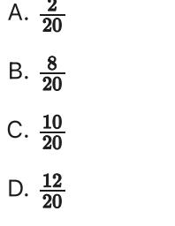

{0}------------------------------------------------

# Question ID 1353b86e

| Assessment | Test | Domain                               | Skill                                         | Difficulty |
|------------|------|--------------------------------------|-----------------------------------------------|------------|
| SAT        | Math | Problem-Solving and Data Analysis | Probability and conditional probability |            |

### ID: 1353b86e

1.1

Colors of Marbles in a Baq

| Color | Number |
|-------|--------|
| Red   | 8      |
| Blue  | 10     |
| Green | 22     |
| Total | 40     |

The table shows the number of different colors of marbles in a bag. If a marble is chosen at random from the bag, what is the probability that the marble will be blue?

| 30    |
|-------|
| A. 40 |
| 22    |
| B. 40 |
| c. 18 |
|       |
| 10    |

D. 40

#### ID: 1353b86e Answer

Correct Answer: D

Rationale

Choice D is correct. If a marble is chosen at random from the bag, the probability of choosing a marble of a certain color is the number of that color divided by the total number of marbles in the bag. Since there are 10 blue marbles in the bag, and there are 40 total marbles in the bag, the probability that the marble 10 chosen will be blue is 40

Choices A, B, and C are incorrect. These represent the marble chosen won't be blue (choice A), will be green (choice B), and won't be green (choice C).

{1}------------------------------------------------

{2}------------------------------------------------

# Question ID d89c1513

| Assessment | Test | Domain                               | Skill                                         | Difficulty |
|------------|------|--------------------------------------|-----------------------------------------------|------------|
| SAT        | Math | Problem-Solving and Data Analysis | Probability and conditional probability |            |

ID: d89c1513

1.2

#### Customer Purchases at a Gas Station

|                        |    | Beverage purchased   Beverage not purchased   Total |     |
|------------------------|----|-----------------------------------------------------|-----|
| Gasoline purchased     | 60 | 25                                                  | 85  |
| Gasoline not purchased | 35 | 15                                                  | 50  |
| Total                  | 90 | 40                                                  | 135 |

On Tuesday, a local gas station had 135 customers. The table above summarizes whether or not the customers on Tuesday purchased gasoline, a beverage, both, or neither. Based on the data in the table, what is the probability that a gas station customer selected at random on that day did not purchase gasoline?

## ID: d89c1513 Answer

Correct Answer: D

Rationale

Choice D is correct. The total number of gas station customers on Tuesday was 135. The table shows that the number of customers who did not purchase gasoline was 50. Finding the ratio of the number of customers who did not purchase gasoline to the total number of customers gives the probability that a customer selected at 50 random on that day did not purchase gasoline, which is 135 .

Choice A is incorrect and may result from finding the probability that a customer did not purchase a beverage, given that the customer did not purchase gasoline. Choice B is incorrect and may result from finding the probability that a customer did not purchase gasoline, given that the customer did not purchase a beverage.

{3}------------------------------------------------

Choice C is incorrect and may result from finding the probability that a customer did purchase a beverage, given that the customer did not purchase gasoline.

{4}------------------------------------------------

# Question ID 46545dd6

| Assessment | Test | Domain                               | Skill                                         | Difficulty |
|------------|------|--------------------------------------|-----------------------------------------------|------------|
| SAT        | Math | Problem-Solving and Data Analysis | Probability and conditional probability |            |

## ID: 46545dd6

131

Number of High School Students Who

| High     | Year |             |      |      |      |  |
|----------|------|-------------|------|------|------|--|
| school   |      | 2008   2009 | 2010 | 2011 | 2012 |  |
| Foothill | 87   | 80          | 75   | 76   | 70   |  |
| Vallev   | 44   | 54          | 65   | 76   | 82   |  |
|          |      |             |      |      |      |  |

134

140

Completed Summer Internships

The table above shows the number of students from two different high schools who completed summer internships in each of five years. No student attended both schools. Of the students who completed a summer internship in 2010, which of the following represents the fraction of students who were from Valley High School?

152

152

Total

D. 75

### ID: 46545dd6 Answer

Correct Answer: B

Rationale

Choice B is correct. According to the table, 140 students from the two high schools completed summer internships in 2010. Of these, 65 were from Valley High School. Therefore, of the students who completed 65 summer internships in 2010, 140 represents the fraction who were from Valley High School.

Choice A is incorrect. This is the difference between the numbers of students from the two high schools who completed internships in 2010 divided by the total number of students from the two schools who completed

1.3

{5}------------------------------------------------

internships that year. Choice C is incorrect. This is the fraction of students from Foothill High School who completed internships out of all the students who completed internships in 2010. Choice D is incorrect. This is the number of students from Valley High School who completed internships in 2010 divided by the number of students from Foothill High School who completed internships in 2010.

{6}------------------------------------------------

## Question ID 16cea46c

| Assessment | Test | Domain                               | Skill                                         | Difficulty |
|------------|------|--------------------------------------|-----------------------------------------------|------------|
| SAT        | Math | Problem-Solving and Data Analysis | Probability and conditional probability | 11         |

#### ID: 16cea46c

| Voice type   | Number of singers |
|--------------|-------------------|
| Countertenor | ব                 |
| Tenor        | 6                 |
| Baritone     | 10                |
| Bass         | 5                 |

A total of 25 men registered for singing lessons. The frequency table shows how many of these singers have certain voice types. If one of these singers is selected at random, what is the probability he is a baritone?

A. 0.10

B. 0.40

C. 0.60

D. 0.67

#### ID: 16cea46c Answer

Correct Answer: B

Rationale

Choice B is correct. This probability is calculated by dividing the number of baritone singers by the total number of men registered for singing lessons. It's given that a total of 25 men registered for singing lessons and that there are 10 baritones. Therefore, the probability of selecting a baritone from this group at random is 10

25 , which is equivalent to 0.40.

Choice A is incorrect. This would be the probability of selecting a baritone at random if there were 100 total men who registered for singing lessons. Choice C is incorrect. This is the probability of selecting a singer at random who isn't a baritone. Choice D is incorrect. This would be the probability of selecting a baritone at random if there were 15 total men registered for singing lessons.

Question Difficulty: Easy

1.4

{7}------------------------------------------------

# Question ID b680e76d

| Assessment | Test | Domain                               | Skill                                         | Difficulty |
|------------|------|--------------------------------------|-----------------------------------------------|------------|
| SAT        | Math | Problem-Solving and Data Analysis | Probability and conditional probability |            |

### ID: b680e76d

1.5

A survey taken by 1,000 students at a school asked whether they played school sports. The table below summarizes all 1,000 responses from the students surveyed.

|                            | Males | Females |
|----------------------------|-------|---------|
| Play a school sport        | 312   | 220     |
| Do not play a school sport |       | 216     |

How many of the males surveyed responded that they do not play a school sport?

A. 109

B. 252

- C. 468
- D. 688

#### ID: b680e76d Answer

Correct Answer: B

Rationale

Choice B is correct. The table summarizes all 1,000 responses from the students surveyed. If 312 are males who play a sport, 220 are females who play a sport, and 216 are females who do not play a sport, then 1,000 – 312 – 220 – 216 = 252 males who do not play a sport.

Choices A, C, and D are incorrect. If 109 males who do not play a sport responded, then the table summary would be 109 + 312 + 220 + 216 = 857 total student responses rather than 1,000. If 468 males who do not play a sport responded, then the table summary would be 468 + 312 + 220 + 216 total student responses rather than 1,000. If 688 males who do not play a sport responded, then the table summary would be 688 + 312 + 220 + 216 = 1,436 total student responses rather than 1,000.

{8}------------------------------------------------

## Question ID 60caadfd

| Assessment | l'est | Domain                               | Skill                                         | Difficulty |
|------------|-------|--------------------------------------|-----------------------------------------------|------------|
| SAT        | Math  | Problem-Solving and Data Analysis | Probability and conditional probability |            |

### ID: 60caadfd

1.6

Each rock in a collection of 70 rocks was classified as either igneous, metamorphic, or sedimentary, as shown in the frequency table.

| Classification | Frequency |
|----------------|-----------|
| igneous        | 10        |
| metamorphic    | 33        |
| sedimentary    | 27        |

If one of these rocks is selected at random, what is the probability of selecting a rock that is igneous?

- 
- 
- 
- 

ID: 60caadfd Answer

Correct Answer: D

### Rationale

Choice D is correct. If one of the rocks in the collection is selected at random, the probability of selecting a rock that is igneous is equal to the number of igneous rocks in the collection divided by the total number of rocks in the collection. According to the table, there are 10 igneous rocks in the collection, and it's given that there's a total of 70 rocks in the collection. Therefore, if one of the collection is selected at random, the probability of selecting a rock that is igneous is =

Choice A is incorrect. This is the number of igneous rocks in the collection divided by the number of sedimentary rocks in the collection, not divided by the total number of rocks in the collection.

Choice B is incorrect. This is the number of igneous rocks in the collection divided by the number of metamorphic rocks in the collection, not divided by the total number of rocks in the collection.

Choice C is incorrect. This is the number of igneous rocks in the collection divided by the number of rocks in the collection that aren't igneous, not divided by the total number of rocks in the collection.
{9}------------------------------------------------

# Question ID e5b5fbdd

| Assessment | Test | Domain                               | Skill                                         | Difficulty |
|------------|------|--------------------------------------|-----------------------------------------------|------------|
| SAT        | Math | Problem-Solving and Data Analysis | Probability and conditional probability |            |

## ID: e5b5fbdd

1.7

Of the 8 planets in our solar system, 4 are considered rocky. If a student randomly selects 1 of those 8 planets as a topic for a report, what is the probability that the selected planet will be rocky?

| A. 8      |  |
|-----------|--|
| l B. 4 |  |
| র         |  |
| D. 2      |  |

#### ID: e5b5fbdd Answer

Correct Answer: C

Rationale

Choice C is correct. If one of these planets is selected at random, the probability that the selected planet will be rocky is calculated by dividing the number of planets that are considered rocky by the total number of planets. It's given that 4 of the 8 total planets are considered rocky. Therefore, the probability that the selected planet

l 4 will be rocky is 8 , which is equivalent to 2 .

Choices A and B are incorrect. These represent the probability if 1 of the 8 planets was considered rocky (choice A) and if 2 of the 8 planets were considered rocky (choice D is incorrect and may result from dividing the total number of planets by the number of planets that are considered rocky.

{10}------------------------------------------------

# Question ID ec7b0eb8

| Assessment | Test | Domain                               | Skill                                         | Difficulty |
|------------|------|--------------------------------------|-----------------------------------------------|------------|
| SAT        | Math | Problem-Solving and Data Analysis | Probability and conditional probability |            |

ID: ec7b0eb8

1.8

| Texting behavior | Talks on cell phone dailv | Does not talk on cell phone dailv | Total |
|---------------------|---------------------------------|-----------------------------------------|-------|
| Light               | 110                             | 146                                     | 256   |
| Medium              | 139                             | 164                                     | 303   |
| Heavy               | 166                             | 74                                      | 240   |
| Total               | 415                             | 384                                     | 799   |

In a study of cell phone use, 799 randomly selected US teens were asked how often they talked on a cell phone and about their texting behavior. The data are summarized in the table above. If one of the 799 teens surveyed is selected at random, what is the probability that the teen talks on a cell phone daily?

| 1             |
|---------------|
| A. 799        |
| 415 в. 799 |
| 384 -      |
| c. 415        |
| 384           |
| D. 799        |

#### ID: ec7b0eb8 Answer

Correct Answer: B

Rationale

Choice B is correct. If one of the teens surveyed is selected at random, the probability that the teen talks on a cell phone daily is equal to the quotient of the total number of teens who reported that they talk on a cell

415

phone daily, 415, and the total number of teens surveyed, 799. Therefore, this probability is equal to 799.

{11}------------------------------------------------

Choice A is incorrect. This fraction represents the probability of selecting at random any one of the 799 teens surveyed. Choice C is incorrect and may result from conceptual errors. Choice D is incorrect. This fraction represents the probability of selecting at random one of the 799 teens surveyed who doesn't talk on a cell phone daily.

{12}------------------------------------------------

# Question ID 12dbe3de

| Assessment | Test | Domain                               | Skill                                         | Difficulty |
|------------|------|--------------------------------------|-----------------------------------------------|------------|
| SAT        | Math | Problem-Solving and Data Analysis | Probability and conditional probability |            |

## ID: 12dbe3de

1.9

A store received a shipment of 1,000 MP3 players, 4 of which were defective. If an MP3 player is randomly selected from this shipment, what is the probability that it is defective?

A. 0.004

B. 0.04

C. 0.4

D. 4

## ID: 12dbe3de Answer

Correct Answer: A

#### Rationale

Choice A is correct. The probability of randomly selective MP3 player from the shipment is equal to the number of defective MP3 players divided by the total number of MP3 players in the shipment. Therefore, 4

the probability is 1,000 , which is equivalent to 0.004.

Choice B is incorrect because 0.04 represents 4 defective MP3 players out of 100 rather than out of 1,000. Choice C is incorrect because 0.4 represents 4 defective MP3 players out of 10 rather than out of 1,000. Choice D is incorrect. This is the number of defective MP3 players in the shipment.

{13}------------------------------------------------

## Question ID 2a08d878

| Assessment | Test | Domain                               | Skill                                         | Difficulty |
|------------|------|--------------------------------------|-----------------------------------------------|------------|
| SAT        | Math | Problem-Solving and Data Analysis | Probability and conditional probability |            |

## ID: 2a08d878

1.10

There are n nonfiction books and 12 fiction books on a bookshelf. If one of these books is selected at random, what is the probability of selecting a nonfiction book, in terms of n ?

n A. 12 n B. n+12 12 C. n 12 D. n +12

#### ID: 2a08d878 Answer

Correct Answer: B

Rationale

Choice B is correct. Since there are n nonfiction and 12 fiction books on the bookshelf, n + 1 2 represents the

total number of books. If one of these books is selected at random, the probability of selecting a nonfiction book is equivalent to the number of nonfiction books divided by the total number of books. Therefore, the n probability of selecting a nonfiction book, in terms of n, is n +12

Choice A is incorrect. This expression represents the number of nonfiction books divided by the number of fiction books. Choice C is incorrect. This expression represents the number of fiction books divided by the number of nonfiction books. Choice D is incorrect. This expression represents the probability of selecting a fiction book.

{14}------------------------------------------------

## Question ID 1dcea480

| Assessment | Test | Domain                               | Skill                                         | Difficulty |
|------------|------|--------------------------------------|-----------------------------------------------|------------|
| SAT        | Math | Problem-Solving and Data Analysis | Probability and conditional probability |            |

## ID: 1dcea480

1.11

A bag contains a total of 60 marbles. A marble is to be chosen at random from the bag. If the probability that a blue marble will be chosen is 0.35, how many marbles in the bag are blue?

| A. 21 |  |  |
|-------|--|--|
| B. 25 |  |  |
| C. 35 |  |  |
| D. 39 |  |  |
|       |  |  |

ID: 1dcea480 Answer

Rationale

Choice A is correct. Multiplying the number of marbles in the bag by the probability of selecting a blue marble gives the number of blue marbles in the bag. Since the bag contains a total of 60 marbles and the probability that a blue marble will be selected from the bag is 0.35, there are a total of (0.35)(60) = 21 blue marbles in the bag.

Choice B is incorrect and may result from subtracting 35 from 60. Choice C is incorrect. This would be the number of blue marbles in the bag if there were a total of 100 marbles. Choice D is incorrect. This is the number of marbles in the bag that aren't blue.

{15}------------------------------------------------

## Question ID 4e527894

| Assessment | Test | Domain                               | Skill                                         | Difficulty |
|------------|------|--------------------------------------|-----------------------------------------------|------------|
| SAT        | Math | Problem-Solving and Data Analysis | Probability and conditional probability |            |

#### ID: 4e527894

1.12

There are 20 buttons in a bag: 8 white buttons, and 10 brown buttons. If one of these buttons is selected at random, what is the probability of selecting a white button?

#### ID: 4e527894 Answer

Correct Answer: B

#### Rationale

Choice B is correct. It's given that there are 20 buttons in a bag and 8 of the buttons are white. If one button from the bag is selected at random, the probability of selecting a white button is the number of white buttons in the bag divided by the total number of buttons in the bag. Therefore, if one button from the bag is selected at random, the probability of selecting a white button is

Choice A is incorrect. This is the probability of selecting an orange button from the bag.

Choice C is incorrect. This is the probability of selecting a brown button from the bag.

Choice D is incorrect. This is the probability of selecting a button that isn't white from the bag.

{16}------------------------------------------------

# Question ID 0a99e5bb

| Assessment | Test | Domain                               | Skill                                         | Difficulty |
|------------|------|--------------------------------------|-----------------------------------------------|------------|
| SAT        | Math | Problem-Solving and Data Analysis | Probability and conditional probability |            |

### ID: 0a99e5bb

1.13

## -13, 4, 23

A data set of three numbers is shown. If a number from this data set is selected at random, what is the probability of selecting a negative number?

A. 0 B. J C. D. 1

#### ID: 0a99e5bb Answer

#### Correct Answer: B

#### Rationale

Choice B is correct. If a number from the data set is selected at random, the probability of selecting a negative number is the count of negative numbers in the data set divided by the total count of numbers in the data set. It's given that a data set of three numbers is shown. It follows that the total count of numbers in the data set shown, -13 is the only neqative number. It follows that the count of negative numbers in the data set is 1. Therefore, if a number from the data set is selected at random, the probability of selecting a negative number is -

Choice A is incorrect. This is the probability of selecting a negative number from a data set that doesn't contain any negative numbers.

Choice C is incorrect. This is the probability of selecting a positive number, from the data set.

Choice D is incorrect. This is the probability of selecting a negative number from a data set that contains only negative numbers.