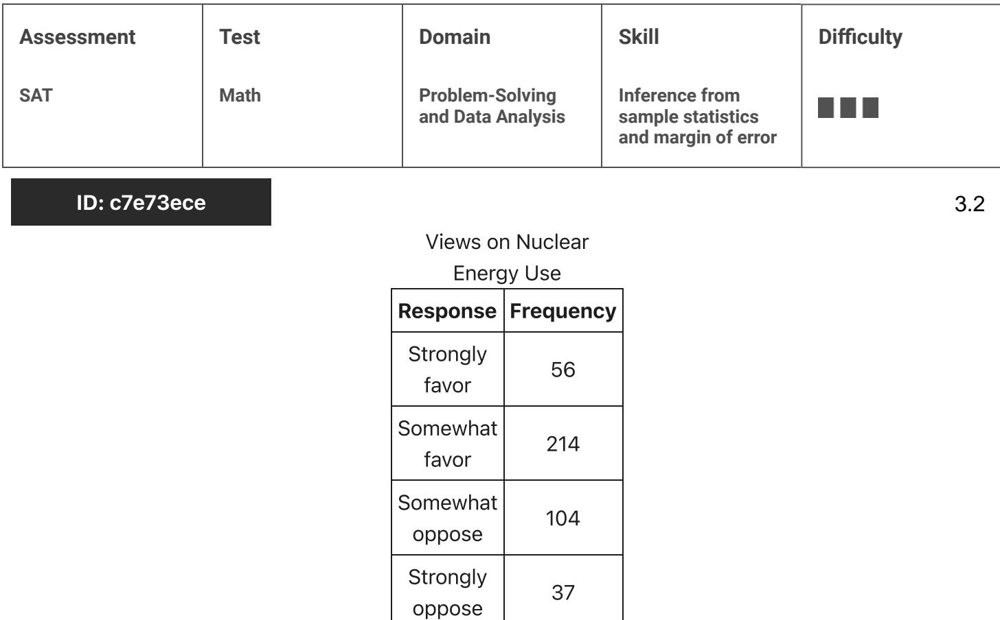

{0}------------------------------------------------

# Question ID 85939da5

| Assessment | Test | Domain                               | Skill                                                      | Difficulty |
|------------|------|--------------------------------------|------------------------------------------------------------|------------|
| SAT        | Math | Problem-Solving and Data Analysis | Inference from sample statistics and margin of error |            |

ID: 85939da5

3.1

| Texting behavior | Talks on cell phone daily | Does not talk on cell phone daily | Total |
|---------------------|---------------------------------|-----------------------------------------|-------|
| Light               | 110                             | 146                                     | 256   |
| Medium              | 139                             | 164                                     | 303   |
| Heavy               | 166                             | 74                                      | 240   |
| Total               | 415                             | 384                                     | 799   |

In a study of cell phone use, 799 randomly selected US teens were asked how often they talked on a cell phone and about their texting behavior. The data are summarized in the table above. Based on the data from the study, an estimate of the percent of US teens who are heavy texters is 30% and the associated margin of error is 3%. Which of the following is a correct statement based on the given margin of error?

A. Approximately 3% of the teens in the study who are classified as heavy texters are not really heavy texters.

B. It is not possible that the percent of all US teens who are heavy texters is less than 27%.

C. The percent of all US teens who are heavy texters is 33%.

D. It is doubtful that the percent of all US teens who are heavy texters is 35%.

ID: 85939da5 Answer

Correct Answer: D

Rationale

Choice D is correct. The qiven marqin of error of 3% indicates that the actual percent of all US teens who are heavy texters is likely within 3% of the estimate of 30%, or between 27% and 33%. Therefore, it is unlikely, or doubtful, that the percent of all US teens who are heavy texters would be 35%.

Choice A is incorrect. The margin of error doesn't provide any information about the accuracy of reporting in the study. Choice B is incorrect. Based on the estimate and qiven marqin of error, it is unlikely that the percent of all US teens who are heavy texters would be less than 27%, but it is possible. Choice C is incorrect. While the percent of all US teens who are heavy texters is likely between 27% and 33%, any value within this interval is equally likely. We can't be certain that the value is exactly 33%.

{1}------------------------------------------------

Question Difficulty: Hard

{2}------------------------------------------------

# Question ID c7e73ece

A researcher interviewed 411 randomly selected US residents and asked about their views on the use of nuclear energy. The table above summarizes the responses of the interviewees. If the United States was 300 million when the survey was given, based on the sample data for the 411 US residents, what is the best estimate, in millions, of the difference between the number of US residents who somewhat favor or strongly favor the use of nuclear energy and the number of those who somewhat oppose it? (Round your answer to the nearest whole number.)

### ID: c7e73ece Answer

#### Rationale

The correct answer is 94. Of those interviewed, 56 + 214 = 270 "strongly favor" or "somewhat favor" the use of nuclear energy, and 104 + 37 = 141 interviewees "somewhat oppose" or "strongly oppose" the use of nuclear energy. The difference between the sizes of the two surveyed groups is 270-141 = 129. The proportion of 129 this difference among the entire group of interviewees is 411 . Because the sample of interviewees was selected at random from US residents, it is reasonable to assume that the proportion of this difference is the same among all US residents as in the sample. Therefore, the best estimate, in millions, of the difference between the number of US residents who somewhat favor or strongly favor the use of nuclear energy and the 129

x300 number of those who somewhat oppose or strongly oppose it is 411 , which to the nearest million is 94.

#### Question Difficulty: Hard

{3}------------------------------------------------

# Question ID 308084c5

| Assessment | Test | Domain                               | Skill                                                      | Difficulty |
|------------|------|--------------------------------------|------------------------------------------------------------|------------|
| SAT        | Math | Problem-Solving and Data Analysis | Inference from sample statistics and margin of error |            |

### ID: 308084c5

|   | Sample   Percent in favor   Margin of error |      |  |
|---|---------------------------------------------|------|--|
| A | 52%                                         | 4.2% |  |
| B | 48%                                         | 1.6% |  |

The results of two random samples of votes for a proposition are shown above. The samples were selected from the same population, and the margins of error were calculated using the same method. Which of the following is the most appropriate reason that the margin of error for sample A is greater than the marqin of error for sample B?

A. Sample A had a smaller number of votes that could not be recorded.

B. Sample A had a higher percent of favorable responses.

- C. Sample A had a larger sample size.
- D. Sample A had a smaller sample size.

### ID: 308084c5 Answer

Correct Answer: D

#### Rationale

Choice D is correct. Sample size is an appropriate reason for the margin of error to change. In general, a smaller sample size increases the margin of error because the sample may be less representative of the whole population.

Choice A is incorrect. The marqin of error will depend on the size of the sample of recorded votes, not the number of votes that could not be recorded. In any case, the smaller number of votes that could not be recorded for sample A would tend to decrease, not increase, the comparative size of the margin of error. Choice B is incorrect. Since the percent in favor for sample A is the same distance from 50% as the percent in favor for sample B, the percent of favorable responses doesn't affect the comparative size of the margin of error for the two samples. Choice C is incorrect. If sample A had a larger margin of error than sample A would tend to be less representative of the population. Therefore, sample A is not likely to have a larger sample size.

Question Difficulty: Hard

3.3

{4}------------------------------------------------

# Question ID 9ba3e283

| Assessment | Test | Domain                               | Skill                                                      | Difficulty |
|------------|------|--------------------------------------|------------------------------------------------------------|------------|
| SAT        | Math | Problem-Solving and Data Analysis | Inference from sample statistics and margin of error |            |

### ID: 9ba3e283

In State X, Mr. Camp's eighth-grade class consisting of 26 students was surveyed and 34.6 percent of the students reported that they had at least two siblings. The average eighth-grade class size in the state is 26. If the students in Mr. Camp's class are representative of students in the state's eighth-arade classes and there are 1,800 eighth-grade classes in the state, which of the following best estimates the number of eighth-grade students in the state who have fewer than two siblings?

A. 16,200

- B. 23,400
- C. 30,600
- D. 46,800

### ID: 9ba3e283 Answer

Correct Answer: C

### Rationale

Choice C is correct. It is given that 34.6% of 26 students in Mr. Camp's class reported that they had at least two siblings. Since 34.6% of 26 is 8.996, there must have been 9 students in the class who reported having at least two siblings and 17 students who reported that they had fewer than two siblings. It is also given that the average eighth-grade class size in the state is 26 and that Mr. Camp's class is representative of all eighth-grade classes in the state. This means that in each eighth-grade class in the state there are about 17 students who have fewer than two siblings. The best estimate of the number of eighth-grade students in the state who have fewer than two siblings is 17 × (number of eighth-grade classes in the state), or 17 × 1,800 = 30,600.

Choice A is incorrect because 16,200 is the best estimate for the number of eighth-qrade students in the state who have at least, not fewer than, two siblings. Choice B is incorrect because 23,400 is half of the estimated total number of eighth-grade students in the state; however, since the students in Mr. Camp's class are representative of students in the eighth-grade classes in the state and more than half of the students in Mr. Camp's class have fewer than two siblings, more than half of the students in each eighth-grade class in the state have fewer than two siblings, too. Choice D is incorrect because 46,800 is the estimated total number of eighth-grade students in the state.

Question Difficulty: Hard

3.4