{0}------------------------------------------------

## Question ID 82aaa0a1

| Assessment | Test | Domain                               | Skill                                            | Difficulty |
|------------|------|--------------------------------------|--------------------------------------------------|------------|
| SAT        | Math | Problem-Solving and Data Analysis | Two-variable data: Models and scatterplots |            |

1.1

Of the following, which is the best model for the data in the scatterplot?

$$\mathbb{A} \cdot \mathbb{Y} = \mathbb{Z}x^2 - \mathbb{1}\mathbb{1}x - \mathbb{Z}0$$

- B. y = 2x2-11x +20

$$\text{C. } \chi = 2x^2 - 5\chi - 3\chi$$

- D. y = 2x2-5x+3
### ID: 82aaa0a1 Answer

Correct Answer: B

## Rationale

Choice B is correct. The graphical model that most closely fits the data in the scatterplot is a model in which the number of data points above and below the model are approximately balanced. Fitting a graphical model to the data shown results in an upward-facing parabola with a y-intercept near (0,20) and a vertex with an

approximate x-value of 2.5. Of the given choices, only choice B gives an equation of an upward-facing parabola with a y-intercept at (0,20). Furthermore, substituting 2.5 for x into the equation in choice B yields y =5. This is approximately the y-value of the vertex of the model.

Choices A, C, and D are incorrect. These equations don't give a graphical model that best fits the data. At X = 0, they have y-values of – 20, – 3, and 3, respectively. At x = 2,5, they have y-values of – 3, and 3, respectively.

{1}------------------------------------------------

# Question ID 83272c51

## ID: 83272c51

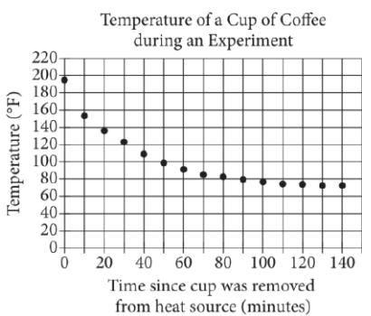

In an experiment, a heated cup of coffee is removed from a heat source, and the cup of coffee is then left in a room that is kept at a constant temperature. The graph above shows the temperature, in degrees Fahrenheit (°F), of the coffee immediately after being removed from the heat source and at 10-minute intervals thereafter. During which of the following 10-minute intervals does the temperature of the coffee decrease at the greatest average rate?

#### A. Between 0 and 10 minutes

- B. Between 30 and 40 minutes
- C. Between 50 and 60 minutes
- D. Between 90 and 100 minutes

### ID: 83272c51 Answer

Correct Answer: A

Rationale

Choice A is correct. The average rate of change in temperature of the coffee in degrees Fahrenheit per minute is calculated by dividing the difference between two recorded temperatures by the number of minutes in the corresponding interval of time. Since the time intervals given are all 10 minutes, the average rate of change is greatest for the points with the greatest difference in temperature. Of the choices, the greatest difference in temperature occurs between 0 and 10 minutes.

Choices B, C, and D are incorrect and may result from misinterpreting the average rate of change from the graph.

Question Difficulty: Easy

{2}------------------------------------------------

# Question ID ac5b6558

| Assessment | Test | Domain                               | Skill                                            | Difficulty |
|------------|------|--------------------------------------|--------------------------------------------------|------------|
| SAT        | Math | Problem-Solving and Data Analysis | Two-variable data: Models and scatterplots |            |

## ID: ac5b6558

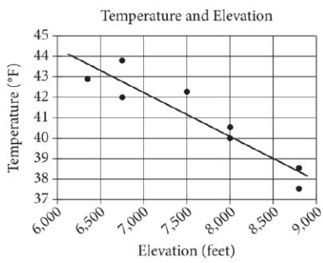

The scatterplot above shows the high temperature on a certain day and the elevation of 8 different locations in the Lake Tahoe Basin. A line of best fit for the data is also shown. What temperature is predicted by the line of best fit for a location in the Lake Tahoe Basin with an elevation of 8,500 feet?

A. 37°F

B. 39°F

C. 41°F

D. 43°F

## ID: ac5b6558 Answer

Correct Answer: B

### Rationale

Choice B is correct. The line of best fit passes through the point (8,500, 39). Therefore, the line of best fit predicts a temperature of 39°F for a location in Lake Tahoe Basin with an elevation of 8,500 feet.

Choice A is incorrect. This is the lowest temperature listed on the scatterplot, and the line of best fit never crosses this value for any of the elevations shown. Choice C is incorrect. According to the line of best fit, the temperature of 41°F is predicted for an elevation of slightly greater than 7,500 feet, not an elevation of 8,500 feet. Choice D is incorrect. According to the line of best fit, the temperature of 43°F is predicted for an elevation of roughly 6,700 feet, not an elevation of 8,500 feet.

Question Difficulty: Easy

{3}------------------------------------------------

# Question ID 74dee52b

2002

2000

2004

Graduating class year

2006

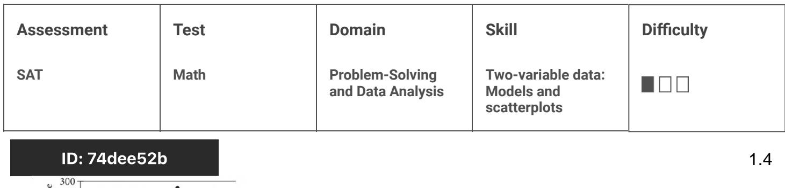

The line graph shows the number of graduates from the classes of 2001 through 2007 at a certain school who enrolled in college within 24 months of graduation. Of the following, which class had the fewest graduates who enrolled in college within 24 months of graduation?

2008

- A. 2002
mber of graduat
enrolled in colle 200 150 100 50

- B. 2004
- C. 2005
- D. 2007

### ID: 74dee52b Answer

Correct Answer: A

Rationale

Choice A is correct. The year with the fewest graduates who enrolled in college within 24 months of graduation is the point with the lowest value on the vertical axis. This occurs at 2002.

Choice B, C, and D are incorrect. The years 2004, 2005, and 2007 each had a greater number of graduates who enrolled in college within 24 months of graduation than did the year 2002.

Question Difficulty: Easy

{4}------------------------------------------------

# Question ID 9d88a3e3

| Assessment | Test | Domain                               | Skill                                            | Difficulty |
|------------|------|--------------------------------------|--------------------------------------------------|------------|
| SAT        | Math | Problem-Solving and Data Analysis | Two-variable data: Models and scatterplots |            |

## ID: 9d88a3e3

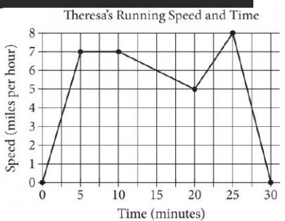

Theresa ran on a treadmill for thirty minutes, and her time and speed are shown on the graph above. According to the graph, which of the following statements is NOT true concerning Theresa's run?

A. Theresa ran at a constant speed for five minutes.

B. Theresa's speed was increasing for a longer period of time than it was decreasing.

- C. Theresa's speed decreased at a constant rate during the last five minutes.
- D. Theresa's speed reached its maximum during the last ten minutes.

### ID: 9d88a3e3 Answer

Correct Answer: B

Rationale

Choice B is correct. Theresa's speed was increasing from 0 to 5 minutes and from 20 to 25 minutes, which is a total of 10 minutes. Theresa's speed was decreasing from 10 minutes and from 25 to 30 minutes, which is a total of 15 minutes. Theresa's speed was NOT increasing for a longer period of time than it was decreasing.

Choice A is incorrect. Theresa ran at a constant speed for the 5-minute period from 5 to 10 minutes. Choice C is incorrect. Theresa's speed decreased at a constant rate during the last 5 minutes, which can be seen since the graph is linear during that time. Choice D is incorrect. Theresa's speed reached its maximum at 25 minutes, which is within the last 10 minutes.

Question Difficulty: Easy

{5}------------------------------------------------

# Question ID c9dd92b1

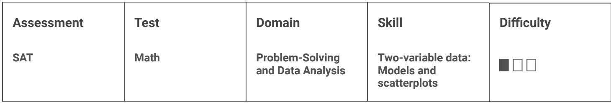

## ID: c9dd92b1

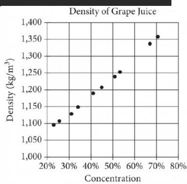

The densities of different concentrations of grape juice are shown in the scatterplot above. According to the trend shown by the data, which of the following is closest to the predicted density, in kilograms per cubic meter (kg/m ), for grape juice with a concentration of 60%?

A. 1,200

B. 1,250

C. 1,300

D. 1,350

### ID: c9dd92b1 Answer

Correct Answer: C

Rationale

Choice C is correct. The data in the scatterplot show an increasing linear trend. The density when the juice concentration is 60% will be between the densities shown at about 53% and 67% concentration, or between about 1,255 and 1,340 kg/m . Of the choices given, only 1,300 falls within this range.

Choices A, B, and D are incorrect. These are the approximate densities of grape juice with a concentration of 45%, 55%, and 70%, respectively.

Question Difficulty: Easy

{6}------------------------------------------------

# Question ID a6b2fcce

| Assessment | Test | Domain                               | Skill                                            | Difficulty |
|------------|------|--------------------------------------|--------------------------------------------------|------------|
| SAT        | Math | Problem-Solving and Data Analysis | Two-variable data: Models and scatterplots |            |

## ID: a6b2fcce

According to the line graph above, between which two consecutive years was there the greatest change in the number of 3-D movies released?

- A. 2003-2004
- B. 2008-2009
- C. 2009-2010
- D. 2010-2011

### ID: a6b2fcce Answer

Correct Answer: D

### Rationale

Choice D is correct. The change in the number of 3-D movies released between any two consecutive years can be found by first estimating the number of 3-D movies released for each of the two years and then finding the positive difference between these two estimates. Between 2003 and 2004, this change is approximately 2 – 2 = 0 movies; between 2008 and 2009; this change is approximately 20 – 8 = 12 movies; between 2009 and 2010, this change is approximately 26–20 = 6 movies; and between 2010 and 2011, this change is approximately 46 – 26 = 20 movies. Therefore, of the pairs of consecutive years in the choices, the greatest increase in the number of 3-D movies released occurred during the time period between 2010 and 2011.

Choices A, B, and C are incorrect. Between 2010 and 2011, approximately 20 more 3-D movies were released. The change in the number of 3-D movies released between any of the other pairs of consecutive years is significantly smaller than 20.

Question Difficulty: Easy

{7}------------------------------------------------

# Question ID 9296553d

| Assessment | Test | Domain                               | Skill                                            | Difficulty |
|------------|------|--------------------------------------|--------------------------------------------------|------------|
| SAT        | Math | Problem-Solving and Data Analysis | Two-variable data: Models and scatterplots |            |

## ID: 9296553d

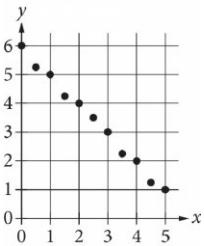

Which of the following could be an equation for a line of best fit for the data in the scatterplot?

A.y = - x + 6

B.y = - x - 6

C. y = 6x + 1

D. y = 6x - 1

## ID: 9296553d Answer

Correct Answer: A

### Rationale

Choice A is correct. A line of best fit for the data in a scatterplot is a line that follows the trend of the data with approximately half the data points above and half the data points below the line. Based on the given data, a line of best fit will have a positive y-intercept on or near the point (0,6) and a negative slope. All of the choices are in slope-intercept form y = mx + b, where m is the y-coordinate of the y-coordinate of the y-intercept. Only choice A is an equation of a line with a positive y-intercept at (0,6) and a negative slope, — 1.

Choice B is incorrect. This equation is for a line that has a negative y-intercept, not a positive y-intercept. Choices C and D are incorrect and may result from one or more sign errors and from switching the values of the y-intercept and the slope in the equation.

Question Difficulty: Easy
{8}------------------------------------------------

# Question ID d6121490

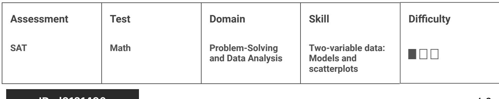

### ID: d6121490

The graph above shows the relationship between the speed of a particular car, in miles per hour, and its corresponding braking distance, in feet. Approximately how many feet greater will the car's braking distance be when the car is traveling at 50 miles per hour than when the car is traveling at 30 miles per hour?

A. 75

B. 125

C. 175

D. 250

#### ID: d6121490 Answer

Correct Answer: B

#### Rationale

Choice B is correct. According to the graph, when the car is traveling at 50 miles per hour, the braking distance is approximately 225 feet, and when the car is traveling at 30 miles per hour, the braking distance is approximately 100 feet. The difference between these braking distances is 225 - 100, or 125 feet.

Choice A is incorrect and may result from finding the braking distance for 20 miles per hour, the difference between the qiven speeds. Choice C is incorrect and may result from subtracting the speed from the braking distance at 50 miles per hour. Choice D is incorrect and may result from finding the difference in the braking distances at 60 and 20 miles per hour.

Question Difficulty: Easy

1.9

{9}------------------------------------------------

# Question ID 8156d446

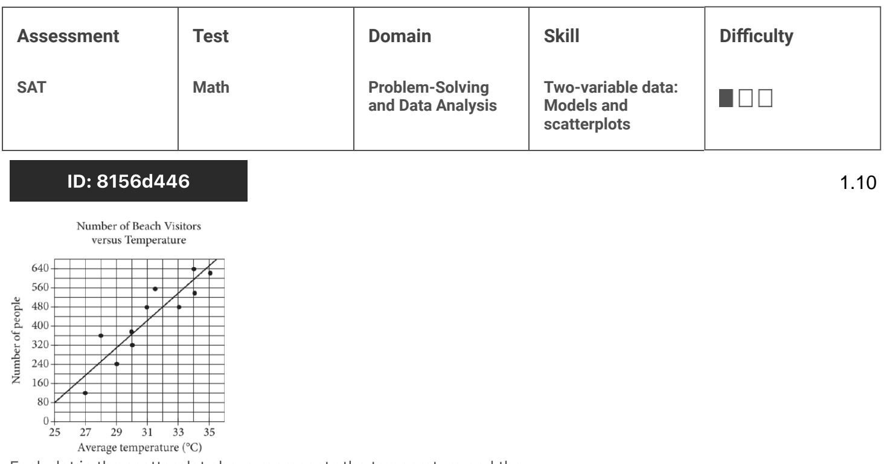

Each dot in the scatterplot above represents the temperature and the number of people who visited a beach in Lagos, Nigeria, on one of eleven different days. The line of best fit for the data is also shown. According to the line of best fit, what is the number of people, rounded to the nearest 10, predicted to visit this beach on a day with an average temperature of 32°C?

### ID: 8156d446 Answer

#### Rationale

The correct answer is 480. An average temperature of 32°C corresponds to the value 32 on the x-axis. On the

line of best fit, an x-value of 32 corresponds to a y-value of 480. The values on the y-axis correspond to the number of people predicted to visit this beach. Therefore, 480 people are predicted to visit this beach on a day with an average temperature of 32°C.

Question Difficulty: Easy

{10}------------------------------------------------

## Question ID d112bc9d

| Assessment | Test | Domain                               | Skill                                            | Difficulty |
|------------|------|--------------------------------------|--------------------------------------------------|------------|
| SAT        | Math | Problem-Solving and Data Analysis | Two-variable data: Models and scatterplots |            |

### ID: d112bc9d

1.11

The scatterplot shows the temperature y, in "F, recorded by a meteorologist at various times ഈ in days since June 1.

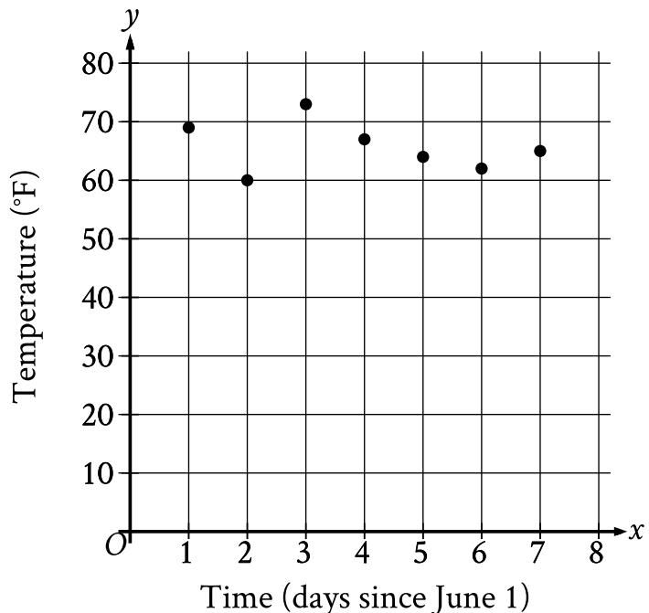

During which of the following time periods did the greatest increase in recorded temperature take place?

A. From x = 6 to x = 7

- B. From x = 5 to x = 6
- C. From x = 2 to x = 3
- D. From x = 1 to x = 2

#### ID: d112bc9d Answer

Correct Answer: C

Rationale

Choice C is correct. The scatterplot shows that there was an increase in recorded temperature from x = 2 to x = 3 and from x = 6 to x = 7. When x = 2, the recorded temperature was approximately 60 °F and when x = 3, the recorded temperature was greater than 70 °F. This means that the increase in recorded temperature from x = 2 to x = 3 was greater than (70 - 60) F, or 10 F. When x = 6, the recorded temperature was greater than 60 °F and when x = 7, the recorded temperature was less than 70 °F. This

{11}------------------------------------------------

means that the increase in recorded temperature from x = 6 to x = 7 was less than (70 = 60) °F, or 10 °F. It follows that the greatest increase in recorded temperature took place from x = 2 to x = 3.

Choice A is incorrect. The increase in recorded temperature from x = 6 to x = 7 was less than the increase in recorded temperature from x = 2 to x = 3.

Choice B is incorrect. From x = 5 to x = 6, a decrease, not an increase, in recorded temperature took place.

Choice D is incorrect. From x = 1 to x = 2, a decrease, not an increase, in recorded temperature took place.

Question Difficulty: Easy

{12}------------------------------------------------

# Question ID 5c24c861

| Assessment | Test | Domain                               | Skill                                            | Difficulty |
|------------|------|--------------------------------------|--------------------------------------------------|------------|
| SAT        | Math | Problem-Solving and Data Analysis | Two-variable data: Models and scatterplots |            |

### ID: 5c24c861

1.12

A study was done to determine a new car's stopping distance when it was traveling at different speeds. The study was done on a dry road with good surface conditions. The results are shown below, along with the graph of a quadratic function that models the data.

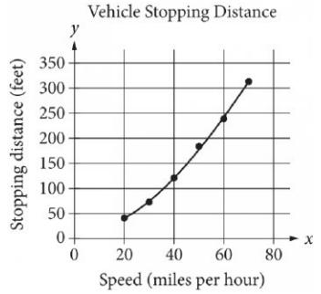

According to the model, which of the following is the best estimate for the stopping distance, in feet, if the vehicle was traveling 55 miles per hour?

A. 25

B. 30

C. 210

D. 250

#### ID: 5c24c861 Answer

Correct Answer: C

#### Rationale

Correct Answer Rationale

Choice C is correct. According to the model, the stopping distance, in feet, of a vehicle traveling 55 miles per hour is about 200 feet. Of the choices given, the best estimate of the stopping distance for a car traveling 55 miles per hour is 210 feet.

#### Incorrect Answer Rationale

Choices A, B, and D are incorrect and may be the result of incorrectly reading the given quadratic model. The corresponding x-values to the y-values of 25 and 30 are not part of the model. The corresponding x-value to a y-value of 250 is approximately 60 mph, not 55 mph.

Question Difficulty: Easy

{13}------------------------------------------------

# Question ID 661dfddd

| Assessment | Test | Domain                               | Skill                                            | Difficulty |
|------------|------|--------------------------------------|--------------------------------------------------|------------|
| SAT        | Math | Problem-Solving and Data Analysis | Two-variable data: Models and scatterplots |            |

### ID: 661dfdddd

The scatterplot above shows the high temperature on a certain day and the elevation of 8 different locations in the Lake Tahoe Basin. A line of best fit for the data is also shown. Which of the following statements best describes the association between the elevation and the temperature of locations in the Lake Tahoe Basin?

A. As the elevation increases, the temperature tends to increase.

B. As the elevation increases, the temperature tends to decrease.

- C. As the elevation decreases, the temperature tends to decrease.
- D. There is no association between the elevation and the temperature.

#### ID: 661dfddd Answer

Correct Answer: B

Rationale

Choice B is correct. The association between the elevation and the temperature of locations in the Lake Tahoe Basin can be described by looking at the direction of the line of best fit. The line of best fit slopes downward, which corresponds to the temperature decreasing as the elevation increases.

Choices A and C are incorrect. Both of these choices would be represented by a line of best fit that slopes from the lower left to the upper right of the graph, which isn't what's shown on the graph. Choice D is incorrect. This choice would be represented by a line of best fit that is horizontal or has a slope very close to 0. This is not what's shown on the graph.

Question Difficulty: Easy

1.13

{14}------------------------------------------------

# Question ID cf0ae57a

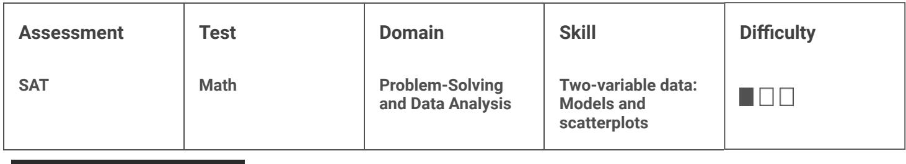

### ID: cf0ae57a

The scatterplot above shows the densities of 7 planetoids, in grams per cubic centimeter, with respect to their average distances from the Sun in astronomical units (AU). The line of best fit is also shown. An astronomer has discovered a new planetoid about 1.2 AU from the Sun. According to the line of best fit, which of the following best approximates the density of the planetoid, in grams per cubic centimeter?

A. 3.6

B. 4.1

C. 4.6

D. 5.5

#### ID: cf0ae57a Answer

Correct Answer: C

Rationale

Choice C is correct. According to the line of best fit, a planetoid with a distance from the Sun of 1.2 AU has a predicted density between 4.5 g/cm² and 4.75 g/cm³. The only choice in this range is 4.6.

Choices A, B, and D are incorrect and may result from misreading the information in the scatterplot.

Question Difficulty: Easy

1.14

{15}------------------------------------------------

# Question ID ae32cc3c

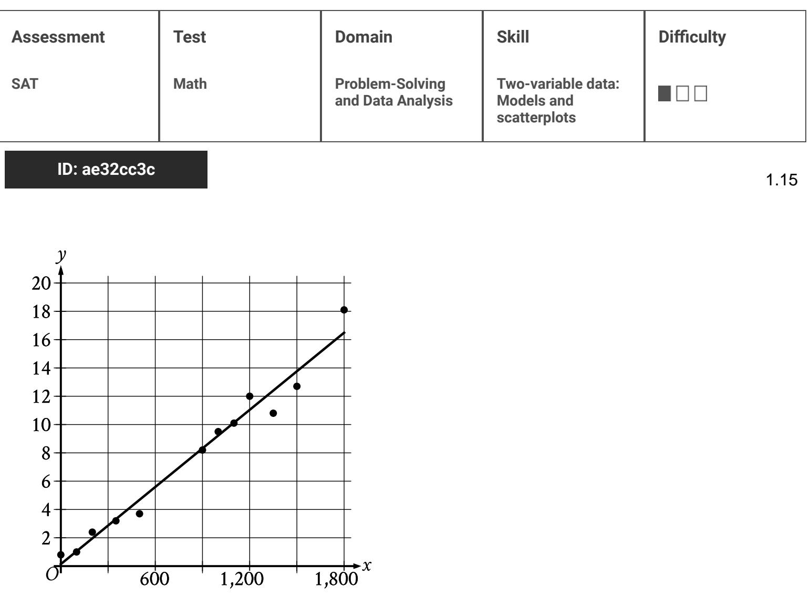

Twelve data points are shown in the scatterplot. A line of best fit for the data is also shown. At x = 1,200, which of the following is closest to the y-value predicted by the line of best fit?

A. 16

O

B. 14

- C. 11
- D. 6

### ID: ae32cc3c Answer

600

1,200

Correct Answer: C
{16}------------------------------------------------

#### Rationale

Choice C is correct. On the line of best fit, an x-value of 1,200 corresponds to a y-value between 10 and 12. Therefore, of the given choices, 11 is closest to the y-value predicted by the line of best fit at x = 1,200.

Choice A is incorrect. This is the integer value closest to the y-value predicted by the line of best fit at x = 1,800.

Choice B is incorrect. This is the integer value closest to the y-value predicted by the line of best fit at x = 1,500.

Choice D is incorrect. This is the integer value closest to the y-value predicted by the line of best fit at x = 600.

{17}------------------------------------------------

# Question ID 8d63b6f1

| Assessment            | Test | Domain                               | Skill                                            | Difficulty |  |
|-----------------------|------|--------------------------------------|--------------------------------------------------|------------|--|
| SAT                   | Math | Problem-Solving and Data Analysis | Two-variable data: Models and scatterplots |            |  |
| ID: 8d63b6f1 A A C |      |                                      |                                                  |            |  |

1.16

 The scatterplot shows the relationship between the weight, in pounds, of each of 9 female gray wolves on April 30 and the number of offspring each gray wolf produced.

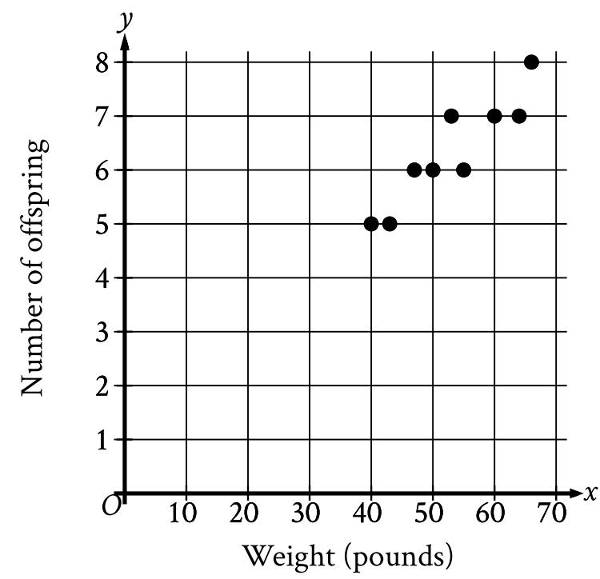

How many offspring did the 50-pound gray wolf produce?

A. 8

B. 7

- C. 6
- D. 5

### ID: 8d63b6f1 Answer

Correct Answer: C

{18}------------------------------------------------

#### Rationale

Choice C is correct. For each point on the x-value represents the weight, in pounds, of a female gray wolf and the y-value represents the number of offspring that wolf produced. The point on the graph with an x-value of 50 has a y-value of 6. Therefore, the 50-pound gray wolf produced 6 offspring.

Choice A is incorrect. One of the wolves produced 8 offspring, but its weight was greater than 50 pounds.

Choice B is incorrect. Three of the wolves produced 7 offspring each, but their weights were each greater than 50 pounds.

Choice D is incorrect. Two of the wolves produced 5 offspring each, but their weights were each less than 50 pounds.

{19}------------------------------------------------

# Question ID a03b7e02

| Assessment | Test | Domain                               | Skill                                            | Difficulty |
|------------|------|--------------------------------------|--------------------------------------------------|------------|
| SAT        | Math | Problem-Solving and Data Analysis | Two-variable data: Models and scatterplots |            |

## ID: a03b7e02

1.17

The table shows selected values from function f.

| IC | f (x) |  |
|----|-------|--|
| 1  | 16    |  |
| 0  | 17    |  |
| 1  | 18    |  |
| 2  | 19    |  |

Which of the following is the best description of function f?

- A. Decreasing linear
- B. Increasing linear
- C. Decreasing exponential
- D. Increasing exponential

### ID: a03b7e02 Answer

#### Correct Answer: B

#### Rationale

Choice B is correct. The given values show that as x increases, which means that f is an increasing function. Furthermore, f x increases at a constant rate of 1 for each increase of x by 1. A function with a constant rate of change is linear. Thus, the function f can be described as an increasing linear function.

Choice A is incorrect. For a decreasing linear function, as x increases rather than increases.

Choice C is incorrect. For a decreasing exponential function, for each increase of x by 1, f x decreases by a fixed percentage rather than increases at a constant rate.

Choice D is incorrect. For an increasing exponential function, for each increase by a fixed percentage rather than at a constant rate.

{20}------------------------------------------------

# Question ID b58dbf88

| Assessment | Test | Domain                               | Skill                                            | Difficulty |
|------------|------|--------------------------------------|--------------------------------------------------|------------|
| SAT        | Math | Problem-Solving and Data Analysis | Two-variable data: Models and scatterplots |            |

ID: b58dbf88

1.18

An orchard owner recorded the weight, in pounds, of all nectarines that grew on a dwarf nectarine tree during each growing season after the tree's transplantation. The scatterplot shows this weight, in pounds, for each growing season after the tree's transplantation.

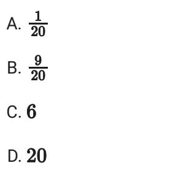

What was the weight, to the nearest pound, of all nectarines that grew on the tree during the 4th growing season after the tree's transplantation?

### ID: b58dbf88 Answer

#### Correct Answer: 40

### Rationale

The correct answer is 40. For each data point on the scatterplot, the x-value represents the growing season after transplantation and the y-value represents the weight, in pounds, of all nectarines that grew on the season. The scatterplot shows a data point at 4, 40. It follows that during the 4th growing season after the tree's transplantation, 40 pounds of nectarines grew on the tree.

{21}------------------------------------------------

# Question ID 15ce8207

| Two-variable data: SAT Problem-Solving Math and Data Analysis Models and scatterplots | Assessment | Test | Domain | Skill | Difficulty |
|---------------------------------------------------------------------------------------------------------|------------|------|--------|-------|------------|
|                                                                                                         |            |      |        |       |            |

ID: 15ce8207

1.19

The scatterplot shows the relationship between two variables, x and y

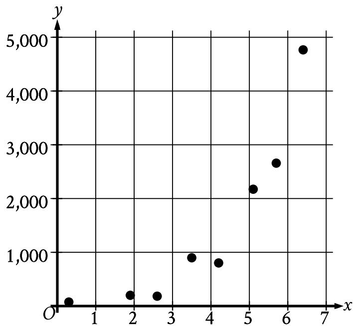

Which of the following graphs shows the most appropriate model for the data?

A.

{22}------------------------------------------------

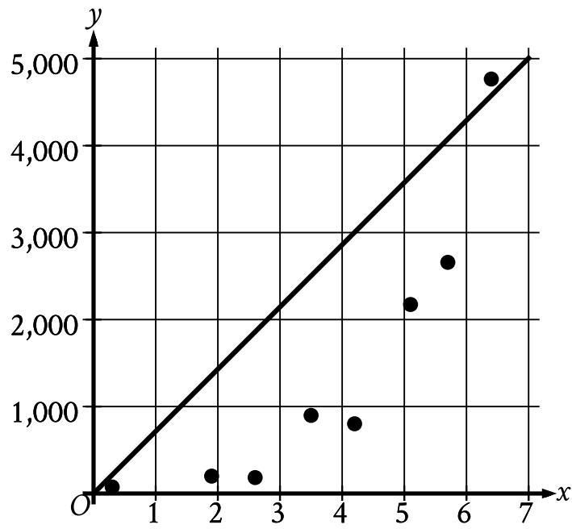

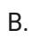

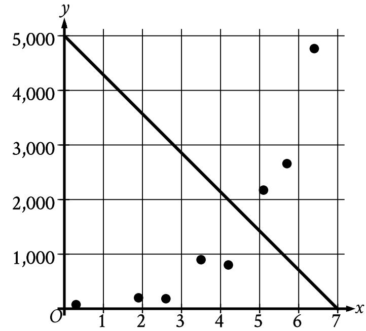

C.