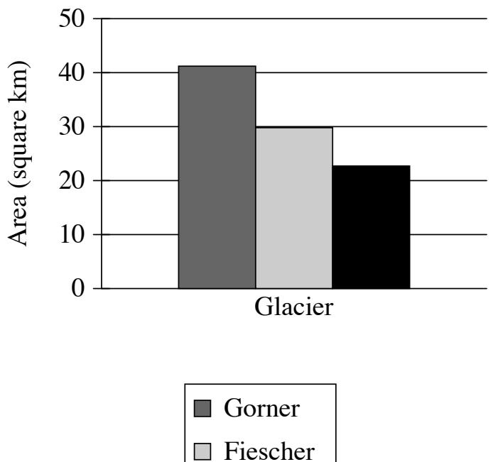

{0}------------------------------------------------

# Question ID 85439572

| Assessment | Test                | Domain                   | Skill                  | Difficulty |
|------------|---------------------|--------------------------|------------------------|------------|
| SAT        | Reading and Writing | Information and Ideas | Command of Evidence |            |

### ID: 85439572

1.1

Roasted green chiles are a popular in Southwestern cuisine, but the traditional roasting method of burning propane is not environmentally friendly. To see if solar power could provide a better alternative, engineer Kenneth Armijo and his team roasted batches of green chiles using between 38 and 42 heliostats, which are devices that concentrate sunlight. The team was successful in reaching temperature used in traditional propane roasting, but they found that propane yielded faster results. While the fasted green chiles took six minutes, batches using propane took only four. Armijo hypothesizes that they can reduce the roasting time for solar-roasted green chiles by using more heliostats.

Which finding, if true, would most directly support Armijo's hypothesis?

- A. The temperature inside the roasting drum is distributed more evenly when roasting green chiles with solar power than with propane.
- B. Attempts to roast green chiles using 50 heliostats yields results in fewer than six minutes.
- C. Green chile connoisseurs prefer the flavor of solar-roasted green chiles over the flavor of propane-roasted green chiles.
- D. The skins of solar-roasted green chiles are easier to peel than the skins of propane-roasted green chiles.

#### ID: 85439572 Answer

Correct Answer: B

Rationale

Choice B is the best answer. Armijo believes that using more heliostats will speed up the roasting process, and this finding shows that with 50 heliostats-more than the number of heliostats already used-the roasting time is indeed reduced.

Choice A is incorrect. The evenness of temperature in the roasting drum doesn't tell us about the speed of the roasting process, which is what Armijo's hypothesis is concerned with. Choice C is incorrect. Armijo's hypothesis is focused on the speed of the roasting process, not the resulting roasted chiles. Choice D is incorrect. Though Armijo's hypothesis mentions a benefit of solar-roasting green chiles (easier peeling), it doesn't address the speed of the roasting process.

{1}------------------------------------------------

## Question ID a9040290

| Assessment | Test                | Domain                   | Skill                  | Difficulty |
|------------|---------------------|--------------------------|------------------------|------------|
| SAT        | Reading and Writing | Information and ldeas | Command of Evidence |            |

### ID: a9040290

Electric companies that use wind turbines rely on weather forecasts to predict the maximum amount of power, in megawatt-hours (MWh), they can generate using wind so that they can determine how much they'll need to generate from other sources. When winds are stronger than they were forecast to be, however, the predicted maximum amount of electricity wind turbines could generate will be too low. For example, the graph shows that for the West region, the winds were __

Which choice most effectively uses data from the graph to complete the example?

- A. strong enough to generate about 150 thousand more MWh of electricity from wind turbines.
- B. so weak that the electricity from wind turbines was about 175 thousand MWh less than predicted.
- C. so weak that the electricity from wind turbines was about 150 thousand MWh less than predicted.
- D. strong enough to generate about 175 thousand more MWh of electricity from wind turbines.

#### ID: a9040290 Answer

Correct Answer: A

Rationale

Choice A is the best answer. The claim is that when winds are stronger than forecasted, wind turbines can generate more energy than predicted. The supporting graph shows the additional amount (above the predicted

1.2

{2}------------------------------------------------

amount) that the turbines generated under those conditions, with the West generating about 150 thousand additional MWh.

Choice B is incorrect. This choice doesn't complete the example. The graph shows the additional amount of electricity that the wind turbines generated. The West bar is greater than 0, so the West generated more than the predicted amount. Choice C is incorrect. This choice doesn't complete the example. The graph shows the additional amount of electricity that the wind turbines generated. The West bar is greater than 0, so the West generated more than the predicted amount. Choice D is incorrect. This choice misreads the graph. The graph shows us that the West (the bar on the left) generated about 150 thousand additional MWh.

{3}------------------------------------------------

# Question ID f452410b

| Assessment | Test                | Domain                   | Skill                  | Difficulty |
|------------|---------------------|--------------------------|------------------------|------------|
| SAT        | Reading and Writing | Information and Ideas | Command of Evidence |            |

ID: f452410b

### Results of Footprint Analysis for Two Sets of Theropod Tracks

| Tracks         | Estimated footprint length (centimeters) | Average stride length (meters) | Estimated mean speed (meters per second) |
|----------------|---------------------------------------------|-----------------------------------|---------------------------------------------|
| La Torre 6A | 32.8                                        | 5.23                              | 6.5–10.3                                    |
| La Torre GB | 28.9                                        | 5.57                              | 8.8–12.4                                    |

The table shows data from paleontologist Angélica Torices and colleagues' 2021 study of two sets of dinosaur tracks preserved in a fossilized lake bed in Spain. The tracks, referred to as La Torre 6B, were left by two individual theropods (dinosaurs that walked on two legs). The team's findings suggest that of the two theropods, the one that left the La Torre 6B tracks had a higher maximum mean speed, ________________________________________________________________________________________

Which choice most effectively uses data from the table to complete the claim?

- A. a longer footprint, and a longer average stride.
- B. a longer footprint, and a shorter average stride.
- C. a shorter footprint, and a longer average stride.
- D. a shorter footprint, and a shorter average stride.

## ID: f452410b Answer

Correct Answer: C

### Rationale

Choice C is the best answer because it most effectively uses data from the table to complete the claim about the tracks left by two therapods. The table indicates that the set of tracks labeled La Torre 6A has an estimated footprint length of 32.8 centimeters, an average stride length of 5.23 meters, and an estimated mean speed of 6.5-10.3 meters per second. For the set of tracks labeled La Torre 6B, on the other hand, the estimated footprint length is 28.9 centimeters, the average stride length is 5.57 meters, and the estimated mean speed is 8.8–12.4 meters per second. Therefore, the therapod that left the La Torre 6B tracks had a shorter footprint and a longer average stride than the one that left the La Torre 6A tracks.

Choice A is incorrect. While it is true that of the two therapods, the one that left the La Torre 6B tracks had a longer average stride, it didn't have a longer footprint: the table shows that its estimated footprint length is 28.9 centimeters, while La Torre 6A's estimated footprint length is 32.8 centimeters. Choice B is incorrect because the table shows that of the two therapods, the one that left the La Torre 6B tracks had a footprint length estimated at 28.9 centimeters, which is shorter than the 32.8 centimeters estimated for the other set of

1.3

{4}------------------------------------------------

tracks. Moreover, the therapod that left the La Torre 6B tracks had a longer average stride, not shorter: 5.57 meters, compared with 5.23 meters for the other set of tracks. Choice D is incorrect. While it is true that of the two therapods, the one that left the La Torre 6B tracks had a shorter footprint, it didn't have a shorter average stride: the table shows that its average stride length is 5.57 meters, while La Torre 6A's average stride length is 5.23 meters.

{5}------------------------------------------------

## Question ID 9debe79a

| Reading and Writing Information and Command of SAT ldeas Evidence | Assessment | Test | Domain | Skill | Difficulty |
|----------------------------------------------------------------------------------|------------|------|--------|-------|------------|
|                                                                                  |            |      |        |       |            |

ID: 9debe79a

Average Temperatures in July in Four Locations in the Navajo Nation

| Location        | Average highest temperature (Fahrenheit) | Average lowest temperature (Fahrenheit) |
|-----------------|---------------------------------------------|--------------------------------------------|
| Teec Nos Pos | ರಿಗೊ                                        | 65°                                        |
| Cameron         | ට විට                                       | 65°                                        |
| Ramah           | 83°                                         | 50°                                        |
| Tuba City       | 83°                                         | 50°                                        |

The Navajo Nation has the largest land area of any tribal nation in the United States: over 27,000 square miles in the Southwest. Because this area is so huge and its communities are located at various elevations, the people of the Navajo Nation can experience different climate conditions depending on where they live. For example, in July,

Which choice most effectively uses data from the table to complete the statement?

- A. the lowest temperature for both Cameron and Teec Nos Pos was 65°.
- B. Tuba City's average highest temperature was 94°, while Teec Nos Pos's was 93°.
- C. Ramah's average highest temperature was 83°, while Cameron's was 99°.
- D. the lowest temperature for both Ramah and Tuba City was 50°.

### ID: 9debe79a Answer

Correct Answer: C

Rationale

Choice C is the best answer because it effectively uses data from the table to complete the statement, providing an example of how the people of the Navajo Nation can experience different climate conditions depending on where they live. The table shows the average highest temperatures and average lowest temperatures in four locations in the Navajo Nation in July. According to the table, Ramah's average highest temperature for July was 83°, whereas Cameron's average highest temperature was much higher, at 99°. This difference illustrates the statement that the people of the Navajo Nation can experience different climate conditions depending on where they live.

Choice A is incorrect because it states that Cameron and Teec Nos Pos had the same average lowest temperature (65°) for July, which suggests a similarity in climate conditions in those locations rather than a difference. Choice B is incorrect because it misrepresents the data from the table, which shows that the

1.4

{6}------------------------------------------------

average highest temperature in July for Tuba City was 83°, not 94°, and for Teec Nos Pos it was 94°, not 93°. Even if the cited data accurately reflected the data in the table, the similarity between the two values for average highest temperature would suggest that people in the two locations likely experience similar climate conditions, not different climate conditions. Choice D is incorrect because it states that Ramah and Tuba City had the same average lowest temperature (50°) for July, which suggests a similarity in climate conditions in those locations rather than a difference.

{7}------------------------------------------------

# Question ID e7dc27dc

| Assessment | Test                | Domain                   | Skill                  | Difficulty |
|------------|---------------------|--------------------------|------------------------|------------|
| SAT        | Reading and Writing | Information and ldeas | Command of Evidence |            |

### ID: e7dc27dc

1.5

As a monthly newsletter formed in 1969 by a group of Asian American students at the University of California, Los Angeles, Gidra helped raise awareness about social and political issues concerning the Asian American community on campus and at large. The newsletter had an expansive reach for a publication of its kind: around 4,000 copies were published each month. A student writing a history paper, hypothesizes that Gidra's influence cannot be measured by the number of newsletters published monthly alone.

Which finding, if true, would most directly support the student's hypothesis?

A. The students who initially formed Gidra each contributed financially to its creation.

- B. In addition to covering current events, Gidra also featured works of art and literature.
- C. Gidra was initially based out of the Asian American Studies Center at UCLA.
- D. People would often give their copies of Gidra to others once they had finished reading an issue.

## ID: e7dc27dc Answer

Correct Answer: D

Rationale

Choice D is the best answer. If there were more Gidra readers than there were copies of the newsletter, then the newsletter's influence would be much greater than its 4,000 monthly copies.

Choice A is incorrect. Information about the newsletter's initial funding doesn't tell us about the influence that the newsletter eventually had. Choice B is incorrect. While the content of Gidra was undoubtedly related to the newsletter's influence, this information isn't relevant to the specific hypothesis about monthly circulation numbers. Choice C is incorrect. Where the publishers of Gidra were initially based doesn't tell us about the newsletter's overall influence.

{8}------------------------------------------------

## Question ID 30c3aa98

Copper had been mined in the US for thousands of years, but large-scale commercial mining of copper took off starting in the late 1800s. This was due to several factors. Technological advancements in the mining industry led to improvements in the production of copper. This helped the country keep up with the growing number of people wanting to buy copper starting in the 1890s. At the same time, the railroad system made the transportation of copper in large batches much easier. Several states saw rapid growth in the production of this resource, for example: _______

Which choice most effectively uses the data in the graph to complete the example?

- A. The rise in copper production in Michigan slowed from 1902 to 1909.
- B. Montana and Arizona produced more copper than Michigan did in 1909.
- C. Fewer than 100 million pounds of copper were produced in Arizona in 1889.
- D. Copper production rose significantly from 1889 to 1909 for Arizona, Michigan, and Montana.

ID: 30c3aa98 Answer

Correct Answer: D
{9}------------------------------------------------

### Rationale

Choice D is the best answer. The text asks us to provide examples of several states that saw rapid growth in copper production from the 1890s onward. The graph depicts Arizona, Michigan, and Montana all experiencing such rapid growth during this time period.

Choice A is incorrect. The claim is about states experiencing rapid growth in copper production. This statement only discusses one state and does not provide evidence of rapid growth—in fact, it discusses a slowdown of growth. Choice B is incorrect. The claim is about states experiencing rapid growth in copper production, and this statement provides a comparison of production rates between states, rather than an example of rapid growth. Choice C is incorrect. The claim is about several states experiencing rapid growth in copper production. This statement only discusses one state and does not provide evidence of growth in copper production.

{10}------------------------------------------------

# Question ID 4042ff0b

| Assessment | Test                | Domain                   | Skill                  | Difficulty |
|------------|---------------------|--------------------------|------------------------|------------|
| SAT        | Reading and Writing | Information and ldeas | Command of Evidence |            |
|            |                     |                          |                        |            |

## ID: 4042ff0b

Comfort Ratings and Temperature-Adjustment Preferences from One Survey

|    |    | Participant   Comfort rating   Preferred temperature adjustment |
|----|----|-----------------------------------------------------------------|
| 20 | -2 | Cooler                                                          |
|    |    | Cooler                                                          |
| 21 |    | Cooler                                                          |

Nan Gao and her team conducted multiple surveys to determine participants' levels of comfort in a room where the temperature was regulated by a commercial climate control system. Participants filled out surveys several times a day to indicate their level of comfort on a scale from -3 (very hot), with 0 indicating neutral (neither warm nor cool), and to indicate how they would prefer the temperature to be adjusted. The table shows three participants' responses in one of the surveys. According to the table, all three participants wanted the room to be cooler, _____

Which choice most effectively uses data from the table to complete the statement?

- A. and they each reported the same level of comfort.
- B. even though each participant's ratings varied throughout the day.
- C. but participant 20 reported feeling significantly colder than the other two participants did.
- D. but participant 1 reported feeling warmer than the other two participants did.

### ID: 4042ff0b Answer

Correct Answer: C

### Rationale

Choice C is the best answer. The text describes the comfort rating scale: from -3 (very hot), with 0 being neutral. Participant 20 gave a -2 comfort rating, a full three points colder on the scale than the other two participants.

Choice A is incorrect. This choice misreads the table. Participant 21 reported the same level of comfort, but participant 20's comfort level was three points lower. Choice B is incorrect. This choice doesn't use data from the table only shows us one survey, so we don't know if the participants' ratings varied throughout the day. Choice D is incorrect. This choice misreads the table. Participant 21 reported the same level of comfort.

Question Difficulty: Easy

1.7

{11}------------------------------------------------

# Question ID 40578580

| Assessment | Test                | Domain                   | Skill                  | Difficulty |
|------------|---------------------|--------------------------|------------------------|------------|
| SAT        | Reading and Writing | Information and ldeas | Command of Evidence |            |

## ID: 40578580

1.8

Many scientists have believed that giraffes are solitary creatures, preferring to spend their time alone instead of with others. But observations of giraffes and their behavior in recent years has suggested that these animals may be more social than we once thought. For example, scientists Zoe Muller and Stephen Harris claim that giraffes may even help each other care for one another's newborns.

Which finding, if true, would most directly support Muller and Harris's conclusion?

- A. Female giraffes have been observed feeding young giraffes that aren't their direct offspring.
- B. Confrontations between a younger and an older male giraffe are frequently observed.
- C. Some female giraffes have been observed sniffing and licking their newborn offspring.
- D. Giraffes are able to make sounds but are rarely observed communicating with others.

### ID: 40578580 Answer

Correct Answer: A

Rationale

Choice A is the best answer. If female giraffes feed nonoffspring young, that's direct evidence that "giraffes may even help each other care for one another's newborns."

Choice B is incorrect. Confrontations between males doesn't tell us anything about whether giraffes help each other care for newborns. Choice C is incorrect. While this option does mention newborn offspring, it only discusses a mother's behavior toward her own child, not another giraffe's child. Choice D is incorrect. Whether or not giraffes are observed communicating with each other doesn't tell us anything about whether they help each other care for newborns.

{12}------------------------------------------------

# Question ID a9ac31e4

| Assessment | Test                | Domain                   | Skill                  | Difficulty |
|------------|---------------------|--------------------------|------------------------|------------|
| SAT        | Reading and Writing | Information and ldeas | Command of Evidence |            |

1.9

ID: a9ac31e4

Area of Three Glaciers in the 2016 Swiss Glacier Inventory

■ Unteraar

To monitor changes to glaciers in Switzerland, the government periodically measures them for features like total area of ice and mean ice thickness, which are then reported in the Swiss Glacier Inventory. These measurements can be used to compare the glaciers. For example, the Gorner glacier had __

Which choice most effectively uses data from the graph to complete the example?

- A. a larger area than either the Fiescher glacier or the Unteraar glacier.
- B. a smaller area than the Fiescher glacier but a larger area than the Unteraar glacier.
- C. a smaller area than either the Fiescher glacier or the Unteraar glacier.
- D. a larger area than the Fiescher glacier but a smaller area than the Unteraar glacier.

ID: a9ac31e4 Answer

Correct Answer: A

Rationale

{13}------------------------------------------------

Choice A is the best answer. The claim is that measurements such as total area can be used to compare glaciers. The graph shows us the area measurements for three glaciers. Of those, Gorner has the largest area.

Choice B is incorrect. This choice misreads the graph. The graph shows that Gorner has the largest area of the three. Choice C is incorrect. This choice misreads the graph. The graph shows that Gorner has the largest area of the three. Choice D is incorrect. This choice misreads the graph. The graph shows that Gorner has the largest area of the three.

{14}------------------------------------------------

# Question ID df34b586

| Assessment | Test                | Domain                   | Skill                  | Difficulty |
|------------|---------------------|--------------------------|------------------------|------------|
| SAT        | Reading and Writing | Information and ldeas | Command of Evidence |            |

1.10

ID: df34b586

Singer Sewing Machine Sales in Four Countries, 1903–1918

By the early 1900s, the Singer Corporation, a US sewing machine manufacturer founded in 1851, began to see rapidly increasing sales abroad, particularly in Russia, Germany, and the United Kingdom. These markets were responsible for the bulk of Singer's overseas sales, but demand for the company's machines in other countries also grew significantly in the early twentieth century. For instance, sales of their sewing machines in _

Which choice most effectively uses data from the graph to complete the example?

- A. the Philippines increased dramatically from 1908 to 1918.
- B. New Zealand were largely consistent from 1903 to 1918.
- C. Australia increased steadily from 1903 to 1918.
- D. Turkey declined substantially from 1913 to 1918.

ID: df34b586 Answer

Correct Answer: A

{15}------------------------------------------------

### Rationale

Choice A is the best answer because it most effectively uses data from the graph to complete the example. According to the graph, fewer than 10,000 sewing machines were sold in the Philippines in both 1903 and 1908, but nearly 30,000 were sold in 1913 and around 45,000 were sold in 1918. This increase illustrates the statement in the text that demand for Singer sewing machines grew significantly in the early twentieth century in overseas countries other than Russia, Germany, and the United Kingdom.

Choice B is incorrect because consistent sales of Singer sewing machines in New Zealand from 1903 to 1918 do not indicate that demand for the product increased but rather that demand remained relatively the same. Choice C is incorrect because it does not accurately describe the data in the graph. Although sales in Australia did increase somewhat between 1903 and 1908, there was very little change between 1908 and 1913, and then sales declined between 1913 and 1918. The data for Australia, then, do not show a steady increase from 1903 to 1918. Choice D is incorrect because declining sales of Singer sewing machines in Turkey from 1913 to 1918 do not point to an increase in demand for the product but rather to a decline in demand.

{16}------------------------------------------------

# Question ID 628e1305

| Assessment | Test                | Domain                   | Skill                  | Difficulty |
|------------|---------------------|--------------------------|------------------------|------------|
| SAT        | Reading and Writing | Information and ldeas | Command of Evidence |            |

## ID: 628e1305

1.11

"Valia" is a 1907 short story by Leonid Andreyev. In the story, the author emphasizes that the setting where the character Valia is reading is nearly silent: _

Which quotation from "Valia" most effectively illustrates the claim?

- A. "The hand in which he carried his book was getting stiff with cold, but he would not ask his mother to take the book from him."
- B. "Valia was reading a huge, very huge book, almost half as large as himself."
- C. "Valia approached the window and examined the toys."
- D. "Everything in the room was quiet, so quiet that the only thing to be heard was the rustling of the pages he turned."

### ID: 628e1305 Answer

Correct Answer: D

### Rationale

Choice D is the best answer because this quotation most effectively illustrates the claim that the author emphasizes the near silence of the setting where the character Valia is reading. In the quotation, the author highlights the near silence of the setting by twice using the word "quiet" to describe the room. The author also calls attention to the fact that Valia is reading in a nearly silent setting by noting that the only sound to be heard is that of the pages being turned.

Choice A is incorrect because this quotation suggests that Valia is in a chilly setting that causes his hand to become cold, not that he's in a nearly silent setting. Choice B is incorrect because this quotation emphasizes the size of the book Valia is reading, not a quality of the setting where he's reading it. Choice C is incorrect because this quotation describes Valia approaching a window and looking at toys, not reading in a quiet setting.

{17}------------------------------------------------

## Question ID c4bee178

| Assessment | Test                | Domain                   | Skill                  | Difficulty |
|------------|---------------------|--------------------------|------------------------|------------|
| SAT        | Reading and Writing | Information and ldeas | Command of Evidence |            |

ID: c4bee178

1.12

| Moons of Dwarf Planets              |   |                                    |  |  |  |
|-------------------------------------|---|------------------------------------|--|--|--|
| Dwarf planet name   Number of moons |   | Name of moons                      |  |  |  |
| Haumea                              | 2 | Hi'iaka, Namaka                    |  |  |  |
| Ceres                               | O | N/A                                |  |  |  |
| Makemake                            | 1 | MK 2                               |  |  |  |
| Eris                                | 1 | Dysnomia                           |  |  |  |
| Pluto                               | 5 | Charon, Nix, Kerberos, Styx, Hydra |  |  |  |

Like Earth, some dwarf planets in the solar system have exactly one moon. Two examples of such dwarf planets are _

Which choice most effectively uses data from the table to complete the statement?

- A. Eris and Makemake.
- B. Haumea and Eris.
- C. Pluto and Haumea.
- D. Makemake and Ceres.

### ID: c4bee178 Answer

Correct Answer: A

### Rationale

Choice A is the best answer because it most effectively uses data from the table to complete the statement about dwarf planets that have exactly one moon. The table lists several dwarf planets in one column and the number of moons that each of those dwarf planets has in another column. The text states that some dwarf planets have exactly one moon and indicates that there are two examples. Only two dwarf planets in the table have exactly one moon: Eris and Makemake.

Choice B is incorrect. According to the table, Eris has exactly one moon, but Haumea has two moons. Choice C is incorrect. According to the table, Haumea has two moons, and Pluto has five moons. Thus, they are not examples of dwarf planets with exactly one moon. Choice D is incorrect because while the table indicates that Makemake has exactly one moon, the table shows that Ceres has no moons at all.
{18}------------------------------------------------

# Question ID 08b28c1a

| Assessment | Test                | Domain                   | Skill                  | Difficulty |
|------------|---------------------|--------------------------|------------------------|------------|
| SAT        | Reading and Writing | Information and ldeas | Command of Evidence |            |

## ID: 08b28c1a

1.13

A researcher conducted an experiment inspired by studies suggesting that people may benefit from feeling frightened in certain circumstances, such as when watching scary movies or visiting haunted attractions. The researcher recruited several participants and had them walk through a local haunted house attraction. lmmediately after exiting the attraction, each participant completed a survey about their experience. Based on the survey responses, the researcher claims that feeling frightened in controlled situations can boost a person's mood and confidence.

Which quotation from a participant would best illustrate the researcher's claim?

- A. "After I came out of the haunted house, I felt very accomplished and less stressed."
- B. "My friends kept laughing as we were walking through the haunted house."
- C. "The haunted house was scary at first, but I knew everyone was just acting, so I felt less scared after a few minutes."
- D. "The sense of relief I felt at the end of the haunted house was similar to the feelings I have when I finish a scary movie."

## ID: 08b28c1a Answer

Correct Answer: A

Rationale

Choice A is the best answer. This choice illustrates both "feeling frightened in controlled situations" (the haunted house) and the benefit of a boosted mood ("less stressed") and confidence ("very accomplished").

Choice B is incorrect. This choice isn't the best illustration of the claim. While laughing may indicate a good mood, this choice provides no evidence of "feeling frightened" or boosted confidence. Another choice provides better evidence. Choice C is incorrect. This choice isn't the best illustration of the claim. This choice demonstrates "feeling frightened" in a controlled environment, but it doesn't provide strong evidence of boosted mood or confidence. Another choice provides better evidence. Choice D is incorrect. This choice isn't the best illustration of the claim. While a "sense of relief" could be interpreted as a boosted mood, this choice doesn't provide direct evidence of "feeling frightened" or of increased confidence. This choice simply suggests that haunted houses and scary movies have a similar effect. Another choice provides better evidence for the researcher's claim.

{19}------------------------------------------------

## Question ID e441da80

ID: e441da80

Investigative journalists research and report about fraud, corruption, public hazards, and more. The graph shows the number of investigative articles published in the Albuquerque Journal newspaper from 2010 to 2019. According to an analyst, although the number of investigative articles published in this newspaper has varied significantly over the period shown, the number overall has fallen since 2010.

Which choice most effectively uses data from the graph to justify the underlined claim?

- A. The newspaper published approximately 1,000 investigative articles in 2010 and approximately 500 in 2019.
- B. The smallest annual number of investigative articles published in the newspaper during the period shown is approximately 1,600 in 2013.
- C. The greatest annual number of investigative articles published in the newspaper during the period shown is approximately 1,000 in 2017.
- D. The newspaper published approximately 1,000 investigative articles in 2010 and approximately 1,600 in 2013.

ID: e441da80 Answer

Correct Answer: A

Rationale

{20}------------------------------------------------

Choice A is the best answer. By comparing the number of investigative articles in 2010 to the number in 2019, we can see that the number has fallen overall.

Choice B is incorrect. This choice misreads the graph. The 1,600 articles published in 2013 was the largest annual number of investigative articles published during the period. Also, notice that the claim focuses on an overall change, while this choice just focuses on one year. We can't determine an overall increase or decrease by looking at just one year. Choice C is incorrect. The 1,000 articles published in 2017 wasn't the largest number published during the period. Also, notice that the claim focuses on an overall change, while this choice just focuses on one year. We can't determine an overall increase or decrease by looking at just one year. Choice D is incorrect. This choice doesn't justify the claim. The claim is about a decrease in articles published between 2010 and 2019. This data shows an increase in articles published over a different period (2010-2013).

{21}------------------------------------------------

# Question ID 08ff903e

| Assessment | Test                | Domain                   | Skill                  | Difficulty |
|------------|---------------------|--------------------------|------------------------|------------|
| SAT        | Reading and Writing | Information and Ideas | Command of Evidence |            |

## ID: 08ff903e

1.15

A museum curator is writing a biographical statement about Trinidadian-born Chinese dancer, choreographer, and teacher Dai Ailian for a new exhibit on Chinese dance. The curator claims that some of the pieces Dai created shortly after arriving in mainland China in 1941, such as the solo dance Yao Drum, reflect a desire to represent the dances of local communities Dai visited during her travels through China.

Which quotation from a work by a dance historian would be the most effective evidence for the curator to include in support of this claim?

- A. "There is no sound or music accompanying Dai's movements in Yao Drum, aside from the sounds of drumsticks beating against a drum and against each other."
- B. "Unlike some of the works Dai created in the early 1940s, Yao Drum does not feature a narrative structure, humorous elements, or references to real-life events."
- C. "Yao Drum was inspired by a ceremonial dance Dai witnessed during her time performing field research among the Yao people in the province of Guizhou in 1941 or 1942."
- D. "Yao Drum is notable for its intense physicality, with Dai performing sharp jumps, swift turns, and dramatic sweeps of her legs through the air as she moves in circles on the stage."

## ID: 08ff903e Answer

Correct Answer: C

#### Rationale

Choice C is the best answer. This choice clearly states that Yao Drum was inspired by a ceremonial dance of the Yao people. This directly supports the curator's claim that some of Dai's pieces "represent the dances of local communities" she visited.

Choice A is incorrect. This choice discusses the sound and music in Yao Drum, but it doesn't connect these elements to "the dances of local communities," which is the focus of the claim. Choice B is incorrect. This choice doesn't mention the dances of local communities, but instead discusses how Yao Drum is different from some of Dai's earlier works. Choice D is incorrect. This choice describes the choreography of Yao Drum, but it doesn't connect these elements to "the dances of local communities" which is the focus of the claim.

{22}------------------------------------------------

# Question ID 47f2cddd

| Assessment | Test                | Domain                   | Skill                  | Difficulty |
|------------|---------------------|--------------------------|------------------------|------------|
| SAT        | Reading and Writing | Information and Ideas | Command of Evidence |            |

## ID: 47f2cddd

1.16

"The Rock and the Sea" is an 1893 poem by Charlotte Perkins Gilman. In the poem, a rock is portrayed as intending to confront and restrain the sea:

Which quotation from "The Rock and the Sea" most effectively illustrates the claim?

- A. "I am the Rock. Black midnight falls; / The terrible breakers rise like walls; / With curling lips and gleaming teeth / They plunge and tear at my bones beneath."
- B. "I am the Sea. I hold the land / As one holds an apple in his hand, / Hold it fast with sleepless eyes, / Watching the continents sink and rise."
- C. "I am the Rock, presumptuous Sea! | I am set to encounter thee. / Angry and loud or gentle and still, / I am set here to limit thy power, and I will!"
- D. "I am the Sea. The earth I sway; / Granite to me is potter's clay; / Under the touch of my careless waves / It rises in turrets and sinks in caves."

#### ID: 47f2cddd Answer

Correct Answer: C

Rationale

Choice C is the best answer. This quotation focuses on the rock, which yells at the sea and announces its intent to "limit [the sea's] power." This matches the idea of confrontation and restraint in the claim we're trying to support.

Choice A is incorrect. This choice doesn't illustrate the claim. While this quotation does focus on the rock, it suggests that the rock fears the sea. It lacks the sense of boldness and strength implied by the phrase "confront and restrain the sea." Choice B is incorrect. This choice doesn't illustrate the claim. This quotation focuses on the sea, not the rock. Choice D is incorrect. This choice doesn't illustrate the claim. This quotation focuses on the sea, not the rock.

{23}------------------------------------------------

## Question ID 26ee16ba

| Assessment | Test                | Domain                   | Skill                  | Difficulty |
|------------|---------------------|--------------------------|------------------------|------------|
| SAT        | Reading and Writing | Information and Ideas | Command of Evidence |            |

## ID: 26ee16ba

1.17

Hip-hop pedagogy is a form of teaching popularity across school subjects. It involves incorporating hip-hop and rap music into lessons as well as using hip-hop elements when teaching other subject matters. For example, Quan Neloms's students look for college-level vocabulary and historical events in rap songs. ‍Researchers claim that in addition to developing students' social justice awareness, hip-hop pedagogy, encourages student success by raising students' interest and engagement.

Which finding, if true, would most strongly support the underlined claim?

- A. Students tend to be more enthusiastic about rap music than they are about hip-hop music.
- B. Students who are highly interested in social justice issues typically don't sign up for courses that incorporate hip-hop and rap music.
- C. Educators report that they enjoy teaching courses that involve hip-hop and rap music more than teaching courses that don't.
- D. Courses that incorporate hip-hop and rap music are among the courses with the highest enrollment and attendance rates.

## ID: 26ee16ba Answer

Correct Answer: D

Rationale

Choice D is the best answer. Enrollment and attendance are logical ways to measure whether students are interested and engaged. High enrollment and attendance suggests a high level of interest and engagement.

Choice A is incorrect. This choice doesn't support the claim. Students' preferences between hip-hop and rap aren't relevant to the claim, which is focused on whether or not students like classes that use hip-hop pedagogy (which includes the educational use of both hip-hop and rap). Choice B is incorrect. This choice doesn't support the claim. While the first part of the sentence discusses social justice, the underlined claim focuses on student success, which is unrelated. Choice C is incorrect. This choice doesn't support the claim. This tells us about teacher enjoyment, which isn't relevant to a claim about student interest and engagement.

{24}------------------------------------------------

## Question ID 37a49687

| Assessment | Test                | Domain                   | Skill                  | Difficulty |
|------------|---------------------|--------------------------|------------------------|------------|
| SAT        | Reading and Writing | Information and ldeas | Command of Evidence |            |

ID: 37a49687

Mangroves are trees or bushes that grow on the coastlines of seas with mangroves are great places for young fish since they help keep these fish fed and protected while they grow. To study the importance of mangroves to young fish, researchers Mohamed A.Abu El-Regal and Nesreen K. Ibrahim collected and identified young fish from three different mangrove sites in the Egyptian Red Sea. They collected fish in the winter, spring, and autumn of 2010, collecting a total of 269 fish from 21 different species, more fish were collected in the winter than the other two seasons, for instance: _

Which choice most effectively uses the data in the graph to complete the example?

A. more common silver-biddy and milkfish were collected in the winter than in either two seasons.

B. the common silver-biddy was collected more frequently than the other two species in all three seasons.

C. in the spring, researchers collected more Red Sea goldfish than they collected from the other two species.

D. in the fall, researchers collected 10 common silver-biddy but collected no milkfish or Red Sea goatfish.

1.18

{25}------------------------------------------------

#### ID: 37a49687 Answer

Correct Answer: A

Rationale

Choice A is the best answer. The claim is about which fish were collected more in winter than in other seasons. By comparing the number of common silver-biddy and milkfish collected in each season, we can see that more of these fish were collected in winter than in any other season.

Choice B is incorrect. The claim is about which fish were collected more in winter than in other seasons. This statement compares collections across the three species of fish, rather than comparing collections of individual types of fish across seasons. Choice C is incorrect. The claim is about which fish were collected more in winter than in other seasons. This statement is about spring, rather than winter. Choice D is incorrect. The claim is about which fish were collected more in winter than in other seasons. This statement is about fall, rather than winter, fish collections.

{26}------------------------------------------------

# Question ID 0113152f

| Assessment | Test                | Domain                   | Skill                  | Difficulty |
|------------|---------------------|--------------------------|------------------------|------------|
| SAT        | Reading and Writing | Information and ldeas | Command of Evidence |            |

## ID: 0113152f

1.19

American fashion designer Patrick Kelly was known for his love of colorful buttons. Many of his signature dresses feature bold assortments of buttons throughout the garment. In a paper, a fashion design student claims that Kelly's use of buttons as decoration was inspired by his childhood observations of the styles and actions of the women in his family.

Which quotation from a work by a historian would be the most effective evidence for the student to include in support of this claim?

- A. "Although some of the assortments of buttons appear to be mismatched pieces scattered randomly throughout Kelly's dresses, his most famous designs feature carefully crafted patterns of matching buttons."
- B. "Many of Kelly's contemporaries were inspired by his designs to incorporate buttons, as well as zippers and snaps, as decorative items in their work."
- C. "Kelly's grandmother, who would repair clothing when he was a child, frequently added mismatched buttons to the clothes to draw attention away from any flaws in the garments."
- D. "Kelly was destined to be a designer from a young age: he learned how to sew clothing from his aunt Bertha, and his love of drawing was developed by his mother."

## ID: 0113152f Answer

Correct Answer: C

Rationale

Choice C is the best answer. This quotation draws a direct connection between the use of buttons and Kelly's stylish female relatives.

Choice A is incorrect. This choice mentions Kelly's use of buttons, but it doesn't connect that design choice to the influence of women in Kelly's family. Choice B is incorrect. This choice discusses how other designers were inspired by Kelly, which doesn't provide evidence that Kelly was inspired by his family. Choice D is incorrect. While this choice does refer to fashionable women in Kelly's family, it doesn't connect their influence to Kelly's use of buttons.
{27}------------------------------------------------

# Question ID f38b40ac

| Assessment | Test                | Domain                   | Skill                  | Difficulty |
|------------|---------------------|--------------------------|------------------------|------------|
| SAT        | Reading and Writing | Information and ldeas | Command of Evidence |            |

## ID: f38b40ac

1.20

In addition to her technical skill and daring feats, American stunt pilot Bessie Coleman was also known for dazzling the crowds that came to watch her air shows in the 1920s with her exuberant personality. During her career, she was careful and purposeful about how she crafted her public persona. An aviation researcher has claimed that Coleman intentionally defied social norms of the time by how she chose to the public.

Which quotation from an article about Coleman would most directly support the aviation researcher's claim?

- A. "For her air shows, Coleman frequently used the Curtiss JN-4, or 'Jenny' which at that time was one of the most well-known types of planes."
- B. "While Coleman was beloved by spectators for her charisma, she had a more complicated relationship with her managers and staff, who at times found her behavior too impulsive and demanding."
- C. "Coleman once considered leaving her career as a stunt pilot to focus her efforts on giving speeches, which she felt would better support her public image."
- D. "Although female pilots were typically expected to wear traditional but impractical attire that included dresses or skirts, photographs of Coleman show her wearing pants and leather jackets."

### ID: f38b40ac Answer

Correct Answer: D

### Rationale

Choice D is the best answer. This choice supports the claim of Coleman's intentional defiance of social norms: female pilots were expected to wear skirts, but Coleman wore pants and leather jackets instead.

Choice A is incorrect. Coleman flew a well-known, common plane, which would not have defied social norms among pilots. Choice B is incorrect. Her complicated relationship with managers and staff would not have been a component of Coleman's public persona. This choice also fails to mention any "social norms of the time." Choice C is incorrect. While this quotation suggests that Coleman was careful and purposeful about her public image, it doesn't directly mention anything about "social norms of the time."

{28}------------------------------------------------

# Question ID 89f71526

ID: 89f71526

When magma moves underneath a volcano, it causes the surface of the volcano to change. This is known as deformation. Researchers recently calculated the amount of deformation occurring each month for five volcanoes in Latin America. Although Sierra Negra experienced a lot of deformation rate was still lower than that of _____________________________________________________________________________________________________________________________________________________________________

Which choice most effectively uses data from the graph to complete the statement?

□ volcano

A. Alcedo.

B. Pacaya.

- C. Fernandina.
- D. Maule.

### ID: 89f71526 Answer

Correct Answer: B

Rationale

Choice B is the best answer. Pacaya had a deformation rate of almost 3.5 centimeters per month, while Sierra Negra had a deformation rate of less than 3 centimeters per month. Therefore, Sierra Negra's deformation rate

1.21

{29}------------------------------------------------

was lower than Pacaya's.

Choice A is incorrect. Alcedo has a lower rate of deformation than Sierra Negra. Choice C is incorrect. Fernandina has a lower rate of deformation than Sierra Negra. Choice D is incorrect. Maule has a lower rate of deformation than Sierra Negra.

{30}------------------------------------------------

# Question ID 145da981

| Reading and Writing Information and SAT Command of ldeas Evidence | Assessment | Test | Domain | Skill | Difficulty |
|----------------------------------------------------------------------------------|------------|------|--------|-------|------------|
|                                                                                  |            |      |        |       |            |

ID: 145da981

Effect of Paywall Introduction on Newspaper Companies' Revenues

| Newspaper             | Total revenue change (\$ in thousands) | Percentage change (%) | Newspaper size |
|-----------------------|-------------------------------------------|--------------------------|-------------------|
| Los Angeles Times     | 93,966                                    | 12.5                     | large             |
| The New York Times | 235,788                                   | 20                       | large             |
| The Denver Post       | -3,765                                    | -1                       | small             |
| Sun Sentinel          | -24,899                                   | –11.9                    | small             |
| Chicago Tribune       | 94.492                                    | 19                       | large             |

Digital paywalls restrict access to online content to those with a paid subscription. In an investigation of the effect of paywalls on newspaper company revenues for print and digital subscriptions and advertising, Doug J. Chung and colleaques compared actual outcomes (with a paywall) to control estimates (without a paywall). The researchers concluded that introducing a paywall is generally more beneficial for larger newspapers, which have high circulation and tend to offer a substantial amount of unique online content.

Which choice best describes data from the table that support Chung and colleagues' conclusion?

- A. The Chicago Tribune and the Los Angeles Times had similar total revenue changes, but the Los Angeles Times had a smaller percentage change.
- B. The Los Angeles Times had a 12.5% revenue change, while the Chicago Tribune had a 19% revenue change.
- C. The New York Times had a 20% revenue change, while the Denver Post had a –1% revenue change.
- D. The Denver Post had only a -1% revenue change, which was the smallest percentage of the selected companies.

### ID: 145da981 Answer

Correct Answer: C

Rationale

Choice C is the best answer. The conclusion is that paywalls are more beneficial for large newspapers. This data supports that conclusion by comparing the revenue increase of a large newspaper to the revenue decrease of a small newspaper.

Choice A is incorrect. This choice doesn't support the conclusion. It doesn't include any small newspapers for comparison. Choice B is incorrect. This choice doesn't support the conclusion. It doesn't include any small

1.22

{31}------------------------------------------------

newspapers for comparison. Choice D is incorrect. This choice doesn't support the conclusion. It doesn't include any large newspapers for comparison.

{32}------------------------------------------------

## Question ID 46e45728

| Assessment | Test                | Domain                   | Skill                  | Difficulty |
|------------|---------------------|--------------------------|------------------------|------------|
| SAT        | Reading and Writing | Information and ldeas | Command of Evidence |            |

ID: 46e45728

1.23

Daily Distance Traveled by Adult Mountain Lions in Three Seasons

| Season   | Kilometers per day traveled by adult females | Kilometers per day traveled by adult males |
|----------|-------------------------------------------------|-----------------------------------------------|
| cold-dry | 9.28                                            | 15.81                                         |
| monsoon  | 12.64                                           | 18.93                                         |
| hot-dry  | 12.48                                           | 18.87                                         |

Wildlife researcher Dana L. Karelus and her colleagues tracked the movements of female and male adult mountain lions over three seasons: the cold-dry season, the hot-dry season, and the monsoon season. They found that the least amount of travel per day occurred in __________________________________________________________________________________________________________________________________

Which choice most effectively uses data from the table to complete the statement?

- A. the cold-dry season for both females and males.
- B. the cold-dry season for females and the hot-dry season for males.
- C. the hot-dry season for females and the monsoon season for males.
- D. the monsoon season for both females and males.

## ID: 46e45728 Answer

Correct Answer: A

### Rationale

Choice A is the best answer. Females only traveled 9.28 km per day in the cold-dry season, versus 12.64 and 12.48 km per day in the monsoon and hot-dry seasons, respectively. Males only traveled 15.81 km per day per day in the cold-dry season, versus 18.93 and 18.87 km per day in the monsoon and hot-dry seasons, respectively. So, the cold-dry season was the season where both males and the least daily travel.

Choice B is incorrect. Although females traveled least in the cold-dry season, males didn't travel least in the hot-dry season. Instead, they traveled less per day in the cold-dry season as well. Choice C is incorrect. Females had less daily travel in the cold-dry season than in the hot-dry season (9.28 versus 12.48 km per day), and males had less daily travel in the cold-dry season than in the monsoon season (15.81 versus 18.93 km per day). Choice D is incorrect. In fact, both females and males traveled the most kilometers per day in the monsoon season.

{33}------------------------------------------------

# Question ID faaf484f

| Assessment | Test                | Domain                   | Skill                  | Difficulty |
|------------|---------------------|--------------------------|------------------------|------------|
| SAT        | Reading and Writing | Information and Ideas | Command of Evidence |            |

## ID: faaf484f

Percent of Residents of City Areas in Favor of Adding More Bike Paths

| City Area     | Percent of area's residents in favor of adding more bike paths |
|---------------|----------------------------------------------------------------|
| North East    | 12%                                                            |
| North Central | 26%                                                            |
| North West    | 46%                                                            |
| South West    | 88%                                                            |
| South Central | 33%                                                            |

A city's Parks and Recreation department is interested in providing residents with more opportunities for bicycling in their neighborhoods. They're considering adding more bike paths and conducted a survey to understand where demand for more bike paths is highest. The survey indicated the highest level of demand, with 88 percent of the residents interested in adding more bike paths, is in the city's __

Which choice most effectively uses data from the table to complete the statement?

- A. South West area.
- B. South Central area.
- C. North East area.
- D. North Central area.

### ID: faaf484f Answer

Correct Answer: A

#### Rationale

Choice A is the best answer because it most effectively uses data from the table to complete the statement about the bike path survey. The table present of residents from five city areas who are in favor of adding more bike paths. With 88 percent of residents in favor of adding bike paths, the city's South West area has the highest level of demand.

Choice B is incorrect because, according to the data in the table, 33 percent of residents in the South Central area of the city are in favor of additional bike paths. The area of the city that has 88 percent of its surveyed residents in favor of additional bike paths will best complete the statement. Choice C is incorrect because, according to the data in the table, 12 percent of residents in the North East area of the city are in favor of additional bike paths. The area of the city that has 88 percent of its surveyed residents in favor of additional bike paths will best complete the statement. Choice D is incorrect because, according to the data in the table, 26 percent of residents in the North Central area of the city are in favor of additional bike paths. The area of

1.24

{34}------------------------------------------------

the city that has 88 percent of its surveyed residents in favor of additional bike paths will best complete the statement.

{35}------------------------------------------------

# Question ID 7fdba7ad

| Assessment | Test                | Domain                   | Skill                  | Difficulty |
|------------|---------------------|--------------------------|------------------------|------------|
| SAT        | Reading and Writing | Information and ldeas | Command of Evidence |            |

## ID: 7fdba7ad

1.25

The Milky Way galaxy is composed of millions of stars in a relatively flat structure containing a thin disk and a thick disk. Based on computer simulations and analysis of data on the brightness, position, and chemical composition of about 250,000 stars in the thick disk (collected from two telescopes, one in China and one orbiting in space), astrophysicists Maosheng Xiang and Hans-Walter Rix claim that the thick disk of the Milky Way formed in two distinct phases rather than a single one.

Which finding, if true, would most directly support the researchers' claim?

- A. The telescopes used by the researchers have detected stars of similar ages in galaxies other than the Milky Way.
- B. There's an age difference of about 2 billion years between certain stars in the thick disk.
- C. The thin disk contains about twice as many stars that can be seen from Earth as the thick disk does.
- D. The stars in the Milky Way tend to have very similar chemical compositions.

### ID: 7fdba7ad Answer

Correct Answer: B

Rationale

Choice B is the best answer. A consistent age difference of 2 billion years between certain stars within the thick disk would support the claim that the thick disk formed in two phases instead of one, with the second phase beginning 2 billion years after the first phase.

Choice A is incorrect. This choice doesn't support the claim. The researchers base their claim on their study of stars inside the thick disk of the Milky Way. This choice makes a comparison to stars in other galaxies, which isn't relevant. Choice C is incorrect. This choice doesn't support the claim. The researchers base their claim on their study of stars inside the thick disk. This choice makes a comparison to the thin isn't relevant. Choice D is incorrect. This choice doesn't support the claim. It's too general. The claim is specifically about the thick disk.
{36}------------------------------------------------

### Question ID 7254379e

| Assessment | Test                | Domain                   | Skill                  | Difficulty |
|------------|---------------------|--------------------------|------------------------|------------|
| SAT        | Reading and Writing | Information and ldeas | Command of Evidence |            |

#### ID: 7254379e

1.26

Some residents in a neighborhood in Atlanta recently founded a community garden inside a local park. The residents agreed to volunteer to take care of the garden together. Students at a local high school surveyed some of the volunteers as part of a project to understand the impact of the new garden. The students concluded that the new garden benefited the community overall by fostering connections and relationships between the volunteers and other residents of the neighborhood who weren't volunteering at the garden.

Which quotation from a survey respondent would best illustrate the students' conclusion?

- A. "Our first challenge was deciding what plants would be most suitable to the climate and soil here in Atlanta. We needed plants that could survive the hot and humid summers."
- B. "We're lucky to have a few expert gardeners living in the neighborhood. Some volunteers and I have gone to them a few times with questions, and they've been eager to help us and to learn more about the project."
- C. "I love getting the opportunity to be outside and around nature, especially on days when is nice."
- D. "My favorite thing about the garden is the feeling of pride I walk by each day. As I see the plants growing, I feel good knowing I had a small part in creating this beautiful space in the neighborhood."

#### ID: 7254379e Answer

Correct Answer: B

Rationale

Choice B is the best answer. This choice shows how volunteers have been interacting with nonvolunteer neighbors and benefiting from their gardening expertise: proof of the connections enabled by the garden.

Choice A is incorrect. This volunteer describes the challenges of developing the qarden, which isn't connected to the conclusion about the garden fostering connections between volunteers and neighbors. Choice C is incorrect. While the volunteer expresses enthusiasm for the garden, they don't mention any interactions with other people, which is what the students need to show for their conclusion. Choice D is incorrect. The respondent enjoys and takes pride in the garden, but they don't mention interacting with neighbors or other volunteers.

{37}------------------------------------------------

### Question ID 5ff1ba73

| Reading and Writing Information and Command of SAT ldeas Evidence | Assessment | Test | Domain | Skill | Difficulty |
|----------------------------------------------------------------------------------|------------|------|--------|-------|------------|
|                                                                                  |            |      |        |       |            |

ID: 5ff1ba73

Guilds in French Cities in the Late Eighteenth Century

| City            |      |         |     | Date   Inhabitants   Number of guilds   Inhabitants per guild |
|-----------------|------|---------|-----|---------------------------------------------------------------|
| Paris           | 1766 | 600,000 | 133 | 4,511                                                         |
| Bordeaux   1762 |      | 80,000  | 49  | 1,633                                                         |
| Rouen           | 1775 | 74,000  | 112 | 661                                                           |
| Lyon            | 1789 | 143,000 | 72  | 1,986                                                         |

Guilds—local associations of artisans and merchants in the same industry—were widespread in France from the medieval period until the late eighteenth century. But guilds were much more numerous relative to the population in some cities than in others: for example, _______

Which choice most effectively uses data from the table to complete the statement?

- A. there were 49 guilds in Bordeaux but 72 guilds in Lyon despite the two cities having nearly equal numbers of inhabitants.
- B. Lyon had far fewer inhabitants than Paris did but had many more guilds.
- C. there was one guild for every 661 inhabitants in Rouen but one guild for every 4,511 inhabitants in Paris.
- D. Paris had 133 guilds and 600,000 inhabitants, or one guild for every 4,511 inhabitants.

#### ID: 5ff1ba73 Answer

Correct Answer: C

#### Rationale

Choice C is the best answer. The claim we're trying to prove is that quilds were much more numerous relative to population in some cities than others. This choice describes the guilds per number of inhabitants in two cities (Rouen and Paris), showing significant differences between guilds relative to population in these cities.

Choice A is incorrect. This choice misreads the table. Bordeaux had 80,000 inhabitants, according to the table, while Lyon had 143,000, so it isn't correct to say that they had "nearly equal numbers of inhabitants." Lyon had almost twice as many inhabitants. Choice B is incorrect. This choice misreads the table. Although Lyon did have fewer inhabitants than Paris, it didn't have more guilds versus Lyon's 72. Choice D is incorrect. This choice doesn't support the claim. To show that quilds were more numerous relative to population in some cities than others, we would need to compare at least two cities, and this choice only mentions one.

Question Difficulty: Easy

1.27

{38}------------------------------------------------

## Question ID ab94d40a

Ranking

Name

| ID: ab94d40a Time Participants Spent Reading about Five London Museums |  |                                                                                         |  |                                                                                             | 1.28 |  |
|---------------------------------------------------------------------------|--|-----------------------------------------------------------------------------------------|--|---------------------------------------------------------------------------------------------|------|--|
|                                                                           |  | Percentage of total time spent reading about museum by participants provided with |  | Percentage of total time spent reading about museum by participants not provided with |      |  |

ranking

| British Museum                | 1   | 36 | 18 |
|----------------------------------|-----|----|----|
| National Gallery              | 2   | 21 | 20 |
| Tate Modern                      | র্ব | 16 | 17 |
| Victoria and Albert Museum | 5   | 14 | 23 |
| Natural History Museum     | ട   | 13 | 22 |

ranking

Researchers recently conducted an experiment to understand how we use rankings to make decisions. They created a fictitious travel website describing five museums in London. Then, they invited two groups of participants, who had never visited the museums, to review the site and select the museum they would be most likely to visit. Meanwhile, the researchers tracked the amount of time each participant spent reading about each museum. For one group, the website ranked each museum, titling the page "The Top 5 Museums in London." For the other group, the museums and their descriptions were not ranked. The researchers concluded that when reviewing ranked lists, we tend to focus on the top-ranked option.

Which choice best describes data in the table that support the researchers' conclusion?

- A. Participants who were not provided with a ranking of the museums spent roughly equal amounts of time reading about each museum.
- B. Participants who were provided with a ranking of the museums spent disproportionately more time reading about the British museum.
- C. Participants who were provided with a ranking of the museums spent the least amount of time reading about the Natural History Museum.
- D. Participants who were not provided with a ranking of the museums spent the most time reading about the Victoria and Albert Museum.

{39}------------------------------------------------

ID: ab94d40a Answer

Correct Answer: B

Rationale

Choice B is the best answer. By looking at the top-ranked option, we can see that people provided with ranked lists spent more time reading about the British Museum than reading about other museums (36% of the time versus 21% for the second-ranked option).

Choice A is incorrect. The claim is about people with ranked lists, and these data are about those with unranked lists. Choice C is incorrect. The claim is about people with ranked lists looking at the top-ranked option, and these data are about the third-ranked option. Choice D is incorrect. The claim is about people with ranked lists, and these data are about those with unranked lists.

{40}------------------------------------------------

### Question ID c384987b

| Assessment | Test                | Domain                   | Skill                  | Difficulty |
|------------|---------------------|--------------------------|------------------------|------------|
| SAT        | Reading and Writing | Information and ldeas | Command of Evidence |            |

#### ID: c384987b

1.29

Scientists have long believed that giraffes are mostly silent and communicate only visually with one another. But biologist Angela Stöger and her team analyzed hundreds of hours of giraffes in three European zoos and found that giraffes make a very low-pitched humming sound. The researchers claim that the giraffes use these sounds to communicate when it's not possible for them to signal one another visually.

Which finding, if true, would most directly support Stöger and her team's claim?

- A. Giraffes have an excellent sense of vision and can see in color.
- B. The giraffes only produced the humming sounds at night when they couldn't see one another.
- C. Wild giraffes have never been recorded making humming sounds.
- D. Researchers observed other animals in European zoos humming.

#### ID: c384987b Answer

Correct Answer: B

#### Rationale

Choice B is the best answer because it presents a finding that, if true, would support Stöger and her team's claim that qiraffes use humming to communicate when they cannot signal to one another visually. The text indicates that scientists have long thought that giraffes produce little sound and exclusively rely on visual signals to communicate with one another. The text goes on to say, however, that Stöger and her team have recorded giraffes in three European zoos making a low-pitched humming sound, which the team claims the giraffes use to communicate when they cannot see each other. If the giraffes produced these sounds when visual communication was impossible and never produced them otherwise, that would support Stöger and her team's claim about the circumstance in which giraffes make the sound.

Choice A is incorrect because finding that giraffes have excellent vision and can see in color would have no bearing on Stöger and her team's claim that giraffes produce a low-pitched humming noise to communicate when they cannot communicate visually. As presented in the text, Stöger and her team's claim is restricted to circumstances in which giraffes cannot signal one another visually; if the giraffes are unable to signal visually, their sense of vision is irrelevant to their communication. Choice C is incorrect because finding that wild giraffes have never been recorded making humming noises would not support Stöger and her team's claim about the function of the humming noise that the researchers recorded from the giraffes in European zoos. The text provides no information about whether researchers have even attempted to record low-pitched humming in wild giraffes, so nothing can be concluded about the implications of the lack of such recordings. Choice D is incorrect because finding that other animals in European zoos had been observed humming would not support Stöger and her team's claim, since it would not indicate anything about why giraffes produce humming sounds. Different species could produce similar sounds for different purposes, so scientists could

{41}------------------------------------------------

not conclude anything about the function of giraffe humming from a finding that some other animals in zoos also hum.

{42}------------------------------------------------

# Question ID 11c00ab9

| Assessment | Test                | Domain                   | Skill                  | Difficulty |
|------------|---------------------|--------------------------|------------------------|------------|
| SAT        | Reading and Writing | Information and ldeas | Command of Evidence |            |

### ID: 11c00ab9

1.30

Estimated Impacts of Invasive Predator Species on Threatened Birds, Mammals, and Reptiles

| Invasive predator species | Estimated impact on threatened birds | Estimated impact on threatened mammals | Estimated impact on threatened reptiles |
|------------------------------|-----------------------------------------|-------------------------------------------|--------------------------------------------|
| Mongooses                    | 0.66                                    | 0.75                                      | 0.44                                       |
| Dogs                         | 0.67                                    | 0.57                                      | 0.44                                       |
| Cats                         | 0.74                                    | 0.61                                      | 0.52                                       |

How harmful are invasive predators to threatened species? To find out, researchers assigned values from 0.25 to 1.00 to various harms caused by invasive predators. The researchers then used these values to estimate the extent to which several invasive predator species have harmfully impacted threatened birds, mammals, and reptiles. In the table, higher numbers represent greater impacts. The estimated impact of invasive mongooses on threatened mammals is __

Which choice most effectively uses data from the table to complete the example?

A. 0.35.

B. 0.61.

C. 0.75.

D. 0.52.

ID: 11c00ab9 Answer

Correct Answer: C

{43}------------------------------------------------

#### Rationale

Choice C is the best answer because it effectively uses data from the table to complete the example of the estimated impact of invasive mongooses on threatened mammals. The table shows the estimated harmful impact of three invasive predator species (mongooses, dogs, and cats) on threatened birds, mammals, and reptiles. The the values are on a scale from 0.25 (less impact). The table shows that the value for the estimated impact of invasive mongooses on threatened mammals is 0.75.

Choice A is incorrect because the table shows that the value for the estimated impact of mongooses on threatened mammals is 0.75, not 0.35. The value 0.35 is not assigned to any of the categories in the table. Choice B is incorrect because the table shows that 0.61 is the value for the estimated impact of cats, not mongooses, on threatened mammals. Choice D is incorrect because the table shows that 0.52 is the value for the estimated impact of cats on threatened reptiles, not of mongooses on threatened mammals.

{44}------------------------------------------------

# Question ID 5c73f0cc

| Assessment | Test                | Domain                   | Skill                  | Difficulty |
|------------|---------------------|--------------------------|------------------------|------------|
| SAT        | Reading and Writing | Information and Ideas | Command of Evidence |            |

ID: 5c73f0cc

1.31

A team of scientists wants to improve the recycling of two of the most common types of lithium-ion batteries used in electronic devices. The team tested two new processes that involve grinding battery materials and aluminum foil together. The highest percentage of lithium recovered in the tests was closest to _____

Which choice most effectively uses data from the graph to complete the statement?

A. 75%.

B. 10%.

C. 45%.

D. 20%.

ID: 5c73f0cc Answer

Correct Answer: A
{45}------------------------------------------------

#### Rationale

Choice A is the best answer because it most effectively uses data from the graph to complete the statement. The graph shows test results for two new battery recycling processes used with two types of lithium-ion batteries, type A and type B. According to the graph, recycling process 2 recovered the highest percentage of lithium in the tests: recovering about 75% from lithium-ion battery type B.

Choice B is incorrect because, according to the graph, the highest percentage of lithium recovered in the tests was 75%, not 10%. In fact, none of the tests recovered exactly 10% of lithium from a recycling process. Choice C is incorrect because, according to the graph, the highest percentage of lithium recovered in the tests was 75%, not 45%. In fact none of the tests recovered exactly 45% of lithium from a recycling process. Choice D is incorrect because, according to the highest percentage of lithium recovered in the tests was 75%, not 20%. In fact, none of the tests recovered exactly 20% of lithium from a recycling process.

{46}------------------------------------------------

# Question ID ac7166f7

| Assessment | Test                | Domain                   | Skill                  | Difficulty |
|------------|---------------------|--------------------------|------------------------|------------|
| SAT        | Reading and Writing | Information and Ideas | Command of Evidence |            |

## ID: ac7166f7

1.32

Researchers Narelle Haworth and Amy Schramm studied bicycling behavior in Queensland, Australia. Haworth and Schramm asked adult bike riders questions about their level of experience, reasons for riding a bike, and route preferences. The researchers claim that experienced riders who mainly bike to work tend to prefer routes that reduce their travel time.

Which survey response from a bike rider in Queensland would best support the underlined claim?

"I have a bike, but I don't ride it very often. When the weather is nice, I sometimes use my bike to go into town to do some A. shopping."

B. "I just got a new bike, and I'm looking forward to going on rides with my friends soon."

"I bike to my job every day. There's a nice bike path that goes through a park, but I use the bike lane on the main road C. because it's faster."

D. "I usually bike to work, but I'm taking the bus now because my bike has a broken part that needs to be fixed."

# ID: ac7166f7 Answer

#### Correct Answer: C

## Rationale

Choice C is the best answer because it presents a response the underlined claim that experienced riders who mainly bike to work tend to prefer routes their travel time. The bike rider responds that they bike to work every day and that they use the bike lane because it is reasonable to assume that they are an experienced rider who prefers routes that reduce their travel time to work.

Choice A is incorrect because this response does not address the claim is about experienced riders preferring to take routes that reduce their travel time on the way to work; however, this response is from an inexperienced rider who is discussing biking for personal reasons. Choice B is incorrect because this response is not related to the underlined claim. The response from this rider does not establish the level of experience they have with riding, nor does it state that tider uses a bike to get to work. Choice D is incorrect. Although this response is from an experienced rider who mainly bikes to work, the response also mentions that the rider's bike is broken, which is not related to any route preference.

{47}------------------------------------------------

# Question ID 23b5cb59

| Assessment | Test                | Domain                   | Skill                  | Difficulty |
|------------|---------------------|--------------------------|------------------------|------------|
| SAT        | Reading and Writing | Information and ldeas | Command of Evidence |            |

## ID: 23b5cb59

1.33

|  | Total Electoral College Votes and Popular Votes in the 15th US Presidential Election |
|--|--------------------------------------------------------------------------------------|
|--|--------------------------------------------------------------------------------------|

| Candidate              | Total electoral college votes   Total popular votes |           |
|------------------------|-----------------------------------------------------|-----------|
| James K. Polk          | 170                                                 | 1,339,494 |
| Henry Clay             | 105                                                 | 1,300,004 |
| James Gillespie Birney | O                                                   | 62,103    |

A student is writing a paper on the 15th presidential election in the United States, which was held in 1844. The student needs to determine how many electoral college votes were cast for the winning candidate, James K. Polk. According to the table, James K. Polk received ____

Which choice most effectively uses data from the table to complete the statement?

- A. 170 electoral college votes.
- B. 103 electoral college votes.
- C. 62 electoral college votes.
- D. 44 electoral college votes.

# ID: 23b5cb59 Answer

#### Correct Answer: A

## Rationale

Choice A is the best answer because it most effectively uses data from the table to complete the 15th US presidential election. The table shows the total number of electoral college votes and the total number of popular votes received by each of three candidates. The table shows that Polk received 170 electoral college votes.

Choice B is incorrect because the table shows that Polk received 170 electoral college votes, not 103. According to the table, none of the candidates received a total of 103 votes of either type (electoral college or popular). Choice C is incorrect because the table shows that Polk received 170 electoral college votes, not 62. According to the table, none of the candidates received a total of 62 votes of either type (electoral college or popular). Choice D is incorrect because the table shows that Polk received 170 electoral college votes, not 44. According to the candidates received a total of 44 votes of either type (electoral college or popular).

{48}------------------------------------------------

# Question ID a04807d8

| Assessment | Test                | Domain                   | Skill                  | Difficulty |
|------------|---------------------|--------------------------|------------------------|------------|
| SAT        | Reading and Writing | Information and ldeas | Command of Evidence |            |
|            |                     |                          |                        |            |

ID: a04807d8

1.34

| Number of Museum Visits (in Millions) from 2016 to 2019 |  |  |  |
|---------------------------------------------------------|--|--|--|

| Museum                                                               |     |     |     | 2016   2017   2018   2019 |
|----------------------------------------------------------------------|-----|-----|-----|---------------------------|
| National Museum of the American Indian                               | 1.1 | 1.2 | 1.1 | 0.96                      |
| National Museum of African American History and Culture   0.73   2.4 |     |     | 1.9 | 2.0                       |

A student is researching the number of visits each year to two museums, the National Museum of the American Indian and the National Museum of African American History and Culture. Of the four years included in the table, the year when both museums had the highest number of visits was ________________________________________________________________________________________________________________________________

Which choice most effectively uses data from the table to complete the statement?

A. 2016.

B. 2018.

C. 2019.

D. 2017.

ID: a04807d8 Answer

Correct Answer: D

{49}------------------------------------------------

#### Rationale

Choice D is the best answer because it most effectively uses data from the the statement about the year when both museums had the highest number of visits. The table shows the number of visits (in millions) from 2016 to 2019 to two museums: the National Museum of the American Indian and the National Museum of African American History and Culture. It indicates that the highest number of visits to the National Museum of the American Indian was 1.2 million in 2017 and that the highest number of visits to the National Museum of African American History and Culture was 2.4 million, also in 2017.

Choice A is incorrect because the table shows that in 2016, the National Museum of the American Indian had 1.1 million visits and that the National Museum of African American History and 0.73 million visits, both of which are lower than the number of visits these museums had in 2017. Choice B is incorrect because the table shows that in 2018, the National Museum of the American Indian visits and that the National Museum of African American History and Culture had 1.9 million visits, both of which are lower than the number of visits these museums had in 2017. Choice C is incorrect because the table shows that in 2019, the National Museum of the American Indian had 0.96 million visits and that the National Museum of African American History and 2.0 million visits, both of which are lower than the number of visits these museums had in 2017.

{50}------------------------------------------------

# Question ID 5f6adeee

| Assessment | Test                | Domain                   | Skill                  | Difficulty |
|------------|---------------------|--------------------------|------------------------|------------|
| SAT        | Reading and Writing | Information and ldeas | Command of Evidence |            |

# ID: 5f6adeee

1.35

Biologists have generally believed that the diet of jaguars consists mostly of land-based mammals, but researchers studying a population of jaguars living in the Brazilian Pantand, claim that jaquars can survive on a diet of more fish and aquatic reptiles than mammals.

Which finding, if true, would most directly support the researchers' claim?

Aquatic reptile and fish remains were detected more often than were mammal remains in an analysis of jaquar waste A. matter found in the area.

B. Exceptionally high numbers of yacare caiman, an aquatic reptile, were found living in the area.

Aquatic prey like the reptiles and fish in the area provide a source of omega-3 fatty acids that aren't often found in land C. mammals.

D. When jaquars in the area preyed on mammals, they tended to prefer semiaquatic ones like capybaras.

## ID: 5f6adeee Answer

#### Correct Answer: A

#### Rationale

Choice A is the best answer because it presents a finding that, if true, would support the researchers' claim about the diets of jaguars in the Brazilian Pantanal. The text notes that jaguars generally eat land-based mammals, but researchers claim that jaguars in the Pantanal can survive on a diet that includes more fish and aquatic reptiles than mammals. Finding that the remains of aquatic reptiles and fish appear more often in these jaquars' waste than the remains of mammals do would support the researchers' claim, since it would suggest that fish and aquatic reptiles are a more significant part of the jaguars' diet than mammals are.

Choice B is incorrect because finding that a particular aquatic reptile exists in the area would not support the researchers' claim about the jaguars' diet. The mere presence of many aquatic reptiles nearby does not mean that the jaguars eat those reptiles, let alone survive on more aquatic reptiles and fish than mammals. Choice C is incorrect. Although finding that aquatic reptiles and fish can provide nutrients that land mammals typically do not provide could help explain why some animals eat those reptiles and fish, it would not indicate whether the jaguars in particular eat those reptiles and fish and thus would not support the researchers' claim. Choice D is incorrect because finding that when preving on mammals, jaquars prefer semiaquatic mammals, such as capybaras, would be irrelevant to the researchers' claim that the jaguars can survive on a diet of more fish and aquatic reptiles than mammals. The type of mammals the jaguars tend to eat does not indicate anything about whether fish and aquatic reptiles are part of the jaguars' diet.