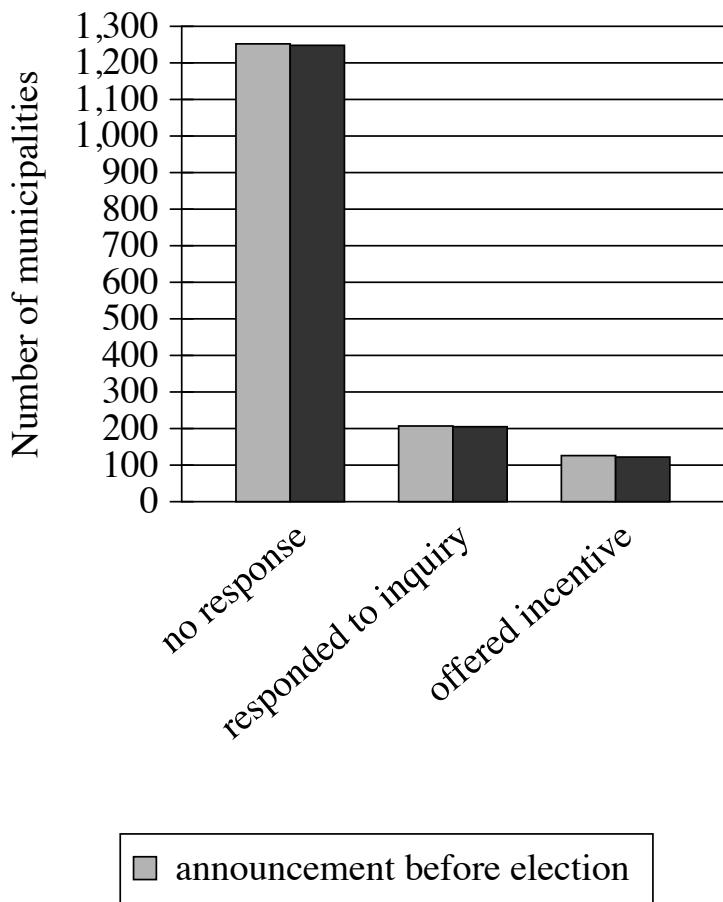
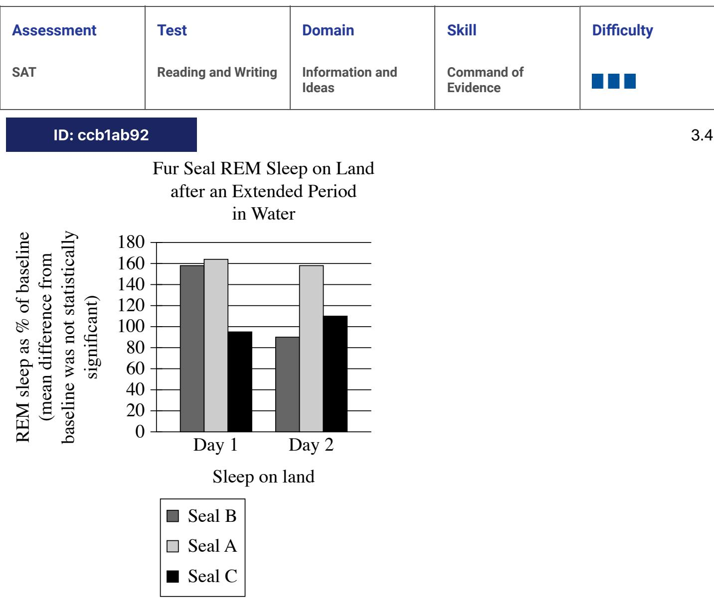
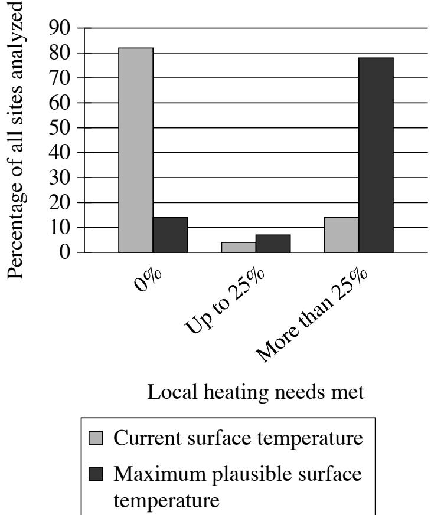
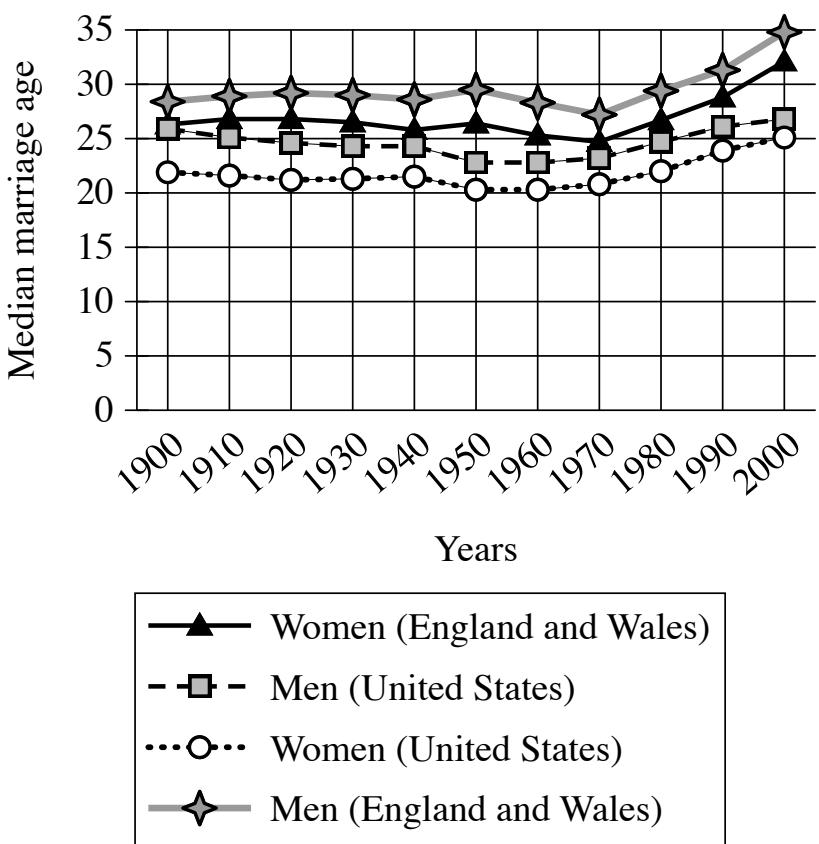
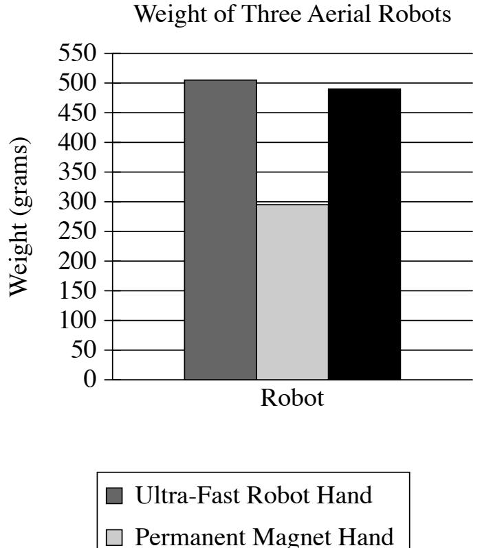

{0}------------------------------------------------

# Question ID a15b3219

| Assessment | Test                | Domain                   | Skill                  | Difficulty |
|------------|---------------------|--------------------------|------------------------|------------|
| SAT        | Reading and Writing | Information and ldeas | Command of Evidence |            |

ID: a15b3219

Municipalities' Responses to Inquiries about Potential Incentives for Firm

- announcement after election
In the United States, firms often seek incentives from municipal governments to expand to those municipalities. A team of political scientists hypothesized that municipalities are much more likely to respond to firms and offer incentives if expansions can be announced in time to benefit local elected officials than if they can't. The team contacted officials in thousands of municipalities, inquiring about incentives for a firm looking to expand and indicating that the firm would announce its expansion on a date either just after the next election.

Which choice best describes data from the graph that weaken the team's hypothesis?

- A. A large majority of the municipalities that received an inquiry mentioning plans for an announcement before the next election didn't respond to the inquiry.
- B. The proportion of municipalities that responded to the inquiry or offered incentives didn't substantially differ across the announcement timing conditions.

3.1

{1}------------------------------------------------

- C. Only around half the municipalities that responded to inquiries mentioning plans for an announcement before the next election offered incentives.
- D. Of the municipalities that received an inquiry mentioning plans for an announcement date after the next election, more than 1,200 didn't respond and only around 100 offered incentives.

#### ID: a15b3219 Answer

Correct Answer: B

Rationale

Choice B is the best answer. The lighter bars show what happened when the announcement was to come before the election, and the darker bars show what happened when the announcement was to come after the election. For all three of the outcomes, the light and dark bars are virtually the same, demonstrating that the announcement timing didn't actually make a difference.

Choice A is incorrect. This accurately describes some data from the graph, but it doesn't weaken the hypothesis. It doesn't include the "announcement after election" data for comparison. Choice C is incorrect. This accurately describes some data from the graph, but it doesn't weaken the hypothesis. It doesn't include the "announcement after election" data for comparison. Choice D is incorrect. This accurately describes some data from the graph, but it doesn't weaken the hypothesis. It doesn't include the "announcement before election" data for comparison.

{2}------------------------------------------------

# Question ID 7a1877be

| Assessment | Test                | Domain                   | Skill                  | Difficulty |
|------------|---------------------|--------------------------|------------------------|------------|
| SAT        | Reading and Writing | Information and ldeas | Command of Evidence |            |

### ID: 7a1877be

Nucleobase Concentrations from Murchison Meteorite and Soil Samples in Parts per Billion

| Nucleobase   | Murchison meteorite sample 1 | Murchison meteorite sample 2 | Murchison soil sample |
|--------------|---------------------------------|---------------------------------|--------------------------|
| lsoguanine   | 0.5                             | 0.04                            | not detected             |
| Purine       | 0.2                             | 0.02                            | not detected             |
| Xanthine     | 39                              | 3                               | 1                        |
| Adenine      | 15                              | 1                               | 40                       |
| Hypoxanthine | 24                              | 1                               | 2                        |

Employing high-performance liquid chromatography—a process that uses pressurized water to separate material into its component molecules-astrochemist Yashiro Oba and colleagues analyzed two samples of the Murchison meteorite that landed in Australia as well as soil from the landing zone of the meteorite to determine the concentrations of various organic molecules. By comparing the relative concentrations of types of molecules known as nucleobases in the Murchison meteorite with those in the team concluded that there is evidence that the nucleobases in the Murchison meteorite formed in space and are not the result of contamination on Earth.

Which choice best describes data from the table that support the team's conclusion?

- A. Isoguanine and purine were detected in both meteorite samples but not in the soil sample.
- B. Adenine and xanthine were detected in both of the meteorite samples and in the soil sample.
- C. Hypoxanthine and purine were detected in both the Murchison meteorite sample 2 and in the soil sample.
- D. Isoguanine and hypoxanthine were detected in the Murchison meteorite sample 1 but not in sample 2.

### ID: 7a1877be Answer

Correct Answer: A

#### Rationale

Choice A is the best answer. The researchers concluded that the meteorite's nucleobases weren't the result of soil contamination. Presence of nucleobases in the meteorite and not in soil provides evidence that those nucleobases likely didn't come from the soil.

Choice B is incorrect. This choice doesn't justify the conclusion. The researchers concluded that the meteorite's nucleobases weren't the result of soil contamination. If the nucleobases are present in both the soil and meteorite, then it's possible that these nucleobases came from the soil. Choice C is incorrect. This choice

3.2

{3}------------------------------------------------

misreads the table. Purine was not detected in the soil sample. Choice D is incorrect. This choice misreads the table. Both isoguanine and hypoxanthine were detected in both Murchison meteorite samples.

{4}------------------------------------------------

### Question ID 04cbeca3

| Assessment | Test                | Domain                   | Skill                  | Difficulty |
|------------|---------------------|--------------------------|------------------------|------------|
| SAT        | Reading and Writing | Information and ldeas | Command of Evidence |            |

### ID: 04cbeca3

3.3

In 1534 CE, King Henry VIII of England split with the Catholic Church and declared himself head of the Church of England, in part because Pope Clement VII refused to annul his marriage to Catherine of Aragon. Two years later, Henry VIII introduced a policy titled the Dissolution of the Monasteries that by 1540 had resulted in the closure of all Catholic monasteries in England and the confiscation of their estates. Some historians assert that the enactment of the policy was primarily motivated by perceived financial opportunities.

Which quotation from a scholarly article best supports the assertion of the historians mentioned in the text?

- A. "At the time of the Dissolution of the Monasteries, about 2 percent of the adult male population of England were monks; by 1690, the proportion of the adult male population who were monks was less than 1 percent."
- B. "A contemporary description of the Monasteries, Michael Sherbrook's Falle of the Religious Howses, recounts witness testimony that monks were allowed to keep the contents of their cells and that the monastery timber was purchased by local yeomen."
- C. "In 1535, the year before enacting the Dissolution of the Monasteries, Henry commissioned a survey of the value of church holdings in England—the work, performed by sheriffs, bishops, and magistrates, began that January and was swiftly completed by the summer."
- D. "The October 1536 revolt known as the Pilgrimage of Grace had several economic motives: high food prices due to a poor harvest the prior year; the Dissolution of the Monasteries, which closed reliable sources of food and shelter for many; and rents and taxes throughout Northern England that were not merely high but predatory."

#### ID: 04cbeca3 Answer

Correct Answer: C

#### Rationale

Choice C is the best answer. The fact that Henry VIII commissioned a survey of church holdings just before enacting the Dissolution of the Monasteries suggests that he was interested in the potential profits from claiming their assets. This supports the historians' assertion.

Choice A is incorrect. This choice describes a potential effect of the Dissolution of the Monasteries. The decrease in the proportion of monks in England isn't relevant to the question of Henry VIII's motivations. Choice B is incorrect. Details about how the monks were treated during the dissolution don't address Henry VIII's motivations for enacting the policy in the first place. That the monks could keep the content of their cells (their rooms) and sell off the timber they'd harvested has no impact on the value of the monasteries 'estates their land holdings. Choice D is incorrect. This choice mentions one impact that the Dissolution of the Monasteries contributed to, two years after it happened. But it doesn't help explain why Henry VIII might have wanted to enact the policy in the first place.

{5}------------------------------------------------

{6}------------------------------------------------

# Question ID ccb1ab92

Research suggests that REM sleep in animals is homeostatically regulated: animals compensate for periods of REM sleep deprivation by increasing subsequent REM sleep. When on land, fur seals get enough REM sleep, but during the weeks they're in the water, they get almost none. In a study of fur seals' sleep habits, researchers recorded the REM sleep (as a percentage of baseline) of fur seals once they had returned to land. They concluded that REM sleep may not be homeostatically regulated in fur seals, citing as evidence the fact that the seals in the study

Which choice most effectively uses data from the graph to complete the text?

- A. didn't show significantly less REM sleep during the second day after returning to land than they did during the first day.
- B. showed no significant differences from one another in baseline levels of REM sleep.
- C. didn't consistently demonstrate a significant increase in REM sleep after their period of deprivation in the water.
- D. showed no significant difference between REM sleep after returning to land and REM sleep while in the water.

{7}------------------------------------------------

#### ID: ccb1ab92 Answer

#### Correct Answer: C

#### Rationale

Choice C is the best answer. If REM sleep were homeostatically requlated in fur seals, then all the seals would compensate with REM levels significantly over baseline after going weeks without REM. We'd also expect the seals to maintain those elevated REM levels for some time. Since seals B and C return very quickly to baseline REM levels, this suggests that REM sleep in fur seals may not be requlated homeostatically.

Choice A is incorrect. This doesn't support the conclusion. If REM sleep were homeostatically requlated in fur seals, then we'd suspect the seals to sustain REM levels well above baseline for a prolonged period in order to compensate for weeks of REM deprivation while in the water. Whether or not there's a reduction in REM sleep from day 1 to day 2 doesn't tell us how REM sleep on those days relates to baseline, which is where our focus should be. Choice B is incorrect. The y-axis of this graph doesn't depict baseline levels of REM sleep, but rather shows REM sleep as a percent of baseline. Choice D is incorrect. The graph doesn't depict REM sleep while in the water for the seals in the study. Additionally, we're told fur seals get no REM sleep while in the water, which is significantly different to the values shown in the graph for after they return to land.

{8}------------------------------------------------

# Question ID be19faa1

| Assessment | Test                | Domain                   | Skill                  | Difficulty |
|------------|---------------------|--------------------------|------------------------|------------|
| SAT        | Reading and Writing | Information and ldeas | Command of Evidence |            |

### ID: be19faa1

Home Heating Needs Met with Subsurface Thermal Pollution for Two Temperature Conditions, by Percentage of Sites

Urbanization, industrialization, and the warming climate create thermal pollution (excess heat) in the shallow subsurface soil. Susanne A. Benz and colleagues analyzed thousands of sites on three continents under one scenario in which surface temperature remains at the current level and under another in which the surface reaches the maximum plausible temperature. They then categorized each site according to the percentage of local home heating needs that could be met using this excess subsurface heat. The team concluded that if surface temperature approaches the maximum plausible level, the percentage of sites where thermal pollution could feasibly contribute to meeting home heating needs will increase.

Which choice best describes data in the graph that support Benz and colleagues' conclusion?

- A. Under both temperature conditions, less than 10% of sites were in the up-to-25% group, but at the maximum plausible surface temperature, almost 80% of sites could have all their local heating needs met by thermal pollution.
3.5
{9}------------------------------------------------

- B. At current surface temperatures, more than 80% of the sites have no need for supplemental local home heating from subsurface thermal pollution, but at the maximum plausible surface temperature, more than 70% of sites exhibit significantly greater home heating needs.
- C. At current surface temperatures, more than 80% of sites can meet, at most, 25% of local home heating needs with subsurface thermal pollution, but at the maximum plausible surface temperature, more than 80% of sites can meet greater than 25% of local home heating needs.
- D. At current surface temperatures, more than 80% of the sites cannot use subsurface thermal pollution to meet any portion of local home heating needs, but at the maximum plausible surface temperature, that percentage drops below 20%.

## ID: be19faa1 Answer

Correct Answer: D

Rationale

Choice D is the best answer. The researchers concluded that as we approach maximum plausible surface temperatures, there will be a larger percentage of sites where thermal pollution could contribute to meeting home heating needs. By showing that only a small percentage of homes can currently use thermal pollution for home heating, and that this percentage would grow much larger at maximum plausible surface temperatures, this choice supports the researchers' conclusion.

Choice A is incorrect. We do not know how many sites could have all (i.e., 100%) of their local heating needs met by thermal pollution, as the graph only classifies sites by whether "0%, "Up to 25%," and "More than 25%" of heating needs could be met. Choice B is incorrect. The graph is not depicting need for supplemental heating from thermal pollution, but rather potential to use thermal pollution for supplemental heating. Choice C is incorrect. The graph indicates that, at current surface temperatures, less than 10% of sites can meet 25% of local home heating needs and that more than 80% of sites cannot meet any local home heating needs.

{10}------------------------------------------------

# Question ID dd1757fd

| Assessment | Test                | Domain                   | Skill                  | Difficulty |
|------------|---------------------|--------------------------|------------------------|------------|
| SAT        | Reading and Writing | Information and ldeas | Command of Evidence |            |

## ID: dd1757fd

3.6

Neural networks are computer models intended to reflect the organization of human brains and are often used in studies of brain function. According to an analysis of 11,000 such networks, Rylan Schaeffer and colleagues advise caution when drawing conclusions about brains from observations of neural networks. They found that when attempting to mimic grid cells (brain cells used in navigation), while 90% of the networks could accomplish navigation-related tasks, only about 10% of those exhibited any behaviors similar to those of grid cells. But even this approximation of grid-cell activity has less to do with similarity between the neural networks and biological brains than it does with the rules programmed into the networks.

Which finding, if true, would most directly support the claim in the underlined sentence?

- A. The rules that allow for networks to exhibit behaviors like those of grid cells have no equivalent in the function of biological brains.
- B. The networks that do not exhibit behaviors like those of grid cells were nonetheless programmed with rules that had proven useful in earlier neural-network studies.
- C. Neural networks can often accomplish tasks that biological brains do, but they are typically programmed with rules to model multiple types of brain cells simultaneously.
- D. Once a neural network is programmed, it is trained on certain tasks to see if it can independently arrive at processes that are similar to those performed by biological brains.

## ID: dd1757fd Answer

Correct Answer: A

#### Rationale

Choice A is the best answer. While many networks can perform navigation tasks, or even mimic grid cells, it doesn't mean they're actually behaving like biological brains—this finding suggests that the rules that govern neural network behavior are completely unlike the way real brains work.

Choice B is incorrect. Although it mentions the rules that are programmed into the networks, this finding wouldn't clarify whether or not these rules have anything to do with the function of biological brains. Choice C is incorrect. This choice suggests that neural networks are modeled after multiple types of brain cells, which sidesteps the question of whether these rule-based networks are genuinely similar to biological brains. Choice D is incorrect. This choice doesn't address the key point of the claim, which is that the apparent similarity between neural networks and biological brains is only due to the rules programmed into the networks. It focuses on training tasks, not the originally programmed rules.

{11}------------------------------------------------

## Question ID 09f9edb0

| Assessment | Test                | Domain                   | Skill                  | Difficulty |
|------------|---------------------|--------------------------|------------------------|------------|
| SAT        | Reading and Writing | Information and ldeas | Command of Evidence |            |

## ID: 09f9edb0

3.7

In the 1980s, many musicians and journalists in the English-speaking world began to draw attention to music from around the globe—such as mbaqanga from South Africa and quan ho from Vietnam—that can't be easily categorized according to British or North American popular music genres, typically referring to such music as "world music." While some scholars have welcomed this development for bringing diverse musical forms to prominence in countries where they'd previously been overlooked, musicologist Su Zheng claims that the concept of world music homogenizes highly distinct traditions by reducing them all to a single category.

Which finding about mbaqanga and quan ho, if true, would most directly support Zheng's claim?

- A. Mbaqanga and quan ho developed independently of each other and have little in common musically.
- B. Mbaqanga is significantly more popular in the English-speaking world than quan họ is.
- C. Mbaqanga and quan ho are now performed by a diverse array of musicians with no direct connections to South Africa or Vietnam.
- D. Mbaqanga and quan họ are highly distinct from British and North American popular music genres but similar to each other.

## ID: 09f9edb0 Answer

Correct Answer: A

#### Rationale

Choice A is the best answer. Zheng's claim is that the idea of world music "homogenizes" (meaning makes similar) distinct kinds of music by reducing them to one category. In other words, Zheng thinks the concept of world music is a harmful oversimplification of diverse musical forms. To support this claim, we need evidence that these musical traditions are so different from one another that they should not fall into the same category. If it's true that mbaqanga and quan ho developed separately and have little in common musically, then it wouldn't make sense to lump them into the same category.

Choice B is incorrect. If true, this wouldn't affect the claim. We need evidence that these musical traditions are so different from one another that they should not fall into the same category. A difference in popularity doesn't necessarily mean that the two musical traditions shouldn't be categorized together: instead, we need to know if the music itself is similar or different. Choice C is incorrect. If true, this wouldn't affect the claim. To support the claim, we need evidence that these musical traditions are so different from each other that they should not fall into the same category. This choice doesn't do that. Choice D is incorrect. If true, this would actually weaken the claim. Zheng thinks it's reductive or oversimplifying to put distinct musical traditions into a sinqle category. But if mbaganga and quan ho are similar to each other, then it would make sense to put them in the same category.

{12}------------------------------------------------

## Question ID 39e440e4

| Assessment | Test                | Domain                   | Skill                  | Difficulty |
|------------|---------------------|--------------------------|------------------------|------------|
| SAT        | Reading and Writing | Information and ldeas | Command of Evidence |            |

### ID: 39e440e4

3.8

Archaeologists have held that the Casarabe culture, which emerged in the southwestern Amazon basin in the first millennium CE, was characterized by a sparse, widely distributed population and little intervention in the surrounding wilderness. Recently, however, archaeologist Heiko Prümers and colleagues conducted a study of the region using remote-sensing technology that enabled them to create three-dimensional images of the junglecovered landscape from above, and the researchers concluded that the Casarabe people developed a form of urbanism in the Amazon basin.

Which finding about the remote-sensing images, if true, would most directly support Prümers and colleagues' conclusion?

- A. They show shapes consistent with widely separated settlements of roughly equal small size surrounded by uncultivated jungle.
- B. They show shapes consistent with long-distance footpaths running from Casarabe territories to large cities outside the region inhabited by the Casarabe people.
- C. They show shapes consistent with scattered small farms created by clearing jungle areas near sources of fresh water.
- D. They show shapes consistent with monumental platforms and dense central settlements linked to smaller settlements by a system of canals and roadways.

#### ID: 39e440e4 Answer

Correct Answer: D

#### Rationale

Choice D is the best answer. This finding, if true, would support the archaeologists' conclusion. Dense central settlements linked to smaller ones would provide evidence of cities and suburbs-in other words, "a form of urbanism."

Choice A is incorrect. This finding, if true, would weaken the archaeologists' conclusion. Widely separated, small settlements with jungle in between would support the long-held belief that the Casarabe culture "was characterized by a sparse, widely distributed population and little intervention in the surrounding wilderness." Choice B is incorrect. This choice wouldn't support the researchers' conclusion. These large cities are located outside Casarabe territory, which doesn't show evidence of Casarabe urbanism. Choice C is incorrect. This finding wouldn't support the archaeologists' conclusion. Scattered small farms in jungle clearings are not good evidence to support the existence of cities ("a form of urbanism").

{13}------------------------------------------------

# Question ID 156ff681

| Assessment | Test                | Domain                   | Skill                  | Difficulty |
|------------|---------------------|--------------------------|------------------------|------------|
| SAT        | Reading and Writing | Information and ldeas | Command of Evidence |            |

## ID: 156ff681

3.9

Many governments that regularly transfer money to individuals—to provide supplemental incomes for senior citizens, for example-have long done so electronically, but other countries typically have distributed physical money and have only recently developed electronic transfer infrastructure. Researchers studied the introduction of an electronic transfer system in one such location and found that recipients of electronic transfers consumed a different array of foods than recipients of physical transfers of the same amount did. One potential explanation for this result is that individuals conceive of and allocate funds in physical money differently than they conceive of and allocate funds in electronic form.

Which finding from the study, if true, would most directly weaken the potential explanation?

- A. Recipients of electronic transfers typically spent their funds at a slower rate than recipients of physical transfers did.
- B. Nearly every recipient of an electronic transfer withdrew the entire amount in physical money shortly after receiving the transfer.
- C. Recipients of physical transfers tended to purchase food about as frequently as recipients of electronic transfers did.
- D. Some recipients of physical transfers received small amounts of money relatively frequently, while others received large amounts relatively infrequently.

#### ID: 156ff681 Answer

Correct Answer: B

#### Rationale

Choice B is the best answer. This would weaken the explanation. If the recipients of electronic money immediately withdrew it all as physical money, then both kinds of recipients ended up spending physical money on food. So there must be some other explanation why those who initially received electronic money ate different kinds of food.

Choice A is incorrect. This wouldn't weaken the explanation. If anything, it actually supports it it demonstrates that recipients of electronic money and recipients of physical money have different spending habits. Choice C is incorrect. This wouldn't weaken the explanation we're testing this choice aqainst is about the way that people might "conceive of and allocate" physical and electronic funds differently. This choice only focuses on the timing, not what they spend the money on. Choice D is incorrect. This would have no impact on the explanation. It doesn't tell us anything about possible differences between the spending habits of those who spend physical money and those who spend money electronically.

{14}------------------------------------------------

## Question ID 8545ccfe

| Assessment | Test                | Domain                   | Skill                  | Difficulty |
|------------|---------------------|--------------------------|------------------------|------------|
| SAT        | Reading and Writing | Information and Ideas | Command of Evidence |            |

### ID: 8545ccfe

3.10

lcebergs generally appear to be mostly white or blue, depending on how the ice reflects sunlight. Ice with air bubbles trapped in it looks white because much of the light reflects off the bubbles. Ice without air bubbles usually looks blue because the light travels deep into the ice and only a little of it is reflected. However, some icebergs in the sea around Antarctica appear to be green. One team of scientists hypothesized that this phenomenon is the result of yellow-tinted dissolved organic carbon in Antarctic waters mixing with blue ice to produce the color green.

Which finding, if true, would most directly weaken the team's hypothesis?

- A. White ice doesn't change color when mixed with dissolved organic carbon due to the air bubbles in the ice.
- B. Dissolved organic carbon has a stronger yellow color in Antarctic waters than it does in other places.
- C. Blue icebergs and green icebergs are rarely found near each other.
- D. Blue icebergs and green icebergs contain similarly small traces of dissolved organic carbon.

#### ID: 8545ccfe Answer

Correct Answer: D

#### Rationale

Choice D is the best answer because it presents a finding that, if true, would weaken the scientists' hypothesis about icebergs that appear to be green. The text indicates that most icebergs are either mostly white or blue in color but that some icebergs in Antarctica appear to be green. The text goes on to say that the scientists hypothesized that this green color occurs when yellow-tinted dissolved organic carbon in ocean waters mixes with blue ice. A finding that both blue icebergs and green icebergs contain similarly small traces of dissolved organic carbon would suggest that something other than yellow-tinted organic carbon causes some icebergs' green color, since the blue icebergs that contain yellow-tinted organic carbon remained blue instead of turning green.

Choice A is incorrect because, according to the text, the scientists 'hypothesis was that blue icebergs, not white ones, change color when their ice mixes with yellow-tinted dissolved organic carbon. A finding that white ice, because of its air bubbles, doesn't change color when it's mixed with dissolved organic carbon would therefore have no bearing on the scientists' hypothesis. Choice B is incorrect because the text focuses only on Antarctic icebergs that appear to be qreen. It doesn't indicate that icebergs in locations other than Antarctica have been found to have a green hue. A finding that dissolved organic carbon has a stronger yellow color in Antarctic waters than in other places would therefore have no bearing on the scientists' hypothesis that green color in icebergs in Antarctica is caused by yellow-tinted dissolved organic carbon mixing with blue ice. Choice C is incorrect because, according to the scientists' hypothesis was that blue icebergs turn green when their ice mixes with yellow-tinted dissolved organic carbon in the sea around them. If that's correct, one would expect blue icebergs and green icebergs to be located at a distance from each other since all 

{15}------------------------------------------------

blue icebergs in an area where the waters contain yellow-tinted dissolved organic carbon would take on a green hue. A finding that blue icebergs and green icebergs are rarely found near each other would therefore strengthen, not weaken, the researchers' hypothesis.

{16}------------------------------------------------

# Question ID dc87adf4

| Assessment | Test                | Domain                   | Skill                  | Difficulty |
|------------|---------------------|--------------------------|------------------------|------------|
| SAT        | Reading and Writing | Information and ldeas | Command of Evidence |            |

### ID: dc87adf4

3.11

Barchester Towers is an 1857 novel by Anthony Trollope. In the novel, Trollope's portrayal of Dr. Proudie underscores the character's exaggerated sense of his own abilities: _

Which quotation from Barchester Towers most effectively illustrates the claim?

- A. "It must not…be taken as proved that Dr. Proudie was a man of great mental powers, or even of much capacity for business, for such qualities had not been required in him."
- B. "[Dr. Proudie] was comparatively young, and had, as he fondly flattered himself, been selected as possessing such gifts, natural and acquired, as must be sure to recommend him to a yet higher notice."
- C. "[Dr. Proudie's] residence in the metropolis, rendered necessary by duties thus entrusted to him, his high connexions, and the peculiar talents and nature of the man, recommended him to persons in power."
- D. "[Dr. Proudie] was certainly possessed of sufficient tact to answer the purpose for which he was required without making himself troublesome."

#### ID: dc87adf4 Answer

Correct Answer: B

Rationale

Choice B is the best answer. In this quotation, Dr. Proudie is described as "fondly flatter[ing] himself" that he has gifts that "must be sure to recommend him to a yet higher notice." In other words, he expects his skills to push him to greater fame and success. This implies an exaggerated sense of his own abilities, which matches the claim we're trying to support.

Choice A is incorrect. This quotation doesn't describe Proudie's view of himself, nor does it paint him in an especially flattering light. Instead, by saying his mental powers and business skill are not "proved," it implies that he is actually dim-witted and bad at business. Choice C is incorrect. This choice describes Proudie's closeness to power and importance, but it doesn't show what Proudie thinks of himself. Proudie is not describing himself or his abilities here. The narrator is. Choice D is incorrect. While this quotation offers Proudie very mild praise, it doesn't show what Proudie thinks of his own abilities, which is what the claim focuses on.

{17}------------------------------------------------

# Question ID 3bfcb73b

| Assessment | Test                | Domain                   | Skill                  | Difficulty |
|------------|---------------------|--------------------------|------------------------|------------|
| SAT        | Reading and Writing | Information and Ideas | Command of Evidence |            |

### ID: 3bfcb73b

3.12

An archaeological team led by Piotr Bieliński and Sultan al-Bakri found remnants of a 4,000-year-old Bronze Age board game at a site in Oman. Little is left of the game except a stone board, which is carved with a grid and has places to hold game pieces. Some scholars claim that the game was largely played by traders.

Which finding, if true, would most directly support the scholars' claim?

- A. Other examples of the game dating to the same period have been found in the remains of several homes in the region, including in one home that may have belonged to a trader.
- B. Similar games have been found in other sites dating to the same period that were connected to the site in Oman via trade routes.
- C. The other known examples of the game dating to the same period have been found along routes that seem to have been used primarily by traders at the time.
- D. Remnants of other goods have been found at the site in Oman that probably also reached the location through trade.

#### ID: 3bfcb73b Answer

Correct Answer: C

#### Rationale

Choice C is the best answer because it presents a finding that, if true, would most directly support the scholars' claim about the board game. The text explains that the remains of a 4,000-year-old board game were found in Oman. The text then states that scholars claim this board game was played mostly by traders. If the other known examples of this board game from the same time period were discovered along routes that seem to have been used primarily by traders, this finding would directly support the scholars' claim because it suggests that the game was largely played by traders who brought it with them for entertainment as they traveled.

Choice A is incorrect because this finding would suggest only that a single trader may have possessed examples of the board game, perhaps for the purpose of trading or selling the game to residents of Oman. For this reason, the finding wouldn't directly support the scholars' claim that the majority of the game's players were traders. Choice B is incorrect because this finding doesn't mention the board game at all, referring only to similar qames found at other sites, and would therefore provide no direct support for the scholars' claim about the board game. Choice D is incorrect because this finding doesn't mention the board game at all, referring only to the remains of other goods found at the site in Oman, and would therefore provide no direct support for the scholars' claim about the board game.
{18}------------------------------------------------

## Question ID 53c6c179

3.13

## ID: 53c6c179

Median Ages of First Marriage for Men and Women in the United States and in England and Wales, 1900-2000

A sociology student is reading an essay on the median age of first marriage in Western countries throughout the twentieth century. The author of the essay cites factors common to these countries that the author believes caused an increase in the median age of first marriage, such as new technologies that shortened the time needed for domestic chores, making two-person households less necessary and living alone more viable. The student asserts that beyond these factors there must be additional ones specific to particular Western countries that influenced the increase of age at first marriage.

Which choice most effectively uses data from the graph that support the student's assertion?

- A. Between 1970 and 2000, the median age of first marriage rose more sharply for men in England and Wales than it did for men in the United States.
- B. In England and Wales, the median age of first marriage was consistently higher for men than for women between 1900 and 2000, but this was not always the case in the United States.
- C. The median age of first marriage for men in England and Wales was lower in 1970 than in 1950 or 1990.

{19}------------------------------------------------

- D. Between 1900 and 2000, the median age of first marriage for women in England and Wales was consistently higher than for women in the United States, as was the case for men.
## ID: 53c6c179 Answer

Correct Answer: A

Rationale

Choice A is the best answer. The student concluded that country-specific factors influence changes to median age of first marriage. This choice describes a time period when the rate of change differed between countries, suggesting that country-specific factors may have played a role in these changes.

Choice B is incorrect. This choice misreads the graph. The median age of first marriage was consistently higher for men than for women in the United States during the time period depicted. Choice C is incorrect. The student concluded that country-specific factors influence changes to median age of first marriage. However, this choice doesn't provide any contrasts between countries and thus doesn't support the idea of countryspecific factors influencing median age of first marriage. Choice D is incorrect. The students' conclusion is about changes that occurred during the 20th century. This choice provides broad information about the century as a whole, so it doesn't give insight into how median age at first marriage changed over time.

{20}------------------------------------------------

## Question ID a44bbd6b

| Assessment | Test                | Domain                   | Skill                  | Difficulty |
|------------|---------------------|--------------------------|------------------------|------------|
| SAT        | Reading and Writing | Information and ldeas | Command of Evidence |            |

## ID: a44bbd6b

3.14

Several studies of sediment (e.g., dirt, pieces of rock, etc.) in streams have shown an inverse correlation between sediment grain size and downstream distance from the primary sediment source, suggesting that stream length has a sorting effect on sediment. In a study of sediment sampled at more than a dozen sites in Alpine streams, however, geologists Camille Litty and Fritz Schlunegger found that cross-site variations in grain size were not associated with differences in downstream distance, though they did not conclude that downstream distance is irrelevant to grain size. Rather, they concluded that sediment influx in these streams may have been sufficiently spatially diffuse to prevent the typical sorting effect from being observed.

Which finding about the streams in the study, if true, would most directly support Litty and Schlunegger's conclusion?

- A. The streams regularly experience portions of their banks collapsing into the water at multiple points upstream of the sampling sites.
- B. The streams contain several types of sediment that are not typically found in streams where the sorting effect has been demonstrated.
- C. The streams mostly originate from the same source, but their lengths vary considerably due to the different courses they take.
- D. The streams are fed by multiple tributaries that carry significant volumes of sediment and that enter the streams downstream of the sampling sites.

## ID: a44bbd6b Answer

Correct Answer: A

### Rationale

Choice A is the best answer. This finding would support the conclusion. If stream banks are collapsing into the water at multiple points, then sediment is getting into the water at those various points. This supports the conclusion that the inflow of sediment is very spread out.

Choice B is incorrect. This finding wouldn't support the conclusion is about the influx of sediment being "spatially diffuse," meaning spread out over a large area. The type of sediment wouldn't have an impact on the conclusions. Choice C is incorrect. This finding wouldn't support the conclusion. It doesn't say anything about the influx of sediment being "spatially diffuse" (spread out). Choice D is incorrect. This finding wouldn't support the conclusion. Any sediment that enters downstream of the sampling sites wouldn't end up in the samples, so it wouldn't affect the findings or the conclusion.

{21}------------------------------------------------

## Question ID 63e7799d

| Assessment | Test                | Domain                   | Skill                  | Difficulty |
|------------|---------------------|--------------------------|------------------------|------------|
| SAT        | Reading and Writing | Information and Ideas | Command of Evidence |            |

### ID: 63e7799d

3.15

In vertical inheritance, parents pass genes to their offspring, but in horizontal transfer (HT), one species, often bacteria, passes genetic material to an unrelated species. In a 2022 study, herpetologist Atsushi Kurabayashi and his team investigated HT in multicellular organisms—namely, snakes and frogs in Madagascar. The team detected BovB-a gene transmitted vertically in snakes-in many frog species. The apparent direction of gene transfer seems counterintuitive because frogs usually don't survive encounters with snakes and so wouldn't be able to transmit the newly acquired gene to offspring, but the team concluded that BovB is indeed transmitted from snakes to frogs, either directly or indirectly, via HT.

Which finding, if true, would most directly support the team's conclusion?

- A. BovB can be transmitted across frog species through HT.
- B. Parasites known to feed on species of snakes and frogs in which the BovB gene occurs also carry BovB.
- C. BovB cannot be reliably transmitted from a snake species to bacteria that are usually encountered by frog species.
- D. Frog species with BovB show few discernible advantages as compared with frog species that do not carry BovB.

### ID: 63e7799d Answer

Correct Answer: B

#### Rationale

Choice B is the best answer. If there are parasites that feed on both snakes and frogs, they could carry BovB from snakes to frogs. HT could occur "indirectly" through those encounters, which frogs are more likely to survive than snake encounters.

Choice A is incorrect. The team's conclusion specifically argues that BovB is transmitted from snakes to frogs via HT, and this choice doesn't mention snakes. Choice C is incorrect. The team argues that BovB is transmitted from snakes to frogs via HT, and this answer choice discusses a scenario in which the qene is not transmitted. Choice D is incorrect. Whether or not frog species with BovBare advantaged isn't relevant to the team's conclusion about how the gene is transmitted.

{22}------------------------------------------------

# Question ID df37c087

| Assessment | Test                | Domain                   | Skill                  | Difficulty |
|------------|---------------------|--------------------------|------------------------|------------|
| SAT        | Reading and Writing | Information and ldeas | Command of Evidence |            |

ID: df37c087

■ Yale Model T

Aerial robots vary considerably in their holding force; the Ultra-Fast Robot Hand, for example, has a holding force of 56 newtons, more than twice that of the Permanent Magnet Hand and more than four times that of the Yale Model T. Since an aerial robot must lift its own weight along with its cargo, engineer Jiawei Meng and colleagues used a ratio of each robot's holding force to the robot's weight to calculate payload capacity, with higher ratios corresponding to greater capacity, concluding that the Ultra-Fast Robot Hand has a higher payload capacity than the Yale Model T.

Which choice best describes data in the graph that support Meng and colleagues' conclusion?

- A. The Ultra-Fast Robot Hand and the Yale Model T each weigh more than 450 grams.
- B. The Ultra-Fast Robot Hand and the Yale Model T each weigh more than the Permanent Magnet Hand does.
- C. The Yale Model T has a lower holding force than the Permanent Magnet Hand despite weighing more.
- D. The Ultra-Fast Robot Hand weighs only slightly more than the Yale Model T does.

3.16

{23}------------------------------------------------

### Correct Answer: D

### Rationale

Choice D is the best answer because it describes data in the graph that support Meng and colleagues' conclusion that the Ultra-Fast Robot Hand has a higher payload capacity than the Yale Model T. According to the text, payload capacity is calculated by using a ratio of a robot's holding force to the robot's weight, and higher ratios indicate a greater payload capacity. The Ultra-Fast Robot Hand has a holding force of 56 newtons, four times greater than that of the Yale Model T. Additionally, the graph shows that the Ultra-Fast Robot Hand has a weight of approximately 500 grams, slightly more than the Yale Model T's weight of approximately 480 grams. Therefore, the Ultra-Fast Robot Hand has a higher ratio of holding force to weight than the Yale Model T. Since higher ratios correspond to greater payload capacity, the information from the graph indicating that the Ultra-Fast Robot Hand weighs only slightly more than the Yale Model T combined with the information in the text ultimately supports the conclusion that the Ultra-Fast Robot Hand has a higher payload capacity than the Yale Model T.

Choice A is incorrect. Although, according to the graph, it's true that both the Ultra-Fast Robot Hand and the Yale Model T weigh more than 450 grams, this statement doesn't support Meng and colleagues' conclusion that the Ultra-Fast Robot Hand has a higher payload capacity than the Yale Model T. This statement emphasizes a similarity, not a distinction, between the two robots. Choice B is incorrect. Although, according to the graph, it's true that the Ultra-Fast Robot Hand and the Yale Model T both weigh more than the Permanent Magnet Hand does, this statement doesn't support Meng and colleagues' conclusion that the Ultra-Fast Robot Hand has a higher payload capacity than the Yale Model T. This statement emphasizes a similarity, not a distinction, between the Ultra-Fast Robot Hand and the Yale Model T. Furthermore, the comparison to the Permanent Maqnet Hand is irrelevant to the claim about the relative ratios and payload capacities of the Ultra-Fast Robot Hand and the Yale Model T. Choice C is incorrect. Although the text states that the Yale Model T has a lower holding force than the Permanent Magnet Hand, the graph provides no information about holding force. Moreover, information about the Permanent Magnet Hand is irrelevant to the conclusion by Menq and colleagues, which only concerns the Ultra-Fast Robot Hand and the Yale Model T.

{24}------------------------------------------------

## Question ID af9e3240

| Assessment | Test                | Domain                   | Skill                  | Difficulty |
|------------|---------------------|--------------------------|------------------------|------------|
| SAT        | Reading and Writing | Information and Ideas | Command of Evidence |            |

### ID: af9e3240

3.17

Electra is a circa 420–410 BCE play by Sophocles, translated in 1870 by R.C. Jebb. Electra, who is in mourning for her dead father and her long-absent brother, is aware of the grief but believes it to be justified:

Which quotation from Electra most effectively illustrates the claim?

- A. "O thou pure sunlight, and thou air, earth's canopy, how often have ye heard the wild blows dealt against this bleeding breast, when dark night fails!"
- B. "Send to me my brother; for I have no more the strength to bear up alone against the load of grief that weighs me down."
- C. "I know my own passion, it escapes me not; but, seeing that the causes are so dire, will never curb these frenzied plaints, while life is in me."
- D. "But never will I cease from dirge and sore lament, while I look on the trembling rays of the bright stars, or on this light of day."

#### ID: af9e3240 Answer

Correct Answer: C

Rationale

Choice C is the best answer. Electra states that she "knows her own passion" which shows that she's aware of the intensity of her grief. But she also claims that the "causes are so dire" –meaning the reasons for her grief are so awful-that she can't let it go, which shows that she believes her grief is justified.

Choice A is incorrect. This quotation doesn't show that Electra believes her grief is justified. It shows that Electra is aware of its intensity, but it doesn't suggest that she believes she has a legitimate reason for feeling that way. Choice B is incorrect. This quotation doesn't show that Electra believes her grief is justified. It shows that Electra is aware of its intensity, but it doesn't suggest that she believes she has a legitimate reason for feeling that way. Choice D is incorrect. This quotation doesn't show that Electra believes her grief is justified. It shows that Electra is aware of the intensity of her grief, but it doesn't suggest that she has a legitimate reason for feeling that way.

{25}------------------------------------------------

## Question ID 2c06139b

| Reading and Writing Information and Command of SAT ldeas Evidence | Assessment | Test | Domain | Skill | Difficulty |
|----------------------------------------------------------------------------------|------------|------|--------|-------|------------|
|                                                                                  |            |      |        |       |            |

## ID: 2c06139b

Tadpole Body Mass and Toxin Production after Three Weeks in Ponds

| Population density | Average tadpole body mass (milligrams) | Average number of distinct bufadienolide toxins per tadpole | Average amount of bufadienolide per tadpole (nanograms) | Average bufadienolide concentration (nanograms per milligram of tadpole body mass) |
|-----------------------|-------------------------------------------------|----------------------------------------------------------------------|------------------------------------------------------------------|------------------------------------------------------------------------------------------------|
| High                  | 193.87                                          | 22.69                                                                | 5,815.51                                                         | 374.22                                                                                         |
| Medium                | 254.56                                          | 21.65                                                                | 5,525.72                                                         | 230.10                                                                                         |
| Low                   | 258.97                                          | 22.08                                                                | 4.664.99                                                         | 171.43                                                                                         |

Ecologist Veronika Bókony and colleagues investigated within-species competition among common toads (Bufo buro), a species that secretes various unpleasant-tasting toxins called bufadienolides in response to threats. The researchers tested B. bufo tadpoles' responses to different levels of competition by creating ponds with different tadpole population densities but a fixed amount of food. Based on analysis of the tadpoles after three weeks, the researchers concluded that increased competition drove bufadienolide production at the expense of growth.

Which choice uses data from the table to most effectively support the researchers' conclusion?

- A. The difference in average tadpole body mass was small between the low and medium population density conditions and substantially larger between the low and high population density conditions.
- B. Tadpoles in the low and medium density conditions had substantially lower average bufadienolide concentrations but had greater average body masses than those in the high population density condition.
- C. Tadpoles in the high population displayed a relatively modest increase in the average amount of bufadienolide but roughly double the average bufadienolide concentration compared to those in the low population density condition.
- D. Tadpoles produced approximately the same number of different bufadienolide toxins per individual across the population density conditions, but average tadpole body mass decreased as population density increased.

### ID: 2c06139b Answer

Correct Answer: B

Rationale

Choice B is the best answer. This data shows that the tadpoles in the high-density pond (meaning those with the most competition) didn't grow as big as the other two groups but produced more bufadienolide.

3.18

{26}------------------------------------------------

Choice A is incorrect. This doesn't fully support the conclusion. It doesn't include any data about bufadienolide production. Choice C is incorrect. This doesn't fully support the conclusion. It doesn't include any data about growth. Choice D is incorrect. This doesn't fully support the conclusion. It doesn't demonstrate that the tadpoles in the high-density pond produced more bufadienolide overall. The fact that they didn't produce more kinds of bufadienolide isn't relevant to the conclusion.
{27}------------------------------------------------

# Question ID 01c1d9ee

| Assessment | Test                | Domain                   | Skill                  | Difficulty |
|------------|---------------------|--------------------------|------------------------|------------|
| SAT        | Reading and Writing | Information and ldeas | Command of Evidence |            |

ID: 01c1d9ee

Swahili Speakers in Three African Countries

| Country                             | Approximate number of speakers (in millions) | Estimated % of population |
|-------------------------------------|-------------------------------------------------|------------------------------|
| Democratic Republic of the Congo | 22                                              | 25                           |
| Kenya                               | 55                                              | 100                          |
| Tanzania                            | 61                                              | 100                          |

Swahili is estimated to be the first language of up to 15 million people worldwide. It's also an officially recognized language in Tanzania, Kenya, and the Democratic Republic of the Congo, which means these countries use Swahili in government documents and proceedings. But even in countries where almost everyone speaks Swahili, for many it isn't their first language but is instead their second, third, or even fourth language,

Which choice most effectively uses data from the table to support the underlined claim?

- A. Tanzania has approximately 61 million Swahili speakers, which is much more than the estimated total number of people worldwide for whom Swahili is their first language.
- B. Tanzania is estimated to have at most 15 million Swahili speakers, while the country's total population is approximately 61 million people.
- C. Approximately 100 percent of the people who speak Swahili as their first language live in Kenya, which has a total population of approximately 55 million people.
- D. Approximately 100 percent of Kenya's population speaks Swahili, while only about 25 percent of the Democratic Republic of the Congo's population speaks Swahili.

### ID: 01c1d9ee Answer

Correct Answer: A

#### Rationale

Choice A is the best answer because it most effectively uses data from the table to support the underlined claim. The text indicates that Swahili is the first language of up to 15 million people worldwide. The text goes on to claim, in the underlined portion, that even in countries where nearly everyone speaks Swahili, many of the language's speakers don't have Swahili as their first language. The table indicates that 61 million people in Tanzania, which amounts to 100 percent of the population, speak Swahili. If 61 million people in Tanzania speak Swahili, but only 15 million people worldwide have Swahili as their first language, that means there are many people in Tanzania who speak Swahili as a language other than their first language. This information about Swahili speakers in Tanzania therefore supports the claim that many Swahili speakers in countries

3.19

{28}------------------------------------------------

where nearly everyone speaks Swahili speak it as a language other than their first language (such as their second, third, or fourth language).

Choice B is incorrect because it doesn't accurately describe information in the table. According to the table, Tanzania has 61 million Swahili speakers, not at most 15 million Swahili speakers. Additionally, the table indicates that 100 percent of Tanzania's population speak Swahili, which means that the number of Swahili speakers in the country and the country's total population should be the same, not that they should differ by such a large amount. Choice C is incorrect because there's no information in the table or the text that indicates where people who speak Swahili as their first language live. Although Kenya's total population can be inferred from the table=if Kenya has 55 million Swahili speakers and 100% of Kenya's population speak Swahili, then Kenya must have a population of 55 million people=nothing suggests that all the people who speak Swahili as their first lanquage live in a sinqle country, let alone that they all live in Kenya. Choice D is incorrect. Although the table does indicate that 100 percent of Kenya's population and 25 percent of the Democratic Republic of the Congo's population speak Swahili, this comparison is irrelevant to the claim that Swahili isn't the first lanquaqe of many of its speakers even in countries where almost everyone speaks Swahili. On its own, a difference in the proportions of the population who speak Swahili cannot reveal whether those Swahili speakers have Swahili as their first language or a subsequent language.

{29}------------------------------------------------

# Question ID b2e54b50

| Assessment | Test                | Domain                   | Skill                  | Difficulty |
|------------|---------------------|--------------------------|------------------------|------------|
| SAT        | Reading and Writing | Information and Ideas | Command of Evidence |            |

ID: b2e54b50

Correlations Between Congestion Ratings and Features of the Crowd in Raters' Immediate Vicinity

|          | Crowd feature   Before obstacle   After obstacle   Overall |         |         |
|----------|------------------------------------------------------------|---------|---------|
| Density  | 0.8592                                                     | 0.7308  | 0.7447  |
| Velocity | -0.9357                                                    | -0.9518 | -0.8587 |

Researcher Xiaolu Jia and colleagues monitored individuals' velocity and the surrounding crowd density as a group of study participants walked through a space and navigated around an obstacle. Participants rated how congested it seemed before the obstacle, after the obstacle, and the researchers correlated those ratings with velocity and density. (Correlations range from –1 to 1, with greater distance from 0 indicating greater strength). The researchers concluded that the correlations with velocity are stronger than those with density.

Which choice best describes data from the table that support the researchers' conclusion?

- A. The correlation between congestion ratings before the obstacle and density is further from 0 than the correlation between overall congestion rating and velocity is.
- B. The correlation between congestion ratings before the obstacle and velocity is further from 0 than the correlation between congestion overall and velocity is.
- C. For each of the three ratings, the correlation with velocity is negative while the correlation with density is positive.
- D. For each of the three ratings, correlations with velocity are further from 0 than the corresponding correlations with density are.

### ID: b2e54b50 Answer

Correct Answer: D

Rationale

Choice D is the best answer. The text tells us that the farther the correlation is from 0, the "stronger" it is (doesn't matter if it's negative). The table shows that the correlations with velocity are farther from zero than the correlations with density, which supports the correlations with velocity are stronger.

Choice A is incorrect. This choice doesn't support the conclusion. It makes an "apples to oranges" comparison by comparing density and velocity correlations across features instead of comparing them for each feature. Choice B is incorrect. This choice doesn't support the conclusion. It doesn't include the density correlations for comparison. Choice C is incorrect. This choice doesn't support the conclusion. The text tells us that the

3.20

{30}------------------------------------------------

farther the correlation is from 0, the "stronger" it is: it doesn't matter for "strength" whether it's negative or positive.

{31}------------------------------------------------

# Question ID 378c66d5

| Assessment | Test                | Domain                   | Skill                  | Difficulty |
|------------|---------------------|--------------------------|------------------------|------------|
| SAT        | Reading and Writing | Information and Ideas | Command of Evidence |            |

### ID: 378c66d5

3.21

A member of the Otomi, an Indigenous people in Central Mexico, Octavio Medellin immigrated to the United States as a child, and his sculpture bears the impress of traditions on both sides of the border: US-based modernist sculpture, Mexican modernist painting, Otomi art, and the ancient sculpture of other Mexican Indigenous peoples, including the Maya. In his 1950 masterpiece History of Mexico, Medellín fuses these influences into a style so idiosyncratic that it resists efforts to view his work through the lens of nationality or cultural identity. Artists, he insisted, should strive for individual expression, even as they draw inspiration from their heritage and the communities where they live and work.

Which quotation from an art critic most directly challenges the underlined claim in the text?

- A. "Although a number of ancient Indigenous artistic traditions pictured human forms in profile, the forms populating the surface of A History of Mexico suggest a specifically Maya influence."
- B. "In A History of Mexico, the synthesis of ancient and modernist traditions as a stylistic parallel to the work's subject matter: a survey of centuries of Mexican history."
- C. "Many critics focus on Indigenous influences in A History of Mexico and other key works by Medellin to the exclusion of influences from non-Indigenous art."
- D. "While A History of Mexico features modernist motifs, it relies primarily on angular human forms in profile—a staple of Maya sculpture-and thus invites classification as Indigenous art."

### ID: 378c66d5 Answer

Correct Answer: D

#### Rationale

Choice D is the best answer. This critic challenges the claim by arguing that A History of Mexico is not so idiosyncratic (unique) as to resist classification because its use of Maya-style human profiles actually "invites classification as Indigenous art." Therefore, according to this critic, the work can be viewed, at least partially, through a lens of national or cultural identity.

Choice A is incorrect. While it describes the Maya influence on a particular aspect of A History of Mexico, this quotation doesn't push back on Medellin's "idiosyncratic" (unique) style, nor does it try to categorize the entire work into a single cultural tradition. Choice B is incorrect. This choice doesn't directly challenge the underlined claim, but rather supports it. It suggests that the work effectively blends a variety of artistic products to create a single work that can't be defined by any one tradition. Instead, the work recalls many centuries of history and culture all at once. Choice C is incorrect. This choice supports rather than challenges the underlined claim. The quotation argues that other critics focus too much on Indigenous influences on the artwork instead of viewing all of the influences equally—that they should instead be viewing the work as an idiosyncratic whole instead of through one or two narrow cultural lenses.

{32}------------------------------------------------

{33}------------------------------------------------

# Question ID 35ec767c

| Assessment | Test                | Domain                   | Skill                  | Difficulty |
|------------|---------------------|--------------------------|------------------------|------------|
| SAT        | Reading and Writing | Information and ldeas | Command of Evidence |            |

ID: 35ec767c

Corn-Related Vocabulary in Various Southeastern Languages

3.22

| Language family | Word (language)                                                                  | English translation | Proposed origin in vocabulary of the Totozoquean language family |
|--------------------|----------------------------------------------------------------------------------|------------------------|------------------------------------------------------------------------|
| Muskogean          | tanchi' (Chickasaw); tanchi (Choctaw); vce (Muscogee, pronounced "uh-chi") | corn                   | no                                                                     |
| Iroquoian          | se-lu (Cherokee)                                                                 | corn                   | no                                                                     |
| Caddoan            | -k'as- (Caddo)                                                                   | dried corn             | yes                                                                    |
| Chitimacha         | k'asma (Chitimacha)                                                              | corn                   | yes                                                                    |

In Caddo, a language from what is now the US Southeast, vocabulary pertaining to corn cultivation resembles equivalent vocabulary in the Totozoquean language family in Mexico. This resemblance is perhaps attributable to cultural contact: such words could have entered Caddo through the neighboring but unrelated Chitimacha language, concurrent with the dissemination of corn itself from Mexico into the Southeast after 700 CE. That the vocabulary pertaining to domestic crops accompanies them as they diffuse into new regions is an established phenomenon globally. Crops may also be decoupled from vocabulary altogether: corn cultivation became ubiquitous among the Southeastern tribes, yet ________________________________________________________________________________________________________________________

Which choice most effectively uses data from the table to complete the statement?

- A. the origins of vocabulary pertaining to the crop vary across languages in the region, with the words for corn in Cherokee and the Muskogean languages showing no demonstrable to Totozoquean vocabulary.
- B. the region is linguistically diverse, being home not only to Chitimacha and Caddo, but also to the Muskogean language family (including Chickasaw, Choctaw, and Muscogee) and to one Iroquoian language (Cherokee).
- C. corn-related vocabulary underwent changes when entering other, unrelated languages, as can be seen by the divergence of the Caddo word from the Chitimacha word it originated in.
- D. words for corn in the languages of the Muskogean family evolved from a common root, with the Muscogee word having lost certain consonant sounds still present in the Chickasaw and Choctaw words.

#### ID: 35ec767c Answer

Correct Answer: A

Rationale

{34}------------------------------------------------

Choice A is the best answer. The table provides evidence that the words for corn in the Cherokee and Muskogean languages appear unrelated to those in Caddo language, which is described as closely related to the Totozoquean language family. This supports the claim that corn cultivation spread across the Southeast without necessarily spreading Totozoquean vocabulary along with it.

Choice B is incorrect. This choice emphasizes the diversity of Southeastern languages in general, but we're specifically looking for information about words associated with corn. Choice C is incorrect. This choice shows how words for corn can change and evolve, but we're looking for an example that shows how some words for corn can be completely unrelated. Choice D is incorrect. This choice shows words for corn that share a common root, but we're looking for an example that shows how some words for corn can be unrelated.

{35}------------------------------------------------

## Question ID 24c1b7e4

| Assessment | Test                | Domain                   | Skill                  | Difficulty |
|------------|---------------------|--------------------------|------------------------|------------|
| SAT        | Reading and Writing | Information and ldeas | Command of Evidence |            |

ID: 24c1b7e4

3.23

| Percentage Point Changes in US Federal Outlays Relative to GDP by Congressional Status |                         |                            |                                 |                              |  |
|----------------------------------------------------------------------------------------|-------------------------|----------------------------|---------------------------------|------------------------------|--|
| Period                                                                                 | Congressional status | Change in total outlays | Change in nondefense outlays | Change in defense outlays |  |
| 1981- 1988                                                                          | divided                 | -0.4                       | —1.3                            | 0.9                          |  |
| 1975- 1976                                                                          | divided                 | 2.7                        | 3.0                             | -0.3                         |  |
| 1977— 1980                                                                          | undivided               | 0.3                        | 0.6                             | -0.3                         |  |
| 1964- 1968                                                                          | undivided               | 1.9                        | 1.4                             | 0.5                          |  |
| 1969- 1974                                                                          | divided                 | –1.8                       | 2.1                             | -3.9                         |  |

Economist Steve H. Hanke has shown that divided US Congresses-which occur when one party holds the majority in the House of Representatives and another holds the majority in the Senate-tend to accompany reductions in total federal outlays (spending) relative to gross domestic product (GDP), which Hanke interprets to reflect decreases in government size. Hanke calculated the percentage point change in total outlays (encompassing nondefense and defense outlays) for consecutive US Congresses. Hanke has pointed to his calculations as evidence that a divided Congress may be a "necessary but not sufficient condition" for a decrease in government size to occur.

Which choice best describes data from the table that support the underlined claim?

- A. The periods of undivided Congresses were associated with increases in nondefense outlays, whereas all the periods of divided Congresses except one were associated with reductions in defense outlays.
- B. All the periods of divided Congresses were associated with reductions in total outlays, although two periods were also associated with increases in nondefense outlays.
- C. The periods of undivided Congresses were associated with increases in total outlays, whereas all the periods of divided Congresses were associated with reductions in either nondefense outlays or defense outlays.
- D. All the periods of divided Congresses except one were associated with reductions in total outlays, whereas the periods of undivided Congresses were associated with increases in total outlays.

ID: 24c1b7e4 Answer

Correct Answer: D
{36}------------------------------------------------

Choice D is the best answer. The claim is that divided Congresses are necessary but insufficient-that is, we need divide Congresses, but they are not enough—to decrease government size, as measured by total federal outlays. This choice accurately expresses the supporting data from the "change in total outlays" part of the graph. Within the data set, divided Congresses sometimes decreased total outlays, but undivided ones never did.

Choice A is incorrect. The claim is only about government size, as measured by total federal outlays-defense and nondefense outlays aren't relevant. Choice B is incorrect. The claim is only about government size as measured by total federal outlays aren't relevant. Choice C is incorrect. The claim is only about government size as measured by total federal outlays-specific information about defense outlays isn't relevant.

{37}------------------------------------------------

# Question ID 56f477fb

| Assessment | Test                | Domain                   | Skill                  | Difficulty |
|------------|---------------------|--------------------------|------------------------|------------|
| SAT        | Reading and Writing | Information and ldeas | Command of Evidence |            |

# ID: 56f477fb

Distribution of Ecosystem Services Affected by Invasive Species by Service Type

|         | Region (Overall)   Provisioning (75%)   Regulating (21%)   Cultural (4%) |     |     |
|---------|--------------------------------------------------------------------------|-----|-----|
| West    | 73%                                                                      | 27% | 0%  |
| North   | 88%                                                                      | 12% | 0%  |
| South   | 79%                                                                      | 14% | 7%  |
| East    | 83%                                                                      | 6%  | 11% |
| Central | 33%                                                                      | 67% | 0%  |

To assess the impact of invasive species on ecosystems in Africa, Benis N. Egoh and colleagues reviewed government reports from those nations about how invasive species are undermining ecosystem services (aspects of the ecosystem on which residents depend). The services were sorted into three categories: provisioning (material resources from the ecosystem), regulating (natural processes such as cleaning the air or water), and cultural (nonmaterial benefits of ecosystems). Egoh and her team assert that countries in each region reported effects on provisioning services and that provisioning services represent the majority of the reported services.

Which choice best describes data from the table that support Egoh and colleagues' assertion?

- A. Provisioning services represent 73% of the services reported for the West region and 33% of those for the Central region, but they represent 75% of the services reported overall.
- B. None of the percentages shown for provisioning services are lower than 33%, and the overall percentage shown for provisioning services is 75%.
- C. Provisioning services are shown for each region, while no cultural services are shown for some regions.
- D. The greatest percentage shown for provisioning services is 88% for the North region, and the least shown for provisioning services is 33% for the Central region.

### ID: 56f477fb Answer

Correct Answer: B

### Rationale

Choice B is the best answer. The finding that all the regions reported at least some effects on provisioning services supports the first part of the assertion. And the fact that provisioning services comprise 75% of the reported services overall supports the second part of the assertion.

Choice A is incorrect. This choice doesn't fully support the assertion. It doesn't include the finding that all the regions (not just Central and West) reported at least some effects on provisioning services. Choice C is incorrect. This choice doesn't fully support the assertion. It doesn't demonstrate that provisioning services

3.24

{38}------------------------------------------------

represent the majority of the reported services overall. Choice D is incorrect. This choice doesn't fully support the assertion. It doesn't demonstrate that provisioning services represent the majority of the reported services overall.

{39}------------------------------------------------

# Question ID 2644644a

| Assessment | Test                | Domain                   | Skill                  | Difficulty |
|------------|---------------------|--------------------------|------------------------|------------|
| SAT        | Reading and Writing | Information and Ideas | Command of Evidence |            |

# ID: 2644644a

3.25

In countries with right-hand traffic, drivers who want to make a left turn at a traffic intersection with stoplights have to wait for either a gap in oncoming traffic or a designated left-turn signal to turn green. At busy intersections, this often causes a backup of vehicles waiting to turn left or being prevented from proceeding by left-turning vehicles in front of them. Transportation researcher Vikash V. Gayah claims that in urban areas eliminating the option to turn left at busy intersections —both with and without dedicated left-turn signals—would improve traffic flow and, as a result, reduce overall travel times even if such a restriction would require drivers to sometimes travel a slightly longer distance.

Which finding, if true, would most directly support the researcher's claim?

ln a town that installed left-turn signals at all busy intersections, seven out of ten survey respondents agreed with the A. statement "the streets in my community are easier to navigate by motor vehicle than before."

A traffic study of intersections in a large city shows that on average drivers wait longer to make a left turn at intersections B. without left-turn signals than at intersections with such signals.

After a city eliminated left turns at busy intersections, a package-delivery company reports that its drivers have been able C. to reach more addresses in the city daily, on average, and therefore deliver more packages there annually.

Statistics reveal that school buses in a city that eliminated left turns at most intersections took on average two minutes D. longer to complete their routes after the restriction took effect than they did before.

### ID: 2644644a Answer

Correct Answer: C

{40}------------------------------------------------

Choice C is the best answer because it presents a finding that, if true, would most directly support Vikash V. Gayah's claim that eliminating the option to turn left at busy intersections would improve traffic flow and reduce overall travel times. The text begins by describing a problem encountered by drivers in countries with right-hand traffic—namely that drivers wanting to make a left turn must wait for either gaps in oncoming traffic or for designated left-turn signals before proceeding. The resulting backup of vehicles causes increased traffic congestion at busy intersections that slows overall travel times. According to Gayah, eliminating left turns from busy intersections in urban areas would ease the congestion caused by vehicles waiting to turn left. If vehicles spend less time waiting at intersections for left turns, faster overall travel times would result even if some drivers would have to drive slightly longer distances to make the desired left turn. Drivers for packagedelivery companies, who presumably spend most of the day driving to destinations across the city in which they are based, would likely provide a good indication of overall traffic patterns across the city. A finding that after a city had eliminated left turns at busy intersections, package-delivery companies were able to complete more daily deliveries on average—which implies faster travel times between package destinations—would therefore support the claim that overall travel times would decrease if left turns were eliminated at busy intersections.

Choice A is incorrect because a finding that a majority of survey respondents agreed with the statement that implementing left-turn signals at all busy intersections made navigating streets in their communities easier wouldn't support the claim that eliminating the option to turn left altogether at some busy intersections-both with and without dedicated left-turn signals would improve the flow of traffic times. In fact, the text emphasizes that designated left-turn signals contribute to increased congestion because they require drivers to wait to turn left, which results in a backup of vehicles. Installing such signals at all busy intersections would thus potentially compound the problem of congestion, not improve it. Moreover, although making streets easier for drivers to navigate that left-turn signals are beneficial to drivers, it doesn't indicate that overall travel times would necessarily be reduced. Choice B is incorrect because a study concluding that drivers wait longer to make left turns at intersections without dedicated left-turn signals than at intersections with such signals wouldn't support the claim that eliminating the option to turn left altogether would reduce overall travel times. In fact, the finding would merely support the idea that installing left-turn signals would likely reduce the time drivers spend waiting at busy intersections that didn't previously have left-turn signals, not that overall travel times would be reduced. Choice D is incorrect because the finding that after a restriction eliminating left turns at most intersections took effect, school buses took longer to complete their routes than they did before the restriction was implemented would contradict rather than support the researcher's claim that eliminating left turns would reduce overall travel times.

{41}------------------------------------------------

# Question ID a7c52fa4

| Assessment | Test                | Domain                   | Skill                  | Difficulty |
|------------|---------------------|--------------------------|------------------------|------------|
| SAT        | Reading and Writing | Information and Ideas | Command of Evidence |            |

ID: a7c52fa4

3.26

| Pollinator genus | Seconds per intact pin flower | Seconds per damaged pin flower | Seconds per intact thrum flower | Seconds per damaged thrum flower |
|---------------------|----------------------------------|-----------------------------------|------------------------------------|-------------------------------------|
| Habropoda           | 2.7                              | 5.4                               | 4.1                                | ರಿ.5                                |
| Osmia               | 5.2                              | 8.2                               | 7.1                                | 8.3                                 |
| Pierid              | 2.6                              | 4.0                               | 2.4                                | 1.9                                 |
| Хуlосора            | 2.3                              | 2.8                               | 2.5                                | 2.2                                 |

Mean Time (in Seconds) Spent per Flower for Four Pollinator Genera

To study how floral damage affects the behavior of pollinators, such as bees, a team of researchers punched holes in the floral tissue of flowers from the vine yellow jessamine (Gelsemium sempervirens), a plant that have either a long pistil and a short stamen (pistil and a long stamen (thrum morphs). The researchers then compared the time different insect pollinators spent visiting intact pin and thrum flowers to the time such pollinators spent visiting the artificially damaged pin and thrum flowers. The researchers concluded that the effect of floral damage on time spent per flower varied by both floral morph and the genus of the pollinator.

Which choice best describes data from the table that support the researchers' conclusion?

For pin flowers, damage led to longer times per flower in all pollinator genera, whereas for thrum flowers, damage led to A. longer times per flower only in Habropoda and Osmia.

Compared with pollinators belonging to the genus Osmia, pollinators belonging to the genus Xylocopa spent less time on B. damaged pin flowers but more time on damaged thrum flowers.

Damage led to shorter times per thrum flower in three pollinator genera (Osmia, Pierid, and Xylocopa), whereas it led to C. longer times per thrum flower in one pollinator genus (Habropoda).

Pollinators belonging to the genus Habropoda spent 2.7 seconds on intact pin flowers and 4.1 seconds on intact thrum D. flowers.

## ID: a7c52fa4 Answer

Correct Answer: A

{42}------------------------------------------------

Choice A is the best answer because it describes data from the researchers' conclusion that the effect of floral damage on time spent per flower varied by both floral morph and the genus of the pollinator. The table presents the average time pollinators spent per floral morph. The table shows that for pin flowers, the average time spent per flower by all pollinator genera was higher for flowers that had been artificially damaged than for intact flowers. By contrast, for thrum flowers, the difference in time spent on intact and damaged flowers is seen for only some pollinator genera. This supports the researchers' conclusion that both floral morph and the genus of the pollinator are factors involved in the effect that floral damage has on time pollinators spend per flower.

Choice B is incorrect. The table shows that polling to the genus Xylocopa spent less time on both damaged pin flowers and damaged thrum flowers than pollinators belonging to the genus Osmia did. Choice C is incorrect. The table shows that the artificial damage to the thrum flowers led to shorter average times spent by pollinators on those for only two of the four pollinator qenera represented in the table, not three. Furthermore, this choice doesn't address the effect the artificial damage had on pin flowers; thus, even if accurate, this evidence doesn't support the researchers' conclusion that both floral morph and pollinator genus affect time spent per flower when a flower has been damaged. Choice D is incorrect. While this statement is true based on the information in the table, it doesn't provide evidence that supports the researchers' conclusion that the effect of floral damage on time spent per flower varied by both floral morph and the genus of the pollinator because this choice provides information only about how much time one pollinator genus spent on intact flowers.

{43}------------------------------------------------

# Question ID bc7b1a04

| Assessment | Test                | Domain                   | Skill                  | Difficulty |
|------------|---------------------|--------------------------|------------------------|------------|
| SAT        | Reading and Writing | Information and Ideas | Command of Evidence |            |

## ID: bc7b1a04

3.27

| Researchers                 |      | Study year   Estimated average velocity |
|-----------------------------|------|-----------------------------------------|
| Murai and Fujimoto          | 1980 | 344 km/s                                |
| Kallivayalil and colleagues | 2006 | 378 km/s                                |
| Gardiner and colleagues     | 1994 | 297 km/s                                |

In 2006, Nitya Kalivayalil and colleagues calculated the most accurate estimate yet of the average velocity (in kilometers per second) of the Large Magellanic Cloud (LMC) galaxy. Before the 2006 study, estimates of the average velocity were low enough for the LMC to maintain an orbit around the Milky Way galaxy, but according to an analysis by Gurtina Besla and colleagues, the estimated velocity from the 2006 study is too high for the LMC to maintain such an orbit. Therefore, if Besla and colleagues are correct, the maximum average velocity for the LMC that would allow it to maintain orbit around the Milky Way is likely _______________________________________________________________________________________________________________________________________________________________

Which choice most effectively uses data from the table to complete the statement?

A. above 344 km/s but below 378 km/s.

B. above 297 km/s but below 344 km/s.

C. above 378 km/s.

D. below 297 km/s.

ID: bc7b1a04 Answer

Correct Answer: A

{44}------------------------------------------------

Choice A is the best answer because it uses data from the table to give the range of velocities for the 1980 value (344 km/s) to the 2006 value (378 km/s), thereby effectively completing the text. The text indicates that before 2006, all the estimated velocities of the LMC were within the range necessary to maintain orbit around the Milky Way qalaxy. It then indicates that, according to Besla and colleagues, the 2006 estimate of 378 km/s is too high to maintain that orbit. This strongly implies that if the 1980 value (344 km/s) is below the orbital threshold, and if Besla and colleagues are correct that the 2006 value (378 km/s) is above that threshold, the maximum orbital velocity for the LMC must be somewhere in the range from above 344 km/s to below 378 km/s.

Choice B is incorrect. The text indicates that the 2006 velocity estimate for the LMC (378 km/s) was the first estimate that exceeded the velocity needed to maintain orbit around the Milky Way. Thus, the 1980 estimate of 344 km/s and the 1994 estimate of 297 km/s must both be below the maximum possible orbital velocity for the LMC. Choice C is incorrect. The text states that Besla and colleaques' analysis found that the velocity from the 2006 study (378 km/s) was too high for the LMC to maintain orbit around the Milky Way. Therefore, if a velocity of 378 km/s is too high, an even higher velocity will also be too high. Choice D is incorrect. The text indicates that the 2006 velocity estimate for the LMC (378 km/s) was the first to exceed the velocity range required to maintain orbit around the Milky Way. Thus, the 1994 estimate of 297 km/s must be below the maximum possible orbital velocity for the LMC.